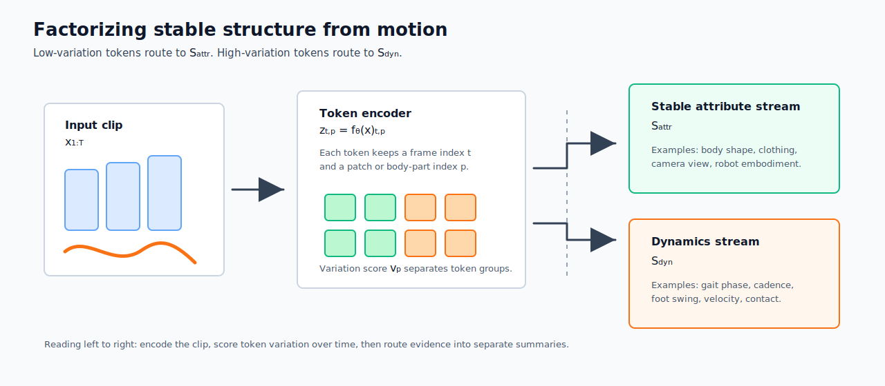
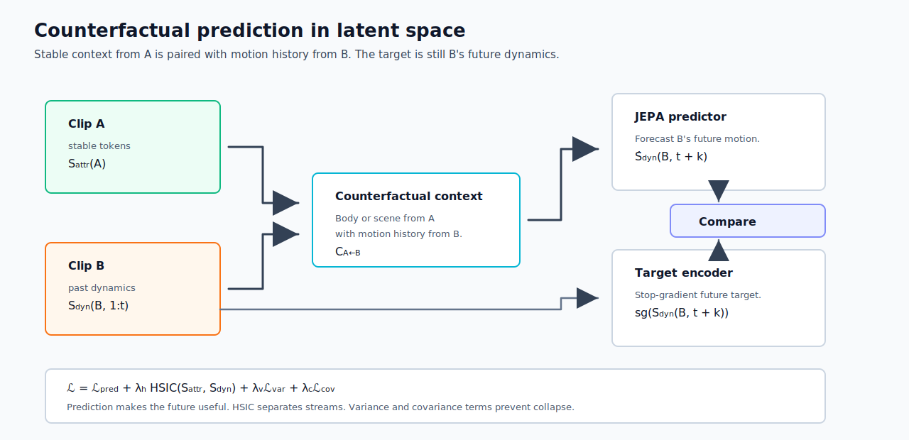
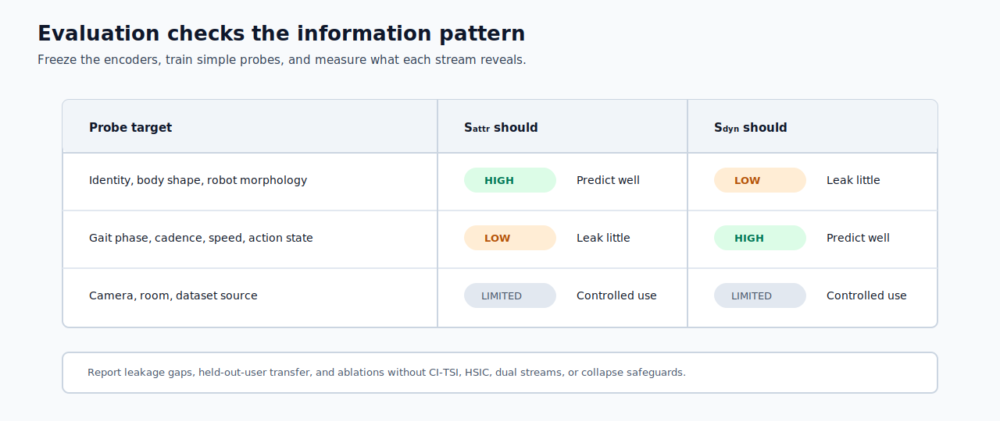

# CoDy-JEPA

**Learning how things move without memorizing who moves.**

CoDy-JEPA (Counterfactual-Dynamical Joint-Embedding Predictive Architecture) learns motion representations from unlabeled video of articulated systems: people walking, hands gesturing, robot arms reaching. It separates what stays the same within a clip (body shape, viewpoint, background) from what changes (pose, gait phase, speed), so the motion representation transfers to new people, cameras, and settings instead of memorizing incidental correlations.

The name describes the core trick. The model is *dynamical* because it splits its representation into a stable stream and a dynamics stream, and *counterfactual* because it trains on deliberately mismatched inputs that pair one clip's appearance with another clip's motion. A predictor that sees person A's body but person B's stride can only succeed by reading the motion itself.

## Where to Go

| If you want to | Read |
| --- | --- |
| Understand the research idea | [The Idea](#the-idea), [Method](#method), [Evaluation](#evaluation) |
| Install the environment and run tests | [Getting Started](#getting-started) |
| Download the dataset and build the manifest | [Data: Health&Gait](#data-healthgait) |
| Train the single-stream prototype | [Training](#training) |
| Evaluate a trained checkpoint | [Evaluating a Checkpoint](#evaluating-a-checkpoint) |
| Find a model, script, or test | [Repository Map](#repository-map) |

## The Idea

Video models can solve the wrong problem for the right score. If one person always appears in one room and walks at one speed, a model may associate the room or the identity with the speed instead of learning gait phase and cadence. This is shortcut learning: the model exploits a correlation that works on a familiar split but fails when the person, camera, or environment changes [6].

CoDy-JEPA addresses this failure mode with two latent streams:

- `S_attr`, the **attribute stream**, represents comparatively stable information such as body proportions, clothing, viewpoint, background, robot morphology, or tool shape.
- `S_dyn`, the **dynamics stream**, represents changing state such as pose transitions, gait phase, cadence, velocity, contact state, or gesture phase.

This split is an inductive bias, not a claim that structure and motion are naturally independent; body shape can constrain gait, for example. Unsupervised data alone cannot guarantee a uniquely disentangled representation [10], so the separation must be tested with leakage probes and transfer experiments. The counterfactual intervention is motivated by the broader goal of organizing representations around causal factors rather than incidental correlations [11].



## Method

CoDy-JEPA combines four mechanisms, each answering one question:

| Step | Mechanism | Question it answers |
| --- | --- | --- |
| 1 | Temporal token routing | Which tokens describe structure, and which describe motion? |
| 2 | CI-TSI counterfactual swapping | How do we stop identity from predicting motion? |
| 3 | Latent future prediction | What is the training signal? |
| 4 | HSIC plus variance and covariance terms | How do the streams stay distinct without collapsing? |

### 1. Encode and route video tokens

For a clip $x_{1:T}$, a video encoder $f_\theta$ produces spatiotemporal tokens

$$
z_{t,p}=f_\theta(x_{1:T})_{t,p},
$$

where $t$ is time and $p$ identifies a patch, joint, body part, or learned token slot. The temporal variation of each slot is

$$
\bar z_p=\frac{1}{T}\sum_{t=1}^{T}z_{t,p}, \qquad
v_p=\frac{1}{T}\sum_{t=1}^{T}\lVert z_{t,p}-\bar z_p\rVert_2^2.
$$

Low-variation tokens are routed toward the attribute encoder $g_a$, and high-variation tokens toward the dynamics encoder $g_d$, using thresholds $\tau_a$ and $\tau_d$:

$$
S_{\text{attr}} = g_a(\left\lbrace z_{t,p}: v_p \le \tau_a \right\rbrace), \qquad
S_{\text{dyn}}(1:t) = g_d(\left\lbrace z_{s,p}: s \le t,\ v_p \ge \tau_d \right\rbrace).
$$

In a gait clip, torso shape may enter the stable stream while alternating foot and knee positions enter the dynamic stream. Temporal variation is only an initial routing signal: a static room can still be a nuisance, and slow movement can still be dynamics. The probes described under [Evaluation](#evaluation) determine whether the learned split is useful.

### 2. Break identity-motion shortcuts

Routing gives each stream its inputs, but as long as both streams come from the same clip, the body and its motion still belong to the same person, and identity can still stand in for motion. The core intervention breaks that link: the **Cross-Instance Token-Swapping Intervention (CI-TSI)**. Given clips A and B from the same broad domain, CoDy-JEPA combines A's stable context with B's motion history:

$$
C_{A\leftarrow B}=[S_{\mathrm{attr}}(A),S_{\mathrm{dyn}}(B,1{:}t)].
$$

The predictor must forecast B's future dynamics:

$$
\hat S_{\mathrm{dyn}}(B,t+k)=q_\psi(C_{A\leftarrow B},k).
$$

If A supplies the body and B supplies the stride rhythm, the association "Person A usually walks slowly" no longer solves the task. The predictor must retain motion from B and use A only as context.



### 3. Predict representations, not pixels

The counterfactual context needs a prediction target, and the choice of target determines what the model is forced to learn. As in JEPA-style learning [1, 2], the target is produced by a slowly updated target encoder. The predictor matches a normalized latent future rather than reconstructing RGB frames:

$$
\mathcal{L}_{\text{pred}} =
\left\lVert \mathrm{norm}(\hat{S}_{\text{dyn}}(B,t+k)) -
\mathrm{sg}\left(\mathrm{norm}(\bar{S}_{\text{dyn}}(B,t+k))\right)\right\rVert_2^2 .
$$

Here `sg` means stop-gradient. Latent prediction lets the objective focus on predictable semantic and physical structure instead of every pixel, which distinguishes it from MAE and VideoMAE, whose targets are reconstructed image or video content [4, 5].

### 4. Separate the streams without collapse

The first three mechanisms define what to predict and from what context, but nothing yet stops the two streams from quietly storing the same information, or from collapsing to constants that make prediction trivially easy. CoDy-JEPA therefore penalizes their statistical dependence with the Hilbert-Schmidt Independence Criterion (HSIC) [7]. For a batch of $n$ clips, let $K$ and $L$ be kernel Gram matrices for `S_attr` and `S_dyn`, and let $H=I_n-\frac{1}{n}\mathbf1\mathbf1^\top$:

$$
\mathrm{HSIC}(S_{\text{attr}},S_{\text{dyn}})=
\frac{1}{(n-1)^2}\mathrm{tr}(KHLH).
$$

Minimizing HSIC discourages the streams from organizing examples in the same way. VICReg-style variance and covariance terms keep dimensions active and reduce within-stream redundancy [8, 9]. The complete objective is

$$
\begin{gathered}
\mathcal{L} = \mathcal{L}_{\text{pred}} \\
{}+ \lambda_h \mathrm{HSIC}(S_{\text{attr}},S_{\text{dyn}}) \\
{}+ \lambda_v \mathcal{L}_{\text{var}} \\
{}+ \lambda_c \mathcal{L}_{\text{cov}} .
\end{gathered}
$$

Each term has a distinct job: predict future motion, reduce cross-stream overlap, prevent constant representations, and avoid redundant latent dimensions.

## Evaluation

Training loss alone cannot show that the streams learned the intended information. After pretraining, both encoders are frozen and linear or shallow probes are fit:

| Probe target | Desired `S_attr` result | Desired `S_dyn` result |
| --- | --- | --- |
| Subject identity or body shape | High | Low |
| Robot morphology or tool shape | High | Low |
| Gait phase, cadence, or speed | Low | High |
| Action or contact state | Low | High |
| Camera, room, or dataset source | Measure and control | Low |

The central measurement is the **leakage gap**: `S_dyn` should predict motion variables well and identity variables poorly. Transfer probes are trained on one set of subjects, views, or embodiments and evaluated on held-out ones.

The key comparisons remove one mechanism at a time:

| Variant | What it tests |
| --- | --- |
| Single-stream JEPA predictor | Whether the dual-stream design matters at all (see also MC-JEPA's motion-content separation [3]) |
| Dual stream without CI-TSI | Whether counterfactual swapping, not just the architecture, reduces leakage |
| CoDy-JEPA without HSIC | Whether explicit independence pressure adds anything beyond swapping |
| CoDy-JEPA without variance and covariance safeguards | Whether independence pressure alone drives the streams toward collapse |

A strong result combines competitive future-dynamics prediction, less wrong-stream leakage, and better low-label transfer. A result in which swapping reduces identity leakage but harms motion prediction is also informative, because it exposes the separation-performance tradeoff directly.



## Typical Workflow

Everything below this point is practical. The sections form one pipeline, run in this order:

| Step | Command or entry point | Details in |
| --- | --- | --- |
| 1. Install the locked environment | `uv sync --frozen` | [Getting Started](#getting-started) |
| 2. Run the tests (no dataset needed) | `uv run python -m unittest discover -s tests -v` | [Getting Started](#getting-started) |
| 3. Download Health&Gait and build the manifest | `uv run python scripts/build_healthgait_manifest.py` | [Data: Health&Gait](#data-healthgait) |
| 4. Submit or run train-to-report | `uv run python scripts/run_phase0_pipeline.py ...` | [Training](#training) |
| 5. Inspect the hashed compact report | `reports/*.md` plus adjacent JSON | [Evaluating a Checkpoint](#evaluating-a-checkpoint) |

## Getting Started

### Requirements

- Git
- [uv](https://docs.astral.sh/uv/)
- Python 3.10 or newer; `uv` creates and manages the project environment

### Install

```bash
git clone https://github.com/theodoremui/cody-jepa.git
cd cody-jepa
uv sync --frozen
```

The project uses `uv` exclusively. Run tools through `uv run`, change dependencies with `uv add` or `uv remove`, and regenerate the lock with `uv lock`. Do not use pip, Conda, or Poetry here.

### Run the tests

```bash
uv run python -m unittest discover -s tests -v
```

The tests use generated fixtures, so they do not require the Health&Gait dataset.

## Data: Health&Gait

### Download and extract

The dataset is not distributed with this repository. Download the [Health&Gait v1.0 dataset from Zenodo](https://doi.org/10.5281/zenodo.14039922). The full dataset is a 26.8 GB multipart archive: `Health_Gait.z01` through `Health_Gait.z25` plus `Health_Gait.zip`. Keep every part in the same directory and extract from `Health_Gait.zip` into `data/healthgait/raw/`.

After extraction, silhouette trials should follow this structure:

```text
data/healthgait/raw/Health_Gait/
└── silhouette/
    └── PA000/
        ├── FGS/
        │   └── WJ_1_YOLOV8/
        │       ├── 001.jpg
        │       └── ...
        └── UGS/
            └── ...
```

`FGS` and `UGS` denote fast and usual gait speed.

### Build the manifest

Once the frames are in place, build a deterministic, subject-disjoint train/validation manifest:

```bash
uv run python scripts/build_healthgait_manifest.py
```

The script writes:

- `data/healthgait/manifests/silhouette_subject_split_seed0.csv`
- metadata summaries under `data/healthgait/diagnostics/`

The manifest records one trial per row: subject, modality, gait system, trial, frame directory, frame count, and split. Keeping the split in a manifest makes the experiment auditable and prevents the same subject from appearing in both training and validation.

### What the pipeline guarantees

`HealthGaitManifestDataset` validates the full manifest before yielding samples. It rejects:

- missing required columns or unsupported split names;
- missing frame directories;
- differences between declared and actual frame counts;
- trials shorter than the requested clip length;
- empty training or validation splits; and
- subjects shared between training and validation.

Each sample is a normalized grayscale tensor shaped `[T, C, H, W]` plus its source metadata. Frames are loaded lazily, so the full dataset is never held in memory.

### Load a batch

```python
from pathlib import Path

from cody_jepa.data import HealthGaitLoaderConfig, build_healthgait_loaders_from_config

root = Path.cwd()
config = HealthGaitLoaderConfig(
    manifest_csv=root / "data/healthgait/manifests/silhouette_subject_split_seed0.csv",
    repo_root=root,
    clip_length=16,
    image_size=(224, 224),
    batch_size=4,
    seed=0,
)

train_loader, val_loader = build_healthgait_loaders_from_config(config)
batch = next(iter(train_loader))

print(batch["video"].shape)  # [B, T, C, H, W] = [4, 16, 1, 224, 224]
print(batch["video"].min().item(), batch["video"].max().item())  # 0.0 to 1.0
```

The default policy selects deterministic pseudo-random windows for training and center windows for validation. A training loop should call `train_loader.dataset.set_epoch(epoch)` at the start of each epoch to change training windows reproducibly. Subject and trial metadata are provided for diagnostics; they are not labels for the self-supervised objective.

### Explore the pipeline in a notebook

```bash
uv run jupyter lab notebooks/healthgait_manifest_loader.ipynb
```

The notebook walks through manifest validation, train and validation datasets, `[B, T, C, H, W]` batches, deterministic temporal-window sampling, clip contact sheets, frame-difference diagnostics, and motion-energy summaries.

## Training

The runnable trainer in this repository is the single-stream JEPA baseline: the shared masked-prediction infrastructure that the dual-stream mechanisms in the [Method](#method) section build on. The production entry point is [`scripts/run_phase0_pipeline.py`](scripts/run_phase0_pipeline.py); it trains, validates a declared checkpoint, exports features, runs all probes, and writes a compact Markdown/JSON report. The notebook remains the experiment controller used by that entry point and for interactive exploration.

Checkpoint compatibility is identified by `MODEL_ARCHITECTURE = "cody-jepa-single-stream-masked-v3"` and `CHECKPOINT_SCHEMA = 4`. Schema 4 commits model-state fingerprints and training-time selections; the exact retained Phase 0 schema-3 checkpoints remain readable only through their hash-locked protocol. These identifiers are independent of experiment directory names such as `outputs/jepa-v4` and `outputs/jepa-v5`: bump the architecture only for an incompatible model/state-dict change, and bump the schema only when the serialized checkpoint payload changes.

```bash
uv run jupyter lab notebooks/single-stream-jepa.ipynb
```

Run a fresh pipeline in an existing local GPU allocation with explicit destinations and checkpoint policy:

```bash
uv run python scripts/run_phase0_pipeline.py run \
  --run-dir outputs/jepa-v5 \
  --artifact-dir outputs/pipeline/jepa-v5 \
  --report reports/jepa-v5.md \
  --checkpoint-name best_loss.pt \
  --device cuda \
  --success-criterion "Named scientific change: pass the predeclared Phase 1 health gate" \
  --allow-local-run
```

On HAIC, use the same entry point from the head node. It submits the full workflow; training, feature export, and probes execute inside the Slurm allocation:

```bash
uv run python scripts/run_phase0_pipeline.py submit \
  --run-dir outputs/jepa-v5 \
  --artifact-dir outputs/pipeline/jepa-v5 \
  --report reports/jepa-v5.md \
  --checkpoint-name best_loss.pt \
  --success-criterion "Named scientific change: pass the predeclared Phase 1 health gate"
```

Every destination must be fresh. The workflow rejects all `outputs/jepa-v3` paths and every write under the read-only `outputs/jepa-v4` baseline.

Phase 0 itself has a frozen, checked-in contract. This command creates distinct
MPS reference exports for both retained checkpoints, reruns all three probes,
and writes a verified report into a unique ignored directory under
`outputs/phase0/regenerations/`:

```bash
uv run python scripts/run_phase0_pipeline.py baseline
```

The command prints the fresh artifact and report paths. To verify the locked
artifacts and deliberately refresh the checked-in compact report without
re-exporting features, run:

```bash
uv run python scripts/run_phase0_pipeline.py baseline-report \
  --artifact-dir outputs/phase0/job-91108 \
  --report reports/phase0-baseline.md
```

The immutable contract is `protocols/phase0-baseline.json`; large feature and
probe artifacts remain under ignored `outputs/phase0/`, while the compact report
is versioned at `reports/phase0-baseline.md` with adjacent machine-readable JSON.

The notebook is safe by default. With no environment flags, `Run All` validates the configured Health&Gait data and executes a one-step synthetic CPU smoke test. A real training run requires a CUDA worker and is deliberately opt-in through these controls:

| Environment variable | Default | Purpose |
| --- | --- | --- |
| `CODY_JEPA_RUN_FULL_TRAINING` | `0` | Set to `1` to run the full CUDA training path after the real-batch CUDA preflight. |
| `CODY_JEPA_RUN_DATA_AUDIT` | `1` for preflight, `0` for full training | Runs the all-sequence clip-quality audit separately from expensive GPU training. |
| `CODY_JEPA_RUN_EXHAUSTIVE_DATA_AUDIT` | `0` | Verifies and hashes every frame. Use as a separate CPU/I/O certification job. |
| `CODY_JEPA_OUTPUT_DIR` | `outputs/jepa-v5` | Selects the checkpoint directory. A new run refuses to overwrite an existing `latest.pt`. |
| `CODY_JEPA_RESUME_CHECKPOINT` | unset | Resumes from an explicit epoch-boundary checkpoint after validating its model and data contract. |

The trainer uses multiblock tube masking, an online context encoder, an exponential-moving-average target encoder, and a predictor. It supports BF16, gradient accumulation, optional `torch.compile`, target batch standardization, and VICReg-style variance and covariance safeguards. Validation reports prediction metrics, feature variance and effective rank, and a seeded wrong-subject context-shuffle gap. Every run writes `latest.pt` and `best_loss.pt`; `best_healthy.pt` is written only when the representation-health checks pass.

For production H100 settings, submission commands, monitoring, the resume procedure, and troubleshooting, follow the [HAIC training guide](tutorials/haic-guide.md). The checked-in [Slurm script](slurm/train-single-stream-jepa.sbatch) is the source of truth for scheduler resources and environment flags.

## Evaluating a Checkpoint

The orchestration entry point evaluates one completed checkpoint and produces a compact, hashed report:

```bash
uv run python scripts/run_phase0_pipeline.py evaluate \
  --checkpoint outputs/<run>/best_loss.pt \
  --completed-run-checkpoint outputs/<run>/latest.pt \
  --artifact-dir outputs/pipeline/<run> \
  --report reports/<run>.md \
  --device auto
```

The terminal checkpoint is mandatory provenance: evaluation proves the selected
checkpoint has the same configuration, mask, architecture, data contract, and
history prefix as the genuinely completed run. The flag defaults to the
selected checkpoint's sibling `latest.pt` when both files share a directory.

The lower-level two-stage commands remain available for diagnosis:

```bash
uv run python scripts/export_single_stream_features.py \
  --checkpoint outputs/<run>/best_loss.pt \
  --output outputs/pipeline/<run>/features.npz \
  --device auto

uv run python scripts/eval_probes.py \
  --features outputs/pipeline/<run>/features.npz \
  --output-dir outputs/pipeline/<run>/probes
```

The exporter restores only the EMA target encoder, freezes it, switches it to evaluation mode, and runs under `torch.inference_mode()`. Each deterministic clip window becomes one row containing its manifest metadata and the mean-pooled, pre-final-LayerNorm target tokens. It accepts `.csv` or compressed `.npz` output; both carry a JSON provenance sidecar with the checkpoint hash and the exact feature formula.

The probe evaluator reports three protocols: a sequence-disjoint closed-set identity classifier over training subjects, nearest-centroid identity retrieval over separately enrolled validation subjects, and a `gait_system` linear classifier trained on training subjects and evaluated on subject-disjoint validation subjects. `probe_metrics.csv` is a compact, one-row-per-task scalar summary; `probe_metrics.json` is the canonical full-detail artifact containing class labels, confusion matrices, protocol settings, and provenance. Balanced accuracy is the primary gait metric. Use [`notebooks/linear-probe-results.ipynb`](notebooks/linear-probe-results.ipynb) to validate, compare, and visualize these artifacts.

```bash
uv run jupyter lab notebooks/linear-probe-results.ipynb
```

Without `CODY_JEPA_PROBE_DIR`, the notebook reads the canonical clean Phase 0
artifacts at `outputs/phase0/job-91108/best_loss/probes`.

## Repository Map

### End-to-end code flow

```text
Health&Gait frames
    │
    ├─ scripts/build_healthgait_manifest.py
    │      └─ subject-disjoint CSV + metadata summaries
    │
    ├─ cody_jepa.data
    │      └─ validated datasets → deterministic DataLoaders → diagnostics
    │
    ├─ scripts/run_phase0_pipeline.py
    │      └─ local or Slurm training → checkpoint validation → export → probes → report
    │
    ├─ notebooks/single-stream-jepa.ipynb
    │      └─ training controller invoked inside the allocation
    │
    ├─ scripts/export_single_stream_features.py
    │      └─ frozen EMA-target features + provenance sidecar
    │
    └─ scripts/eval_probes.py
           └─ identity and gait-system metrics in JSON + CSV
```

### Directories

| Path | Contents |
| --- | --- |
| `src/cody_jepa/` | Tested library code: model, masking, training, probes, and the data pipeline |
| `scripts/` | One train-to-report entry point plus lower-level manifest, export, and probe tools |
| `notebooks/` | Data-pipeline walkthrough and the training controller |
| `slurm/` | HAIC H100 batch job definition |
| `tutorials/` | Operator runbooks and research plans |
| `tests/` | Unit tests; run without the dataset |
| `images/` | Method and evaluation figures |
| `data/` (untracked) | Health&Gait frames, manifests, and diagnostics |
| `outputs/` (untracked) | Checkpoints, exported features, and probe reports |

The notebooks are entry points for exploration and orchestration; the reusable, tested implementation lives under `src/cody_jepa/`, and command-line workflows live under `scripts/`.

## References

[1] Mahmoud Assran et al. [Self-Supervised Learning from Images with a Joint-Embedding Predictive Architecture](https://arxiv.org/abs/2301.08243). 2023.

[2] Adrien Bardes et al. [Revisiting Feature Prediction for Learning Visual Representations from Video](https://arxiv.org/abs/2404.08471). 2024.

[3] Adrien Bardes, Jean Ponce, and Yann LeCun. [MC-JEPA: A Joint-Embedding Predictive Architecture for Self-Supervised Learning of Motion and Content Features](https://arxiv.org/abs/2307.12698). 2023.

[4] Kaiming He et al. [Masked Autoencoders Are Scalable Vision Learners](https://arxiv.org/abs/2111.06377). 2021.

[5] Zhan Tong et al. [VideoMAE: Masked Autoencoders are Data-Efficient Learners for Self-Supervised Video Pre-Training](https://arxiv.org/abs/2203.12602). 2022.

[6] Robert Geirhos et al. [Shortcut Learning in Deep Neural Networks](https://arxiv.org/abs/2004.07780). 2020.

[7] Arthur Gretton et al. [Kernel Methods for Measuring Independence](https://www.jmlr.org/papers/v6/gretton05a.html). 2005.

[8] Adrien Bardes, Jean Ponce, and Yann LeCun. [VICReg: Variance-Invariance-Covariance Regularization for Self-Supervised Learning](https://arxiv.org/abs/2105.04906). 2021.

[9] Jure Zbontar et al. [Barlow Twins: Self-Supervised Learning via Redundancy Reduction](https://arxiv.org/abs/2103.03230). 2021.

[10] Francesco Locatello et al. [Challenging Common Assumptions in the Unsupervised Learning of Disentangled Representations](https://arxiv.org/abs/1811.12359). 2018.

[11] Bernhard Schölkopf et al. [Towards Causal Representation Learning](https://arxiv.org/abs/2102.11107). 2021.
