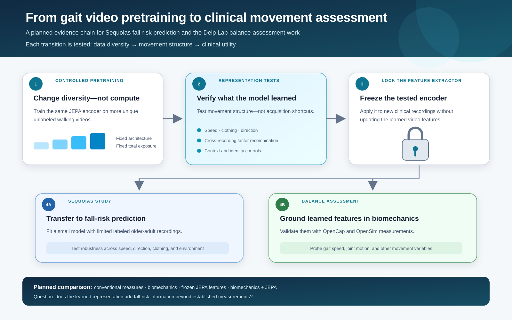
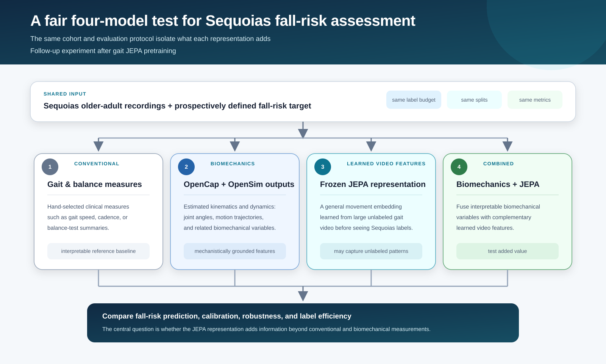

# Planned clinical applications of Cody-JEPA

The proposed work connects four ideas that have usually been studied separately:
large-scale unlabeled gait pretraining, controlled scaling of unique training videos,
factor recombination across independent recordings, and transfer to clinical movement
assessment. The core experiment holds model architecture and total training exposure
fixed while increasing the number of unique walking sequences. It then tests whether
the learned representation captures temporal movement structure instead of relying on
identity, body shape, clothing, clip duration, or camera setup.

The closest foundations are [GaitLU/GaitSSB](https://arxiv.org/abs/2206.13964) for
million-video gait pretraining, [Cosma et al.](https://ojs.aaai.org/index.php/AAAI/article/view/37340)
for gait scaling, [Hu et al.](https://openaccess.thecvf.com/content_cvpr_2018/html/Hu_Disentangling_Factors_of_CVPR_2018_paper.html)
and [Li et al.](https://ieeexplore.ieee.org/document/9156701) for feature-factor mixing,
and [GaitForeMer](https://arxiv.org/abs/2207.00106) plus
[self-supervised gait biomarkers](https://arxiv.org/abs/2307.16321) for clinical transfer.
The proposed contribution is to combine these directions in one controlled program.

For the Stanford HAI Sequoias study, a frozen pretrained encoder could turn each
older-adult video into a general movement representation before a small supervised
fall-risk model is fitted. The transfer study would test whether those features remain
useful across changes in speed, direction, clothing, and recording environment; whether
they separate stable identity cues from movement changes; and whether they improve
prediction when labeled clinical recordings are scarce.

For Professor Scott Delp's balance-assessment work, JEPA would complement rather than
replace OpenCap and OpenSim. OpenCap/OpenSim variables can ground the learned embedding
by testing whether it predicts gait speed, joint motion, and other biomechanical
quantities. The learned video representation may also retain clinically relevant
patterns that were not explicitly labeled as biomechanical variables.

A follow-up Sequoias experiment would compare four models under the same participant
splits, label budget, prediction target, and metrics: (1) conventional gait and balance
measures, (2) OpenCap/OpenSim biomechanics, (3) the frozen JEPA video representation,
and (4) a combined biomechanics-plus-JEPA model. This comparison would determine whether
the learned representation adds fall-risk information beyond established measurements.

These are planned applications and experiments. The current Cody-JEPA study is intended
to establish the representation and its controls; it does not yet claim improved
clinical prediction.
