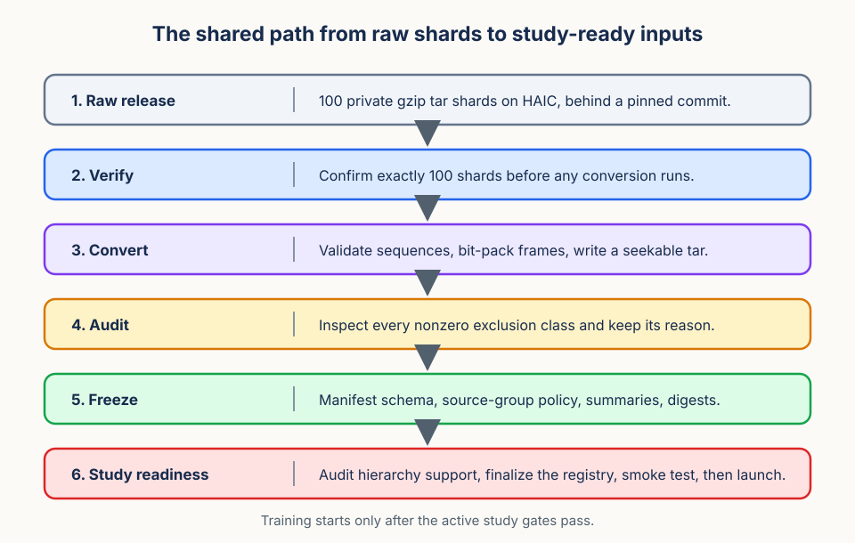

# GaitLU Preparation Runbook

This runbook explains the current repository path from the private GaitLU shard
release to a validated prepared corpus. GaitLU is the current pretraining data
instance for the hierarchical diversity method. The method itself is broader:
prepare a source-safe video corpus, freeze a phase-aware allocation registry,
train JEPA encoders at fixed exposure, then evaluate frozen representations with
a factorial completion instrument.



## 1. Pin the Code on HAIC

Data and prepared artifacts stay on HAIC. Git transfers code, not private data.
Before conversion, use an immutable commit or annotated tag.

```bash
ssh YOUR_SUNET@haic.stanford.edu

export CODY_JEPA_ROOT="/hai/scratch/$USER/cody-jepa"
export GAITLU_DATA_ROOT="$CODY_JEPA_ROOT/data/gaitlu-1m"
export GAITLU_RAW_ROOT="$GAITLU_DATA_ROOT/shards"
export GAITLU_PREPARED_ROOT="$GAITLU_DATA_ROOT/prepared"
export PREP_LOG_ROOT="$GAITLU_DATA_ROOT/logs/prepare-shards"
export GAITLU_SOURCE_GROUPS_CSV="$GAITLU_DATA_ROOT/private/source-groups.csv"
export GAITLU_PREPARATION_REF="REPLACE_WITH_IMMUTABLE_COMMIT_OR_TAG"

cd "$CODY_JEPA_ROOT"
git fetch --tags origin
git switch --detach "$GAITLU_PREPARATION_REF"
git status --short
git rev-parse HEAD
uv sync --frozen
```

The working tree must be clean before producing study artifacts.

## 2. Verify the Raw Release

Check the input before converting any shard.

```bash
find "$GAITLU_RAW_ROOT" -maxdepth 1 -name 'gaitlu-*.tar.gz' | sort | wc -l
tar -tzf "$GAITLU_RAW_ROOT/gaitlu-000.tar.gz" | sed -n '1,40p'
```

The shard count must be `100`. The complete containing path is a sequence key,
not a verified person identity. Use `--trust-pickles` only for the official trusted
release, because pickle loading can execute code.

## 3. Convert All Shards

Conversion streams each gzip tar, validates sequences, packs binary-looking
silhouettes into seekable records, and writes one inventory per shard. Invalid
sequences remain visible with exclusion reasons.

```bash
mkdir -p "$GAITLU_PREPARED_ROOT" "$PREP_LOG_ROOT"
cd "$CODY_JEPA_ROOT"
bash slurm/prepare-gaitlu-shards.sbatch
```

Run the launcher from a HAIC login node, preferably inside tmux. The launcher
submits bounded worker groups. Do not run conversion workers directly on the
login node.

For a one-shard smoke conversion, use a separate output root so production
preparation remains untouched:

```bash
uv run --frozen --no-sync cody-jepa-prepare-gaitlu pack-shard \
  --input "$GAITLU_RAW_ROOT/gaitlu-000.tar.gz" \
  --prepared-root "$GAITLU_DATA_ROOT/pilot-prepared" \
  --trust-pickles
```

## 4. After Conversion Completes

Do not move straight from converted shards to training. First prove that the
prepared root is complete and readable.

```bash
find "$GAITLU_PREPARED_ROOT/shards" -maxdepth 1 -name 'gaitlu-*.tar' | sort | wc -l
find "$GAITLU_PREPARED_ROOT/inventories" -maxdepth 1 -name 'gaitlu-*.csv' | sort | wc -l
find "$GAITLU_PREPARED_ROOT/inventories" -maxdepth 1 -name 'gaitlu-*.summary.json' | sort | wc -l
find "$GAITLU_PREPARED_ROOT" \( -name '*.tmp' -o -name '.*.tmp' \)
```

The first three counts must be `100`, and the final command should print
nothing. Then inspect logs for hard failures:

```bash
rg -n "Traceback|Error|Exception|FileExistsError|ValueError|PermissionError" "$PREP_LOG_ROOT"
```

If a shard failed, rerun that shard exactly. Do not delete or overwrite
successful shard artifacts unless you intentionally restart preparation from an
empty prepared root.

Next, review the exclusion summaries. Every nonzero exclusion class needs a
plain-language reason before the prepared root is frozen. Do not relax a
validation threshold simply to recover a larger count.

```bash
uv run --frozen --no-sync python - <<'PY'
import csv
import json
import os
from collections import Counter
from pathlib import Path

root = Path(os.environ["GAITLU_PREPARED_ROOT"])
totals = Counter()
for path in sorted((root / "inventories").glob("gaitlu-*.summary.json")):
    record = json.loads(path.read_text())
    totals["sequences"] += int(record["sequences"])
    totals["valid_sequences"] += int(record["valid_sequences"])
    totals["excluded_sequences"] += int(record["excluded_sequences"])
    totals["unique_records_in_shard"] += int(record["unique_records_in_shard"])
print(dict(totals))

reasons = Counter()
for path in sorted((root / "inventories").glob("gaitlu-*.csv")):
    with path.open(newline="") as handle:
        for row in csv.DictReader(handle):
            if row["valid"] != "true":
                reasons[row["exclusion_reason"]] += 1
for reason, count in reasons.most_common():
    print(count, reason)
PY
```

Freeze the post-conversion evidence only after those checks pass. At this
point, do not run a study finalizer from the current command set. The active
study still needs an inventory-only finalizer that writes the prepared inventory
for the phase-allocation path without writing any training registry. Until that
command exists and is pinned to a code ref, the safe stopping point is the
audited shard set below.

```bash
test -s "$GAITLU_SOURCE_GROUPS_CSV"
wc -l "$GAITLU_SOURCE_GROUPS_CSV"

cd "$GAITLU_PREPARED_ROOT"
find inventories -maxdepth 1 -name 'gaitlu-*.csv' -print0 \
  | sort -z \
  | xargs -0 sha256sum > shard-inventory-digests.sha256
find inventories -maxdepth 1 -name 'gaitlu-*.summary.json' -print0 \
  | sort -z \
  | xargs -0 sha256sum > shard-summary-digests.sha256
find shards -maxdepth 1 -name 'gaitlu-*.tar' -print0 \
  | sort -z \
  | xargs -0 sha256sum > shard-tar-digests.sha256
sha256sum "$GAITLU_SOURCE_GROUPS_CSV" > source-groups.sha256
git -C "$CODY_JEPA_ROOT" rev-parse HEAD > preparation-code-ref.txt
```

If the source-group map is missing, stop. Source grouping is part of the
scientific boundary, not an optional convenience. Treat the shard inventories,
conversion summaries, source-group map, preparation logs, code ref, and file
digests as the frozen post-conversion record. The active inventory finalizer
must consume this record, write `$GAITLU_PREPARED_ROOT/inventory.csv`, and stop
if any digest or expected shard count disagrees.

## 5. Build The Study Readiness Package

The active study may start only after the 28-row phase-allocation registry exists
and passes the gates in [the execution plan](hierarchical-diversity/execution-plan.md).
The registry must contain eight breadth rows, eight balanced rows, eight
phase-depth rows, and four prespecified nearby-jitter rows. Every row must carry
the allocation, sequence count, origins per sequence, origin policy, nominal
catalog size, exposure, phase-catalog digest, source-group digest, seeds, stream
versions, manifest digest, and checkpoint rule.

Before launch, complete these steps:

1. Build and freeze the active prepared inventory from the post-conversion
   record.
2. Freeze the phase catalog from that prepared inventory.
3. Audit common `k = 4` eligibility, source groups, near duplicates, origin
   coverage, window overlap, and phase separation from nearby jitter.
4. Generate the 28-row registry and validate that every model row resolves to
   exactly one training manifest and one validation or holdout manifest.
5. Run a smoke training job from a separate pilot output root.
6. Select the exposure tier once through the throughput gate.
7. Launch the 28 production rows only after the smoke job, registry validation,
   and software dry run pass.

Production training depends on the active inventory finalizer, 28-row registry
finalizer, and matching launcher. Until those gates pass, stop at the frozen
post-conversion record. After the active inventory exists, stop at the prepared
inventory and readiness audit until the 28-row registry gate passes.

## 6. Training Gate And Launcher Contract

Do not treat shard conversion as approval to train. The active study needs a
launcher that reads the 28-row phase-allocation registry described above. A
training entry point is ready for this study only after a dry run proves that it
enforces the active registry contract end to end.

The dry run must verify:

1. The registry contains exactly 28 rows.
2. The allocation counts are eight breadth rows, eight balanced rows, eight
   phase-depth rows, and four nearby-jitter diagnostic rows.
3. Every row resolves to one training manifest and one validation or holdout
   manifest.
4. Every manifest digest matches the registry before training starts.
5. The selected exposure tier is identical for every production row.
6. The run index maps only to registry rows `0` through `27`.
7. A smoke run can train one row from a disposable output root and produce the
   expected provenance files.

The full exposure config processes 8,192,000 clips. The half exposure config
processes 4,096,000 clips. Pick one tier after the throughput gate and keep it
fixed across the entire 28-row study.

Until the active inventory finalizer, 28-row registry reader, registry finalizer,
launcher, and smoke path all pass these checks, do not start production
training. Do not point a training command at the active registry before this
gate is complete.

## Failure Rules

- Preparation refuses to overwrite existing converted shard artifacts.
- Registry finalization must refuse to overwrite an existing study registry.
- Training refuses to overwrite an existing model output directory.
- Training fails if config exposure disagrees with registry exposure.
- Training fails if the final step is not reached or `latest.pt` is missing.
- Resume, feature export, and evaluation must stop on any provenance mismatch.

Prepared GaitLU artifacts remain private. Do not publish raw recordings,
participant tables, embeddings, identity-capable checkpoints, participant-level
outputs, or private filesystem paths.
