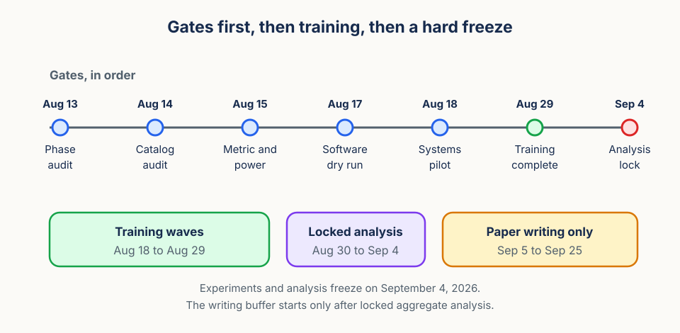

# Execution plan: 28-model iso-catalog phase-allocation study

## Objective

Execute the study defined in [proposal.md](proposal.md) and [method.md](method.md), then stop all experiments and analysis by September 4, 2026. The ICLR 2027 abstract deadline is September 18 and the paper deadline is September 25, so September 5 through September 25 are reserved for writing only.

Everything below exists to make that date reachable without loosening the protocol under time pressure.

## Starting point

The active study needs five production artifacts before training can begin: a phase catalog,
a 28-row registry, a phase-aware loader, a validated outcome instrument, and a matching
analysis path. The work packages below build those artifacts in order.

## Gates

Nothing trains until every gate passes. Each gate names the evidence it needs and what happens if that evidence does not arrive.

| Gate | Deadline | Required evidence | Failure action |
| --- | --- | --- | --- |
| Phase audit | Aug 13 | Frozen estimator, common `k=4` eligibility, blinded manual check, semantic separation from jitter | Stop before training |
| Catalog audit | Aug 14 | Source groups, near-duplicate clusters, feasible common `M`, nested-pool rule | Lower `M` once prospectively or stop before training |
| Metric and power audit | Aug 15 | Synthetic GFC and control cases plus an outcome-blind MDE estimate | Do not launch an underpowered contrast |
| Software dry run | Aug 17 | 28-row registry, loader, provenance, analysis, figures, synthetic controls | Stop before training |
| Systems pilot | Aug 18 | Small GPU pilot and eight-job storage probe at checkpoint cadence | Select frozen half exposure or cancel |
| Training completion | Aug 29 | All 28 rows plus only permitted exact systems reruns | No seed replacement or opportunistic cell dropping |
| Analysis lock | Sep 4 | Final checkpoints, aggregate export, figures, audit report | Enter the paper-only period |

The failure actions are the point of the table. Each one is a prepared retreat rather than an invitation to improvise, which is what keeps the schedule honest.

## Work packages

The four packages below map onto the gates in order.

### Build the phase catalog

This package produces the evidence for the phase and catalog audits.

- Implement deterministic stride-period estimation from the frozen silhouette signal.
- Store eligibility, the stable base-phase rotation, the nested `k = 1/2/4` origins, and the nearby-jitter origins in a hashed catalog.
- Audit bounds, overlap, phase coverage, trajectory separation, and failure reasons.
- Build source-group and near-duplicate cluster summaries before any pool is selected.

### Replace the registry and loader contract

The catalog is only useful once the registry can address it, and the loader can honor it.

- Define the `breadth`, `balanced`, `phase_depth`, and `nearby_jitter` cells.
- Require `unique_sequences`, `origins_per_sequence`, `nominal_catalog_size`, `origin_policy`, `phase_catalog_digest`, the source-group digest, and the cluster summary in every row.
- Generate eight blocks for the three primary cells, and nearby jitter only in the four prespecified blocks.
- Pair the optimization, sequence, spatial, and mask streams. In the phase-versus-jitter comparison, only the semantic origin construction may differ.
- Make resume and export fail closed on any provenance mismatch.

### Lock the evaluator

The instrument has to be validated before it can see a study model, which is what the metric and power audit checks.

- Implement the matched eight-gallery continuous margin for both GFC and independent completion.
- Run the synthetic positive and negative controls before any outcome is opened.
- Freeze aggregation, competing gallery items, top-1, MRR, missing-data handling, and the eight paired `P_r` contrasts.
- Implement the supporting cross-context factor-transport geometry diagnostic.

### Train and report

Only after the four audits and the systems pilot does training begin.

- Select full or half exposure only through the throughput rule, and apply the result to every model.
- Train paired block waves with cell-to-hardware randomization.
- Save complete checkpoint provenance and produce the locked figure showing all replicate trajectories, the balanced point, and the paired jitter diagnostics.
- Report nominal catalog cardinality beside the measured semantic diagnostics, never on its own.

## Calendar

| Dates | Deliverable |
| --- | --- |
| Aug 11 to 13 | Phase and near-duplicate audits, common eligibility decision |
| Aug 13 to 15 | Catalog freeze, metric synthetic tests, MDE audit |
| Aug 14 to 17 | Registry, loader, provenance, analysis, and figure dry run |
| Aug 18 to 25 | Primary training waves |
| Aug 26 to 29 | Permitted systems reruns, final export, audit completion |
| Aug 30 to Sep 4 | Locked aggregate analysis and figures |
| Sep 5 to 17 | Paper only |
| Sep 18 | Abstract submission |
| Sep 19 to 24 | Paper only: anonymization, reproducibility, final checks |
| Sep 25 | Paper submission |

## Non-goals for this cycle

The calendar only closes if these stay off the critical path.

- No second dataset, RGB replication, architecture sweep, objective sweep, or `k = 8` ladder.
- No claim of a general allocation frontier from three correlated path points.
- No post-outcome changes to eligibility, phase thresholds, jitter offsets, the metric, or the allocations.
- No downstream-use conclusion from this representation study.

## Training-start checklist

Do not submit a training job until all six artifacts below are frozen and validated.

1. A versioned phase catalog records sequence eligibility, period estimate, confidence,
   base phase, nested semantic origins, nearby-jitter origins, and a digest.
2. A source-group and near-duplicate audit establishes the common pool-size rule.
3. The registry has exactly 28 rows: eight breadth, balanced, and phase-depth rows per
   block, plus nearby jitter only in the four prespecified blocks.
4. Every registry row records allocation, sequence count, origins per sequence, nominal
   catalog size, origin policy, manifest digest, phase-catalog digest, source-group digest,
   exposure, seeds, stream versions, and checkpoint rule.
5. The continuous GFC and independent-completion instrument passes its synthetic controls.
6. The exposure tier is selected once by the throughput rule and applies to every row.

The phase-depth versus nearby-jitter pair needs one extra condition. Its sequence draws, base
phases, masks, spatial transforms, optimization seeds, exposure, and checkpoint rules are all
paired. Only phase separation versus local jitter may change between the two. Resume, feature
export, and evaluation reject any provenance mismatch rather than inferring missing metadata.

Stop rather than patch around a failure. That applies when phase separation fails, when the
common eligible pool cannot be built, when the metric fails synthetic controls, when the MDE is
not useful, when throughput is unstable, or when provenance cannot be validated. The only
permitted reruns are exact systems failures defined before training started. Seed replacement
and selective extra training are never permitted.
