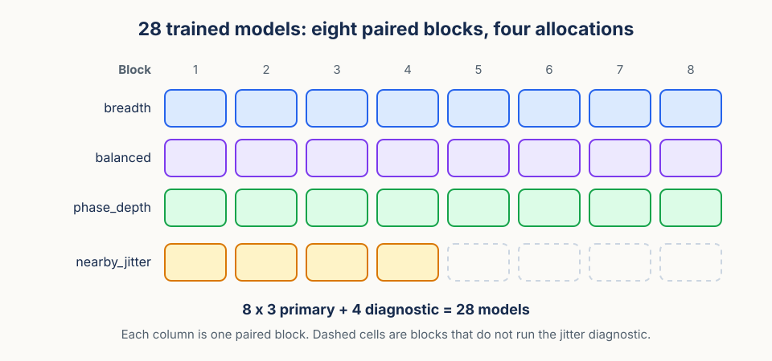
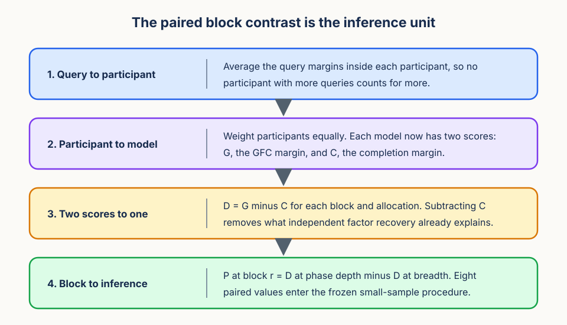

# Method: iso-catalog phase allocation in video self-supervised learning

This document is the frozen protocol. [proposal.md](proposal.md) explains why the question is worth asking. Here we fix exactly what is built, what is held constant, what is measured, and what may be said afterwards.

## Claim boundary

Start with the boundary, because it constrains every choice that follows.

The method tests whether the hierarchical location of video diversity changes learned representations under fixed compute and fixed nominal catalog cardinality. It compares new sequences against phase-separated views of fewer sequences. It does not estimate a universal sequence-to-clip exchange rate.

All inference is conditional on the chosen corpus, representation objective, architecture, phase signal, and evaluator. The current implementation uses a JEPA objective and silhouette-derived phase signal, but the protocol is written so future JEPA studies can replace those parts without changing the analysis logic. What the design buys is reproducibility over paired optimization, stable phase rotations, and pool ordering. It buys nothing beyond that. In particular, sequence IDs must not be called people, walks, cameras, or environments without verification, because the source key alone does not prove that identity.

## Treatment construction

### Common eligibility

Every cell must draw from the same corpus, or a difference in outcome could be a difference in raw material.

For each validated sequence, estimate the stride period and a confidence using a documented frozen phase signal. In the current implementation this can be a silhouette-derived signal such as width or area autocorrelation. Then apply one outcome-blind rule over confidence, coverage, and clip validity to build a common corpus in which every sequence supports four candidate origins. Applying the rule once, to all cells, is what prevents one cell from receiving cleaner or longer sequences than another.

Before selecting pools, group known source groups and outcome-blind near-duplicate feature clusters. Freeze a common available count `M` and the selection rule that draws from it. If source-group constraints make the target counts infeasible, lower `M` once for every cell and record that decision. Lowering `M` for a single cell is not permitted.

### Nested phase origins

Within that common corpus, the origins themselves are constructed by nesting, so the arms differ by addition rather than by unrelated choices.

For sequence `i` in replicate block `r`, stable hashing selects a uniform base phase `b_ir` in the unit interval, where phase 0 and phase 1 are the same point in the gait cycle. The semantic origins are quarter-cycle separated and nested:

$$
O_{i,r}^{(1)}=\{b_{i,r}\},\qquad
O_{i,r}^{(2)}=\{b_{i,r},b_{i,r}+1/2\},
$$

$$
O_{i,r}^{(4)}=\{b_{i,r},b_{i,r}+1/4,b_{i,r}+1/2,b_{i,r}+3/4\}\pmod 1.
$$

Each set contains the one before it, so `k = 2` adds the antipodal phase and `k = 4` adds the two quarter-cycle phases.

Nearby jitter uses four distinct symmetric small offsets around `b_ir` instead. It shares the base phase distribution, sequence draws, spatial transforms, masks, exposure, and all nuisance streams with semantic `k = 4`. Only the origin construction differs, which is what makes it a clean mechanism control. Jitter offsets, rounding, boundary handling, and weights are selected by outcome-blind audit and then frozen.

Audit a stratified sample manually before outcomes are opened. Report phase confidence, origin coverage, realized starts, window overlap, pose-trajectory separation, nominal sequence count, and effective near-duplicate cluster count. Failure ends the phase-allocation branch.

### Allocation registry

The eligibility rule and the origin sets combine into four named cells.

| Cell | `U` | `k` | Purpose |
| --- | ---: | ---: | --- |
| `breadth` | 250,000 | 1 | New-sequence extreme |
| `balanced` | 125,000 | 2 | Intermediate path point |
| `phase_depth` | 62,500 | 4 | Phase-separated extreme |
| `nearby_jitter` | 62,500 | 4 | Mechanism diagnostic |

Every row has `U × k = 250,000`. Within each block, source pools are nested whenever the frozen source-group rule permits: `62,500 ⊂ 125,000 ⊂ 250,000`. Nesting the pools removes the risk that the deeper cell simply drew a luckier subset.

Each registry row records allocation, sequence count, origins per sequence, nominal catalog size, origin policy, phase-catalog digest, source-group digest, cluster summary, every stream version, and checkpoint provenance.

Eight blocks include breadth, balanced, and phase depth. Four prespecified blocks include nearby jitter. The registry therefore has `8 × 3 + 4 = 28` models. The jitter comparison is deliberately lower precision, and it is not used as a fourth allocation-path point.

### Constant conditions

Architecture, objective, optimizer, schedule, masks, spatial transformations, batch size, checkpoint selection, and sampled-clip exposure are fixed across all 28 models. One outcome-blind systems gate selects either 8,192,000 or 4,096,000 clips, and that choice then applies to every model.

With cardinality 250,000, those tiers give a planned recurrence of 32.77 or 16.38 draws per nominal atom. Recurrence is reported alongside cardinality precisely because equal cardinality does not mean equal information.

## Outcome instrument

GFC uses source-disjoint donors and a complete factorial gallery. The current evaluator has eight items because it crosses three binary factors, but the method-level contract is the same for any declared factorial gallery: supervised alignment followed by donor-based factor recombination retrieval. It is not an unsupervised disentanglement score.

For query `q`, the score is the continuous target margin, where `g⁺` is the true target and `g⁻` is the nearest frozen non-target competitor in that query's gallery:

$$
m(q)=d(q,g^-_q)-d(q,g^+_q).
$$

Positive margin means the target wins, and the size of the margin says by how much. Freeze block normalization, competitor rule, aggregation, tie policy, and distance scale. Aggregate within participant before model-level inference, so a participant with more queries does not carry more weight.

Independent completion uses the same eight-gallery continuous margin. If that construction fails synthetic controls, use development-fitted shared-temperature gallery NLL instead. Validate whichever score is selected on the full set of synthetic cases: perfect factorized recovery, independent noisy recovery, missing factors, donor attraction, acquisition shortcut, collapse, and confidence rescaling. Top-1 and MRR must agree in direction with the margin before a directional headline is allowed.

## Confirmatory contrast

The instrument produces per-query numbers. The confirmatory test needs one number per trained model, and the aggregation path is fixed in advance.

Let `G_{r,a}` be the participant-averaged GFC margin and `C_{r,a}` the participant-averaged independent-completion margin for block `r` and allocation `a`. Define

$$
D_{r,a}=G_{r,a}-C_{r,a},
$$

so `D` is the part of recombination performance that independent factor recovery does not already explain. The primary paired model-level contrast is then

$$
P_r=D_{r,\mathrm{phase\_depth}}-D_{r,\mathrm{breadth}}.
$$

Analyze the eight `P_r` values using the frozen small-sample procedure, show all eight values, and require a useful minimum-detectable-effect result before launch. Participant and query observations improve the precision of each cell, but they do not create additional trained-model replicates. The paired block contrast is the confirmatory inference unit, so the primary comparison has eight observations and seven degrees of freedom.

Alongside the primary contrast, report the raw breadth-to-phase-depth GFC contrast, the balanced path point, the four-block phase-depth versus jitter contrast, and the direction of margin, top-1, and MRR. A development-estimated factor-transport geometry check, evaluated on locked participants for parallelism and donor-vector closure, is supporting mechanism evidence only.

## Interpretation rules

The claims the design supports, and the ones it does not, are fixed here rather than negotiated after the numbers arrive.

Allowed: that the hierarchical organization of nominal video support mattered, or that no difference was resolved at the declared precision; that phase-separated origins differed from matched jitter; and that an allocation effect did or did not exceed independent factor recovery.

Not allowed: that `U × k` equalizes information; that phase origins are independent examples; that GFC proves intrinsic composition; that three points establish a law, a frontier, or a transferable exchange rate; or that one video modality automatically transfers to another modality or downstream use.

## Lock requirements

Before any outcome is accessed, freeze phase estimation, eligibility, common `M`, source and cluster construction, the registry, exposure, the metric, the synthetic tests, the primary contrast, the analysis code, the figures, and the failure rules.

Resume, evaluation, and export fail closed on any mismatch in manifest, phase catalog, streams, exposure, checkpoint, or registry digests. Failing closed means the job stops rather than inferring the missing metadata.

Release aggregate allowlisted results and instrument code only. Never release participant identifiers, raw recordings, embeddings, or private paths.

Next: [execution-plan.md](execution-plan.md) schedules the gates that must pass before any of this runs.
