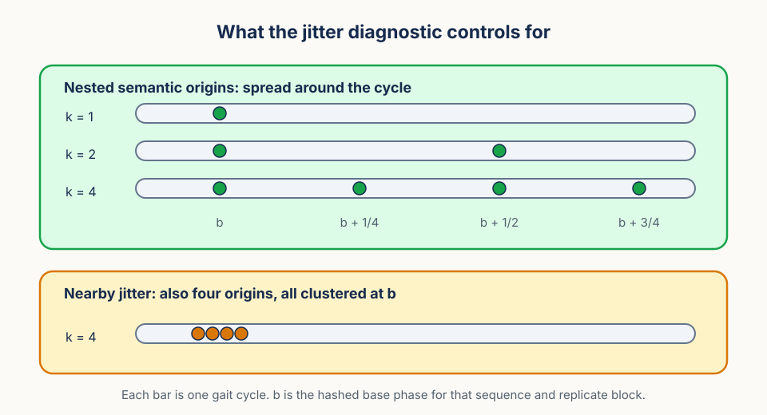
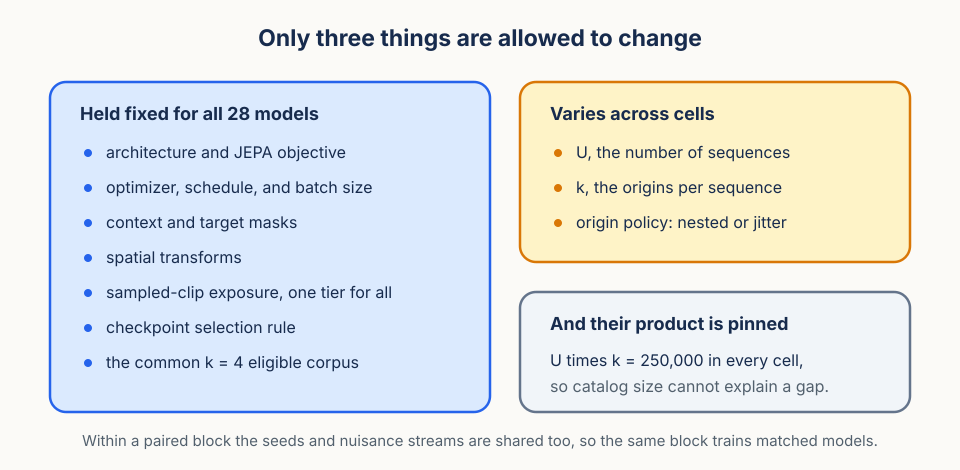
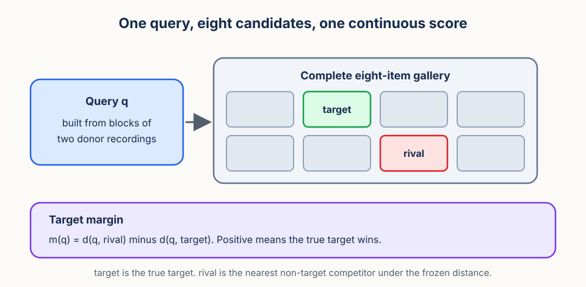

# Where Does Video Diversity Live?

## A focused hierarchical-diversity method

Video data are hierarchical. A model can see a brand new walking sequence, or it can see a new part of a sequence it has already seen. Both add variety to what the optimizer processes, but they are different interventions, and the field usually treats them as interchangeable.

The method asks one question:

> When the optimizer processes the same number of clips and has the same nominal catalog of sequence-origin atoms available, does it matter whether those atoms are spread across more sequences or concentrated in phase-separated views of fewer sequences?

A sequence-origin atom is one pair: a sequence plus one deliberately selected start phase inside that sequence's gait cycle. The nominal catalog is the number of distinct atoms the sampler may draw from. Everything below is about where those atoms come from, never about how many clips the model sees.

## Why "more data is better" does not answer this

The usual scaling result compares a small corpus with a larger one. That comparison confounds two things at once: the model gets more distinct content, and it also gets more optimizer steps or more distinct draws. When the larger corpus wins, we learn that more is better, but we learn nothing about how to spend a fixed budget.

Practitioners face the fixed-budget version instead. A collection effort can chase more subjects, or it can mine the recordings it already has more finely. Both raise the count of distinct training atoms. Nobody knows whether the two routes produce the same representation.

To answer that, the comparison has to hold the count constant and move only its hierarchical location. That is the intervention below.

## The intervention

Every primary condition has nominal catalog size `U × k = 250,000`, where `U` is the number of eligible sequences and `k` is the number of deliberately selected phase origins per sequence.

| Allocation | Sequences `U` | Phase origins `k` | Nominal catalog |
| --- | ---: | ---: | ---: |
| Breadth | 250,000 | 1 | 250,000 |
| Balanced | 125,000 | 2 | 250,000 |
| Phase depth | 62,500 | 4 | 250,000 |
| Nearby-jitter diagnostic | 62,500 | 4 | 250,000 |

The first three rows form the iso-catalog allocation path. Breadth is the new-sequence extreme, phase depth is the phase-separated extreme, and balanced sits between them. Reading down those three rows, `U` falls by a factor of four while `k` rises by a factor of four, so the product never moves.

The fourth row is a mechanism diagnostic, not a fourth path point. It keeps `k = 4` but replaces the four phase-separated origins with four nearby origins clustered around the same base phase. It answers an obvious objection: maybe phase depth wins simply because drawing four different start indices adds temporal randomness. If phase depth differs from nearby jitter, the gain came from separated gait-cycle content, not from jitter alone.

One caveat travels with `U × k` everywhere in this study. It is a counting control, not a claim that atoms carry equal information. Four origins in one sequence are more redundant than four origins in four sequences, and nothing about the arithmetic hides that. The paper will therefore report phase coverage, window overlap, trajectory separation, and outcome-blind near-duplicate clusters beside the nominal count.

## Comparable phase origins

The intervention only means something if the phase origins are actually comparable across cells. Here is how they are built.

For every eligible sequence, a frozen phase signal estimates the stride period and a confidence for that estimate. In the current video instance that signal comes from silhouettes, but the contract is method-level: the signal is chosen before outcomes, documented, and audited. All cells then draw from the same `k = 4`-eligible corpus, so no cell gets cleaner or longer sequences than another. A stable hash picks a uniform base phase for each sequence and replicate block, which keeps the base phase reproducible without letting it correlate with anything else.

The origin sets are nested. `k = 1` is the base phase alone. `k = 2` adds the antipodal phase half a cycle away. `k = 4` adds the two quarter-cycle phases. Nested sets mean that going deeper only adds origins, it never swaps them, so the arms differ by addition rather than by two unrelated choices. Nearby jitter instead uses symmetric small offsets around that same base phase.

The estimator, confidence threshold, clip construction, jitter offsets, and manual audit plan are all frozen before any outcome is opened. If the audit fails to establish reliable phase separation, the phase-allocation study does not launch. That is a real stopping rule, not a formality: without separation, the intervention has no content.

## What stays fixed

Comparable origins settle the treatment. The rest of the training run has to be settled too, or an allocation difference could be a schedule difference in disguise.

Architecture, JEPA objective, sampled-clip exposure, optimizer, schedule, masks, spatial transforms, and checkpoint selection are all fixed. An outcome-blind systems gate picks one exposure tier for every model in the study: 8.192 million or 4.096 million clips. Against a nominal catalog of 250,000 those tiers imply about 32.77 or 16.38 planned draws per nominal atom.

Fixing exposure is what makes this a fixed-budget question. Both arms pay the same compute, so a difference cannot be bought with more steps.

Replication is organized into paired blocks. Eight paired blocks each contain breadth, balanced, and phase depth, giving 24 primary models. Four prespecified blocks add nearby jitter, giving four more. The study therefore trains 28 models, and the paired block is the model-level inference unit. Two models in the same block share their seeds and nuisance streams, so subtracting within a block cancels most of what is not the allocation.

## The outcome and headline test

With the treatment and the training run pinned down, the remaining question is what to measure.

GFC evaluates source-disjoint recombination in a complete factorial gallery. The current instance uses speed, clothing, and direction, but the technical object is broader: a frozen representation, supervised factor heads fitted only on training examples, two source-safe donors, and a target retrieved from the full gallery. It is a controlled representation instrument, not a task-specific prediction claim and not a test of unsupervised disentanglement.

The primary score is a continuous eight-gallery target margin. For a query `q`, `d` is the frozen distance, the true target is the gallery item with the requested factor combination, and the best non-target is whichever remaining gallery item sits closest to the query:

$$
m(q)=d(q,\text{best non-target})-d(q,\text{true target}).
$$

Positive margin means the target wins. A continuous margin is used instead of a hit rate because it keeps information about how narrowly the target won or lost, which matters when only eight trained models per allocation are available.

The same gallery construction serves both GFC recombination and independent factor completion. Top-1 and MRR are directional checks on the margin, not separate headlines.

For each block and allocation, subtract the independent-completion margin from the GFC margin. The confirmatory contrast asks whether that residual differs between phase depth and breadth. Working with the residual matters: it tests whether the allocation changes donor-based recombination specifically, rather than just making every factor easier to predict.

## Interpreting results

The design admits four readings, and each one licenses a different sentence.

- **Path points come out similar.** This establishes a useful null at the tested precision. It does not prove that allocation never matters, only that this allocation path did not move this instrument by more than the declared minimum detectable effect.
- **Breadth wins.** Equal nominal catalog size is not equal diversity, and the redundancy inside a sequence is real enough to cost something.
- **Phase depth wins and also differs from nearby jitter.** The value comes from temporally separated content, not from temporal randomness. Without the jitter contrast this reading is not available.
- **A residual GFC effect agrees with the locked factor-geometry diagnostic.** This is evidence for a representation-level dissociation rather than a general accuracy shift.

The strongest claim requires agreement across all five signals: continuous margin, top-1, MRR, phase versus jitter, and geometry. Any one of them alone is weaker.

The limits hold in every case. This remains one controlled instantiation of a JEPA analysis method. It cannot establish a general video law, it cannot identify sequences as people, and it cannot support a downstream-use claim.

Next: [method.md](method.md) fixes the exact construction, instrument, estimand, and lock requirements. [execution-plan.md](execution-plan.md) turns them into gates, work packages, and the project schedule.
