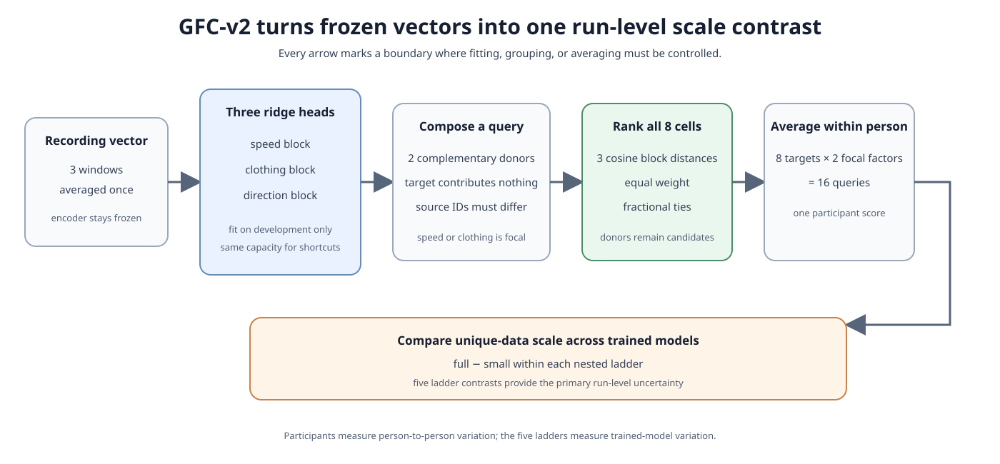

# Method guide

This document turns the proposal into an executable evaluation recipe. For dataset
roles and preprocessing, see [data.md](data.md). For motivation and reviewer-facing
claims, see [proposal.md](proposal.md). For the evidence available so far, see
[results.md](results.md).

## 1. Start with one narrow question

> With architecture and training exposure held fixed, does increasing the number of
> unique unlabelled walking sequences change how well speed, clothing, and direction
> can be linearly read out and recombined?

The study varies unique-data diversity, not model size or training examples. It tests
one six-layer JEPA-style silhouette-video encoder family on two named datasets. It does
not test unsupervised factor discovery, causal disentanglement, a universal scaling law,
clinical utility, or transfer to arbitrary video.

The primary evaluator is **GFC-v2**, or *gait factor composition, version 2*. It asks
whether factor information taken from two recordings can identify a third recording
with the intended combination of factors.



## 2. Train the scaling ladder without changing the budget

Every primary run uses the same:

- six-layer, 384-dimensional, single-stream JEPA-style ViT;
- 16 silhouette frames at $112\times112$ pixels;
- masking policy, optimizer, augmentations, effective batch size, learning-rate
  schedule, exponential-moving-average schedule, and final pooling; and
- training exposure of $C=8{,}192{,}000$ examples, or 128,000 updates at effective
  batch size 64.

The checked-in primary configuration realizes this as microbatches of 16, four-way
gradient accumulation, 65,536 sampled examples per virtual epoch, 1,024 updates per
virtual epoch, and 125 virtual epochs. The fixed-exposure sampler draws source sequences
with replacement and includes the draw index in temporal and spatial augmentation seeds.
These are implementation facts, not extra independent observations.

Horizontal flipping is disabled because direction is an evaluated factor.

A *Vision Transformer* (ViT) represents the video as tokens and uses attention to mix
information among them. The *JEPA-style* objective predicts hidden target features from
visible context rather than reconstructing every output pixel. The exponential-moving-
average (EMA) schedule updates the target encoder smoothly from the training encoder.
*Effective batch size* means the total number of examples contributing to one optimizer
update after combining devices and any gradient-accumulation steps.

Each of five replicate seeds defines nested GaitLU pools near 2.5k, 25k, 250k, and all
eligible sequences. This gives 20 primary runs. Within a ladder, the same replicate seed
drives optimization at every rung. Adding a rung adds source groups rather than
replacing the earlier data.

Exact-content SHA-256 is confined to GaitLU preparation, where it supports packed-record
reuse and deduplication. Final manifests omit record hashes. Finalization stores one
role-sensitive digest over each ordered training-plus-holdout manifest pair in the
private training registry. Each checkpoint stores that digest and requires it, the
manifest roles, loader settings, and the `splitmix64-v1` seed scheme to match on resume.
Runtime loading still validates structure, paths, bounds, and short reads, but same-length
corruption of packed bits is not detected.


A prespecified throughput gate may reduce **all** runs to 4,096,000 examples before any
Health&Gait outcome is opened. Exposure cannot differ by rung. The final-step checkpoint
is primary; a downstream result may not select a favorable epoch. Because pool sampling
and optimization share one seed, the five ladders estimate their combined variability,
not two separate variance components.

The repository currently contains the 8,192,000-example configuration only. If the
throughput gate selects the lower tier, its compatible configuration and regenerated
twenty-row training registry must be created before primary training.

## 3. Convert each recording into one frozen vector

For a Health&Gait direction recording:

1. Select three distinct, deterministic 16-frame windows.
2. Pass each window through the frozen encoder.
3. Average the three output vectors element by element in float64.

The result is one *recording representation*: a numerical summary of that clip. The
three windows are repeated views of one recording, not independent samples. A complete
participant contributes exactly eight recording vectors, one for each speed × clothing
× direction cell.

## 4. Align the representation with three labelled factor heads

Raw encoder coordinates have no agreed meaning. Therefore, for each frozen encoder, fit
three separate linear *ridge heads* on the 76 complete development participants:

- a two-score head for usual versus fast speed;
- a two-score head for without versus with jacket; and
- a two-score head for right-to-left versus left-to-right direction.

A ridge head is a linear map with a penalty that discourages unnecessarily large
coefficients. Input standardization centers and scales coordinates using development
rows only. The intercept is not penalized; the coefficient penalty is $\alpha=1$.
Population-statistic normalization uses the full fitted population convention, and
post-map normalization puts each two-score block on a comparable scale before cosine
distance is computed. All arithmetic is float64. These choices are frozen; values
$\alpha=0.1$ and $10$ are sensitivity checks only.

For example, a recording vector with hundreds of unnamed coordinates becomes three
two-number blocks:

```text
speed block      [usual score, fast score]       = [0.10, 0.90]
clothing block   [no-jacket score, jacket score] = [0.82, 0.18]
direction block  [R2L score, L2R score]           = [0.25, 0.75]
```

These scores suggest “fast, no jacket, left-to-right.” Labels are used to learn this
alignment, so a strong GFC-v2 result means **supervised linear factor recoverability and
recombination**. It does not mean the encoder discovered named factors without labels.

### Match the acquisition-cue baseline

Run the nine acquisition cues from [data.md](data.md) through the same three-head
pipeline: same development participants, labels, output widths, ridge penalty,
normalization, and tie rule. The learned and cue paths then differ in their inputs, not
in label access or readout capacity.

Cue top-1 is an absolute shortcut diagnostic. Because the cue vector is identical at
every data rung, subtracting it at both ends does not define a new scale effect. The
primary scale contrast therefore uses learned GFC-v2 top-1 directly.

## 5. Compose a query from two session-safe donors

Represent a target condition as $x=(s,c,d)\in\lbrace0,1\rbrace^3$, where the entries denote
speed, clothing, and direction. Choose the *focal factor* $a$ to be speed or clothing.
Direction is never focal because the opposite-direction clip at fixed speed and
clothing comes from the same physical back-and-forth walk.

Construct two complementary donor cells. Donor $u$ keeps the target's focal value and
flips the other two values:

$$
u_a=x_a,\qquad u_j=1-x_j\quad(j\ne a).
$$

Donor $v$ flips the focal value and keeps the other two values:

$$
v_a=1-x_a,\qquad v_j=x_j\quad(j\ne a).
$$

The query copies the focal factor block from $u$ and the other two blocks from $v$. The
target contributes no feature values to its own query.

### Concrete example

Suppose the target is **fast, jacket, left-to-right**, or $x=(1,1,1)$, and speed is
focal. Then:

- $u=(1,0,0)$ is fast, no jacket, right-to-left;
- $v=(0,1,1)$ is usual, jacket, left-to-right; and
- the composed query takes speed from $u$, plus clothing and direction from $v$.

The intended answer is therefore fast + jacket + left-to-right, even though neither
donor has that complete combination.


Both donors must have `source_video_id` different from the target's source video. If
either check fails, evaluation stops. This is *session-safe*: the query cannot exploit
another clip cut from the target's physical walk. Each of eight targets is queried once
with speed focal and once with clothing focal, giving 16 queries per participant.

## 6. Search the full eight-cell gallery

For each query, compare its three blocks with every one of the participant's eight
recordings, including both donors. A *gallery* is simply this set of candidate answers.

For block $k$, cosine similarity measures the angle between the query and gallery
vectors. Cosine distance is one minus that similarity. The three blocks receive equal
weight:

$$
d(q,g)=\frac{1}{3}\sum_{k\in\lbrace s,c,d\rbrace}\left[1-\cos(q_k,g_k)\right].
$$

The closest gallery item is the predicted recording. Retaining donors is important:
returning to a donor is a meaningful composition failure. Removing donors would delete
specific wrong answers and give some partial solutions free credit.

### Score top-1, rank, and ties deterministically

Lower distance means a better match. Sort the eight gallery recordings from smallest
to largest distance, then locate the correct target recording in that ordering. The
protocol reports two scores:

- **Top-1** asks whether the target is the closest gallery item. A unique first-place
  target receives 1 and a target below first place receives 0.
- **Reciprocal rank** also rewards near misses. A target at rank $r$ receives $1/r$;
  for example, rank 2 receives $1/2$ and rank 4 receives $1/4$. **Mean reciprocal rank
  (MRR)** is the average of this value across queries.

Numerically indistinguishable distances must not be ordered arbitrarily. All distances
are computed in float64, and values within the prespecified absolute tolerance count as
a tie. Suppose $a$ gallery items are definitely closer than the target, while $t$ items,
including the target, share the next $t$ rank positions. The target is assigned the
average of those occupied positions:

$$
r=a+\frac{t+1}{2}.
$$

The reciprocal-rank credit is then $1/r$. Top-1 uses a separate rule: if the tie is for
first place ($a=0$), the target receives fractional credit $1/t$; otherwise it receives
zero top-1 credit.

| Situation | Positions occupied | Average rank $r$ | Top-1 credit | Reciprocal-rank credit |
|---|---:|---:|---:|---:|
| Target is uniquely closest | 1 | 1 | 1 | 1 |
| Target and one other item tie for first | 1–2 | 1.5 | $1/2$ | $1/1.5=2/3$ |
| One item is closer; target ties with two others | 2–4 | 3 | 0 | $1/3$ |
| Target is uniquely fourth | 4 | 4 | 0 | $1/4$ |

Fractional scoring represents the uncertainty already present in the distances. Ties
are never resolved randomly or by gallery order, so repeated evaluation of the same
distances always produces the same result.

### Use the exact oracle spectrum as a ruler

An *oracle* is a controlled solver that recovers a known subset of factors perfectly.
If it knows $m$ of three binary factors, it ties among $2^{3-m}$ cells:

| Factors recovered exactly | Tied cells | Expected top-1 |
|---|---:|---:|
| None | 8 | $1/8=12.50$% |
| Any one | 4 | $1/4=25.00$% |
| Any two | 2 | $1/2=50.00$% |
| All three | 1 | $1=100.00$% |


These values are unit tests and interpretation anchors. A general enumerator must
reproduce them and must also pass brute-force tests for designs with two through five
binary factors.

For historical continuity only, a secondary analysis removes both donors. Its spectrum
is distorted: no-factor top-1 is $1/6$, one-factor top-1 is $1/3$, and two-factor values
depend on the focal factor. This donor-excluded result never replaces the full-gallery
primary result.

## 7. Check whether GFC-v2 is merely classification

GFC-v2 uses supervised factor heads, so two matched controls ask whether ordinary factor
classification explains the result:

1. **Hard completion:** take the highest-scoring label from each copied block, form the
   three-label tuple, and retrieve that gallery cell.
2. **Soft completion:** fit one temperature on development participants, multiply the
   three factor-label probabilities for each gallery cell, and use the same tie rule.

Interpret the controls before making a geometry claim:

- If GFC-v2, the controls, and the single-factor probes move together, conclude only
  that the three factors are jointly linearly recoverable.
- If probes are high but GFC-v2 is poor, simultaneous block alignment or donor
  composition has failed.
- Claim additional factor-block geometry only if GFC-v2 differs reproducibly from both
  controls across ladders.

## 8. Aggregate the primary and diagnostic outcomes

For participant $i$, average fractional top-1 credit across all 16 queries. Participants,
not windows or queries, are the human-data analysis units.

Also report:

- learned and acquisition-cue MRR;
- cue excess, $\Delta_i^{\mathrm{cue}}=\mathrm{top1}^{\mathrm{learned}}_i-\mathrm{top1}^{\mathrm{cue}}_i$;
- balanced accuracy of each factor head;
- attraction to each donor;
- speed-focal and clothing-focal results;
- full-gallery and donor-excluded results; and
- ridge-penalty sensitivities.

Normalized headroom may show where a score lies between an oracle level and 100%, but
it is not information, does not prove an omitted factor is absent, and cannot replace
raw accuracy.

Balanced accuracy is the mean of the per-label recalls. It therefore gives the two
values of a factor equal importance even if their recording counts differ.

## 9. Run two secondary capability tests

### 9.1 Normalized context reliance

Use the same 10,000 held-out GaitLU sequences for every rung. Keep the masked target,
target positions, mask, and predictor positional inputs fixed, and replace only the
visible context. The primary substitute comes from a different sequence in the nearest
decile under the fixed geometry descriptor in [data.md](data.md).

For sequence $i$:

$$
R_i^{\mathrm{near}}=
\frac{L_i^{\text{near substitute}}-L_i^{\mathrm{true}}}
{\max(L_i^{\mathrm{true}},10^{-8})}.
$$

Report this ratio, both losses, their raw paired difference, the full distribution, and
a sequence-level paired-bootstrap interval.


Secondary substitutions use a non-overlapping segment from the same source when
available, a fixed temporal permutation, a far geometry-matched sequence, and blank
context. Blank context is an out-of-distribution stress test. None of these substitutions
is a causal decomposition of semantic content.

### 9.2 Cross-condition identity capability

For each outcome participant, average the usual-speed, no-jacket recordings from both
directions to make an enrollment vector. Use the other speed and clothing conditions as
probes, and retrieve identities by cosine distance among all outcome participants.
Report participant-weighted rank-1 and MRR.

This is a surveillance-relevant capability test. Do not release identity-capable
checkpoints, participant embeddings, subgroup rankings, or nearest-neighbor examples.

## 10. Estimate the scale effect over five ladders

Within each ladder, compute the participant-averaged difference between the full and
2.5k rungs in learned GFC-v2 top-1. The primary estimate is the mean of these five
ladder-level contrasts.

Report:

- a $t$ interval over the five ladder contrasts;
- every replicate-specific four-rung curve;
- participant-bootstrap intervals within each replicate; and
- a crossed bootstrap as a sensitivity analysis.

Participant resampling cannot replace the five trained-model replicates. There is one
primary test. Probe, identity, context, effective-rank, focal-factor, and intermediate-
rung analyses are secondary. A *bootstrap* repeatedly samples observed units with
replacement to show how an estimate changes under resampling; each participant's 16
queries stay together. Use Holm correction, a stepwise multiple-testing adjustment,
within related secondary families.

One of 16 queries corresponds to 6.25 percentage points, so set
$\delta=6.25$ points before viewing outcomes:

| Result | Decision rule |
|---|---|
| Meaningful positive | 95% interval is above zero and estimate is at least $\delta$ |
| Positive but small | 95% interval is above zero and estimate is below $\delta$ |
| Equivalent to flat at this resolution | 90% interval lies inside $[-\delta,+\delta]$ |
| Inconclusive | Neither superiority nor equivalence is established |

Failure to reject zero is not evidence of a flat curve. Four observed data rungs also
do not justify fitting or claiming a universal power law.

## 11. Freeze first, then open outcomes

Before any outcome aggregate is viewed, freeze in a timestamped commit:

- participant roles and exclusions;
- GaitLU pools and training exposure;
- the combined training-plus-holdout manifest digest and seed scheme for every GaitLU
  checkpoint;
- all 20 checkpoints and reference checkpoints;
- GFC-v2, the oracle enumerator, and both completion controls;
- factor heads, cue heads, normalizers, and temperature;
- context and identity protocols;
- statistical code, effect thresholds, and figure templates.

The currently checked-in GFC files come from a legacy 24-query, donor-excluded protocol
with historical cohort roles and comparator-specific normalization. They are useful for
motivation and audit only. An output may be called a revised-study result only when its
metadata explicitly record:

```text
protocol=gfc_v2
gallery=retain_all_8
queries_per_participant=16
factor_heads=three_matched_ridge_heads
cohort_roles=healthgait-gfc-v2-roles-v1
```

## 12. Required evaluator checks

Before scoring real outcomes, verify that:

- complete participants have exactly eight unique factor cells;
- donors and targets are selected from manifest fields, including `source_video_id`;
- target features never enter their own query;
- both donors remain in every primary gallery;
- every primary query has eight candidates and every participant has 16 queries;
- exact, partial, constant, nuisance-only, donor-attraction, hard-control, and
  soft-control cases reproduce their declared behavior;
- learned and cue paths use identical fitting capacity and query keys;
- only development rows fit heads, normalizers, and temperature;
- adding outcome rows cannot change any development fit;
- queries are averaged within participant before statistical analysis; and
- every primary encoder reaches the same frozen exposure or follows the prespecified
  systems-failure rule.

## 13. State only the claim the experiment supports

The strongest permitted conclusion is specific to this encoder family and these
datasets: increasing unique GaitLU data changes, does not materially change, or leaves
unresolved the supervised linear recoverability and recombination of three Health&Gait
factors.

The experiment cannot establish causal gait variables, intrinsic unsupervised
disentanglement, clinical usefulness, identity safety, or general transfer to other
populations and capture settings.

## References

- Andreas, J. (2019). [Measuring Compositionality in Representation Learning](https://openreview.net/forum?id=HJz05o0qK7). ICLR.
- Eastwood, C., and Williams, C. K. I. (2018). [A Framework for the Quantitative Evaluation of Disentangled Representations](https://openreview.net/forum?id=By-7dz-AZ). ICLR.
- Fan, C., Hou, S., Huang, Y., and Yu, S. (2022). [Learning Gait Representation from Massive Unlabelled Walking Videos: A Benchmark](https://arxiv.org/abs/2206.13964).
- Hu, Q., Szabó, A., Portenier, T., Favaro, P., and Zwicker, M. (2018). [Disentangling Factors of Variation by Mixing Them](https://openaccess.thecvf.com/content_cvpr_2018/html/Hu_Disentangling_Factors_of_CVPR_2018_paper.html). CVPR.
- Zafra-Palma, J., et al. (2025). [Health & Gait: A Dataset for Gait-Based Analysis](https://www.nature.com/articles/s41597-024-04327-4). Scientific Data.
