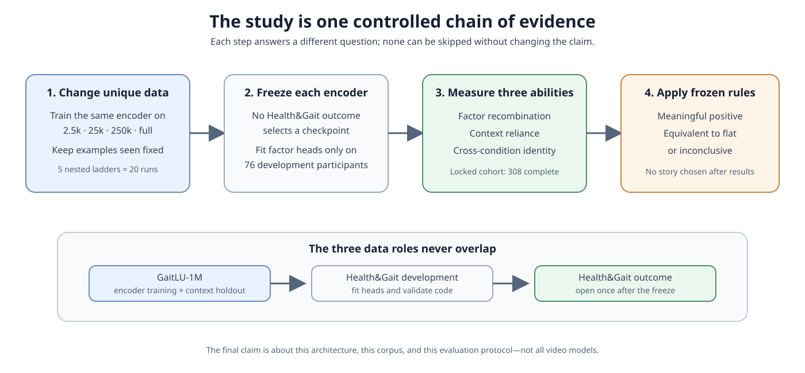
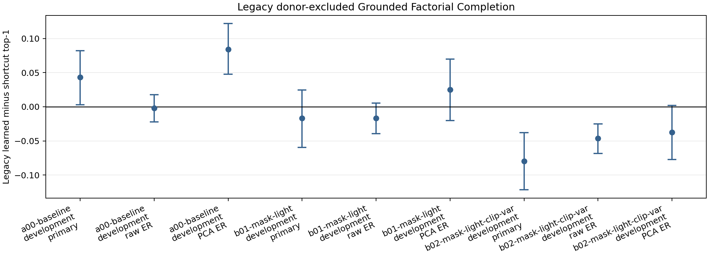
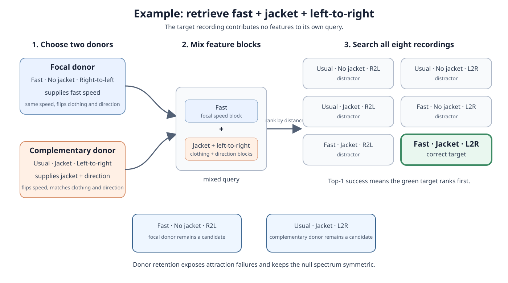
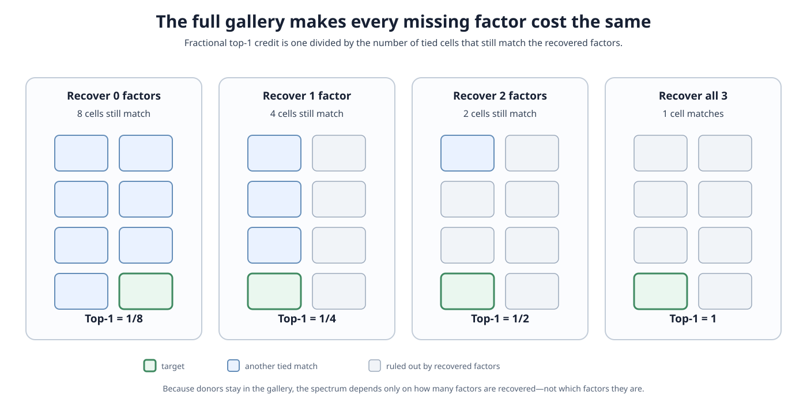
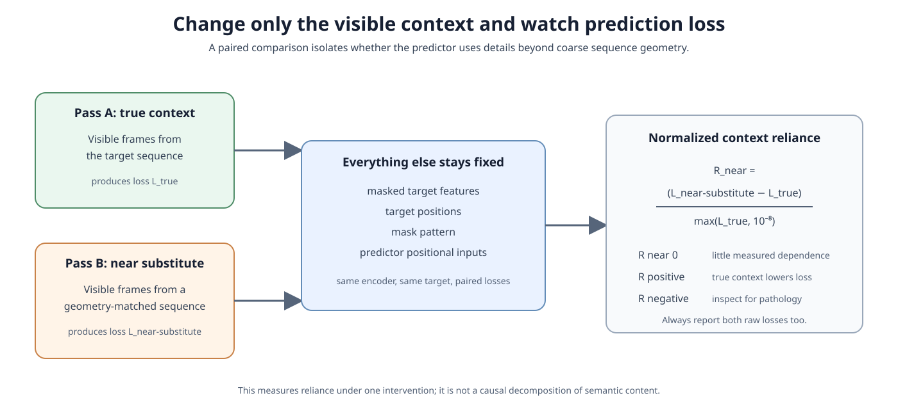
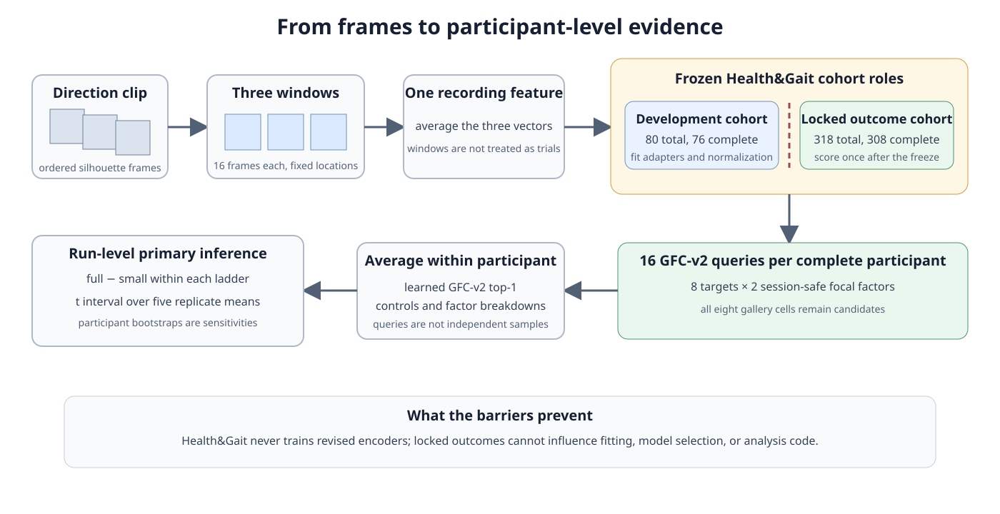

# What Does Data Scale Buy a Predictive Video Representation?

## A step-by-step proposal about factor recombination, context reliance, and identity in silhouette gait

**Target venue:** ICLR 2027

**Abstract deadline:** September 18, 2026, Anywhere on Earth

**Paper deadline:** September 25, 2026, Anywhere on Earth

> **Current status.** This document describes a planned experiment. It includes
> preliminary results that motivated the design, but the new GaitLU scaling runs and the
> locked Health&Gait outcome analysis have not yet been completed. Whenever this
> tutorial says *we will measure*, it refers to future work. Whenever it reports a
> number, it labels that number as preliminary or historical.

## The proposal in one paragraph

We want to know what a video model learns when its training set contains more **unique
walking sequences**, while the model architecture and total amount of training stay the
same. In particular, we ask whether more varied data helps a frozen representation keep
three factors—walking speed, clothing, and direction—available in a form that can be
linearly extracted and recombined.

We will train the same small JEPA-style encoder on four nested subsets of GaitLU-1M and
repeat the four-level experiment five times. We then evaluate every frozen encoder with
three measurements: factor recombination, reliance on visible context, and
cross-condition identity retrieval. The primary evaluation uses a new full-gallery
protocol called **GFC-v2**. It removes candidate-deletion bias, prevents donors from
sharing the target's physical walk, matches the learned and shortcut readouts, and
allows an inconclusive result.

---

## Tutorial roadmap

The proposal is easiest to understand as a sequence of questions:

1. What exactly do we mean by a representation and by data scale?
2. Why are speed, clothing, and direction useful test factors?
3. What would it mean to recombine those factors correctly?
4. Why did the first version of the test give an ambiguous answer?
5. How will the revised scaling experiment isolate unique-data variety?
6. How does GFC-v2 build and score one query?
7. Which controls prevent an ordinary classifier or acquisition shortcut from looking
   compositional?
8. How will we measure context reliance and identity alongside recombination?
9. What statistical evidence would count as positive, flat, or unresolved?
10. Can the study be completed before the ICLR deadline?

Each section answers one of these questions and then explains why the answer is needed
for the next section.

---

## Step 1: define the scientific question

### 1.1 What is a video representation?

A video encoder turns a sequence of frames into numbers. For example, a 16-frame
silhouette clip might become a vector with 384 coordinates:

$$z=(z_1,z_2,\ldots,z_{384}).$$

The individual coordinates usually have no human-readable names. We call the whole
vector a **representation** because downstream methods use it in place of the original
video.

A useful representation can support many tasks. It might reveal who is walking, whether
the person is moving quickly, whether a jacket is present, or which direction the person
is moving. However, success on one task does not imply that all of these properties are
organized cleanly.

### 1.2 What is a predictive video representation?

The encoder is trained with a **Joint-Embedding Predictive Architecture (JEPA)** style
objective. Some parts of a video are visible and others are masked. A predictor uses the
visible context to predict the target encoder's representation of the masked parts. The
training target is a latent vector, not a reconstructed image.

This objective motivates two separate questions:

- Does the final representation contain useful factors?
- Does the predictor actually use the visible context to make its prediction?

The first question leads to GFC-v2. The second leads to the context intervention in
Step 9.

### 1.3 What does “data scale” mean here?

Data scale can mean several things: more unique sequences, more total training examples,
larger models, or more computation. This proposal changes only the first.

We use four pools containing approximately 2,500, 25,000, 250,000, and all eligible
GaitLU sequences. Every run processes the same total number of sampled examples. Small
pools therefore repeat their sequences many times, while large pools expose the model
to more distinct walks.

This distinction matters. If the full-data model also received ten times more optimizer
updates, we could not tell whether an improvement came from variety or simply from more
training. The fixed-exposure design asks a narrower question:

> When training time is held constant, does replacing repetition with variety change
> the representation?

The full research question is therefore:

> **At fixed architecture and fixed training exposure, how does the number of unique
> walking sequences affect the linearly extractable and recombinable representation of
> walking speed, clothing, and direction?**

The phrase **linearly extractable** is deliberate. We will fit simple supervised linear
maps to name the three factors. We do not claim that the raw encoder discovers these
factor names without labels.

---

## Step 2: give every dataset exactly one role

The study uses two real datasets and one small set of constructed feature cases. Their
roles must remain separate.

### 2.1 GaitLU-1M trains the encoders

GaitLU-1M contains about 1.02 million unlabelled silhouette sequences. It provides the
four pretraining pools. Before making those pools, we will:

1. verify that each sequence decodes and contains usable silhouettes;
2. remove exact duplicates by content hash;
3. keep distributor-provided source groups—sequences known to come from the same
   original source—together when those groups exist;
4. run a sampled near-duplicate audit when source metadata are unavailable;
5. reserve 10,000 group-disjoint sequences for context and training-health evaluation;
   and
6. call everything else the eligible pretraining corpus, with actual size $U_{\max}$.

We will report the real value of $U_{\max}$ after filtering. We will not call the pool
exactly one million or claim a 400-fold range unless the validated counts support those
statements.

### 2.2 Health&Gait evaluates frozen encoders

Health&Gait supplies the labelled factorial recordings used after pretraining. No
Health&Gait recording gives the revised encoder a training update.

The existing subject split contains two groups:

- **Development cohort:** 80 participants, of whom 76 have all eight factor
  combinations. Their recordings fit factor heads and normalizers and validate the
  evaluator.
- **Prospectively locked outcome cohort:** 318 participants, of whom 308 currently have
  all eight combinations. Their aggregate results remain hidden until the protocol,
  models, code, thresholds, and figure templates are frozen.

The 318-person group is not an untouched external confirmation sample. Its data and
labels informed older Health&Gait experiments. The honest description is
**prospectively locked outcome cohort**. The new encoders are independent of
Health&Gait training, but the project history is not independent of these participants.

### 2.3 Constructed features validate the instrument

Small feature-level examples give the evaluator known answers. We can create blocks that
contain all three factors exactly, omit one factor, contain only nuisance cues, or
deliberately leak an acquisition shortcut. These cases check the mathematics and code.
They are not evidence about another human population.

Separating these roles prevents three common errors: training on the evaluation
participants, fitting readouts on outcome labels, and treating code-validation cases as
evidence of real-world generalization.

---

## Step 3: understand the factorial evaluation data

Each complete Health&Gait participant appears under three binary experimental factors:

- **Speed:** usual or fast instructed walking.
- **Clothing:** no jacket or jacket.
- **Direction:** right-to-left or left-to-right.

Three binary factors produce $2\times2\times2=8$ combinations, called **cells**. A
complete participant has one recording in every cell.

The two direction clips for a fixed speed and clothing condition come from one physical
back-and-forth walk. They share a `source_video_id`. They are different recordings, but
they are not independent capture sessions. GFC-v2 uses this identifier to prevent a
donor from leaking the target's physical walk.

The factor labels describe controlled conditions. “Fast” is an instruction, not a
frame-synchronized measurement of cadence or velocity. Likewise, a successful clothing
prediction may use jacket outline rather than an abstract notion of clothing. These
limits shape the claims we allow later.

---

## Step 4: make “factor recombination” concrete

Suppose the desired target is:

> **fast speed + jacket + left-to-right direction**

The model is not shown the target representation. Instead, it receives factor blocks
from two other recordings of the same participant:

- one donor supplies the **fast** block;
- the other donor supplies the **jacket** and **left-to-right** blocks.

The mixed query must retrieve the real fast–jacket–left-to-right recording from the
participant's eight observed recordings.

This is more demanding than three separate classification questions. A speed classifier
can say “fast,” a clothing classifier can say “jacket,” and a direction classifier can
say “left-to-right.” GFC-v2 asks whether outputs taken from different recordings work
together to locate the real target.

At the same time, the test still uses supervised factor heads. It therefore measures
**factor-aligned recombination after linear supervision**, not intrinsic or causal
disentanglement.

---

## Step 5: learn from the preliminary study before designing the new one

### 5.1 Standard diagnostics disagreed

The preliminary Health&Gait study compared prediction loss, representation breadth,
context sensitivity, factor probes, and identity retrieval. They did not select the
same checkpoints.

One example makes the problem clear. A preliminary checkpoint had token-level effective
rank 381.6 out of 384, suggesting broad token features, but its pooled recording vector
had effective rank only 10.4. Replacing the visible context with another participant's
clip changed prediction loss by only about 0.000156 against a typical loss of 0.387.

These observations do not prove that the representation is bad. They show that each
diagnostic describes a different property:

- **Prediction loss** measures how well the training objective is optimized.
- **Effective rank** estimates how many independent directions in feature space carry
  substantial variation. For example, effective rank 10 in a 384-coordinate vector
  means most variation lies near a much smaller subspace; it does not mean that exactly
  ten coordinates are nonzero.
- **A linear probe** is a simple supervised classifier fitted on frozen features. It
  measures whether a label can be decoded without changing the encoder.
- **Identity retrieval** measures whether people can be distinguished across
  conditions.
- **Context substitution** tests whether prediction changes when visible evidence is
  replaced.

No one metric is a complete definition of representation quality.

### 5.2 The first GFC result looked positive

Under the old 24-query protocol, the best preliminary learned path scored 69.79% and a
non-learned shortcut path scored 65.46%. Their difference was 4.33 percentage points.

That result was useful because it triggered a deeper audit. It was not confirmatory.

### 5.3 The audit found five structural problems

**Problem 1: deleting donors distorted the gallery.** The old protocol removed both
donors. That deletion also removed particular wrong answers. A solver that recovered
clothing and direction but ignored speed could score 100%, while uniform chance was
only $1/6$. The gallery accidentally made one missing factor free.

**Problem 2: the shortcut nearly matched a partial-factor oracle.** A path built from
duration, frame count, silhouette displacement, and foreground area scored 65.46%, near
the old 66.67% clothing-blind oracle. The learned result was therefore only a small
excess over a strong acquisition-sensitive path.

**Problem 3: one donor could share the target's physical walk.** Opposite directions
from the same back-and-forth recording share lighting, framing, segmentation quality,
and duration. Recording-level separation was not enough; the protocol needed
`source_video_id` separation.

**Problem 4: the same development data influenced choices and evaluation.** Only 76
complete participants entered the old analysis, and the estimated power for one
additional correct query per participant was about 0.52. The result was both
development-dependent and uncertain.

**Problem 5: some normalization choices treated the comparators differently.** An
effective-rank reduction kept different numbers of learned and shortcut coordinates. It
could therefore change the gap by weakening one path more than the other. GFC-v2 gives
both inputs the same fitted output dimensions and makes alternative ridge penalties
explicit sensitivities rather than result-selection tools.

The revised proposal does not hide these failures. Each one becomes a design
requirement in the next steps.

---

## Step 6: build a fixed-exposure scaling ladder

The four nominal pool sizes are:

| Rung | Unique sequences $U$ | Approximate exposures per sequence at $C=8.192$M |
|---|---:|---:|
| Small | 2,500 | 3,277 |
| Medium | 25,000 | 328 |
| Large | 250,000 | 33 |
| Full | $U_{\max}\approx1.01$M | about 8 |

The word **rung** simply means one level of the data ladder. **Exposure** means one
sampled training example. A repeated source sequence can produce a new temporal window
and a new mask, but it is still not new unique data.

For each replicate $r\in\{1,\ldots,5\}$, source groups receive a new seeded order. The
four pools are nested prefixes of that order, so the medium pool contains the small
pool, the large contains the medium, and the full pool contains them all. The same
replicate seed also drives optimization at every rung.

This gives $5\times4=20$ primary runs. The design measures the combined reproducibility
of pool composition and optimization. It does not separate those two variance sources.

Every run uses the same six-layer, 384-dimensional, single-stream JEPA-style Vision
Transformer, 16 silhouette frames at $112\times112$, optimizer, mask policy,
augmentations, schedule, exponential-moving-average (EMA) target-encoder schedule, and
pooling. Horizontal flipping remains disabled because direction is an evaluated factor.

The primary exposure is:

$$C=8{,}192{,}000\ \text{examples per run},$$

which equals 128,000 optimizer updates at effective batch size 64. The final-step
checkpoint is primary. We do not choose an epoch by looking at Health&Gait outcomes.

Once this ladder produces frozen encoders, the next task is to give their unnamed
coordinates consistent factor meanings.

---

## Step 7: turn an unnamed representation into three named factor blocks

The frozen encoder produces an unnamed vector. To build a factor query, we fit three
separate closed-form ridge maps on development participants only:

- representation $\rightarrow$ two speed scores;
- representation $\rightarrow$ two clothing scores;
- representation $\rightarrow$ two direction scores.

Each pair of scores is a **factor block**. Ridge regression is a linear map with an
$L_2$ penalty that stabilizes the coefficients. The primary penalty is $\alpha=1$;
$\alpha=0.1$ and $10$ are prespecified sensitivity checks.

Input standardization, intercept handling, float64 arithmetic, output width, population
normalization, and block normalization are fixed before outcome evaluation.

This step is supervised. A high GFC-v2 score means the frozen representation supports
useful recombination **after** these labelled linear maps. It does not mean the original
coordinates were already separated into human-named concepts.

Each Health&Gait direction recording produces three deterministic 16-frame windows. We
average their vectors in float64 before fitting or scoring. Windows from one recording
are correlated views, not three participants or three gallery items.

With these factor blocks defined, we can now build a query without using the target
recording itself.

---

## Step 8: construct one session-safe GFC-v2 query

Write the target cell as $x=(s,c,d)$, where each coordinate is zero or one. Choose a
focal factor $a$ from speed or clothing. Direction is not focal because the
opposite-direction recording with the same speed and clothing belongs to the target's
physical back-and-forth walk.

The two donors are defined by a simple complement rule:

$$u_a=x_a,\qquad u_j=1-x_j\quad(j\ne a),$$

$$v_a=1-x_a,\qquad v_j=x_j\quad(j\ne a).$$

In words:

- donor $u$ matches the target on the focal factor and flips the other two;
- donor $v$ flips the focal factor and matches the other two; and
- the query takes the focal block from $u$ and the remaining blocks from $v$.

For the fast–jacket–left-to-right example with speed as focal:

- $u$ is fast–no-jacket–right-to-left and supplies **fast**;
- $v$ is usual–jacket–left-to-right and supplies **jacket + left-to-right**.

Both donors must have a different `source_video_id` from the target. If either assertion
fails, evaluation stops.

Every complete participant contributes eight target cells and two focal choices, for
16 queries. The target contributes no query features.

Constructing the query is only half of the test. We must also define which recordings
it is allowed to retrieve and how ties are scored.

---

## Step 9: keep all eight gallery cells and score ties honestly

### 9.1 Why donors remain in the gallery

The primary gallery contains all eight cells, including both donors. A donor has an
exact copied match on part of the query, so being attracted back to it is a meaningful
failure. Removing it would hide that failure and alter the set of wrong answers.

The query-to-gallery distance is the equally weighted mean of the three cosine block
distances. Cosine distance compares the direction of two vectors rather than their raw
length; after normalization, identical vectors have cosine distance zero.

$$d(q,g)=\frac{1}{3}\sum_{k\in\{s,c,d\}}\left[1-\cos\!\left(q_k,g_k\right)\right].$$

An exact three-factor representation gives the target zero distance on every block and
retrieves it uniquely.

### 9.2 Fractional credit for ties

Suppose the target ties with one other cell for first place. Randomly breaking the tie
would add noise. Giving full credit would be too generous. GFC-v2 therefore assigns
$1/2$ top-1 credit. In general, a first-place tie of size $t$ receives $1/t$ credit.

If $a$ cells are strictly closer and the target lies in a tie of size $t$, its average
rank is:

$$r=a+\frac{t+1}{2}.$$

Reciprocal-rank credit is $1/r$. **Mean reciprocal rank (MRR)** averages that credit
across queries, so retrieving the target second gives $1/2$ credit and retrieving it
fourth gives $1/4$. All distances and score accumulation use float64 and a frozen
absolute tie tolerance. **Top-1** is stricter: it asks whether the target ranks first,
with fractional credit only for a first-place tie.

### 9.3 The exact partial-factor oracle spectrum

An **oracle** is a hypothetical solver with a precisely stated ability. A speed-only
oracle always knows speed and knows nothing about clothing or direction. A
speed-and-clothing oracle knows those two factors and is blind to direction.

With all eight cells retained, the spectrum is symmetric:

| Factors recovered exactly | Cells still tied | Expected top-1 |
|---|---:|---:|
| none | 8 | $1/8=12.50\%$ |
| any one factor | 4 | $1/4=25.00\%$ |
| any two factors | 2 | $1/2=50.00\%$ |
| all three factors | 1 | $1=100.00\%$ |

No factor is free. The value depends only on how many factors are recovered, not which
ones they are.

A general enumerator will compute the spectrum for any declared factorial design,
donor rule, gallery rule, and tie policy. Brute-force tests will cover two through five
binary factors. A donor-excluded gallery remains only as a historical sensitivity that
demonstrates how candidate deletion changes the answer.

The symmetric gallery fixes the old scoring problem, but it does not by itself prove
that the encoder learned more than simple labels or acquisition cues. That is the role
of the next controls.

---

## Step 10: add controls that can falsify an ambitious interpretation

GFC-v2 can fail scientifically even if its code is correct. Three controls locate what
the score actually measures.

### 10.1 Matched acquisition-cue control

Silhouettes retain simple cues such as clip length, position change, body area, and
jacket outline. The shortcut input contains nine declared features:

- log frame count and duration;
- signed and absolute endpoint displacement; and
- mean, standard deviation, 25th percentile, median, and 75th percentile of foreground
  area.

The shortcut path passes through the same three ridge heads as the learned
representation. It receives the same labels, fitting participants, output dimensions,
$\alpha$, normalizers, queries, gallery, and tie policy. Only the input features differ.

At each rung we report:

$$\Delta_i^{\text{shortcut}}=\mathrm{top1}^{\text{learned}}_i-\mathrm{top1}^{\text{shortcut}}_i.$$

This difference tells us whether learned features beat the declared cues in absolute
performance. It is not the primary scaling statistic because the shortcut is identical
at every rung; subtracting the same shortcut at both endpoints would leave the
full-minus-small contrast unchanged.

### 10.2 Hard independent-factor completion

The hard control takes the most likely label from each copied factor block, forms the
three-label tuple, and retrieves the cell with that tuple. It asks whether ordinary
factor classification already explains GFC-v2.

### 10.3 Soft independent-factor completion

The soft control turns each block into calibrated factor probabilities, multiplies the
three probabilities for every gallery cell, and ranks those products. One temperature
is fitted on development participants.

If learned GFC-v2 simply follows these controls and the individual probe accuracies, the
supported claim is **joint linear factor recoverability**. We will not claim an
additional compositional geometry. Evidence beyond classification requires a
reproducible difference from the controls across data ladders.

### 10.4 What one GFC-v2 result contains

One headline number would hide too much. For every rung, we will report:

- learned and shortcut top-1 and MRR;
- learned-minus-shortcut excess as an absolute diagnostic;
- hard and soft factor-completion controls;
- speed, clothing, and direction probe balanced accuracy;
- attraction to each retained donor;
- separate speed-focal and clothing-focal results;
- the full-gallery primary result and donor-excluded historical sensitivity; and
- ridge sensitivities at $\alpha=0.1$ and $10$ beside the $\alpha=1$ primary result.

We may also show **normalized headroom**, which rescales a score between a named
partial-factor oracle and 100%. This is only a descriptive ruler. It is not mutual
information, does not prove an omitted factor is absent, and cannot replace raw
accuracy.

These controls explain the final representation. We next return to the predictive
training objective and ask whether its predictor uses the context it is given.

---

## Step 11: measure whether the predictor uses visible context

GFC-v2 evaluates the final representation. The JEPA objective also makes a prediction,
so we separately ask how much that prediction depends on the visible context.

For each of the 10,000 held-out GaitLU sequences, we compute target-prediction loss
twice:

1. once with the sequence's true visible context;
2. once with visible context from a different sequence chosen from the nearest geometry
   decile.

The geometry descriptor is fixed and non-learned: frame count, foreground-area
summaries, centroid-trajectory summaries, and motion extent. Matching coarse geometry
makes the substitute less obviously out of distribution.

Target features, target positions, mask, and predictor positional inputs remain fixed.
Only visible context changes.

For sequence $i$:

$$R_i^{\text{near}}=\frac{L_i^{\text{near-substitute}}-L_i^{\text{true}}}{\max\!\left(L_i^{\text{true}},10^{-8}\right)}.$$

A positive value means the true context lowered loss. A value near zero means this
intervention detected little dependence. A negative value requires inspection because
the substitute unexpectedly helped.

We will always report both component losses and the raw gap. The ratio cannot be allowed
to hide a tiny denominator.

Secondary interventions use a non-overlapping segment from the same source, a temporal
shuffle, a far-geometry sequence, and blank context. Blank context is explicitly an
out-of-distribution stress test. None of these measurements is a causal decomposition
of semantic content.

Context reliance still does not tell us whether the representation preserves person
identity. We measure that capability separately because it may scale differently.

---

## Step 12: measure identity as a separate capability

Gait systems are often optimized to identify people across clothing and view changes.
That ability can improve even if factor recombination does not.

We use one fixed protocol:

1. average the usual-speed, no-jacket recordings in both directions to create each
   participant's enrollment representation;
2. use the remaining speed and clothing conditions as probes; and
3. retrieve identity by cosine distance among outcome-cohort participants.

We report rank-1 accuracy—the fraction whose correct identity is nearest—and mean
reciprocal rank with equal participant weighting.

This is a surveillance-relevant capability, not a harmless diagnostic. We will not
release participant embeddings, nearest-neighbor examples, subgroup rankings, or an
identity-capable checkpoint from this study.

For context, we will evaluate released GaitSSB and GaitBase/OpenGait checkpoints when
their prescribed preprocessing is compatible. They are endpoint anchors, not points on
our scaling curve. BigGait and BiggerGait compatibility is optional and cannot block the
primary experiment.

### 12.1 How the measurements fit together

Every rung receives the same measurement set. Each measurement answers a different
question:

| Question | Measurement | Why it is not enough alone |
|---|---|---|
| Can aligned factors recombine? | GFC-v2 top-1, MRR, and donor attraction | Supervised heads may reduce it to classification |
| Can each factor be decoded? | Three balanced-accuracy probes | Separate probes do not test recombination |
| Does prediction use visible evidence? | Normalized context reliance | One intervention is not a causal explanation |
| How broad are the features? | Token and pooled effective rank | Breadth does not name or validate factors |
| Does the model preserve person identity? | Cross-condition rank-1 and MRR | Identity can improve for shortcut-sensitive reasons |
| Did training behave normally? | Loss, throughput, and optimization health | Healthy training does not guarantee useful structure |

The contribution is not that any one row is new. It is that the same replicated data
ladder lets us see whether these properties move together or separate.

---

## Step 13: define the inference unit before seeing results

The study has two kinds of replication:

- **Participants** tell us how performance varies across people for a fixed trained
  model.
- **Training ladders** tell us how the scale contrast varies across different pool draws
  and optimization runs.

The scientific claim is about data scale across trained models, so the five ladder
contrasts are the primary inference units. Hundreds of participants cannot turn five
trained models into hundreds of trained-model replicates.

For each ladder, we calculate the participant-averaged difference between the full and
small rungs in learned GFC-v2 top-1. The primary estimate averages the five ladder
contrasts. We report:

- a conservative $t$ interval over the five replicate means;
- every replicate-specific four-rung curve;
- participant bootstraps within each replicate; and
- a crossed bootstrap as a sensitivity analysis.

A **bootstrap** repeatedly resamples observed units with replacement to show how an
estimate changes under resampling. The participant bootstrap resamples people while
keeping each person's 16 queries together. The crossed sensitivity resamples both
participants and model replicates. Neither creates additional trained models.

There is one primary test. Intermediate rungs, factor probes, identity, context
reliance, and effective rank are secondary. Related secondary families use Holm
correction, a stepwise adjustment that controls false positives when several related
hypotheses are tested.

---

## Step 14: decide in advance what the result will mean

Each participant has 16 GFC-v2 queries. One additional successful query changes that
participant's score by 6.25 percentage points. We therefore define:

$$\delta=6.25\ \text{percentage points}$$

as the smallest effect that changes the average participant by one query.

The primary full-minus-small result will be classified as follows:

- **Meaningful positive:** the 95% interval lies above zero and the point estimate is at
  least $\delta$.
- **Positive but small:** the 95% interval lies above zero but the estimate is below
  $\delta$.
- **Equivalent to flat at this resolution:** the 90% interval lies entirely within
  $[-\delta,+\delta]$.
- **Inconclusive:** neither superiority nor equivalence is established.

Failure to reject zero is not called flat.

Secondary patterns refine, but do not replace, the primary result:

- If GFC-v2 and clothing-sensitive probes improve together, scale supports factor
  recombination under this protocol.
- If GFC-v2 is equivalent to flat while identity improves, we have an
  identity–composition dissociation for this system.
- If hard and soft factor controls explain GFC-v2, the claim narrows to joint linear
  recoverability.
- If small-to-large improves but large-to-full is equivalent, we report an early gain
  followed by a plateau; we do not fit a breakpoint after seeing the curve.
- We call full-rung context reliance low only if its 90% interval lies within
  $[-0.01,+0.01]$ and both raw component losses are numerically healthy.
- If replicate curves disagree or uncertainty spans different stories, the result is
  inconclusive.

This decision structure makes a negative or unresolved outcome scientifically valid. It
also prevents us from choosing the most flattering narrative after **unblinding**, the
one-time point when the locked outcome aggregates become visible.

---

## Step 15: explain what is and is not novel

### 15.1 Ideas that already exist

Prior work already provides disentanglement metrics, latent mixing, analogy retrieval,
compositionality measurements, self-supervised gait pretraining, cross-covariate identity
evaluation, and data-scaling studies. In particular, GaitLU/GaitSSB already studies
large-scale unlabelled gait learning, and Cosma et al. already studies model, data, and
compute scaling for skeleton-based self-supervised gait recognition.

We therefore do **not** claim novelty for:

- training a JEPA-style video encoder;
- holding compute fixed while changing data size;
- being the first gait or video scaling study;
- evaluating identity under clothing changes;
- mixing latent blocks in general; or
- substituting model inputs as a generic diagnostic.

### 15.2 The narrower contribution

The proposed contribution has three parts:

1. **A session-safe real-target protocol.** GFC-v2 keeps the target out of its own query,
   prevents target-source donor reuse, retains every gallery candidate, and compares
   learned and shortcut inputs after matched supervised alignment.
2. **A protocol-compiled oracle spectrum.** Given a factorial design, donor rule,
   gallery rule, and tie policy, an enumerator calculates exact top-1 for every subset of
   recovered factors.
3. **A jointly replicated multi-axis audit.** The same five data ladders track
   recombination, context reliance, effective rank, factor probes, and identity at fixed
   exposure.

The novelty is the combination and calibration, not any one ingredient.

### 15.3 How the novelty claim can be falsified

Before protocol freeze, we will complete a structured comparison against the closest
work in compositional retrieval, factor mixing, candidate filtering, masked-prediction
interventions, and self-supervised gait learning. For each method, we will record whether
it uses a real target, labelled factor alignment, donor retention, exact subset-oracle
enumeration, acquisition controls, and session independence.

If prior work already contains the same method, we will cite it and narrow or withdraw
the priority claim. “We are not aware of” language is allowed only after this matrix is
complete.

---

## Step 16: show that the experiment fits the deadline

### 16.1 Compute budget

At the primary exposure, the 20 runs process:

$$20\times8.192\,\mathrm{M}=163.84\,\text{M examples}.$$

The current trainer is single-device, so eight H100s run eight independent jobs rather
than adding distributed training to the critical path. Historical small-data runs
processed roughly 66–104 examples per second per GPU. At those rates, three waves take
about 2.7–4.3 elapsed days. A more conservative aggregate rate of one million examples
per hour gives 6.8 days.

Bit-packed silhouettes for 92.6 million frames need about 145 GB before indexes,
checksums, and temporary artifacts. We budget 250 GB.

### 16.2 Throughput gate

The exposure tier is selected before outcome evaluation:

- at least 60 examples/s/GPU: keep $C=8.192\,\mathrm{M}$;
- 30–59 examples/s/GPU: use $C=4.096\,\mathrm{M}$ for every run;
- below 30 examples/s/GPU or insufficient storage: cancel the ICLR scaling claim.

The measurement uses both a 25k end-to-end pilot and a short full-pool read-and-step
probe. A 25k pool may fit largely in the operating system's memory cache, while the full
pool must repeatedly stream data from storage. Passing the small pilot alone is not
enough.

### 16.3 Why engineering, not training, is the critical path

Training is mostly unattended. The human work is implementing and validating GFC-v2,
packing GaitLU, completing the novelty audit, freezing the protocol, checking reference
models, exporting features, running analysis, and writing.

The estimated load is 41 person-days across eight weeks:

| Activity | Person-days | Can overlap training? |
|---|---:|---|
| GFC-v2, enumerator, matched heads, session assertions | 4 | No |
| Feature-level validation harness | 1 | No |
| GaitLU validation, deduplication, and packing | 4 | No |
| Systems pilot and full-pool probe | 3 | No |
| Novelty matrix | 5 | Yes |
| Protocol freeze | 2 | No |
| Training supervision | 1 | No |
| Reference checkpoints | 3 | Yes |
| Feature export, context intervention, development checks | 3 | Partly |
| Frozen outcome analysis | 2 | No |
| Writing | 9 | Partly |
| Independent checking and submission | 4 | No |
| **Total** | **41** | — |

Forty-one person-days across eight weeks is about 5.1 person-days per week. Sundays are
non-working. Four Saturdays are named as contingency days and are used only when a
stated exit criterion slips; unused contingency does not become permission to add more
scope.

### 16.4 Calendar and gates

| Week | Main work | Exit criterion |
|---|---|---|
| Jul 31–Aug 2 | Oracle enumerator, GaitLU inventory, related-work start | Enumerator reproduces hand-derived spectra |
| Aug 3–9 | GFC-v2, matched shortcuts, source assertions, feature validation | All evaluator invariants pass |
| Aug 10–16 | Sharding, 25k pilot, full-pool probe, novelty matrix | Exposure tier and novelty boundary fixed |
| Aug 17–23 | Protocol freeze, launch wave 1, draft methods | Frozen commit recorded |
| Aug 24–30 | Training waves 2–3, reference models, draft background | All primary runs complete or follow frozen failure rule |
| Aug 31–Sep 6 | Feature export, context analysis, development dry run | Analysis runs end to end without outcome data |
| Sep 7–13 | Open outcomes once, run analysis, write results | Tables regenerate from compact files |
| Sep 14–20 | Assemble and audit complete draft | Genuine abstract submitted Sep 18 |
| Sep 21–25 | Independent check, reproducibility, anonymity, references | Paper submitted Sep 25 |

Four decision gates protect the study:

1. **Throughput gate:** choose the exposure tier from measured full-pool performance.
2. **Freeze gate:** do not launch the primary study without a committed protocol.
3. **Unblinding gate:** do not open the outcome cohort until the development dry run
   succeeds end to end.
4. **Submission gate:** do not submit a placeholder abstract if genuine results do not
   exist.

Optional compatibility experiments, extra figures, and secondary context interventions
are cut first. The full data rung, locked outcome analysis, matched shortcut path, and
classification controls are not removed after protocol freeze.

---

## Step 17: make the safeguards executable

The evaluator must verify all of the following before outcomes are opened:

- one and only one recording occupies each of eight cells;
- each complete participant produces exactly 16 primary queries;
- the target contributes no query features;
- both donors have a different `source_video_id` from the target;
- all eight cells, including donors, remain in the primary gallery;
- exact and partial-factor features reproduce the declared oracle spectrum;
- constant and nuisance-only features receive the expected tied credit;
- learned and shortcut paths use identical labels, fitting capacity, queries, and keys;
- only development rows fit adapters, normalizers, and the soft-control temperature;
- adding outcome rows cannot change a development fit;
- queries are averaged within participant before inference;
- every run reaches the same frozen exposure or follows the prespecified systems-failure
  rule; and
- compact results record protocol version, pool and role-map checksums, seeds, rung size,
  exposure, checkpoint, exclusions, gallery policy, query count, and freeze commit.

These are not implementation details separate from the science. They are executable
versions of the assumptions needed for the scientific interpretation.

### 17.1 What happens when a safeguard fails

| Failure | Why it matters | Prespecified response |
|---|---|---|
| The eligible GaitLU pool is smaller than expected | The claimed data range is false | Report actual sizes and drop unsupported range language |
| Source metadata are unavailable | Near-duplicates may cross roles | Use exact deduplication, singleton groups, a sampled audit, and disclose the limitation |
| Full-rung optimization is unhealthy | Data scale becomes confounded with training failure | Rerun only under the frozen systems-failure rule; otherwise report the failed run |
| Ridge heads are unstable on 76 development participants | GFC-v2 may measure adapter noise | Check conditioning and fixed-$\alpha$ sensitivity before opening outcomes; stop if invariants fail |
| The five scale contrasts disagree | A mean curve hides model instability | Show all curves and classify the result as inconclusive unless the primary interval resolves it |
| A reference checkpoint requires incompatible preprocessing | Its comparison would be misleading | Exclude the optional anchor and document why |
| Outcome code changes after unblinding | Analysis may become outcome-adaptive | Preserve the frozen result, version the correction, and label it post-unblinding |
| Closest prior work already contains the proposed method | The novelty claim is false | Cite it, narrow the contribution, and remove priority language |

---

## Step 18: state the limits and ethics plainly

### 18.1 What the study can establish

Conditional on this architecture, objective, corpus, and protocol, the study can show
whether unique-data scale changes:

- supervised linear factor recoverability and GFC-v2 top-1;
- reliance on visible context under the specified intervention;
- representation effective rank; and
- cross-condition identity capability.

### 18.2 What it cannot establish

It cannot show:

- unsupervised discovery of named causal factors;
- an architecture-independent or objective-independent scaling law;
- transfer to RGB video, other activities, cameras, or populations;
- absence of every possible shortcut;
- clinical validity or diagnostic value; or
- that a context effect was caused uniquely by the JEPA objective.

### 18.3 Privacy and dual use

Health&Gait is governed human-participant data. Raw recordings, frames, participant
tables, embeddings, participant-level results, nearest-neighbor examples, and
identity-capable checkpoints remain outside version control and are not released.
Silhouettes and embeddings are not anonymous.

Cross-condition identity retrieval is relevant to surveillance. It is included because
the scientific question asks whether identity improves differently from recombination.
Reporting only aggregate capability and withholding checkpoints reduces dissemination
risk but does not eliminate the dual-use concern.

---

## Final readiness test

The project is ready for an ICLR submission only if:

- GFC-v2 and the oracle enumerator pass all procedural tests;
- the matched shortcut and classifier controls remain intact;
- the four rungs and five planned replications complete under one frozen exposure tier;
- the locked outcome analysis regenerates from frozen code;
- the novelty matrix supports a contribution not already made by the closest work;
- the conclusion follows the superiority, equivalence, or inconclusive rules; and
- the title, abstract, and discussion say clearly that the evidence comes from one
  architecture and one controlled real evaluation dataset.

If these conditions fail, the responsible outcome is a later or smaller-venue paper,
not a weakened ICLR claim.

---

## Compact glossary

| Term | Plain-language meaning |
|---|---|
| Representation | The numeric vector produced by the video encoder |
| Unique-data scale | The number of distinct source sequences available for training |
| Exposure | One sampled training example; the same source may be exposed repeatedly |
| Rung | One of the four unique-data pool sizes |
| Ladder | The four nested rungs created by one pool and optimization seed |
| Frozen encoder | An encoder whose weights no longer change during evaluation |
| Factor block | Two supervised scores representing one binary factor |
| Donor | A non-target recording that supplies one or more query blocks |
| Gallery | The eight candidate recordings ranked for one target query |
| Oracle | A hypothetical solver with an exactly specified subset of factor knowledge |
| Shortcut | A simple acquisition-sensitive cue such as duration or foreground area |
| Outcome cohort | Participants scored only after the protocol is frozen |
| Equivalence | Evidence that the effect lies inside a prespecified practically small range |

---

## References

- Andreas, J. (2019). [Measuring Compositionality in Representation Learning](https://openreview.net/forum?id=HJz05o0qK7). ICLR.
- Assran, M., Duval, Q., Misra, I., Bojanowski, P., Vincent, P., Rabbat, M., LeCun, Y., and Ballas, N. (2023). [Self-Supervised Learning from Images with a Joint-Embedding Predictive Architecture](https://openaccess.thecvf.com/content/CVPR2023/html/Assran_Self-Supervised_Learning_From_Images_With_a_Joint-Embedding_Predictive_Architecture_CVPR_2023_paper.html). CVPR.
- Bardes, A., Garrido, Q., Ponce, J., Rabbat, M., LeCun, Y., Assran, M., and Ballas, N. (2024). [Revisiting Feature Prediction for Learning Visual Representations from Video](https://arxiv.org/abs/2404.08471).
- Camposampiero, G., Barbiero, P., Hersche, M., Wattenhofer, R., and Rahimi, A. (2025). [Scalable Evaluation and Neural Models for Compositional Generalization](https://openreview.net/forum?id=heQsyrMDzm). NeurIPS.
- Cosma, A., Cătrună, A., and Rădoi, E. (2025). [On Model and Data Scaling for Skeleton-based Self-Supervised Gait Recognition](https://arxiv.org/abs/2504.07598).
- Eastwood, C., and Williams, C. K. I. (2018). [A Framework for the Quantitative Evaluation of Disentangled Representations](https://openreview.net/forum?id=By-7dz-AZ). ICLR.
- Fan, C., Hou, S., Huang, Y., and Yu, S. (2022). [Learning Gait Representation from Massive Unlabelled Walking Videos: A Benchmark](https://arxiv.org/abs/2206.13964).
- Fan, C., Liang, J., Shen, C., Hou, S., Huang, Y., and Yu, S. (2023). [OpenGait: Revisiting Gait Recognition Towards Better Practicality](https://openaccess.thecvf.com/content/CVPR2023/html/Fan_OpenGait_Revisiting_Gait_Recognition_Towards_Better_Practicality_CVPR_2023_paper.html). CVPR.
- Hu, Q., Szabó, A., Portenier, T., Favaro, P., and Zwicker, M. (2018). [Disentangling Factors of Variation by Mixing Them](https://openaccess.thecvf.com/content_cvpr_2018/html/Hu_Disentangling_Factors_of_CVPR_2018_paper.html). CVPR.
- Kim, K., Min, K., and Park, C. (2025). [Data Scaling Isn't Enough: Towards Improving Compositional Reasoning in Video-Language Models](https://openreview.net/forum?id=WUy1igCXOA). NeurIPS workshop.
- Li, X., Makihara, Y., Xu, C., Yagi, Y., and Ren, M. (2020). [Gait Recognition via Semi-supervised Disentangled Representation Learning to Identity and Covariate Features](https://openaccess.thecvf.com/content_CVPR_2020/html/Li_Gait_Recognition_via_Semi-supervised_Disentangled_Representation_Learning_to_Identity_and_CVPR_2020_paper.html). CVPR.
- Locatello, F., Bauer, S., Lucic, M., Rätsch, G., Gelly, S., Schölkopf, B., and Bachem, O. (2019). [Challenging Common Assumptions in the Unsupervised Learning of Disentangled Representations](https://proceedings.mlr.press/v97/locatello19a.html). ICML.
- Ye, D., Fan, C., Ma, J., Liu, X., and Yu, S. (2024). [BigGait: Learning Gait Representation You Want by Large Vision Models](https://openaccess.thecvf.com/content/CVPR2024/papers/Ye_BigGait_Learning_Gait_Representation_You_Want_by_Large_Vision_Models_CVPR_2024_paper.pdf). CVPR.
- Ye, D., Fan, C., Huang, Z., Luo, C., Li, J., Yu, S., and Liu, X. (2025). [BiggerGait: Unlocking Gait Recognition with Layer-wise Representations from Large Vision Models](https://proceedings.neurips.cc/paper_files/paper/2025/hash/6a5c23219f401f3efd322579002dbb80-Abstract-Conference.html). NeurIPS.
- Zheng, C., Zhang, J., Zhang, J., Huang, W., Kumar, A., Kong, Q., Tuzel, O., Li, C.-L., and Krishna, R. (2026). [TrajTok: Learning Trajectory Tokens Enhances Video Understanding](https://openaccess.thecvf.com/content/CVPR2026/papers/Zheng_TrajTok_Learning_Trajectory_Tokens_Enhances_Video_Understanding_CVPR_2026_paper.pdf). CVPR.
- Zafra-Palma, J., et al. (2025). [Health & Gait: A Dataset for Gait-Based Analysis](https://www.nature.com/articles/s41597-024-04327-4). Scientific Data.
- Zou, S., Fan, C., Xiong, J., Shen, C., Yu, S., and Tang, J. (2024). [Cross-Covariate Gait Recognition: A Benchmark](https://ojs.aaai.org/index.php/AAAI/article/view/28621). AAAI.
