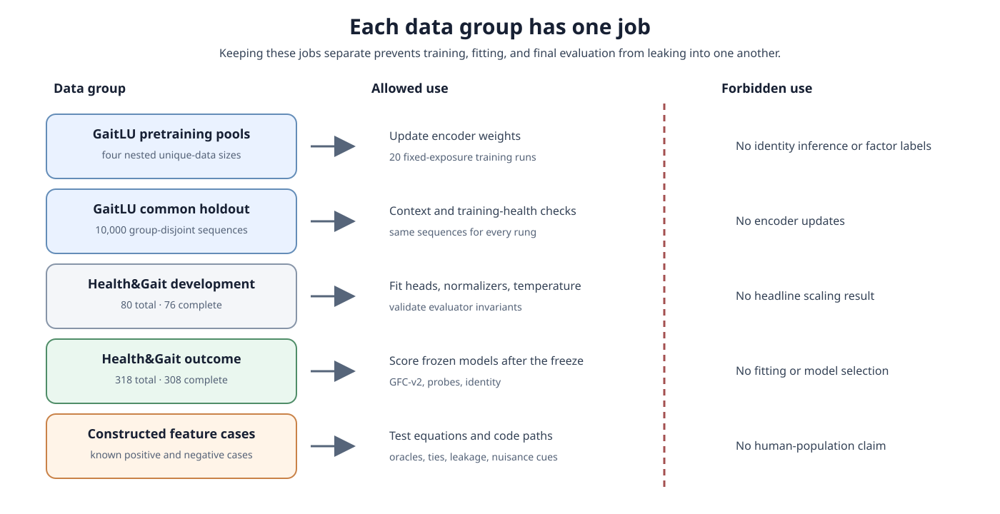
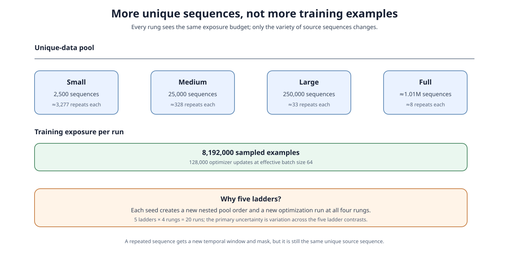
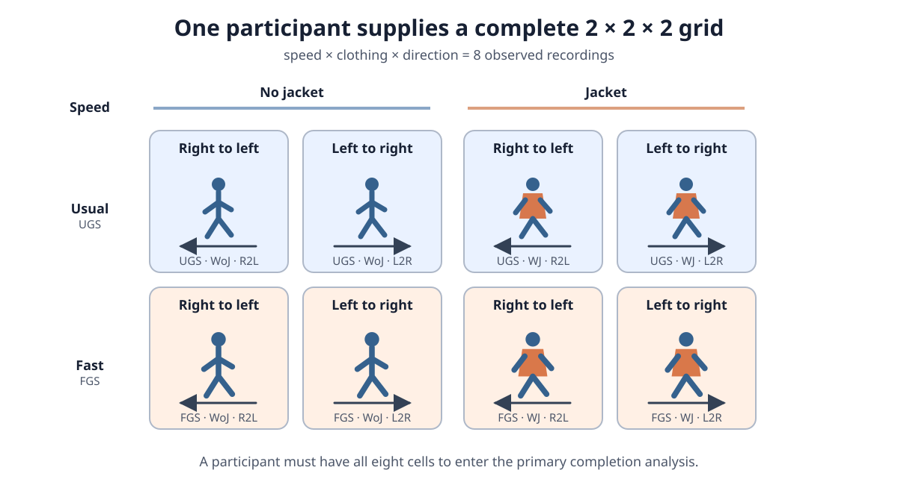
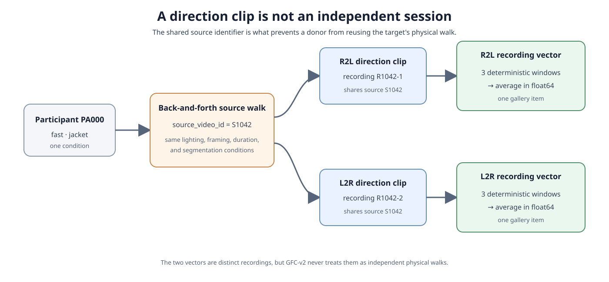

# Data guide

This document defines the shared data roles and the preprocessing used by the
unique-sequence scaling study. Its scientific motivation is in
[proposal.md](proposal.md), and its evaluation procedure is in [method.md](method.md).
The proposed hierarchical-diversity replacement uses the same role boundaries but has
its own [proposal](../hierarchical-diversity/proposal.md) and
[methods](../hierarchical-diversity/method.md).

The central rule is simple: **GaitLU-1M trains the encoder; Health&Gait evaluates the
frozen encoder.** No Health&Gait recording is used to update an encoder.

## 1. Give every dataset one explicit role

A *data role* is the set of operations a group of examples is allowed to influence.
Separating roles prevents a result from benefiting, even indirectly, from the data on
which it will be judged.



| Data group | What it is used for | What it must not influence |
|---|---|---|
| GaitLU pretraining pools | Train 20 encoders | Health&Gait evaluation rules |
| GaitLU common holdout | Check training health and context reliance | Encoder updates |
| Health&Gait development cohort | Fit small evaluation readouts and validate the evaluator | Headline scaling results |
| Health&Gait outcome cohort | Compute the locked outcomes | Model or protocol choices |
| Constructed procedural cases | Test whether the code behaves as designed | Claims about people or generalization |

The repository also contains older Health&Gait-only experiments. They used different
roles and a different evaluator. Their aggregates remain preliminary evidence in
[results.md](results.md), not results of the unique-sequence scaling study.

## 2. Prepare GaitLU-1M for encoder pretraining

The exact HAIC conversion, loader-smoke, and twenty-run commands are in
[gaitlu_training.md](../gaitlu_training.md).

The v2 preparation, indexed-loader, and primary-exposure code now exists and passes
synthetic tests. The private 100-shard corpus has not yet been processed with it, so the
eligible count, exclusion count, actual rung sizes, storage use, and measured throughput
remain unknown. Treat all nominal counts below as design targets until
`study_pools.json` is produced and reviewed on HAIC.

GaitLU-1M contains about 1.02 million unlabelled silhouette sequences. A *silhouette
sequence* is an ordered set of binary-looking frames in which foreground pixels show a
walking body. The study uses no identity, speed, clothing, or direction labels from
GaitLU. Use is governed by the dataset's research terms. Anonymous sequence numbers are
not verified identities and must not be used to infer or recover identities.

### 2.1 Validate first, then count

Before making any training pool:

1. Check that each sequence decodes, has enough frames, uses a valid silhouette range,
   and does not contain too many empty frames.
2. During preparation, hash each packed record together with its shape, reuse identical
   storage, group exact duplicates, and retain one canonical copy.
3. Preserve any distributor-provided *source group*. A source group contains sequences
   that may come from the same original video or capture event.
4. If source metadata are missing, say so. Treat each exactly deduplicated sequence as
   a singleton and audit a sample for near-duplicates. Do not invent an unvalidated
   million-sequence clustering.
5. Reserve 10,000 group-disjoint sequences as a common holdout.
6. Call the number of remaining eligible sequences $U_{\max}$ and report its measured
   value.

For example, if two files have different names but identical frame content, their
preparation hashes place them in one duplicate group. Only one may enter the eligible
corpus. If three clips are known to come from the same source video, all three stay
together when the data are split. Content hashes remain in the preparation inventories,
not the finalized training and holdout manifests.

The paper should say “about one million” or “roughly a 400-fold range” only when the
validated counts support those descriptions.

### 2.2 Build four nested pools, five times

For each of five replicate seeds, source groups receive a reproducible random order.
Prefixes of that order create four pools as close as possible to:

- 2,500 unique sequences;
- 25,000 unique sequences;
- 250,000 unique sequences; and
- all $U_{\max}$ eligible sequences.

The pools are *nested*: every item in the 2.5k pool also appears in the 25k pool, and so
on. A source group is never split merely to hit a round number. Record the actual size,
seed, grouping policy, manifest path, and exclusions for every pool.



The five seeds create five *ladders*, and each ladder has four rungs. The complete
experiment therefore trains $5\times4=20$ encoders.

### 2.3 Hold training exposure fixed

Every encoder sees the same number of training examples:

$$
C=8{,}192{,}000\text{ examples per run}.
$$

With effective batch size 64, this is 128,000 optimizer updates. A new temporal crop and
mask can be sampled when a sequence is revisited, but the underlying sequence is still
a repetition. The approximate repetition rate is $C/U$:

| Pool size $U$ | Approximate passes through the unique pool |
|---:|---:|
| 2,500 | 3,277 |
| 25,000 | 328 |
| 250,000 | 33 |
| $U_{\max}\approx1.01$ million | about 8 |

This fixed exposure isolates the intended comparison: changing the diversity of unique
sequences while keeping total training examples constant.

Before launching all 20 runs, use the 25k pool for a systems pilot and the full pool for
a short read-and-update probe. The full-pool probe matters because a 2.5k pool may fit
in memory or page cache even when a million-sequence pool cannot be streamed quickly.
The checked-in primary configuration implements 8,192,000 examples. If the prespecified
throughput gate selects 4,096,000 examples, add and freeze the compatible fallback
configuration and regenerate the training registry before launching any primary run.

### 2.4 Keep one common GaitLU holdout

The reserved 10,000 sequences never contribute an encoder update. Every trained encoder
is evaluated on this same set for:

- training-health checks; and
- context-reliance interventions described in [method.md](method.md).

When the context experiment needs a similar or dissimilar replacement sequence, it
uses fixed, non-learned descriptors: frame count, foreground-area summaries,
centroid-trajectory summaries, and motion extent. This choice prevents a trained model
from defining its own comparison set.

For resume safety, each GaitLU checkpoint records one SHA-256 digest over the ordered
pair of complete training and holdout manifests. This checkpoint digest is distinct
from preparation content hashes. The runtime loader validates manifest structure,
paths, record bounds, and read lengths, but it does not hash records; same-length packed
bit corruption is therefore not detected while loading. The v2 format is a clean break:
regenerate prepared outputs in a clean directory, and do not resume checkpoints created
with the v1 prototype data contract. Before GFC-v2 parses a Health&Gait feature archive,
preflight independently compares every checkpoint digest with the corresponding value
frozen by GaitLU finalization in the original private training registry. Health&Gait
compatibility is unchanged.

## 3. Turn Health&Gait recordings into evaluation examples

Health&Gait is governed human-participant data and is not redistributed with this
repository.

- Dataset release: [Zenodo record 14039922](https://zenodo.org/records/14039922)
- Provider repository: [AVAuco/healthgait](https://github.com/AVAuco/healthgait)
- Data-use agreement: [DUA.txt](https://github.com/AVAuco/healthgait/blob/main/DUA.txt)
- Dataset paper: [Health & Gait: A Dataset for Gait-Based Analysis](https://www.nature.com/articles/s41597-024-04327-4)

Follow the provider's agreement before downloading. Keep the extracted release in the
ignored local tree:

```text
data/
  healthgait/
    raw/Health_Gait/
    manifests/
    processed/
    diagnostics/
    probe_exports/
```

### 3.1 Understand the three factors

Health&Gait varies three binary experimental conditions:

| Factor | Value 0 | Value 1 |
|---|---|---|
| Speed | usual (`UGS`) | fast (`FGS`) |
| Clothing | without jacket (`WoJ`) | with jacket (`WJ`) |
| Direction | right-to-left (`R2L`) | left-to-right (`L2R`) |

These produce $2\times2\times2=8$ condition cells. A *complete participant* has one
valid direction recording in every cell.



“Fast” is an instructed condition, not an instrumented measurement of exact velocity.
The labels tell us which condition was requested; they do not tell us the participant's
precise speed in each video.

### 3.2 Preserve recording lineage

One physical back-and-forth walk produces two direction clips. Those clips share a
`source_video_id`, so they are related observations rather than independent sessions.



For example, participant `PA000` walking fast with a jacket may produce source video
`S1042`. Splitting that video yields an `R2L` clip and an `L2R` clip, but both retain
`source_video_id=S1042`. The method uses this field to prevent a target and its donors
from coming from the same physical walk. Filename guesses are not an acceptable
substitute.

### 3.3 Build and inspect the manifest

After placing the release locally, build the historical manifest with:

```bash
uv run python scripts/build_healthgait_manifest.py --fps 30
```

The acquisition is nominally 30 Hz. Verify the actual frame rate for the local release
and supply it explicitly because duration is one of the declared acquisition cues. A
*manifest* is a table that gives
each clip a stable identity and records how it was produced. A GFC-ready manifest
contains at least:

```text
subject_id,recording_id,source_video_id,direction_clip_id,
speed,clothing,direction,frame_dir,num_frames,fps,split
```

A simplified row might read:

```text
PA000,PA000_FGS_WJ_R2L,S1042,R2L,FGS,WJ,R2L,.../frames,63,30,train
```

Read this as: participant `PA000`, fast speed, jacket, right-to-left clip, 63 frames at
30 fps, derived from physical source walk `S1042`. The displayed 30 fps is a simplified
example; use the verified local rate. The final `split` value belongs to an older
experiment; it does not determine the revised development and outcome roles.

### 3.4 Make one vector per direction recording

The encoder expects 16 frames. Each valid direction clip supplies three distinct,
deterministic 16-frame windows. A clip needs at least 18 contiguous frames to make those
windows distinct; shorter clips are excluded rather than copied or padded into false
replicates.

The encoder maps each window to a vector. The three vectors are averaged element by
element in float64, the standard 64-bit floating-point format, producing **one recording
vector**. Thus, three windows improve the stability of one observation; they do not
become three independent participants or three gallery entries.

### 3.5 Extract a matched acquisition-cue baseline

For each clip, also calculate nine simple measurements from all decoded frames:

1. log frame count;
2. duration;
3. signed horizontal displacement from the first to last nonempty silhouette;
4. absolute horizontal displacement; and
5. mean, population standard deviation, 25th percentile, median, and 75th percentile of
   foreground-area fraction.

These are called *acquisition cues* because they can reflect clip length, framing,
direction, or body area without requiring a learned gait representation. For example,
a positive signed displacement can reveal one walking direction, while duration may
partly reveal an instructed speed. If these nine cues solve the task, a learned encoder
may be exploiting a shortcut rather than richer motion structure.

Empty silhouettes count toward frame count and duration and contribute zero foreground
area. Displacement uses the first and last nonempty silhouettes, with horizontal
coordinates divided by `width - 1`. Foreground pixels are values above `0.5` after
grayscale scaling to `[0, 1]`.

### 3.6 Freeze the two participant cohorts

The revised roles are separate from the historical manifest's `train` and `val` text:

- **Development cohort:** the existing 80-person group, with 76 complete cases. It may
  fit factor heads, normalizers, and one soft-control temperature, and it may validate
  evaluator invariants. It produces no headline scaling outcome.
- **Prospective outcome cohort:** the other 318 participants, with 308 complete cases in
  the current manifest. After the protocol is frozen, it is used only for scoring.

No participant in either cohort contributes an encoder update. The outcome cohort is
called *prospective*, not *untouched external*, because its recordings and labels
informed earlier experiments in this repository.

Before opening outcomes, save the exact private `healthgait-gfc-v2-roles-v1` role map.
Only its version and aggregate assigned, complete, and excluded counts enter summaries;
the participant IDs and map path remain private, and the aggregate contract intentionally
requires no cohort checksum. Then freeze the evaluator, data rules, 20 primary model
runs, reference checkpoints, analysis script, effect thresholds, and figure templates
in a timestamped commit. During development, exported features may be checked for
schema and counts, but aggregate GFC-v2 and identity outcomes must remain unopened.

## 4. Use constructed cases to test the instrument

Small, artificial feature arrays provide answers known in advance. They test exact
three-factor recovery, every partial-factor oracle, nuisance-only features, donor
attraction, constant predictions, and shortcut leakage. A few controlled clips are
also enough to test the nine acquisition-cue extractors.

These cases answer “Does the evaluator implement the protocol?” They cannot answer
“Does the model generalize to another population?”

## 5. Keep auxiliary participant tables outside the primary study

Health&Gait includes sensitive participant variables such as age, recorded sex, height,
weight, body-mass index, and body circumferences. They do not enter encoder training,
GFC-v2, or subgroup capability analyses.

`gait_parameters.csv` contains OptoGait and MuscleLAB summaries such as cadence, step
length, support time, and velocity. They are participant-by-speed summaries and were
not synchronized frame by frame with each video pass.
`gait_parameters_estimation.csv` is camera-derived, so it is not an independent
external criterion. Neither table is a primary outcome.

## 6. Privacy and scope limits

- Keep raw data, participant tables, participant embeddings, participant-level outputs,
  and checkpoints trained on participant data outside Git.
- Publish aggregates only. Do not publish nearest-neighbor examples or an
  identity-capable checkpoint.
- Treat silhouettes and learned embeddings as identifying data, not as anonymous
  artifacts.
- One recording per condition cell cannot measure same-condition repeatability.
- A controlled side-view cohort does not establish transfer to RGB video, other camera
  views, other activities, or other populations.
- GaitLU source grouping may remain incomplete when distributor metadata are absent.
- Reusing Health&Gait cohorts limits independence even though all revised encoders are
  trained only on GaitLU.

## 7. Data-readiness checklist

Before the outcome run, verify that:

- every GaitLU pool has an actual count, source-group policy, manifest path, and
  exclusion log, and every checkpoint has one combined train-plus-holdout manifest
  digest that passes preflight comparison against the original private training registry;
- the 10,000 GaitLU holdout sequences are group-disjoint from all training pools;
- every complete Health&Gait participant has exactly eight unique factor cells;
- each direction recording has a valid `source_video_id` and at least 18 contiguous
  frames;
- the revised role map, not the historical `split` field, controls data access; and
- no outcome aggregate has influenced training, model selection, or evaluator design.
