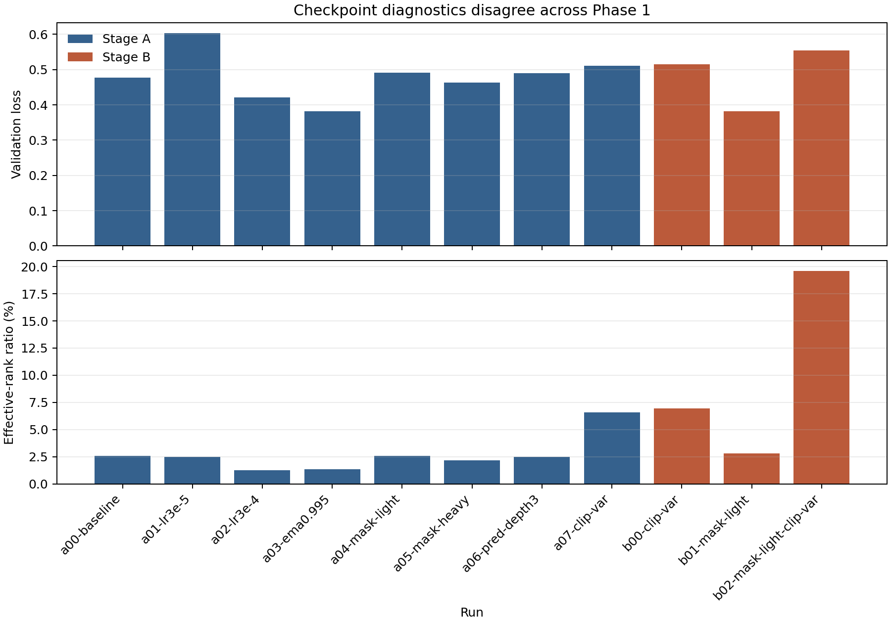
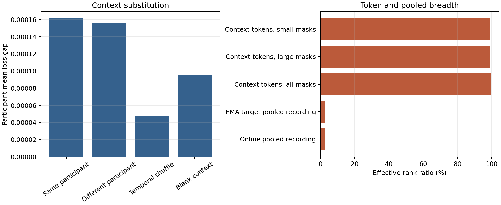

# Results and evidence trajectory

## Status at a glance

The revised GaitLU scaling experiment has **not yet produced results**. Its evaluator,
preparation code, indexed loader, and primary training launcher are implemented, but the
private corpus has not been prepared and no eligible scaling checkpoint exists. Current
checked-in result artifacts come from earlier Health&Gait-only, seed-0 experiments and a
legacy GFC protocol. They justify the revised question and expose design failures; they
do not answer whether unique-data scale improves GFC-v2.

| Stage | Data and protocol | What exists | Evidentiary role |
|---|---|---|---|
| Phase 0 | Health&Gait encoder, one seed | Training, pooling, context, identity, and speed diagnostics | Feasibility and anomaly discovery |
| Phase 1 | Health&Gait encoder sweep, one seed | Diagnostic comparison across checkpoints | Shows standard metrics disagree |
| Legacy GFC | 24 queries, two donors deleted, 308 complete fit / 76 complete evaluate participants | Development scores for three checkpoints | Preliminary result and protocol self-audit |
| Revised ICLR study | GaitLU-only encoders, GFC-v2, 20 runs, locked 318-person outcome cohort (308 complete) | Preparation/training code only; no corpus-derived checkpoints or outcomes | Planned prospectively locked scaling audit |

The terms *primary*, *development*, and *confirmation* in historical compact files refer
to their original analyses. They must not be carried into the revised protocol without
the version and cohort qualifiers below.

## Stage 1: Phase 0 feasibility and conflicting diagnostics

The seed-0 baseline used 2,506 Health&Gait training sequences from 318 participants and
624 validation sequences from 80 participant-disjoint participants. For feature export,
each sequence supplied three contiguous 16-frame model inputs at the earliest, middle,
and latest valid start positions, without random augmentation. Each window produced one
pooled feature row, yielding 7,518 training rows and 1,872 validation rows. The three
rows from a sequence are correlated views of the same recording, not three independent
observations or inferential sample units.

At the epoch-80 best-loss checkpoint:

- subject-balanced validation loss was `0.387394`;
- pooled effective rank was `10.452` of 384;
- wrong-context excess loss was about `0.000154`;
- closed-set identity accuracy was `9.25%`;
- held-out identity retrieval was `2.45%`; and
- instructed-speed balanced accuracy was `92.57%`.

The epoch-100 endpoint had similar validation loss and pooled breadth. These results
showed that the trainer and feature export worked and that speed was linearly
recoverable. They did not demonstrate factorization or meaningful use of context.

The compact source is `results/phase0_summary.json`; the active table is
[phase0_table.csv](../../results/generated/phase0_table.csv).

## Stage 2: Phase 1 checkpoint disagreement

The Phase 1 sweep varied learning rate, target momentum, mask difficulty, predictor
depth, and pooled clip-variance regularization, while retaining seed 0 and the same
participant split. Different diagnostics selected different checkpoints:

- `a03-ema0.995` had the lowest selected Stage A validation loss (`0.3818`) but only
  `1.35%` effective-rank ratio and a near-zero context gap;
- `a05-mask-heavy` had the strongest Stage A closed-set identity accuracy (`10.74%`);
- `a04-mask-light` had the strongest Stage A speed balanced accuracy (`93.75%`);
- `a07-clip-var` increased effective-rank ratio to `6.57%` and held-out retrieval to
  `4.04%`, while speed balanced accuracy fell to `89.26%`;
- `b02-mask-light-clip-var` produced the broadest pooled representation (`19.58%`),
  largest wrong-context gap (`0.1136`), and highest held-out retrieval (`4.84%`), but
  speed balanced accuracy was `88.41%`; and
- `b01-mask-light` had the lowest selected Stage B validation loss (`0.3823`) and
  `92.52%` speed balanced accuracy, but only `2.83%` effective-rank ratio.

This rank disagreement motivated a real-target completion test. It did not identify
which checkpoint had scientifically better factor structure.

Source: `results/phase1_summary.csv`. Generated outputs:
[phase1_table.csv](../../results/generated/phase1_table.csv) and the figure below.



## Stage 3: context and pooling diagnosis

Token-level diversity did not survive recording pooling. Context tokens had effective
rank `381.58` of 384, whereas the pooled online recording representation had effective
rank `10.44`. A broad token representation therefore did not guarantee a broad pooled
representation.

To test whether prediction depended on the visible context, the diagnostic kept the
masked target fixed and changed only the context supplied to the model. It reports a
*loss gap*: loss with the altered context minus loss with the correct context. A
positive gap means that altering the context made prediction worse; a gap near zero
means that the intervention had little effect.

- Replacing the context with a clip from another participant increased loss by
  `0.000156`.
- Replacing it with a different clip from the same participant increased loss by
  `0.000161`.
- Shuffling the context in time increased loss by `0.0000475`.

All three changes were small. The diagnostic also separated target tokens according to
whether they covered the walking silhouette. A token was called foreground when its
corresponding image content exceeded the fixed `0.05` pixel threshold; only `9.62%` of
target tokens met that rule. Under cross-participant context replacement, the loss gap
was `0.0000467` on foreground target tokens and `0.0001679` on background target tokens.
The larger background response suggests that this intervention was more sensitive to
background or acquisition differences than to the silhouette itself. It does not prove
which cue caused the response.

These values motivated the revised normalized, geometry-matched intervention. They do
not show that every JEPA ignores context, isolate identity, or prove that a particular
acquisition shortcut causes prediction.

Source: `results/context_diagnosis.json`.



## Stage 4: legacy GFC development results

### Historical protocol

The checked-in GFC summaries used the old protocol, not GFC-v2:

- 308 complete participants from the historical training group fitted adapters and
  normalizers;
- 76 complete participants from the historical validation group were evaluated;
- every participant contributed 24 queries;
- a fixed condition donor and one of three gait donors supplied two blocks;
- both donors were removed, leaving a six-cell gallery; and
- the shortcut path did not have the revised, fully matched three-head capacity.

The table is retained because it is the quantitative evidence that triggered the
redesign.

| Checkpoint | Legacy normalization | Learned top-1 | Shortcut top-1 | Legacy gain | 95% participant bootstrap |
|---|---|---:|---:|---:|---:|
| A00 baseline | `raw_retain_all` | 69.79% | 65.46% | +4.33 pp | [+0.27, +8.22] pp |
| A00 baseline | `raw_effective_rank` | 61.07% | 61.25% | -0.19 pp | [-2.20, +1.76] pp |
| A00 baseline | `pca_effective_rank` | 69.68% | 61.25% | +8.43 pp | [+4.78, +12.18] pp |
| B01 mask-light | `raw_retain_all` | 63.76% | 65.46% | -1.70 pp | [-5.98, +2.47] pp |
| B01 mask-light | `raw_effective_rank` | 59.57% | 61.25% | -1.68 pp | [-3.92, +0.55] pp |
| B01 mask-light | `pca_effective_rank` | 63.76% | 61.25% | +2.51 pp | [-2.00, +6.97] pp |
| B02 mask-light + clip variance | `raw_retain_all` | 57.51% | 65.46% | -7.95 pp | [-12.17, -3.78] pp |
| B02 mask-light + clip variance | `raw_effective_rank` | 56.63% | 61.25% | -4.62 pp | [-6.82, -2.51] pp |
| B02 mask-light + clip variance | `pca_effective_rank` | 57.51% | 61.25% | -3.74 pp | [-7.73, +0.20] pp |

Under that analysis, A00 exceeded the declared shortcut path, B01 did not separate from
it, and B02 underperformed it. Diagnostic breadth and held-out identity retrieval
therefore did not predict legacy GFC performance across these three selected
checkpoints. This is a descriptive rank inversion over three models, not a population
estimate of how often standard diagnostics fail.

Source: `results/gfc-*/summary.json`. Generated output:
[legacy_gfc_table.csv](../../results/generated/legacy_gfc_table.csv) and the explicitly legacy figure
below.


## Why the legacy positive result is not confirmatory

Adversarial self-audit identified five material limitations.

### Candidate deletion distorted the null

Deleting the two donors removed particular incorrect candidates. Under the original
rule, a speed-and-direction solver that ignored clothing scored $2/3$, while a
clothing-and-direction solver that ignored speed scored $1$. Uniform chance was $1/6$.
The gallery therefore made some missing factors cheaper than others and made speed free
in one two-factor case.

### The shortcut nearly reached the relevant oracle

The A00 shortcut scored 65.46%, near the 66.67% clothing-blind partial oracle of the
legacy gallery. Learned A00 scored 69.79%. The 4.33-point learned-minus-shortcut contrast
was about one of 24 queries per participant and cannot be described as recovering a
large fraction of information.

### One donor rule could reuse the target's physical walk

For one third of legacy queries, an opposite-direction donor could be the other half of
the target's back-and-forth source video. Recording-level target abstinence therefore
did not guarantee session-level independence.

### Development data influenced checkpoint and method choices

The same 80-person group informed checkpoint comparison and legacy GFC evaluation. The
76 complete participants yielded estimated power around `0.52` for an effect of one
additional successful query, with a rough planning estimate of 144 complete participants
for `0.80` power. The positive interval did not make the analysis independent or well
powered for model-level scaling claims.

### Comparator-specific dimension reduction changed the answer

The effective-rank sensitivities compressed learned and shortcut blocks differently.
They were useful diagnostics of fragility but were not comparator-neutral alternatives
to the declared primary analysis.

Together, these findings mean the legacy table is evidence for revising the instrument,
not evidence that data scale improves compositional representation.

## Stage 5: unique-sequence scaling proposal

The unique-sequence experiment replaces every material legacy choice:

| Legacy issue | Revised design |
|---|---|
| Health&Gait-trained encoders | Encoders train only on nested GaitLU pools |
| One seed and selected checkpoints | Five replicated four-rung ladders, 20 primary runs |
| 24 queries with fixed block roles | 16 session-safe queries with speed or clothing focal |
| Donors removed | All eight cells retained in the primary gallery |
| Non-uniform partial-factor ceilings | Exact symmetric spectrum: $1/8$, $1/4$, $1/2$, $1$ |
| Comparator capacity mismatch | Identical three-head ridge fitting and normalization |
| Same-source donor possible | Both donors must differ from target `source_video_id` |
| 80-person development evaluation | 80-person adapter development; locked 318-person outcome cohort |
| Raw context loss gap | Normalized paired near-substitute ratio on common GaitLU holdout |
| Competing identity metrics | One frozen cross-condition rank-1/MRR protocol |
| Classification explanation untested | Independent-factor completion top-1 and soft calibration diagnostics |

No file currently contains a GFC-v2 outcome for a GaitLU scale rung. In particular, the
numbers `69.79%`, `65.46%`, and `+4.33 pp` must never appear in a figure or abstract as
results of the unique-sequence scaling study.

## Planned result table and decision trajectory

The first unblinded table will show all four rungs for each of five replicates, plus the
mean and run-level interval. At minimum it reports learned GFC-v2 top-1, shortcut top-1,
independent-factor completion, soft calibration diagnostics, factor probes, near-context ratio, effective rank,
identity rank-1/MRR, training health, and throughput.

The primary estimand is full-minus-small learned GFC-v2 top-1. One of 16 queries defines
$\delta=6.25$ percentage points:

- **meaningful positive:** 95% interval above zero and estimate at least $\delta$;
- **positive but small:** interval above zero and estimate below $\delta$;
- **equivalent to flat at this resolution:** 90% interval entirely within
  $[-\delta,+\delta]$; or
- **inconclusive:** neither criterion is met.

Interpretation then follows the controls:

- if GFC-v2 and clothing-sensitive measures improve together, scale supports the
  protocol's factor-recombination outcome;
- if GFC-v2 is equivalent to flat while identity improves, the result is an
  identity–composition dissociation for this system;
- if independent-factor completion explains GFC-v2, restrict the claim to joint linear
  factor recoverability;
- if replicate curves disagree or uncertainty spans different readings, report an
  inconclusive result; and
- if the frozen protocol or full data rung fails, do not retrofit the legacy result into
  an ICLR scaling claim.

## Rendering the frozen GFC-v2 study

The study summarizer is the only component allowed to read private participant outputs.
It writes three aggregate files: `outcome_summary.json`, `run_table.csv`, and
`ladder_contrasts.csv`. Once all 20 runs pass the frozen study checks, render those
files from the tagged evaluator worktree:

```bash
uv run cody-jepa-make-gfc-study-results \
  --aggregate-dir /external/gfc-v2-study/aggregate \
  --output-dir outputs/gfc-v2-study/paper
```

The compatibility form is:

```bash
uv run python scripts/make_gfc_study_results.py \
  --aggregate-dir /external/gfc-v2-study/aggregate \
  --output-dir outputs/gfc-v2-study/paper
```

The renderer enforces the frozen `gfc-v2-study-aggregate-v1` schema, exactly 20 ordered
model rows and five ladder rows, the primary alpha and normalization, and agreement
between the JSON and CSV contrasts. It emits:

- `gfc_study_run_table.csv`, containing the primary learned and shortcut results, hard
  and soft controls, and all four declared sensitivity results;
- `gfc_study_ladder_contrasts.csv`, containing each four-rung curve and its paired
  full-minus-small interval; and
- `gfc_study_scaling.pdf` and `gfc_study_scaling.png`, showing the five prespecified
  curves and their restrained mean curve.

The renderer reads no feature archive, role map, registry, checkpoint, participant row,
or source identifier. It refuses legacy and mixed-protocol inputs and removes its own
stale outputs before each attempt, so a failed validation cannot leave an older figure
looking current. Aggregate result files are committed only after the tagged run is
unblinded; evaluator and figure code must not change in that result-only commit.

## Regenerating existing preliminary artifacts

The current generator reads compact historical files directly:

```bash
uv run python scripts/make_paper_results.py \
  --results-dir results \
  --output-dir results/generated
```

It does not consume notebooks or prose as data sources. The separate revised-study
aggregate contract records protocol version, gallery policy, query count, role-map
version and aggregate counts, rung size, pool seed, optimization seed, exposure, code
commit, and analysis-freeze tag so legacy and GFC-v2 outputs cannot be silently
combined. Private identifiers and paths never enter the aggregate contract.

## Claims currently permitted

Current evidence supports only that:

- the historical model and feature pipeline ran on Health&Gait;
- token-level diversity, pooled breadth, loss, context gaps, probes, and identity can
  rank a small set of checkpoints differently;
- the legacy GFC result was sensitive to protocol and comparator choices; and
- those failures motivate the revised full-gallery, session-safe scaling audit.

Current evidence does **not** support that:

- more GaitLU data improves GFC-v2, context reliance, or identity;
- GFC-v2 exceeds its independent-factor controls;
- the 318-person outcome cohort (308 complete) confirms the preliminary result;
- any representation is causally disentangled;
- the findings generalize beyond one silhouette architecture and controlled dataset; or
- the system has clinical value or is safe for identity-sensitive deployment.
