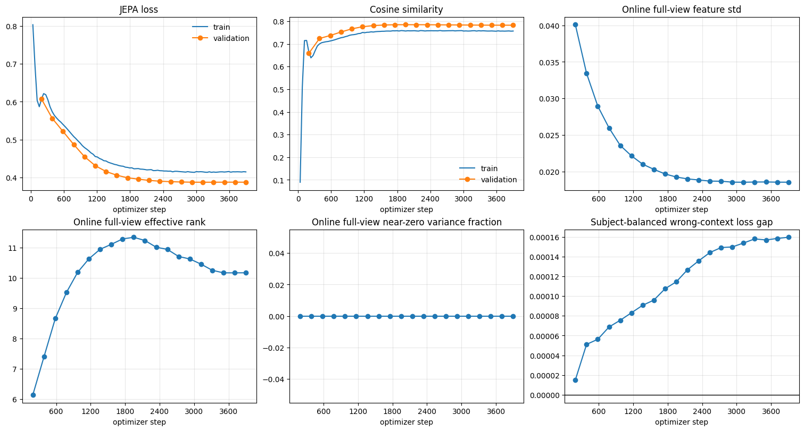

# Learning Gait Motion Without Labels

### A single-stream masked-JEPA feasibility study for CoDy-JEPA

*Run 91108 · retained notebook `haic-results/job_91108.ipynb` · local artifact `outputs/jepa-v4` · architecture `cody-jepa-single-stream-masked-v3` · Health&Gait silhouettes · NVIDIA H100*

**The question.** Can a single video stream learn useful walking-motion features by predicting hidden parts of a clip from the visible parts — *without* collapsing into a trivial constant? **The short answer.** The pieces that matter first are in place: the model learns a strong, generalizing signal and decisively avoids the collapse that ruined two earlier runs. It is not yet strong enough to hand off, and the results below show exactly which two properties still fall short.

## What the model produces, and how it is scored

The model turns each 16-frame clip into a **representation**: a list of 384 numbers that summarizes it, like a fingerprint. During training it hides part of a clip and learns to predict the hidden part's numbers from the visible part. Every result below is measured on a **validation set of 80 people the model never trained on**, so good scores reflect genuine generalization rather than memorization.

The central danger is **collapse**: a lazy model can score well on the prediction task by emitting almost the same summary for every clip. That summary would be useless downstream, so most of the metrics below exist specifically to detect collapse. The figure is the notebook's own training dashboard; each panel is explained beneath it.

## Results, metric by metric

**1. Prediction error — "JEPA loss" (top-left).** This is how far the predicted numbers are from the true numbers for the hidden region; **lower is better**. Validation error fell smoothly from **0.808** in the untrained model to **0.387** at its best (epoch 80), and training error from 0.827 to 0.415. The validation curve sits at or below the training curve the whole way and no gap opens up between them, which means the model keeps improving on unseen people and is **not overfitting**. On its own, low loss is not proof of success — a collapsed model can also achieve low loss — so the remaining metrics check *how* that error was reduced.

**2. Cosine similarity (top-middle).** This asks whether the predicted summary "points the same way" as the true summary. It is a single score from **−1 to 1**: 1 means the two lists of numbers follow an identical pattern, 0 means they are unrelated, and −1 means opposite. It looks only at the *pattern*, ignoring overall size. It rose from **−0.01** in the untrained model (essentially random) to **0.76** on training data and **0.79** on validation, then plateaued. Predictions are therefore strongly aligned with the truth — a real learned signal, not noise.

**3. Effective rank (bottom-left) — the headline result.** The 384 numbers are only useful if they carry *independent* information. If many of them simply echo each other, the summary is effectively much smaller than 384. Effective rank estimates **how many genuinely independent descriptors are actually in use**. An analogy: 384 dials are worthless if 380 are secretly wired to copy the other four — you really have four dials. A fully collapsed model has an effective rank near 1–2, describing every clip almost identically. Here, the untrained model sat at **2.4** — the very range that trapped the two prior runs (90881, 91023) whose only safeguard was a slow-moving "teacher" copy of the network. This run added two extra safeguards (described below) and, within five epochs, effective rank climbed to **6.1**, peaked at **11.3** near epoch 50, and settled around **10.2**. Escaping the near-collapse floor and holding roughly ten independent descriptors is the run's clearest success.

**4. Effective-rank ratio.** The same quantity expressed as a fraction of the 384 available slots — *what share of its descriptive capacity the model uses*. At 10.2 out of 384 this is about **0.027 (2.7%)**, against a health target of **0.05 (about 19 descriptors)**. So the representation is alive and non-collapsed, but still uses only a thin slice of its capacity: richer than before, not yet rich enough to be certified healthy.

**5. Feature standard deviation (top-right).** This measures how much the feature values **spread out across different clips**. If it falls toward zero, the model is emitting nearly the same summary for everything — the signature of collapse. It declined from about **0.040** to about **0.019** and then held steady, remaining roughly **19× above the collapse floor of 0.001**. The gradual decline is normal as the model tightens its representation; what matters is that it stabilized well clear of zero, so summaries stayed meaningfully different from clip to clip.

**6. Near-zero-variance fraction (bottom-middle).** Of the 384 slots, this is the share that barely change from clip to clip — the "dead" dimensions carrying no information. It stayed at **0.000 for the entire run** (the health limit permits up to 0.5). Not one dimension went dead: an unambiguous sign that the anti-collapse safeguards worked.

**7. Subject-balanced wrong-context loss gap (bottom-right) — the key shortfall.** This is the most important diagnostic. Normally the model predicts a clip's hidden part from the visible part of the *same* person's clip. This test instead feeds it the visible part from a *different, randomly assigned* person and re-measures the error. If the model truly relies on the specific motion it is shown, the error should jump when it is handed the wrong person's motion — so the **gap** (wrong-context error minus correct-context error) should be clearly **positive**. ("Subject-balanced" simply means the swaps are spread evenly across people so no individual skews the number.) The gap grew steadily from near zero to about **0.00016**, but the health target is **0.001** — so it stayed roughly **six times too small**. Context-dependence is emerging in the right direction, yet remains far too weak: the model is leaning mostly on a clip's static *shape* rather than its *motion*. This is the run's central shortfall and the first thing to fix.

**The overall verdict.** The notebook applies an automated health gate that certifies a checkpoint only if *every* check passes. This run passed on feature spread and dead-dimension count, but failed the effective-rank-ratio and wrong-context-gap thresholds — so it produced a valid best-loss checkpoint (epoch 80) but no "healthy" one. That is the honest, intended outcome: it proves the training pipeline can learn a strong, non-collapsed representation, while pinpointing the two properties — fuller use of capacity and, above all, genuine reliance on motion — that are still missing.

## Why it matters, and what is next

These results are the groundwork for the project's real targets. **Ambient intelligence** (passive fall and activity monitoring in homes and clinics) is bottlenecked by labels; a model pretrained this way on abundant unlabeled silhouettes offers a privacy-aligned backbone to adapt with very little labeled data. **Biomechanics** goals — next-action prediction and balance-score estimation — are inherently predictive and temporal, a natural fit for fine-tuning V-JEPA 2 and SAM 3D. Crucially, the wrong-context diagnostic is exactly the test that will tell us whether such a fine-tuned model has learned real motion rather than a shortcut that fails on a new patient. The immediate next step follows directly from result 7: strengthen the temporal objective and masking so the model must use motion history, then raise capacity use (result 4) without reintroducing collapse — before advancing to the full dual-stream, counterfactual CoDy-JEPA design.
