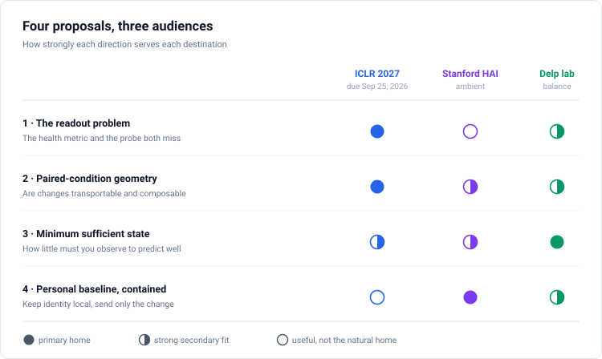

# Overview and Evaluation

**A synthesis of three planning documents, an adversarial review of every idea in them, and a ranked recommendation for ICLR 2027**

Prepared August 14, 2026. ICLR 2027 abstracts are due September 18, 2026 and papers on September 25, 2026, which leaves about six working weeks including a sensible experiment freeze.

---

## How to read this folder

Four proposals, each written as a standalone document with an ICLR core and two extensions.

| | Proposal | Core question |
|---|---|---|
| 1 | [The readout problem](01-readout-problem.md) | Do the parts of a model that different uses can see grow independently, so that no single score can rank models |
| 2 | [Paired-condition geometry](02-paired-condition-geometry.md) | Does a video model represent a change in how a body moves, or only how it looks |
| 3 | [Minimum sufficient state](03-minimum-sufficient-state.md) | How little must be observed before prediction stops improving |
| 4 | [The contained personal baseline](04-personal-baseline.md) | Should the identifying part of a health signal ever leave the building |

---

## Part 1: What changed after checking the facts

The three source documents disagree with each other on several load-bearing points, and where they disagree, one of them is usually wrong. I checked each against the published dataset paper and against the files in this repository.

This is not bookkeeping. Six of these corrections change what a proposal is allowed to claim.

**The dataset has no randomised assignment.** Everyone walked at their usual pace first and was then asked to repeat the same path as fast as they could. The jacket was the participant's own and was worn whenever possible, which is opt-in with non-random missingness rather than an assigned appearance manipulation. The two directions are the two halves of one recording, split afterwards. The single most confident sentence in the source material, that this is the only real-world human-motion dataset with orthogonal assigned physical factors at three-figure subject scale, does not survive. The correct term throughout is paired conditions, and Proposal 2 is written that way.

**The modalities are not four co-registered views.** Silhouette and segmentation are both 960 by 540 and frame-aligned with each other. Optical flow is 480 by 270 with a different frame count and a different directory structure. The segmentation carries 14 flat part labels and no surface coordinates, not 24 labels plus surface coordinates. Any proposal that treated the four renderings as a controlled ladder of the same physical event was building on a description that does not match the files.

**The frame rate is documented.** It is 30 Hz in the source paper and there is already an fps column in this repository's own manifest. Absolute-time statements are available, so a sixteen-frame clip is 0.53 seconds and can be described that way.

**One objection raised against this codebase is itself wrong.** The claim that the blank-context diagnostic is broken because zeroing a normalised tensor produces mid-gray does not apply here. The only normalisation in the data pipeline divides by 255, so zero really is black. The archived diagnostic metadata also states explicitly that the blank was constructed in raw pixel space before normalisation. This objection should be dropped rather than scheduled.

**The deadline dispute is settled.** Three official conference pages agree on September 18 for abstracts and September 25 for papers. The plan built on September 11 and 16 was working with nine days less than it had.

---

## Part 2: What I found that the source documents missed

All of this came out of artifacts already sitting in this repository. None of it needed a new training run, and the whole set took under an hour.

### The headline probe is beaten by a clock

Every document treats the two-class walking-pace probe, scoring 0.88 to 0.94 against a chance rate of 0.50, as the repository's one working downstream result. All three call for a classical baseline. None ran one.

The manifest already carries a per-recording duration column. Fitting a single threshold on the training participants and applying it to the eighty held-out participants gives 0.9519, with a subject-clustered 95 percent interval of 0.9245 to 0.9755. The best learned checkpoint gets 0.9375. Every model in the repository sits inside or below the interval of a stopwatch.

The comparison is not like-for-like, because duration is a recording-level quantity and the model sees only a 0.53 second window. That does not soften the conclusion. It means the label is essentially "did this person cross the corridor quickly", which is a property of the protocol rather than of the representation. A number from that probe cannot distinguish a good representation from a bad one.

Matching the evaluation set on duration confirms it. Binning recordings into quarter-second duration bins and keeping equal numbers of usual and fast recordings within each bin leaves a set on which duration is uninformative. Every checkpoint collapses: the eleven runs go from a mean of 0.921 to a mean of 0.560, with the best at 0.631 and the worst at 0.510 against a chance rate of 0.500. Almost all of the reported accuracy was the shortcut.

The matched probe also does not rescue the story, and this has to be said plainly. Its correlation with pooled rank is minus 0.62, so removing the shortcut does not flip the sign. Only 198 windows across 39 participants survive the matching, which is far too few to interpret, but it cannot be reported as support either. The walking-pace label is not a usable readout on this dataset in either form. Open-set retrieval is the only readout here with enough classes and enough power, which is a limitation of the testbed and the strongest reason Proposal 1 needs a second domain.

### The sweep that supposedly found nothing spans a factor of sixteen

The prior analysis dismissed the eleven-run parameter sweep on the grounds that every run landed within two standard errors on the two-class probe. That is true of that probe. On clip-pooled effective rank, which I computed from the exported features, the same eleven runs span 4.96 to 77.98.

Across those eleven runs, pooled rank correlates with held-out-subject retrieval at Spearman 0.89 with p equal to 0.0002 when estimated from 9,390 clips. Against the two-class probe the correlation is minus 0.56. The probe everyone reports moves in the opposite direction to every other measure of representation quality.

**That 0.89 is not robust, and the instability is itself a finding.** Estimating the same pooled quantity from the 1,872-clip validation split instead gives 0.260, and the two estimates agree with each other at only 0.382. Effective rank is a spectral quantity that needs many more samples than dimensions, and the smaller population supplies 4.9 samples per dimension against 24.5 for the larger. The bias is systematic rather than random: it truncates hardest on the genuinely high-rank models, underestimating the three clip-axis-variance runs by factors of 3.3 to 4.2 while barely moving the rest.

Token effective rank, measured on the same population, correlates with transfer at minus 0.100. It carries no information at all, which is the cleanest support the readout argument has.

This also suggests a stronger motivation for $\beta$ than the axis argument. A trace ratio needs only sums of variances and converges largely independently of dimension, while effective rank needs the whole eigenspectrum. If $\beta$ is dramatically more sample-efficient, that would explain why it could beat pooled rank rather than merely equal it. On a matched population the ordering is $\beta$ at 0.446, pooled rank at 0.260, token rank at minus 0.100, which is the predicted direction, but none of those is significant at eleven runs.

### The regularizer axis is a controllable cause, and it was already tested

Reading the training code against the run configurations shows something neither document noticed. In every sweep configuration, the clip-axis coefficient is present explicitly and the token-axis coefficient is absent, so the eight baseline runs had no anti-collapse regularization at all and the three others had clip-axis regularization only. The archived checkpoint that produced the token rank of 381.6 was trained with token-axis regularization. So the full three-way comparison already exists on disk: token axis guarded gives a healthy-looking token statistic and a pooled rank of 11.5, no regularizer gives pooled ranks of 5 to 12, and clip-axis guarded gives 20 to 78 with retrieval rising by about 1.6 times.

### The decisive control, run and passed

Both adversarial reviewers independently named the same missing control, and both predicted it would sink the rank argument. The prediction was that a randomly initialised encoder would show the same numbers, which would mean the measurement describes the architecture rather than the trained model.

| representation | random init | trained |
|---|---:|---:|
| clip-pooled, before final norm | 2.54 | 23.60 |
| token, before final norm | 12.31 | 63.39 |
| token, after final norm | 12.33 | 64.85 |

The random encoder shows a token rank of 12.3, not 381. Pooling the random encoder gives 2.5 while pooling the trained one gives 23.6, using an identical pooling operator on identical data. Both axes are model-dependent, and the layer-norm placement accounts for about two percent rather than the bulk. The pooling-artifact and position-basis explanations are both ruled out.

One methodological point falls out of this and belongs in the paper. The same checkpoint gives a pooled rank of 78.0 estimated over 9,390 clips from 398 people and 23.6 over 1,872 clips from 80 people. Both are correct. Neither is interpretable without stating the estimation population, and the same goes for the axis and the normalisation.

### The covariance split turns the discrepancy into a quantity

For equal numbers of tokens per clip, the law of total covariance gives an exact identity: token covariance is the sum of between-clip covariance and within-clip covariance, while the covariance of mean-pooled features is exactly the between-clip term. Define $\beta$ as the between-clip trace divided by total token trace.

On the 1,872-clip held-out split, using 2,935,296 tokens and identical measurement code per model, $\beta$ is 0.00025 at random initialisation, 0.00063 for the trained model without a variance regulariser, and 0.104 with clip-axis variance. For the unregularised trained model, 99.94 percent of token variance is within a clip, and token effective rank is almost exactly within-clip effective rank, 60.32 compared with 60.23. The factor of about 400 across models on identical data with identical pooling rules out a fixed pooling artifact. These are one-dataset, one-seed pilot measurements, not a general result.

### Almost all of the discarded variance is position, and that changes the paper's ordering

Because every clip carries the same fixed grid of positions, the tokens form a balanced two-way layout and the trace decomposition splits within-clip variance into a position main effect and a remainder. Measured on the same clips, the position effect is 96.4 percent of within-clip variance at random initialisation, 91.7 percent for the trained model without a regulariser, and 92.8 percent with one. As a share of all token variance, the unregularised trained model is 91.7 percent position, 8.3 percent within-clip remainder, and 0.063 percent between-clip.

Two consequences. The measurement claim gets much stronger, because the standard health metric is computed on a quantity that is more than nine tenths a deterministic function of position, and the position effect contributes exactly zero to what a pooled probe consumes. But the mechanism claim gets weaker, because position already dominates before any training. Target-position conditioning in the predictor cannot be creating an effect that is 96.4 percent present at initialisation.

Combined with the prior-art finding below, this inverts the ordering recommended earlier. The measurement claim becomes primary and the mechanism becomes supporting. The mechanism question also has to be restated: not whether conditioning creates the effect, but whether removing it drives position share below the 91.7 percent measured with it.

This also repairs a real objection. Between-clip covariance is computed from empirical clip means, which carry sampling noise, so a reviewer will ask whether $\beta$ is simply that noise. Under an independent-tokens null the floor would be within-clip trace divided by token count, and against that floor the unregularised model's signal vanishes. But the position effect is shared across clips and generates no sampling noise at all, so the correct floor uses only the remainder. Against the corrected floor, the observed between-clip variance is 10.8, 12.0, and 2,533 times the floor for the three models. The naive floor overstates leakage roughly twelvefold. No $\beta$ should ever be reported without it.

### The mechanism is prior art. The measurement is not.

An adversarial prior-art check verified four neighbours the earlier draft did not cite. [PCP-MAE](https://arxiv.org/abs/2408.08753) (NeurIPS 2024) established that feeding masked-patch centres to a decoder lets it reconstruct without the encoder, preventing the encoder from learning semantic representations. [MPL-MAE](https://arxiv.org/abs/2606.31570) formalises the same phenomenon as a leakage constraint. [Causal-JEPA](https://arxiv.org/abs/2602.11389) uses object-level masking to prevent shortcut solutions. [V-JEPA 2.1](https://arxiv.org/abs/2603.14482) attributes a related pathology to the support of the loss rather than to positional input.

None of the four computes a within-versus-between variance split, and none connects the pathology to a representation-quality metric. Their evidence is downstream accuracy. So the cause is established prior art and the measurement consequence is not. Two further threats narrow the claim: [Anchoring the Eigengap](https://arxiv.org/pdf/2605.08764) independently corrects effective rank for task-irrelevant variance, and [Whetten et al.](https://arxiv.org/html/2409.10787v1) already show rank proxies failing in speech.

What survives is specific: that the discarded variance is a *within-clip* component, that mean pooling removes it exactly, and that token effective rank is therefore systematically miscalibrated rather than merely noisy for this architecture family.

### The current checkpoint selector is not informative

Across the eleven existing phase 1 runs, clip-pooled effective rank correlates with held-out retrieval at Spearman 0.890 with p equal to 0.0002. Best validation loss correlates at 0.306 with p equal to 0.360, and best training loss at 0.187 with p equal to 0.582.

The repository nevertheless selects `best_loss.pt`. The eleven runs are single-seed configurations from an uncontrolled sweep, so this is motivation rather than proof. The revised plan saves periodic checkpoints across a 120-configuration, three-seed population and measures how much transfer is lost by loss-based selection and recovered by a label-free selector.

---

## Part 3: How these were evaluated

### Against the official ICLR criteria

The ICLR 2026 reviewer guide asks four questions: what problem is tackled, whether the approach is well motivated and well placed in the literature, whether the paper supports its claims, and what the significance of the work is. On the last it says plainly that a submission brings value when it convincingly demonstrates new, relevant, impactful knowledge, and that a lack of state-of-the-art results does not by itself constitute grounds for rejection. That protects analysis and measurement papers, which is what three of these four proposals are.

The acceptance rate for ICLR 2026 was 27.4 percent, from 5,355 accepted and 8,408 rejected.

### Against what actually got accepted

More useful than the guide is the pattern in recent decisions on structurally similar papers.

Accepted analysis papers pair a diagnosis with a remedy. *Why Prototypes Collapse* named a failure mode, diagnosed it, and prevented it. *Rethinking the Uniformity Metric in Self-Supervised Learning* critiqued a metric and proposed a corrected one. Withdrawn papers in the same space described a phenomenon and stopped there.

Accepted benchmark and measurement papers on frozen public models span many models and generalise beyond one domain. *Beyond Accuracy: Are Time Series Foundation Models Well-Calibrated?* trains nothing and evaluates frozen public models, and it was accepted. *Train-before-Test Harmonizes Language Model Rankings* was accepted as an oral. The withdrawn set in the same category is remarkably consistent: single-domain foundation-model benchmarks, one dataset, a table of which model wins.

Accepted work on equivariance and content-style separation tends to carry either a training method with measured effect or an identifiability result.

The practical reading for this repository is uncomfortable and useful. A benchmark of frozen encoders on one gait dataset is precisely the withdrawn shape. A diagnosis paired with a fix, replicated beyond one dataset, is precisely the accepted shape.

### Against the two Stanford audiences

For the ambient intelligence side, the reference frame is the Nature review of ambient intelligence in healthcare, which names clinical validation, privacy, and transparency as the obstacles, together with the current Stanford work in senior living and hospital settings. That work is longitudinal, consented, participatory in its design, paired with clinical anchors, and largely built on depth, motion, vibration, and thermal sensing rather than corridor video. There is also a specific and awkward fact: recent full-body video anonymisation work from that group states as an explicit limitation that it preserves gait, a known body-level identifier. Arriving with a gait privacy proposal means arriving at their own stated open problem, which is either the best or the worst possible position depending on how it is framed.

For the balance side, the lab in question is optimising for turning movement into deployable clinical measurement in physical units. The evidence is consistent across smartphone-to-musculoskeletal-model pipelines, video metrics that outperform timed function tests in neuromuscular disease, and generative models that produce ground reaction forces from kinematics. They collaborate when something enters and leaves their pipeline in newtons and degrees, aimed at a clinical or performance endpoint. They will not be interested in a latent-space leaderboard over video models trained on 112 by 112 silhouettes.

---

## Part 4: The four proposals, scored

Scores are out of 10. Feasibility is specifically feasibility by September 11, 2026, on this repository with eight H100 GPUs.

Novelty is scored twice for Proposal 1: what the evidence in hand supports today, and what it would reach if the planned experiments land. The earlier version of this table printed the conditional number as if it were achieved.

| | Novelty | Significance | Feasibility | Branch robustness | ICLR fit |
|---|---:|---:|---:|---:|---:|
| 1. Readout problem | **7 now, 8.5 if the crossover appears** | **8.5** | **6.5** | **8** | **9** |
| 2. Paired-condition geometry | 5 | 7 | 8 | 8 | 6.5 |
| 3. Minimum sufficient state | 4 | 7 | 4.5 | 5.5 | 6 |
| 4. Contained personal baseline | 6 | 7.5 | 2 | 6 | 3.5 |

### Proposal 1: the readout problem

**The case for.** The proposal has been reframed from a metric correction to a claim about representations, and the reframing is what makes it worth submitting. Every label-free quality metric in use, RankMe, LiDAR, LDReg, effective rank in all its variants, produces one scalar per checkpoint computed on the representation in isolation. None asks which readout that scalar is supposed to serve. For a mean-pooled readout the accessible subspace has a closed form, so the encoder's variance partitions exactly into three parts: what a pooled probe can reach, called $\beta$, what a dense per-token probe can reach, called $\gamma$, and a position effect that neither has to learn. Measured on existing checkpoints these are 0.063 percent, 8.27 percent, and 91.7 percent for the unregularised model.

The claim is that $\beta$ and $\gamma$ move independently, so no single scalar can rank checkpoints for both readouts. There is preliminary support already on disk: between two checkpoints $\beta$ rose by a factor of 196 while $\gamma$ fell by 8 percent. That predicts a crossover, meaning the checkpoint a pooled metric selects should lose on a dense task, and the labels to test it are already present as per-pixel body-part maps frame-aligned with the inputs.

This reframing also removes the strongest objection to the earlier version, which was near-circularity: $\beta$ had been defined to match a pooled readout and then shown to match a pooled readout. Two readouts with two quantities and a crossing ordering cannot be explained that way.

**The case against.** The independence claim rests on two checkpoints and has not been tested across a population, and if $\beta$ and $\gamma$ turn out tightly coupled the thesis is simply false. The crossover margin is thin: $\beta$ moves by a factor of 196 while $\gamma$ moves by 8 percent, so the dense side of the prediction is weak and could vanish. The dense probe may also be contaminated in the same way the pace probe was, because a token near the bottom of the frame is probably a foot regardless of what the encoder learned, which is why it needs its own position-only baseline. The supporting mechanism is prior art: PCP-MAE established positional conditioning starving the encoder in 2024, and position dominance is 96.4 percent at random initialisation, so conditioning has little headroom to be its cause. LiDAR remains the nearest neighbour on the algebra. With 360 runs p values are nearly free, so the claim needs pre-registered effect sizes and out-of-sample selection. The stopwatch audit cannot be claimed as a new method given conditional probing and V-information.

**Feasibility was overstated in the previous version and is corrected here.** The named programme costs 3,052 to 4,416 GPU-hours against a post-Gate-1 capacity of 4,032, which is 76 to 110 percent at full utilisation with no failure allowance. Sequencing the remaining work behind Gate 3 overcommits its window by 32 to 94 percent. The revised proposal fixes this by interleaving and by naming a four-step drop order in advance, with a trigger rule at Gate 1.

**Verdict: still submit this one, and the reframing raised its ceiling.** Novelty today is roughly 7 and reaches 8.5 if the crossover appears, because "one scalar cannot serve two readouts" is a structural claim about representation quality rather than a correction to a metric, and no prior work found by an adversarial search computes a readout-induced decomposition or reports more than one quality axis per checkpoint. The cheapest and most decisive test needs no labels at all: measure whether $\beta$ and $\gamma$ are coupled across the pilot cells. Run it in week one. If they are coupled, the thesis is dead and the Proposal 2 branch is available immediately rather than on August 28.

### Proposal 2: paired-condition geometry

**The case for.** The highest ceiling of the four. Frozen features and linear algebra, roughly six to ten GPU hours, with no pretraining on the critical path, which matters enormously in a six-week window. Every outcome publishes, which is rare.

**The case against.** Two independent problems. The causal framing that made it exciting is factually unavailable, and what remains, that within-person appearance change and within-person dynamics change can be compared as displacements, is a weaker sell. Worse, the headline prediction is close to already known: clothing-invariant gait recognition has existed as a subfield for twenty years, and recent work explicitly constructs video pairs with identical motion and different visual style and reports that representations are sensitive to the non-motion factors. The relative-size number will read as a re-measurement of a known bias.

What genuinely survives is the composition experiment, asking whether two different real within-person changes add up in a learned representation. Nobody has had the data to ask it. That is one experiment, and the paper has to be built around it rather than around the headline number.

**Verdict: strong second, and a genuine alternative if Proposal 1's mechanism gate fails on August 28.** It must ship with a second dataset or it lands in the withdrawn category.

### Proposal 3: minimum sufficient state

**The case for.** The best conceptual bridge across all three audiences, because minimum sufficient state, minimum sufficient sensing, and minimum sufficient pre-perturbation state are the same object. The reframing of the second domain from rendered motion capture to public balance-perturbation data is the single most useful move available: tabular, openly licensed, no renderer, and it comes with the perfect analogue of the position-only oracle already built in.

**The case against.** The prior art is genuinely crowded and the source documents underweighted it badly. Masking designed to prevent shortcut solutions was published in early 2026 by a group including LeCun and Balestriero, which is this proposal's mechanism claim already in print. The position-only shortcut in masked autoencoders, and remedies for it, are documented in the point-cloud literature. The most recent dense-prediction variant of V-JEPA independently diagnoses context tokens degenerating into registers and ships a fix. And the margin loss is a standard ranking objective, which the source document concedes.

Feasibility is also the worst of the four. It requires new mask generators, a position-only predictor path, phase estimation, a separated configuration, and a factorial with three seeds, all before the headline result exists.

**Verdict: not the paper this cycle. Its measurement protocol becomes a section of Proposal 1, and its biomechanics half becomes the strongest collaboration approach to the Delp lab.**

### Proposal 4: the contained personal baseline

**The case for.** The most interesting idea in the whole set, and the only one that inverts a framing rather than adding to it. Treating personalisation as the privacy architecture, rather than identity removal as the privacy metric, is not occupied by the crowded privacy-utility literature, and it is the right answer to a real tension.

**The case against.** The data does not exist. Health and Gait has one session per participant, so there is no personal baseline to estimate. Everything in this proposal requires repeated measurement of the same person over time.

**Verdict: not an ICLR paper this cycle. It is the strongest of the four as a Stanford HAI proposal on a twelve-month horizon**, and two pieces of it can be started now: the personal-versus-population crossover analysis on public perturbation data, where repeated trials do exist, and assembling a credible attacker suite from established gait-recognition checkpoints.

---

## Part 5: Ideas from the source documents that should be dropped

**A physical-plausibility benchmark for human balance.** Ranked second overall in one source document, on the strength of the claim that no human-balance intuitive-physics benchmark exists. Literally true and misleading. Object-physics benchmarks are indeed all objects, but human physical-plausibility evaluation is a fast-moving field the document does not cite: there is recent Stanford work benchmarking generated human motion against an explicit biomechanics hierarchy including per-joint limits and self-collision, other work on catching physically impossible movement in three dimensions, joint physical and perceptual fidelity metrics, and penetration and foot-skate metrics that have been standard in motion generation since 2022. What survives is narrow, namely that nobody has made pathological-but-possible a labelled third class using real clinical gait.

It is also physically wrong in two places as written. A centre of mass leaving the base of support with no compensatory step is not impossible, it is falling, which is a perfectly legal trajectory. And whole-body angular momentum is not conserved during swing, because the stance foot applies an external ground reaction force. A biomechanist will see both in thirty seconds. Six to ten weeks of new pipeline for a benchmark with those problems is not a September project.

**The privacy frontier across four renderings.** The claimed structural advantage was that the four renderings are exactly co-registered views of the same physical event, which is false on disk. There is also no principled privacy ordering among them, since the segmentation is richer than the silhouette yet strips clothing texture, while keypoints discard the most pixels and retain the most identity. The clinical utility axis is indefensible on 398 healthy adults with no pathology. And the frontier would be measured with an encoder that retrieves at 1.9 times chance, which means any transform will look private because the instrument is at the floor. Prior work already occupies the clinical-utility framing with a stronger clinical task and a larger cohort, and already occupies the gait privacy-utility frontier with hundreds of configurations rather than four.

**Target vocabulary as a standalone contribution.** Semantic, attention-guided, and motion-guided masking are thoroughly explored, and the newest dense-prediction variant of V-JEPA occupies both the diagnosis and the fix. The encoding-asymmetry measurement is a new framing but is confounded by unmatched target difficulty, since foreground targets carry more than twice the loss of background targets. It is a section, not a paper.

**One proposed fix should be dropped outright.** Adding a term that explicitly trains the predictor to be worse when its context is removed is the most novel-sounding idea in the source material and the worst behaved. It is unbounded below, so the optimum is to make the blank-input prediction diverge while learning nothing. It is also trivially gamed, because the encoder can learn a single feature detecting whether its input is constant and route to a garbage branch, which satisfies the diagnostic exactly while defeating its purpose. The deeper problem is that a metric cannot serve as both the regularizer and the evidence. If a version of this is wanted, use a bounded hinge against matched real negatives, and keep the blank condition as a held-out diagnostic that is never trained against.

**Opening GaitLU-1M.** Both source documents say do not, and both are right. It is 64 by 44 binary frames with no subject identifiers, no labels, and no conditions, the one claim it can support is already published by the paper that released it, and the archive on disk appears to be a partially duplicated multipart split whose recovery is an unbounded task. The legitimate use is downloading the public checkpoint that was pretrained on it.

---

## Part 6: The recommendation

**Submit the revised Proposal 1. Hold Proposal 2 as the branch if the positional mechanism fails. Keep Proposal 3's biomechanics half for a Delp collaboration approach. Develop Proposal 4 for HAI on a longer horizon.**

The single most important task is not a hyperparameter choice. It is replacing JPEG decode with a packed uint8 tensor cache on day one. The base model is small enough that eight H100 GPUs will wait on silhouette decoding unless the input path is fixed first. Benchmark the full pipeline, then freeze the 120-cell factorial and all analysis choices before transfer labels are inspected.

The next decision is whether the positional mechanism is real. A balanced pilot must manipulate absolute, relative, and absent positional conditioning, mask geometry, mask ratio, and predictor depth. It must show a coherent path from positional reliance to within-clip trace to $\beta$. If that gate fails on August 28, stop spending compute and move to Proposal 2.

If the mechanism passes, run the 360-model population and evaluate $\beta$ against standard RankMe using out-of-sample association and checkpoint selection regret. The scale ladder crosses 6, 12, and 24 encoder layers with widths 384 and 768. Matched contrastive and siamese controls, plus a second domain, test whether the result belongs to masked predictive training rather than this one small model. The September 11 freeze does not move simply because compute is available.

The two-class pace probe remains a contaminated control, not a headline. Its duration-matched version leaves only 198 windows over 39 participants and does not reverse the negative rank correlation, so it cannot support the metric claim. Held-out retrieval is the pilot oracle, and the full paper needs a second domain with a stronger target.

### Before any new experiment

1. Precompute the packed uint8 cache and benchmark eight-card throughput.
2. Reproduce $\Sigma_{\mathrm{token}}=\Sigma_{\mathrm{between}}+\Sigma_{\mathrm{within}}$, $\beta$, and the random-initialisation control with one shared measurement implementation.
3. Write and timestamp the factorial, three seeds, transfer oracle, bootstrap unit, effect-size thresholds, held-out split, and non-monotonicity test.
4. Save periodic checkpoints. `best_loss.pt` alone cannot support the checkpoint-selection experiment.
5. Add duration and other allowed metadata through conditional probing, and aggregate uncertainty at the recording or subject level.
6. Freeze the scale anchors and second domain before the base-grid result is known.

### Two sentences worth memorising

For the Delp lab, the sentence that opens a conversation is that their public perturbation data can answer a question neither recovery time nor a generative gait model asks, which is what the smallest sufficient pre-perturbation state is and whether a subject-specific baseline beats population normalisation on held-out push directions.

For Stanford HAI, it is that anonymisation for in-home mobility monitoring is self-defeating, because the longitudinal personal baseline that makes change detectable is the same signal that identifies the resident, so the baseline stays on the device and only calibrated change is transmitted.

---

## Sources

The claims in this document rest on three kinds of evidence, and each is marked where it appears.

**Recomputed from this repository today.** Clip-pooled effective ranks from the eleven exported feature tables, their correlation with the recorded probe results and logged losses, the classical duration baseline with subject-clustered bootstrap, the random-initialisation rank control, the token covariance decomposition and $\beta$ values, the per-cell condition counts, the modality resolutions and frame counts, and the reading of the training code against the run configurations.

**Verified against primary sources.** The dataset protocol, jacket condition, frame rate, participant and video counts, and segmentation part count come from the published dataset paper. The ICLR 2027 dates come from three official conference pages that agree. The reviewer criteria and acceptance rate come from the ICLR 2026 reviewer guide and the review-process retrospective. The accepted and withdrawn comparison papers come from their conference records.

**Inherited from the source documents without re-derivation.** The context-substitution numbers from the archived diagnostic, the label reliability analysis of the instrumented gait parameters, and the descriptions of the sibling repositories.
