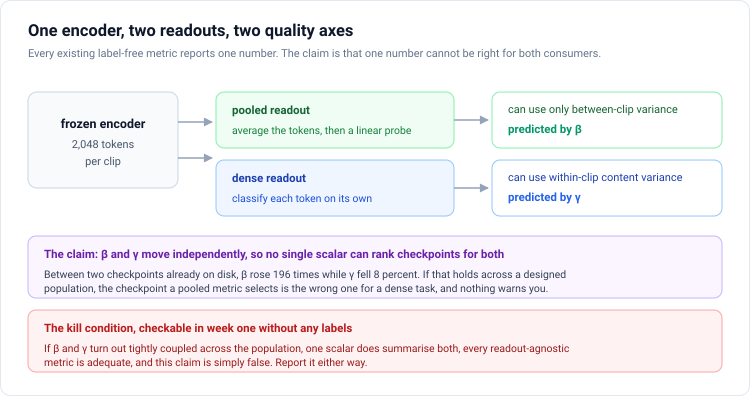
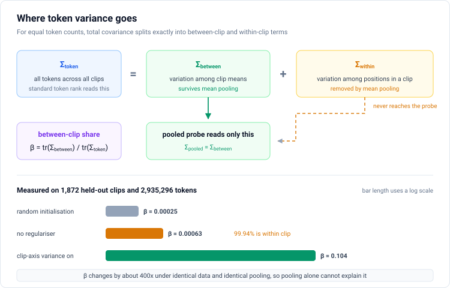
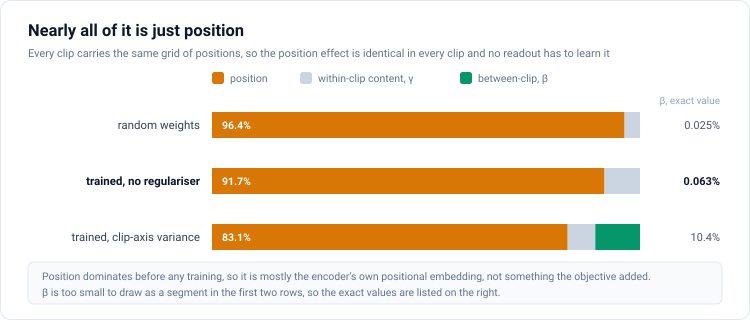
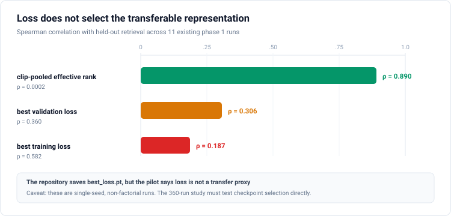
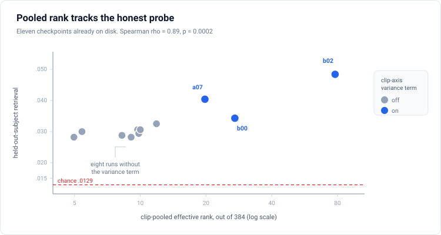
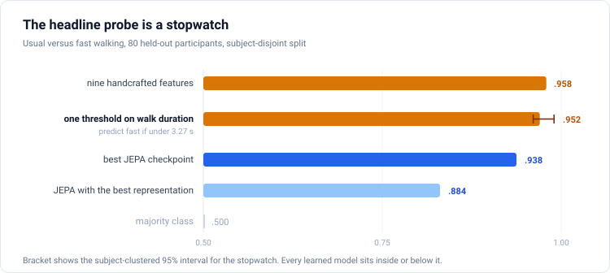
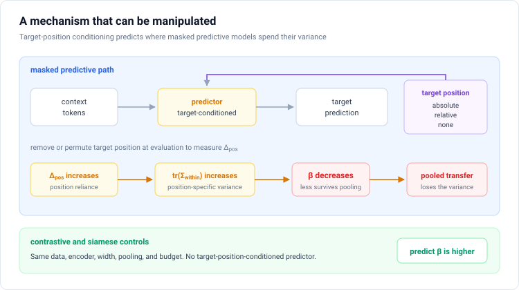
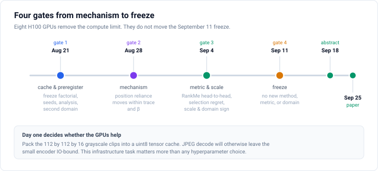

# Proposal 1: The Readout Problem

**Every way of using a model destroys part of it, and no single score can say which part you need**

Target: ICLR 2027 main track. Abstract due September 18, 2026. Paper due September 25, 2026. Both deadlines are Anywhere on Earth.

You need first-year linear algebra and probability to read this and nothing else. Part 1 builds the idea from scratch. Part 2 reports what we already measured. Parts 3 and 4 say how we will answer the question, first as an idea and then as a specification.

---

## The problem, in one paragraph

Video models are now trained without labels, because labelled video is expensive and raw video is nearly free. But training saves hundreds of copies of the model, and at the end somebody has to keep one. You cannot use a validation score to choose, because you have no labels. So the field picks using a single number computed from the model alone. This paper asks whether a single number can be the right shape of answer.

## The research question, derived from something you already know

**A linear map has a kernel.** If $T$ is linear, the set of inputs it sends to zero is a subspace. Anything in that subspace is not reduced or blurred by $T$. It is annihilated.

**Using this model means applying a map.** The encoder does not emit one vector per video. It emits about two thousand, one for each small patch of space and time. Nothing downstream consumes two thousand vectors directly, so every way of using the model starts by combining them, and the usual choice is to average.

**Averaging is linear, so it has a kernel, and you can write the kernel down.** Let $x_1,\dots,x_N$ be one clip's vectors and $\mu$ their mean. The deviations $x_t - \mu$ sum to zero by construction. So the part of the configuration that describes how patches differ from their own mean lies exactly in the kernel of the averaging map. It is annihilated. What survives is only how whole clips differ from each other.

**So the variance splits in two, and the split is an identity rather than an estimate:**

$$\underbrace{\Sigma_{\mathrm{total}}}_{\text{everything the model computes}} \;=\; \underbrace{\Sigma_{\mathrm{between}}}_{\text{survives averaging}} \;+\; \underbrace{\Sigma_{\mathrm{within}}}_{\text{lies in the kernel}}$$

**A different way of using the model has a different kernel.** A head that classifies every patch on its own never averages, so it is not blind to the within-clip part. It lives on it. The two uses are fed by the two halves.

**Which means "how good is this model" is not yet a question.** It has no answer until you say which map you intend to apply, because the map decides which half of the model you can see at all.

That is the whole setup, and it leaves exactly one thing unknown.

> ### Do the two halves grow independently while the model trains?
>
> If they do, no single number can rank models, because a model can improve for one use and get worse for another at the same time. **Every score the field currently uses is a single number.**

## Why the answer is not obvious

**The obvious part is not the question.** That averaging discards detail is true by definition and interesting to nobody. The question is whether the two halves are *coupled*.

**If they were coupled, everyone's practice would be correct.** A single number would summarise both halves, every existing score would be fine, and there would be nothing to write. That is a real possibility and it is our own kill condition.

**Our two measurements say they are not coupled, and that was not the prediction.** Between two checkpoints, the half that survives averaging grew by a factor of **196** while the half in the kernel *fell* by 8 percent. I expected a trade-off between them and there is none. Two checkpoints is not a result, which is why the paper exists.

## The prediction that makes this testable

If the halves move independently, something specific and slightly absurd follows.

**The model you pick by averaging should be the wrong model for a per-patch task.** Not noisier. Wrong, in ranking, with no warning signal anywhere.

The labels to check this are already on disk. The dataset ships per-pixel body-part maps aligned frame by frame with the model's inputs, so a per-patch classifier is a second use we can attach without any new annotation. **That experiment is the centre of the paper and no earlier version of this plan contained it.**

## What is new, and what is not

**Not new.** That giving a masked model's predictor the location of what it must guess lets it bypass the encoder. [PCP-MAE](https://arxiv.org/abs/2408.08753) showed this at NeurIPS 2024 and [MPL-MAE](https://arxiv.org/abs/2606.31570) formalised it. That a rank-based score can be inflated by variance the task does not need, which [Anchoring the Eigengap](https://arxiv.org/pdf/2605.08764) corrects for a different cause. That such scores can fail outright, which [Whetten et al.](https://arxiv.org/html/2409.10787v1) show in speech.

**New.** Letting the map you apply define what you measure. RankMe, LiDAR, LDReg and the rest disagree about which spectral quantity to compute. They agree, without ever saying so, on something more basic: **each returns one number per model, computed from the model alone, treating what you build on top as a detail that comes later.** That shared assumption is what fails if the map decides what is reachable. No prior work found by an adversarial search splits a model's output by what a given use can reach, and none reports more than one quality number per model.

**The load-bearing words are *kernel*, *independently*, and *no single number*.** Drop any one and this becomes a correction to a metric, which is a smaller and far more crowded thing to be.

**A word for the rest of the document.** A **readout** is the map above together with whatever you train on top of it. Averaging plus a linear classifier is the *pooled* readout. Classifying each of the 2,048 vectors on its own is the *dense* readout. Each has its own kernel, so each is blind to something different.

---

# Part 1: The idea, in eleven short steps

## Step 1. What the model actually outputs

Feed it one clip. It cuts the clip into small pieces in space and time and describes each piece separately.

Our clips are 32 frames at 128 by 128 pixels, cut into 8 by 8 pixel patches, grouped 4 frames at a time. That gives 8 time slices, 16 patches across, 16 patches down, so $8 \times 16 \times 16 = 2{,}048$ pieces. Each piece is described by a vector of 384 numbers.

So one clip in, a $2{,}048 \times 384$ array out.

## Step 2. Nothing downstream can use 2,048 vectors, so you apply a map

Whatever you build on top needs a specific shape. A clip classifier wants one vector. A per-patch labeller wants 2,048. So every way of using the model begins by applying some map to that array.

The overwhelmingly common choice is to average the 2,048 vectors into one. Call it $P$.

## Step 3. Averaging is linear, so it has a kernel, and we can write it down

Let $x_1,\dots,x_N$ be one clip's vectors and $\mu$ their mean. Split each vector into its clip mean plus a deviation:

$$x_t = \mu + d_t, \qquad \sum_t d_t = 0 .$$

The deviations sum to zero because that is what subtracting a mean does. So when you apply $P$, the entire deviation part contributes nothing. It is in the kernel.

**Everything about how patches inside one clip differ from each other is annihilated by averaging. Not reduced. Zero.** What comes out the other side is only how whole clips differ from each other.

## Step 4. So the variance splits in two, exactly

$$\Sigma_{\mathrm{total}} = \Sigma_{\mathrm{between}} + \Sigma_{\mathrm{within}}$$

This is an identity, not an approximation. A tiny example makes it concrete, with both terms nonzero so you can see them add.

> Ana scores 90 and 70, so her average is 80. Ben scores 40 and 20, so his average is 30. The overall average is 55.
>
> Total spread of the four numbers: **725**.
> Spread between the two students: **625**.
> Spread within each student: **100**.
>
> $625 + 100 = 725$, exactly, for any numbers you pick.

## Step 5. But the two halves are not a fixed budget

It is tempting to read Step 4 as a see-saw, where filling one half must empty the other. That is wrong, and our own measurements say so.

Between two of our trained models, the between half rose from 0.009 to 1.73, a factor of 196. The within half did not fall to pay for it. It went from 13.98 to 14.90. **Both grew.** The total grew.

So these are two quantities that happen to sum to a third, not two slices of one pie.

## Step 6. A different map has a different kernel

Averaging is not the only thing you can attach. A per-patch classifier reads each of the 2,048 vectors on its own and never averages. An attention pooler weights them unevenly. A decoder cross-attends to them.

A per-patch classifier is not blind to the within half. It **lives** on it, because the within half is precisely how the patches differ from each other, which is what "label each patch" needs.

Think of a hospital that records 2,048 readings per patient on the same panel of 384 instruments. The triage rule reads the daily average and cannot see the minute-to-minute trace. The cardiologist reads the trace and barely glances at the daily average. Neither is wrong. They are different readers with different blind spots, and "is this record good" is not a well-formed question until you say who is reading it.

## Step 7. Which gives the question

Put Steps 5 and 6 together. Two different uses are fed by two different halves, and those halves move independently.

> **Do the two halves grow independently while the model trains?**

If yes, then a model can get better for the averaging user and worse for the per-patch user at the same moment, and no single number can rank models, because there is nothing for a single number to be.

## Step 8. Why this is not an academic worry

These models are trained without labels, so you cannot watch a validation score and stop when it peaks. But training still saves hundreds of copies, and you still have to keep one.

The field picks using the training loss or a score computed from the model's own geometry. In our eleven runs the training loss predicts which model is actually useful at a rank correlation of **0.187**, with a p value of 0.58. That is noise. And whatever replaces it, in current practice, is again a single number.

So if the answer to Step 7 is yes, the choice being made is wrong for somebody, every time, with nothing to signal it.

## Step 9. What the standard score measures, and the proof it is blind here

The usual geometric score is **effective rank**. It does not measure how large the vectors are. Multiply everything by a thousand and it does not move. It counts **how many independent directions** the variation occupies.

That is why a toy example with single numbers cannot show the problem, and why the demonstration has to be a real measurement.

| quantity, trained model with no variance regulariser | value |
|---|---:|
| effective rank of everything the model computes | 60.32 |
| effective rank of the within half alone | 60.23 |
| effective rank of the half that survives averaging | 10.86 |

To two significant figures, **the standard score is the within-half score**. It is not slightly contaminated by the part averaging throws away. It is almost entirely that part.

## Step 10. Naming the shares, and the obvious objection

Write $\beta$ for the fraction of total variance that survives averaging.

| model | $\beta$ |
|---|---:|
| random weights | 0.00025 |
| trained, no variance regulariser | 0.00063 |
| trained, with a clip-level variance term | 0.104 |

The objection writes itself: averaging always destroys things, so this says nothing about the model.

The answer is the 400-fold range. Same data, same averaging operator, same measurement code. If averaging alone explained $\beta$, every row would be identical. They are not, so $\beta$ is a property of the model.

One honest deduction from the same table: most of that range comes from turning on a term that explicitly rewards clip-level variance. Reporting that clip-level variance rose when you added a clip-level variance term is close to a tautology. The comparison that is not tautological is random weights against trained without the term, and that is only 2.5 times.

## Step 11. Where the discarded half comes from, and how sure we are

The encoder adds a fixed positional pattern to every piece so it knows where each piece sits. That pattern is identical in every clip. So it creates a great deal of variation *inside* a clip and, because every clip carries the same set of positions, contributes **exactly zero** to differences *between* clips.

We measured how much of the within half is that positional pattern. For the trained model without a regulariser it is **91.7 percent**.

Now the honest part. Before any training at all, with random weights, it is already **96.4 percent**. Training moves it only to 91.7. So the position dominance is mostly the encoder's own positional embedding, present from the start, and not something the training objective created. We say so here rather than letting a reviewer find it.

---

# Part 2: What the results we already have actually say

Everything in this part was recomputed from checkpoints and manifests already on disk. None of it needed a new training run.

## 2.1 The decomposition

Let $x_{i,t}\in\mathbb{R}^d$ be piece $t$ of clip $i$, with the same number $T$ of pieces in every clip. With $\mu_i$ the mean piece of clip $i$ and $\mu$ the overall mean, and the same population normalisation throughout,

$$\Sigma_{\mathrm{token}} = \Sigma_{\mathrm{between}} + \Sigma_{\mathrm{within}}, \qquad \Sigma_{\mathrm{pooled}} = \Sigma_{\mathrm{between}},$$

$$\beta = \frac{\mathrm{tr}(\Sigma_{\mathrm{between}})}{\mathrm{tr}(\Sigma_{\mathrm{token}})}.$$

The identity is exact for equal token counts. A variable-length corpus needs a weighted version and cannot silently reuse this formula.

Measured on 1,872 held-out clips and 2,935,296 tokens, identical code for every row:

| model | β | rank of $\Sigma_{\mathrm{token}}$ | rank of $\Sigma_{\mathrm{between}}$ | rank of $\Sigma_{\mathrm{within}}$ |
|---|---:|---:|---:|---:|
| random initialisation | 0.00025 | 12.32 | 2.54 | 12.31 |
| a00, no variance regulariser | 0.00063 | 60.32 | 10.86 | 60.23 |
| b02, clip-axis variance term | 0.104 | 63.39 | 23.60 | 51.53 |

## 2.2 Where the within-clip variance comes from

Because every clip carries the same fixed grid of positions, the tokens form a balanced two-way layout, $x_{i,t} = \mu + a_i + b_t + e_{i,t}$, with a clip effect, a position effect, and a remainder. For a balanced layout the trace decomposition is exact, and $\Sigma_{\mathrm{within}} = \Sigma_{\mathrm{position}} + \Sigma_{\mathrm{residual}}$.

Measured on the same clips, as shares of **all** token variance:

| model | position effect | within-clip remainder | between-clip |
|---|---:|---:|---:|
| random initialisation | 96.4% | 3.6% | 0.025% |
| a00, no variance regulariser | **91.7%** | 8.3% | **0.063%** |
| b02, clip-axis variance term | 83.1% | 6.4% | 10.4% |

### The three-way split, one component per readout

Putting the two decompositions together gives an exact three-way partition of everything the encoder produces, and each component maps to a different consumer.

$$\mathrm{tr}(\Sigma_{\mathrm{token}}) = \underbrace{\mathrm{tr}(\Sigma_{\mathrm{between}})}_{\text{a pooled readout uses this}} + \underbrace{\mathrm{tr}(\Sigma_{\mathrm{residual}})}_{\text{a dense readout uses this}} + \underbrace{\mathrm{tr}(\Sigma_{\mathrm{position}})}_{\text{neither needs it}}$$

Define $\beta$ as the first share and $\gamma$ as the second. For the unregularised trained model the three sum exactly: $0.00882 + 1.15613 + 12.82171 = 13.98666$.

| model | $\beta$, pooled-accessible | $\gamma$, dense-accessible | position | pooled retrieval |
|---|---:|---:|---:|---:|
| random initialisation | 0.025% | 3.58% | 96.4% | not measured |
| a00, no variance regulariser | 0.063% | **8.27%** | 91.7% | 0.0294 |
| b02, clip-axis variance term | **10.41%** | 6.44% | 83.1% | **0.0484** |

The third column is the position effect, which is a deterministic function of the grid and is known to any readout in advance, so it is capacity spent on something neither consumer needs to learn.

**The first two columns are the crossover.** In absolute terms b02 carries 196 times more pooled-accessible variance than a00 and beats it 1.65 times on the pooled probe, exactly as $\beta$ predicts. But a00 carries 8 percent more dense-accessible variance in absolute trace, 1.156 against 1.072. If $\gamma$ behaves like $\beta$ does, a00 should win a dense readout. Testing that is the centre of Part 3.

This also constrains the mechanism story, as Step 11 said. Position share is 96.4 percent before training and 91.7 percent after. Whatever target-position conditioning does, it is not creating this from nothing.

The health metric everyone reports is computed on the sum of all three columns, which is dominated by the one that serves nobody.

## 2.3 The pooling-noise objection, and the corrected null

$\Sigma_{\mathrm{between}}$ is the covariance of the *empirical* clip means, and an empirical mean carries sampling noise from the pieces averaged into it. A reviewer will ask whether β is simply that noise. Under a null in which pieces are independent within a clip, the floor is $\mathrm{tr}(\Sigma_{\mathrm{within}})/T$.

That naive floor is wrong here, and the reason is the result above. The position effect is shared across clips, so it averages to the same value in every clip and generates **no** sampling noise at all. Only the remainder behaves like noise, so the correct floor is $\mathrm{tr}(\Sigma_{\mathrm{residual}})/T$.

| model | naive floor | observed / naive | corrected floor | observed / corrected |
|---|---:|---:|---:|---:|
| random initialisation | 0.03383 | 0.39 | 0.00121 | **10.8** |
| a00 | 0.00891 | 0.99 | 0.00074 | **12.0** |
| b02 | 0.00951 | 182 | 0.00068 | **2,533** |

The naive floor overstates leakage roughly twelvefold, and would have wrongly eliminated a00's signal entirely. Under the corrected floor every model's between-clip variance is real. Note also that random initialisation falls *below* the naive floor, which is impossible for independent pieces, and is itself direct evidence that the within-clip variation is dominated by a shared deterministic pattern.

**Rule for the paper: never report β without its floor.**

## 2.4 Rank predicts transfer. Loss does not.

Across the eleven runs already on disk:

| predictor of held-out retrieval | Spearman $\rho$ | p |
|---|---:|---:|
| **token effective rank** | **-0.100** | 0.77 |
| pooled effective rank, estimated on 9,390 clips | **0.890** | 0.0002 |
| pooled effective rank, estimated on 1,872 clips | 0.260 | 0.44 |
| β, estimated on 1,872 clips | 0.446 | 0.17 |
| best validation loss | 0.306 | 0.360 |
| best training loss | 0.187 | 0.582 |

Two things in that table matter more than the headline.

**Token effective rank carries no information about transfer.** At $\rho = -0.100$ it is indistinguishable from noise, while quantities computed on the pooled axis are not. This is the cleanest result we hold and it is the one the paper is about.

**The estimation population moves the answer more than the metric does.** The same pooled quantity, on the same checkpoints, gives $\rho = 0.890$ when estimated from 9,390 clips and $\rho = 0.260$ from 1,872. The two estimates agree with each other at only $\rho = 0.382$.

The reason is not random noise but a systematic bias. Effective rank is a spectral quantity, so estimating it well needs many more samples than dimensions. The larger population gives 24.5 samples per dimension and the smaller gives 4.9. At the low ratio the estimate is truncated, and it truncates hardest on genuinely high-rank models: the three clip-axis-variance runs are underestimated by factors of 3.3 to 4.2 while the rest barely move.

**This points at a better argument for β than the axis argument.** β is a trace ratio, so it needs only sums of variances and converges at $1/\sqrt{N}$ largely independently of dimension. Effective rank needs the whole eigenspectrum. So β should be far more sample-efficient, which would explain why it might beat pooled rank rather than merely equal it. That is a principled, testable advantage rather than hygiene, and it should be measured directly by subsampling the estimation population and plotting each metric's stability.

**The caveats are serious and unresolved.** These are eleven single-seed configurations from a sweep never designed as a metric comparison, so seed noise is confounded with the predictor. The retrieval score uses 1,632 windows from roughly 544 recordings and 80 subjects, so a subject-level bootstrap is owed. On a matched population the ordering is β, then pooled rank, then token rank, which is the predicted direction, but none of those reaches significance at $n = 11$. **The pilot does not establish that β beats pooled rank.** That question is genuinely open, and it is the paper.

## 2.5 The downstream label we were using is contaminated

The repository's two-class walking-pace probe is not a trustworthy transfer target. One threshold on how long the walk took reaches 0.9519 on 80 held-out subjects, with a subject-clustered interval of 0.9245 to 0.9755. The best checkpoint reaches 0.9375.

The inputs are not matched, since duration describes the whole recording and the model sees a 0.53 second window. The narrower point stands: the label is nearly determined by total recording time, so a score of 0.93 is not evidence about motion representation.

Matching usual and fast examples within quarter-second duration bins confirms it. The eleven checkpoints fall to a mean of 0.560, ranging 0.510 to 0.631 against chance 0.500. Only 198 windows over 39 participants survive the matching, so the matched cohort is underpowered and its correlation with rank, $-0.618$, cannot support anything either.

The conclusion is that this label is unusable in both forms. Held-out retrieval remains the pilot readout here, and the second domain in Part 4 supplies a stronger one.

This audit is not a new method. [Predictive V-information](https://openreview.net/pdf?id=r1eBeyHFDH) and [conditional probing](https://aclanthology.org/2021.emnlp-main.122/) already formalise measuring what a representation adds above a baseline. The contribution is applying that accounting in video self-supervised evaluation, where probe numbers are routinely reported without conditioning on exposed metadata.

## 2.6 What these results do and do not license

**They license:** that the token-axis health metric for these checkpoints is overwhelmingly a within-clip and specifically a positional quantity; that β varies by a factor of 400 across models under identical measurement; that pretraining loss is uninformative about transfer in this sweep.

**They do not license:** that β is a better selector than effective rank, which needs a designed population and has not been run; that target-position conditioning in the predictor causes the deficit, which Part 2.2 makes harder to argue, not easier; or that any of this holds outside grayscale silhouettes from one fixed camera.

---

# Part 3: How we will answer the question, as an idea

Part 1 ended with a question and Part 2 gave two checkpoints' worth of evidence. Two checkpoints is an anecdote. This part turns it into an experiment: what to vary, what to measure, and what result would prove the idea wrong.

## 3.1 Three questions, in order of how much they carry

**Q1, primary. Do the readout-relative components move independently?** Across the designed population, compute $\beta$ and $\gamma$ at every checkpoint and measure their association. If they are tightly coupled, one scalar summarises both, every existing readout-agnostic metric is fine, and the paper's central claim is dead. If they are weakly coupled or uncoupled, no single scalar can serve both readouts, and that is a structural statement about representation quality rather than about any particular metric.

This is a clean and early kill condition. It needs no downstream labels at all, so it can be answered from the pilot cells before the full population finishes.

**Q2, the payoff. Does independence produce a readout crossover?** Attach two readouts to the same frozen checkpoints: a mean-pooled linear probe and a per-token dense probe. Ask whether the checkpoint ranking differs between them, whether $\beta$ predicts the pooled ranking, and whether $\gamma$ predicts the dense ranking. A demonstrated crossover means current practice selects models for one downstream shape and against the other, without warning. That is the result that would change what people do.

This also removes the strongest objection to $\beta$, which is that it was defined to match a pooled readout and then shown to match a pooled readout. Two readouts with two quantities and a crossing ordering cannot be explained that way.

**Q3, the cost. What does single-scalar practice give up?** Pick a checkpoint several ways without labels, using loss, token rank, pooled rank, $\beta$, and $\gamma$, then reveal the labels and measure the transfer lost on each readout. The output is not another correlation. It is a number in accuracy points that a practitioner can weigh against the cost of changing their pipeline.

**Supporting, not a numbered question. Where does the discarded variance come from?** Part 2.2 shows position dominance is 96.4 percent at initialisation and 91.7 percent after training, so target-position conditioning cannot be creating it. The honest form is whether conditioning *slows the decay* of position dominance, which predicts that removing it drives the share below 91.7 percent. This is worth measuring and it cannot carry the paper, because the cause is already published elsewhere.

## 3.2 The chain, and what breaks each link

$$\text{position intervention} \rightarrow \Delta_{\mathrm{pos}} \rightarrow \mathrm{tr}(\Sigma_{\mathrm{position}}) \rightarrow \beta \rightarrow \text{pooled transfer}$$

$\Delta_{\mathrm{pos}}$ is an operational measure of how much the model leans on target position: the increase in held-out prediction loss when target-position inputs are removed or permuted, with context tokens unchanged. It is a manipulation check, not a headline metric.

Each arrow can fail independently, and each failure is informative.

| link | what breaks it | what it would mean |
|---|---|---|
| intervention to $\Delta_{\mathrm{pos}}$ | removing position input does not lower measured reliance | the intervention is not doing what it claims; fix the implementation |
| $\Delta_{\mathrm{pos}}$ to position variance | reliance changes but the position effect does not | reliance and variance allocation are unrelated; the mechanism story is wrong |
| position variance to β | position share moves but β does not | the two are decoupled by something else; report and investigate |
| β to transfer | β moves but held-out transfer does not | β is a description, not a selector; Q1 fails and the paper is Q2 and Q3 only |

## 3.3 Why a designed population rather than public checkpoints

Public checkpoints differ in data, capacity, augmentation, training length, and objective all at once, so a metric can correlate with transfer for entirely the wrong reason. A designed population varies the proposed cause while holding the corpus, encoder, optimiser, evaluation population, and pooling operator fixed. This is the one thing eight H100s buy that was not previously affordable, and it is a strictly better instrument.

Two families sit outside the factorial as structural controls: a matched contrastive family and a matched siamese family. Their objective and predictor path necessarily differ, so any β difference is architectural rather than a one-variable ablation. **They are supporting evidence, not one of the manipulations**, and the paper must say so rather than listing them alongside the interventions.

---

# Part 4: How we will answer the question, as machinery

**This part is the specification, not the idea.** If you only want the argument, Parts 1 through 3 contain all of it. What follows fixes every number a reader would otherwise have to guess at, so that the experiment is reproducible and so that no choice can be quietly adjusted after seeing a result.

## 4.1 Model and input contract

| | |
|---|---|
| encoder | 12 blocks, width 384, 6 heads, MLP 1,536, 21.34M parameters |
| target encoder | momentum copy, same architecture |
| predictor | projects to width 192, factorial depth, projects back to 384 |
| resident parameters at predictor depth 6 | 45.51M |
| input | 32 frames, 128 by 128, patch 8, tubelet 4 |
| token grid | $8\times16\times16 = 2{,}048$, identical in both domains |
| objective | mean absolute error against batch-standardised momentum targets |
| regulariser | fixed clip-pooled VICReg, variance 1.0, covariance 0.04, held constant and outside the factorial |

Only the input projection changes between one grayscale channel and three RGB channels. Equal token counts preserve the exact decomposition.

The 128-pixel choice is deliberate. A 224-pixel input would give 6,272 tokens, three times as many and roughly nine times the attention entries per block. The silhouettes do not carry enough texture to justify that, and the RGB dataset is distributed at 240 pixels.

**Measurement contract, which is not optional.** All geometry uses full-view momentum-encoder tokens before the final layer normalisation, and the pooled vector is the mean of those exact tokens. β, token rank, pooled rank, and the frozen readout must refer to one representation population. Post-normalisation geometry is a named sensitivity analysis, never mixed into the main table. Every reported rank states its representation, reduction axis, normalisation point, and estimation population, because the same checkpoint gives pooled rank 78.0 over 9,390 clips from 398 subjects and 23.6 over 1,872 clips from 80.

## 4.2 The factorial

| factor | levels |
|---|---|
| predictor position input | absolute, relative, none |
| mask geometry | spatial-only, volumetric |
| mask ratio | 0.30, 0.50, 0.70, 0.90 |
| predictor depth | 1, 2, 3, 4, 6 blocks |

120 configurations, three predeclared seeds, 360 runs. Data order is blocked by seed so paired comparisons see the same examples in the same order.

The three position conditions must be implemented precisely. Keep the encoder and the predictor's visible-context path identical throughout. Absolute adds the fixed three-dimensional sine-cosine vector to each target slot. Relative subtracts the centroid of visible context coordinates first, preserving offset from evidence while removing the absolute coordinate. None adds no coordinate, and target slots are randomly permuted before the predictor and unpermuted before the loss so slot order cannot leak position. Absolute positions stay inside the encoded context in all three conditions, because removing them would change the backbone rather than isolate target-position conditioning.

Mask geometry must be difficulty-matched. Round the nominal ratio to a number of cells on the 16 by 16 grid, repeat those cells across all eight time indices for the spatial condition, and give the volumetric condition exactly the same number of target tokens. The ratios denote matched target-count regimes, not different workloads.

## 4.3 Two domains

**Health&Gait is the controlled laboratory.** 3,130 recordings from 398 subjects, subject-disjoint at 2,506 training and 624 validation recordings, all at least 47 frames so every clip supplies 32 without padding. The person occupies about 3.5 percent of the median frame, so precompute one union foreground box per recording, pad to square, resize to 128, and cache as uint8. Split the 318 training subjects into 286 for optimisation and 32 for label-free monitoring. The 80 validation subjects are the oracle and are never used for selection.

**Two readouts, which is the point.** Every previous version of this plan attached only pooled readouts, which made the central claim untestable. Both of the following run on the same frozen checkpoints.

| readout | what it consumes | task | predicted by |
|---|---|---|---|
| pooled | one 384-vector per clip | held-out-subject retrieval over 80 identities, resampled by subject | $\beta$ |
| dense | each of the 2,048 tokens separately | per-token body-part classification, 14 classes | $\gamma$ |

The dense labels need no new annotation. The dataset ships per-pixel body-part maps that are frame-aligned with the silhouettes at the same resolution, so each token inherits the majority part label over the pixels in its space-time patch. Train a single linear layer on tokens from training subjects and evaluate on held-out subjects, with the same freeze and the same measurement contract as the pooled probe.

**The dense probe needs its own shortcut audit**, by the same logic that condemned the pace label in 2.5. A token near the bottom of the frame is probably a foot regardless of what the encoder learned, so position alone will solve part of this task. Report the dense probe against a position-only baseline that receives the token index and nothing else, and report the gain above it rather than raw accuracy. If the gain is near zero the dense readout is as contaminated as the pace probe was, and $\gamma$ has nothing to predict.

Pace classification remains a shortcut audit only, for the reasons in 2.5.

**Something-Something V2 is the external replication.** 220,847 videos, 174 labels, 168,913 official training clips and 24,777 validation clips, more than 1,300 actors. It matters because many labels reverse a temporal relation while leaving actors and objects similar, such as putting something into a container versus taking it out. A static frame keeps the nouns and loses the direction, so temporal order becomes load-bearing and the duration shortcut cannot recur. Decode once into packed uint8 shards, 32 temporal bins per video, short side 144, seeded 128 crop, and no horizontal flip because several labels encode direction. The readout is a frozen linear probe on pooled vectors, with top-1, top-5, macro accuracy, and accuracy within preregistered inverse-action pairs, plus a centre-frame baseline and a frame-shuffled baseline.

The replication uses a preregistered 24-cell subset: three position conditions, both mask geometries, mask ratios 0.50 and 0.90, predictor depths 1 and 6. Three seeds gives 72 runs at 25,000 steps each.

| setting | Health&Gait | Something-Something V2 |
|---|---:|---:|
| optimiser | AdamW | AdamW |
| peak learning rate | $10^{-4}$ | $10^{-4}$ |
| warm-up | 200 steps | 1,500 steps |
| weight decay | 0.04 | 0.04 |
| gradient clipping | 1.0 | 1.0 |
| target momentum | 0.99 to 1.0 linear | 0.99 to 1.0 linear |
| effective batch | 64 clips | 64 clips |
| optimiser steps | 3,900 | 25,000 |
| checkpoint interval | 300 steps | 2,500 steps |

## 4.4 Statistics

Report Spearman and Kendall association with seed-blocked bootstrap intervals, and do not stop there. Report top-1 and top-10 selection regret, meaning the transfer gap between the metric-selected and oracle-selected model, and leave-one-factor-level-out prediction with the split fixed before transfer labels are inspected. A metric that fits the 120 observed cells but fails on a held-out mask ratio is not a selector.

Run the comparison within each domain first. The two domains have different tasks, sample sizes, and difficulty, so their raw correlations must not be pooled as exchangeable. The cross-domain result is the replicated direction, the standardised effect size, and a domain-by-metric interaction.

With 360 runs a small p value is nearly guaranteed and carries little information. Effect sizes, out-of-sample prediction, and pre-registration matter more, not less.

**Non-monotonicity.** Effective rank is normally treated as a monotone guide to transfer. Several hundred models make that testable rather than inherited. Pre-register a monotone fit against a low-degree smooth fit, evaluate both on held-out seeds and factor levels, and require any interior optimum to recur across seeds and at more than one scale. A bend visible only after flexible smoothing is not a discovery.

## 4.5 Scale

The ladder crosses encoder depth 6, 12, 24 with width 384 and 768, six heads throughout so the three-axis positional basis stays valid.

| encoder | encoder parameters | resident parameters |
|---|---:|---:|
| 6 blocks, width 384 | 10.70M | 24.21M |
| 12 blocks, width 384 | 21.34M | 45.51M |
| 24 blocks, width 384 | 42.64M | 88.09M |
| 6 blocks, width 768 | 42.63M | 96.49M |
| 12 blocks, width 768 | 85.16M | 181.55M |
| 24 blocks, width 768 | 170.21M | 351.66M |

Do not repeat the factorial at every size. Repeat six preregistered cells per backbone: all three position conditions at a moderate spatial-only regime with ratio 0.50 and depth 1, and all three at a high-pressure volumetric regime with ratio 0.90 and depth 6. This answers the objection that one small model confounds the effect with capacity. The claim passes only if the intervention-to-β direction is stable across the ladder. Absolute β values may shift with width because trace estimation changes with dimension, so compare within a fixed contract and combine as standardised effects.

---

# Part 5: Compute, schedule, and what gets cut first

## 5.1 The budget does not fit, and pretending otherwise is the biggest risk

Eight cards over the full window give roughly 4,800 GPU-hours gross. Reserve, until the systems pilot measures otherwise, 2.5 to 3.5 hours per Health&Gait run and 16 to 23 hours per Something-Something V2 run.

| item | GPU-hours | 8-GPU days |
|---|---:|---:|
| Health&Gait population, 360 runs | 900 to 1,260 | 4.7 to 6.6 |
| RGB replication, 72 runs | 1,152 to 1,656 | 6.0 to 8.6 |
| scale anchors | 600 to 900 | 3.1 to 4.7 |
| contrastive and siamese controls, frozen evaluations | 400 to 600 | 2.1 to 3.1 |
| **total** | **3,052 to 4,416** | **15.9 to 23.0** |

Gate 1 ends on August 21, so the real training window is August 21 to September 11, which is 21 days and 4,032 GPU-hours. The named programme is therefore **76 to 110 percent of capacity at full utilisation with no allowance for failures**. Real utilisation on an IO-bound workload is 70 to 80 percent.

Worse, sequencing the work behind Gate 3 does not fit at all. Gate 3 needs the population plus one RGB seed, 1,284 to 1,812 GPU-hours, which fits comfortably in its 14-day window. Everything left over needs 1,768 to 2,604 GPU-hours against a 7-day window worth 1,344. That is **overcommitted by 32 percent at the optimistic end and 94 percent at the pessimistic end**.

## 5.2 The fix: interleave, and name the drop order in advance

**Interleave rather than sequence.** Gate 3 consumes only 6.7 to 9.4 of its 14 available days, so several days of capacity currently sit idle before it. Release the RGB seeds, scale anchors, and controls into that slack instead of holding them behind Gate 3.

The one thing that must stay sequential is the mechanism check, because a Gate 2 failure branches the whole paper. So August 21 to 28 runs the balanced pilot cells, which are part of the 120 anyway, plus three RGB anchors and the objective controls, which is 38 to 56 percent of that window. Cache construction fills the rest. The bulk releases on a Gate 2 pass.

Even interleaved, the pessimistic end does not fit. **So the drop order is decided now, not on September 6.**

| order | cut | saves (GPU-hours) | what is lost |
|---:|---|---:|---|
| 1 | scale ladder from six backbones to three, dropping width 768 | 300 to 450 | the width axis; the depth axis still answers the capacity objection |
| 2 | RGB seeds from three to two | 384 to 552 | a tighter seed-blocked interval |
| 3 | controls from twelve runs to six, contrastive only | 200 to 300 | the siamese comparison |
| 4 | RGB cells from 24 to 12, dropping mask ratio 0.50 | 384 to 552 | the moderate masking regime externally |

All four drops bring the pessimistic estimate from 4,416 to about 2,562 GPU-hours, or 13.3 days, which fits with real slack. **Trigger rule:** if the systems pilot at Gate 1 implies more than 3,600 GPU-hours, execute drops 1 and 2 immediately rather than discovering the problem later.

## 5.3 Where the time actually goes

The bottleneck is data loading, not arithmetic. JPEG decoding of silhouettes and VP9 decoding of RGB video will leave these transformers idle at low utilisation. Day one builds packed uint8 shards on local NVMe and benchmarks end-to-end throughput with eight simultaneous readers. For scale, 32 RGB frames at roughly 144 by 256 across 168,913 videos is on the order of 0.6 TB before compression. Measure a one-percent shard before provisioning.

The pilot records peak memory, examples per second, data-wait fraction, optimiser-step time, and checkpoint-write time for the base and the largest endpoint. A job passes only if eight workers each sustain at least 80 percent of single-worker throughput after warm-up.

## 5.4 Gates

**Gate 1, August 21. Infrastructure and pre-registration.** Confirm dataset access and storage. Caches sustain planned throughput on all eight cards. Freeze both factorials, seeds, optimiser contracts, transfer oracles, the positional-reliance measure, bootstrap units, the non-monotonicity test, inverse-action pairs, and success effect sizes. Reproduce β, the position decomposition, and the random-initialisation control under the new measurement code. Apply the drop-order trigger rule.

**Gate 2, August 28. The manipulation check.** A balanced pilot across all position conditions, both geometries, moderate and high ratios, and shallow and deep predictors must move $\Delta_{\mathrm{pos}}$ and position share in the predicted direction. One RGB anchor per position condition must train and evaluate end to end. If the manipulation check fails, Q2 is dropped and the paper proceeds on Q1 and Q3 alone, which is survivable. If the population itself will not train, branch to Proposal 2.

**Gate 3, September 4. Metric and replication.** Finish the population and at least one complete RGB seed. Lock the head-to-head comparison before the sealed action evaluation. Require a practically meaningful reduction in selection regret, not only a small p value.

**Gate 4, September 11. Freeze.** All claim-defining training ends. Nothing new enters.

---

# Part 6: What would prove us wrong

**Q1 kills the thesis outright if the components are coupled.** If β and γ turn out to be tightly associated across the population, then one scalar does summarise both, readout-agnostic metrics are adequate, and the central claim is simply false. This is the cleanest kill condition in the plan. It needs no labels, so it can be checked from the pilot cells in week one, before the population is committed. Report it either way.

**Q2 fails if the crossover does not appear**, meaning the pooled and dense readouts rank checkpoints the same way. Independence of the variance components would then have no consequence anyone should act on, and the paper reduces to a decomposition without a use.

**Q2 also fails if the dense readout is contaminated.** A per-token body-part probe is partly solvable from position alone, which is the same failure that condemned the pace label. If the gain above a position-only baseline is near zero, γ has nothing to predict and a different dense task is needed.

**Q3 fails quietly** if β and γ do improve selection regret but by a margin too small to matter. A p value below 0.05 with a negligible effect is failure, and with 360 runs it is the expected kind of failure.

**The supporting mechanism is already partly constrained.** Position dominance is 96.4 percent before training and 91.7 percent after, so target-position conditioning has little room to be the cause. If removing it does not push position share below 91.7 percent, that claim is dropped and the dominance is reported as architectural, arising from the encoder's own additive embedding. That is a smaller result and still a true one.

**The scale ladder can localise the finding to one model size**, which repeats the single-small-model problem that has weakened papers of this shape before.

**The domains can disagree.** If the intervention moves β on silhouettes but not on RGB action video, the effect is domain-limited. If β moves but does not improve action-recognition selection, the decomposition remains true and the general metric claim fails. Both must be stated plainly.

**Two presentation failures.** If the distinction from LiDAR cannot be stated in one crisp paragraph, the covariance contribution is not novel enough. If the stopwatch audit is sold as a new method, reviewers can correctly point to usable-information and conditional-probing work.

**Breadth itself.** Controls, a scale ladder, a second domain, non-monotonicity, and checkpoint trajectories are justified only because they answer named objections. After Gate 1 freezes them, unused compute is preferable to a new branch.

---

# Part 7: Where this sits in the literature

**The closest neighbour by domain is [V-JEPA 2.1](https://arxiv.org/abs/2603.14482)**, which also identifies a pathology in the token representations of masked predictive video encoders. Their diagnosis attributes it to the *support of the loss*: because the objective applies only to masked tokens, the model "has no incentive to encode local information within the context tokens and can instead devote this computation to aggregating global information." Their remedy is a dense predictive loss in which context tokens also receive gradient. Our claim is orthogonal on both axes. We locate the effect not in which tokens are supervised but in where the variance sits, and we connect it to *measurement validity* rather than to training. They report no variance decomposition and no representation-quality metric; their evidence is downstream performance. There is a direction to reconcile: their account says context tokens under-represent local structure, ours says token variance over-represents position. These are compatible only if positional decodability and local content fidelity are distinct properties of the same tokens, and the paper must test that rather than assert it. Note also that the widely repeated line about context tokens acting as "registers" is a paraphrase and not a quotation from that paper.

**The closest neighbour by mechanism is [PCP-MAE](https://arxiv.org/abs/2408.08753)** (NeurIPS 2024), which showed that feeding masked-patch centres to a decoder lets it reconstruct without the encoder, "thus preventing the encoder from learning semantic representations." [MPL-MAE](https://arxiv.org/abs/2606.31570) formalises the same phenomenon as a leakage constraint. Both establish the cause. Neither measures variance geometry or touches a quality metric, and both work in point clouds. We cite them as having established the mechanism and claim only the measurement consequence.

**The closest neighbour by algebra is [LiDAR](https://arxiv.org/abs/2312.04000)**, which replaces raw covariance rank with a discriminant object separating within-class from between-class scatter. The algebra is structurally close to β and the random variable is different. LiDAR's within-class scatter comes from augmenting one sample. Ours comes from token position inside one clip, where position is an architectural input rather than a data transformation. The contribution is not another within-to-between ratio. It is the exact pooled-readout decomposition and the demonstration that the standard metric is miscalibrated rather than merely noisy.

**[RankMe](https://arxiv.org/abs/2210.02885) is the direct baseline.** It validated effective rank as a label-free transfer proxy on contrastive and siamese image encoders. We test the boundary of that result on masked predictive encoders and use its own practical criterion, whether the metric selects the model that transfers.

**The gap, stated as plainly as possible.** RankMe, LiDAR, LDReg, $\alpha$-ReQ, and the eigengap work differ in which spectral functional they compute and in which nuisance they correct for. They agree in something more basic: each produces **one scalar per checkpoint**, computed on the representation in isolation, and treats the downstream readout as a detail that happens later. That shared assumption is what this paper questions. If the readout determines which part of the representation is even reachable, then a single readout-agnostic scalar is not an imperfect summary of quality. It is a quantity that cannot be correct for two consumers at once. Mean pooling is the case where the reachable subspace has a closed form, which is why it is the right place to test the idea first, but the argument is not specific to pooling.

**Two independent threats to acknowledge.** [Anchoring the Eigengap](https://arxiv.org/pdf/2605.08764) notes that effective rank "is label-agnostic, so it captures both signal and noise, and can be artificially inflated", and proposes a different correction for a different nuisance. [Whetten et al.](https://arxiv.org/html/2409.10787v1) find RankMe "fails as a standalone surrogate for downstream performance" in speech. So neither "effective rank is inflated by irrelevant variance" nor "rank proxies can fail" is available as a novel observation. What remains is the specific pooled decomposition and the corrected quantity.

**Also relevant.** [LDReg](https://openreview.net/forum?id=oZyAqjAjJW) shows globally high dimension can hide local collapse. [Jing et al.](https://openreview.net/forum?id=YevsQ05DEN7) explain dimensional collapse in contrastive learning. [Causal-JEPA](https://arxiv.org/abs/2602.11389) uses object-level masking to prevent shortcut solutions. The accepted [uniformity-metric paper](https://openreview.net/forum?id=3pf2hEdu8B) is the execution template: identify a property a common metric violates, propose a corrected metric, demonstrate the practical consequence.

**The paper should not claim that these models fail.** The random-initialisation control and the 400-fold range in β show the values are model-dependent. The claim is narrower: masked predictive training leaves the standard token-level health metric measuring a subspace that a pooled linear probe cannot reach.

---

# Extension: Stanford HAI ambient intelligence

## Why the decomposition matters in a deployed monitor

An ambient mobility system has the same two-readout structure. Something dense is computed per frame or per short window, then reduced to a per-resident, per-day summary that a trend model or an alert rule consumes. The reduction is the pooling step, and the same question applies: how much of what the model encodes survives it.

This is not academic in that setting, because the failure is silent and directionally deceptive. A token-level or frame-level health statistic can stay high while the resident-level vector driving an alert has almost no variance between days. Nothing looks wrong. The dashboard is green. The system simply stops distinguishing a good week from a bad one.

Three things transfer concretely.

**Monitor β on the deployment population, not on the commissioning population.** Ambient systems drift across rooms, cameras, seasons, clothing, and mobility aids. A geometry statistic estimated at installation says nothing a year later, and the measurement contract from Part 4.1 becomes a deployment requirement: state the representation, the reduction, the normalisation, and the population every time.

**Apply the usable-information audit to alerts.** In a home the stopwatch analogues are everywhere. Time of day predicts activity. Room layout predicts route. Furniture placement predicts posture. A model that appears to detect declining mobility may be detecting that someone started using the near door. Before an alert is trusted, report what the representation adds above those exposed variables on held-out residents, using the conditional-probing framing rather than raw accuracy.

**Do not select the deployed model by training loss.** The result in 2.4 is directly relevant to any team that pretrains on unlabelled in-home video and then picks a checkpoint. If loss is uninformative there as it is here, the deployed model was chosen arbitrarily.

## The honest boundary

This is a validation protocol, not a clinical result. Health&Gait is 398 healthy adults aged 19 to 64, one corridor, one camera, one session. It contains no older adults, no mobility impairment, no longitudinal structure, and no home. It can validate an instrument. It cannot validate a deployment, and calling a staged corridor study ambient intelligence is the fastest way to lose that audience.

# Extension: Scott Delp's balance assessment work

## The baseline-conditioning question, in their variables

The usable-information framing from 2.5 has an exact analogue in reactive balance, and it is sharper there than in video.

A model is given a person's state before a perturbation and asked to predict the recovery. The perturbation itself carries direction, magnitude, and gait phase. **Give a model the perturbation and nothing about the person.** If that predicts the outcome as well as the full model, then the person-state encoder contributed nothing and the reported accuracy describes the experimental protocol rather than the participant.

That is the stopwatch, exactly, and it belongs in the baseline table of every recovery-prediction result. Conditional probing gives it the correct formal language: report what the person-state representation adds above direction, magnitude, and phase.

## The decomposition, in a sequence model

The covariance split applies unchanged to a masked sequence model over biomechanical state, provided every trial contributes the same number of tokens. The two buckets become variation across time within a trial and variation across trials.

That distinction is meaningful here rather than merely technical. A trial-level readout, such as classifying whether a recovery was successful, consumes only the between-trial part. A time-resolved readout, such as predicting the moment of first foot contact, consumes the within-trial part. So the same encoder can be healthy for one and useless for the other, and a single pooled health number cannot tell you which. Reporting both buckets is cheap and it tells a biomechanist which readouts a given representation can support.

## The boundary

Recovery is not a fall. An artificial impairment is not a disease. The public perturbation datasets have ten and eleven participants with hundreds of correlated trials, so splits must be by person and by perturbation condition, and there is still no public perturbation dataset with synchronised RGB video. This is a methodological contribution to bring to a collaboration, not a reason to start one.

---

# What to build first

1. Build the Health&Gait fixed-crop uint8 cache and a one-percent RGB shard. Benchmark eight simultaneous readers before tuning any model.
2. Add the 32-frame, 128-pixel, patch-8, tubelet-4 contract for one and three channels. Verify both domains emit exactly 2,048 tokens.
3. Implement true volumetric masking and assert matched visible and target token counts against the spatial-only condition.
4. Implement one shared covariance routine emitting $\Sigma_{\mathrm{token}}$, $\Sigma_{\mathrm{between}}$, $\Sigma_{\mathrm{within}}$, $\Sigma_{\mathrm{position}}$, $\Sigma_{\mathrm{residual}}$, their traces, $\beta$ and $\gamma$, effective ranks, the corrected leakage floor, and the full measurement contract.
5. Build the dense readout. Map each token to the majority body-part label over the pixels in its space-time patch, using the segmentation maps already on disk, and implement the per-token linear probe together with its position-only baseline. **Do this before the population launches**, because the coupling between $\beta$ and $\gamma$ is the kill condition and it can be checked on existing checkpoints without labels.
6. Implement absolute, relative, and no-position predictor conditions, plus the removal and permutation test defining $\Delta_{\mathrm{pos}}$.
7. Add fixed-interval checkpointing and deterministic feature export. Selection regret cannot be measured if only `best_loss.pt` survives.
8. Implement the RGB frozen linear probe, inverse-action-pair report, centre-frame baseline, and frame-shuffled baseline, without reading validation scores during development.
9. Write and timestamp both factorials, seeds, oracles, bootstrap units, effect-size thresholds, held-out splits, scale anchors, the non-monotonicity test, and the drop-order trigger before launching anything.
10. Run the systems pilots, then the balanced manipulation pilot. Apply the Gate 2 rule.
11. Launch the population and the RGB replication in interleaved waves, with scale anchors and objective controls filling slack rather than queued behind Gate 3.
