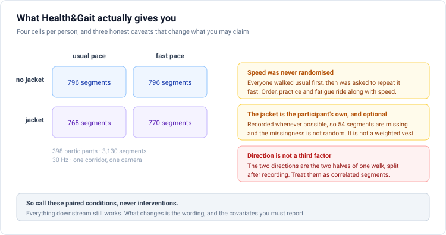
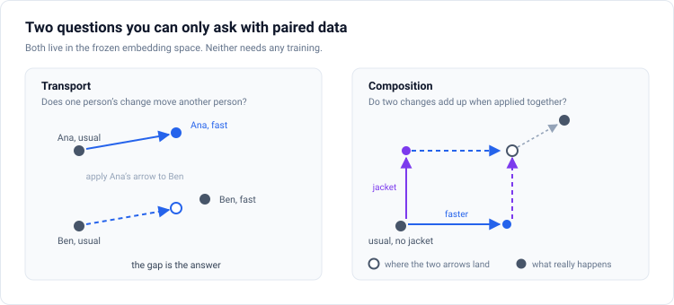

# Proposal 2: Paired-Condition Geometry

**Do video models represent a change in how a body moves, or only a change in how it looks?**

Target: ICLR 2027 main track, as a measurement paper with a method section. Higher ceiling than Proposal 1 and higher risk.

---

## The one-sentence version

For 398 people you have the same body recorded under a change in walking pace and a change in clothing, so you can treat each change as a displacement in embedding space and ask whether that displacement is reusable across people and whether two displacements add up.

## What the data actually is, stated honestly first

This matters more than the method, because the earlier drafts of this idea were built on a description of the dataset that turns out to be wrong in three places. I checked each against the published source and against the files on disk.

**Nothing was randomly assigned.** The protocol asked every participant to walk the corridor at a normal pace, and then to repeat the same path as fast as they could without running. Usual always came first. There is no counterbalancing and no washout. So the pace contrast carries order, practice, and fatigue along with it, and the word intervention is not available.

**The jacket is the participant's own, and it was optional.** The paper says participants were asked to walk with and without their jacket whenever possible. It is not a weighted vest, and it is not a load manipulation. On disk, 1,592 segments are without and 1,538 are with, so 54 are missing, and the missingness is not random since it depends on whether someone brought a jacket that day.

**The two directions are one walk.** Each recording contains a walk out and a walk back, split into two clips afterwards. They are correlated segments of a single trial, not a third factor.

Two more corrections that change the design. The DensePose-style segmentation in this release uses 14 body parts, not 24, and it carries no surface coordinates, so it is a flat colour-coded label map rather than a rich texture image. And the optical flow is released at 480 by 270 with a different frame count from the silhouettes, which are 960 by 540, so the four modalities are not all co-registered. Silhouette and segmentation are frame-aligned with each other. Flow needs a resampling step before it can be compared to them.

None of this kills the idea. It changes what you may claim, which covariates you must report, and which figure captions have to carry a warning. Call these paired conditions throughout, and the design survives every objection about causal language.

## The three measurements

**Relative size.** For each person, compute the displacement from their usual-pace embedding to their fast-pace embedding, and the displacement from their no-jacket embedding to their jacket embedding. Take the ratio of the norms. If putting on a coat moves a frozen video encoder further than walking forty percent faster, that is a short, memorable, and uncomfortable number.

**Transport.** Estimate the pace displacement on a set of donor participants. Apply it to a held-out participant's usual-pace embedding. Measure how close the result lands to that person's actual fast-pace embedding, scored as a retrieval rank against all held-out cells. Subject-disjoint by construction.

**Composition.** Ask whether the pace displacement plus the jacket displacement lands where the joint change actually lands. Do the two operators commute. Is a learned operator better described as identity plus low rank, as affine, or as genuinely nonlinear.

There is a fourth measurement worth pre-registering. Take the matrix of per-person pace displacements and look at its singular spectrum. A rank-one spectrum means everyone reorganises the same way when asked to hurry. A high-rank spectrum means the reorganisation is person-specific. Both outcomes are publishable, which is what makes this experiment safe to run.

## Where the novelty actually is, after the prior art

This is the part where the earlier drafts were most optimistic, and the honest version is narrower.

The headline "video encoders are more sensitive to appearance than to motion" is already established. Clothing-invariant gait recognition has been a named subfield since CASIA-B shipped a coat condition in 2006. Recent work constructs video pairs that share identical motion but differ in visual style and reports that current representations are sensitive to the non-motion factors. Systematic covariate stress testing of gait systems exists. A reviewer will read the relative-size number as a re-measurement of a known bias with a new metric, and they will be partly right.

Intervention-as-vector is also taken. Delta Embeddings learns intervention representations from computational perturbations. Split Invariant-Equivariant self-supervised learning splits a representation into invariant and equivariant parts with respect to augmentations. CausalVerse benchmarks causal representation learning with configurable simulation and ground-truth causal graphs, and the move that was supposed to distinguish this work from it, being real rather than simulated, costs you the word intervention once you read the protocol.

What survives is the composition experiment. Nobody has asked whether two different real-world within-person changes, applied to the same body, add up in a learned representation, because nobody has had 398 real bodies each recorded under both changes. That is one experiment, and the paper has to be built around it rather than around the relative-size number.

## Design

Rows of the main table are frozen encoders. Columns are input renderings, which is where the dataset limitation bites: a general-purpose video encoder trained on natural footage will struggle on binary silhouettes and on a flat 14-colour part map, and the earlier assumption that the segmentation would look like ordinary RGB was wrong. So every cell needs a domain-gap gate. Does the frozen encoder beat a randomly initialised encoder of the same geometry on a trivial task. If not, the cell is excluded, and the exclusion is reported rather than quietly dropped.

Add gait-specific checkpoints, which do work on silhouettes, and add a randomly initialised control. This is also the one legitimate use of GaitLU-1M: not as training data, which is 64 by 44 binary frames and cannot support any claim worth making, but as the corpus behind a public pretrained checkpoint that you can download and evaluate.

The whole thing is frozen-feature extraction plus linear algebra, roughly six to ten GPU hours, with no pretraining on the critical path. That is the strongest practical argument for this proposal in a six-week window.

## The risk that has to be managed

ICLR 2026 withdrew a striking number of papers with exactly this shape: one dataset, one domain, frozen public models, a table of which model wins. The accepted papers of this shape spanned many models and more than one domain, or carried an identifiability result.

So two things are mandatory. First, an external replication where pace is genuinely set rather than instructed. Treadmill gait datasets with controlled speeds are the obvious candidate, and they turn the pace contrast from an instruction into an externally imposed condition, which is the one place the causal language would be honest. Second, pre-register the three predictions before running anything: whether the jacket displacement exceeds the pace displacement for most encoders, whether the per-person spectrum is rank one, and whether encoders pretrained on natural video separate the two changes better than encoders pretrained on silhouettes.

## What kills this paper

If the relative-size number comes back unsurprising and the operators compose cleanly, the paper is a confirmation of content-style separation theory on real data, which is interesting but thin. If the domain gap excludes most cells, the model table collapses to gait-specific checkpoints and the finding stops being about video representation learning. And if a reviewer decides the order confound in the pace contrast is disqualifying rather than reportable, the transport and composition results lose their interpretation.

---

## Extension: Stanford HAI ambient intelligence

The relative-size number is the deployment robustness question, stated in one line: does the representation move more when the resident changes their sweater than when their walking changes. No in-home monitoring system has ever reported it, and every such system implicitly assumes the answer is no.

That framing is worth carrying into an ambient proposal because it is concrete, it is measurable before deployment, and it has an obvious pass-fail character. A model whose clothing displacement dominates its movement displacement will generate seasonal false alarms and will miss real decline, and you can know this in advance from a frozen-feature computation rather than after a year of monitoring.

The honest limitation for this audience is severe and should lead rather than follow. This is 398 healthy adults aged 19 to 64, walking down one corridor, in front of one camera, in one session. It has no older adults, no mobility impairment, no longitudinal structure, and no home. It can validate an instrument. It cannot validate a deployment.

## Extension: Scott Delp's balance assessment work

This is where the proposal gets genuinely interesting for that audience, because of one finding in the balance literature. Fast walking speed is more strongly associated with physical performance and balance confidence in older adults than usual walking speed is, and step-width variability discriminates fall-risk groups better at increased walking speed than at usual speed.

That reframes the pace contrast. Asking someone to walk as fast as they can is not just a statistically convenient paired condition. It is a capacity-under-load test, and the balance literature says the loaded condition is the more informative one. Which makes the per-person residual, meaning how this particular body reorganises when asked to hurry beyond the population average reorganisation, a principled candidate measure of motor reserve.

The singular spectrum experiment is exactly the test of whether such a measure can exist. A rank-one spectrum means everyone reorganises identically and there is no per-person signal to build on. A high-rank spectrum means there is. Either answer is useful to a lab that thinks about individual variation in balance.

The bridge to their tooling is OpenCap, which produces validated three-dimensional kinematics and kinetics from smartphone video. It is the way to check that a learned pace displacement corresponds to a real biomechanical change rather than to a rendering artifact, because it gives you the same movement in physical units alongside the video.

The claims boundary has to be explicit. Health and Gait contains no balance impairment, no falls, and no older adults, so nothing here is a clinical claim. The right framing for a collaboration is that the instrument is validated on a healthy cohort and the clinical cohort is what the collaboration would supply.

---

## What to build first

1. Generalise the manifest builder past silhouettes. The directory grammar supports segmentation and flow already, and pose is JSON that needs rendering before it can enter the same patch embedding.
2. Build the cell inventory. Audit the missing jacket cells and report the completeness rate, because a reviewer will check it against the published counts of 1,564 videos and 398 participants.
3. Resample flow to the silhouette grid, or drop it and say why.
4. Frozen-feature export with a domain-gap gate on every cell.
5. Compute the relative-size ratio first. It is the cheapest number and it decides whether the paper has a headline.
