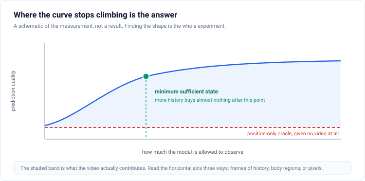
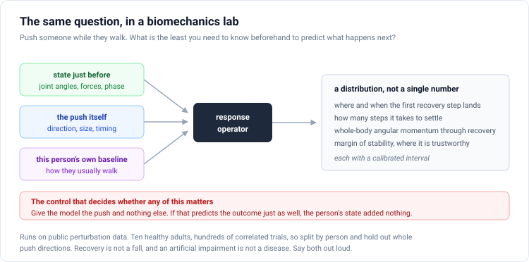

# Proposal 3: Minimum Sufficient State

**How little do you need to observe before the prediction stops getting better?**

Target: ICLR 2027 as a protocol and measurement paper. Strongest of the four as a bridge to biomechanics, weakest of the three ICLR-first proposals on novelty.

---

## The one-sentence version

Give a predictor progressively more of the past, more of the body, and more resolution, plot how much the prediction improves at each step, and the place where the curve flattens is an empirical estimate of the smallest observation that carries the information the task needs.

## Why this is a question worth asking

A predictive model can look like it is using its input when it is not. If the target is largely determined by where the target is rather than by what was observed, a predictor can reach a good loss while remaining nearly insensitive to the observed content. Anti-collapse regularizers do not address this, because they constrain the marginal distribution of embeddings rather than the conditional dependence of the prediction on the context.

In this repository the effect is visible and large. Replacing the entire input with a blank frame changes the prediction loss by about 0.025 percent. Replacing it with a different person's clip changes it by 0.04 percent. Shuffling the frames changes it by 0.012 percent, which is to say destroying all temporal order hurts only half as much as removing the input completely.

Two details in those numbers deserve more attention than they have had. First, blanking the input hurts *less* than substituting a wrong but real input. That is the signature of a predictor leaning on a positional prior which a wrong layout actively disrupts, and it is a cleaner story than "the model ignores its input." Second, the same-subject and cross-subject conditions differ by five parts in a million, with the sign pointing the wrong way and only 54 percent of participants showing a positive difference. The model cannot tell whose body it is looking at.

There is a structural reason for all of this in the code. The mask sampler picks cells on the spatial grid and then copies each selected cell to every temporal index. Context and target both span the whole clip, the time offset between them is never an input and never a supervision signal, and the maximum prediction horizon is therefore zero. The predictor is a spatial inpainter with information from both sides in time. Frame shuffling barely hurts because the co-temporal neighbours it leans on survive a permutation. That last point is close to a tautology once you see the masking code, and it should be presented as a consistency check rather than as independent evidence.

## What the measurement actually is

**The position-only oracle.** Train a predictor that receives the target positions and nothing else. This is the floor. If it reaches the same loss as the full model, the pretext task is vacuous and no amount of regularization will help.

**Matched wrong contexts, ordered by difficulty.** A different person is the easy negative. The same person on a different trial is harder. The same recording at a mismatched time is hardest, and it is the one that matters, because it preserves identity, clothing, camera, and background, so the comparison cannot be won by recognising the person.

There is a trap in that hardest negative which has to be handled explicitly. Walking is periodic. A different moment in the same recording can contain the same gait phase and therefore the same state, which makes the alleged negative a false negative. Estimate phase, exclude phase-equivalent windows, and report the result both with and without that filter.

**Sufficiency curves.** Vary the observation budget along whichever axis you care about: frames of history, distance in time to the target, which body regions are visible, resolution, and whether phase information is present. Plot prediction quality against budget. The elbow is the estimate.

**Target design as the mechanism.** In the current setup, 90 percent of masked target tokens contain no person at all, and the context-substitution gap is larger on background tokens than on foreground ones. Normalised by their own loss scale, the difference is about eight to one. So the pretext task is mostly asking the model to predict that a region is empty, which is solvable from position. Foreground-weighted or anatomy-constrained targets attack this directly, with the important caveat that foreground targets are also harder, so target count, spatial support, and empirical difficulty have to be matched or the ablation means nothing.

## Being honest about novelty

This is the proposal where the prior art is most crowded, and pretending otherwise would waste six weeks.

Masking designed to prevent shortcut solutions, so that a quantity must be inferred from context rather than read off position, was published in early 2026 by a group including LeCun and Balestriero. That is this proposal's mechanism claim, already in print. The position-only shortcut in masked autoencoders, and remedies for it, are documented in the point-cloud literature: one line of work shows the decoder can abandon the encoder output entirely, and another imposes an explicit constraint limiting how much of the masked coordinate is recoverable from positional embeddings alone. Semantic, attention-guided, and motion-guided masking are all thoroughly explored. And the most recent dense-prediction variant of V-JEPA independently diagnoses that unsupervised context tokens degenerate into registers that ignore local spatial structure, and ships a loss where all tokens contribute.

Any margin loss that pushes correct context to beat wrong context is a standard ranking objective, and calling it novel invites an easy rejection.

What is left is a protocol rather than a method: matched-negative substitution with phase filtering, a mandatory position-only oracle, and sufficiency curves, applied across several public checkpoints and reported as an adoptable practice. That is real and it is useful. It is also smaller than the title "necessary context" suggests, and the title should shrink to match.

## Why the second domain should be biomechanics, not rendered motion capture

The earlier plans called for a rendered motion-capture testbed as the controlled second domain, on the grounds that you need a setting where the information required for prediction is known. That is the right instinct and the wrong dataset. Building a renderer, a violation library, and a licensing path is one to two weeks of new pipeline before any result, and redistribution of rendered derivatives from the major motion-capture archive is a licensing question that has not been resolved.

The public balance-perturbation datasets are a better second domain and almost nobody has noticed. They are tabular, so there is no renderer. They are openly licensed with no registration friction. They contain synchronised kinematics, ground reaction forces, and derived states, with explicit perturbation direction, magnitude, and gait phase. And they come with the perfect analogue of the position-only oracle already built in, which is the subject of the next section.

---

## Extension: Scott Delp's balance assessment work

The question transfers almost word for word. Given a person's state just before a perturbation, and a full description of the perturbation, what distribution of recovery responses should we expect, and what is the smallest pre-perturbation state that predicts it?

The output should be a distribution rather than a point estimate: where and when the first recovery step lands, how many steps until settling, whole-body angular momentum through the recovery, and margin of stability where its measurement validity supports it, each with a calibrated interval.

**The control that decides whether any of it matters** is the perturbation-only oracle. Give a model the direction, magnitude, and phase of the push and nothing about the person. If that predicts the outcome as well as the full model, the person-state encoder added nothing and the reported accuracy describes the experimental protocol. This is exactly the position-only oracle from the main paper, which is why the two halves are one project rather than two.

The novelty boundary has to be drawn carefully. Perturbation recovery time is already defined as return to a subject's steady-state neighbourhood, and the useful centre-of-mass and angular-momentum features are already identified. A generative foundation model for gait kinematics and forces already exists and is strong. So the contribution cannot be a recovery-time estimator or a generic biomechanics latent. It has to be the combination of four things: conditioning explicitly on the action, conditioning on a subject-specific baseline, predicting a distribution rather than a point, and evaluating on held-out perturbation combinations rather than only held-out trials.

The data reality is worth stating up front. The public perturbation datasets have ten and eleven participants respectively, with hundreds of correlated trials, so splits must be by person and by perturbation condition. There is still no public perturbation dataset with synchronised RGB video, which means any camera-based balance claim requires new collection. Recovery is not a fall. An artificial impairment is not a disease. A model trained on healthy participants under laboratory perturbations cannot claim prospective fall-risk prediction, and saying so plainly is what makes the rest credible.

The sentence that opens a collaboration is roughly this: your perturbation data can answer a question that neither recovery time nor a generative gait model asks, which is what the smallest sufficient pre-perturbation state is, and whether a subject-specific baseline beats population normalisation on held-out push directions, and we will release it as code that runs on your files.

## Extension: Stanford HAI ambient intelligence

The sufficiency curve is the same object as the sensing-fidelity question, with a different horizontal axis. Instead of frames of history, the axis becomes how much sensing you are willing to install and transmit: full-resolution video, a person crop, a low-resolution crop, a silhouette, a compact on-device motion state, or a non-camera sensor.

At each rung you report the same set of quantities: how well within-person mobility change is preserved, how well calibrated the model is and whether it can tell when it is out of distribution, how much identity and attribute information an adaptive attacker can still recover, and what it costs in latency, energy, memory, and bandwidth.

The value of framing it as a curve rather than a comparison is that it produces an actionable answer. The elbow is the lowest sensing cost that preserves the utility you specified, and that is the number a deployment decision actually needs.

One warning belongs in bold in any such proposal. Low resolution is not privacy and silhouettes are not anonymous. Gait is biometric, and there is published evidence that identity survives pose-driven anonymisation largely intact. The curve has two axes for a reason, and the privacy axis is only meaningful if the attacker is retrained on the protected representation rather than applied naively.

---

## What to build first

1. Add volumetric and past-to-future mask generators alongside the current spatial-tube sampler, keeping the current one as the baseline. This is roughly ten lines and it is a prerequisite rather than a contribution.
2. Add the position-only predictor path.
3. Add matched wrong-context sampling with phase estimation and a filter for phase-equivalent windows.
4. Separate target selection, regularizer pooling, and probe pooling in the configuration, so that changing one does not silently change the others.
5. Pull the public perturbation datasets and build the tabular sufficiency harness. This can proceed in parallel and it does not touch the video pipeline.
