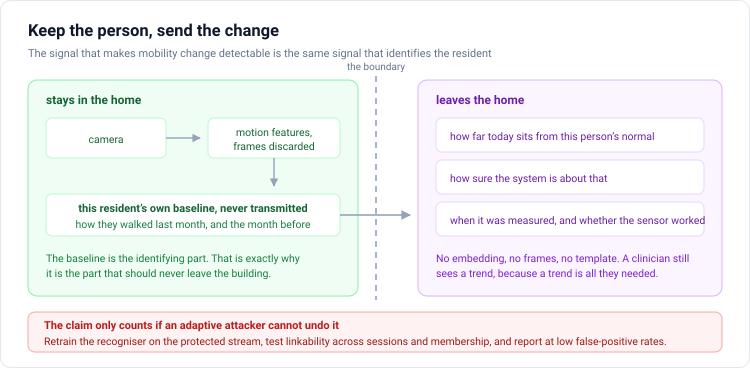

# Proposal 4: The Contained Personal Baseline

**Keep the person on the device, send only the change**

Target: primarily Stanford HAI, on a twelve-month horizon. Present at ICLR only if the representation-learning half stands on its own, which it does not yet.

---

## The one-sentence version

Anonymisation for in-home mobility monitoring is self-defeating under the usual framing, because the stable personal signal that makes change detectable is the same signal that identifies the resident, so the useful design keeps the baseline local and transmits only calibrated change.

## Why the usual framing fails

The standard privacy-preserving video pipeline tries to remove identity and keep task utility. For mobility monitoring this is close to incoherent. Detecting that someone has begun to slow down requires knowing how that person moved last month, which requires a stable within-person representation, which is the definition of a biometric template. Published work confirms the tension directly: appearance-level anonymisation removes the face and the clothing while leaving gait identity largely intact.

So the framing should invert. Instead of asking how much identity can be removed while preserving utility, ask where the identifying part should live. Keep the personal baseline on the device in the home, compute the deviation locally, and transmit only three things: how far today sits from this person's normal, how confident the system is about that, and when it was measured along with whether the sensor was working.

A useful way to write the decomposition is that an observation is a stable personal baseline, plus ordinary short-term variation such as gait phase and day-to-day noise, plus the deviation that might merit review. The first term is the identifying one and never leaves. The third term is the clinically interesting one and is nearly useless to an attacker on its own.

## What makes this a research question rather than an engineering choice

Three things, and they are the ICLR-facing half.

**When does personalisation actually help?** Subtracting a subject-specific baseline is not free. It removes between-person variation that a population model can exploit, and it requires enough per-person history to estimate. There should be a crossover: below some amount of personal history, population normalisation wins, and above it, personal normalisation wins. Locating that crossover as a function of history length, measurement noise, and effect size is a real question about representation learning under personalisation, and it has an answer that transfers well beyond ambient monitoring.

**What does the change vector leak?** The claim that transmitting only a deviation protects the resident is an empirical claim, not a definitional one. Deviations from a personal baseline may still be linkable across sessions, may still permit membership inference, and may still carry attributes such as age or sex. This has to be measured, not asserted.

**What is the right baseline object?** A running mean is the obvious choice and probably the wrong one. Gait varies with footwear, time of day, and fatigue, so a baseline that is a single point will produce seasonal false alarms. Whether the baseline should be a distribution, a low-dimensional subspace, or a set of context-conditioned modes is an open design question with measurable consequences.

## The evaluation standard this has to meet

This is the part where most privacy work in this area falls down, and where a proposal can distinguish itself cheaply by simply doing it properly.

A low identity-probe accuracy is not privacy. The field has been explicit that the usual evaluation assumes an attacker who does not know that anonymisation is in place, which is the wrong assumption. The current standard requires that the attacker be retrained on the protected representation, that more than one architecture be tried, that linkability across sessions and membership inference be tested alongside identification, and that results be reported in the low false-positive regime rather than at equal error rate.

There is an additional trap specific to this repository. The open-set retrieval number for the current encoder is 0.0245 against a chance rate of 0.0129, which means the encoder can barely re-identify anyone at all. Any privacy frontier measured with that encoder as the attacker will look reassuring for a reason that has nothing to do with the protection. The attacker has to be shown near state of the art on the unprotected representation before any protected number means anything, and that means using established gait-recognition checkpoints rather than a model trained here.

## Why this is not the ICLR paper this cycle

The privacy-and-utility framing for video is a crowded field. There is recent work on regenerating human video for anonymisation, on latent anonymisation adapters evaluated across several downstream tasks, on token-pruning approaches, and on gait de-identification evaluated with a clinical classifier as the utility task. There is also published work optimising privacy-utility tradeoffs for gait across hundreds of configurations. A proposal that plots a Pareto frontier of re-identification risk against clinical utility on four renderings of a healthy-adult corpus would be entering that field at a disadvantage, with a weaker cohort and a broken attacker.

The inversion described above, treating personalisation as the privacy architecture rather than identity removal as the privacy metric, is the part that is not occupied. But making it an ICLR paper requires the crossover result and the leakage measurement to both land, and neither can be established on a single-session dataset with no longitudinal structure. Health and Gait has one session per participant. There is no personal baseline to estimate.

That is the honest blocker. The idea is good and the data for it does not exist yet.

---

## Extension: Stanford HAI ambient intelligence

This is the proposal's natural home, and the framing is well matched to what that community actually says its obstacles are. The influential review of ambient intelligence in healthcare names rigorous clinical validation, data privacy, and model transparency as the central obstacles, and the current Stanford work in this space runs consented passive sensing in senior living settings with participatory design, longitudinal dashboards, and eventual clinical comparison. The sensing is largely depth, motion, vibration, and thermal rather than corridor RGB.

There is also a specific and useful hook. Recent anonymisation work from that group states as an explicit limitation that their method re-uses the source pose verbatim, which preserves gait, a known body-level identifier. This proposal is the direct follow-through on that stated limitation, which is a much better position than arriving with an unrelated idea.

A credible proposal to that audience needs five things that a laboratory corridor study does not have.

Repeated measurement over weeks or months, in real rooms with real camera changes. Older adults with clinically relevant mobility variation. Informed consent with understandable controls and a working opt-out. A decision protocol that specifies who receives an alert, at what threshold, what confirmatory assessment follows, how many false alerts are tolerable, and what happens when the model is out of distribution. And governance covering raw data, derived features, and access logs.

Until those exist, the correct description is an ambient-ready sensing and representation study, not ambient intelligence. Calling a staged laboratory video model an ambient system is the fastest way to lose that audience.

The sentence that gets engagement is roughly this: anonymisation for in-home mobility monitoring is self-defeating, because the longitudinal personal baseline that makes change detectable is the same signal that identifies the resident, so we keep the baseline on the device, transmit only calibrated change, and measure what an adaptive attacker can still recover.

## Extension: Scott Delp's balance assessment work

The personal baseline is not a privacy device in this setting. It is a measurement device, and there is direct evidence for its value: steady-state step-width variability, step-time variability, and foot-placement predictability detect artificially induced balance impairment well when subject-specific baselines are used, and considerably less well without them.

That turns the crossover question into a biomechanical one with a clear experimental design. How much steady-state walking do you need to observe from a person before their own baseline outperforms population normalisation for detecting a change in their balance? The answer is a number with units, it is directly useful to anyone designing a balance assessment protocol, and it can be computed on existing public data without collecting anything new.

The same question also connects back to Proposal 3, because a subject-specific baseline is one of the inputs to the response operator there, and the sufficiency analysis can treat the amount of baseline history as one more axis of the observation budget.

---

## What to build first

Nothing in this repository, yet. The blocking dependency is longitudinal data with repeated measurement of the same person, and that is an acquisition and partnership problem rather than a code problem.

The two things worth doing now are both cheap. First, run the crossover analysis on the public balance-perturbation data, where repeated trials per participant do exist, to establish the shape of the personal-versus-population curve in a setting where it is measurable today. Second, assemble a proper attacker suite from established gait-recognition checkpoints and verify it reaches credible accuracy on unprotected silhouettes, because every privacy claim any of these proposals might eventually make depends on that instrument working.
