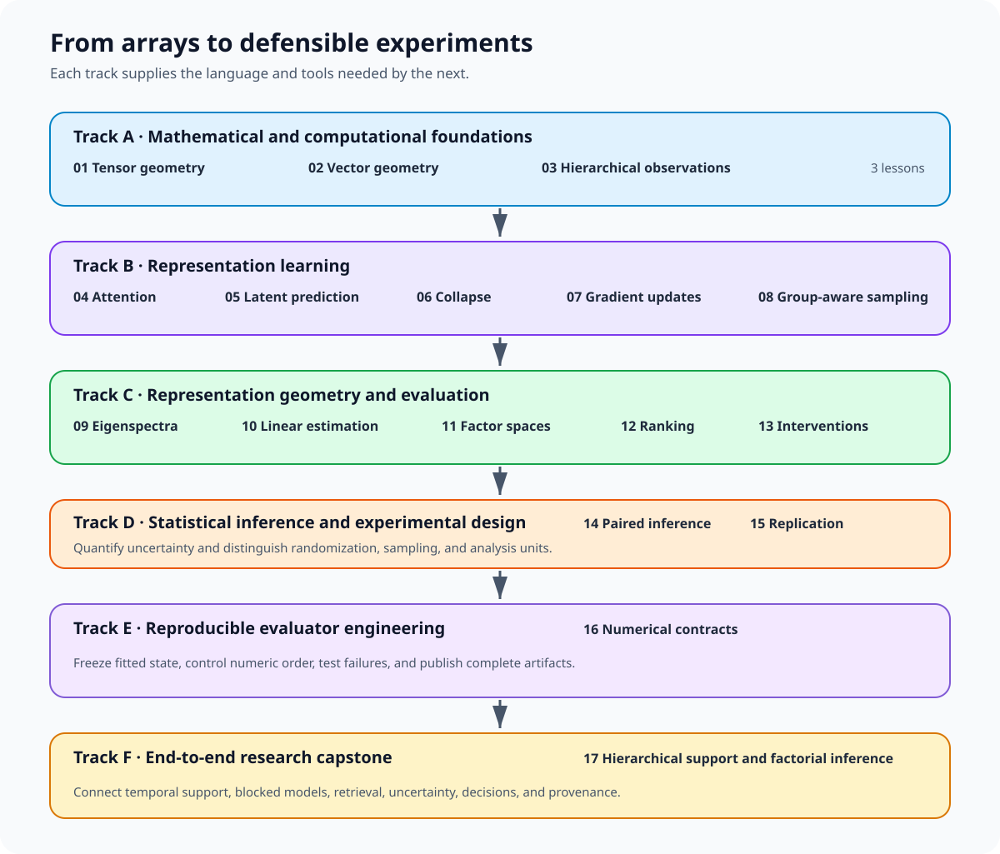

# Technical foundations for CoDy-JEPA

This curriculum teaches the mathematical, machine learning, statistical, and numerical-engineering ideas that a reader needs before studying the CoDy-JEPA codebase. The lessons begin with arrays and vector geometry, build toward representation learning and evaluation, and finish with statistical inference, reproducible evaluator construction, and an end-to-end hierarchical-diversity capstone.

The lessons are deliberately independent of repository internals. Every notebook uses small synthetic examples, runs on CPU, and can be understood without access to private data.



## Who this is for

The curriculum assumes that you can read Python, understand ordinary algebra, and use basic NumPy arrays. It does not assume prior coursework in linear algebra, probability, optimization, representation learning, or statistical inference.

Each numbered lesson contains two parts:

1. A lecture develops the intuition, notation, mathematics, and common failure modes.
2. A notebook turns the mathematics into a small implementation with checks and experiments.

Read the lecture first, then run the matching notebook. The lessons are progressive, so complete them in numerical order unless you already know the prerequisites listed at the start of a lecture.

## Curriculum

### Track A: Mathematical and computational foundations

| Lesson | Lecture | Implementation |
| --- | --- | --- |
| 01. Spatiotemporal tensor geometry | [Lecture](lectures/01_spatiotemporal_tensor_geometry.md) | [Notebook](implementations/01_spatiotemporal_tensor_geometry.ipynb) |
| 02. Inner-product geometry and numerical stability | [Lecture](lectures/02_inner_product_geometry.md) | [Notebook](implementations/02_inner_product_geometry.ipynb) |
| 03. Hierarchical observations and sampling | [Lecture](lectures/03_hierarchical_observations.md) | [Notebook](implementations/03_hierarchical_observations.ipynb) |

### Track B: Representation learning

| Lesson | Lecture | Implementation |
| --- | --- | --- |
| 04. Attention and positional representations | [Lecture](lectures/04_attention_and_positions.md) | [Notebook](implementations/04_attention_and_positions.ipynb) |
| 05. Masked latent prediction and target updates | [Lecture](lectures/05_masked_latent_prediction.md) | [Notebook](implementations/05_masked_latent_prediction.ipynb) |
| 06. Representation collapse and variance-covariance regularization | [Lecture](lectures/06_representation_collapse.md) | [Notebook](implementations/06_representation_collapse.ipynb) |
| 07. Gradient updates and parameter schedules | [Lecture](lectures/07_gradient_updates_and_schedules.md) | [Notebook](implementations/07_gradient_updates_and_schedules.ipynb) |
| 08. Group-aware sampling and shortcut learning | [Lecture](lectures/08_group_aware_sampling.md) | [Notebook](implementations/08_group_aware_sampling.ipynb) |

### Track C: Representation geometry and evaluation

| Lesson | Lecture | Implementation |
| --- | --- | --- |
| 09. Covariance eigenspectra and effective dimensionality, optional diagnostic | [Lecture](lectures/09_eigenspectra_and_effective_rank.md) | [Notebook](implementations/09_eigenspectra_and_effective_rank.ipynb) |
| 10. Regularized linear estimation and calibration | [Lecture](lectures/10_regularized_linear_estimation.md) | [Notebook](implementations/10_regularized_linear_estimation.ipynb) |
| 11. Factorial state spaces | [Lecture](lectures/11_factorial_state_spaces.md) | [Notebook](implementations/11_factorial_state_spaces.ipynb) |
| 12. Blockwise distances and rank statistics | [Lecture](lectures/12_blockwise_distances_and_ranking.md) | [Notebook](implementations/12_blockwise_distances_and_ranking.ipynb) |
| 13. Context interventions and identity geometry | [Lecture](lectures/13_context_interventions.md) | [Notebook](implementations/13_context_interventions.ipynb) |

### Track D: Statistical inference and experimental design

| Lesson | Lecture | Implementation |
| --- | --- | --- |
| 14. Paired contrasts, uncertainty, and decision thresholds | [Lecture](lectures/14_paired_inference.md) | [Notebook](implementations/14_paired_inference.ipynb) |
| 15. Exposure, replication, and variance decomposition | [Lecture](lectures/15_exposure_and_replication.md) | [Notebook](implementations/15_exposure_and_replication.ipynb) |

### Track E: Reproducible evaluator engineering

| Lesson | Lecture | Implementation |
| --- | --- | --- |
| 16. Reproducible scientific evaluators and numerical contracts | [Lecture](lectures/16_reproducible_scientific_evaluators.md) | [Notebook](implementations/16_reproducible_scientific_evaluators.ipynb) |

### Track F: End-to-end research capstone

| Lesson | Lecture | Implementation |
| --- | --- | --- |
| 17. Iso-catalog phase allocation and paired inference | [Lecture](lectures/17_hierarchical_support_and_factorial_inference.md) | [Notebook](implementations/17_hierarchical_support_and_factorial_inference.ipynb) |

Lesson 11 uses factorial language for the downstream outcome state space. Lessons 14, 15,
and 17 use paired comparisons for the training experiment. The first enumerates possible
factor combinations. The later lessons show why an allocation path with a matched jitter
diagnostic needs block-level inference rather than treating every trained model as unrelated.

## Directory layout

```text
tutorials/
├── README.md
├── check_tutorials.py
├── images/              # SVG diagrams and flow charts
├── lectures/            # Mathematical explanations and short code examples
└── implementations/     # Executable Jupyter notebooks
```

## Set up with uv

Run all commands from the repository root. Install the project and its development dependencies from the checked-in lockfile:

```bash
uv sync --locked --group dev
```

Start JupyterLab in the implementation directory:

```bash
uv run --locked jupyter lab tutorials/implementations
```

Open the first notebook and select the Python 3 kernel. Each notebook imports its own dependencies, fixes its random seeds, creates its own synthetic data, and avoids relying on variables from another notebook.

No dataset download is required. The notebooks use NumPy, PyTorch, scikit-learn, SciPy, and Matplotlib from the main project environment. Computations are intentionally small and run on CPU, including on laptops without a GPU.

## Validate the curriculum

Run the fast structural check first:

```bash
uv run --locked python tutorials/check_tutorials.py
```

Then execute every notebook from a fresh kernel. Outputs are written outside the source tree so the checked-in notebooks remain clean:

```bash
mkdir -p /tmp/cody-jepa-tutorial-runs
uv run --locked jupyter nbconvert \
  --to notebook \
  --execute \
  --ExecutePreprocessor.timeout=120 \
  --output-dir /tmp/cody-jepa-tutorial-runs \
  tutorials/implementations/*.ipynb
```

The full run should not need network access or repository data. Runtime varies by laptop, but every individual notebook is designed to finish well within the 120-second validation limit.

## How to study a lesson

1. Write down the shapes of every object before reading the equations.
2. Work through the smallest numerical example by hand.
3. Predict each notebook cell's result before running it.
4. Change one assumption and observe which assertions fail.
5. Complete the exercises without copying the nearby implementation.
6. Explain the lesson's central idea in your own words before continuing.

The assertions in the notebooks are teaching tools. When an assertion fails after an experiment, inspect the invariant it expresses rather than deleting the assertion.

## Reproducibility and performance notes

- Synthetic data keeps the lessons deterministic, fast, and free of licensing or privacy concerns.
- Seeds control pseudorandom examples, but exact low-order floating-point digits can still vary across hardware and library builds.
- Vectorized NumPy and PyTorch operations are preferred over Python loops when they make the array structure clearer.
- Small explicit loops remain useful when they expose a statistical sampling unit or a mathematical recurrence.
- All tensor examples default to CPU. You can move selected experiments to an accelerator after verifying the CPU result.
- The notebooks explain efficient APIs where they appear, including broadcasting, batched matrix multiplication, `np.einsum`, indexed gathering, stable linear solves, log-space likelihoods, grouped aggregation, crossed resampling, frozen inference, and atomic artifact publication.

## Scope

These tutorials explain reusable technical concepts. They do not document the CoDy-JEPA package, reproduce repository experiments, or make claims about research results. After completing the curriculum, use the repository documentation and source code to study how these ideas are assembled into the full system.

Applied next steps:

- [Proposed hierarchical-diversity method](../docs/hierarchical-diversity/method.md)
- [Hierarchical-diversity execution plan](../docs/hierarchical-diversity/execution-plan.md)
- [Data roles and preprocessing](../docs/unique-sequence-scaling/data.md)
- [GaitLU-1M shared preparation runbook](../docs/gaitlu_training.md)
- [Unique-sequence scaling fallback method](../docs/unique-sequence-scaling/method.md)
