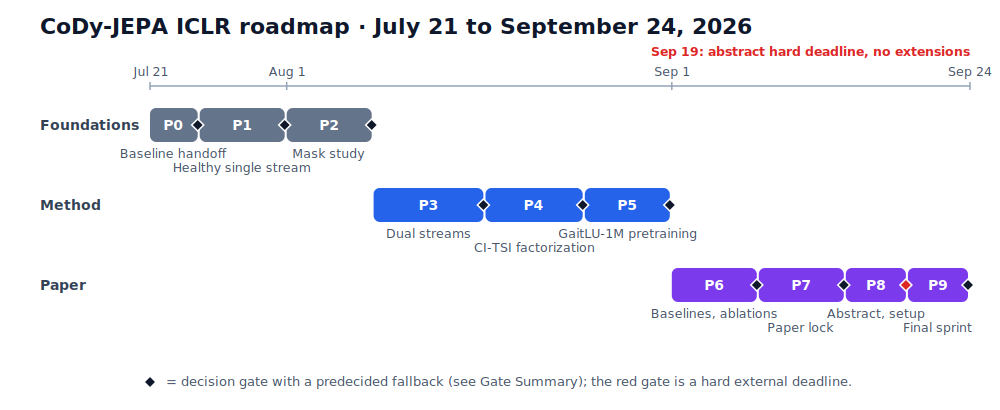

# CoDy-JEPA Execution Plan: The ICLR Roadmap

**July 21 to September 24, 2026. Target: ICLR main-track submission.**

## Purpose

This document is the working plan for taking CoDy-JEPA from its current state, a stabilized single-stream feasibility baseline on Health&Gait, to a main-track ICLR submission. It replaces the earlier open-ended 10-week research plan with a dated, gated roadmap. Every phase has a hard end date, a concrete deliverable, and a pass-or-pivot gate, because the submission deadline does not move.

The scientific goal is unchanged: show that CoDy-JEPA, a dual-stream JEPA that factorizes stable structure from changing motion in gait video, produces better motion representations, better low-label health probes, and better transfer than entangled single-stream baselines.

## How to Read This Document

The plan is organized as ten dated phases, Phase 0 through Phase 9. Each phase has the same shape:

1. **Goal**: the one-sentence purpose of the phase.
2. **Do**: the tasks and experiments.
3. **Deliver**: the artifacts that must exist when the phase ends.
4. **Gate**: the pass condition, checked on the phase's final day.
5. **If the gate fails**: the predecided fallback, so a slipping phase produces scope control instead of drift.

Read the Timeline at a Glance and the Gate Summary first. Then read only the current phase in detail. The reference sections at the end (glossary, risk register, table templates, minimal viable path, final checklist) support every phase and do not need to be read in order.

## Timeline at a Glance

| Phase | Dates | Theme | Gate question |
| --- | --- | --- | --- |
| 0 | Jul 21 to 24 | Baseline validation and handoff | Is the experimental base trustworthy and reproducible? |
| 1 | Jul 25 to 31 | Healthy single-stream baseline | Do we have a non-collapsed JEPA with useful signal? |
| 2 | Aug 1 to 7 | Token masking study | Does motion-aware masking measurably matter? |
| 3 | Aug 8 to 16 | Dual streams | Do stable and dynamic streams specialize, and does fusion win? |
| 4 | Aug 17 to 24 | CI-TSI and counterfactual factorization | Is there one compelling "why CoDy-JEPA exists" result? |
| 5 | Aug 25 to 31 | GaitLU-1M pretraining | Does scale transfer to Health&Gait? |
| 6 | Sep 1 to 7 | Baselines and ablations | Does the main table already look like a paper? |
| 7 | Sep 8 to 14 | Paper lock | Does a full draft exist with no empty tables? |
| 8 | Sep 15 to 19 | Abstract and submission setup | Is a real, informative abstract submitted? |
| 9 | Sep 20 to 24 | Final paper sprint | Is the PDF polished and consistent? |

Three structural observations about this timeline:

- **Phases 1 and 2 are science debt.** They convert the current infrastructure into trustworthy evidence. They cannot be skipped, because every later comparison inherits their choices.
- **Phases 3 and 4 are the contribution.** Dual streams plus counterfactual factorization is what makes this a CoDy-JEPA paper rather than a JEPA reproduction. These two phases get the most calendar time.
- **Phases 6 through 9 are fixed-cost paper work.** They cannot compress. If experiments slip, the cut comes from experiment scope (Phase 5 first), never from writing time.

## The Claim and the Definition of Success

The paper's central claim: **ambient gait video needs low-label, person-aware health representations, and CoDy-JEPA delivers them by factorizing stable and dynamic gait factors.**

Success is an asymmetric information pattern across the two streams, not a lower prediction loss:

| Probe task | Stable stream should be | Dynamic stream should be |
| --- | --- | --- |
| Subject identity, morphology, body structure | Strong | Weak |
| Gait speed, cadence, phase, asymmetry, pathology proxies | Weak | Strong |
| Background, camera, capture setup | Limited | Limited |
| Low-label transfer to new subjects and conditions | Useful | Stronger than baseline |

A lower future-embedding loss is only supporting evidence. The paper stands on three legs: probe asymmetry between streams, a compelling factorization demonstration, and at least one transfer win.

## Core Research Hypotheses

1. Temporal variation yields a useful weak partition between stable structure and changing motion, so motion-aware masking should beat spatial-only masking on dynamic probes.
2. Counterfactual token swapping (CI-TSI) reduces identity-motion shortcut learning by breaking the natural correlation between who is moving and how they move.
3. HSIC-style independence pressure reduces latent overlap between streams without the instability of adversarial estimation.
4. Variance and covariance safeguards (VICReg-style) are necessary because independence pressure alone rewards trivial representations.
5. The right evaluation is information-isolated probing and low-label transfer, not reconstruction quality.

## Working Agreements

- **Simplest credible version first.** A small reliable model beats an ambitious unstable one at every phase.
- **Instrument every representation claim.** Effective rank, variance, cross-stream leakage, and probe performance are tracked from the start of every run, never reconstructed afterward.
- **Never massage a collapsed run.** If diagnostics say a run failed, declare it failed and move to the predecided fallback.
- **Frozen protocol.** The manifest hash, split definitions, probe seeds, and feature formula frozen in Phase 0 define the evaluation protocol. Any change to them is a new protocol and invalidates prior comparisons.
- **When a phase slips**, cut in this order: optional experiments first, model variants second, evaluation coverage last. Never cut the evidence that supports the central claim, and never cut Phases 6 through 9.

---

## Phase 0: July 21 to 24, Baseline Validation and Handoff

**Goal: convert current work from promising infrastructure into a trustworthy, reproducible experimental base.**

### Where things stand

The rescue effort is concluded. Jobs 90881 and 91023, their executed notebooks, and the local `outputs/jepa-v3/` copy were deliberately retired. Job 91108 is the sole retained single-stream execution: its curated notebook is `haic-results/job_91108.ipynb`, and its checkpoints and probe reports live under `outputs/jepa-v4/`.

The verdict on 91108, stated plainly so it is never overclaimed later, is
anchored to the canonical `best_loss.pt` checkpoint at epoch 80
(`sha256:ab1e24043b2ba453e03fa427b0e845b74b2771682220732267d966be360097a5`):

| Diagnostic | Result | Target | Status |
| --- | --- | --- | --- |
| Effective rank | 10.45 (escaped the earlier rank-2 collapse) | rising, non-collapsed | Pass |
| Effective-rank ratio | 2.72 percent | at least 5 percent | Fail |
| Subject-balanced wrong-context loss gap | 0.000154 | at least 0.001 | Fail |
| Closed-set subject identity probe | 9.25 percent (majority baseline 0.32 percent) | above chance | Pass |
| Held-out identity retrieval | 2.45 percent (chance 1.29 percent) | above chance | Pass |
| Subject-held-out gait-system balanced accuracy | 92.57 percent (chance 50 percent) | above chance | Strong pass |

So: job 91108 is a useful non-collapsed feasibility baseline with a strong transferable gait signal and measurable identity information. It did not pass the health gate, no `best_healthy.pt` was written, and it is not the research contribution. It is the reference row that Phase 1 must beat.

The canonical Health&Gait split is deterministic and subject-disjoint. The manifest schema contains `subject_id`, `modality`, `gait_system`, `trial`, `frame_dir`, `num_frames`, and `split`. It contains no health, frailty, pathology, or diagnosis labels, so those probes are unsupported until an audited label source with a subject-safe mapping exists. Do not infer health outcomes from `gait_system`.

### Do

1. Treat job 91108 and `outputs/jepa-v4/` as read-only baseline evidence. Do not restore retired jobs or recreate `outputs/jepa-v3/`.
2. Re-export features from `outputs/jepa-v4/best_loss.pt` and `outputs/jepa-v4/latest.pt` into distinct files, rerun all three supported probes under current code, and record checkpoint and feature-table hashes. Use the comparison to lock the canonical baseline checkpoint for all later ablation tables.
3. Freeze the evaluation protocol: manifest hash, split counts, metadata schema, probe seed, feature formula, and checkpoint identifier, all recorded in the baseline report.
4. Add one documented orchestration entry point that runs the full pipeline: submit or run training, validate the completed checkpoint, export features, run probes, produce a compact report. Preserve the Slurm boundary required by HAIC.

### Deliver

- Locked canonical baseline checkpoint with recorded provenance.
- Frozen evaluation protocol document (part of the baseline report).
- One-command train-to-report pipeline, documented.

### Gate G0, July 24

Pass when the retained checkpoint reproduces its probe metrics from a clean feature export, all provenance fields are recorded, and the single documented workflow regenerates the baseline report. If the `best_loss.pt` versus `latest.pt` comparison changes the interpretation, report the difference; never silently select the more favorable checkpoint.

**If the gate fails:** fix reproducibility before launching anything new. Do not launch another generic rescue run to improve health-gate numbers. Use `outputs/jepa-v5/` only for a run with a named scientific change and a predeclared success criterion.

---

## Phase 1: July 25 to 31, Healthy Single-Stream Baseline

**Goal: produce a single-stream JEPA that passes the health gate, so every later comparison rests on a healthy reference.**

### Why this matters

Job 91108 proved feasibility but failed the health gate on rank ratio and wrong-context gap. The dual-stream contribution cannot be interpreted against a partially collapsed baseline; a reviewer's first question will be whether the baseline was trained properly. This phase answers it.

### Do

Run a focused sweep. One knob at a time from the 91108 configuration, then combine the winners:

| Knob | Values | What it tests |
| --- | --- | --- |
| Learning rate | 3e-5, 1e-4, 3e-4 | Whether collapse pressure is optimization-driven |
| EMA momentum | 0.99, 0.995, 0.998 | Target-encoder stability versus staleness |
| Mask ratio | light, medium, heavy (fix concrete ratios before launch and record them) | Task difficulty versus signal starvation |
| Predictor depth | shallow versus current | Whether the predictor is absorbing representation quality |
| VICReg-style variance regularizer | off, on | Contingency only, if collapse persists across the sweep |

For every run, track from step zero: training loss, effective rank and rank ratio, per-dimension variance, wrong-context loss gap, and gradient norm.

### Deliver

- Training curves and representation-health curves for every sweep run.
- Feature export plus all three supported linear probes for candidate configurations.
- 2 to 3 seeds for the best configuration.
- Explicit, documented `best_healthy.pt` selection logic: the checkpoint must pass rank ratio of at least 5 percent and wrong-context gap of at least 0.001, then maximize probe performance.

### Gate G1, July 31

Pass with a non-collapsed single-stream JEPA that passes the health gate and shows useful downstream signal, meaning it matches or beats the 91108 probe numbers.

**If the gate fails:** main track becomes very unlikely. Continue, but treat the rest of the plan as uphill: cut Phase 5 to feasibility-only immediately, and plan the paper around the best available baseline with honest health diagnostics.

---

## Phase 2: August 1 to 7, Token Masking Study

**Goal: turn masking from an implementation detail into scientific evidence that motion-aware masking matters.**

### Why this matters

This is the first result that is a finding rather than infrastructure, and it is the direct empirical test of Hypothesis 1. It also selects the canonical mask recipe that the dual-stream model in Phase 3 will consume, so it must finish on time.

### Do

Train matched runs from the Phase 1 healthy configuration, varying only the mask design:

| Mask family | Construction | What it probes |
| --- | --- | --- |
| Random token | Uniformly random tokens masked | Content-blind reference point |
| Spatial block | Contiguous spatial regions, all frames | Appearance-focused prediction |
| Temporal block | Contiguous frame spans, all positions | Motion-focused prediction |
| Tube | Spatial block extended through time | Object-persistent occlusion |
| Mixed spatial-temporal | Combination schedule | Whether hybrids beat pure designs |

Then sweep the mask ratio around the best-performing design.

Evaluate every run on the same axes: prediction loss, effective rank and collapse metrics, gait speed and cadence probe, subject probe, and retrieval or temporal-consistency measure.

### Deliver

- The main-figure candidate: mask design on the x-axis, dynamic-probe performance and effective rank on the y-axis, showing that temporal and spatiotemporal masks produce better gait-motion features than spatial-only masks.
- A written recommendation for one canonical mask recipe with its ratio.

### Gate G2, August 7

Pass when one canonical mask recipe is chosen and the results support the sentence "motion-aware masking matters."

**If the gate fails**, meaning the mask designs are indistinguishable: adopt the best available recipe anyway, move the mask study to the appendix, and shift the paper's evidence weight onto Phases 3 and 4.

---

## Phase 3: August 8 to 16, Dual Streams

**Goal: implement the real CoDy-JEPA model with distinct stable and dynamic streams.**

### Architecture

*Solid arrows are the training path. Dashed boxes are stop-gradient EMA targets. Dotted arrows pass through stream-specific projection heads, so diagnostic pressure never distorts the representations themselves.*

Components to implement:

- A stable encoder branch and a dynamic encoder branch, with a shared or partially shared patch and tubelet stem if it helps compute. Start conservative: shared stem plus separate stream transformers. Fully separate encoders only if the shared design entangles.
- Separate predictors per stream.
- A fusion head for downstream probes.
- Stream-specific projection heads for diagnostics, so decorrelation pressure and leakage measurement do not distort the representations themselves.

### Training objectives

- The stable stream predicts invariant and static context.
- The dynamic stream predicts motion, future state, and contextual change, using the canonical mask recipe from Phase 2.
- The fused representation supports downstream prediction.
- Add stream decorrelation pressure: an HSIC or VICReg-style cross-stream penalty, kept at a conservative weight so prediction still dominates the objective.

### Evaluate each stream on its own terms

| Stream | Evaluation battery |
| --- | --- |
| Stable | Subject identity probe, body and context retrieval, cross-clip identity consistency |
| Dynamic | Gait speed and cadence probes, asymmetry or pathology proxies, temporal perturbation sensitivity |
| Fused | Downstream task performance versus the Phase 1 single-stream baseline |

Also track cross-stream cosine similarity and per-stream variance throughout training, so redundancy is caught during the run rather than at evaluation.

### Deliver

- A dual-stream model that trains without collapse, with both streams separately extractable.
- The per-stream evaluation battery above, run against the single-stream baseline.

### Gate G3, August 16

Two conditions, both required. The stable and dynamic streams must differ measurably on their probe batteries, and the fused representation must beat the single-stream baseline on at least one meaningful task.

**If the gate fails** because the streams are redundant: fix it before moving on. In order of preference: strengthen the decorrelation weight, differentiate the stream inputs more aggressively (stable stream sees temporally pooled or subsampled context, dynamic stream sees the motion-masked view), then separate the encoders. Do not start Phase 4 on redundant streams, because CI-TSI presupposes that the streams carry different information.

---

## Phase 4: August 17 to 24, CI-TSI and Counterfactual Factorization

**Goal: make the contribution distinctive. Without this phase, the paper reads as an incremental dual-encoder JEPA.**

### The intervention

CI-TSI, the Cross-Instance Token-Swapping Intervention, builds counterfactual contexts by combining stable tokens from one clip with dynamic tokens from another:

*Blue carries clip A's stable appearance, orange carries clip B's motion. The dashed branch is the stop-gradient target path from clip B.*

The target alignment rule is the single most important correctness detail: the swapped context carries motion from clip B, so the prediction target must be the future dynamics embedding of clip B, computed through the stop-gradient target branch. Misaligning the target to clip A silently teaches the model to ignore the dynamic tokens.

### Do

Pairing and intervention designs:

- Same-subject, different-time pairing.
- Different-subject, similar-motion pairing, where metadata supports matching.
- Stable and dynamic swap tests in both directions.
- Temporal shuffling and perturbation sensitivity tests.

Factorization losses, added incrementally and weighted so prediction still learns: HSIC (start with a linear kernel, batch-centered), a cross-correlation penalty between streams, and a variance floor per stream.

Safety constraints on swapping: reject swaps with too few stable or dynamic tokens, log source and target identities for every swap so accidental same-instance swaps are measurable, and keep a no-swap probability if training destabilizes.

### Deliver: the four demonstrations

1. Stable embeddings remain consistent across clips of the same person.
2. Dynamic embeddings change with gait condition, speed, and motion.
3. Swapped and factorized embeddings behave predictably under intervention.
4. Factorization improves low-label downstream performance or robustness.

### Gate G4, August 24

Pass with at least one visually and quantitatively compelling "this is why CoDy-JEPA exists" result, drawn from the four demonstrations above. This result anchors the paper's disentanglement figure.

**If the gate fails:** the paper risks reading as incremental. Spend no more than two extra days on the most promising demonstration, then narrow the claim to what Phases 2 and 3 support (motion-aware masking plus stream specialization) and let Phase 5 transfer results carry more weight.

---

## Phase 5: August 25 to 31, GaitLU-1M Pretraining

**Goal: add scale and transfer. This is the plan's designated pressure-release valve: valuable if it works, cut first if it does not.**

### Do

Build the minimum viable GaitLU package before any large job: a production loader, a metadata audit, subject and camera and split hygiene, a distributed pretraining job, feature export, and transfer to the Health&Gait probes.

Then run the transfer matrix:

| Pretraining data | Evaluation | Question answered |
| --- | --- | --- |
| Health&Gait only | Health&Gait probes | Reference (already have from Phases 1 to 4) |
| GaitLU only | Health&Gait probes | Does scale transfer zero-shot to the target domain? |
| GaitLU, then Health&Gait finetune | Health&Gait probes | Does scale plus adaptation beat target-only training? |
| GaitLU subsets: 1, 10, 100 percent (optional) | Health&Gait probes | Data scaling curve |

### Deliver

- At least one completed GaitLU-pretrained checkpoint with exported features and Health&Gait probe results.
- The transfer comparison table.

### Gate G5, August 31

Pass with at least one transfer win: any cell of the matrix where GaitLU pretraining beats the Health&Gait-only reference.

**If the gate fails**, or if GaitLU causes loader or compute chaos at any point during the week: freeze it immediately as a "scaling feasibility" appendix section and protect the core Health&Gait story. Do not let this phase leak into September.

---

## Phase 6: September 1 to 7, Baselines and Ablations

**Goal: survive reviewer skepticism. The main table must already look like a paper by September 7.**

### Baselines (rows of the main table)

| Baseline | Purpose |
| --- | --- |
| Supervised video model | Upper reference for label-rich settings |
| VideoMAE or masked autoencoder | Standard SSL comparison |
| Single-stream JEPA (Phase 1) | The direct ancestor |
| Dual-stream without CI-TSI (Phase 3) | Isolates the architecture contribution |
| Dual-stream with CI-TSI (Phase 4) | The full method on target data |
| GaitLU-pretrained CoDy-JEPA (Phase 5) | The full method at scale, if G5 passed |
| Handcrafted or simple gait-feature baseline | Grounds the task difficulty, if available |

### Ablations

Component removals: no dual stream, no factorization loss, no temporal masking, no EMA. Stream restrictions: stable-only, dynamic-only, fused. Data: Health&Gait-only versus GaitLU pretraining.

Each ablation reuses the frozen Phase 0 evaluation protocol, so numbers are comparable across the whole table.

### Gate G6, September 7

Pass when the main table already looks like a paper. CoDy-JEPA does not need to win everywhere. It must win on the tasks that match the claim: dynamic and motion probes, low-label settings, and transfer.

**If the gate fails:** trim the claim to match the table rather than running new experiments into Phase 7. A narrower true claim survives review; a broad unsupported one does not.

---

## Phase 7: September 8 to 14, Paper Lock

**Goal: stop inventing, start proving. All discovery ends; everything from here is consolidation.**

### Deliver

Figures and tables: final main tables, final architecture figure, final disentanglement figure (the Phase 4 result), final transfer and scaling figure, final ablation table.

Text: related work, limitations section, reproducibility appendix, ethics and privacy appendix. The ethics appendix matters more than usual here because gait is a biometric: address identity information in the stable stream, subject consent and dataset licensing, and the boundary between motion analysis and identification.

### Writing structure

1. **Problem**: ambient gait video needs low-label, person-aware health representations.
2. **Method**: CoDy-JEPA factorizes stable and dynamic gait factors.
3. **Evidence**: better motion representations, better low-label probes, better transfer.
4. **Analysis**: stream disentanglement, ablations, failure cases.
5. **Healthcare relevance**: personalized mobility-decline and fall-risk monitoring.

### Gate G7, September 14

A full paper draft exists. No empty tables. No "TODO: rerun main experiment" anywhere in the main story.

**If the gate fails:** cut sections, not evidence. A shorter complete draft beats a longer one with holes.

---

## Phase 8: September 15 to 19, Abstract and Submission Setup

**Goal: submit a real abstract, not a placeholder. This is a hard external deadline.**

ICLR 2026 explicitly required informative abstracts and did not allow missing the abstract deadline. Treat the 2027 cycle as having the same policy until proven otherwise, and verify the exact 2027 dates and policy on iclr.cc at the start of this phase.

### Do

- Finalize the title and author list.
- Submit the real abstract.
- Check anonymity throughout the draft and supplementary material.
- Check every author's OpenReview profile meets requirements.
- Prepare the supplementary-material skeleton.
- Freeze all method names and terminology; no renaming after this point.

There is no fallback branch for this phase. The abstract goes in on time, describing the paper as it exists.

---

## Phase 9: September 20 to 24, Final Paper Sprint

**Goal: polish, not discover.**

### Do

Final seed reruns only where a number is broken. Table consistency checks (every number in the text matches its table). Figure captions that stand alone. Appendix configs. Failure cases. Citation audit. Privacy and ethics wording review. Anonymized repository and supplement. Final PDF lint.

### Hard rules

- No new core experiment after September 21 unless it replaces a broken result.
- September 22 to 24 are for paper quality only. No research wandering.

---

## Gate Summary

| Gate | Date | Pass condition | If it fails |
| --- | --- | --- | --- |
| G0 | Jul 24 | Baseline reproduces from clean export; protocol frozen; one-command pipeline | Fix reproducibility before any new training |
| G1 | Jul 31 | Health-gated single stream with useful downstream signal | Main track unlikely; cut Phase 5 to feasibility, proceed with honest diagnostics |
| G2 | Aug 7 | Canonical mask recipe chosen; "motion-aware masking matters" supported | Adopt best recipe; move study to appendix |
| G3 | Aug 16 | Streams measurably differ; fused beats single stream on one task | Fix redundancy before Phase 4; do not proceed on redundant streams |
| G4 | Aug 24 | One compelling factorization result | Two extra days maximum, then narrow the claim |
| G5 | Aug 31 | At least one GaitLU transfer win | Freeze as scaling feasibility; protect Health&Gait story |
| G6 | Sep 7 | Main table looks like a paper; wins on claim-matched tasks | Trim claim to the table |
| G7 | Sep 14 | Full draft, no empty tables, no TODOs | Cut sections, not evidence |
| G8 | Sep 19 | Real abstract submitted, anonymity and profiles verified | None; hard external deadline |
| G9 | Sep 24 | Polished, consistent, submitted PDF | None; ship what exists |

---

## Glossary

| Term | Meaning |
| --- | --- |
| Stable stream, `S_attr` | Encoder branch capturing invariant structure: identity, morphology, embodiment, static context |
| Dynamic stream, `S_dyn` | Encoder branch capturing time-varying factors: motion, gait phase, speed, contextual change |
| CI-TSI | Cross-Instance Token-Swapping Intervention: counterfactual contexts built from one clip's stable tokens and another clip's dynamic tokens |
| HSIC | Hilbert-Schmidt Independence Criterion, used as a differentiable penalty on cross-stream dependence |
| VICReg-style terms | Variance floor and covariance penalty that prevent collapse and within-stream redundancy |
| Effective rank / rank ratio | Collapse diagnostics on the feature covariance; the rank ratio target is at least 5 percent |
| Wrong-context loss gap | Subject-balanced difference between wrong-context and correct-context prediction loss; target at least 0.001 |
| Health gate | Rank ratio and wrong-context gap targets that a checkpoint must pass before `best_healthy.pt` is written |
| Health&Gait | Primary target dataset with the frozen canonical subject-disjoint split |
| GaitLU-1M | Large-scale gait dataset used for scaling and transfer in Phase 5 |
| Leakage | Probe performance of a stream on the other stream's information, for example identity readable from `S_dyn` |

## Risk Register

| Risk | Early warning sign | Mitigation |
| --- | --- | --- |
| Single-stream baseline never passes health gate | G1 sweep shows rank ratio stuck below target across all knobs | Add VICReg variance term; if still failing, invoke the G1 fail branch and do not hide it |
| Mask study is inconclusive | Probe differences across mask families within noise | Adopt best recipe, appendix the study, reweight evidence to Phases 3 and 4 |
| Streams are redundant | Cross-stream cosine similarity stays high; probe batteries overlap | Stronger decorrelation, more differentiated stream inputs, then separate encoders |
| CI-TSI target misalignment | Loss decreases but swap ablation shows no behavioral difference | Verify the clip-B target rule and stop-gradient path with a shape-and-gradient smoke test before full runs |
| Swaps create impossible contexts | Loss spikes as swap probability rises | Restrict pairings by compatibility; schedule swap probability from low to high |
| Factorization loss removes useful information | Motion probes drop sharply when HSIC weight rises | Lower the weight; apply the penalty after projection heads only |
| GaitLU loader or compute chaos | Any pipeline instability during Phase 5 week | Freeze immediately as scaling feasibility; the fallback is predecided, so invoke it without debate |
| Identity leaks into dynamic stream | Subject probe on `S_dyn` stays well above chance | Report it as a limitation with the leakage table; do not claim privacy or fairness benefits |
| Background dominates the stable stream | Camera or setting probes on `S_attr` are strong | Subject-centered cropping; add background-leakage probes to the battery |
| Paper time gets eaten by experiments | Any Phase 6+ date slips | Phases 6 to 9 are fixed; cut experiment scope instead, Phase 5 first |

## Experiment Table Templates

Fill these as results arrive so the paper's tables assemble themselves in Phase 7.

### Main results table (Phase 6)

| Model | Dynamic probes (speed, cadence) | Stable probes (subject ID, retrieval) | Fused downstream | Low-label transfer | Effective rank ratio |
| --- | --- | --- | --- | --- | --- |
| Supervised video model | | | | | |
| VideoMAE / MAE | | | | | |
| Single-stream JEPA | | | | | |
| Dual-stream, no CI-TSI | | | | | |
| CoDy-JEPA (full) | | | | | |
| CoDy-JEPA + GaitLU | | | | | |
| Handcrafted gait features | | | | | |

### Disentanglement and leakage table (Phase 4)

| Model | `S_attr` to identity | `S_attr` to motion (leakage) | `S_dyn` to motion | `S_dyn` to identity (leakage) | Asymmetry gap |
| --- | --- | --- | --- | --- | --- |
| Single-stream JEPA | | | | | |
| Dual-stream, no CI-TSI | | | | | |
| CoDy-JEPA (full) | | | | | |

### Ablation table (Phase 6)

| Variant | Prediction loss | Rank ratio | Dynamic probe | Identity leakage in `S_dyn` | Transfer |
| --- | --- | --- | --- | --- | --- |
| CoDy-JEPA (full) | | | | | |
| No dual stream | | | | | |
| No factorization loss | | | | | |
| No temporal masking | | | | | |
| No EMA | | | | | |
| Stable-only | | | | | |
| Dynamic-only | | | | | |

### Transfer table (Phase 5)

| Pretraining | Finetune | Label budget | Health&Gait score | Notes |
| --- | --- | --- | --- | --- |
| Health&Gait only | none | full | | reference |
| GaitLU only | none | full | | |
| GaitLU | Health&Gait | full | | |
| GaitLU | Health&Gait | 10 percent | | |
| GaitLU | Health&Gait | 1 percent | | |

## Minimal Viable Paper

If time or compute collapses, this is the smallest package that still supports the central claim:

- Health&Gait only; Phase 5 dropped entirely.
- Shared backbone with two stream transformers and projection heads.
- The Phase 2 canonical mask recipe.
- CI-TSI with same-domain pairing, linear HSIC, variance-only safeguards.
- Four model rows: single-stream JEPA, dual-stream without CI-TSI, CI-TSI only, full CoDy-JEPA.
- Four probes: `S_attr` to identity, `S_attr` to motion, `S_dyn` to identity, `S_dyn` to motion.
- One held-out-subject transfer test.

This package tests Hypotheses 1 through 4 and fills the disentanglement table. Everything beyond it is strengthening, not foundation.

## Final Submission Checklist

Before the September 24 submission, verify:

- [ ] Every number in the main text matches its table.
- [ ] All figures and tables regenerate from saved outputs and the frozen protocol.
- [ ] `S_attr` and `S_dyn` features are archived separately for every reported model.
- [ ] CI-TSI swap logs (source and target identities) are archived.
- [ ] The health-gate diagnostics for every reported checkpoint are in the appendix.
- [ ] Each major component has at least one ablation row.
- [ ] At least one transfer or held-out-condition result is reported.
- [ ] The limitations section names identity leakage and label availability plainly.
- [ ] The ethics appendix addresses gait as a biometric.
- [ ] The repository and supplement are anonymized.
- [ ] The abstract submitted in Phase 8 still describes the final paper.
