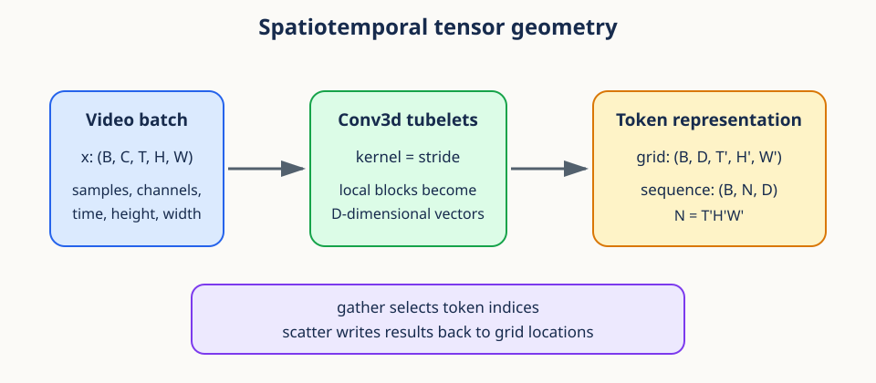
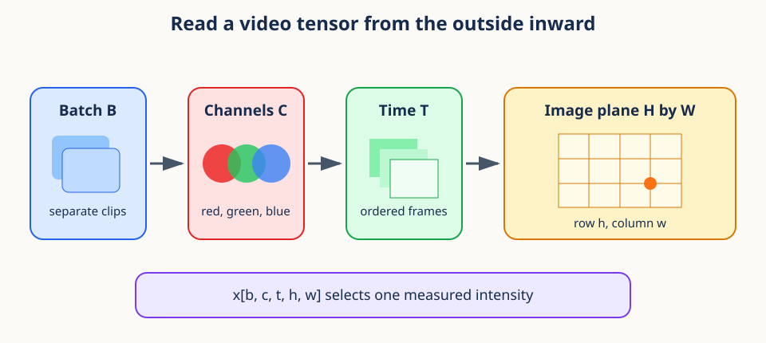
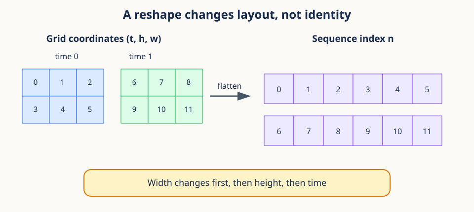

# 01. Spatiotemporal tensor geometry



## Begin with a concrete video

Imagine a wildlife camera records a two-second color clip at four frames per second.
Every frame is 6 pixels high and 8 pixels wide. One clip therefore contains eight
frames, every frame contains three color measurements at each pixel, and every color
plane contains $6\times8$ numbers. If we load five clips together, we have not created
a mysterious five-dimensional object. We have simply nested five familiar questions:

1. Which clip are we reading?
2. Which color channel are we reading?
3. Which moment in time are we reading?
4. Which row of the image are we reading?
5. Which column of the image are we reading?

Those five questions are the five axes of a video tensor. Tensor notation is useful
because it makes the nesting explicit and lets a computer apply one operation to many
clips, frames, and pixels at once.



The central mental model for this lesson is an address system. A tensor shape tells us
how many valid choices each part of an address has. An index such as `x[2, 0, 5, 3, 7]`
is one complete address. A slice such as `x[2, :, 5]` leaves some parts of the address
open and therefore returns a smaller table rather than one number.

This address interpretation matters more than memorizing an axis convention. Different
libraries may store video axes in different orders. If you can say what each coordinate
means, you can translate between conventions without silently changing the data.

## Prerequisites

You should be comfortable with Python indexing, NumPy arrays, and ordinary arithmetic.
No knowledge of video models is required.

## Learning goals

By the end of this lesson, you will be able to:

1. Read and reason about a five-dimensional video tensor.
2. Distinguish a tensor axis from a coordinate along that axis.
3. Compute the output shape of a three-dimensional convolution.
4. Explain how tubelets turn local video blocks into tokens.
5. Convert between token grids and token sequences without changing data.
6. Select and restore tokens with gather and scatter operations.

## 1. A tensor is an indexed table

A scalar is one number. A vector is a one-dimensional table of numbers.
A matrix is a two-dimensional table. A tensor extends this idea to any number of axes.

For video learning, a common layout is

$$
x \in \mathbb{R}^{B\times C\times T\times H\times W}.
$$

The symbols mean:

- $B$: number of independent video samples in the batch.
- $C$: channels per frame, often 3 for red, green, and blue.
- $T$: number of time steps or frames.
- $H$: frame height.
- $W$: frame width.

The expression $x[b,c,t,h,w]$ names one scalar. It is the value at sample $b$,
channel $c$, time $t$, row $h$, and column $w$.

Shape is metadata about how coordinates are interpreted. Two tensors can contain the
same number of scalars but represent very different objects when their shapes differ.

For the camera example, a batch of five clips has shape `(5, 3, 8, 6, 8)`. The total
number of stored measurements is the product of the axis lengths:

$$
5\times3\times8\times6\times8=5{,}760.
$$

This product tells us storage size, but it does not tell us meaning. A tensor of shape
`(5, 8, 6, 8, 3)` has the same number of values, yet the channel coordinate is now last.
Shape is therefore both a counting device and a semantic contract.

**Conceptual checkpoint.** In a shape, an axis is a kind of coordinate, such as time.
An index is one choice on that axis, such as frame 5. The axis length is the number of
valid choices, such as 8 frames. Keeping these three ideas separate prevents many shape
errors.

```python
import torch

x = torch.arange(2 * 3 * 4 * 6 * 8).reshape(2, 3, 4, 6, 8)
print(x.shape)          # torch.Size([2, 3, 4, 6, 8])
print(x[1, 2, 3, 5, 7])
```

## 2. Indexing preserves or removes axes

Selecting one coordinate with an integer removes that axis. Selecting a range with a
slice preserves it.

```python
frame = x[0, :, 2, :, :]       # (C, H, W)
one_frame_batch = x[0:1, :, 2:3]  # (1, C, 1, H, W)
clip = x[:, :, 1:3]            # (B, C, 2, H, W)
```

Preserving singleton axes is useful when a later operation expects a fixed rank.
Negative indices count backward, so `x[:, :, -1]` selects the final frame.
Slices are usually views, meaning they share storage with the source tensor.

Axis order matters. PyTorch `Conv3d` expects `(B, C, T, H, W)`, while some data
pipelines produce `(B, T, H, W, C)`. Use `permute`, not `reshape`, to reorder axes.

```python
channels_last = torch.randn(2, 4, 6, 8, 3)
channels_first = channels_last.permute(0, 4, 1, 2, 3)
assert channels_first.shape == (2, 3, 4, 6, 8)
```

`reshape` changes how a linear storage sequence is grouped. `permute` changes the
meaning and order of axes. Confusing them silently scrambles geometry.

It helps to read indexing from left to right. In `x[0, :, 2, :, :]`, the integer `0`
answers the batch question and removes that axis. The colon for channels keeps every
channel. The integer `2` answers the time question and removes that axis. The final two
colons keep height and width. The result is one color frame with shape `(C, H, W)`.

A useful practice is to maintain a **shape ledger** beside every layout-changing line:

```text
input             (B, T, H, W, C)
permute            0  4  1  2  3
output            (B, C, T, H, W)
```

The numbers in `permute(0, 4, 1, 2, 3)` name old axes in their new order. No axis is
created or destroyed. By contrast, indexing with an integer can destroy an axis, and
`unsqueeze` can create a length-one axis. These are different transformations and
should be described with different words.

## 3. Batches enable parallel computation

The batch axis does not describe video geometry. It collects examples so the same
operation can run in parallel. A convolution uses the same learned weights for every
batch member.

Given $x\in\mathbb{R}^{B\times C\times T\times H\times W}$ and filters with output
width $D$, the result has shape

$$
y\in\mathbb{R}^{B\times D\times T'\times H'\times W'}.
$$

The batch size remains $B$. The input channel axis $C$ is combined by each filter and
is replaced by the output channel axis $D$.

The phrase "independent video samples" describes the intended computation, not a
statistical guarantee. The model applies the same filter to each batch member without
mixing their values. Whether two clips are statistically independent depends on how
they were collected, a question developed in Lesson 03.

The feature width $D$ is chosen by the model designer. It does not count colors or
frames. Each of the $D$ output coordinates is a learned response to a local video
pattern. This distinction separates physical input axes from learned representation
axes.

## 4. The output size of a 3D convolution

For one axis of input length $L$, kernel size $K$, stride $S$, padding $P$, and
dilation $A$, the output length is

$$
L' = \left\lfloor\frac{L + 2P - A(K-1)-1}{S}+1\right\rfloor.
$$

Why does this work? A dilated kernel spans $A(K-1)+1$ input coordinates.
Padding creates an effective input length $L+2P$. The first kernel starts at zero.
Each later placement moves by $S$. Counting all valid starting positions gives the
formula above.

Apply the formula independently to time, height, and width.

Before using the formula, picture a one-dimensional kernel sliding across numbered
positions. Padding adds virtual positions at the boundaries. Dilation spreads the
kernel taps apart. Stride controls the distance between consecutive starting points.
The floor appears because a final partial placement is discarded unless padding made
it fit.

Every symbol has units of positions along the same axis. $L$ is the input length, $K$
is the number of kernel taps, $A$ is the gap multiplier between taps, $P$ is the number
of padded positions on each side, and $S$ is the number of input positions moved per
output. The result $L'$ is a count of valid kernel placements.

For $T=8,H=W=16$, kernel $(2,4,4)$, stride $(2,4,4)$, and no padding:

$$
T'=4,\qquad H'=4,\qquad W'=4.
$$

There are $4\cdot4\cdot4=64$ output locations.

**Worked boundary case.** Let $L=7$, $K=3$, $S=2$, $P=0$, and $A=1$. The kernel can
start at positions 0, 2, and 4. A start at 6 would require positions beyond the input.
The formula returns $L'=3$, matching the three placements. This physical counting is
the best way to check a shape formula.

## 5. Tubelets are learned local summaries

A tubelet is a small block covering time and space. Setting the convolution kernel
equal to its stride partitions the video into non-overlapping tubelets. Each filter
computes a weighted sum of all channel and voxel values inside a tubelet.

For output feature $d$ at location $(i,j,k)$,

$$
y_{b,d,i,j,k}=b_d+\sum_c\sum_u\sum_v\sum_w
W_{d,c,u,v,w}\,x_{b,c,iS_t+u,jS_h+v,kS_w+w}.
$$

The filter weights $W$ are learned. The result at each output location is a
$D$-dimensional vector. That vector is a token.

Read the large sum as a recipe rather than as a proof. Fix one batch member $b$, one
output feature $d$, and one output location $(i,j,k)$. The kernel visits every input
channel $c$ and every offset $(u,v,w)$ inside the local tubelet. It multiplies each
input by the corresponding learned weight, adds the products, and finally adds bias
$b_d$. Repeating this recipe for all $d$ produces one feature vector at that location.

When kernel and stride are equal, neighboring tubelets do not overlap. That makes the
token count easy to reason about, but overlap is not forbidden. A smaller stride causes
neighboring tokens to summarize some of the same input measurements. Overlap trades
more computation for denser local coverage.

The values inside a token do not have physical units like pixels or seconds. They are
learned coordinates. The token's grid position still has physical meaning because it
corresponds to a definite temporal and spatial region of the source clip.

```python
embed = torch.nn.Conv3d(3, 32, kernel_size=(2, 4, 4), stride=(2, 4, 4))
x = torch.randn(2, 3, 8, 16, 16)
grid = embed(x)
assert grid.shape == (2, 32, 4, 4, 4)
```

## 6. Token grids and token sequences



The convolution returns a grid `(B, D, T', H', W')`. Attention layers typically
expect a sequence `(B, N, D)`, where $N=T'H'W'$.

```python
tokens = grid.flatten(2).transpose(1, 2)
assert tokens.shape == (2, 64, 32)
```

`flatten(2)` merges axes 2 through the last axis and gives `(B, D, N)`.
`transpose(1, 2)` moves the feature axis last. No arithmetic is performed.

To restore the grid:

```python
restored = tokens.transpose(1, 2).reshape(2, 32, 4, 4, 4)
assert torch.equal(restored, grid)
```

The flattening convention determines which location becomes token 0, token 1, and
so on. With ordinary row-major layout, width changes fastest, then height, then time:

$$
n = (tH' + h)W' + w.
$$

The inverse mapping is

$$
t=\left\lfloor n/(H'W')\right\rfloor,\quad
r=n\bmod(H'W'),\quad h=\lfloor r/W'\rfloor,\quad w=r\bmod W'.
$$

Here $n$ is the sequence index. One time slice contains $H'W'$ tokens, so integer
division by $H'W'$ finds the time coordinate $t$. The remainder $r$ locates the token
inside that slice. Dividing $r$ by the row width $W'$ finds height $h$, and the final
remainder finds width $w$. Each step removes one scale from the address.

Flattening is reversible only if we remember the original grid dimensions and the
axis order. The feature values are not lost, but coordinate meaning can be lost from
metadata. Production systems often carry grid shape alongside the sequence for exactly
this reason.

**Conceptual checkpoint.** A token sequence is not inherently one-dimensional data.
It can be a one-dimensional storage view of a three-dimensional grid. Positional
information later tells a sequence model where each token came from.

## 7. Gather selects; scatter restores

Suppose `tokens` has shape `(B, N, D)` and each batch member has $M$ selected token
indices. `torch.gather` requires an index tensor with the same rank as its input.

```python
index = torch.tensor([[0, 5, 9], [2, 4, 7]])       # (B, M)
expanded = index.unsqueeze(-1).expand(-1, -1, tokens.shape[-1])
selected = torch.gather(tokens, dim=1, index=expanded)
assert selected.shape == (2, 3, 32)
```

`unsqueeze` inserts the feature axis. `expand` creates a broadcasted view and avoids
copying the indices $D$ times. Gather then selects complete feature vectors.

Scatter is the inverse placement operation when indices are unique:

```python
canvas = torch.zeros_like(tokens)
canvas.scatter_(1, expanded, selected)
assert torch.equal(canvas[0, 5], tokens[0, 5])
```

With repeated indices, `scatter_` overwrites values and the last write is not a safe
reduction. Use `scatter_add_` or `scatter_reduce_` when repeated indices must combine.

An everyday analogy is a library call slip. Gather lists the shelf addresses of books
to bring to a desk. The returned stack is dense and ordered by the slip, even if the
original shelf locations were far apart. Scatter uses the saved addresses to return
items to a larger shelf layout. The addresses, not the values, preserve correspondence.

Gather is not automatically invertible. If some source indices were never selected,
their values cannot be recovered. If an index appears twice, scattering needs an
explicit rule for competing writes. It is more precise to call scatter a placement
operation than a mathematical inverse.

## 8. Worked example

Take an input of shape `(4, 3, 12, 32, 24)` and a tubelet convolution with 48 output
features, kernel `(3, 8, 6)`, equal stride, and no padding.

1. Time has $12/3=4$ locations.
2. Height has $32/8=4$ locations.
3. Width has $24/6=4$ locations.
4. The grid shape is `(4, 48, 4, 4, 4)`.
5. The sequence length is $N=4\cdot4\cdot4=64$.
6. The token sequence has shape `(4, 64, 48)`.

Token index 27 maps to $t=1$, remainder 11, $h=2$, and $w=3$.
Checking: $(1\cdot4+2)\cdot4+3=27$.

Now follow one physical tubelet. Output coordinate $(1,2,3)$ begins at input time
$1\cdot3=3$, row $2\cdot8=16$, and column $3\cdot6=18$. It covers three frames,
eight rows, and six columns from that starting point. This calculation connects an
abstract token index to an exact region of the input video.

If the input width were 25 rather than 24, equal kernel and stride would still create
four complete width placements and silently leave one column unused. That may be an
acceptable crop or an unwanted data loss. Shape arithmetic exposes the choice before
training begins.

## 9. Efficiency notes

- Prefer vectorized indexing to Python loops over tokens.
- `flatten`, `reshape`, `transpose`, and `permute` often return views, but a later
  operation may require contiguous storage. Call `contiguous()` only when needed.
- `expand` makes a zero-copy broadcasted view; `repeat` allocates repeated data.
- `Conv3d` uses optimized kernels and is faster than manually extracting tubelets.
- Check `tensor.stride()` when storage layout affects performance or view legality.
- Keep shape assertions near layout transitions. They are cheap and prevent subtle bugs.

## 10. Common failure modes

1. **Wrong axis order:** a model interprets time as channels. Name shapes at boundaries.
2. **Non-divisible dimensions:** equal kernel and stride can drop a remainder. Pad or
   choose compatible sizes deliberately.
3. **`view` after `permute`:** the tensor may be non-contiguous. Use `reshape` or
   `contiguous().view(...)`.
4. **Wrong gather rank:** expand indices across the feature dimension.
5. **Repeated scatter indices:** choose an explicit reduction rather than overwriting.
6. **Lost coordinate convention:** record the flatten order before converting to a sequence.

These failures share one root cause: treating shape as bookkeeping rather than meaning.
A reliable debugging question is, "What physical or learned quantity does coordinate
three on this axis represent?" If the answer is unclear, write the shape ledger before
continuing.

## Exercises

### Exercise 1

Find the output shape for `(B,C,T,H,W)=(2,1,10,20,20)`, output width 16, kernel
`(2,5,5)`, equal stride, and no padding.

**Brief solution:** `(2,16,5,4,4)`, followed by sequence shape `(2,80,16)`.

### Exercise 2

For a grid with `(T',H',W')=(3,4,5)`, map token index 37 back to coordinates.

**Brief solution:** $t=1$, remainder 17, $h=3$, $w=2$.

### Exercise 3

Why is `x.reshape(B,T,H,W,C)` not a valid replacement for
`x.permute(0,2,3,4,1)`?

**Brief solution:** reshape regroups storage without moving axis values, while permute
reorders coordinates. The resulting entries represent different pixels and channels.

### Exercise 4

A tensor has shape `(2, 3, 9, 18, 18)`. A tubelet convolution uses kernel `(3, 6, 6)`,
stride `(3, 6, 6)`, no padding, and output width 24. Describe the physical region for
grid coordinate `(t,h,w)=(2,1,0)` and give its flattened sequence index.

**Brief solution:** the region begins at input frame 6, row 6, and column 0. The output
grid is `(3,3,3)`, so the sequence index is $(2\cdot3+1)\cdot3+0=21$.

## Recap

A video tensor makes five coordinate systems explicit. A 3D convolution summarizes
local blocks into a feature grid. Flattening the spatiotemporal grid produces a token
sequence while preserving a precise coordinate mapping. Gather and scatter allow
efficient, batched selection and restoration of tokens.

Next: [02. Inner-product geometry and numerical stability](02_inner_product_geometry.md).

## Continue in the notebook

Run the [spatiotemporal tensor geometry notebook](../implementations/01_spatiotemporal_tensor_geometry.ipynb) before moving to Lesson 02.
