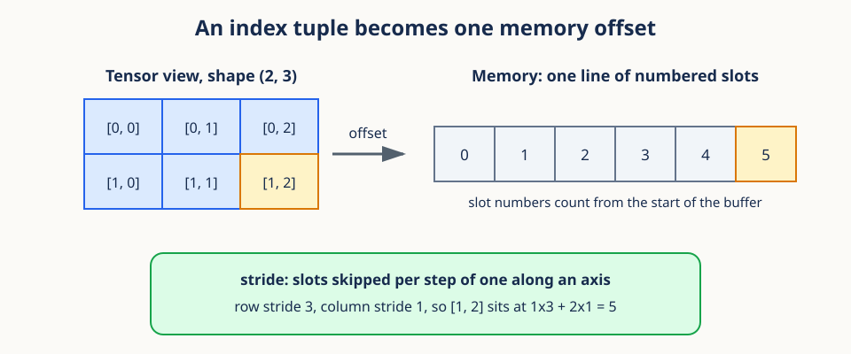
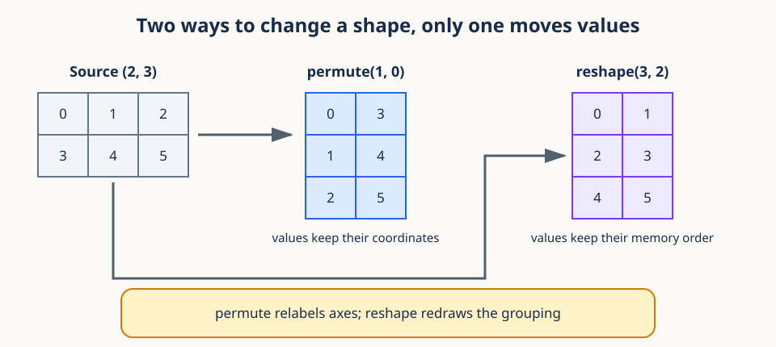
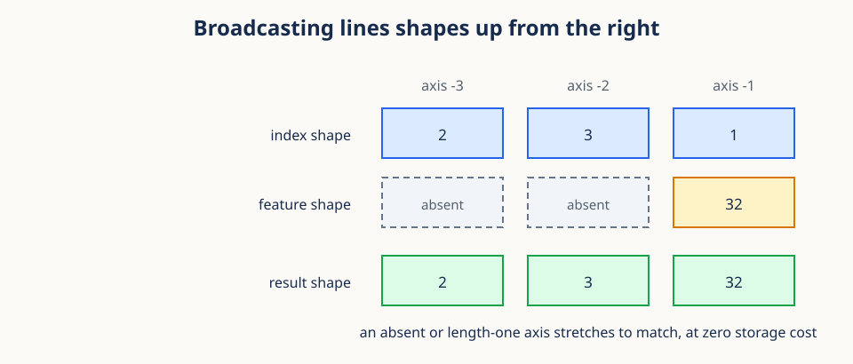

# 01. Spatiotemporal tensor geometry


## Begin with a concrete video

The claim of this lesson is simple: a video tensor is an address book, and almost every
shape bug is a mistake about addresses. Everything else here is detail in service of
that idea.

Imagine a wildlife camera records a two-second color clip at four frames per second.
Every frame is 6 pixels high and 8 pixels wide. One clip therefore contains eight
frames, every frame carries three color measurements at each pixel, and every color
plane holds $6\times8$ numbers. If we load five clips together, we have not created a
mysterious five-dimensional object. We have nested five familiar questions:

1. Which clip are we reading?
2. Which color channel are we reading?
3. Which moment in time are we reading?
4. Which row of the image are we reading?
5. Which column of the image are we reading?

Those five questions are the five axes of a video tensor. Answering all five gives one
number. Answering only some of them gives a smaller table. Tensor notation is useful
because it makes that nesting explicit and lets a computer apply one operation to many
clips, frames, and pixels at once.


The figure above reads left to right, from the outermost question to the innermost one.
A shape tells us how many valid choices each part of an address has. An index such as
`x[2, 0, 5, 3, 7]` is one complete address. A slice such as `x[2, :, 5]` leaves some
parts of the address open, so it returns a smaller table rather than a single number.

This address interpretation matters more than memorizing an axis convention. Different
libraries store video axes in different orders. If you can say out loud what each
coordinate means, you can translate between conventions without silently corrupting the
data. If you cannot, no amount of reshaping will save you.

## Prerequisites

You should be comfortable with Python indexing, NumPy arrays, and ordinary arithmetic.
No knowledge of video models is required.

## Learning goals

By the end of this lesson, you will be able to:

1. Read and reason about a five-dimensional video tensor.
2. Distinguish a tensor axis from a coordinate along that axis.
3. Explain how an index tuple becomes a single memory offset, and what a stride is.
4. Say precisely how `permute` and `reshape` differ.
5. Compute the output shape of a three-dimensional convolution.
6. Explain how tubelets turn local video blocks into tokens.
7. Convert between token grids and token sequences without changing data.
8. Select and restore tokens with gather and scatter operations.

## 1. A tensor is an indexed table

Start from what you already know. A scalar is one number. A vector is a
one-dimensional table of numbers. A matrix is a two-dimensional table. A tensor is the
same idea with any number of axes, and nothing new happens when the count grows past
three.

For video learning, a common layout is

$$
x \in \mathbb{R}^{B\times C\times T\times H\times W}.
$$

Read that line as "$x$ is a block of real numbers with five axes." The symbols mean:

- $B$: the number of independent video samples in the batch.
- $C$: channels per frame, often 3 for red, green, and blue.
- $T$: the number of time steps, that is, frames.
- $H$: frame height in pixels.
- $W$: frame width in pixels.

The expression $x[b,c,t,h,w]$ names one scalar: the value at sample $b$, channel $c$,
time $t$, row $h$, and column $w$. Each letter inside the brackets is one answer to one
of the five questions from the opening section.

Shape is metadata about how those coordinates are interpreted. Two tensors can hold the
same count of numbers and still describe very different objects. For the camera example,
a batch of five clips has shape `(5, 3, 8, 6, 8)`, and the number of stored measurements
is the product of the axis lengths:

$$
5\times3\times8\times6\times8=5{,}760.
$$

That product tells us storage size. It does not tell us meaning. A tensor of shape
`(5, 8, 6, 8, 3)` holds the same 5,760 values, yet the channel coordinate now sits last.
Shape is therefore both a counting device and a semantic contract, and only the second
role is at risk when you reshape carelessly.

**Conceptual checkpoint.** Three words are easy to blur together. An *axis* is a kind of
coordinate, such as time. An *index* is one choice on that axis, such as frame 5. The
*axis length* is the number of valid choices, such as 8 frames. Keeping the three apart
prevents most shape errors.

```python
import torch

x = torch.arange(2 * 3 * 4 * 6 * 8).reshape(2, 3, 4, 6, 8)
print(x.shape)          # torch.Size([2, 3, 4, 6, 8])
print(x[1, 2, 3, 5, 7])
```

## 2. From an index tuple to a memory offset

The previous section treated shape as an abstract contract. Hardware is less abstract.
Memory is one long line of slots numbered $0,1,2,\ldots$, so the library must convert
your five-part address into a single number. Understanding that conversion explains
almost everything about views, contiguity, and the cost of a reshape.



The conversion rule is a weighted sum. Each axis carries a **stride**, which is the
number of memory slots you skip when you add one to that axis and leave the others
alone. For a tensor with axes $(a_1,\ldots,a_k)$ and strides $(s_1,\ldots,s_k)$, the
offset of one element is

$$
\text{offset}=\sum_{j=1}^{k} a_j s_j .
$$

Here $j$ indexes the axes, $a_j$ is your chosen coordinate on axis $j$, and $s_j$ is
that axis's stride measured in elements. The sum is a plain dot product between the
address and the stride vector.

**Worked example.** Take a `(2, 3)` matrix stored row by row. Its strides are $(3, 1)$:
moving to the next row skips 3 slots because a row holds 3 numbers, and moving to the
next column skips 1 slot. Element `[1, 2]` therefore sits at offset $1\cdot3+2\cdot1=5$,
the last of the six slots. You can verify that by counting the slots in the figure.

Two facts follow, and both matter later. First, the stride of the last axis in a
standard layout is 1, so neighboring columns are neighbors in memory while neighboring
rows are far apart. Second, a library can change strides without touching a single
stored value. That is exactly what a **view** is: the same buffer read through a new
stride vector.

```python
a = torch.arange(6).reshape(2, 3)
print(a.stride())            # (3, 1)
print(a.t().stride())        # (1, 3): same storage, swapped strides
print(a.t().is_contiguous()) # False
```

A tensor is **contiguous** when its strides match the row-major pattern, meaning the
element order in memory is the same as the order you get by looping over the axes from
last to first. Transposing breaks that match, which is why some operations then demand a
copy. `contiguous()` makes that copy explicit.

## 3. Indexing, permute, and reshape

With strides in hand, the three operations you will use constantly stop being folklore.
Selecting one coordinate with an integer removes an axis. Selecting a range with a slice
keeps it. Both are stride tricks and neither moves data.

```python
frame = x[0, :, 2, :, :]          # (C, H, W)
one_frame_batch = x[0:1, :, 2:3]  # (1, C, 1, H, W)
clip = x[:, :, 1:3]               # (B, C, 2, H, W)
```

Read indexing from left to right against the five questions. In `x[0, :, 2, :, :]`, the
integer `0` answers the batch question and removes that axis. The colon keeps every
channel. The integer `2` answers the time question and removes that axis. The last two
colons keep height and width. What remains is one color frame of shape `(C, H, W)`.
Preserving singleton axes, as in `x[0:1, :, 2:3]`, is useful when a later layer insists
on a fixed rank. Negative indices count backward, so `x[:, :, -1]` selects the final
frame.

Axis order matters at every module boundary. PyTorch `Conv3d` expects `(B, C, T, H, W)`,
while many data pipelines produce `(B, T, H, W, C)`. Converting between them is a job
for `permute`, never for `reshape`.



The figure makes the difference concrete on a tiny example. `permute` keeps every value
attached to its original coordinate and only changes which axis is called first, second,
and so on. Under the hood it permutes the stride vector. `reshape` keeps the memory
order fixed and redraws the grouping boundaries, so values land under new coordinates.
The two operations agree only in trivial cases, and confusing them scrambles geometry
without raising an error.

```python
channels_last = torch.randn(2, 4, 6, 8, 3)
channels_first = channels_last.permute(0, 4, 1, 2, 3)
assert channels_first.shape == (2, 3, 4, 6, 8)
```

The numbers in `permute(0, 4, 1, 2, 3)` name old axes in their new order: the new axis 1
is the old axis 4. No axis is created or destroyed. By contrast, integer indexing can
destroy an axis and `unsqueeze` can create a length-one axis. These are three different
transformations, so give them three different names when you speak about your code.

A habit that pays for itself is a **shape ledger** written beside every layout-changing
line:

```text
input             (B, T, H, W, C)
permute            0  4  1  2  3
output            (B, C, T, H, W)
```

## 4. Batches enable parallel computation

The first four sections were about one clip's geometry. The batch axis is different in
kind: it does not describe video geometry at all. It collects examples so that the same
operation can run on all of them at once, and a convolution applies identical learned
weights to every batch member.

Given $x\in\mathbb{R}^{B\times C\times T\times H\times W}$ and a filter bank with output
width $D$, the result has shape

$$
y\in\mathbb{R}^{B\times D\times T'\times H'\times W'}.
$$

The batch size stays $B$ because no batch member is mixed with another. The input
channel axis $C$ is consumed by each filter and replaced by the output channel axis $D$.
The primed letters $T'$, $H'$, and $W'$ are the output lengths computed in the next
section.

Be careful with the phrase "independent video samples." It describes the intended
computation, not a statistical guarantee. The model applies the same filter to each
batch member without mixing their values. Whether two clips carry independent
information depends on how they were collected, which is the subject of Lesson 03.

The feature width $D$ is chosen by the model designer. It counts neither colors nor
frames. Each of the $D$ output coordinates is a learned response to a local video
pattern. Holding physical input axes and learned representation axes apart in your head
is worth the effort, because they obey different rules.

## 5. The output size of a 3D convolution

To use the shape $y\in\mathbb{R}^{B\times D\times T'\times H'\times W'}$ we need the
primed lengths. Each one comes from counting how many times a kernel fits along an axis.
For one axis of input length $L$, kernel size $K$, stride $S$, padding $P$, and dilation
$A$, the output length is

$$
L' = \left\lfloor\frac{L + 2P - A(K-1)-1}{S}+1\right\rfloor.
$$

Every symbol counts positions along the same axis. $L$ is the input length, $K$ is the
number of kernel taps, $A$ is the gap multiplier between taps, $P$ is the number of
padded positions added at each end, and $S$ is how far the kernel moves between
consecutive outputs. The result $L'$ is a count of valid kernel placements.

The formula is just that count written down. A dilated kernel spans $A(K-1)+1$ input
positions. Padding makes the effective input length $L+2P$. The first placement starts
at position zero, and each later placement moves by $S$. The floor appears because a
final partial placement is discarded unless padding made it fit. Apply the formula
independently to time, height, and width.

**Worked boundary case.** Let $L=7$, $K=3$, $S=2$, $P=0$, and $A=1$. The kernel can
start at positions 0, 2, and 4. A start at 6 would need positions 6, 7, and 8, and the
input stops at 6. The formula returns $L'=3$, matching the three placements you can
count by hand. Physical counting is the best way to check any shape formula.

For $T=8$, $H=W=16$, kernel $(2,4,4)$, stride $(2,4,4)$, and no padding:

$$
T'=4,\qquad H'=4,\qquad W'=4.
$$

There are $4\cdot4\cdot4=64$ output locations, and the next section explains what lives
at each one.

## 6. Tubelets are learned local summaries

Those 64 output locations are not pixels. Each holds a small learned summary of a block
of video called a **tubelet**: a box covering a few frames and a patch of each frame.
Setting the convolution kernel equal to its stride partitions the clip into
non-overlapping tubelets, and each filter computes a weighted sum of every channel and
voxel inside one of them.

Keep two temporal scales separate here, because they are easy to conflate. A **training
window** is the complete clip selected from a longer source sequence, such as 16
consecutive frames beginning at one temporal anchor. **Tubelets** are the small learned
blocks inside that selected clip. Overlap between two training windows is a statement
about data support. Overlap between tubelets is a statement about encoder computation.
Neither kind of overlap creates independent source videos.

For output feature $d$ at grid location $(i,j,k)$,

$$
y_{b,d,i,j,k}=b_d+\sum_c\sum_u\sum_v\sum_w
W_{d,c,u,v,w}\,x_{b,c,iS_t+u,jS_h+v,kS_w+w}.
$$

Read that as a recipe, not a proof. Fix one batch member $b$, one output feature $d$,
and one output location $(i,j,k)$. The kernel visits every input channel $c$ and every
offset $(u,v,w)$ inside the tubelet, multiplies each input by the matching learned
weight $W$, adds the products, and finally adds the bias $b_d$. The terms $iS_t$, $jS_h$,
and $kS_w$ are the tubelet's starting corner in the input, so stride is what slides the
box. Running the recipe for all $D$ features produces one $D$-dimensional vector, and
that vector is a **token**.

When kernel and stride are equal, neighboring tubelets do not overlap, which keeps the
token count easy to reason about. Overlap is not forbidden. A smaller stride makes
neighboring tokens summarize some of the same input measurements, trading extra
computation for denser local coverage.

The numbers inside a token have no physical units like pixels or seconds. They are
learned coordinates. The token's grid position does keep physical meaning, because it
corresponds to a definite temporal and spatial region of the source clip.

```python
embed = torch.nn.Conv3d(3, 32, kernel_size=(2, 4, 4), stride=(2, 4, 4))
x = torch.randn(2, 3, 8, 16, 16)
grid = embed(x)
assert grid.shape == (2, 32, 4, 4, 4)
```

## 7. Token grids and token sequences

The convolution hands us a grid, but attention layers want a list. That mismatch is
resolved by flattening, and the only thing you must protect while flattening is the
coordinate mapping.


The convolution returns `(B, D, T', H', W')`. Attention layers typically expect
`(B, N, D)` with $N=T'H'W'$, where $N$ is the sequence length.

```python
tokens = grid.flatten(2).transpose(1, 2)
assert tokens.shape == (2, 64, 32)
```

`flatten(2)` merges axis 2 through the last axis and gives `(B, D, N)`.
`transpose(1, 2)` moves the feature axis last. No arithmetic happens in either step.
Restoring the grid reverses the two moves:

```python
restored = tokens.transpose(1, 2).reshape(2, 32, 4, 4, 4)
assert torch.equal(restored, grid)
```

The flattening convention decides which location becomes token 0, token 1, and so on.
With ordinary row-major layout, width changes fastest, then height, then time:

$$
n = (tH' + h)W' + w.
$$

Notice the shape of that expression: it is the stride formula from Section 2 with
strides $H'W'$, $W'$, and 1. Flattening is a stride computation wearing a different hat.
The inverse mapping peels the address apart one scale at a time:

$$
t=\left\lfloor n/(H'W')\right\rfloor,\quad
r=n\bmod(H'W'),\quad h=\lfloor r/W'\rfloor,\quad w=r\bmod W'.
$$

Here $n$ is the sequence index. One time slice contains $H'W'$ tokens, so integer
division by $H'W'$ recovers the time coordinate $t$. The remainder $r$ locates the token
inside that slice. Dividing $r$ by the row width $W'$ recovers the height $h$, and the
final remainder gives the width $w$.

Flattening is reversible only if we remember the original grid dimensions and the axis
order. The feature values are never lost, but coordinate meaning can be lost from
metadata, which is why production systems carry the grid shape alongside the sequence.

**Conceptual checkpoint.** A token sequence is not inherently one-dimensional data. It
is often a one-dimensional storage view of a three-dimensional grid. Positional
encodings, covered in Lesson 04, are how a sequence model is told where each token came
from.

## 8. Gather selects; scatter restores

Masked prediction and sparse attention both need a subset of tokens, so the last
operation to master is selecting tokens by index and putting them back. Suppose `tokens`
has shape `(B, N, D)` and each batch member has $M$ selected token indices, where $M$ is
the number of tokens we want.

`torch.gather` requires an index tensor with the same rank as its input, so a `(B, M)`
index must first grow a feature axis. That growth is broadcasting, and broadcasting has
one rule worth seeing drawn.



Shapes are aligned from the right. Two axes are compatible when their lengths match or
when one of them is 1, and a length-one axis is stretched to the other length without
copying data. A stretched axis is simply an axis whose stride is set to zero, so the
same stored value is read many times.

```python
index = torch.tensor([[0, 5, 9], [2, 4, 7]])       # (B, M)
expanded = index.unsqueeze(-1).expand(-1, -1, tokens.shape[-1])
selected = torch.gather(tokens, dim=1, index=expanded)
assert selected.shape == (2, 3, 32)
```

`unsqueeze` inserts the feature axis, giving `(B, M, 1)`. `expand` stretches that
length-one axis to $D$ as a zero-copy view. Gather then pulls complete feature vectors.
Scatter is the matching placement operation when indices are unique:

```python
canvas = torch.zeros_like(tokens)
canvas.scatter_(1, expanded, selected)
assert torch.equal(canvas[0, 5], tokens[0, 5])
```

An everyday analogy helps. Gather is a library call slip listing shelf addresses of
books to bring to a desk. The returned stack is dense and ordered by the slip even
though the shelf locations were far apart. Scatter uses the saved addresses to put items
back on a larger shelf layout. The addresses, not the values, preserve correspondence.

Gather is not automatically invertible, and calling scatter its inverse is too generous.
If some source indices were never selected, their values cannot be recovered from the
selection. If an index appears twice, `scatter_` overwrites and the last write wins,
which is not a safe reduction. Use `scatter_add_` or `scatter_reduce_` when repeated
indices must combine.

## 9. Worked example

Everything above now runs on one input. Take shape `(4, 3, 12, 32, 24)` and a tubelet
convolution with 48 output features, kernel `(3, 8, 6)`, equal stride, and no padding.

1. Time has $12/3=4$ locations.
2. Height has $32/8=4$ locations.
3. Width has $24/6=4$ locations.
4. The grid shape is `(4, 48, 4, 4, 4)`.
5. The sequence length is $N=4\cdot4\cdot4=64$.
6. The token sequence has shape `(4, 64, 48)`.

Token index 27 maps to $t=1$, remainder 11, $h=2$, and $w=3$. Checking the forward
direction gives $(1\cdot4+2)\cdot4+3=27$, so the mapping round-trips.

Now follow that one tubelet into the pixels. Output coordinate $(1,2,3)$ begins at input
time $1\cdot3=3$, row $2\cdot8=16$, and column $3\cdot6=18$, and covers three frames,
eight rows, and six columns from that corner. This calculation is the bridge from an
abstract token index to an exact region of the source video.

If the input width were 25 rather than 24, equal kernel and stride would still produce
four complete width placements and would silently ignore one column. That may be an
acceptable crop or an unwanted data loss. Shape arithmetic exposes the choice before
training starts rather than after.

## 10. Efficiency notes

The shapes are settled, so the remaining question is cost. Most of these notes follow
directly from strides.

- Prefer vectorized indexing to Python loops over tokens.
- `flatten`, `reshape`, `transpose`, and `permute` often return views, but a later
  operation may require contiguous storage. Call `contiguous()` only when needed.
- `expand` gives a zero-copy broadcast view; `repeat` allocates the repeated data.
- `Conv3d` uses optimized kernels and beats manually extracting tubelets.
- Check `tensor.stride()` when storage layout affects performance or view legality.
- Keep shape assertions near layout transitions. They are cheap and catch subtle bugs.

## 11. Common failure modes

Each failure below is the address idea going wrong in a specific way.

1. **Wrong axis order:** a model reads time as channels. Name shapes at every boundary.
2. **Non-divisible dimensions:** equal kernel and stride can drop a remainder. Pad or
   choose compatible sizes deliberately.
3. **`view` after `permute`:** the tensor may be non-contiguous. Use `reshape` or
   `contiguous().view(...)`.
4. **Wrong gather rank:** expand indices across the feature axis first.
5. **Repeated scatter indices:** choose an explicit reduction instead of overwriting.
6. **Lost coordinate convention:** record the flatten order before making a sequence.

These share one root cause: treating shape as bookkeeping rather than meaning. A
reliable debugging question is, "What physical or learned quantity does coordinate three
on this axis represent?" If the answer is not immediate, write the shape ledger before
continuing.

## Exercises

### Exercise 1

Find the output shape for `(B,C,T,H,W)=(2,1,10,20,20)`, output width 16, kernel
`(2,5,5)`, equal stride, and no padding.

**Brief solution:** `(2,16,5,4,4)`, followed by sequence shape `(2,80,16)`.

### Exercise 2

For a grid with `(T',H',W')=(3,4,5)`, map token index 37 back to coordinates.

**Brief solution:** $t=1$, remainder 17, $h=3$, $w=2$.

### Exercise 3

Why is `x.reshape(B,T,H,W,C)` not a valid replacement for `x.permute(0,2,3,4,1)`?

**Brief solution:** reshape regroups storage without moving values, while permute
reorders coordinates. The resulting entries then describe different pixels and channels.

### Exercise 4

A tensor of shape `(3, 4)` is stored row-major. Give its strides and the memory offset
of element `[2, 1]`. Then give the strides after a transpose.

**Brief solution:** strides are $(4,1)$ and the offset is $2\cdot4+1\cdot1=9$. After a
transpose the shape is `(4, 3)` and the strides are $(1,4)$, with no data moved.

### Exercise 5

A tensor has shape `(2, 3, 9, 18, 18)`. A tubelet convolution uses kernel `(3, 6, 6)`,
stride `(3, 6, 6)`, no padding, and output width 24. Describe the physical region for
grid coordinate `(t,h,w)=(2,1,0)` and give its flattened sequence index.

**Brief solution:** the region begins at input frame 6, row 6, and column 0. The output
grid is `(3,3,3)`, so the sequence index is $(2\cdot3+1)\cdot3+0=21$.

## Recap

A video tensor makes five coordinate systems explicit, and a stride vector turns any
address into one memory offset. A 3D convolution summarizes local tubelets into a
feature grid. Flattening that grid produces a token sequence while preserving a precise
coordinate mapping. Gather and scatter select and restore tokens in batch, using
broadcasting to line the index shapes up.

Next we ask how to compare two of those token vectors, which turns out to be a question
about direction, magnitude, and finite arithmetic.

Next: [02. Inner-product geometry and numerical stability](02_inner_product_geometry.md).

## Continue in the notebook

Run the [spatiotemporal tensor geometry notebook](../implementations/01_spatiotemporal_tensor_geometry.ipynb) before moving to Lesson 02.
