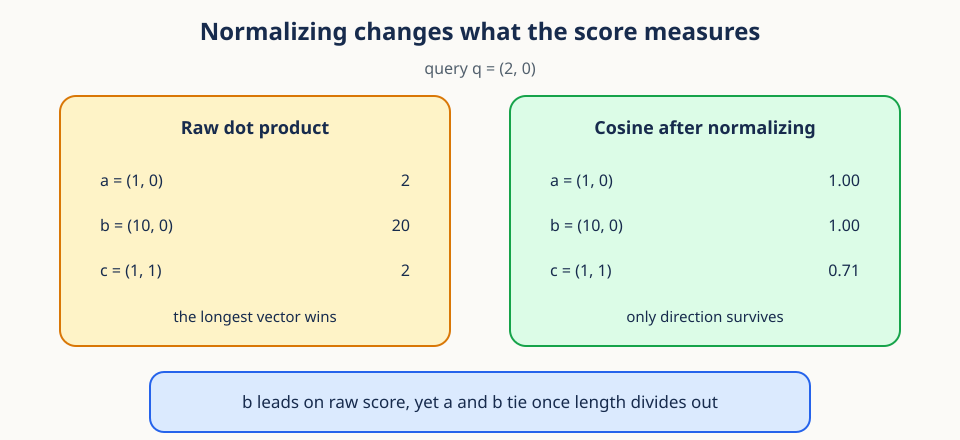
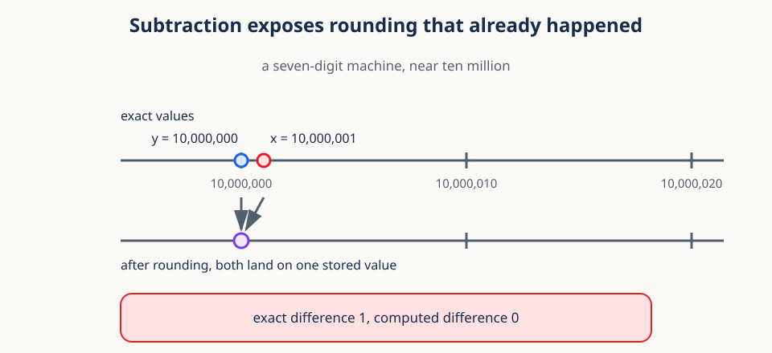
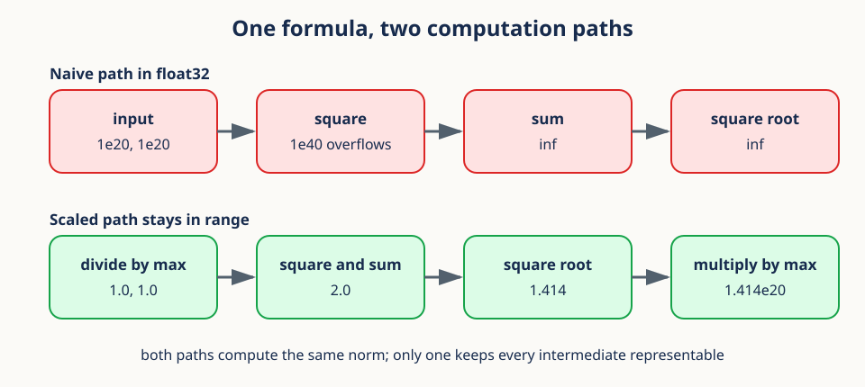

# 02. Inner-product geometry and numerical stability


## Begin with a retrieval problem

Lesson 01 gave every token a feature vector. This lesson answers the obvious next
question: given two of those vectors, how do we say how similar they are? The short
answer is that you must first decide whether length is part of similarity, and then you
must protect that decision from floating-point arithmetic.

Here is the concrete setting. A model converts every short video into a feature vector.
A user hands us one query clip and asks for clips with similar motion. The vector
coordinates are not human labels such as "walking" or "turning." They are learned
measurements. Even so, we need a principled way to compare them.

One tempting rule is to compare vectors coordinate by coordinate. That produces many
numbers and no single judgment. A second is Euclidean distance, which asks how far apart
the two endpoints are. A third is the dot product, which asks whether the coordinates
point in compatible directions. Each rule answers a different question, and choosing
among them means separating **magnitude** from **direction**.


A useful mental model is light and shadow. Lay vector $y$ along a line and shine vector
$x$ onto that line. The signed length of the shadow says how much of $x$ points along
$y$. A shadow in the forward direction is positive, a shadow in the backward direction
is negative, and no shadow means the vectors are perpendicular. The dot product scales
that projection by the length of $y$. Cosine similarity removes both lengths and keeps
only the directional agreement.

## Prerequisites

Complete [01. Spatiotemporal tensor geometry](01_spatiotemporal_tensor_geometry.md),
or be comfortable with array shapes, axes, and broadcasting.

## Learning goals

By the end of this lesson, you will be able to:

1. Interpret dot products, Euclidean norms, and cosine similarity geometrically.
2. Distinguish direction from magnitude in a feature vector.
3. Predict how normalizing before a comparison changes a ranking.
4. Pool token features while preserving the batch and feature axes.
5. Explain overflow, underflow, rounding, and catastrophic cancellation.
6. Rewrite an unstable computation path as a stable one.
7. Handle zero vectors with explicit epsilon and tolerance policies.

## 1. Vectors represent coordinates and features

Before comparing vectors we should agree on what one is. A vector $x\in\mathbb{R}^D$ is
an ordered list of $D$ real numbers, where $D$ is the feature width:

$$
x=(x_1,x_2,\ldots,x_D).
$$

The subscript $i$ in $x_i$ ranges over the $D$ coordinates, so $x_3$ is the third
measurement. A vector can describe a point, a displacement, or learned features. The
interpretation depends on context; the geometry below does not.

Order matters. The vector $(2,5)$ is not interchangeable with $(5,2)$ because the first
coordinate refers to a different feature than the second. Vectors may be added only when
their coordinates share meaning and units. Adding a two-dimensional location to a
two-dimensional velocity merely because the shapes match is numerically legal and
conceptually wrong.

We will move among three pictures of the same object. As an ordered list, a vector is
data in memory. As a point, its coordinates locate an endpoint relative to an origin. As
an arrow, it has a length and a direction. Linear algebra slides between these pictures,
and the stored numbers never change when it does.

One caution about learned features. Individual coordinates of a model's output may have
no stable human name. The vector as a whole can still carry structure, because similar
examples may occupy similar directions or nearby regions even when no single coordinate
means anything on its own.

## 2. The dot product measures alignment

The first comparison rule combines the two vectors coordinate by coordinate and adds the
results. For equal-length vectors,

$$
x^\top y = \sum_{i=1}^{D}x_i y_i.
$$

The summation sign compresses a simple repeated procedure: for every coordinate $i$,
multiply $x_i$ by $y_i$, then add all $D$ products. The index $i$ only pairs
corresponding features, and the result is one scalar. If both vectors carry physical
units, the dot product carries the product of those units.

Each coordinate contributes positively when the two signs agree and negatively when they
disagree. A large positive sum therefore suggests alignment, a negative sum suggests
opposing directions, and a zero sum means the vectors are orthogonal, provided neither
is the zero vector.

```python
import numpy as np

x = np.array([1.0, 2.0, -1.0])
y = np.array([2.0, 0.5, 1.0])
dot = np.dot(x, y)  # also x @ y
assert np.isclose(dot, 2.0)
```

The same quantity has a geometric form, which is where magnitude enters:

$$
x^\top y=\lVert x\rVert_2\,\lVert y\rVert_2\cos\theta,
$$

where $\lVert x\rVert_2$ is the length of $x$, defined in the next section, and $\theta$
is the angle between the two vectors.

This identity explains why a raw dot product is not a pure measure of direction. It
grows when the vectors align, when either vector gets longer, or both. If $x$ is doubled
while its direction stays fixed, $x^\top y$ doubles. Whether that is desirable depends
on whether magnitude carries meaningful confidence or merely reflects an arbitrary
representation scale.

**Worked example.** Let $x=(2,1)$ and $y=(3,4)$. The coordinate products are 6 and 4, so
$x^\top y=10$. Replace $x$ by $5x=(10,5)$ and the dot product becomes 50. Both versions
of $x$ point in exactly the same direction, yet the score calls the longer one five
times more aligned.

## 3. The Euclidean norm measures length

The previous section left $\lVert x\rVert_2$ undefined, so define it now. Length is the
dot product of a vector with itself, before the square root:

$$
\lVert x\rVert_2^2=x^\top x=\sum_i x_i^2.
$$

Taking the nonnegative square root gives the length itself:

$$
\lVert x\rVert_2=\sqrt{\sum_i x_i^2}.
$$

The subscript 2 names the Euclidean, or $L_2$, norm. It generalizes the Pythagorean
theorem: in two dimensions the vector $(3,4)$ is the diagonal of a right triangle with
legs 3 and 4, so its length is 5. In $D$ dimensions each squared coordinate contributes
to squared length in exactly the same way, and squaring guarantees that negative
coordinates add positive distance.

Two properties follow immediately and both get used below. Scaling a vector by a number
$a$ scales its norm by $|a|$. The norm is zero only for the all-zero vector, which is
what makes zero vectors a special case in Section 9. Other norms answer other questions,
for example the $L_1$ norm, which adds absolute coordinate magnitudes. This lesson uses
$L_2$ because it is the one tied to angles and dot products.

For a matrix or batched tensor, always name the feature axis explicitly, or you will
reduce the wrong one:

```python
batch = np.array([[3.0, 4.0], [5.0, 12.0]])
norms = np.linalg.norm(batch, axis=-1)
assert np.allclose(norms, [5.0, 13.0])
```

## 4. Cosine similarity removes magnitude

Now we can build the comparison that ignores length. Solve the geometric identity from
Section 2 for the cosine:

$$
\mathrm{cosine}(x,y)=\frac{x^\top y}{\lVert x\rVert_2\lVert y\rVert_2}.
$$

The numerator carries alignment and magnitude together. The denominator carries exactly
the same two magnitude factors. Dividing cancels length and leaves the cosine of the
angle, which is why positive rescaling cannot change the score. A negative rescaling
reverses direction and flips the sign. For nonzero real vectors the value lies in
$[-1,1]$: one means the same direction, zero means perpendicular, and minus one means
opposite.

That cancellation is not a formality. It changes which candidate a retrieval system
returns first.



Read the figure with the query $q=(2,0)$. The raw dot product gives $b=(10,0)$ a score
of 20, far ahead of $a=(1,0)$ and $c=(1,1)$, which both score 2. After normalizing, $a$
and $b$ tie at 1.00 because they point the same way, and $c$ drops to 0.71. Normalizing
is therefore not a cleanup step. It changes the question from "how much aligned signal
is there" to "how similar are the directions."

Cosine distance is often defined as

$$
d_{\cos}(x,y)=1-\mathrm{cosine}(x,y).
$$

It ranges from 0 to 2. Despite the name, this version does not satisfy every metric
axiom in general, and in particular the triangle inequality can fail.

In code, normalize first and then use a single matrix multiplication:

```python
X = np.array([[1.0, 0.0], [1.0, 1.0], [-1.0, 0.0]])
Xn = X / np.linalg.norm(X, axis=1, keepdims=True)
similarities = Xn @ Xn.T
assert similarities.shape == (3, 3)
```

Cosine similarity fits when direction should matter and scale should not. Text
embeddings are the standard example, because vector norm there often depends on
properties that are not the semantic signal. It fits poorly when magnitude is itself
meaningful, such as a physical displacement or a calibrated confidence vector.

**Conceptual checkpoint.** Dot product asks, "How much aligned signal is present?"
Cosine similarity asks, "How similar are the directions after ignoring scale?" Euclidean
distance asks, "How far apart are the endpoints?" The three can rank the same candidates
in three different orders.

## 5. Mean pooling summarizes token sets

So far we have compared two vectors. A clip from Lesson 01 is a whole set of token
vectors, so before comparing clips we must reduce that set to one vector. The simplest
reduction is an average over the token axis.

For a representation of shape `(B, N, D)`, with $B$ samples, $N$ tokens, and $D$
features,

$$
\bar{x}_{b,d}=\frac{1}{N}\sum_{n=1}^{N}x_{b,n,d}.
$$

The index $n$ ranges over tokens and is the only one being summed away, so the batch and
feature axes survive untouched.

```python
tokens = np.arange(2 * 4 * 3, dtype=np.float32).reshape(2, 4, 3)
pooled = tokens.mean(axis=1)
assert pooled.shape == (2, 3)
```

Mean pooling is the center of mass of the token vectors when every token has equal mass.
It answers, "What is the average feature response across this sample?" It does not
preserve which token produced a response or the order in which responses occurred.
Consider three scalar token features `[1, 2, 9]`. Their mean is 4, and `[9, 2, 1]` gives
the same 4, so pooling is invariant to token order. That is a virtue when only global
content matters and a serious loss when temporal arrangement matters.

Pooling is also linear, which is occasionally useful: pooling and then applying a linear
projection gives the same result as projecting every token and then pooling, provided
there is no bias mismatch or nonlinearity in between.

A plain mean weights every token equally, including padding. For padded sequences use a
masked mean:

$$
\bar{x}_b=\frac{\sum_n m_{b,n}x_{b,n}}{\sum_n m_{b,n}},\qquad m_{b,n}\in\{0,1\}.
$$

Here $m_{b,n}$ is 1 for a valid token in sample $b$ and 0 for padding. The numerator adds
the valid feature vectors and the denominator counts them. Dividing by the fixed length
$N$ instead would shrink shorter sequences artificially, which is why the validity count
belongs in the denominator. When every token is masked the denominator is zero, and that
case needs a stated policy rather than a silent clamp.

## 6. Floating-point numbers are finite approximations

Every formula so far assumed exact real arithmetic. Real hardware stores a finite set of
values, and the rest of this lesson is about the difference. The good news is that the
failures are systematic and predictable.


IEEE floating-point formats encode a sign, a significand, and an exponent. `float32`
uses less memory and is usually faster than `float64`, but it carries about seven
decimal digits of precision rather than about sixteen.

The mental model is scientific notation with a fixed number of significant digits. The
exponent moves the scale and the significand records detail at that scale. As magnitude
grows, adjacent representable numbers grow farther apart. That is why adding a very
small number to a very large one can have no stored effect even though the exact
real-number sum did change.

Two words are easy to swap by mistake. **Precision** is how finely nearby values can be
distinguished. **Range** is the smallest and largest magnitudes available. They are
related but not the same: `float32` can hold a huge finite value while being unable to
record a tiny change added to it.

Three effects follow, and all three appear in practice:

1. **Rounding:** most exact results are stored as a nearby representable number.
2. **Overflow:** a result larger than the maximum finite value becomes infinity.
3. **Underflow:** a tiny result becomes subnormal or zero.

Higher precision is not a substitute for sound algebra. Promoting to `float64` moves the
failure threshold outward; it does not remove it. Stable formulations, an appropriate
accumulation dtype, and finite-value checks work together, and the next two sections take
the two most common failures in turn.

## 7. Cancellation loses digits you already lost

Rounding is usually harmless because the error stays small relative to the value. Cancellation
is dangerous precisely because it makes a small relative error into a large one. Subtracting
two nearly equal large numbers deletes the leading digits they share and promotes the
rounding error underneath into the leading position.



Work through the figure on a decimal machine that keeps seven significant digits. The
exact values $10{,}000{,}001$ and $10{,}000{,}000$ differ by 1. Near ten million the
representable values are spaced 10 apart, so both inputs round to the same stored value,
and the computed difference is 0 rather than 1. Subtraction did not create the error. It
removed the seven reliable digits that were hiding it.

This is why algebraically equal formulas are not numerically equal. The two expressions

$$
\sum_i(x_i-\bar{x})^2
\quad\text{and}\quad
\sum_i x_i^2-n\bar{x}^2
$$

give the same answer in exact arithmetic, where $\bar{x}$ is the mean of the $n$ values.
The second form subtracts two large and nearly equal quantities, so it can lose most of
its significant digits. Stable variance algorithms center the data first or update
running moments carefully.

Long reductions have a related problem. Adding a million small contributions in a
different order changes which low-order bits survive. Parallel hardware often uses
tree-shaped reductions, so CPU and GPU results can differ slightly without either being
wrong. Do not expect bitwise equality across implementations, and test numerical results
with justified tolerances instead.

## 8. Stable and naive paths to the same number

Cancellation showed that the order of operations matters. Overflow shows that the scale
of intermediate values matters just as much. A norm is the cleanest example, because a
vector can be comfortably finite while its squared coordinates are not.



Take `x = [1e20, 1e20]` in `float32`. Squaring gives $10^{40}$, which exceeds the largest
finite `float32` value, so the sum becomes infinity and the square root stays infinity.
The true norm is about $1.41\times10^{20}$, which `float32` can represent without trouble.
The formula was never the problem; the intermediate values were.

The scaled path fixes it with algebra rather than with a wider dtype. Divide by the
largest absolute coordinate, compute a norm near 1, then multiply the maximum back in:

$$
\lVert x\rVert_2=m\sqrt{\sum_i (x_i/m)^2},\qquad m=\max_i |x_i| .
$$

Here $m$ is the largest absolute coordinate. Every ratio $x_i/m$ lies in $[-1,1]$, so no
square can overflow, and the final multiplication restores the true scale. The result is
identical in exact arithmetic and dramatically different on hardware.

```python
large = np.array([1e20, 1e20], dtype=np.float32)
naive_square_sum = np.sum(large * large)  # overflows to inf
stable_norm = np.linalg.norm(large)       # implementation may scale internally
```

Library norm routines often apply this or a similar trick, but the exact behavior depends
on backend and dtype, so verify rather than assume. Converting critical reductions to
`float64` buys more range and precision and composes well with a stable formulation.

## 9. Zero norms require a semantic policy

Section 3 noted that only the zero vector has norm zero. That single case breaks cosine
similarity, because its denominator becomes zero. A common implementation clamps the
norm from below:

```python
def stable_normalize(x, eps=1e-8):
    norm = np.linalg.norm(x, axis=-1, keepdims=True)
    return x / np.maximum(norm, eps)
```

This avoids division by zero without making the angle well defined. The difficulty is
conceptual, not numerical. Direction is the ray from the origin through a nonzero
endpoint, and the zero vector has no ray, so it has no angle. Clamping picks a finite
output so the software can continue; it does not conjure a missing direction. Under this
convention the zero vector normalizes to zero and scores zero against everything, which
is a decision that belongs in your documentation.

Three policies are defensible, and the right one depends on what a zero representation
means in your application. Reject zero vectors when they signal corrupt data. Mark their
similarities as missing when downstream analysis handles missingness. Or map them to zero
similarity as an explicit convention.

In PyTorch, `torch.nn.functional.normalize(x, dim=-1, eps=1e-12)` implements the clamped
pattern. Choose `eps` for the dtype and the data scale: `1e-12` is meaningful in
`float32`, while much smaller values can round away, and mixed-precision formats usually
need a larger safeguard.

An epsilon also creates a transition region worth naming. Vectors whose norm falls below
`eps` are divided by `eps` rather than by their true norm, so their normalized length
comes out below one. That suppresses wildly unstable directions from nearly zero vectors,
and it also means the computed value is no longer exactly the cosine formula. Record the
threshold whenever results depend on it.

## 10. Tolerances describe acceptable numerical error

Given that exact equality is unavailable, tests need a definition of "close enough." The
standard rule combines an absolute and a relative allowance:

$$
|a-b|\leq \text{atol}+\text{rtol}|b|.
$$

Here $a$ is the computed value, $b$ is the reference, `atol` is a fixed allowance that
handles values near zero, and `rtol` is an allowance that scales with the reference
magnitude. For a reference near one million, a relative tolerance is far more meaningful
than an absolute tolerance of $10^{-8}$. For a reference near zero, relative error can
explode or become undefined, so the absolute term sets a small neighborhood instead. The
combined rule covers both regimes.

```python
assert np.allclose(0.1 + 0.2, 0.3, rtol=1e-7, atol=1e-9)
```

Avoid one universal tolerance. Base it on the dtype, the number of accumulated
operations, and the decision the result supports. `torch.testing.assert_close` gives
dtype-aware defaults and informative diagnostics.

A tolerance must not hide an algorithmic failure. A difference of 0.1 is negligible for a
billion-scale physical measurement and decisive for a probability compared against 0.5. A
good test states the scale and the consequence, not just the number.

## 11. Worked example

The pieces now combine on numbers you can check mentally. Let $x=(3,4)$ and $y=(-4,3)$.

1. $x^\top y=3(-4)+4(3)=0$.
2. $\lVert x\rVert_2=5$ and $\lVert y\rVert_2=5$.
3. Cosine similarity is $0/(5\cdot5)=0$.
4. The vectors are perpendicular.
5. Scaling $y$ to $100y$ changes its norm and leaves cosine similarity at zero.

Now let $z=2x=(6,8)$. Then $x^\top z=50$, the denominator is $5\cdot10=50$, and the
cosine similarity is 1. The vectors differ in magnitude and share a direction.

Compare $x$ with $w=(30,40)$. Their Euclidean distance is large because $w$ sits far from
$x$, yet their cosine similarity is 1 because they point the same way. A retrieval system
using cosine calls them maximally similar and one using Euclidean distance does not.
Neither is wrong; they encode different notions of similarity, exactly as in Section 4.

Finally, let a token set contain $(1,0)$, $(0,1)$, and $(1,1)$. Its mean-pooled vector is
$(2/3,2/3)$, pointing along the diagonal. Pooling reports balanced average evidence for
both features. It does not reveal that one token carried both features while the other
two carried them separately.

## 12. Efficient PyTorch implementation

The mathematics is settled, so the last question is how to compute many similarities at
once without wasting memory.

```python
import torch
import torch.nn.functional as F

X = torch.randn(256, 128)
Xn = F.normalize(X, dim=-1, eps=1e-8)
pairwise = Xn @ Xn.T
assert torch.isfinite(pairwise).all()
```

`F.cosine_similarity(a, b, dim=-1)` is convenient for aligned pairs. For all pairs,
normalizing once and then using `@` is clearer and usually faster. Avoid building an
`(M, N, D)` broadcast difference tensor when a matrix product suffices.

The matrix product performs $MN$ dot products for $M$ queries and $N$ candidates, and its
output still needs $MN$ storage. For a very large collection, score candidates in blocks
or use an indexed nearest-neighbor system rather than materializing the whole matrix.

Normalize reusable candidates once. Recomputing their norms for every query is pure
waste. Keep accumulation in `float32` or `float64` even when features are stored in a
lower-precision format, then measure whether the cast changes any retrieval decision.

## 13. Common failure modes

Most bugs in this area are one of the following six.

1. **Reducing the wrong axis:** name `axis=-1` or `dim=-1` for feature norms.
2. **Comparing raw dot products:** magnitude can drown the direction signal.
3. **Dividing by zero:** define and test a zero-vector policy.
4. **Blind `float16` reductions:** accumulate norms and means in `float32`.
5. **Exact equality tests:** use meaningful absolute and relative tolerances.
6. **Ignoring nonfinite values:** check with `np.isfinite` or `torch.isfinite`.

A subtler seventh failure is reading a high cosine value as proof of semantic identity.
Cosine reports geometry in the chosen representation. Whether that geometry tracks the
concept you care about is an empirical question, and answering it needs labels, controls,
or direct retrieval inspection.

## Exercises

### Exercise 1

Compute the cosine similarity between $(1,2,2)$ and $(2,0,1)$.

**Brief solution:** dot product $4$, norms $3$ and $\sqrt{5}$, so the result is
$4/(3\sqrt{5})\approx0.596$.

### Exercise 2

Why does multiplying both vectors by positive constants leave cosine similarity unchanged?

**Brief solution:** the numerator and denominator gain the same product of scale factors,
which cancels.

### Exercise 3

Write a masked mean for `x` shaped `(B,N,D)` and Boolean `mask` shaped `(B,N)`.

**Brief solution:** multiply by `mask[..., None]`, sum over axis 1, and divide by
`mask.sum(1, keepdims=True).clip(min=1)`. Separately flag rows with no valid tokens.

### Exercise 4

Vectors $a=(1,0)$, $b=(10,0)$, and $c=(1,1)$ are candidates for query $q=(2,0)$.
Rank them by cosine similarity and then by Euclidean distance.

**Brief solution:** $a$ and $b$ tie at cosine 1, followed by $c$ at $1/\sqrt{2}$.
Euclidean distances are 1, 8, and $\sqrt{2}$, so the order is $a,c,b$.

### Exercise 5

Why can computing `sqrt(sum(x*x))` overflow when `x` itself is finite? Describe one
stable strategy without writing code.

**Brief solution:** the squared intermediates need more range than the final norm. Divide
by the largest absolute coordinate first, compute the scaled norm, then multiply that
maximum back in.

## Recap

Dot products combine magnitude and alignment. Norms measure magnitude. Cosine similarity
divides magnitude away so that only direction remains, and that choice can reorder a
result list. These formulas then run on finite hardware, so stable computation paths,
explicit epsilon policies, finite-value checks, and justified tolerances are part of the
mathematics rather than an afterthought.

We now have a way to compare representations. Lesson 03 asks a different question about
the same numbers: when several of them come from the same person or session, how much
independent evidence do we actually have?

Next: [03. Hierarchical observations and sampling](03_hierarchical_observations.md).

## Continue in the notebook

Run the [inner-product geometry notebook](../implementations/02_inner_product_geometry.ipynb) before moving to Lesson 03.
