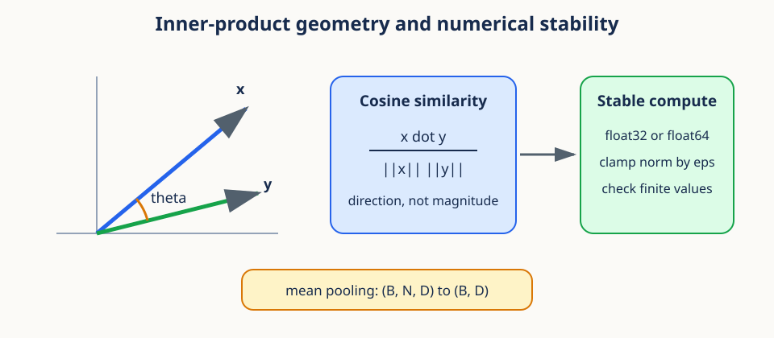
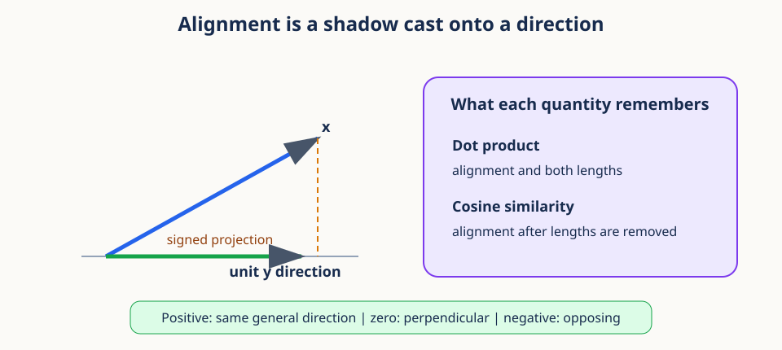
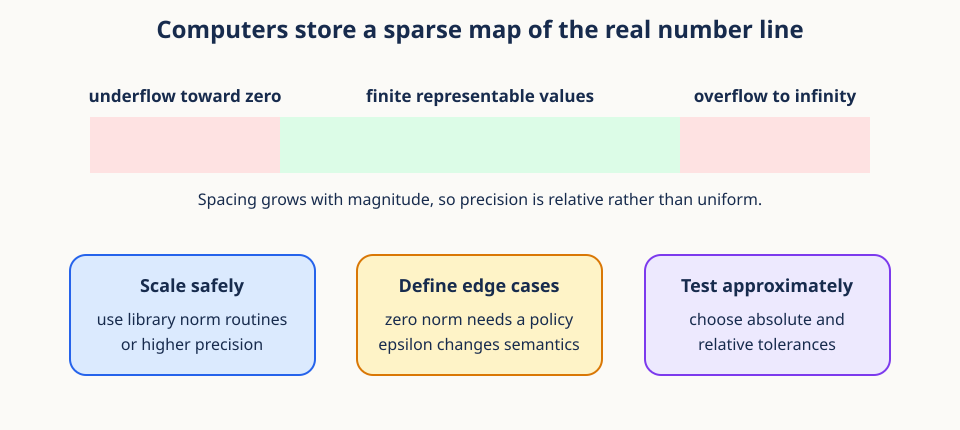

# 02. Inner-product geometry and numerical stability



## Begin with a retrieval problem

Suppose a model converts every short video into a feature vector. A user gives us one
query clip, and we want to retrieve clips with similar motion. The vector coordinates
are not human labels such as "walking" or "turning." They are learned measurements.
Even so, we need a principled way to compare them.

One tempting rule is to compare vectors coordinate by coordinate. That produces many
numbers but not one overall judgment. Another is Euclidean distance, which asks how far
apart two endpoints are. A third is the dot product, which asks whether the coordinates
point in compatible directions. Each rule answers a different question, and choosing
among them requires separating **magnitude** from **direction**.



A useful mental model is light and shadow. Place vector $y$ along a line and shine
vector $x$ onto that line. The signed length of the shadow tells us how much of $x$
points along $y$. A shadow in the forward direction is positive, a shadow in the
backward direction is negative, and no shadow means the vectors are perpendicular.
The dot product scales this projection by the length of $y$. Cosine similarity removes
both lengths and keeps only directional agreement.

## Prerequisites

Complete [01. Spatiotemporal tensor geometry](01_spatiotemporal_tensor_geometry.md),
or be comfortable with array shapes, axes, and broadcasting.

## Learning goals

By the end of this lesson, you will be able to:

1. Interpret dot products, Euclidean norms, and cosine similarity geometrically.
2. Distinguish direction from magnitude in a feature vector.
3. Pool token features while preserving the batch and feature axes.
4. Explain overflow, underflow, rounding, and catastrophic cancellation.
5. Handle zero vectors with explicit epsilon and tolerance policies.
6. Implement stable pairwise similarities efficiently.

## 1. Vectors represent coordinates and features

A vector $x\in\mathbb{R}^D$ is an ordered list of $D$ real numbers:

$$
x=(x_1,x_2,\ldots,x_D).
$$

It can describe a point, a displacement, or learned features. The interpretation
depends on context, but the geometry below is the same.

The order of coordinates matters. The vector $(2,5)$ is not interchangeable with
$(5,2)$ because the first coordinate refers to a different feature than the second.
Vectors may be added only when their coordinates share meaning and units. Adding a
two-dimensional location to a two-dimensional velocity merely because the shapes match
would be numerically legal and conceptually wrong.

We use three related pictures of a vector. As an ordered list, it is data stored in
memory. As a point, its coordinates locate an endpoint relative to an origin. As an
arrow, it has a length and a direction. Linear algebra moves among these pictures, but
the underlying numbers do not change.

For a learned feature vector, individual coordinates may not have stable human names.
The vector as a whole can still carry structure. Similar examples may occupy similar
directions or nearby regions even when no single coordinate is interpretable alone.

## 2. The dot product measures alignment

The dot product of equal-length vectors is

$$
x^\top y = \sum_{i=1}^{D}x_i y_i.
$$

Each coordinate contributes positively when the signs agree and negatively when they
disagree. A large positive sum suggests alignment. A negative sum suggests opposing
directions. A zero sum means orthogonality when neither vector is zero.

The summation sign compresses a simple repeated procedure. For every coordinate $i$,
multiply $x_i$ by $y_i$, then add all $D$ products. The index $i$ only pairs
corresponding features. The result is one scalar. If both coordinates have physical
units, the dot product has the product of those units.

```python
import numpy as np

x = np.array([1.0, 2.0, -1.0])
y = np.array([2.0, 0.5, 1.0])
dot = np.dot(x, y)  # also x @ y
assert np.isclose(dot, 2.0)
```

The dot product also has a geometric form:

$$
x^\top y=\lVert x\rVert_2\,\lVert y\rVert_2\cos\theta,
$$

where $\theta$ is the angle between the vectors.

This identity explains why a raw dot product is not a pure similarity of direction.
It becomes large when the vectors align, when either vector becomes long, or both. If
$x$ is doubled while its direction stays fixed, $x^\top y$ doubles. Whether that is
desirable depends on whether magnitude carries meaningful confidence or merely reflects
an arbitrary representation scale.

**Worked example.** Let $x=(2,1)$ and $y=(3,4)$. Their coordinate products are 6 and
4, so $x^\top y=10$. If we replace $x$ by $5x=(10,5)$, the dot product becomes 50.
The two versions of $x$ point in exactly the same direction, but the dot product treats
the longer one as more strongly aligned.

## 3. The Euclidean norm measures length

The squared Euclidean norm is a vector's dot product with itself:

$$
\lVert x\rVert_2^2=x^\top x=\sum_i x_i^2.
$$

Taking the nonnegative square root gives

$$
\lVert x\rVert_2=\sqrt{\sum_i x_i^2}.
$$

Scaling a vector by $a$ scales its norm by $|a|$. The norm is zero only for the all-zero
vector. `np.linalg.norm(x)` and `torch.linalg.vector_norm(x)` implement this operation.

The norm generalizes the Pythagorean theorem. In two dimensions, a vector $(3,4)$ is
the diagonal of a right triangle with side lengths 3 and 4, so its length is 5. In
$D$ dimensions, each squared coordinate contributes to squared length in exactly the
same way. Squaring also ensures negative coordinates contribute positive distance.

The subscript 2 names the Euclidean or $L_2$ norm. Other norms answer other questions.
For example, the $L_1$ norm adds absolute coordinate magnitudes. This lesson uses the
$L_2$ norm because it is linked directly to angles and dot products.

For a matrix or batched tensor, always specify the feature axis:

```python
batch = np.array([[3.0, 4.0], [5.0, 12.0]])
norms = np.linalg.norm(batch, axis=-1)
assert np.allclose(norms, [5.0, 13.0])
```

## 4. Cosine similarity removes magnitude

Rearranging the geometric dot-product identity gives

$$
\mathrm{cosine}(x,y)=\frac{x^\top y}{\lVert x\rVert_2\lVert y\rVert_2}.
$$

For nonzero real vectors, cosine similarity lies in $[-1,1]$. A value of 1 means the
same direction, 0 means perpendicular directions, and -1 means opposite directions.

The numerator contains alignment and magnitude. The denominator contains exactly the
same two magnitude factors. Dividing cancels length, leaving the cosine of the angle.
This cancellation is why positive rescaling does not change cosine similarity. A
negative rescaling reverses direction and changes the sign.

Cosine distance is often defined as

$$
d_{\cos}(x,y)=1-\mathrm{cosine}(x,y).
$$

It ranges from 0 to 2. Despite its name, this version does not satisfy every metric
axiom in general. In particular, the triangle inequality can fail.

Normalize first, then use a matrix multiplication:

```python
X = np.array([[1.0, 0.0], [1.0, 1.0], [-1.0, 0.0]])
Xn = X / np.linalg.norm(X, axis=1, keepdims=True)
similarities = Xn @ Xn.T
assert similarities.shape == (3, 3)
```

This vectorized form computes all pairwise dot products using optimized linear algebra.

Cosine similarity is appropriate when direction should matter but scale should not.
Text embeddings are a common example because vector norm can depend on properties that
are not the desired semantic signal. It is less appropriate when magnitude is itself
meaningful, such as a physical displacement or a calibrated confidence vector.

**Conceptual checkpoint.** Dot product asks, "How much aligned signal is present?"
Cosine similarity asks, "How similar are the directions after ignoring scale?"
Euclidean distance asks, "How far apart are the endpoints?" These questions can rank
the same candidates differently.

## 5. Mean pooling summarizes token sets

A representation often has shape `(B, N, D)`: batches, tokens, and features. Mean
pooling averages the token axis:

$$
\bar{x}_{b,d}=\frac{1}{N}\sum_{n=1}^{N}x_{b,n,d}.
$$

```python
tokens = np.arange(2 * 4 * 3, dtype=np.float32).reshape(2, 4, 3)
pooled = tokens.mean(axis=1)
assert pooled.shape == (2, 3)
```

Pooling is linear: pooling before a linear projection gives the same result as applying
the projection to every token and then pooling, provided there is no bias mismatch or
nonlinear operation in between.

Mean pooling can be understood as the center of mass of token vectors when every token
has equal mass. It keeps the feature axis and removes the token axis. The result answers,
"What is the average feature response across this sample?" It does not preserve which
token produced a response or the order in which responses occurred.

Consider three scalar token features `[1, 2, 9]`. Their mean is 4. The same mean is
obtained from `[9, 2, 1]`, so pooling is invariant to token order. This can be a virtue
when only global content matters and a serious loss when temporal arrangement matters.

A plain mean weights every token equally. For padded sequences, use a masked mean:

$$
\bar{x}_b=\frac{\sum_n m_{b,n}x_{b,n}}{\sum_n m_{b,n}},\qquad m_{b,n}\in\{0,1\}.
$$

The denominator needs a policy when every token is masked.

In the masked formula, $m_{b,n}$ is one for a valid token and zero for padding. The
numerator adds valid feature vectors. The denominator counts them. Dividing by the
fixed sequence length $N$ would make shorter valid sequences appear artificially small,
which is why the validity count belongs in the denominator.

## 6. Floating-point numbers are finite approximations



Computers cannot store every real number. IEEE floating-point formats use a sign,
significand, and exponent. `float32` uses less memory and is usually faster than
`float64`, but it has about seven decimal digits of precision rather than about sixteen.

Floating point resembles scientific notation with a fixed number of significant
digits. The exponent moves the scale, while the significand records detail at that
scale. As magnitude grows, adjacent representable numbers grow farther apart. This is
why adding a very small number to a very large number can have no stored effect even
though the exact real-number sum changed.

The word **precision** describes how finely values can be distinguished. The word
**range** describes the smallest and largest magnitudes available. They are related but
not identical. `float32` may represent a huge finite value while being unable to preserve
a tiny change added to it.

Three important effects follow:

1. **Rounding:** most real results are stored as a nearby representable number.
2. **Overflow:** a result larger than the maximum finite value becomes infinity.
3. **Underflow:** a tiny result may become subnormal or zero.

```python
large = np.array([1e20, 1e20], dtype=np.float32)
naive_square_sum = np.sum(large * large)  # overflows to inf
stable_norm = np.linalg.norm(large)        # implementation may scale internally
```

Computing a norm as `sqrt(sum(x*x))` can overflow even when the final norm is finite.
Library norm routines can use more stable algorithms, but behavior depends on backend
and dtype. Converting critical reductions to `float64` provides more range and precision.

For example, squaring $10^{20}$ produces $10^{40}$, beyond finite `float32`, although
the original vector and its norm can both fit. A scaled norm algorithm first divides by
the largest magnitude, computes a norm near one, and scales back afterward. Algebraically
the result is unchanged, but the intermediate values stay inside the representable range.

Using higher precision is not a substitute for sound algebra. It moves the failure
threshold but does not remove it. Stable formulations, appropriate accumulation dtype,
and finite-value checks work together.

## 7. Cancellation and reduction error

Subtracting nearly equal large numbers loses leading significant digits. This is
catastrophic cancellation. Long sums also accumulate rounding error, and parallel
reductions can change the addition order.

The algebraically equivalent forms

$$
\sum_i(x_i-\bar{x})^2
\quad\text{and}\quad
\sum_i x_i^2-n\bar{x}^2
$$

do not have equal numerical stability. The second can subtract two large, nearly equal
numbers. Stable variance algorithms center the data or update moments carefully.

Do not expect bitwise equality for floating-point expressions evaluated in different
orders. Test numerical results with justified tolerances.

Imagine a seven-digit decimal machine storing $10{,}000{,}001$ and $10{,}000{,}000$.
If each is rounded to seven significant digits first, both may become $10{,}000{,}000$,
and their computed difference is zero rather than one. Subtraction did not create the
initial rounding error, but it exposed it by canceling the reliable leading digits.

Long reductions have a related problem. Adding a million small contributions in a
different order can change which low-order bits survive. Parallel hardware often uses
tree-shaped reductions, so CPU and GPU results can differ slightly without either being
mathematically wrong. Reproducible reasoning therefore distinguishes exact symbolic
identities from finite implementations.

## 8. Zero norms require a semantic policy

Cosine similarity is mathematically undefined when either vector is zero. A common
implementation clamps the norm:

```python
def stable_normalize(x, eps=1e-8):
    norm = np.linalg.norm(x, axis=-1, keepdims=True)
    return x / np.maximum(norm, eps)
```

This avoids division by zero, but it does not make the original angle well-defined.
The zero vector normalizes to zero, so its dot product with every normalized vector is
zero. That is an implementation convention and should be documented.

The difficulty is conceptual, not merely numerical. Direction is the ray from the
origin through a nonzero endpoint. The zero vector has no ray, so it has no angle.
Clamping the denominator chooses a finite output for software continuity; it does not
prove that the missing direction exists.

Three defensible policies are common. Reject zero vectors when they indicate corrupt
data. Mark their similarities as missing when downstream analysis can handle missingness.
Or map them to zero similarity as an explicit convention. The correct choice depends
on what a zero representation means in the application.

In PyTorch, `torch.nn.functional.normalize(x, dim=-1, eps=1e-12)` performs this pattern.
Choose `eps` for the dtype and data scale. `1e-12` is meaningful in `float32`, but much
smaller values may round away in some computations. Mixed-precision formats usually
need larger safeguards.

An epsilon also creates a transition region. Vectors with norm below `eps` are divided
by `eps` rather than their true norm, so their normalized length is below one. This
suppresses unstable directions from extremely small vectors, but it also changes the
exact cosine formula. Record the threshold when results depend on it.

## 9. Tolerances describe acceptable numerical error

An approximate comparison typically checks

$$
|a-b|\leq \text{atol}+\text{rtol}|b|.
$$

`atol` handles values near zero. `rtol` scales with the reference magnitude.

For a reference value near one million, a relative tolerance is usually more meaningful
than an absolute tolerance of $10^{-8}$. For a reference value near zero, relative error
can explode or become undefined, so absolute tolerance sets a small neighborhood around
zero. The combined rule handles both regimes.

```python
assert np.allclose(0.1 + 0.2, 0.3, rtol=1e-7, atol=1e-9)
```

Avoid a single universal tolerance. Base it on dtype, number of accumulated operations,
and the decision the result supports. `torch.testing.assert_close` provides informative
diagnostics and dtype-aware defaults.

Tolerance should not hide an algorithmic failure. A difference of 0.1 may be negligible
for a billion-scale physical measurement and decisive for a probability threshold at
0.5. A good test explains the scale and consequence of its tolerance.

## 10. Worked example

Let $x=(3,4)$ and $y=(-4,3)$.

1. $x^\top y=3(-4)+4(3)=0$.
2. $\|x\|_2=5$ and $\|y\|_2=5$.
3. Cosine similarity is $0/(5\cdot5)=0$.
4. The vectors are perpendicular.
5. Scaling $y$ to $100y$ changes its norm but keeps cosine similarity at zero.

Now let $z=2x=(6,8)$. Then $x^\top z=50$, the denominator is $5\cdot10=50$, and
the cosine similarity is 1. The vectors differ in magnitude but share a direction.

Now compare $x$ with $w=(30,40)$. Their Euclidean distance is large because $w$ is far
from $x$, yet their cosine similarity is 1 because they share a direction. A nearest
neighbor system using cosine would call them maximally directionally similar; a system
using Euclidean distance would not call them close. Neither conclusion is contradictory.
The metrics encode different notions of similarity.

Finally, let a token set contain $(1,0)$, $(0,1)$, and $(1,1)$. Its mean-pooled vector
is $(2/3,2/3)$, which points along the diagonal. Pooling says the sample has balanced
average evidence for both features. It does not reveal that one token carried both
features while the others carried them separately.

## 11. Efficient PyTorch implementation

```python
import torch
import torch.nn.functional as F

X = torch.randn(256, 128)
Xn = F.normalize(X, dim=-1, eps=1e-8)
pairwise = Xn @ Xn.T
assert torch.isfinite(pairwise).all()
```

`F.cosine_similarity(a, b, dim=-1)` is convenient for aligned pairs. For every pair,
normalization followed by `@` is clearer and usually faster. Avoid constructing
`(M,N,D)` broadcasted differences when a matrix product suffices.

The matrix product performs $MN$ dot products for $M$ query vectors and $N$ candidate
vectors. Its output still requires $MN$ storage. For a very large retrieval collection,
compute candidates in blocks or use an indexed nearest-neighbor system rather than
materializing the full matrix.

Normalize reusable candidates once. Recomputing their norms for every query wastes
work. Keep accumulation in `float32` or `float64` even when model features are stored
in a lower-precision format, then measure whether casting changes retrieval decisions.

## 12. Common failure modes

1. **Reducing the wrong axis:** specify `axis=-1` or `dim=-1` for feature norms.
2. **Comparing raw dot products:** magnitude may dominate the intended direction signal.
3. **Dividing by zero:** define and test a zero-vector policy.
4. **Using `float16` reductions blindly:** accumulate norms and means in `float32`.
5. **Exact equality tests:** use meaningful absolute and relative tolerances.
6. **Ignoring nonfinite values:** check with `np.isfinite` or `torch.isfinite`.

A subtle seventh failure is interpreting a high cosine value as proof of semantic
identity. Cosine reports geometry in the chosen representation. Whether that geometry
tracks the concept of interest is an empirical question requiring appropriate labels,
controls, or retrieval inspection.

## Exercises

### Exercise 1

Compute the cosine similarity between $(1,2,2)$ and $(2,0,1)$.

**Brief solution:** dot product $4$, norms $3$ and $\sqrt{5}$, so the result is
$4/(3\sqrt{5})\approx0.596$.

### Exercise 2

Why does multiplying both vectors by positive constants leave cosine similarity unchanged?

**Brief solution:** the numerator and denominator both gain the same product of scale
factors, which cancels.

### Exercise 3

Write a masked mean for `x` shaped `(B,N,D)` and Boolean `mask` shaped `(B,N)`.

**Brief solution:** multiply by `mask[..., None]`, sum over axis 1, and divide by
`mask.sum(1, keepdims=True).clip(min=1)`. Separately flag rows with no valid tokens.

### Exercise 4

Vectors $a=(1,0)$, $b=(10,0)$, and $c=(1,1)$ are candidates for query $q=(2,0)$.
Rank them by cosine similarity and then by Euclidean distance.

**Brief solution:** $a$ and $b$ tie at cosine 1, followed by $c$ at $1/\sqrt{2}$.
Euclidean distances are 1, 8, and $\sqrt{2}$, so the order is $a,c,b$.

### Exercise 5

Why can computing `sqrt(sum(x*x))` overflow when `x` itself is finite? Describe one
stable strategy without writing code.

**Brief solution:** the squared intermediate values require a larger range than the
final norm. Divide by the largest absolute coordinate first, compute the scaled norm,
then multiply by that maximum.

## Recap

Dot products combine magnitude and alignment. Norms measure magnitude. Cosine
similarity divides magnitude away to compare direction. These simple formulas sit on
finite floating-point hardware, so stable norms, explicit epsilon policies, finite-value
checks, and justified tolerances are part of the mathematics in practice.

Next: [03. Hierarchical observations and sampling](03_hierarchical_observations.md).

## Continue in the notebook

Run the [inner-product geometry notebook](../implementations/02_inner_product_geometry.ipynb) before moving to Lesson 03.
