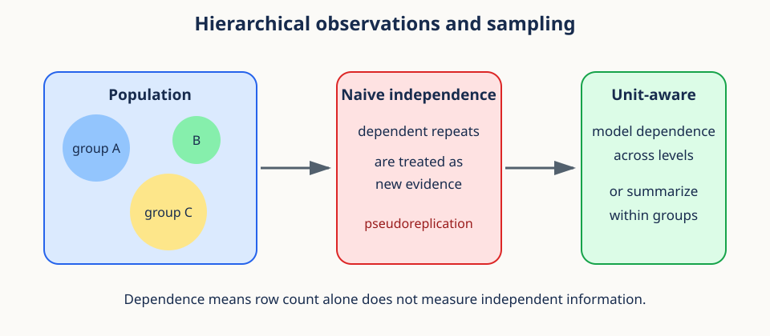
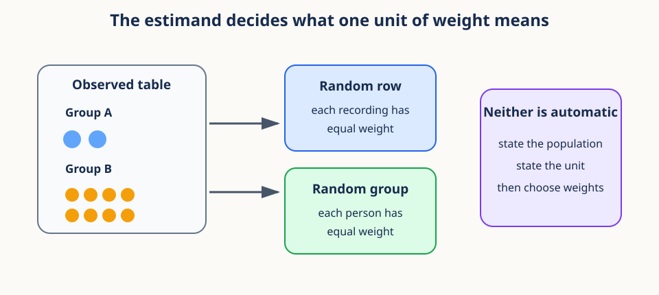
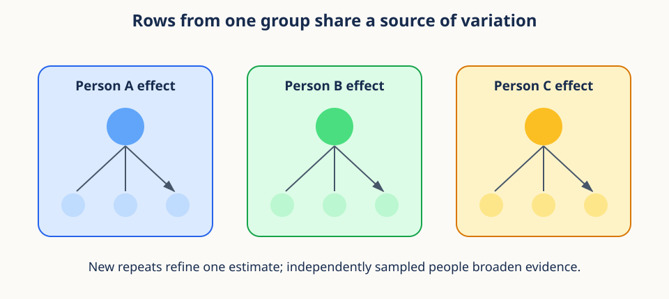

# 03. Hierarchical observations and sampling



## Begin with a table that can mislead us

Imagine a motion study with two participants. Participant A contributes two clips and
participant B contributes eight clips. Each row in the data table contains one clip and
one measured outcome. The table has ten rows, but how many participant-level groups
does the study contain? The answer is two. Whether those two participants provide
independent information depends on how they were sampled and whether they share
higher-level causes.

Now suppose participant A has outcome 0 in both clips and participant B has outcome 10
in all eight clips. The average of the ten rows is 8. The average of the two participant
means is 5. Neither arithmetic calculation is faulty. They answer different questions.
The first describes a randomly selected recorded clip in this table. The second describes
a randomly selected participant when both participants receive equal weight.



This example introduces the two decisions at the heart of hierarchical data. First,
what population quantity do we want? Second, which observations provide independent
information about it? More rows can improve measurement within a person without adding
the same information as more people. Statistical reasoning begins by naming the unit,
the population, and the question before computing a standard error or fitting a model.

## Prerequisites

You should understand averages and basic Python arrays. The lesson develops the needed
probability and sampling ideas from first principles.

## Learning goals

By the end of this lesson, you will be able to:

1. Distinguish a population, sample, observation, group, and experimental unit.
2. Compute variance, standard deviation, quantiles, and empirical distributions.
3. Explain conditional sampling and clustered dependence.
4. Identify pseudoreplication and its effect on uncertainty.
5. Compare row-weighted and group-balanced estimators.
6. Design a group-aware sampling and analysis strategy.
7. Separate available support, training exposure, and realized support.

## 1. Population, sample, and estimand

A **population** is the collection about which we want to reason. A **sample** is the
subset we observe. An **estimand** is the exact population quantity we want to learn.

An **observation** is one recorded row. A **group** collects observations that share a
source, such as one participant, clinic, device, or session. The **experimental unit**,
also called the randomization unit in an experiment, is the smallest unit independently
assigned to a condition. The **sampling unit** is independently selected from a target
population. The **analysis unit** supplies independent estimating information under the
analysis. These units can differ and must be named rather than merged.

For example, a video intervention may be assigned to people, each person may complete
three sessions, and each session may produce one hundred frames. Frames are observations,
sessions and people define nested groups, and the person is the experimental unit for
the assigned intervention. If people were also sampled independently and the analysis
estimates a participant-level effect, the experimental, sampling, and analysis units all
coincide at the person level. Counting frames as independently assigned people would
change the scientific meaning of the sample size.

These distinctions matter. The mean over all recorded video clips is not necessarily
the mean over people. A person with 100 clips receives 100 times the row weight of a
person with one clip unless we deliberately change the estimator.

Let group $g\in\{1,\ldots,G\}$ contain observations $y_{g1},\ldots,y_{gn_g}$.
The total row count is $N=\sum_g n_g$.

Here $G$ is the number of groups, $n_g$ is the row count in group $g$, and $i$ indexes
a row inside that group. The outcome $y_{gi}$ might be an accuracy, distance, or physical
measurement. This notation preserves both levels instead of collapsing everything into
a single row index.

An estimand must include a target population and a weighting rule. "The average outcome"
is incomplete if some people contribute many more rows than others. A more precise
statement is "the mean outcome for a uniformly sampled participant, averaging that
participant's available clips." That sentence already suggests the estimator.

### Support, exposure, and realized support

These three terms keep a data intervention separate from the number of training draws.
**Support** is the set of distinct units that a sampling policy could make available.
For example, support might be a set of sequence IDs, or a finer set of
`(sequence_id, window_start)` pairs. **Exposure** is the total number of sampled
presentations, including repeats. If training processes $C$ examples, its exposure is
$C$ even when many of those examples repeat. **Realized support** is the number of
distinct supported units that the run actually visits.

Suppose a policy can draw from 100 sequence-window pairs and processes 1,000 examples.
Its support is 100 pairs and its exposure is 1,000 draws. Its realized support can be at
most 100 and may be smaller because sampling with replacement repeats pairs. Increasing
exposure can visit more of the available support, but it does not enlarge the support
set. Increasing support does not guarantee that a short run will realize all of it.

The level of the support unit must also be named. Ten windows from one sequence can add
temporal support while still belonging to one sequence and one participant. Those
windows may improve optimization or measurement, but they are not ten independent
participants. Support, exposure, and independent evidence answer different questions.

## 2. Means answer weighted questions

The ordinary row mean is

$$
\bar y_{\text{row}}=\frac{1}{N}\sum_{g=1}^{G}\sum_{i=1}^{n_g}y_{gi}.
$$

Read this equation from the inside outward. The inner sum adds all outcomes within one
group. The outer sum adds those group totals. Division by $N$ gives every row weight
$1/N$. A group with eight rows therefore receives four times the total weight of a group
with two rows.

Define the mean inside group $g$ as

$$
\bar y_g=\frac{1}{n_g}\sum_{i=1}^{n_g}y_{gi}.
$$

Then the row mean can be rewritten as

$$
\bar y_{\text{row}}=\sum_{g=1}^{G}\frac{n_g}{N}\bar y_g.
$$

So it is a weighted average of group means with weight $n_g/N$. The group-balanced
mean instead gives each group equal weight:

$$
\bar y_{\text{group}}=\frac{1}{G}\sum_{g=1}^{G}\bar y_g.
$$

This equation first summarizes each group, then averages the $G$ summaries. Every group
receives total weight $1/G$, regardless of its row count. Rows inside a small group
therefore receive more individual weight than rows inside a large group.

Neither is universally correct. The estimand decides. If the target is a randomly
selected recording, row weighting may be appropriate. If the target is a randomly
selected person, equal-person weighting is often closer.

```python
import numpy as np

group_a = np.array([0.0, 0.0])
group_b = np.full(8, 10.0)
row_mean = np.concatenate([group_a, group_b]).mean()  # 8.0
group_mean = np.mean([group_a.mean(), group_b.mean()]) # 5.0
```

**Conceptual checkpoint.** Weighting and dependence are separate issues. Row weighting
can be the correct estimator for a row-level population even when rows are dependent.
Equal-group weighting can match a group-level population, but it does not by itself
produce a valid uncertainty estimate. First choose what to average, then account for
how the averaged quantities co-vary.

## 3. Variance measures squared spread

For a finite population $y_1,\ldots,y_N$ with mean $\mu$, population variance is

$$
\sigma^2=\frac{1}{N}\sum_{i=1}^{N}(y_i-\mu)^2.
$$

Squaring prevents positive and negative deviations from canceling. It also emphasizes
large deviations. Variance has squared units, so standard deviation returns to the
original units:

$$
\sigma=\sqrt{\sigma^2}.
$$

When a sample estimates the variance of a broader population, the common estimator is

$$
s^2=\frac{1}{N-1}\sum_{i=1}^{N}(y_i-\bar y)^2.
$$

The denominator $N-1$ corrects the downward bias caused by estimating the mean from
the same data. In NumPy, `np.var(y, ddof=1)` and `np.std(y, ddof=1)` request this form.
The correction does not fix dependence among rows.

The difference between population and sample variance is a difference in purpose. If
the listed values are the whole population of interest, division by $N$ describes their
spread exactly. If they are a random sample used to estimate a broader population
variance, division by $N-1$ corrects a particular average bias under independent
sampling. Neither denominator turns repeated measurements into independent units.

Variance is sensitive to the level of analysis. Total row variation can be separated
conceptually into differences between group centers and variation of rows around their
own group center. A small within-person spread does not imply that people resemble one
another, and a large pooled spread does not tell us which level generated it.

## 4. Quantiles describe distribution locations

The $p$-quantile is a value below which roughly proportion $p$ of observations fall.
The median is the 0.5 quantile. Quartiles use $p=0.25,0.5,0.75$.

Quantiles are useful for skewed data because one extreme value can move the mean and
standard deviation substantially while affecting most quantiles much less.

```python
y = np.array([1, 2, 2, 3, 100], dtype=float)
print(np.quantile(y, [0.25, 0.5, 0.75]))
```

For a finite sample, the desired probability may fall between observed ranks. Software
uses an interpolation convention. Record the method when exact reproducibility matters.
NumPy exposes it through the `method=` argument to `np.quantile`.

Quantiles are statements about order rather than squared distance. The median remains
near the middle of `[1, 2, 2, 3, 100]` because the value 100 occupies only one rank.
The mean moves much farther because it uses magnitude. Reporting both can reveal skew
that either statistic alone would hide.

With hierarchical data, pooled and group-conditional quantiles can tell different
stories. A pooled median gives frequently observed groups more influence. Computing a
median within each group and summarizing those medians gives a group-level description,
but it is a new estimand and should be named as such.

## 5. The empirical distribution

The empirical cumulative distribution function is

$$
\widehat F_N(a)=\frac{1}{N}\sum_{i=1}^{N}\mathbf{1}(y_i\leq a),
$$

where the indicator is 1 when its condition is true and 0 otherwise. It is the observed
fraction at or below $a$. It makes no normal-distribution assumption.

The symbol $a$ is a threshold on the outcome scale. The indicator turns each observation
into a yes or no answer to "Is this value at most $a$?" Averaging those zeros and ones
produces a proportion. Moving $a$ from left to right creates a staircase that begins at
zero and eventually reaches one.

```python
def ecdf(values, thresholds):
    values = np.asarray(values)
    return (values[:, None] <= np.asarray(thresholds)[None, :]).mean(axis=0)
```

Sorting once is more efficient for many queries. `np.searchsorted(sorted_y, a,
side="right") / len(y)` counts values at or below each threshold in logarithmic time.

An empirical distribution describes observed values without assuming a bell curve, but
it is still weighted by the rows supplied to it. If one participant contributes many
clips, their conditional distribution appears many times in the pooled staircase. A
group-balanced empirical distribution would require deliberate group-level weights.

## 6. Conditional distributions

A marginal distribution combines all groups or conditions. A conditional distribution
restricts attention to a known condition:

$$
P(Y\leq a\mid G=g).
$$

Different groups can have different centers, spreads, or shapes. A pooled histogram can
hide these patterns. Conditional sampling means selecting an observation according to a
rule given a group or condition, such as first sampling a person uniformly and then a
clip uniformly within that person.

That two-stage procedure gives each person probability $1/G$, then each of their clips
probability $1/n_g$. Directly sampling rows gives every clip probability $1/N$ and each
person probability $n_g/N$.

Conditional probability should be read as a restricted reference set. The expression
$P(Y\leq a\mid G=g)$ asks for the fraction below $a$ among outcomes from group $g$,
not among all outcomes. Comparing these conditional distributions reveals whether a
pooled pattern reflects behavior within groups or merely different group compositions.

This distinction is closely related to simulation. To simulate a random participant,
draw $g$ uniformly from the $G$ groups and then draw a row inside $g$. To simulate a
random recorded clip, draw one of the $N$ rows uniformly. Writing the sampling algorithm
often makes an ambiguous estimand concrete.

## 7. Clustered observations are dependent



Repeated measurements from one person, device, site, or session often resemble each
other. A simple random-effects model is

$$
y_{gi}=\mu+a_g+e_{gi},
$$

where $a_g$ is a group-specific deviation and $e_{gi}$ is observation noise.
Suppose

$$
\mathrm{Var}(a_g)=\sigma_a^2,\qquad
\mathrm{Var}(e_{gi})=\sigma_e^2.
$$

Two distinct observations in the same group share $a_g$, so their covariance is
$\sigma_a^2$. Their correlation, called the intraclass correlation, is

$$
\rho=\frac{\sigma_a^2}{\sigma_a^2+\sigma_e^2}.
$$

If $\rho$ is large, another row from the same group contributes much less independent
information than a row from a new group.

The random-effects equation is a story about sources. The overall center $\mu$ is shared
by everyone. The group deviation $a_g$ shifts every observation in group $g$ together.
The residual $e_{gi}$ adds row-specific variation. Two rows in one group are related
because both contain the same $a_g$, even if their residuals are independent.

The intraclass correlation $\rho$ is the fraction of total variance attributable to
between-group differences under this model. If $\rho=0$, rows within a group are no more
alike than rows across groups in this simplified structure. If $\rho$ is near one, rows
within a group are nearly replicas relative to between-group differences.

**Worked example.** Suppose between-person variance is 9 and within-person variance is
1. Then $\rho=9/(9+1)=0.9$. Ten clips from one person can estimate that person's center
more precisely, but they do not resemble ten new people. If the two variance components
are instead 1 and 9, then $\rho=0.1$, and repeated clips contain more distinct row-level
information.

## 8. Pseudoreplication inflates apparent evidence

Pseudoreplication occurs when dependent measurements are analyzed as independent
replicates of the scientific unit. For example, 1,000 frames from 10 people do not
usually provide the same participant-level evidence as one frame from 1,000 people.

With equal cluster size $m$ and intraclass correlation $\rho$, a useful approximation
to the variance inflation is the design effect

$$
\mathrm{DE}=1+(m-1)\rho.
$$

The effective sample size is roughly

$$
N_{\text{eff}}\approx\frac{N}{\mathrm{DE}}.
$$

If $m=20$ and $\rho=0.5$, the design effect is 10.5. Two hundred rows carry only about
the independent information of 19 rows under this approximation.

The design-effect formula assumes equal cluster sizes and a common pairwise correlation.
Real data may violate both assumptions, so the result is a planning approximation rather
than a universal correction. It is valuable because it shows the direction and scale of
the problem: larger clusters and stronger within-cluster similarity reduce the information
gained per additional row.

Pseudoreplication is not caused merely by having repeated observations. Repeats can be
scientifically valuable. The error occurs when the analysis claims independent evidence
at a level where the observations share causes. A group-aware model, cluster bootstrap,
or group-level summary can use repeats without pretending they are new groups.

## 9. Group-balanced estimators

Equal averaging of group means is the simplest group-balanced estimator. The same idea
can be expressed as row weights $w_{gi}=1/(G n_g)$:

$$
\widehat\mu=\sum_g\sum_i w_{gi}y_{gi}.
$$

Within each group, the weights sum to $1/G$. Across all groups, they sum to 1.

```python
values = np.array([0, 2, 8, 10, 12], dtype=float)
groups = np.array([0, 0, 1, 1, 1])
means = np.array([values[groups == g].mean() for g in np.unique(groups)])
balanced = means.mean()
```

For many groups, avoid repeated Boolean scans. Sort by group, use pandas `groupby`, or
use `np.unique(..., return_inverse=True)` with `np.bincount` for vectorized sums and counts.

```python
_, inverse = np.unique(groups, return_inverse=True)
sums = np.bincount(inverse, weights=values)
counts = np.bincount(inverse)
balanced_fast = (sums / counts).mean()
```

The vectorized code mirrors the mathematical two-stage average. `np.bincount` produces
one sum and one count per integer group code. Their ratio gives all group means without
repeatedly scanning the full table. The final mean gives each group equal weight.

Equal weighting is not always efficient or representative. If groups were sampled with
known unequal probabilities, survey weights may be required. If group estimates have
very different measurement precision, a model may partially pool them. The essential
principle is to derive weights from the estimand and sampling design rather than from
convenient row counts.

## 10. Worked example

Three clinics contribute outcomes:

- Clinic A: two values, 2 and 4.
- Clinic B: one value, 9.
- Clinic C: three values, 5, 7, and 9.

The row mean is $(2+4+9+5+7+9)/6=6$. The clinic means are 3, 9, and 7.
The clinic-balanced mean is $(3+9+7)/3=6.33$. The difference is not a computational
error. The estimators answer different questions.

If measurements inside a clinic share equipment and recruitment effects, treating six
rows as six independent clinic replicates also understates uncertainty. The clinic is
the natural resampling unit for conclusions about clinics.

Now change Clinic C to contribute thirty repeats with mean 7. The clinic-balanced mean
does not change because the clinic center is unchanged. The row mean moves toward 7
because the observed-record population has changed. The extra repeats can narrow our
estimate of Clinic C's center, but they do not create twenty-seven additional clinics.

## 11. Sampling and splitting without leakage

Train, validation, and test sets should be disjoint at the level that carries shared
information. If clips from one person appear in both training and test sets, the model
may recognize person-specific features. This measures interpolation across clips, not
generalization to new people.

Useful APIs include `sklearn.model_selection.GroupShuffleSplit` and `GroupKFold`.
Provide a group identifier for every row. When class balance also matters, consider
`StratifiedGroupKFold` and verify the realized split counts.

The grouping level should match the intended deployment generalization. If deployment
will encounter new sessions from known participants, a session-disjoint split within
participants may be informative. If deployment will encounter new participants, all
rows for a participant must stay together. A split is not intrinsically rigorous; it is
rigorous relative to a stated future-use question.

## 12. Common failure modes

1. **Confusing rows with experimental units:** state both counts.
2. **Using `ddof=1` as a dependence correction:** it only corrects mean estimation bias.
3. **Reporting only pooled statistics:** inspect conditional distributions by group.
4. **Balancing by accidental row counts:** define the target population first.
5. **Splitting rows randomly:** keep related groups entirely within one partition.
6. **Using group means without uncertainty:** preserve the number and variability of groups.
7. **Calling exposure diversity:** repeated draws increase exposure but may leave support unchanged.

Another failure is conditioning on a variable after inspecting the outcome and then
presenting the subgroup result as planned. Conditional analysis is useful, but its
selection rule and multiplicity belong in the interpretation. Hierarchical structure
does not remove ordinary concerns about exploratory analysis.

## Exercises

### Exercise 1

Group A has values `[0, 0]`; group B has `[6, 6, 6, 6]`. Find the row and group means.

**Brief solution:** row mean is 4; equal-group mean is 3.

### Exercise 2

For 30 groups of size 5 and $\rho=0.25$, estimate the design effect and effective size.

**Brief solution:** design effect $1+4(0.25)=2$; $N_{eff}\approx150/2=75$.

### Exercise 3

Why can a participant-disjoint test set be harder than a random row split?

**Brief solution:** it removes shared participant features, so performance must transfer
to genuinely unseen participants rather than related recordings.

### Exercise 4

A study has 40 people with 10 clips each and estimated intraclass correlation 0.4.
Use the equal-size approximation to estimate the design effect and effective row count.

**Brief solution:** $\mathrm{DE}=1+9(0.4)=4.6$, so
$N_{\text{eff}}\approx400/4.6\approx87$. This is an approximation, not a replacement
for a group-aware analysis.

### Exercise 5

Explain why equal-group weighting and group-disjoint splitting solve different problems.

**Brief solution:** weighting defines the population average being estimated. Splitting
controls shared-information leakage and tests generalization to new groups. A workflow
may need both.

## Recap

Summary statistics always imply a weighting scheme. Hierarchical data add dependence,
so the row count can greatly exceed the independent information count. Conditional
distributions reveal group structure, group-aware splits prevent leakage, and balanced
estimators align weights with a group-level target population.

Previous: [02. Inner-product geometry and numerical stability](02_inner_product_geometry.md).

Next: [04. Attention and positional representations](04_attention_and_positions.md).

## Continue in the notebook

Run the [hierarchical observations notebook](../implementations/03_hierarchical_observations.ipynb) before moving to Lesson 04.
