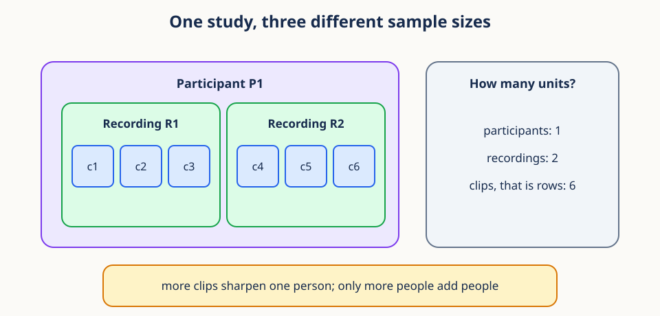
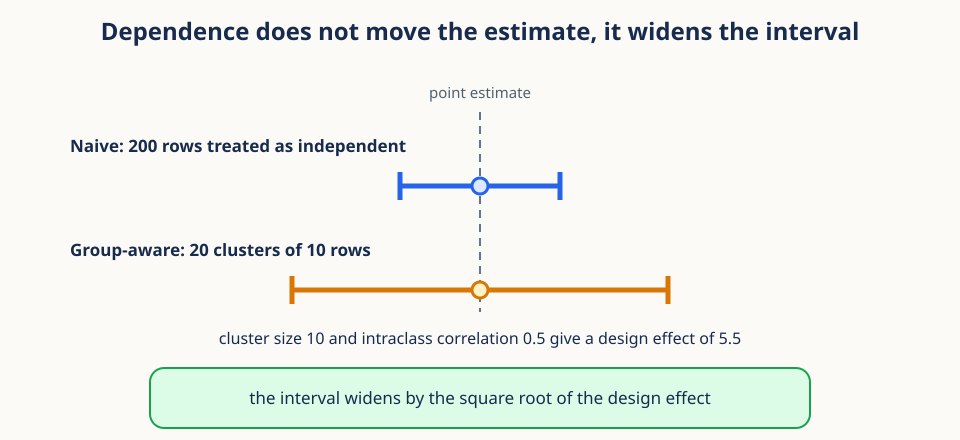
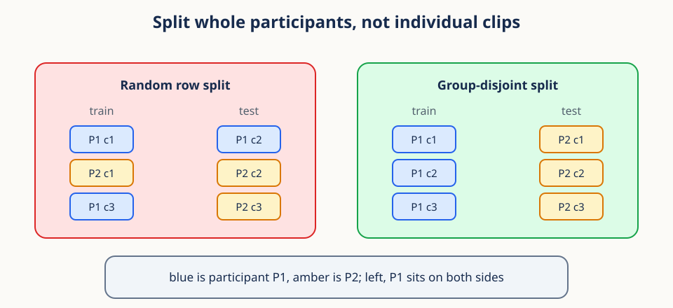

# 03. Hierarchical observations and sampling


## Begin with a table that can mislead us

Lessons 01 and 02 treated every clip as a thing to be shaped and compared. This lesson
asks where the clips came from, and the answer changes how much you are allowed to
conclude. The main claim is short: a row is not a unit of evidence until you say which
population it stands for.

Start with a motion study of two participants. Participant A contributes two clips and
participant B contributes eight. Each row of the data table holds one clip and one
measured outcome. The table has ten rows. How many participant-level groups does the
study contain? Two. Whether those two participants supply independent information
depends on how they were sampled and whether they share higher-level causes.

Now put numbers on it. Participant A has outcome 0 in both clips and participant B has
outcome 10 in all eight. The average of the ten rows is 8. The average of the two
participant means is 5. Neither calculation is faulty, and neither is a rounding
artifact. They answer different questions. The first describes a randomly selected
recorded clip in this table. The second describes a randomly selected participant when
both participants count equally.


That contrast introduces the two decisions at the heart of hierarchical data. First,
which population quantity do we want? Second, which observations carry independent
information about it? More rows can sharpen a measurement within one person without
adding what more people would add. Statistical reasoning starts by naming the unit, the
population, and the question, and only then computes a standard error or fits a model.

## Prerequisites

You should understand averages and basic Python arrays. This lesson develops the needed
probability and sampling ideas from first principles.

## Learning goals

By the end of this lesson, you will be able to:

1. Distinguish a population, sample, observation, group, and experimental unit.
2. Compute variance, standard deviation, quantiles, and empirical distributions.
3. Explain conditional sampling and clustered dependence.
4. Identify pseudoreplication and its effect on uncertainty.
5. Compare row-weighted and group-balanced estimators.
6. Design a group-aware sampling and analysis strategy.
7. Separate available support, training exposure, and realized support.

## 1. Population, sample, and estimand

The opening example turned on which unit we were averaging over, so the vocabulary for
units deserves care. A **population** is the collection we want to reason about. A
**sample** is the subset we observe. An **estimand** is the exact population quantity we
want to learn.

Underneath those sit four more words that are often merged and should not be. An
**observation** is one recorded row. A **group** collects observations sharing a source,
such as one participant, clinic, device, or session. The **experimental unit**, also
called the randomization unit, is the smallest unit independently assigned to a
condition. The **sampling unit** is what gets independently selected from the target
population, and the **analysis unit** is what supplies independent estimating
information under your analysis. These can all differ in one study.



The figure shows the nesting in miniature. A video intervention may be assigned to
people, each person may complete several recordings, and each recording may produce many
clips. Clips are observations. Recordings and people define nested groups. The person is
the experimental unit for the assigned intervention. If people were also sampled
independently and the analysis targets a participant-level effect, then the experimental,
sampling, and analysis units all sit at the person level. Counting clips as if they were
independently assigned people would change the scientific meaning of the sample size.

To write any of this down we need notation for two levels at once. Let group
$g\in\{1,\ldots,G\}$ contain observations $y_{g1},\ldots,y_{gn_g}$, so the total row
count is $N=\sum_g n_g$. Here $G$ is the number of groups, $n_g$ is the row count inside
group $g$, and the second index runs over rows within that group. The outcome $y_{gi}$
might be an accuracy, a distance, or a physical measurement. Keeping two indices keeps
both levels visible instead of collapsing everything into one row index.

An estimand must name both a target population and a weighting rule. "The average
outcome" is incomplete when some people contribute many more rows than others. "The mean
outcome for a uniformly sampled participant, averaging over that participant's available
clips" is complete, and it already tells you how to compute the estimate.

### Support, exposure, and realized support

Three more terms keep a data intervention separate from the number of training draws,
and they will return in later lessons. **Support** is the set of distinct units a
sampling policy could make available, for example a set of sequence IDs or a finer set of
`(sequence_id, window_start)` pairs. **Exposure** is the total number of sampled
presentations, including repeats: if training processes $C$ examples, its exposure is $C$
even when many of those examples repeat. **Realized support** is the number of distinct
supported units the run actually visits.

A small case makes the three concrete. Suppose a policy can draw from 100 sequence-window
pairs and processes 1,000 examples. Its support is 100 pairs and its exposure is 1,000
draws. Its realized support is at most 100 and is usually smaller, because sampling with
replacement repeats pairs. Raising exposure can visit more of the available support, but
it never enlarges the support set. Raising support does not guarantee a short run will
realize all of it.

The level of the support unit matters as much as its size. Ten windows drawn from one
sequence add temporal support while still belonging to one sequence and one participant.
Those windows may help optimization or measurement, and they are not ten independent
participants. Support, exposure, and independent evidence are three different questions.

## 2. Means answer weighted questions

With units named, return to the opening arithmetic and see exactly where the weights come
from. The ordinary row mean is

$$
\bar y_{\text{row}}=\frac{1}{N}\sum_{g=1}^{G}\sum_{i=1}^{n_g}y_{gi}.
$$

Read it from the inside outward. The inner sum adds all outcomes within one group. The
outer sum adds those group totals. Dividing by $N$ gives every row the same weight
$1/N$, so a group with eight rows carries four times the total weight of a group with
two.

Define the mean inside group $g$ as

$$
\bar y_g=\frac{1}{n_g}\sum_{i=1}^{n_g}y_{gi}.
$$

Substituting that definition into the row mean rewrites it as a weighted average of
group means:

$$
\bar y_{\text{row}}=\sum_{g=1}^{G}\frac{n_g}{N}\bar y_g.
$$

The weight $n_g/N$ is the share of rows the group happens to contribute, which is a fact
about data collection rather than a scientific choice. The group-balanced mean makes the
opposite choice and gives every group equal weight:

$$
\bar y_{\text{group}}=\frac{1}{G}\sum_{g=1}^{G}\bar y_g.
$$

This second formula summarizes each group first and then averages the $G$ summaries.
Every group receives total weight $1/G$ regardless of its row count, so a row inside a
small group carries more individual weight than a row inside a large one. Neither
estimator is universally correct. If the target is a randomly selected recording, row
weighting may be right. If the target is a randomly selected person, equal-person
weighting is usually closer.

```python
import numpy as np

group_a = np.array([0.0, 0.0])
group_b = np.full(8, 10.0)
row_mean = np.concatenate([group_a, group_b]).mean()   # 8.0
group_mean = np.mean([group_a.mean(), group_b.mean()]) # 5.0
```

**Conceptual checkpoint.** Weighting and dependence are separate problems, and they need
separate fixes. Row weighting can be the correct estimator for a row-level population
even when rows are dependent. Equal-group weighting can match a group-level population
and still produce a wrong uncertainty estimate on its own. First choose what to average,
then account for how the averaged quantities co-vary.

## 3. Variance measures squared spread

An estimate without a spread is not yet a result, so the next few sections build the
descriptive tools before returning to dependence. For a finite population
$y_1,\ldots,y_N$ with mean $\mu$, the population variance is

$$
\sigma^2=\frac{1}{N}\sum_{i=1}^{N}(y_i-\mu)^2.
$$

Each term measures how far one value sits from the center. Squaring stops positive and
negative deviations from canceling and gives extra emphasis to large deviations. Variance
therefore has squared units, and the standard deviation returns to the original units:

$$
\sigma=\sqrt{\sigma^2}.
$$

When a sample is used to estimate the variance of a broader population, the usual
estimator replaces $\mu$ with the sample mean $\bar y$ and divides by one less:

$$
s^2=\frac{1}{N-1}\sum_{i=1}^{N}(y_i-\bar y)^2.
$$

The denominator $N-1$ corrects the downward bias caused by estimating the center from the
same data that measures spread around it. In NumPy, `np.var(y, ddof=1)` and
`np.std(y, ddof=1)` request this form. It is worth being blunt about what the correction
does not do: it does not correct for dependence among rows.

So the choice of denominator is a choice of purpose. If the listed values are the whole
population of interest, dividing by $N$ describes their spread exactly. If they are a
random sample used to estimate a broader population variance, dividing by $N-1$ removes a
particular average bias under independent sampling. Neither denominator turns repeated
measurements into independent units.

Variance is also sensitive to the level you compute it at. Total row variation splits
conceptually into differences between group centers and variation of rows around their
own group center. A small within-person spread does not imply that people resemble one
another, and a large pooled spread does not say which level produced it. Section 7 makes
that split explicit.

## 4. Quantiles describe distribution locations

Variance summarizes spread with squared distance, which one extreme value can dominate.
Quantiles summarize the same data by rank instead. The $p$-quantile is a value below
which roughly a proportion $p$ of observations fall, so the median is the 0.5 quantile
and the quartiles use $p=0.25,0.5,0.75$.

```python
y = np.array([1, 2, 2, 3, 100], dtype=float)
print(np.quantile(y, [0.25, 0.5, 0.75]))
```

Run that on `[1, 2, 2, 3, 100]` and the median stays near the middle, because 100
occupies only one rank. The mean moves far to the right, because it uses magnitude.
Reporting both is a cheap way to reveal skew that either statistic alone would hide.

One implementation detail matters for reproducibility. For a finite sample the desired
probability usually falls between observed ranks, so software interpolates. Different
conventions give different answers, and NumPy exposes the choice through the `method=`
argument to `np.quantile`. Record the method when exact reproducibility matters.

Hierarchical data adds a second choice on top of that one. A pooled median gives
frequently observed groups more influence, exactly as the row mean did. Computing a
median within each group and then summarizing those medians gives a group-level
description, but it is a different estimand and deserves to be named as one.

## 5. The empirical distribution

Means and quantiles are single summaries. Sometimes the whole distribution is the answer,
and we can describe it without assuming any parametric shape. The empirical cumulative
distribution function is

$$
\widehat F_N(a)=\frac{1}{N}\sum_{i=1}^{N}\mathbf{1}(y_i\leq a),
$$

where $a$ is a threshold on the outcome scale and the indicator $\mathbf{1}(\cdot)$ is 1
when its condition holds and 0 otherwise. The indicator turns each observation into a yes
or no answer to "Is this value at most $a$?", and averaging those zeros and ones gives a
proportion. Sliding $a$ from left to right traces a staircase that starts at zero and
ends at one. No normal-distribution assumption enters anywhere.

```python
def ecdf(values, thresholds):
    values = np.asarray(values)
    return (values[:, None] <= np.asarray(thresholds)[None, :]).mean(axis=0)
```

That version compares every value against every threshold, which is clear but wasteful.
Sorting once is much faster for many queries:
`np.searchsorted(sorted_y, a, side="right") / len(y)` counts values at or below each
threshold in logarithmic time.

The staircase is assumption-free about shape and not assumption-free about weighting. It
is built from the rows you supply, so a participant with many clips contributes their
conditional distribution many times over. A group-balanced empirical distribution needs
deliberate group-level weights, for the same reason the group-balanced mean did.

## 6. Conditional distributions

The previous section pooled every row into one staircase. Pooling can hide the very
structure we care about, so the natural next move is to condition on the group. A
marginal distribution combines all groups. A conditional distribution restricts attention
to one:

$$
P(Y\leq a\mid G=g).
$$

Read the vertical bar as "within a restricted reference set." The expression asks for the
fraction below $a$ among outcomes from group $g$ alone, not among all outcomes. Comparing
these conditional distributions across groups shows whether a pooled pattern reflects
behavior inside groups or merely different group compositions.

Conditioning also describes how a sample is drawn. Conditional sampling means selecting
an observation by a rule given a group, such as first sampling a person uniformly and
then a clip uniformly within that person. That two-stage procedure gives each person
probability $1/G$ and then each of their clips probability $1/n_g$. Sampling rows
directly gives each clip probability $1/N$ and each person probability $n_g/N$, which is
the row weighting of Section 2 arriving again in a new costume.

Writing the sampling algorithm is often the fastest way to make an ambiguous estimand
concrete. To simulate a random participant, draw $g$ uniformly from the $G$ groups and
then draw a row inside $g$. To simulate a random recorded clip, draw one of the $N$ rows
uniformly. If you cannot write the two-line simulation, the estimand is not yet defined.

## 7. Clustered observations are dependent

Everything so far concerned which rows to weight. Now we face the second decision from
the opening: how much independent information the rows carry. Repeated measurements from
one person, device, site, or session tend to resemble each other, and a simple
random-effects model says why.


The model splits every observation into three parts:

$$
y_{gi}=\mu+a_g+e_{gi},
$$

where $\mu$ is the overall center shared by everyone, $a_g$ is a deviation belonging to
group $g$, and $e_{gi}$ is row-specific noise. The story is that $a_g$ shifts every
observation in group $g$ together, while $e_{gi}$ jostles each row on its own. Assume the
two random parts have variances

$$
\mathrm{Var}(a_g)=\sigma_a^2,\qquad
\mathrm{Var}(e_{gi})=\sigma_e^2.
$$

Two distinct rows in the same group share the same $a_g$, so their covariance is
$\sigma_a^2$ even when their residuals are independent. Dividing that shared part by the
total variance gives their correlation, called the intraclass correlation:

$$
\rho=\frac{\sigma_a^2}{\sigma_a^2+\sigma_e^2}.
$$

So $\rho$ is the fraction of total variance attributable to between-group differences
under this model. If $\rho$ is 0, rows within a group are no more alike than rows across
groups. If $\rho$ is near 1, rows within a group are nearly replicas of each other
relative to how far apart the groups are, and a second row from the same group adds
little that the first did not already tell us.

**Worked example.** Suppose between-person variance is 9 and within-person variance is 1.
Then $\rho=9/(9+1)=0.9$. Ten clips from one person pin down that person's center
precisely, and they still do not resemble ten new people. Flip the two components to 1 and
9 and $\rho=0.1$, so repeated clips now carry much more distinct row-level information.

## 8. Pseudoreplication inflates apparent evidence

The intraclass correlation is not just a description. It changes the width of every
interval you report. **Pseudoreplication** is the error of analyzing dependent
measurements as independent replicates of the scientific unit, for example treating 1,000
frames from 10 people as participant-level evidence comparable to one frame from 1,000
people.

With equal cluster size $m$ and intraclass correlation $\rho$, a standard approximation
for the variance inflation is the design effect

$$
\mathrm{DE}=1+(m-1)\rho.
$$

Here $m$ is the number of rows per cluster. The effective sample size, meaning the number
of independent rows that would carry the same information, is then roughly

$$
N_{\text{eff}}\approx\frac{N}{\mathrm{DE}}.
$$

Put $m=20$ and $\rho=0.5$ into the formula and the design effect is 10.5, so two hundred
rows carry about the independent information of 19 rows. The estimate itself does not
move. What moves is the interval around it.



Because the design effect multiplies the variance, the standard error grows by its square
root. In the figure, ten rows per cluster with $\rho=0.5$ give a design effect of 5.5, so
the honest interval is about $\sqrt{5.5}\approx2.35$ times wider than the naive one.
Reporting the narrow interval is how a study announces a result that replication will not
reproduce.

Two caveats keep this tool honest. The formula assumes equal cluster sizes and one common
pairwise correlation, and real data often violates both, so treat it as a planning
approximation rather than a universal correction. It is still valuable because it shows
the direction and rough scale of the problem: larger clusters and stronger within-cluster
similarity both reduce the information gained per additional row.

Repeated observations are not the error. Repeats can be scientifically valuable, and they
genuinely improve within-group measurement. The error is claiming independent evidence at
a level where the observations share causes. A group-aware model, a cluster bootstrap, or
a group-level summary all use repeats without pretending they are new groups.

## 9. Group-balanced estimators

Section 2 defined the group-balanced mean and Section 8 explained why the grouping matters
for uncertainty. This section shows how to compute the estimator at scale. Equal averaging
of group means is the same thing as a particular set of row weights,
$w_{gi}=1/(G n_g)$:

$$
\widehat\mu=\sum_g\sum_i w_{gi}y_{gi}.
$$

Within each group those weights sum to $1/G$, and across all groups they sum to 1. The
direct implementation mirrors the two-stage definition:

```python
values = np.array([0, 2, 8, 10, 12], dtype=float)
groups = np.array([0, 0, 1, 1, 1])
means = np.array([values[groups == g].mean() for g in np.unique(groups)])
balanced = means.mean()
```

That loop rescans the whole table once per group, which is fine for five rows and painful
for five million. Sort by group, use pandas `groupby`, or use
`np.unique(..., return_inverse=True)` with `np.bincount`:

```python
_, inverse = np.unique(groups, return_inverse=True)
sums = np.bincount(inverse, weights=values)
counts = np.bincount(inverse)
balanced_fast = (sums / counts).mean()
```

`np.bincount` produces one sum and one count per integer group code in a single pass, so
their ratio gives every group mean at once. The final `.mean()` gives each group equal
weight, exactly as the formula asks.

Equal weighting is not always the right target. If groups were sampled with known unequal
probabilities, survey weights may be required. If group estimates differ greatly in
measurement precision, a model may partially pool them toward the overall center. The
principle is to derive weights from the estimand and the sampling design rather than from
whatever row counts happened to occur.

## 10. Worked example

Here is the whole argument on six numbers. Three clinics contribute outcomes:

- Clinic A: two values, 2 and 4.
- Clinic B: one value, 9.
- Clinic C: three values, 5, 7, and 9.

The row mean is $(2+4+9+5+7+9)/6=6$. The clinic means are 3, 9, and 7, so the
clinic-balanced mean is $(3+9+7)/3=6.33$. The gap is not a computational error. The two
estimators answer different questions, one about a randomly chosen record and one about a
randomly chosen clinic.

Uncertainty follows the same logic. If measurements inside a clinic share equipment and
recruitment effects, treating six rows as six independent clinic replicates understates
the uncertainty for any claim about clinics. The clinic is the natural resampling unit
for conclusions about clinics.

Now change Clinic C to contribute thirty repeats with mean 7. The clinic-balanced mean
does not move, because the clinic center has not moved. The row mean slides toward 7,
because the population of observed records has changed. The extra repeats narrow our
estimate of Clinic C's own center and they do not create twenty-seven additional clinics.

## 11. Sampling and splitting without leakage

The same unit that governs weighting and uncertainty also governs evaluation. Train,
validation, and test sets must be disjoint at the level that carries shared information.



The left panel of the figure shows what goes wrong. Clips from one person land in both
training and test, so the model can recognize person-specific features it has already
seen. The resulting score measures interpolation across that person's clips, not
generalization to new people. The right panel keeps every clip from a participant on one
side.

In practice, `sklearn.model_selection.GroupShuffleSplit` and `GroupKFold` do this for
you, given a group identifier for every row. When class balance also matters, consider
`StratifiedGroupKFold` and then verify the realized split counts rather than trusting
them.

The grouping level should match the generalization you intend to claim. If deployment
will encounter new sessions from known participants, a session-disjoint split within
participants is informative. If deployment will encounter new participants, every row for
a participant must stay together. A split is not rigorous in the abstract. It is rigorous
relative to a stated question about future use.

## 12. Efficiency notes

Group-aware analysis touches every row several times, so a few habits keep it cheap.

- Encode group labels once with `np.unique(..., return_inverse=True)` and reuse the
  integer codes. Repeated Boolean scans cost one full pass per group.
- Use `np.bincount` for group sums and counts, or pandas `groupby` when you also need
  several statistics at once.
- Sort by group before any windowed or per-group loop, so each group's rows are
  contiguous in memory.
- For an empirical distribution queried at many thresholds, sort once and call
  `np.searchsorted` rather than comparing every value against every threshold.
- Keep group identifiers beside the features through every split and shuffle. Recovering
  them later is far more expensive than carrying them along.

## 13. Common failure modes

Every failure below is one of the two opening decisions being skipped.

1. **Confusing rows with experimental units:** state both counts.
2. **Using `ddof=1` as a dependence correction:** it only corrects mean estimation bias.
3. **Reporting only pooled statistics:** inspect conditional distributions by group.
4. **Balancing by accidental row counts:** define the target population first.
5. **Splitting rows randomly:** keep related groups entirely within one partition.
6. **Using group means without uncertainty:** preserve the number and variability of groups.
7. **Calling exposure diversity:** repeated draws raise exposure and may leave support unchanged.

An eighth failure is conditioning on a variable after inspecting the outcome and then
presenting the subgroup result as if it had been planned. Conditional analysis is useful,
and its selection rule and multiplicity belong in the interpretation. Hierarchical
structure does not excuse ordinary concerns about exploratory analysis.

## Exercises

### Exercise 1

Group A has values `[0, 0]`; group B has `[6, 6, 6, 6]`. Find the row and group means.

**Brief solution:** row mean is 4; equal-group mean is 3.

### Exercise 2

For 30 groups of size 5 and $\rho=0.25$, estimate the design effect and effective size.

**Brief solution:** design effect $1+4(0.25)=2$; $N_{eff}\approx150/2=75$.

### Exercise 3

Why can a participant-disjoint test set be harder than a random row split?

**Brief solution:** it removes shared participant features, so performance must transfer
to genuinely unseen participants rather than to related recordings.

### Exercise 4

A study has 40 people with 10 clips each and estimated intraclass correlation 0.4.
Use the equal-size approximation to estimate the design effect and effective row count.

**Brief solution:** $\mathrm{DE}=1+9(0.4)=4.6$, so
$N_{\text{eff}}\approx400/4.6\approx87$. This is an approximation, not a replacement for
a group-aware analysis.

### Exercise 5

Explain why equal-group weighting and group-disjoint splitting solve different problems.

**Brief solution:** weighting defines the population average being estimated. Splitting
controls shared-information leakage and tests generalization to new groups. A workflow
may need both.

## Recap

Every summary statistic implies a weighting scheme, so the estimand must be named before
the arithmetic. Hierarchical data then adds dependence, which means the row count can far
exceed the count of independent information. Conditional distributions expose group
structure, the design effect quantifies what dependence costs an error bar, group-aware
splits prevent leakage, and balanced estimators align the weights with a group-level
target population.

These three lessons have set up the data: its shape, its geometry, and its structure.
Lesson 04 turns to the model that consumes it and asks how a sequence of tokens attends
to itself.

Previous: [02. Inner-product geometry and numerical stability](02_inner_product_geometry.md).

Next: [04. Attention and positional representations](04_attention_and_positions.md).

## Continue in the notebook

Run the [hierarchical observations notebook](../implementations/03_hierarchical_observations.ipynb) before moving to Lesson 04.
