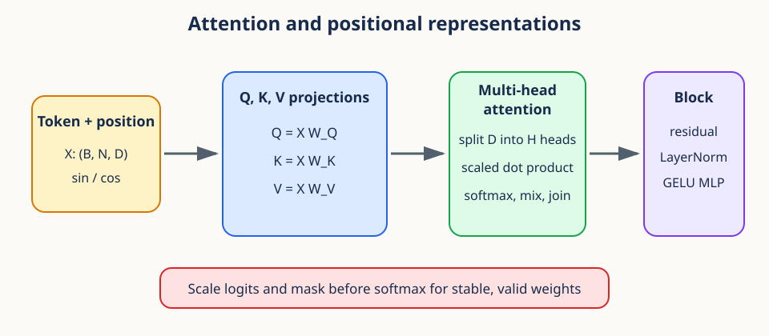
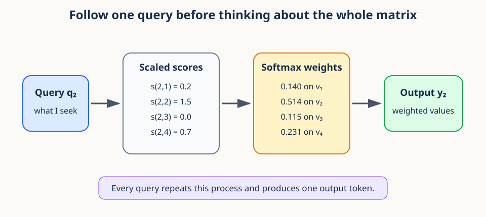
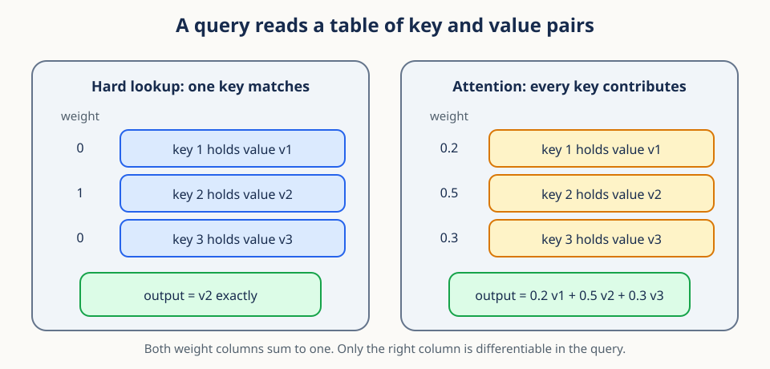
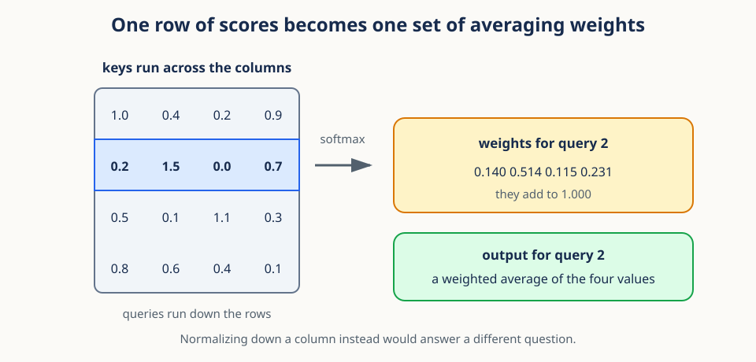
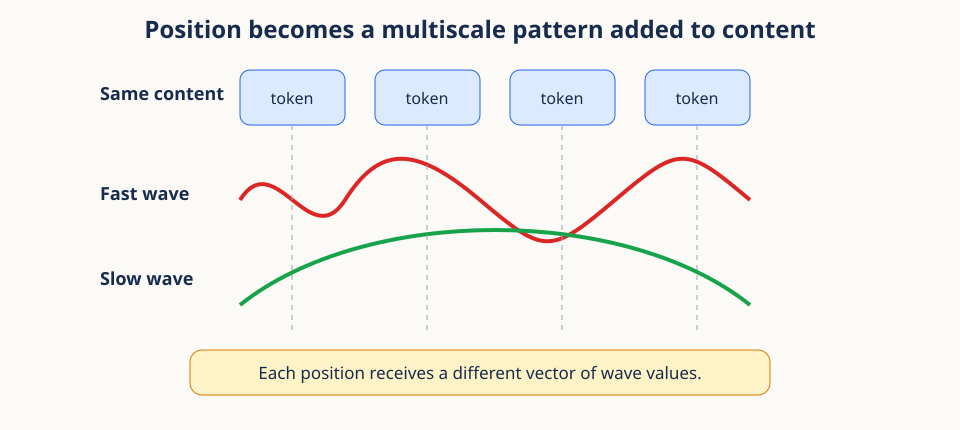
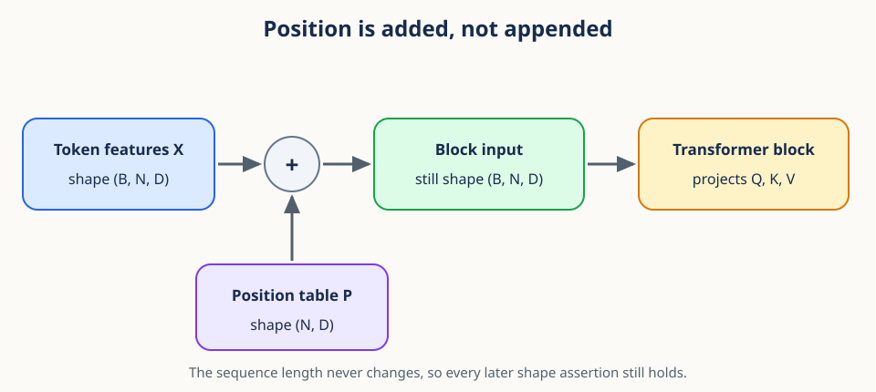
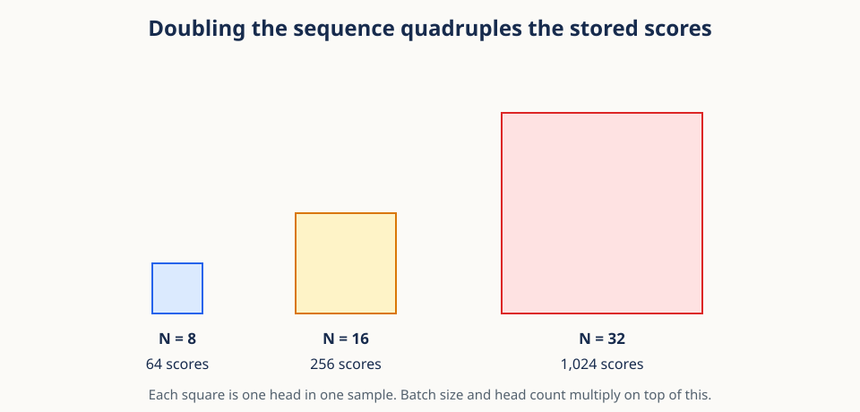

# 04. Attention and positional representations



## Begin with a pronoun and its context

Read the sentence, "The robot lifted the box because it was light." To interpret the word
"it," a reader compares that word with the other words and decides which ones carry the
information that settles the question. Distance alone does not decide it. The nearest word
can be irrelevant, and a word five positions back can be the one that resolves the meaning.

Attention is a differentiable version of that selective lookup. Each token asks a question,
scores how well every other token answers it, turns those scores into nonnegative weights,
and blends the corresponding information. Because the weights are computed from the token
contents, the same layer can read one way for one input and a different way for the next.

The whole mechanism is easier to hold in your head one query at a time. A full attention
matrix is nothing more than many copies of the same four-step process running in parallel,
so if you understand one query you understand all of them.



Those four steps are: make a query, compare it with all keys, normalize the comparison
scores, and average the values. Queries and keys decide **where to read**. Values decide
**what is read**. Every equation in the rest of this lesson is a precise statement of one
of those four steps, so keep the two roles separate as you read.

## Prerequisites

You should be comfortable with vectors, dot products, norms, and tensor shapes. Review
[02. Inner-product geometry](02_inner_product_geometry.md) if any of those feel unfamiliar,
because attention scores are dot products and nothing else.

## Learning goals

By the end of this lesson, you will be able to:

1. Derive softmax and scaled dot-product attention.
2. Track query, key, value, score, and output shapes.
3. Explain why scaling by $\sqrt{d_k}$ stabilizes softmax.
4. Build multi-head attention from parallel lower-dimensional heads.
5. Construct sinusoidal positional representations.
6. Explain residual connections, LayerNorm, and GELU in a Transformer block.

## 1. Why attention exists

Here is the claim in one sentence: attention lets every token choose, from the content
alone, which other tokens to read from. A convolution mixes nearby locations using a fixed
local pattern that is the same for every input. Attention forms a weighted average whose
weights are recomputed for each input.

A token sequence is a tensor $X\in\mathbb{R}^{B\times N\times D}$, where $B$ is the batch
size, $N$ is the number of tokens in one sequence, and $D$ is the feature width of one
token. For one sequence, imagine asking each token three questions:

- **Query:** What information am I looking for?
- **Key:** What kind of information do I contain?
- **Value:** What information should I contribute if selected?

The three answers are produced by three learned linear maps:

$$
Q=XW_Q,\qquad K=XW_K,\qquad V=XW_V.
$$

If $X$ has shape $(N,D)$, and the parameter matrices are $W_Q,W_K\in\mathbb{R}^{D\times d_k}$
and $W_V\in\mathbb{R}^{D\times d_v}$, then $Q$ and $K$ have shape $(N,d_k)$ and $V$ has
shape $(N,d_v)$. The symbol $d_k$ is the width used for comparison, and $d_v$ is the width
of the information actually carried. Multiplying by these matrices never changes the number
of tokens. It only changes the coordinate system used for asking, for matching, and for
communicating.

Why use three projections instead of comparing the original tokens directly? Because the
feature that decides relevance need not be the feature we want to copy. A token can
advertise "I refer to an object" through its key while contributing color, shape, and
motion through its value. Separate maps let training discover that division of labor
instead of forcing one vector to serve both purposes.

The same idea is easier to see as a table lookup, which is where the next figure comes in.
Think of the keys and values as two columns of one small table, and think of the query as
the thing you are looking up.



An ordinary dictionary lookup is a hard version of this: exactly one key matches, that key
gets weight one, and you get its value back unchanged. Attention softens the matching step
so that every key gets some positive weight and the answer is a blend. Softening is what
makes the operation differentiable, and differentiability is what lets the network learn
the projections in the first place.

For a batch, prepend the axis $B$ to every shape above. The same parameter matrices apply
to every sample, and attention never mixes one batch member with another. That is a
computational batching convention. It is not a claim that the samples were collected
independently, which matters for the statistics in later lessons.

## 2. Softmax converts scores into weights

To turn comparison scores into averaging weights we need a function that makes them
positive and makes them sum to one. Softmax is that function. For scores
$z_1,\ldots,z_N$, where the index $j$ runs over the $N$ keys being compared,

$$
\mathrm{softmax}(z)_j=\frac{\exp(z_j)}{\sum_{r=1}^{N}\exp(z_r)}.
$$

Every output is positive because $\exp$ is positive, and the outputs sum to 1 because the
denominator is the sum of the numerators. Those two properties are exactly what an average
needs. Softmax also ignores a common offset: adding the same constant $c$ to every score
leaves the result unchanged, because

$$
\frac{\exp(z_j+c)}{\sum_r \exp(z_r+c)}=
\frac{\exp(c)\exp(z_j)}{\exp(c)\sum_r \exp(z_r)}=\mathrm{softmax}(z)_j.
$$

That invariance is not a curiosity. It is the tool you use to keep the computation from
overflowing. Subtract the largest score before exponentiating:

```python
import numpy as np

def softmax(z, axis=-1):
    shifted = z - np.max(z, axis=axis, keepdims=True)
    exp = np.exp(shifted)
    return exp / exp.sum(axis=axis, keepdims=True)
```

Without the shift, `exp(1000)` overflows to infinity and the ratio becomes meaningless.
After the shift, the largest exponent is exactly 1 and nothing can overflow.

Two more properties are worth naming because they explain the behavior you will see in
training. Softmax preserves order, so a larger score always receives a larger weight. And
it depends only on differences between scores, so `[2, 1, 0]` and `[102, 101, 100]` give
identical weights. What does change the answer is the size of the gaps. Multiplying all
scores by a large positive number concentrates weight on the maximum, while shrinking
scores toward zero pushes the weights toward uniform.

**Worked example.** The scores `[0, 0, 0]` become weights `[1/3, 1/3, 1/3]`, because the
exponentials are `[1, 1, 1]`. If the scores are `[0, 0, log(2)]`, the exponentials are
`[1, 1, 2]` and the sum is 4, so the weights are `[1/4, 1/4, 1/2]`. The third value
contributes twice as much as either of the others. You can check both by hand, and that is
the entire arithmetic content of the mechanism.

## 3. Scaled dot-product attention

Now we can write the whole operation down. The score between query $i$ and key $j$ is
their dot product, which is large when the two vectors point in similar directions:

$$
S_{ij}=q_i^\top k_j.
$$

Computing all of them at once is a single matrix product $QK^\top$ of shape $(N,N)$, in
which row $i$ holds query $i$ compared against every key. Converting each row to weights
and averaging the values gives the complete definition:

$$
\mathrm{attention}(Q,K,V)=
\mathrm{softmax}\left(\frac{QK^\top}{\sqrt{d_k}}\right)V.
$$

For batched inputs, the shapes are:

| Quantity | Shape |
|---|---|
| $Q,K$ | $(B,N,d_k)$ |
| $V$ | $(B,N,d_v)$ |
| $QK^\top$ | $(B,N,N)$ |
| attention weights | $(B,N,N)$ |
| output | $(B,N,d_v)$ |

```python
scores = Q @ K.transpose(0, 2, 1) / np.sqrt(Q.shape[-1])
weights = softmax(scores, axis=-1)
output = weights @ V
```

Read the expression in three stages. First, $QK^\top$ collects every query-key dot product.
Second, the division and the row-wise softmax turn each score row into a row of weights
that sums to one. Third, multiplying by $V$ takes one weighted average of value vectors per
query. The output has exactly one vector for every input query, which is why the operation
can be stacked.

The orientation of that matrix is a frequent source of bugs, so it deserves a figure of its
own. Row $i$ belongs to query $i$, and column $j$ belongs to key and value $j$.



Softmax must therefore act across columns, so that each query distributes one unit of
weight over the keys available to it. Normalizing down the query axis instead would make
each key distribute one unit of weight over queries, which answers a different and usually
unintended question. When an implementation produces attention that looks scrambled, check
this axis before checking anything else.

**Numerical trace.** Suppose one query produces weights `[0.25, 0.75]` and the two values
are the scalars 4 and 12. The output is $0.25(4)+0.75(12)=10$, which lies between the two
values. With vector values the same two weights apply to every feature coordinate. Attention
is a content-based weighted average, not a hard selection that must pick one token.

## 4. Why divide by the square root

The division by $\sqrt{d_k}$ in the definition above is not decoration. It keeps the scores
from growing as the comparison width grows. Assume for a moment that query and key
coordinates are independent, have mean zero, and have variance one. The dot product is then
a sum of $d_k$ products, where the index $r$ runs over the coordinates of one head:

$$
q^\top k=\sum_{r=1}^{d_k}q_r k_r.
$$

Each product has variance approximately one, so the sum has variance approximately $d_k$
and standard deviation $\sqrt{d_k}$. As $d_k$ grows, unscaled scores spread out, softmax
becomes nearly one-hot, and its gradients become very small for most entries. Dividing by
$\sqrt{d_k}$ brings the score standard deviation back to roughly one. It is a
variance-control argument, not an arbitrary convention.

Be honest about what that argument assumes. Independence, zero mean, and unit variance are
an explanatory approximation, not a theorem about trained networks. Coordinates in a
trained query and key can be correlated and need not have unit variance. What the
derivation does explain is why an unscaled sum tends to grow with feature width at
initialization, and why the square root rather than $d_k$ itself is the natural correction
for a standard deviation.

Put a number on it. A head of width 64 has unscaled dot products of typical size around 8
under the simple model. Dividing by $\sqrt{64}=8$ restores a typical size near one. In
multi-head attention you must use the width of one head, not the total model width, because
each head forms its own dot products from its own slice of the features.

## 5. Masks enforce valid information flow

Scaling controls how large the scores are. Masking controls which scores are allowed to
exist at all. A mask prohibits certain query-key pairs by adding a very negative value to
the forbidden scores before softmax runs. In exact arithmetic, adding negative infinity
sends that weight to zero.

```python
scores = scores.masked_fill(~allowed, float("-inf"))
weights = torch.softmax(scores, dim=-1)
```

Every query row must allow at least one key. A fully masked row asks softmax to normalize a
row of negative infinities and can produce `NaN`. Boolean masks are less error-prone than
hand-managed large constants, but PyTorch mask conventions differ across APIs, so read the
function contract and assert a small known example before trusting it.

The distinction to hold onto is that a mask states a structural rule rather than a learned
preference. A causal mask forbids a token from reading future tokens. A padding mask
forbids reading placeholder positions. A local mask restricts reading to a neighborhood.
Allowed tokens still compete through softmax, while forbidden tokens receive exactly zero
weight in the intended mathematical model.

Masking after softmax is usually wrong. Zeroing forbidden weights once the row is already
normalized leaves the remaining row summing to less than one unless you renormalize.
Adding negative infinity before softmax removes the forbidden entries from the denominator,
which is what you actually want.

**Conceptual checkpoint.** Four distinct roles are now on the table. Scores express learned
compatibility. Masks express what the computation is permitted to use. Scaling controls the
numerical and statistical range of the scores. Softmax converts the surviving scores into
weights. Confusing any two of them produces a bug that is hard to see in the output shapes.

## 6. Multi-head attention

A single attention map can only express one notion of relevance per layer. Multi-head
attention runs $H$ learned attention operations in parallel so that several notions can
coexist. Conventionally $D=H d_h$, where $d_h$ is the width of one head.

After one projection, the features are reshaped and the head axis is moved next to the
batch axis:

$$
(B,N,D)\rightarrow(B,N,H,d_h)\rightarrow(B,H,N,d_h).
$$

Each head then computes its own $(N,N)$ attention matrix, and the head outputs have shape
$(B,H,N,d_h)$. Transposing and concatenating returns to $(B,N,D)$, after which an output
projection $W_O$ mixes the heads.

```python
q = q.reshape(B, N, H, d_h).transpose(1, 2)
scores = q @ k.transpose(-2, -1) / (d_h ** 0.5)
head_output = scores.softmax(dim=-1) @ v
joined = head_output.transpose(1, 2).reshape(B, N, D)
```

Check the divisibility condition `D % H == 0` explicitly. Silent truncation here produces
tensors of the right rank and the wrong contents.

Heads do not come with predefined meanings. They are parallel parameterized subspaces that
can learn different comparison patterns. One head may end up sensitive to local motion while
another uses longer-range identity cues, but any such description is a claim about a
particular trained model and must be supported by analysis rather than assumed from the
architecture.

Note what splitting does and does not change. With $d_h=D/H$ the joined width stays $D$, so
the block's input and output widths are unaffected. What changes is the number and width of
the parallel comparisons: more heads means more score matrices, each computed in a narrower
subspace. The final output projection is what lets later layers combine patterns discovered
in different subspaces, because without it each block of features would stay tied to one
head.

## 7. Attention alone does not know order

Everything so far is content-based, and that has a consequence the mechanism cannot fix by
itself. If you permute the rows of $X$, the same linear maps permute $Q$, $K$, and $V$ in
the same way, so the query-key comparisons and the outputs simply follow the permutation.
Nothing in content-only self-attention says that row 3 came before row 4. This permutation
equivariance is exactly right for sets and incomplete for language, images, and video.

The standard repair is to give each position its own vector and add it to the token
features. Sinusoidal positional representations build those vectors from deterministic
waves at many frequencies:

$$
P_{p,2i}=\sin\left(p/10000^{2i/D}\right),
$$

$$
P_{p,2i+1}=\cos\left(p/10000^{2i/D}\right).
$$

Here $p$ is the integer position, running from 0 to $N-1$; the index $i$ selects a
frequency pair; and $D$ is the representation width. Even coordinates use a sine and odd
coordinates use a cosine at the same frequency. The base 10000 spreads the wavelengths over
a broad range, and it is a design convention rather than a law of geometry.



The shortest wavelengths change quickly from one position to the next, and the longest
change slowly across the whole sequence. Reading all frequencies together gives each
position a distinctive multiscale signature, in the same way that a fast hand and a slow
hand together identify a time on a clock.

Those vectors are then combined with the token features by ordinary addition:

$$
X^{(0)}=X+P.
$$

Addition works because content and position have the same shape $(N,D)$, so the sum is
elementwise and each resulting vector carries both. The figure below shows where in the
pipeline this happens.



Two consequences follow from adding rather than appending. The sequence length does not
change, so every later shape assertion still holds. And attention can learn projections
that use positional coordinates, content coordinates, or interactions between them, because
after the addition they live in the same vector.

For video, a single flattened position encodes whatever order the flattening chose. Other
designs encode time, height, and width separately and combine their representations. The
right choice depends on whether the model should distinguish those axes and on how it must
generalize to grid sizes it did not see in training.

```python
def sinusoidal_positions(length, width):
    position = np.arange(length)[:, None]
    even = np.arange(0, width, 2)[None, :]
    rates = np.exp(-np.log(10000.0) * even / width)
    out = np.zeros((length, width), dtype=np.float32)
    out[:, 0::2] = np.sin(position * rates)
    out[:, 1::2] = np.cos(position * rates[:, :out[:, 1::2].shape[1]])
    return out
```

The trailing slice handles odd widths, where there is one more sine column than cosine
column. In practice even model widths are conventional and the slice is a no-op.

## 8. Residual connections preserve a direct path

Attention and positions give us a useful layer. The remaining machinery exists to make many
such layers trainable when stacked. The first piece is the residual update:

$$
y=x+F(x).
$$

Instead of asking the branch $F$ to construct the entire output, we ask it to propose an
edit to $x$. If the best action is to leave $x$ alone, the branch can learn an edit near
zero, which is far easier than learning the identity map from scratch. The addition also
gives the backward computation a direct derivative contribution of one along the skip path.

Residual connections do not guarantee stable training on their own, since other branches and
the normalization layers still shape optimization. What they reliably do is make deep
composition substantially easier.

The requirement is that shapes and meanings match. The attention output projection returns
width $D$ precisely so that this addition is legal. A branch that changes width needs an
explicit projection before the addition, and accidentally relying on broadcasting can
produce a tensor of the expected rank while applying the wrong edit to every token.

## 9. Layer normalization

The second piece of stacking machinery controls the scale of the representation itself.
LayerNorm normalizes the features of each token independently, so nothing about the batch
enters the computation. For a token vector $x\in\mathbb{R}^D$, where the index $d$ runs over
its $D$ feature coordinates:

$$
\mu=\frac{1}{D}\sum_d x_d,\qquad
\sigma^2=\frac{1}{D}\sum_d(x_d-\mu)^2,
$$

$$
\mathrm{LN}(x)_d=\gamma_d\frac{x_d-\mu}{\sqrt{\sigma^2+\epsilon}}+\beta_d.
$$

In words: subtract the token's own feature mean, divide by its own feature standard
deviation, then apply a learned per-feature scale $\gamma_d$ and shift $\beta_d$. The small
positive $\epsilon$ keeps the denominator finite for a token whose features are all equal.
PyTorch's `nn.LayerNorm(D)` uses the population variance over its normalized axes.

Because no batch statistics are involved, LayerNorm behaves consistently for small batches
and variable sequence lengths, which is the main practical reason it is preferred over
BatchNorm here. It also does not erase information: it removes a common offset and an
overall scale, and the learned affine transformation restores the ability to represent
feature-specific ranges. Where you place it, before or after the residual branch, changes
training dynamics, which is why "pre-norm" and "post-norm" are meaningful architectural
choices rather than cosmetic ones.

## 10. GELU and the feed-forward network

Attention mixes information across token positions. A Transformer block pairs it with an
operation that does the opposite: transform each position's features on their own, using
weights shared across positions.

$$
\mathrm{FFN}(x)=W_2\mathrm{GELU}(W_1x+b_1)+b_2.
$$

The first linear layer usually expands the width, the nonlinearity acts elementwise, and
the second layer returns to width $D$ so the residual addition is legal. The nonlinearity
used here is GELU:

$$
\mathrm{GELU}(x)=x\Phi(x),
$$

where $\Phi$ is the standard normal cumulative distribution function. Because $\Phi(x)$ rises
smoothly from 0 to 1, GELU gates its input gradually instead of setting every negative input
exactly to zero. PyTorch provides `torch.nn.functional.gelu`, including an optional fast
tanh approximation.

The nonlinearity is not optional. Two consecutive linear maps compose into a single linear
map, so without it the feed-forward network would add no functional depth at all. The
probabilistic definition of GELU is useful intuition for the shape of the curve, not a claim
that hidden features are sampled from a Gaussian distribution.

## 11. Putting a pre-norm block together

We now have every part. A common pre-norm block wires them together like this:

$$
Y=X+\mathrm{MHA}(\mathrm{LN}(X)),
$$

$$
Z=Y+\mathrm{FFN}(\mathrm{LN}(Y)).
$$

Follow the data rather than reading two opaque formulas. Normalize $X$, let multi-head
attention gather context from other tokens, and add that contextual edit back to $X$ to get
$Y$. Then normalize $Y$, transform each token's features with the feed-forward network, and
add that edit back to get $Z$. Both branches preserve the shape `(B,N,D)`.

Pre-norm places normalization before each sublayer and leaves an especially direct residual
path from input to output. Post-norm places normalization after the addition instead. The
two are not interchangeable when loading weights or reproducing published training behavior,
so check which one a checkpoint expects.

```python
class Block(torch.nn.Module):
    def __init__(self, width, heads):
        super().__init__()
        self.norm1 = torch.nn.LayerNorm(width)
        self.attn = torch.nn.MultiheadAttention(width, heads, batch_first=True)
        self.norm2 = torch.nn.LayerNorm(width)
        self.ffn = torch.nn.Sequential(
            torch.nn.Linear(width, 4 * width),
            torch.nn.GELU(),
            torch.nn.Linear(4 * width, width),
        )

    def forward(self, x):
        n = self.norm1(x)
        x = x + self.attn(n, n, n, need_weights=False)[0]
        return x + self.ffn(self.norm2(x))
```

`batch_first=True` preserves `(B,N,D)` instead of the older sequence-first layout.
`need_weights=False` avoids materializing and returning the attention weights when nothing
consumes them, and recent PyTorch versions can route eligible calls through optimized
scaled-dot-product attention kernels.

Notice that the same normalized tensor `n` is passed as query, key, and value. That is what
makes this **self-attention**, although the module still applies three distinct learned
projections internally. In cross-attention the queries come from one sequence while the keys
and values come from another, and the score-normalize-mix logic is unchanged.

Stacking these blocks repeats one exchange: communication across tokens, then nonlinear
processing within tokens, with residual paths preserving the prior representation around
both. Information gathered at one layer becomes available to the queries and transformations
of the next.

## 12. Worked example

Let $B=2$, $N=5$, $D=12$, and $H=3$, so each head has $d_h=4$.

1. Projected $Q,K,V$ initially have shape `(2,5,12)`.
2. Splitting heads gives `(2,3,5,4)`.
3. Scores have shape `(2,3,5,5)`.
4. Softmax rows sum to one over the final key axis.
5. Weighted values have shape `(2,3,5,4)`.
6. Concatenating heads restores `(2,5,12)`.
7. The residual addition is valid because input and output shapes match.

Count the score scalars: $2\times3\times5\times5=150$ in this small batch. Now grow only the
sequence length, from 5 to 500, and the count grows by a factor of 10,000 rather than 100,
because both the query axis and the key axis get longer.



The figure shows the same relationship on a scale you can check by eye. The side of each
square is the token count and the area is the number of stored scores, so doubling the
sequence quadruples the memory a naive implementation must hold. This quadratic growth is
the single most important reason that long-sequence attention needs careful memory planning.

For one head and one query, suppose the scaled scores are `[0, log(2), 0, 0, 0]`. The
exponentials are `[1, 2, 1, 1, 1]` and sum to 6, so the weights are
`[1/6, 2/6, 1/6, 1/6, 1/6]`. The second value has twice the influence of each other value,
and the output is still a blend rather than a choice. That small calculation is the scalar
core of the entire tensor operation.

## 13. Efficiency and failure modes

- Prefer `torch.nn.functional.scaled_dot_product_attention` or `nn.MultiheadAttention`
  to handwritten production kernels.
- A materialized score tensor requires $O(BHN^2)$ storage. Fused kernels can avoid
  storing the full matrix, although dense attention still performs $O(BHN^2d_h)$
  score arithmetic.
- Subtracting the maximum is built into `torch.softmax`; do not exponentiate manually.
- A fully masked row can create nonfinite values.
- Scaling by $\sqrt{D}$ instead of $\sqrt{d_h}$ is wrong for multi-head attention.
- Forgetting positional information makes self-attention order-equivariant.
- A transpose followed by `view` may require contiguous storage; `reshape` is safer.
- Use shape assertions at head splitting and joining boundaries.

Efficiency and correctness point the same way in most of these items. Avoid returning
attention weights unless an analysis needs them, because the returned tensor is the largest
intermediate in the block. Fused attention kernels reduce that intermediate memory and often
improve numerical handling, but their API contracts still matter, especially the meaning of
the mask, the treatment of dropout, and the expected tensor layout.

One failure mode is interpretive rather than numerical. Attention weights are often displayed
as explanations, yet a large weight alone does not prove causal importance or
human-interpretable reasoning. The output also depends on the value vectors, the residual
paths, later layers, and alternative computation routes. Treat weight visualizations as
diagnostics that need supporting evidence, in the same way you would treat any other
correlational summary.

## Exercises

### Exercise 1

For $D=64$ and $H=8$, what are the per-head width and score shape when $B=4,N=20$?

**Brief solution:** $d_h=8$ and scores have shape `(4,8,20,20)`.

### Exercise 2

Why does `softmax([1000, 1001])` need a shifted implementation?

**Brief solution:** direct exponentials overflow. Subtracting 1001 gives `[-1,0]` and
the same probabilities with finite exponentials.

### Exercise 3

What axis must each attention row sum over to equal one?

**Brief solution:** the final key axis. Each query distributes its weight across keys.

### Exercise 4

One query has scores `[2, 2, 2]` and values `[3, 6, 12]`. What is its scalar attention
output? What happens if 100 is added to every score?

**Brief solution:** equal scores give weights `[1/3,1/3,1/3]`, so the output is 7.
Adding a common constant leaves softmax and the output unchanged.

### Exercise 5

Why can a Transformer distinguish two permutations after positional vectors are added,
even if the token contents are identical?

**Brief solution:** each position contributes a different vector. Permuting content
changes which content-position sums enter the learned projections, so the inputs are no
longer merely an unlabeled set of identical token vectors.

## Recap

Attention compares queries with keys, stabilizes their dot products by the head width,
normalizes each score row with softmax, and averages values. Multiple heads learn parallel
relations in narrower subspaces. Positional vectors supply the order that content alone
cannot, and residual connections, LayerNorm, and GELU turn a single attention operation into
a block you can stack.

The next lesson reuses all of this. It builds a learning objective in which one encoder sees
part of a sequence and a predictor must guess the representation of the part it cannot see.

Previous: [03. Hierarchical observations, weighting, and leakage](03_hierarchical_observations.md).

Next: [05. Masked latent prediction and target updates](05_masked_latent_prediction.md).

## Continue in the notebook

Run the [attention and positions notebook](../implementations/04_attention_and_positions.ipynb) before moving to Lesson 05.
