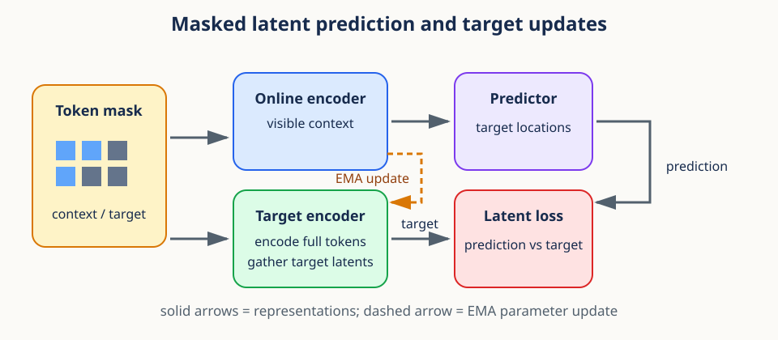
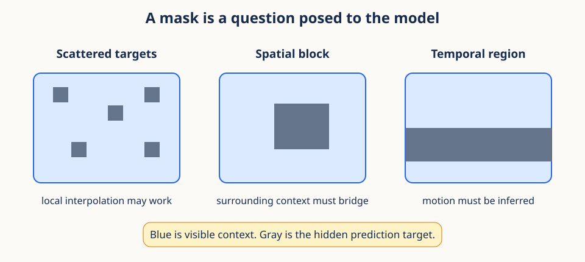
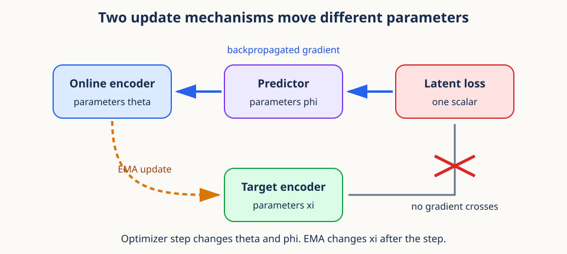

# 05. Masked latent prediction and target updates



## Begin with prediction, not reconstruction

Cover the middle second of a three-second video showing a ball in flight. A learner sees
the ball rising before the gap and falling after it. What should the learner predict?
It could reproduce every hidden pixel, including texture, lighting noise, and background
detail. Or it could predict a compact representation that captures the more stable fact:
the hidden region contains the ball near the top of its trajectory.

Masked latent prediction takes the second route. It hides part of an input, encodes the
visible part, and predicts **features** of the hidden part rather than the raw hidden
measurements. The task creates supervision from the input itself, so no human class label
is required.

Three questions organize the method:

1. What evidence is visible?
2. What representation should be predicted at hidden locations?
3. How can that target evolve without simply chasing the current prediction?

The mask answers the first question. A slowly updated target encoder answers the second.
A stop-gradient boundary and two distinct update mechanisms answer the third.

## Prerequisites

You should understand token sequences and basic neural-network modules. This lesson
introduces the small amount of gradient and optimizer machinery it uses. Review
[04. Attention and positional representations](04_attention_and_positions.md).

## Learning goals

By the end of this lesson, you will be able to:

1. Separate visible context tokens from hidden target tokens.
2. Explain why latent prediction differs from reconstructing raw inputs.
3. Construct random and block masks with explicit geometry.
4. Describe stop-gradient as a boundary in the computation graph.
5. Distinguish online, predictor, and target parameters.
6. Derive and implement an exponential moving average target update.
7. Export deterministic frozen features with an explicit inference contract.

## 1. Prediction as a representation-learning signal

Supervised learning uses labels chosen by humans. Self-supervised learning constructs a
learning problem from the data itself. One useful problem is: observe part of an input,
then predict a representation of a hidden part.

Let a tokenized sample be

$$
X=(x_1,x_2,\ldots,x_N),\qquad x_n\in\mathbb{R}^{D_{in}}.
$$

A mask divides token indices into visible context $C$ and hidden targets $M$, with
$C\cap M=\varnothing$. Usually $C\cup M$ covers all eligible tokens.

The set $C$ contains **context indices**, and $M$ contains **target indices**. The symbols
refer to locations, while $X_C$ and $X_M$ refer to token values gathered from those
locations. Keeping indices separate from values prevents a common confusion: the predictor
may know where a target belongs without seeing the target's hidden content.

The disjointness condition means no eligible token is both evidence and target. Coverage
means every eligible token receives one role. Some systems may exclude padding or invalid
regions from both sets, so coverage should always be stated relative to eligible tokens.

This is a conditional prediction problem. The model is not asked to memorize an isolated
target. It estimates what target features are plausible given visible evidence and target
location. Mask design determines how informative that evidence is.

## 2. The three learned components

Masked latent prediction commonly uses:

1. An **online encoder** $f_\theta$ that processes visible context.
2. A **predictor** $g_\phi$ that predicts hidden target representations from context.
3. A **target encoder** $f_\xi$ that creates the representations to predict.

The online context is

$$
Z_C=f_\theta(X_C).
$$

The target encoder represents the hidden locations:

$$
Z_M^{\text{target}}=f_\xi(X)_M.
$$

The predictor receives context representations and target-location information:

$$
\widehat Z_M=g_\phi(Z_C, M).
$$

A simple loss is average squared error in representation space:

$$
\mathcal{L}=\frac{1}{|M|D}\sum_{m\in M}
\lVert\widehat z_m-z_m^{\text{target}}\rVert_2^2.
$$

Absolute error or normalized cosine losses are also possible. The choice changes which
errors and feature scales matter.

Here $f_\theta$ is the online encoder with parameters $\theta$, $g_\phi$ is the predictor
with parameters $\phi$, and $f_\xi$ is the target encoder with parameters $\xi$. The hat
on $\widehat Z_M$ marks a prediction. The superscript on $Z_M^{\text{target}}$ marks the
reference used to score it. Both tensors must use the same target order and feature width.

Read the loss as an average at three levels. For each target location $m$, the squared
norm adds errors across $D$ feature coordinates. The outer sum adds errors across hidden
locations. Division by $|M|D$ makes the scale roughly comparable when target count or
feature width changes.

The target encoder processes the full eligible token sequence and only then gathers
target locations. Giving it complete input is acceptable because its output is a training
target, not evidence available to the online predictor. At inference, the target branch
may be absent entirely depending on the downstream use.

## 3. Why predict latent representations?

Raw reconstruction asks a model to reproduce every pixel or sample. Fine texture, sensor
noise, and other details can dominate a pixel loss even when they are not semantically
important. A learned target representation can emphasize more stable structure.

This is not automatic. The target encoder and training dynamics determine what the
latent space preserves. Latent prediction shifts the learning target from input units to
features, but it still needs architectural and optimization choices that avoid trivial
solutions.

Raw reconstruction has a clear target but may spend capacity on details irrelevant to
the intended representation. Latent prediction can suppress some nuisance detail because
the target encoder transforms the input first. It also introduces a new risk: the target
features themselves are learned and could become uninformative.

This tradeoff is central. The system needs a target that is learnable from context yet
rich enough to retain useful variation. A task that is impossible supplies noisy training
signals. A task solvable by a constant or local shortcut supplies little representation
pressure. Mask geometry, target dynamics, and evaluation must be considered together.

**Conceptual checkpoint.** A latent target is not a ground-truth semantic label. It is a
moving feature reference generated by another branch of the system. Its usefulness must
be demonstrated through representation diagnostics and downstream behavior.

## 4. Context and target tokens

If `tokens` has shape `(B,N,D)`, Boolean masks with shape `(B,N)` can identify roles.
When each batch member has the same number of selected tokens, gather produces dense
tensors `(B,N_context,D)` and `(B,N_target,D)`.

```python
import torch

def gather_tokens(tokens, indices):
    expanded = indices.unsqueeze(-1).expand(-1, -1, tokens.shape[-1])
    return torch.gather(tokens, 1, expanded)
```

Different counts per batch member require padding plus a validity mask, a packed
representation, or processing samples separately. Dense equal-count masks are convenient
because their shapes are static and vectorize well.

Gathering changes the token axis from all $N$ tokens to a selected count. It should not
change batch order or feature width. If context indices have shape `(B,N_context)`, then
online context has shape `(B,N_context,D)`. If target indices have shape `(B,N_target)`,
both target features and predictions should have shape `(B,N_target,D_target)`.

Index order becomes part of the contract. If target features are gathered in order
`[5, 9, 6]` but predictor queries are ordered `[5, 6, 9]`, equal shapes conceal incorrect
pairings. Test a tiny example whose token values visibly encode their original indices.

## 5. Mask geometry defines task difficulty



An independent random mask hides scattered tokens. Nearby visible tokens may make each
target easy to interpolate. A contiguous block mask removes a region, forcing the model
to use longer-range context.

For a two-dimensional token grid of height $H'$ and width $W'$, a block from rows
$r_0:r_1$ and columns $c_0:c_1$ maps to flattened indices

$$
m=rW'+c.
$$

For a video grid, include time:

$$
m=(tH'+r)W'+c.
$$

Mask design controls:

- target fraction;
- number and size of blocks;
- overlap among blocks;
- temporal duration and spatial extent;
- whether context surrounds, precedes, or excludes the target;
- whether every batch member uses independent geometry.

The mask is therefore part of the learning objective, not mere data plumbing.

A scattered mask often leaves a close visible neighbor beside each target. This can be
useful for learning fine local continuity, but it may permit interpolation shortcuts. A
compact spatial block removes nearby evidence in two dimensions. A temporal block asks
the model to infer motion across a gap. None is universally best because each defines a
different conditional prediction problem.

Mask fraction alone does not specify difficulty. Hiding 50 percent as isolated checkerboard
cells is different from hiding one contiguous half. Geometry, temporal direction, block
overlap, and the data's own redundancy all matter. Record these choices as part of the
experimental method.

The location mapping comes from Lesson 01. In $m=(tH'+r)W'+c$, one time slice contains
$H'W'$ positions. The term $tH'+r$ counts completed rows across time slices, and
multiplication by $W'$ converts rows to scalar sequence positions. Adding column $c$
selects the final location.

## 6. A block-mask implementation

```python
def rectangular_mask(height, width, top, left, block_h, block_w):
    mask = torch.zeros(height, width, dtype=torch.bool)
    mask[top:top + block_h, left:left + block_w] = True
    return mask.flatten()

target_mask = rectangular_mask(6, 8, top=2, left=3, block_h=2, block_w=3)
context_mask = ~target_mask
assert target_mask.sum() == 6
assert not (target_mask & context_mask).any()
```

This function uses half-open Python slices. A block beginning at row 2 with height 2
contains rows 2 and 3, not row 4. The same rule applies to columns. Half-open ranges make
the element count equal to `stop - start` and compose naturally with array shapes.

Vectorized random masks can use `torch.rand(B,N).argsort(dim=1)` and select a fixed
number of indices. `torch.randperm` is convenient for one sample but a Python loop over
large batches is slower. Deterministic generators make masks reproducible.

Reproducibility requires more than a global seed if data loading is parallel. Give mask
generation an explicit random generator or documented seed derivation per sample and
epoch. Reusing exactly the same mask forever may reduce task diversity, while uncontrolled
randomness makes comparisons hard to reproduce.

## 7. Minimal training primer: autograd and optimizers

A neural network contains adjustable numbers called **parameters**. In PyTorch, a
parameter with `requires_grad=True` asks autograd to remember the operations that use it.
Those recorded operations form a computation graph from parameters to predictions and
then to a loss.

The loss is normally one scalar. It answers, "How wrong was this forward pass?" For a
single weight $w$, input $x$, target $y$, and squared-error loss,

$$
\widehat y=wx,\qquad \mathcal{L}=\frac{1}{2}(\widehat y-y)^2.
$$

Autograd applies the chain rule backward through the recorded graph:

$$
\frac{\partial\mathcal{L}}{\partial w}=(wx-y)x.
$$

A standard PyTorch update has four explicit operations:

```python
optimizer.zero_grad(set_to_none=True)  # clear gradients left by the prior step
prediction = model(inputs)             # forward pass builds the graph
loss = loss_function(prediction, targets)  # reduce errors to one scalar
loss.backward()                        # write gradients into parameter.grad
optimizer.step()                       # use those gradients to change parameters
```

Gradients accumulate when `backward()` is called repeatedly, so `zero_grad` starts a
new update cleanly. `backward()` computes gradients but does not change parameters.
`step()` changes the parameters according to an update rule such as SGD or Adam.

The derivative measures local sensitivity: how much the loss changes for a small parameter
change. The gradient collects one derivative per parameter. An optimizer combines that
gradient with a learning rate and possibly running statistics to propose an update. This
is different from the target encoder's moving-average update, which uses parameter values
rather than loss gradients.

It helps to separate the **forward graph** from the **parameter update rule**. The forward
graph produces representations and loss. Backpropagation traverses permitted edges to
compute gradients. Only after that does the optimizer mutate selected parameters. A
tensor can participate in the forward loss while being deliberately excluded from gradient
updates.

**Stop-gradient** cuts selected edges in this graph. The forward value still exists,
but backpropagation cannot cross the cut. In this lesson, the prediction loss sends
gradients through the predictor and online encoder, while the target branch is held
constant for that optimizer step. The target encoder is updated separately by EMA.

## 8. Stop-gradient sets the optimization direction



If both sides of the loss receive ordinary gradients, the target representation moves
immediately in response to the same loss that trains the predictor. This can create an
unstable moving target or allow coupled shortcuts.

Stop-gradient treats the target representation as a constant during backpropagation:

$$
\widetilde Z_M=\mathrm{stopgrad}(f_\xi(X)_M).
$$

The forward value is unchanged, but

$$
\frac{\partial\,\mathrm{stopgrad}(z)}{\partial z}=0.
$$

In PyTorch:

```python
with torch.no_grad():
    target = target_encoder(tokens)

# or, for an already computed tensor
target = target.detach()
```

`torch.no_grad()` prevents graph construction throughout the block and saves memory.
`detach()` creates a view that shares storage but has no gradient history. Do not mutate
a detached view in place if the original value is still needed.

Stop-gradient changes derivatives without changing the forward number. The loss still
compares prediction and target values. During backward computation, however, target
values are treated as constants. The predictor and online encoder must move toward the
current target; the target does not move through that same loss path.

This asymmetry prevents a simultaneous gradient negotiation in which both sides can reduce
loss by moving together. It does not make the target permanently fixed. The separate EMA
rule changes target parameters after the online optimizer step.

Do not confuse `eval()` with stop-gradient. Evaluation mode changes behaviors such as
dropout and some normalization layers, but parameters can still receive gradients.
`no_grad()` or `detach()` controls graph construction; `requires_grad_(False)` controls
whether target parameters accumulate gradients. Conversely, `no_grad()` does not disable
dropout or prevent running-statistic buffers from changing in training mode. Choose the
target branch's mode deliberately and include any stateful buffers in the update policy.

## 9. Online and target encoders have different updates

The online parameters $\theta$ and predictor parameters $\phi$ are updated by an optimizer:

$$
\theta\leftarrow\theta-\eta\nabla_\theta\mathcal{L},\qquad
\phi\leftarrow\phi-\eta\nabla_\phi\mathcal{L}.
$$

The target parameters $\xi$ receive no gradient. Instead, they follow the online encoder
through an exponential moving average:

$$
\xi\leftarrow\tau\xi+(1-\tau)\theta,
$$

where $0\leq\tau<1$ is the momentum coefficient.

When $\tau$ is close to 1, the target changes slowly. This supplies a smoother target
than copying the online encoder after every noisy optimizer step.

The symbol $\eta$ is the optimizer learning rate. The gradients
$\nabla_\theta\mathcal{L}$ and $\nabla_\phi\mathcal{L}$ describe loss sensitivity with
respect to online and predictor parameters. By contrast, the target rule contains no
loss derivative. It blends old target value $\xi$ with new online value $\theta$.

For one scalar parameter, let the old target be 2, the updated online value be 6, and
$\tau=0.75$. The new target is $0.75(2)+0.25(6)=3$. It moves one quarter of the gap toward
the online value. Repeating this process tracks persistent changes while smoothing
step-to-step noise.

## 10. Understanding the exponential moving average

Repeated substitution shows that after $k$ updates,

$$
\xi_k=\tau^k\xi_0+(1-\tau)\sum_{j=1}^{k}\tau^{k-j}\theta_j.
$$

Recent online states have larger weights, and older states decay geometrically.
The weights sum to $1-\tau^k$ plus the initial weight $\tau^k$. Because every coefficient
is nonnegative when $0\leq\tau<1$, the target is a convex combination of parameter states.

An intuitive memory scale is approximately $1/(1-\tau)$ updates. With $\tau=0.99$, it
is about 100 updates. With $\tau=0.999$, it is about 1,000 updates. This is only a rough
interpretation because online parameters themselves change over time.

The expanded equation assigns current online state $\theta_k$ weight $1-\tau$. The
previous state $\theta_{k-1}$ receives $(1-\tau)\tau$, and each earlier state gains one
more factor of $\tau$. The initial target keeps weight $\tau^k$. These weights sum to one,
which is why the update remains between the parameter states when $0\leq\tau<1$.

A momentum schedule may increase $\tau$ during training, making targets progressively
slower. If a schedule is used, the simple fixed $\tau$ expansion no longer applies
unchanged because every step has its own multiplier. The implementation and explanation
should state whether momentum is constant or scheduled.

## 11. Correct EMA implementation

Initialize target parameters from the online encoder, disable their gradients, and pair
parameters by matching structure:

```python
target_encoder.load_state_dict(online_encoder.state_dict())
for parameter in target_encoder.parameters():
    parameter.requires_grad_(False)

@torch.no_grad()
def ema_update(online, target, tau):
    for online_p, target_p in zip(online.parameters(), target.parameters(), strict=True):
        target_p.mul_(tau).add_(online_p, alpha=1.0 - tau)
```

`mul_` and `add_` update in place, avoiding new parameter tensors. The `alpha` argument
fuses scaling into the addition. `strict=True` catches unequal parameter counts in modern
Python. For modules with important floating-point buffers, such as running statistics,
decide whether to copy or average them too. `state_dict` names provide a safer matching
strategy when architectures might differ.

Initialization by exact copy gives both encoders the same coordinate system before the
first loss. If they begin independently, matching feature coordinate 7 on one branch to
coordinate 7 on the other has no reason to be meaningful. The EMA then preserves a
slowly lagged version of this shared parameterization.

The in-place update must run outside autograd, which the decorator enforces. Pairing by
position is safe only when module structures match exactly. For long-lived systems,
matching named parameters and asserting names and shapes gives a more explicit contract.

## 12. A minimal learning step

```python
optimizer.zero_grad(set_to_none=True)
context = gather_tokens(tokens, context_indices)
online_context = online_encoder(context)
prediction = predictor(online_context, target_indices)

with torch.no_grad():
    all_targets = target_encoder(tokens)
    target = gather_tokens(all_targets, target_indices)

loss = torch.nn.functional.mse_loss(prediction, target)
loss.backward()
optimizer.step()
ema_update(online_encoder, target_encoder, tau=0.99)
```

`zero_grad(set_to_none=True)` can reduce memory writes. The EMA update belongs after the
online optimizer step if the target should incorporate the newest online parameters.
The predictor shown abstractly must receive location information; otherwise one pooled
context vector cannot produce distinct target-location predictions.

The order is part of the algorithm. First clear stale gradients. Then build online
predictions and target references. Next compute one loss and backpropagate only through
the online path. The optimizer changes $\theta$ and $\phi$. Finally, EMA uses the newly
updated $\theta$ to change $\xi$. Moving EMA before the optimizer would make the target
lag a different sequence of online states.

Assert `prediction.shape == target.shape` before loss. Broadcasting is helpful for many
array operations but dangerous here because it can compare one target against multiple
predictions without an error. Also check that both tensors are finite and that the target
branch has no accumulated gradients.

## 13. Frozen inference and feature export

Training and feature export use the same encoder but require different execution
contracts. During training, the online branch builds an autograd graph and some modules
may behave stochastically. During export, the model must be frozen, deterministic, and
cheap to execute. Three controls address different parts of that requirement:

1. `model.eval()` selects evaluation behavior for modules such as dropout and batch
   normalization.
2. `model.requires_grad_(False)` records that parameters are not trainable and prevents
   parameter gradients from being accumulated.
3. `torch.inference_mode()` disables autograd recording and additional tensor version
   bookkeeping for the decorated computation.

None of these operations implies the other two. Evaluation mode does not disable
gradients. Disabling parameter gradients does not switch off dropout. An inference-mode
block does not permanently change how modules behave after the block exits. A robust
export path declares all three intentions instead of relying on an accidental default.

`torch.inference_mode()` is stronger than `torch.no_grad()`. Both prevent an autograd
graph from being recorded. Inference mode can remove more overhead because tensors
created inside it do not participate in ordinary autograd version tracking. That makes it
well suited to a terminal export pipeline. Use `no_grad()` when values created inside the
block must later re-enter a gradient-tracked calculation; use inference mode when the
result is leaving the training computation entirely.

Restore checkpoints strictly before exporting:

```python
encoder.load_state_dict(checkpoint, strict=True)
encoder.requires_grad_(False).eval()

@torch.inference_mode()
def export_batch(encoder, video):
    normalized, pre_norm = encoder(video, return_pre_norm=True)
    if pre_norm.ndim != 3:
        raise ValueError("expected pre-normalization tokens with shape [B, N, D]")
    features = pre_norm.mean(dim=1)
    if not torch.isfinite(features).all():
        raise FloatingPointError("encoder returned non-finite features")
    return features.float().cpu().numpy()
```

Strict loading rejects missing or unexpected parameter names instead of silently
exporting from a partly initialized model. The selected representation is also part of
the contract. Pooling `pre_norm` tokens and pooling normalized tokens are different
feature definitions even when both produce shape `(B,D)`.

The conversion chain is deliberate. `mean(dim=1)` pools tokens while preserving batch
and feature axes. `float()` chooses float32 as the interchange type. `cpu()` transfers
accelerator data to host memory. Only then can `numpy()` expose the storage as a NumPy
array. Calling `.numpy()` directly on a CUDA tensor fails, and calling it on a tensor that
requires gradients can expose an ambiguous boundary unless it is detached first.

Feature export should be tested as a deterministic function. Run the same fixed batch
twice, assert exact or justified close agreement, verify shapes and finite values, and
record the feature definition beside the output. Determinism tests do not prove semantic
quality, but they do catch active dropout, inconsistent checkpoint restoration, changing
pooling rules, and unintended dtype or device behavior.

## 14. A simple predictor with target queries

For teaching purposes, summarize context by its mean and combine it with a learned or
fixed embedding $p_m$ for each target location:

$$
c=\frac{1}{|C|}\sum_{i\in C}z_i,\qquad
\widehat z_m=\mathrm{MLP}([c;p_m]).
$$

This makes the role of position explicit. A more capable predictor can use cross-attention:
target-location queries attend to all context representations.

Mean pooling discards relations among context tokens, so it is a baseline rather than a
strong universal design. It is useful for isolating the training mechanics.

The vector $c$ is a global summary of visible context. The vector $p_m$ identifies which
hidden location is being requested. Brackets $[c;p_m]$ mean concatenation, not a set.
Without $p_m$, every target request receives the same input and a deterministic predictor
must emit the same feature for every location.

Cross-attention offers a richer alternative. Each target location produces a query,
while context features produce keys and values. Target queries can then read different
parts of context rather than sharing one pooled summary. This reuses the mechanism from
Lesson 04 while keeping hidden target content out of the predictor input.

## 15. Collapse and asymmetry

A trivial constant representation makes every target easy to predict. If both encoders
map every input to the same vector, a prediction loss alone may be small without useful
features. Stop-gradient, a delayed target encoder, architectural asymmetry, normalization,
and sufficiently informative masking all influence whether collapse occurs.

No one component is a universal proof against collapse. Monitor feature standard
deviations, covariance spectra, and downstream utility. A falling training loss by itself
does not prove that representations are informative.

Collapse is easy to see in the squared loss. If target and prediction are always the same
constant vector, their error is zero for every sample, yet the representation distinguishes
nothing. The learning objective needs training dynamics or additional constraints that
make this state unattractive or unreachable in practice.

Non-collapse also does not guarantee useful semantics. Random high-variance features can
avoid a constant solution while failing downstream tasks. Diagnostics should examine
variation, redundancy, stability, and task-relevant information rather than relying on one
number. Lesson 06 develops these representation checks in detail.

## 16. Worked example

Suppose a $4\times4$ grid gives $N=16$ tokens, each with width 32. Hide the center
$2\times2$ block at rows 1 to 2 and columns 1 to 2.

1. Target coordinates are `(1,1)`, `(1,2)`, `(2,1)`, `(2,2)`.
2. Flattened target indices are 5, 6, 9, and 10.
3. The context contains 12 tokens.
4. Context shape is `(B,12,32)`; target shape is `(B,4,32)`.
5. Predictor output and target representation must have exactly the same shape.
6. Gradients reach the online encoder and predictor, not the target encoder.
7. After the optimizer step, EMA moves every target parameter toward its online partner.

Suppose the predictor outputs zero vectors and each target coordinate has mean squared
magnitude 0.5. The initial mean-squared loss is 0.5. A lower loss after training means
predictions approach current target features, but it does not by itself tell us whether
those features distinguish inputs. That requires separate representation evidence.

Now compare a scattered four-token mask with the center block. Both hide 25 percent of
the grid, yet the scattered targets may each border visible tokens on all sides. Equal
mask fraction therefore does not imply equal prediction difficulty or equal learned
invariances.

## 17. Efficiency notes and failure modes

- Encode all target tokens once, then gather, rather than re-encoding each target block.
- Run the target branch inside `torch.no_grad()` to avoid storing activations for backward.
- Use `torch.inference_mode()` for terminal frozen export, and keep `eval()` and
  `requires_grad_(False)` explicit because they control different behavior.
- Use `expand` rather than `repeat` for gather indices.
- Avoid CPU-GPU mask transfers in a training loop; create masks on the data device.
- Verify context and target sets are disjoint and nonempty.
- Copy online weights into the target before training; unrelated initialization is unstable.
- Never include target parameters in the gradient optimizer.
- Update EMA parameters and relevant buffers consistently.
- A mask that leaks hidden token content makes the prediction problem trivial.
- A target fraction near zero gives little learning signal; near one leaves insufficient context.

Efficiency and correctness often align here. Encoding the full target once avoids
duplicate computation and guarantees a consistent target representation before gathering.
Keeping mask tensors on the accelerator avoids synchronization. Using `no_grad()` removes
unneeded activation storage and makes the intended update boundary explicit.

A less obvious failure is using augmentations that reveal target content through the
context branch or misalign online and target coordinates. If branches see different
views, define the geometric correspondence precisely. A target index must refer to the
same underlying region that the predictor query names.

## Exercises

### Exercise 1

For a $3\times5$ grid, flatten coordinates `(2,3)` and invert the result.

**Brief solution:** index $2\cdot5+3=13$; `13 // 5 = 2` and `13 % 5 = 3`.

### Exercise 2

If $\tau=0.9$, what weights do the current and immediately previous online states receive
after expanding the EMA recursion?

**Brief solution:** the current state has weight 0.1 and the previous state has weight
$0.1\cdot0.9=0.09$, before considering initialization and older states.

### Exercise 3

Why should target and prediction tensors be asserted to have equal shapes before loss?

**Brief solution:** broadcasting could otherwise create a valid numeric result that compares
the wrong token or feature axes.

### Exercise 4

The old target parameter is 4, the updated online parameter is 10, and $\tau=0.9$.
Compute the new target and interpret the result.

**Brief solution:** $0.9(4)+0.1(10)=4.6$. The target closes 10 percent of the current
gap toward the online parameter.

### Exercise 5

Two masks each hide 16 of 64 tokens. One is a checkerboard and one is a contiguous
$4\times4$ block. Explain why equal target count does not define the same task.

**Brief solution:** the checkerboard leaves close visible neighbors around targets,
while the block removes nearby evidence and requires longer-range inference. Geometry
changes the conditional information available.

### Exercise 6

Why does `encoder.eval()` alone not define a frozen feature exporter?

**Brief solution:** it changes training-dependent module behavior but does not disable
autograd, freeze parameters, validate checkpoint completeness, select the exported tensor,
or define the dtype and device conversion into NumPy.

## Recap

Masked latent prediction learns by inferring hidden representations from visible context.
Mask geometry defines what evidence is available. Stop-gradient makes the optimization
direction asymmetric, and EMA turns the target encoder into a slow temporal ensemble of
online states. Correct shapes, location information, explicit gradient boundaries, and a
separate frozen-inference contract are central to a sound implementation.

Next: [06. Representation collapse and variance-covariance regularization](06_representation_collapse.md).

## Continue in the notebook

Run the [masked latent prediction notebook](../implementations/05_masked_latent_prediction.ipynb) before moving to Lesson 06.
