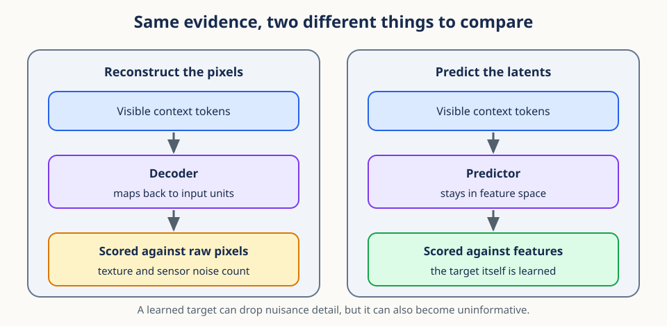
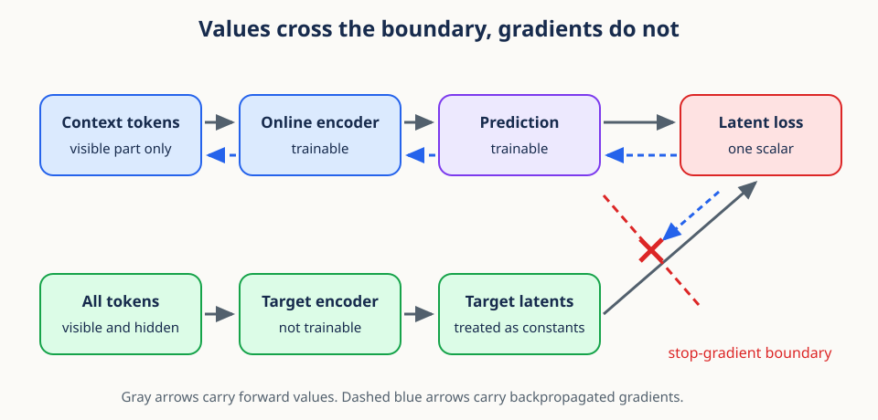
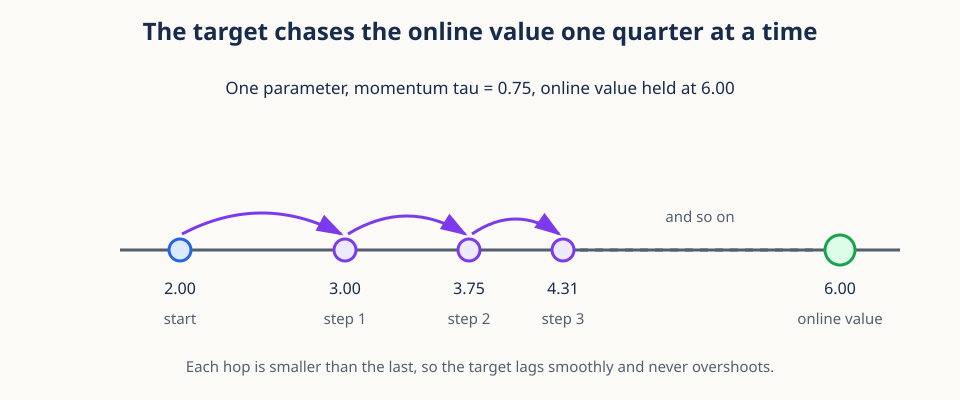

# 05. Masked latent prediction and target updates


## Begin with prediction, not reconstruction

Cover the middle second of a three-second video of a ball in flight. A learner sees the ball
rising before the gap and falling after it. What should the learner be asked to predict? It
could reproduce every hidden pixel, including texture, lighting noise, and background
detail. Or it could predict a compact description of the hidden region that captures the
more stable fact: the ball is near the top of its arc.

Masked latent prediction takes the second route. It hides part of an input, encodes the
visible part, and predicts **features** of the hidden part rather than the raw hidden
measurements. Because the supervision comes from the input itself, no human class label is
needed anywhere in the loop.

Three questions organize the whole method, and the rest of this lesson answers them in
order:

1. What evidence is visible?
2. What representation should be predicted at the hidden locations?
3. How can that target change over time without simply chasing the current prediction?

The mask answers the first. A slowly updated target encoder answers the second. A
stop-gradient boundary plus a separate parameter update rule answers the third.

## Prerequisites

You should understand token sequences and basic neural-network modules. This lesson
introduces the small amount of gradient and optimizer machinery it needs, so you do not have
to arrive with it. Review
[04. Attention and positional representations](04_attention_and_positions.md), because the
predictor in section 14 reuses cross-attention from that lesson.

## Learning goals

By the end of this lesson, you will be able to:

1. Separate visible context tokens from hidden target tokens.
2. Explain why latent prediction differs from reconstructing raw inputs.
3. Construct random and block masks with explicit geometry.
4. Describe stop-gradient as a boundary in the computation graph.
5. Distinguish online, predictor, and target parameters.
6. Derive and implement an exponential moving average target update.
7. Export deterministic frozen features with an explicit inference contract.

## 1. Prediction as a representation-learning signal

Supervised learning uses labels chosen by humans. Self-supervised learning manufactures a
learning problem from the data itself, and the problem we use here is: observe part of an
input, then predict a representation of a hidden part.

Write a tokenized sample as

$$
X=(x_1,x_2,\ldots,x_N),\qquad x_n\in\mathbb{R}^{D_{in}},
$$

where $N$ is the number of tokens and $D_{in}$ is the width of one raw token. A mask splits
the token indices into a visible context set $C$ and a hidden target set $M$, with
$C\cap M=\varnothing$. Usually $C\cup M$ covers all eligible tokens.

Keep two things apart here, because conflating them causes real bugs. The sets $C$ and $M$
contain **indices**, meaning locations. The expressions $X_C$ and $X_M$ denote the token
**values** gathered from those locations. The predictor is allowed to know where a target
belongs while never seeing what is there, and that is only expressible if locations and
values are separate objects.

The two conditions on the split have plain readings. Disjointness means no eligible token
serves as both evidence and target. Coverage means every eligible token receives one role.
Some systems exclude padding or invalid regions from both sets, so coverage should always
be stated relative to the eligible tokens rather than to all tokens.

What we have defined is a conditional prediction problem. The model is not asked to memorize
an isolated target. It estimates what target features are plausible given the visible
evidence and the target location. How informative that evidence is depends entirely on how
the mask is drawn, which is the subject of section 5.

## 2. The three learned components

The method needs three pieces, and naming them precisely now will make the update rules in
sections 8 and 9 easy to follow:

1. An **online encoder** $f_\theta$ with parameters $\theta$, which processes visible context.
2. A **predictor** $g_\phi$ with parameters $\phi$, which predicts hidden target representations.
3. A **target encoder** $f_\xi$ with parameters $\xi$, which creates the representations to predict.

The online branch encodes only what is visible:

$$
Z_C=f_\theta(X_C).
$$

The target branch encodes the full sequence and then keeps the hidden locations:

$$
Z_M^{\text{target}}=f_\xi(X)_M.
$$

The predictor receives the context representations and information about which locations are
being asked for:

$$
\widehat Z_M=g_\phi(Z_C, M).
$$

The hat on $\widehat Z_M$ marks a prediction, and the superscript on $Z_M^{\text{target}}$
marks the reference used to score it. Both tensors must use the same target order and the
same feature width, or the comparison below is meaningless even when it runs without error.

A simple loss is the average squared error in representation space:

$$
\mathcal{L}=\frac{1}{|M|D}\sum_{m\in M}
\lVert\widehat z_m-z_m^{\text{target}}\rVert_2^2.
$$

Read that as an average at three levels. The squared norm adds errors across the $D$ feature
coordinates of one location. The sum adds errors across the hidden locations $m\in M$.
Dividing by $|M|D$ keeps the scale roughly comparable when the target count or the feature
width changes. Absolute error and normalized cosine losses are also used, and the choice
changes which errors and which feature scales matter.

One design point deserves a note. The target encoder sees the complete eligible sequence and
only afterward gathers the target locations. That is acceptable because its output is a
training target rather than evidence available to the predictor. At inference the target
branch may be absent entirely, depending on the downstream use.

## 3. Why predict latent representations?

The name of the method contains its central bet, so it is worth stating the alternative side
by side. Raw reconstruction asks the model to reproduce every pixel or sample. Fine texture,
sensor noise, and similar detail can dominate a pixel loss even when they carry nothing the
representation should care about. A learned target representation can emphasize more stable
structure instead.



The figure makes the difference concrete: the evidence is identical on both sides, and only
the thing being compared changes. That single change moves the learning target from input
units to feature units.

Nothing about this is automatic. Latent prediction can suppress nuisance detail because the
target encoder transforms the input first, but it also introduces a new risk, namely that
the learned target features become uninformative. Raw reconstruction has a fixed, honest
target and may waste capacity; latent prediction has a flexible target and may waste the
target.

That tradeoff is the design problem. The system needs a target that is learnable from
context yet rich enough to retain useful variation. A task that is impossible supplies noisy
training signal. A task solvable by a constant or by a local shortcut supplies almost no
representation pressure. Mask geometry, target dynamics, and evaluation therefore have to be
chosen together rather than one at a time.

**Conceptual checkpoint.** A latent target is not a ground-truth semantic label. It is a
moving feature reference generated by another branch of the same system. Its usefulness has
to be demonstrated through representation diagnostics and downstream behavior, never assumed.

## 4. Context and target tokens

With the roles defined, the implementation question is how to move from a Boolean mask to
dense tensors the network can consume. If `tokens` has shape `(B,N,D)`, Boolean masks of
shape `(B,N)` identify the roles, and when each batch member selects the same number of
tokens a gather produces dense tensors `(B,N_context,D)` and `(B,N_target,D)`.

```python
import torch

def gather_tokens(tokens, indices):
    expanded = indices.unsqueeze(-1).expand(-1, -1, tokens.shape[-1])
    return torch.gather(tokens, 1, expanded)
```

Gathering changes the token axis from all $N$ tokens to the selected count. It must not
change batch order or feature width. If context indices have shape `(B,N_context)`, the
online context has shape `(B,N_context,D)`. If target indices have shape `(B,N_target)`,
both the target features and the predictions must have shape `(B,N_target,D_target)`.

Different counts per batch member require padding plus a validity mask, a packed
representation, or per-sample processing. Dense equal-count masks are convenient precisely
because their shapes are static, which vectorizes well and makes shape assertions meaningful.

The subtle contract is index order, not shape. If the target features are gathered in the
order `[5, 9, 6]` while the predictor queries are ordered `[5, 6, 9]`, the shapes agree and
the pairing is wrong. Test this with a tiny example whose token values visibly encode their
original indices, so a mismatch shows up as an obviously scrambled tensor.

## 5. Mask geometry defines task difficulty

Section 1 said the mask decides how informative the evidence is. Here is why. An independent
random mask hides scattered tokens, and a visible neighbor usually sits right beside each
target, so interpolation may be enough. A contiguous block mask removes a whole region, which
deletes the nearby evidence and forces the model to use longer-range context.


For a two-dimensional token grid of height $H'$ and width $W'$, a block spanning rows
$r_0:r_1$ and columns $c_0:c_1$ maps to the flattened indices

$$
m=rW'+c.
$$

For a video grid, time joins the calculation:

$$
m=(tH'+r)W'+c.
$$

This mapping comes from Lesson 01. Read it from the inside out: one time slice contains
$H'W'$ positions, the term $tH'+r$ counts completed rows across time slices, multiplying by
$W'$ converts a row count into a scalar sequence position, and adding the column $c$ selects
the final location.

Mask design controls all of the following:

- target fraction;
- number and size of blocks;
- overlap among blocks;
- temporal duration and spatial extent;
- whether context surrounds, precedes, or excludes the target;
- whether every batch member uses independent geometry.

The mask is therefore part of the learning objective, not data plumbing. In particular, the
mask fraction alone does not specify difficulty. Hiding 50 percent as isolated checkerboard
cells is a different problem from hiding one contiguous half. Geometry, temporal direction,
block overlap, and the redundancy already present in the data all matter, so record these
choices as part of the experimental method.

None of the three geometries is universally best. A scattered mask can be useful for learning
fine local continuity. A compact spatial block removes nearby evidence in two dimensions. A
temporal block asks the model to infer motion across a gap. Each one defines a different
conditional prediction problem, and the right choice follows from what you want the
representation to encode.

## 6. A block-mask implementation

```python
def rectangular_mask(height, width, top, left, block_h, block_w):
    mask = torch.zeros(height, width, dtype=torch.bool)
    mask[top:top + block_h, left:left + block_w] = True
    return mask.flatten()

target_mask = rectangular_mask(6, 8, top=2, left=3, block_h=2, block_w=3)
context_mask = ~target_mask
assert target_mask.sum() == 6
assert not (target_mask & context_mask).any()
```

The function uses half-open Python slices, so a block starting at row 2 with height 2
contains rows 2 and 3, not row 4, and the same rule applies to columns. Half-open ranges make
the element count equal to `stop - start`, which composes naturally with array shapes and
with the flattening formula above.

Random masks can be vectorized with `torch.rand(B,N).argsort(dim=1)` followed by selecting a
fixed number of indices. `torch.randperm` is convenient for one sample, but a Python loop
over a large batch is slow. Whichever you use, pass an explicit generator so the masks are
reproducible.

Reproducibility needs more than a global seed once data loading is parallel. Give mask
generation an explicit random generator, or a documented rule for deriving a seed per sample
and epoch. Reusing exactly one mask forever reduces task diversity, while uncontrolled
randomness makes comparisons impossible to reproduce, so neither extreme is acceptable.

There is a stronger requirement when two training conditions are meant to differ in only one
intervention. Use separate named random streams for sequence draws, temporal windows,
spatial transforms, and masks, and pair the nuisance streams across the two conditions. Both
conditions can then receive the same ordered sequences, the same crop parameters, and the
same mask draws while only the temporal-window stream changes. A single shared generator is
fragile: adding one random call to the temporal policy shifts every later crop and mask, so
the contrast you measure is no longer the contrast you intended. Named streams keep the
intervention isolated and make the pairing testable.

## 7. Minimal training primer: autograd and optimizers

The remaining sections all concern how parameters change, so this section fixes the
vocabulary. A neural network contains adjustable numbers called **parameters**. In PyTorch, a
parameter with `requires_grad=True` asks autograd to record the operations that use it, and
those records form a computation graph running from parameters to predictions to a loss.

The loss is normally one scalar answering, "How wrong was this forward pass?" For a single
weight $w$, an input $x$, a target $y$, and squared error,

$$
\widehat y=wx,\qquad \mathcal{L}=\frac{1}{2}(\widehat y-y)^2.
$$

Autograd applies the chain rule backward through the recorded graph, which for this example
gives

$$
\frac{\partial\mathcal{L}}{\partial w}=(wx-y)x.
$$

A standard PyTorch update is four explicit operations, and it helps to name what each one
does and does not do:

```python
optimizer.zero_grad(set_to_none=True)  # clear gradients left by the prior step
prediction = model(inputs)             # forward pass builds the graph
loss = loss_function(prediction, targets)  # reduce errors to one scalar
loss.backward()                        # write gradients into parameter.grad
optimizer.step()                       # use those gradients to change parameters
```

Gradients accumulate when `backward()` is called repeatedly, which is why `zero_grad` starts
each update cleanly. `backward()` computes gradients but changes no parameter.
`step()` changes parameters according to an update rule such as SGD or Adam. The derivative
measures local sensitivity, the gradient collects one derivative per parameter, and the
optimizer combines that gradient with a learning rate and possibly running statistics.

Separating the **forward graph** from the **parameter update rule** is the key idea for this
lesson. The forward graph produces representations and a loss. Backpropagation traverses the
permitted edges of that graph. Only afterward does the optimizer mutate selected parameters.
Nothing prevents a tensor from participating in the forward loss while being deliberately
excluded from gradient flow, and nothing prevents a parameter from changing by a rule that
has no gradient in it at all. Masked latent prediction uses both of those freedoms.

**Stop-gradient** is the tool that cuts selected edges. The forward value still exists, but
backpropagation cannot cross the cut. Here the prediction loss sends gradients through the
predictor and the online encoder, the target branch is held constant for that step, and the
target encoder is updated separately by an exponential moving average.

## 8. Stop-gradient sets the optimization direction

Why cut the graph at all? Because if both sides of the loss receive ordinary gradients, the
target representation moves immediately in response to the same loss that trains the
predictor. That creates a moving target and permits coupled shortcuts in which both sides
reduce the loss by drifting toward each other rather than by learning anything.

Stop-gradient treats the target representation as a constant during backpropagation:

$$
\widetilde Z_M=\mathrm{stopgrad}(f_\xi(X)_M).
$$

The forward value is untouched, but the derivative through that node is defined to be zero:

$$
\frac{\partial\,\mathrm{stopgrad}(z)}{\partial z}=0.
$$



The figure draws that asymmetry on the graph itself. Gray arrows carry forward values and
cross the boundary freely, since the loss genuinely needs the target's numeric value. Dashed
blue arrows carry gradients, and on the target path they stop at the red cross. Predictor and
online encoder must move toward the current target; the target does not move through that
same loss path.

In PyTorch there are two ways to express the cut, and they are not interchangeable:

```python
with torch.no_grad():
    target = target_encoder(tokens)

# or, for an already computed tensor
target = target.detach()
```

`torch.no_grad()` prevents graph construction throughout the block, which also saves the
memory that stored activations would occupy. `detach()` creates a view that shares storage
but carries no gradient history, so do not mutate a detached view in place if the original
value is still needed.

A related distinction trips up almost everyone once. `eval()` is not stop-gradient.
Evaluation mode changes behaviors such as dropout and some normalization layers, while
parameters can still receive gradients. `no_grad()` and `detach()` control graph
construction; `requires_grad_(False)` controls whether parameters accumulate gradients at
all. Going the other way, `no_grad()` does not disable dropout and does not stop
running-statistic buffers from updating in training mode. Choose the target branch's mode
deliberately, and include any stateful buffers in the update policy.

Finally, note what stop-gradient does not do. It does not freeze the target forever. It
prevents a simultaneous gradient negotiation between the two branches within one step. The
target still changes, by the separate rule in the next section.

## 9. Online and target encoders have different updates

The system now has two update mechanisms running side by side. Online and predictor
parameters are updated by the optimizer, using the loss gradients:

$$
\theta\leftarrow\theta-\eta\nabla_\theta\mathcal{L},\qquad
\phi\leftarrow\phi-\eta\nabla_\phi\mathcal{L}.
$$

The symbol $\eta$ is the learning rate, and $\nabla_\theta\mathcal{L}$ and
$\nabla_\phi\mathcal{L}$ are the loss sensitivities with respect to the online and predictor
parameters. The target parameters receive no gradient at all. They follow the online encoder
through an exponential moving average:

$$
\xi\leftarrow\tau\xi+(1-\tau)\theta,
$$

where $\tau$, with $0\leq\tau<1$, is the momentum coefficient. Notice that this rule contains
no loss derivative anywhere. It only blends the old target value with the new online value.


For one scalar parameter, let the old target be 2, the updated online value be 6, and
$\tau=0.75$. The new target is $0.75(2)+0.25(6)=3$, which has moved exactly one quarter of
the gap. When $\tau$ is close to 1, the target changes slowly, which supplies a smoother
reference than copying the online encoder after every noisy optimizer step.



The figure continues that arithmetic for three steps: 2, then 3, then 3.75, then 4.3125. Each
hop is smaller than the last because the remaining gap is smaller, so the target lags
smoothly and never overshoots.

## 10. Understanding the exponential moving average

Repeating the update rule and substituting shows what the target actually holds after $k$
updates, where $\theta_j$ is the online parameter value after update $j$:

$$
\xi_k=\tau^k\xi_0+(1-\tau)\sum_{j=1}^{k}\tau^{k-j}\theta_j.
$$

Read the coefficients. The current online state $\theta_k$ gets weight $1-\tau$. The previous
state $\theta_{k-1}$ gets $(1-\tau)\tau$, and every earlier state picks up one more factor of
$\tau$. The initial target keeps weight $\tau^k$. All the coefficients are nonnegative when
$0\leq\tau<1$ and they sum to one, so the target is always a convex combination of parameter
states, which is why it stays between them.

A useful rule of thumb is that the memory scale is roughly $1/(1-\tau)$ updates. With
$\tau=0.99$ that is about 100 updates, and with $\tau=0.999$ about 1,000. Treat this as a
rough interpretation only, because the online parameters are themselves changing throughout.

Some systems increase $\tau$ during training so that targets grow progressively slower. If a
schedule is used, the expansion above for a fixed $\tau$ no longer applies unchanged, since every
step then has its own multiplier. State explicitly whether momentum is constant or scheduled
in both the implementation and the write-up.

## 11. Correct EMA implementation

The update rule is one line of arithmetic, but three setup details decide whether it means
anything. Initialize the target from the online encoder, disable its gradients, and pair the
parameters by matching structure:

```python
target_encoder.load_state_dict(online_encoder.state_dict())
for parameter in target_encoder.parameters():
    parameter.requires_grad_(False)

@torch.no_grad()
def ema_update(online, target, tau):
    for online_p, target_p in zip(online.parameters(), target.parameters(), strict=True):
        target_p.mul_(tau).add_(online_p, alpha=1.0 - tau)
```

Initialization by exact copy gives both encoders the same coordinate system before the first
loss is computed. If they began independently, there would be no reason for feature
coordinate 7 on one branch to mean anything like feature coordinate 7 on the other, and
averaging them would be meaningless. The EMA then preserves a slowly lagged version of that
shared parameterization.

The mechanics are chosen for efficiency and safety. `mul_` and `add_` update in place, so no
new parameter tensors are allocated; the `alpha` argument fuses the scaling into the
addition; and the `@torch.no_grad()` decorator keeps the in-place writes out of autograd,
which is required rather than optional. `strict=True` catches unequal parameter counts. For
modules with meaningful floating-point buffers such as running statistics, decide explicitly
whether to copy or average those too.

Pairing by position is safe only when the two module structures match exactly. For a
long-lived system, match named parameters instead and assert both names and shapes, which
turns a silent misalignment into an immediate error.

## 12. A minimal learning step

Putting sections 8, 9, and 11 together gives one training step:

```python
optimizer.zero_grad(set_to_none=True)
context = gather_tokens(tokens, context_indices)
online_context = online_encoder(context)
prediction = predictor(online_context, target_indices)

with torch.no_grad():
    all_targets = target_encoder(tokens)
    target = gather_tokens(all_targets, target_indices)

loss = torch.nn.functional.mse_loss(prediction, target)
loss.backward()
optimizer.step()
ema_update(online_encoder, target_encoder, tau=0.99)
```

The order is part of the algorithm, not a stylistic choice. First clear stale gradients. Then
build the online prediction and the target reference. Compute one loss and backpropagate
through the online path only. The optimizer changes $\theta$ and $\phi$. Finally the EMA uses
the newly updated $\theta$ to change $\xi$. Moving the EMA before the optimizer step would
make the target lag a different sequence of online states, which is a different algorithm.

Two guards belong in this loop. Assert `prediction.shape == target.shape` before the loss,
because broadcasting will happily compare one target against many predictions without
raising anything. Also check that both tensors are finite and that the target branch has
accumulated no gradients. `zero_grad(set_to_none=True)` reduces memory writes compared with
filling old gradient buffers with zeros.

One abstraction in that snippet hides a requirement. The predictor must receive location
information along with the context; otherwise a single pooled context vector cannot produce
distinct predictions for distinct target locations. Section 14 makes that explicit.

## 13. Frozen inference and feature export

Training is only half the lifecycle. Eventually the encoder must produce features for some
downstream analysis, and that path needs a different contract. During training the online
branch builds an autograd graph and some modules behave stochastically. During export the
model must be frozen, deterministic, and cheap. Three controls address different parts of
that requirement:

1. `model.eval()` selects evaluation behavior for modules such as dropout and batch
   normalization.
2. `model.requires_grad_(False)` records that parameters are not trainable and prevents
   parameter gradients from being accumulated.
3. `torch.inference_mode()` disables autograd recording and additional tensor version
   bookkeeping for the decorated computation.

None of the three implies the other two. Evaluation mode does not disable gradients.
Disabling parameter gradients does not switch off dropout. An inference-mode block does not
permanently change how modules behave after the block exits. A robust export path declares
all three intentions rather than relying on an accidental default.

`torch.inference_mode()` is stronger than `torch.no_grad()`. Both prevent an autograd graph
from being recorded, but inference mode removes more overhead because tensors created inside
it do not participate in ordinary autograd version tracking. Use `no_grad()` when values
created inside the block must later re-enter a gradient-tracked calculation, and use
inference mode when the result is leaving the training computation for good.

```python
encoder.load_state_dict(checkpoint, strict=True)
encoder.requires_grad_(False).eval()

@torch.inference_mode()
def export_batch(encoder, video):
    normalized, pre_norm = encoder(video, return_pre_norm=True)
    if pre_norm.ndim != 3:
        raise ValueError("expected pre-normalization tokens with shape [B, N, D]")
    features = pre_norm.mean(dim=1)
    if not torch.isfinite(features).all():
        raise FloatingPointError("encoder returned non-finite features")
    return features.float().cpu().numpy()
```

Strict loading rejects missing or unexpected parameter names instead of silently exporting
from a partly initialized model. Which tensor you export is equally part of the contract:
pooling `pre_norm` tokens and pooling normalized tokens are different feature definitions
even though both produce shape `(B,D)`.

The conversion chain at the end is deliberate and ordered. `mean(dim=1)` pools tokens while
preserving the batch and feature axes. `float()` fixes float32 as the interchange type.
`cpu()` moves accelerator data to host memory. Only then can `numpy()` expose the storage as
a NumPy array. Calling `.numpy()` directly on a CUDA tensor fails, and calling it on a tensor
that requires gradients leaves an ambiguous boundary unless it is detached first.

Treat feature export as a deterministic function and test it as one. Run the same fixed batch
twice, assert exact or justified close agreement, verify shapes and finite values, and record
the feature definition beside the output. A determinism test does not prove semantic quality,
but it does catch active dropout, inconsistent checkpoint restoration, a changed pooling
rule, and unintended dtype or device behavior.

The checkpoint rule belongs to the same contract. If the planned final-step checkpoint is
primary, export that checkpoint for every condition. Do not inspect downstream outcomes and
then choose the epoch, seed, or rerun that looks best. Training-health checks can identify a
documented systems failure, but downstream performance cannot promote an earlier checkpoint
to the primary result. This rule keeps checkpoint selection from becoming an unrecorded
source of optimization.

## 14. A simple predictor with target queries

Section 12 left the predictor abstract. Here is the smallest version that actually works. Summarize the context by its mean and combine that summary with an embedding $p_m$ for each
target location:

$$
c=\frac{1}{|C|}\sum_{i\in C}z_i,\qquad
\widehat z_m=\mathrm{MLP}([c;p_m]).
$$

The vector $c$ is a global summary of the visible context. The vector $p_m$ identifies which
hidden location is being requested, and the brackets $[c;p_m]$ mean concatenation rather than
a set. Without $p_m$, every target request would receive identical input, so a deterministic
predictor would have to emit the same feature at every location.

Mean pooling discards the relations among context tokens, which makes this a baseline for
isolating the training mechanics rather than a strong design. Cross-attention from Lesson 04
is the richer alternative: each target location produces a query, the context features
produce keys and values, and each target then reads the parts of the context it needs
instead of sharing one pooled summary. Crucially, this still keeps hidden target content out
of the predictor's input.

## 15. Collapse and asymmetry

There is one failure the loss cannot see, and it is important enough to have its own lesson
after this one. A trivial constant representation makes every target easy to predict. If both
encoders map every input to the same vector, the prediction loss can be small while the
features carry nothing.

Collapse is easy to verify in the squared loss. If target and prediction are always the same
constant vector, the error is zero for every sample, yet the representation distinguishes
nothing at all. The objective therefore needs training dynamics or extra constraints that
make this state unattractive or unreachable in practice. Stop-gradient, a delayed target
encoder, architectural asymmetry, normalization, and sufficiently informative masking all
influence whether it happens.

No single component is a proof against collapse. Monitor feature standard deviations,
covariance spectra, and downstream utility, and remember that a falling training loss by
itself proves only that the two branches agree.

Non-collapse is not sufficient either. Random high-variance features avoid a constant
solution while failing every downstream task. Diagnostics should examine variation,
redundancy, stability, and task-relevant information rather than reducing to one number.
Lesson 06 develops exactly those checks.

## 16. Worked example

Suppose a $4\times4$ grid gives $N=16$ tokens, each of width 32, and you hide the center
$2\times2$ block at rows 1 to 2 and columns 1 to 2.

1. Target coordinates are `(1,1)`, `(1,2)`, `(2,1)`, `(2,2)`.
2. Flattened target indices are 5, 6, 9, and 10.
3. The context contains 12 tokens.
4. Context shape is `(B,12,32)`; target shape is `(B,4,32)`.
5. Predictor output and target representation must have exactly the same shape.
6. Gradients reach the online encoder and predictor, not the target encoder.
7. After the optimizer step, EMA moves every target parameter toward its online partner.

Put a number on the loss. If the predictor outputs zero vectors and each target coordinate
has mean squared magnitude 0.5, the initial mean-squared loss is 0.5. A lower loss after
training means the predictions have approached the current target features. It does not by
itself tell you whether those features distinguish inputs, which is a separate measurement.

Now change only the geometry. A scattered four-token mask hides the same 25 percent of the
grid as the center block, but the scattered targets may each border visible tokens on all
sides. Equal mask fraction does not imply equal prediction difficulty, and it does not imply
equal learned invariances.

## 17. Efficiency notes and failure modes

- Encode all target tokens once, then gather, rather than re-encoding each target block.
- Run the target branch inside `torch.no_grad()` to avoid storing activations for backward.
- Use `torch.inference_mode()` for terminal frozen export, and keep `eval()` and
  `requires_grad_(False)` explicit because they control different behavior.
- Use `expand` rather than `repeat` for gather indices.
- Avoid CPU-GPU mask transfers in a training loop; create masks on the data device.
- Verify context and target sets are disjoint and nonempty.
- Copy online weights into the target before training; unrelated initialization is unstable.
- Never include target parameters in the gradient optimizer.
- Update EMA parameters and relevant buffers consistently.
- A mask that leaks hidden token content makes the prediction problem trivial.
- A target fraction near zero gives little learning signal; near one leaves insufficient context.
- A shared random generator can let the intervention shift unrelated crop and mask draws.
- Choosing a checkpoint from downstream scores turns evaluation into training feedback.

Efficiency and correctness usually align in this list. Encoding the full target once avoids
duplicate computation and guarantees a consistent target representation before gathering.
Keeping mask tensors on the accelerator avoids a synchronization stall. Using `no_grad()`
removes unneeded activation storage and simultaneously makes the intended update boundary
explicit in the code.

The least obvious failure involves augmentation. An augmentation that reveals target content
through the context branch makes the task trivial, and one that misaligns the two branches
makes it incoherent. If the branches see different views, define the geometric correspondence
precisely, because a target index must refer to the same underlying region that the predictor
query names.

## Exercises

### Exercise 1

For a $3\times5$ grid, flatten coordinates `(2,3)` and invert the result.

**Brief solution:** index $2\cdot5+3=13$; `13 // 5 = 2` and `13 % 5 = 3`.

### Exercise 2

If $\tau=0.9$, what weights do the current and immediately previous online states receive
after expanding the EMA recursion?

**Brief solution:** the current state has weight 0.1 and the previous state has weight
$0.1\cdot0.9=0.09$, before considering initialization and older states.

### Exercise 3

Why should target and prediction tensors be asserted to have equal shapes before loss?

**Brief solution:** broadcasting could otherwise create a valid numeric result that compares
the wrong token or feature axes.

### Exercise 4

The old target parameter is 4, the updated online parameter is 10, and $\tau=0.9$.
Compute the new target and interpret the result.

**Brief solution:** $0.9(4)+0.1(10)=4.6$. The target closes 10 percent of the current
gap toward the online parameter.

### Exercise 5

Two masks each hide 16 of 64 tokens. One is a checkerboard and one is a contiguous
$4\times4$ block. Explain why equal target count does not define the same task.

**Brief solution:** the checkerboard leaves close visible neighbors around targets,
while the block removes nearby evidence and requires longer-range inference. Geometry
changes the conditional information available.

### Exercise 6

Why does `encoder.eval()` alone not define a frozen feature exporter?

**Brief solution:** it changes training-dependent module behavior but does not disable
autograd, freeze parameters, validate checkpoint completeness, select the exported tensor,
or define the dtype and device conversion into NumPy.

## Recap

Masked latent prediction learns by inferring hidden representations from visible context.
Mask geometry defines what evidence is available. Stop-gradient makes the optimization
direction asymmetric, and EMA turns the target encoder into a slow temporal ensemble of
online states. Correct shapes, explicit location information, an explicit gradient boundary,
and a separate frozen-inference contract are what make an implementation sound.

Section 15 named the one danger this objective cannot detect on its own. The next lesson
measures it directly and adds two statistical terms that push against it.

Next: [06. Representation collapse and variance-covariance regularization](06_representation_collapse.md).

## Continue in the notebook

Run the [masked latent prediction notebook](../implementations/05_masked_latent_prediction.ipynb) before moving to Lesson 06.
