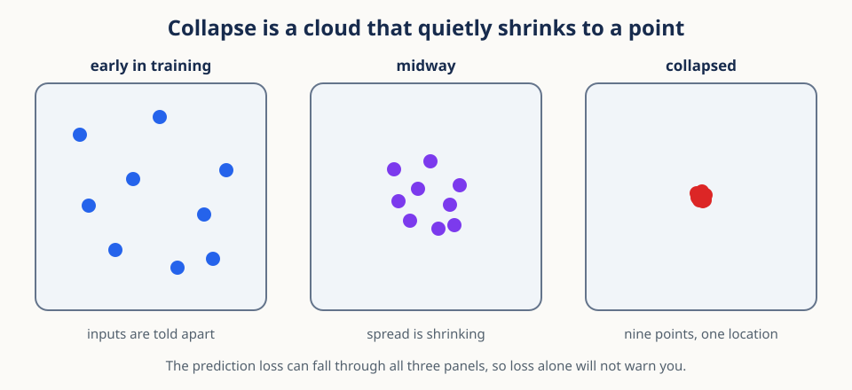
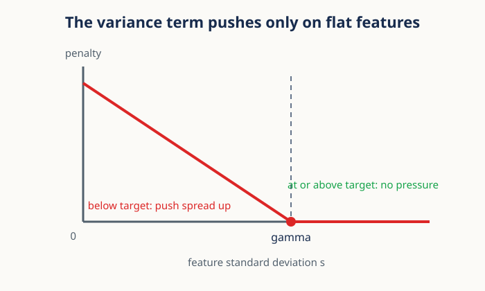
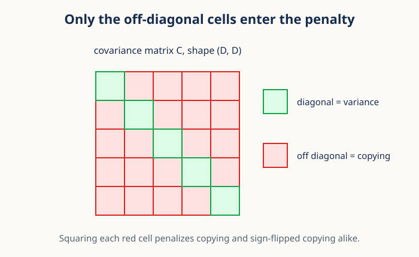

# 06. Representation collapse and variance-covariance regularization

## Why this lesson matters

Imagine you train an image encoder for several hours. Its prediction loss falls almost to
zero. You then plot the feature vectors for cats, bicycles, trees, and houses, and every
point sits in the same tiny region. The model has learned to agree with its own training
target without preserving any useful difference between inputs.

That failure is called **representation collapse**, and it is the danger Lesson 05 named but
did not measure. It matters because a small training loss does not guarantee an informative
representation. This lesson builds two simple statistical safeguards against it. Feature
variance stops coordinates from becoming constant. Off-diagonal covariance stops coordinates
from copying one another.

## Prerequisites

You should be comfortable with two-dimensional arrays, means, and squared differences. Lesson
02 introduces the vector geometry, and [Lesson 05](05_masked_latent_prediction.md) explains
the prediction targets and stop-gradient updates that create the risk in the first place.

## Learning goals

By the end of this lesson, you will be able to:

1. Recognize complete collapse and dimensional collapse.
2. Explain why a prediction loss can accept a constant representation.
3. Compute feature means, variances, and covariance.
4. Combine prediction, variance, and covariance losses.
5. Choose between token-level and pooled regularization.
6. Implement the losses efficiently in NumPy and PyTorch.

## 1. Start with one concrete batch

Collapse is easiest to recognize in a matrix you can read by eye, so start there. Suppose an
encoder processes $B=4$ images and produces $D=3$ numbers per image. Store the result in a
matrix $Z$ with shape $(B,D)=(4,3)$:

$$
Z=
\begin{bmatrix}
1 & 2 & 4 \\
1 & 2 & 4 \\
1 & 2 & 4 \\
1 & 2 & 4
\end{bmatrix}.
$$

Each row is one image and each column is one learned feature. Every row is identical, so the
representation cannot tell any pair of images apart. This is **complete collapse**.

The second failure is less obvious because the rows do differ. Consider:

$$
Z=
\begin{bmatrix}
1 & 2 & 3 \\
2 & 4 & 6 \\
3 & 6 & 9 \\
4 & 8 & 12
\end{bmatrix}.
$$

Column 2 is twice column 1 and column 3 is three times column 1, so all the variation lies
along a single direction. Three features are being spent to carry one number. This is
**dimensional collapse**.

### Mental model

Think of every feature as a measuring instrument, and the two failures become two questions
you would ask of any instrument panel:

- Variance asks whether each instrument moves at all.
- Covariance asks whether several instruments are reporting the same movement.
- A healthy representation needs movement and nonredundant directions.

Those two questions become the two loss terms built in sections 4 and 5.

## 2. Why agreement alone can collapse

Before adding new terms, it is worth seeing precisely why the prediction loss permits the
failure. Let $P$ be a prediction matrix and $T$ a target matrix, both of shape $(B,D)$. Mean
squared prediction loss is

$$
\mathcal{L}_{\mathrm{pred}}
{}={}
\frac{1}{BD}
\sum_{i=1}^{B}
\sum_{j=1}^{D}
(P_{ij}-T_{ij})^2.
$$

Here $i$ indexes the $B$ observations, $j$ indexes the $D$ features, and $BD$ is the number
of scalar values being compared. The loss is small exactly when paired predictions and
targets agree.

Nothing in that definition requires different inputs to produce different outputs. If both
branches emit the same constant vector $c$, then $P_{i:}=T_{i:}=c$ for every observation $i$
and every squared difference is zero. The objective is fully satisfied by a representation
that has thrown away all its information.

This does not happen in one step. It happens gradually, which is what makes it hard to catch
while watching a loss curve.

Across those three snapshots the prediction loss can fall the entire way, because agreement
gets easier as the cloud tightens. Architectural choices such as stop-gradient targets and
slowly updated target encoders reduce the risk. Statistical regularization goes further and
gives the objective an explicit definition of healthy batch geometry. Neither guarantees an
informative representation on its own, which is why both still require measurement.

### Conceptual checkpoint

If prediction loss is zero, what do you know?

You know that paired outputs agree. You do not yet know whether outputs vary across inputs.

## 3. Center the feature matrix

Both safeguards are statements about how the features vary, and variation is measured
relative to a mean, so the first step is always to subtract that mean. For feature $j$,

$$
\mu_j=\frac{1}{B}\sum_{i=1}^{B} Z_{ij}.
$$

The symbol $\mu_j$ is one scalar: the average of feature $j$ over the $B$ observations in the
batch. Collecting all feature means gives a row vector $\mu$ with shape $(D,)$. Subtract it
from every row:

$$
X_{ij}=Z_{ij}-\mu_j.
$$

The centered matrix $X$ has the same shape $(B,D)$ as $Z$, and every column of $X$ now has
mean zero. Centering separates variation from absolute location, so that shifting the whole
representation cannot masquerade as spread.

In NumPy:

~~~python
mu = z.mean(axis=0, keepdims=True)
x = z - mu
assert x.shape == z.shape
~~~

The argument <code>axis=0</code> averages down the observation axis, so one mean is produced
per feature. The argument <code>keepdims=True</code> preserves shape $(1,D)$, which makes the
subtraction broadcast unambiguously across rows.

## 4. Feature variance prevents constant coordinates

The first safeguard answers the first question from section 1: does each instrument move at
all? The sample variance of feature $j$ over the batch is

$$
s_j^2
{}={}
\frac{1}{B-1}
\sum_{i=1}^{B}
X_{ij}^2.
$$

The value $s_j^2$ has squared feature units, so it is easier to reason about its square root
$s_j$, which has the same units as the feature itself:

$$
s_j=\sqrt{s_j^2+\varepsilon}.
$$

The small positive number $\varepsilon$ prevents an undefined derivative at exactly zero. It
should be large enough for numerical stability and small enough that it does not disguise
collapse, because a generous $\varepsilon$ makes a dead feature report a healthy-looking
standard deviation.

Now choose a target standard deviation $\gamma$, often $\gamma=1$, and penalize only the
features that fall below it:

$$
\mathcal{L}_{\mathrm{var}}
{}={}
\frac{1}{D}
\sum_{j=1}^{D}
\max(0,\gamma-s_j).
$$

The maximum creates a hinge, which the figure draws directly. To the left of $\gamma$ the
penalty grows as the feature gets flatter, so the gradient pushes that feature to spread out.
At and beyond $\gamma$ the curve is flat, so a feature that is already varying enough
receives no pressure to vary more. A constant feature has $s_j$ near zero and sits at the far
left, where the penalty is largest.

~~~python
def variance_loss(z, target_std=1.0, eps=1e-4):
    std = np.sqrt(z.var(axis=0, ddof=1) + eps)
    return np.maximum(0.0, target_std - std).mean()
~~~

The argument <code>ddof=1</code> uses the denominator $B-1$, matching the sample variance
written above.

## 5. Covariance detects copied features

Variance alone cannot catch the second failure from section 1. Every column could copy one
varying signal and still report a large standard deviation, which is exactly what the
dimensional-collapse matrix does. Detecting that requires looking at pairs of features.

The sample covariance matrix is

$$
C=\frac{1}{B-1}X^\mathsf{T}X.
$$

Check the shapes: $X^\mathsf{T}$ has shape $(D,B)$ and $X$ has shape $(B,D)$, so $C$ has
shape $(D,D)$, one entry for every ordered pair of features. Entry $C_{jk}$ measures how
features $j$ and $k$ move together across the batch:

$$
C_{jk}
{}={}
\frac{1}{B-1}
\sum_{i=1}^{B}
X_{ij}X_{ik}.
$$

The two kinds of entry mean different things. A diagonal entry $C_{jj}$ is just the variance
of feature $j$, which section 4 already handles. Off-diagonal entries describe linear
redundancy between two different features, which is what we want to remove:

$$
\mathcal{L}_{\mathrm{cov}}
{}={}
\frac{1}{D}
\sum_{j\ne k} C_{jk}^2.
$$

The figure shows which cells are in the sum. Squaring each off-diagonal entry stops positive
and negative dependencies from cancelling out. The division by $D$ is one common scaling
convention; state whichever one you use, because implementations differ and the coefficient
you tune depends on it.

### Worked numerical example

For three observations of two features,

$$
Z=
\begin{bmatrix}
1 & 2 \\
2 & 4 \\
3 & 6
\end{bmatrix},
\qquad
X=
\begin{bmatrix}
-1 & -2 \\
0 & 0 \\
1 & 2
\end{bmatrix},
$$

the covariance is

$$
C
{}={}
\frac{1}{2}X^\mathsf{T}X
{}={}
\begin{bmatrix}
1 & 2 \\
2 & 4
\end{bmatrix}.
$$

Both diagonal entries are positive, so both features vary and the variance term is content.
The large off-diagonal value is what reveals that the second feature is simply twice the
first. This is the smallest possible demonstration that you need both terms.

### Why both signs of covariance matter

Suppose feature 2 is the negative of feature 1. Their covariance is large and negative, yet
the features still carry identical information, because one is recovered from the other by
multiplying by $-1$. Squaring $C_{12}$ penalizes copying and sign-flipped copying equally,
which is the behavior you want.

## 6. Combine complementary safeguards

With both terms defined, the full objective is a weighted sum:

$$
\mathcal{L}
{}={}
\lambda_p\mathcal{L}_{\mathrm{pred}}
+\lambda_v\mathcal{L}_{\mathrm{var}}
+\lambda_c\mathcal{L}_{\mathrm{cov}}.
$$

The coefficients $\lambda_p$, $\lambda_v$, and $\lambda_c$ control how much influence
prediction, variance, and covariance each have. They are dimensionless hyperparameters only
if the three losses have already been defined with compatible scaling, which is not automatic.

Interpret the three terms as a negotiation:

- Prediction says paired views should agree.
- Variance says different observations must remain distinguishable.
- Covariance says that distinguishability should use more than one copied direction.

Log every unweighted term before you tune the coefficients. A stable total loss can easily
hide one component exploding while another shrinks.

### How the regularizers push the representation

It is worth being precise about where each gradient acts. The variance hinge acts only on
low-spread features: if feature $j$ is constant, increasing the difference between some
observations lowers its penalty, and once $s_j$ reaches $\gamma$ the hinge is flat and stops
asking for more.

The covariance penalty acts on pairs instead. If two centered columns point in nearly the
same direction across the batch, their inner product is large, so lowering the penalty
encourages one column to carry variation the other does not already carry.

Neither force assigns any semantic meaning to a coordinate. They shape batch statistics and
nothing more. Prediction or reconstruction objectives are still what connect the
representation to the actual content of the input.

### Loss scale checkpoint

Suppose prediction loss is about $0.02$, variance loss is about $0.6$, and covariance loss is
about $12$. Adding them with equal coefficients would let covariance dominate the gradient
completely. That is not evidence that covariance is more important. It is evidence that the
three definitions produce different numerical scales.

Inspect typical magnitudes and gradient norms before choosing $\lambda_p$, $\lambda_v$, and
$\lambda_c$, and recheck them whenever batch size, feature dimension, or pooling policy
changes, because all three shift the scales.

## 7. Raw covariance or correlation?

The covariance term as written depends on scale, and sometimes that is not what you want. A
feature with standard deviation 10 can dominate the penalty over a feature with standard
deviation 0.1 even when the second one is more redundant.

If the question is scale-free dependence, standardize the centered features first:

$$
\widetilde{X}_{ij}=\frac{X_{ij}}{s_j}.
$$

The stabilized standard deviation $s_j=\sqrt{s_j^2+\varepsilon}$ is already positive, so the
division is safe. The covariance of $\widetilde{X}$ is then approximately a correlation
matrix, whose off-diagonal entries compare dependence after feature scale has been removed.

Choose deliberately. Use raw covariance when absolute scale is part of the representation
design. Use correlation-style penalties when only redundancy matters. Never standardize
before computing the variance penalty, because standardization forces the measured standard
deviations toward one by construction and the variance term would then be measuring nothing.

## 8. Tokens and pooled examples answer different questions

So far the matrix $Z$ has had one row per example. A sequence encoder does not hand you that
directly: it returns token features with shape $(B,T,D)$, where $T$ is the number of time or
spatial tokens. You have to decide what counts as an observation.

Token-level regularization reshapes to $(BT,D)$ and treats every token as a row. Pooled
regularization first averages the tokens of each example:

$$
\bar z_{ij}
{}={}
\frac{1}{T}
\sum_{t=1}^{T}
Z_{itj}.
$$

The index $t$ selects a token within one example, and the pooled feature $\bar z_{ij}$
describes feature $j$ for example $i$.

The two paths catch different failures. Token-level statistics can reveal local collapse that
pooling would hide, because a pooled average can look varied while the tokens inside each
example are identical. Pooled statistics protect example-level information, which is usually
what downstream tasks consume. The caveat is that tokens from one example are correlated, so
$BT$ rows are not $BT$ independent observations.

### Misconception

**More tokens always make covariance reliable.**

No. More correlated tokens improve numerical averaging but do not supply the same information
as more independent examples.

## 9. Batch statistics are estimates

That caveat about independence generalizes. Every loss in this lesson uses a minibatch to
estimate representation geometry, and a batch is not the data distribution. Two consequences
follow.

First, a small batch gives a noisy covariance estimate, and the noise has structure. With $B$
centered rows, the covariance rank cannot exceed $B-1$. If $B=32$ and $D=512$, at most 31
sample directions can have positive variance, even when the population representation is far
richer than that.

Second, batch composition matters. A batch containing only one class, one participant, or one
context can have low variance for entirely valid scientific reasons. The regularizer cannot
tell the difference, so it may push nuisance differences apart merely to satisfy a target
standard deviation.

The practical response is to use sampling that exposes the relevant diversity inside one
effective batch. Note that gradient accumulation does not fix this automatically, because
computing the regularizer separately on each microbatch is not the same as computing it on
the concatenated effective batch.

### Microbatch example

Suppose microbatch 1 contains only class A and microbatch 2 contains only class B. Each
microbatch can show low within-class variance while the combined batch has a large
between-class difference. Averaging two separately computed variance losses misses that
combined geometry entirely.

If global batch statistics matter for your setup, gather features across microbatches or
across distributed workers before computing the regularizer. That costs memory and
communication, so make the choice explicit rather than inheriting it from a default.

## 10. Standardization is not whitening

Two nearby ideas are easy to confuse, and the difference explains what these penalties can
and cannot achieve. Featurewise standardization divides each coordinate by its standard
deviation. It makes the diagonal covariance entries approximately one, and it leaves the
off-diagonal correlations exactly where they were.

Whitening applies a full linear transformation so that the transformed covariance is
approximately the identity matrix, removing scale differences and linear correlations
together:

$$
C_{\mathrm{white}}\approx I.
$$

Explicit whitening can be expensive and numerically unstable when the covariance has tiny
eigenvalues. The variance and covariance penalties aim at similar properties but reach them
gradually through optimization, rather than transforming every batch exactly.

## 11. A practical monitoring dashboard

Since neither penalty guarantees a good representation, the last piece is measurement. Do not
reduce collapse monitoring to a single number. A useful training dashboard includes:

- prediction loss,
- variance and covariance losses before weighting,
- median and minimum feature standard deviation,
- fraction of features below the target $\gamma$,
- mean absolute off-diagonal covariance,
- effective rank of pooled features,
- downstream probe or retrieval performance.

Interpret these trends together rather than one at a time. Rising effective rank is not
automatically good if the new directions are noise. A high-rank representation can still
ignore task-relevant identity, and a modest-rank representation can be excellent for a
genuinely low-dimensional task.

### Health metrics diagnose, but do not choose the result

In a prespecified comparison, collapse statistics are training-health diagnostics. They can
reveal non-finite values, a broken data path, or a failed run that needs a documented exact
rerun. They do not authorize choosing whichever epoch has the best representation geometry or
downstream outcome. If the final planned checkpoint is primary, every cell uses that
checkpoint. Selecting an epoch after viewing the outcome quietly changes the estimand from
"performance after the planned exposure" to "best observed performance along a searched
trajectory."

A development-only probe can help diagnose representations while a method is being built. A
locked outcome cohort cannot be part of that dashboard. Record the boundary between health
checks, development feedback, and final outcomes before training starts, not after.

### Worked diagnostic pattern

Reading the dashboard is a skill, so here are the two signatures worth memorizing. Suppose
prediction loss falls, the minimum feature standard deviation approaches zero, and the
covariance loss also approaches zero. That combination points to complete collapse: a
constant representation has no covariance left to penalize.

Now suppose the standard deviations stay healthy but effective rank falls from 40 to 3 while
covariance grows. That points to dimensional collapse: the features still vary, but they
increasingly share a few directions.

## 12. Efficient PyTorch implementation

~~~python
import torch

def var_cov_loss(z, target_std=1.0, eps=1e-4):
    if z.ndim != 2 or z.shape[0] < 2:
        raise ValueError("expected at least two rows with shape [B, D]")
    x = z - z.mean(dim=0, keepdim=True)
    std = torch.sqrt(x.var(dim=0, correction=1) + eps)
    var_term = torch.relu(target_std - std).mean()

    cov = x.T @ x / (z.shape[0] - 1)
    off_diagonal = ~torch.eye(
        z.shape[1], dtype=torch.bool, device=z.device
    )
    cov_term = cov[off_diagonal].square().sum() / z.shape[1]
    return var_term, cov_term
~~~

One matrix multiplication computes every pairwise covariance, which is why this is cheap
enough to run every step. The full covariance costs roughly $O(BD^2)$ arithmetic and $O(D^2)$
memory. For very large $D$, use feature blocks or sample feature pairs, then verify that the
approximation preserves training behavior before trusting it.

## 13. Failure modes and diagnostics

1. **Batch size one:** sample covariance is undefined because $B-1=0$.
2. **Tiny batches:** covariance rank is at most $B-1$, and estimates are noisy.
3. **Covariance alone:** a constant matrix has zero covariance and zero penalty.
4. **Variance alone:** every feature can copy the same varying scalar.
5. **Only watching total loss:** prediction can improve while geometry collapses.
6. **An oversized epsilon:** reported standard deviations look healthy near zero.
7. **Flattening correlated tokens:** the apparent sample size becomes misleading.
8. **Selecting by health metrics:** a diagnostic becomes an unplanned checkpoint search.

Items 3 and 4 are the reason both terms exist, and the others are all ways the measurement
itself can mislead you. Useful additional diagnostics include the distribution of per-feature
standard deviations, the mean squared off-diagonal covariance, and the eigenspectrum
developed in [Lesson 09](09_eigenspectra_and_effective_rank.md).

## 14. Exercises

1. Show that adding the same vector $a$ to every row of $Z$ leaves covariance unchanged.
2. Construct two varying features with zero covariance.
3. Construct two tokens whose pooled representation is zero even though token variance is positive.
4. What is the maximum covariance rank when $B=16$ and $D=128$?

### Brief solutions

1. Centering $Z+a$ subtracts $\mu+a$, leaving the same centered matrix $Z-\mu$.
2. For balanced samples, choose one feature proportional to $[-1,-1,1,1]$ and another proportional to $[-1,1,-1,1]$.
3. Use tokens $u$ and $-u$. Their average is zero.
4. Centering removes one degree of freedom, so the rank is at most $\min(D,B-1)=15$.

## Recap

A low prediction loss proves agreement, not information preservation. The variance hinge
prevents constant features, and the squared off-diagonal covariance discourages copied
directions. Token-level and pooled regularization inspect different scales of the same
representation, and every one of these numbers is a batch estimate rather than a population
truth. Together they give you a practical geometric defense against collapse and, just as
importantly, a way to notice it.

## Next lesson

[07: Gradient updates and parameter schedules](07_gradient_updates_and_schedules.md) explains
how loss gradients, including the two new terms added here, become stable parameter changes.

## Continue in the notebook

[Open the executable lesson 06 notebook](../implementations/06_representation_collapse.ipynb) to compute the losses, inspect covariance heatmaps, and compare token-level with pooled statistics.
