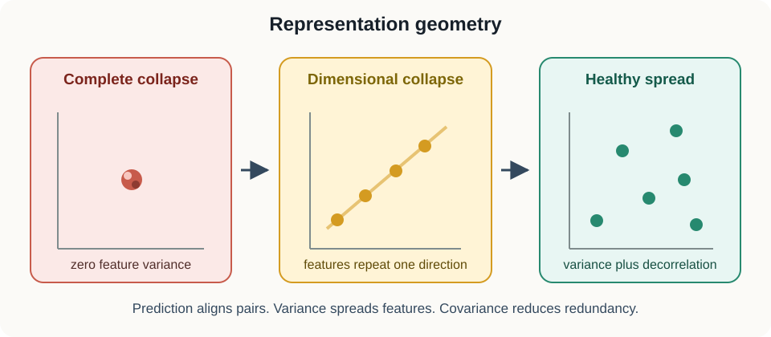
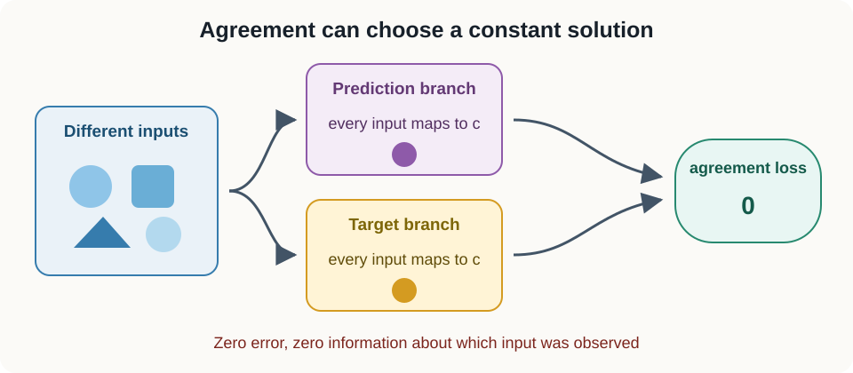
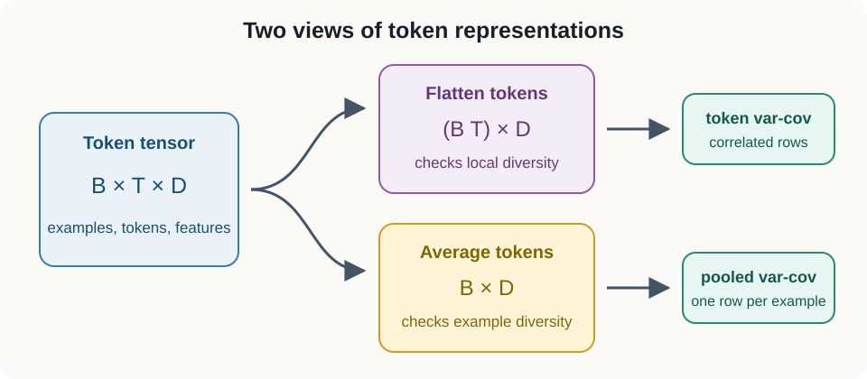

# 06. Representation collapse and variance-covariance regularization

## Why this lesson matters

Imagine that you train an image encoder for several hours. Its prediction loss falls almost to zero. You then plot the feature vectors for cats, bicycles, trees, and houses, but every point sits in the same tiny region. The model has learned to agree with its training target without preserving useful differences between inputs.

This failure is called **representation collapse**. It matters because a small training loss does not guarantee an informative representation. In this lesson, we build two simple statistical safeguards. Feature variance prevents coordinates from becoming constant. Off-diagonal covariance discourages coordinates from copying one another.

## Prerequisites

You should be comfortable with two-dimensional arrays, means, and squared differences. Lesson 02 introduces vector geometry, and [Lesson 05](05_masked_latent_prediction.md) explains prediction targets and stop-gradient updates.

## Learning goals

By the end of this lesson, you will be able to:

1. Recognize complete collapse and dimensional collapse.
2. Explain why a prediction loss can accept a constant representation.
3. Compute feature means, variances, and covariance.
4. Combine prediction, variance, and covariance losses.
5. Choose between token-level and pooled regularization.
6. Implement the losses efficiently in NumPy and PyTorch.

## 1. Start with one concrete batch

Suppose an encoder processes $B=4$ images and produces $D=3$ numbers per image. Store the result in a matrix $Z$ with shape $(B,D)=(4,3)$:

$$
Z=
\begin{bmatrix}
1 & 2 & 4 \\
1 & 2 & 4 \\
1 & 2 & 4 \\
1 & 2 & 4
\end{bmatrix}.
$$

Each row represents one image. Each column is one learned feature. Every row is identical, so the representation cannot distinguish any pair of images. This is **complete collapse**.

Now consider:

$$
Z=
\begin{bmatrix}
1 & 2 & 3 \\
2 & 4 & 6 \\
3 & 6 & 9 \\
4 & 8 & 12
\end{bmatrix}.
$$

The rows differ, so this is not complete collapse. However, column 2 is twice column 1, and column 3 is three times column 1. All variation lies along one direction. This is **dimensional collapse**.

### Mental model

Think of every feature as a measuring instrument:

- Variance asks whether each instrument moves at all.
- Covariance asks whether several instruments are reporting the same movement.
- A healthy representation needs movement and nonredundant directions.

## 2. Why agreement alone can collapse

Let $P$ be a prediction matrix and $T$ a target matrix, both with shape $(B,D)$. Mean squared prediction loss is

$$
\mathcal{L}_{\mathrm{pred}}
{}={}
\frac{1}{BD}
\sum_{i=1}^{B}
\sum_{j=1}^{D}
(P_{ij}-T_{ij})^2.
$$

Here $i$ indexes observations, $j$ indexes features, and $BD$ is the number of compared scalar values. The loss is small when paired predictions and targets agree.

Agreement does not require different inputs to produce different outputs. If both branches produce the same constant vector $c$, then $P_{i:}=T_{i:}=c$ for every observation $i$. Every squared difference is zero.

Architectural choices such as stop-gradient targets and slowly updated target encoders can reduce collapse risk. Statistical regularization gives the objective an explicit definition of healthy batch geometry. These safeguards still require measurement because none guarantees an informative representation by itself.

### Conceptual checkpoint

If prediction loss is zero, what do you know?

You know that paired outputs agree. You do not yet know whether outputs vary across inputs.

## 3. Center the feature matrix

For feature $j$, compute its batch mean:

$$
\mu_j=\frac{1}{B}\sum_{i=1}^{B} Z_{ij}.
$$

The symbol $\mu_j$ is one scalar. Collecting all feature means gives a row vector $\mu$ with shape $(D,)$. Subtract it from every row:

$$
X_{ij}=Z_{ij}-\mu_j.
$$

The centered matrix $X$ has the same shape $(B,D)$ as $Z$. Every column of $X$ has mean zero. Centering separates variation from absolute location.

In NumPy:

~~~python
mu = z.mean(axis=0, keepdims=True)
x = z - mu
assert x.shape == z.shape
~~~

The argument <code>axis=0</code> averages down the observation axis. The argument <code>keepdims=True</code> preserves shape $(1,D)$, so subtraction broadcasts clearly across rows.

## 4. Feature variance prevents constant coordinates

The sample variance of feature $j$ is

$$
s_j^2
{}={}
\frac{1}{B-1}
\sum_{i=1}^{B}
X_{ij}^2.
$$

The value $s_j^2$ has squared feature units. Its square root $s_j$ has the same units as the feature:

$$
s_j=\sqrt{s_j^2+\varepsilon}.
$$

The small positive number $\varepsilon$ prevents an undefined derivative at exactly zero. It should be large enough for numerical stability and small enough not to disguise collapse.

Choose a target standard deviation $\gamma$, often $\gamma=1$. Penalize only features below that target:

$$
\mathcal{L}_{\mathrm{var}}
{}={}
\frac{1}{D}
\sum_{j=1}^{D}
\max(0,\gamma-s_j).
$$

The maximum creates a hinge. A feature with $s_j\ge\gamma$ receives no further pressure to grow. A constant feature has $s_j$ near zero and receives a large penalty.

~~~python
def variance_loss(z, target_std=1.0, eps=1e-4):
    std = np.sqrt(z.var(axis=0, ddof=1) + eps)
    return np.maximum(0.0, target_std - std).mean()
~~~

The argument <code>ddof=1</code> uses denominator $B-1$, matching sample variance.

## 5. Covariance detects copied features

Variance alone is not enough. Every column could copy one varying signal and still have large standard deviation.

The sample covariance matrix is

$$
C=\frac{1}{B-1}X^\mathsf{T}X.
$$

The matrix $X^\mathsf{T}$ has shape $(D,B)$. Multiplying it by $X$, which has shape $(B,D)$, produces $C$ with shape $(D,D)$.

Entry $C_{jk}$ measures how features $j$ and $k$ move together:

$$
C_{jk}
{}={}
\frac{1}{B-1}
\sum_{i=1}^{B}
X_{ij}X_{ik}.
$$

Diagonal entry $C_{jj}$ is the variance of feature $j$. Off-diagonal entries describe linear redundancy between different features.

Penalize squared off-diagonal entries:

$$
\mathcal{L}_{\mathrm{cov}}
{}={}
\frac{1}{D}
\sum_{j\ne k} C_{jk}^2.
$$

Squaring prevents positive and negative dependencies from canceling. The division by $D$ is one common scaling convention. State the convention because implementations differ.

### Worked numerical example

For the three observations

$$
Z=
\begin{bmatrix}
1 & 2 \\
2 & 4 \\
3 & 6
\end{bmatrix},
\qquad
X=
\begin{bmatrix}
-1 & -2 \\
0 & 0 \\
1 & 2
\end{bmatrix},
$$

the covariance is

$$
C
{}={}
\frac{1}{2}X^\mathsf{T}X
{}={}
\begin{bmatrix}
1 & 2 \\
2 & 4
\end{bmatrix}.
$$

Both diagonal entries are positive, so both features vary. The large off-diagonal value reveals that the features are redundant.

## 6. Combine complementary safeguards

A common objective is

$$
\mathcal{L}
{}={}
\lambda_p\mathcal{L}_{\mathrm{pred}}
+\lambda_v\mathcal{L}_{\mathrm{var}}
+\lambda_c\mathcal{L}_{\mathrm{cov}}.
$$

The coefficients $\lambda_p$, $\lambda_v$, and $\lambda_c$ control the influence of prediction, variance, and covariance. They are dimensionless hyperparameters only if the three losses have already been defined with compatible scaling.

Interpret the terms as a negotiation:

- Prediction says paired views should agree.
- Variance says different observations must remain distinguishable.
- Covariance says distinguishability should use more than one copied direction.

Log every unweighted term before tuning the coefficients. A stable total loss can hide one exploding component and one shrinking component.

### How the regularizers push the representation

The variance hinge acts only on low-spread features. If feature $j$ is constant, increasing the difference between some observations lowers its variance penalty. Once its standard deviation reaches $\gamma$, the hinge becomes flat and stops demanding more spread.

The covariance penalty acts on pairs of features. If two centered columns point in nearly the same direction across the batch, their inner product is large. Lowering the penalty encourages one column to carry variation that the other does not already carry.

These forces do not assign semantic meaning to coordinates. They only shape batch statistics. Prediction or reconstruction objectives must still connect the representation to input content.

### Why both signs of covariance matter

Suppose feature 2 is the negative of feature 1. Their covariance is large and negative. The features still contain the same information because one can be recovered by multiplying the other by $-1$. Squaring $C_{12}$ correctly penalizes both positive copying and negative copying.

### Loss scale checkpoint

Assume prediction loss is about $0.02$, variance loss is about $0.6$, and covariance loss is about $12$. Adding them with equal coefficients would make covariance dominate. This does not mean covariance is more important. It means the three definitions produce different numerical scales.

Inspect typical magnitudes and gradient norms before choosing $\lambda_p$, $\lambda_v$, and $\lambda_c$. Recheck them if batch size, feature dimension, or pooling policy changes.

## 7. Raw covariance or correlation?

Covariance depends on scale. A feature with standard deviation 10 can dominate a feature with standard deviation 0.1.

If the question is scale-free dependence, standardize centered features:

$$
\widetilde{X}_{ij}=\frac{X_{ij}}{s_j}.
$$

The stabilized standard deviation $s_j=\sqrt{s_j^2+\varepsilon}$ is already positive. Covariance of $\widetilde{X}$ is approximately a correlation matrix. Its off-diagonal entries compare dependence after removing feature scale.

Use raw covariance when absolute scale is part of the representation design. Use correlation-style penalties when only redundancy matters. Never standardize before computing the variance penalty, because standardization would force the measured standard deviations toward one by construction.

## 8. Tokens and pooled examples answer different questions

A sequence encoder often returns token features with shape $(B,T,D)$, where $T$ is the number of time or spatial tokens.

Token-level regularization reshapes to $(BT,D)$. Pooled regularization first averages tokens and produces $(B,D)$:

$$
\bar z_{ij}
{}={}
\frac{1}{T}
\sum_{t=1}^{T}
Z_{itj}.
$$

The index $t$ selects a token. The pooled feature $\bar z_{ij}$ describes feature $j$ for example $i$.

Token-level statistics can catch local collapse that pooling hides. Pooled statistics protect example-level information. However, tokens from one example are correlated, so $BT$ rows do not equal $BT$ independent observations.

### Misconception

**More tokens always make covariance reliable.**

No. More correlated tokens improve numerical averaging but do not create the same information as more independent examples.

## 9. Batch statistics are estimates

The losses use a minibatch to estimate representation geometry. A batch is not the complete data distribution. Two consequences follow.

First, a small batch gives a noisy covariance estimate. With $B$ centered rows, covariance rank cannot exceed $B-1$. If $B=32$ and $D=512$, at most 31 sample directions can have positive variance, even when the population representation is much richer.

Second, batch composition matters. A batch containing only one class, one participant, or one context can have low variance for scientifically valid reasons. The regularizer might then push nuisance differences merely to satisfy a target standard deviation.

Use sampling that exposes relevant diversity inside an effective batch. Gradient accumulation does not automatically fix this issue, because computing the regularizer separately on each microbatch is not the same as computing it on the concatenated effective batch.

### Microbatch example

Suppose microbatch 1 contains only class A and microbatch 2 contains only class B. Each microbatch can have low within-class variance, while the combined batch has a large between-class difference. Averaging two separately computed variance losses misses the combined geometry.

If global batch statistics are important, gather features across microbatches or distributed workers before computing the regularizer. This increases memory and communication cost, so the choice should be explicit.

## 10. Standardization is not whitening

Featurewise standardization divides each coordinate by its standard deviation. It makes diagonal covariance entries approximately one, but off-diagonal correlations can remain.

Whitening applies a full linear transformation so the transformed covariance is approximately the identity matrix. Whitening removes both scale differences and linear correlations:

$$
C_{\mathrm{white}}\approx I.
$$

Explicit whitening can be expensive and unstable when covariance has tiny eigenvalues. Variance-covariance penalties encourage similar properties gradually through optimization rather than exactly transforming every batch.

## 11. A practical monitoring dashboard

Do not reduce collapse monitoring to one number. A useful training dashboard includes:

- prediction loss,
- variance and covariance losses before weighting,
- median and minimum feature standard deviation,
- fraction of features below the target $\gamma$,
- mean absolute off-diagonal covariance,
- effective rank of pooled features,
- downstream probe or retrieval performance.

Interpret trends together. Rising effective rank is not automatically good if it comes from noisy nuisance directions. A high-rank representation can still ignore task-relevant identity, and a modest-rank representation can be excellent for a low-dimensional task.

### Health metrics diagnose, but do not choose the result

In a prespecified comparison, collapse statistics are training-health diagnostics. They
can reveal non-finite values, a broken data path, or a failed run that needs a documented
exact rerun. They do not authorize choosing whichever epoch has the best representation
geometry or downstream outcome. If the final planned checkpoint is primary, every cell
uses that checkpoint. Selecting an epoch after viewing the outcome quietly changes the
estimand from "performance after the planned exposure" to "best observed performance
along a searched trajectory."

A development-only probe can help diagnose representations while a method is being
built. A locked outcome cohort cannot be part of that dashboard. Record the boundary
between health checks, development feedback, and final outcomes before training starts.

### Worked diagnostic pattern

Suppose prediction loss falls, minimum feature standard deviation approaches zero, and covariance loss also approaches zero. This combination suggests complete collapse: a constant representation has no covariance to penalize.

Suppose standard deviations remain healthy but effective rank falls from 40 to 3 and covariance grows. This suggests dimensional collapse: features still vary, but they increasingly share a few directions.

## 12. Efficient PyTorch implementation

~~~python
import torch

def var_cov_loss(z, target_std=1.0, eps=1e-4):
    if z.ndim != 2 or z.shape[0] < 2:
        raise ValueError("expected at least two rows with shape [B, D]")
    x = z - z.mean(dim=0, keepdim=True)
    std = torch.sqrt(x.var(dim=0, correction=1) + eps)
    var_term = torch.relu(target_std - std).mean()

    cov = x.T @ x / (z.shape[0] - 1)
    off_diagonal = ~torch.eye(
        z.shape[1], dtype=torch.bool, device=z.device
    )
    cov_term = cov[off_diagonal].square().sum() / z.shape[1]
    return var_term, cov_term
~~~

Matrix multiplication computes all pairwise covariances in one optimized operation. The full covariance costs roughly $O(BD^2)$ arithmetic and $O(D^2)$ memory. For very large $D$, use feature blocks or sample feature pairs, then verify that the approximation preserves training behavior.

## 13. Failure modes and diagnostics

1. **Batch size one:** sample covariance is undefined because $B-1=0$.
2. **Tiny batches:** covariance rank is at most $B-1$, and estimates are noisy.
3. **Covariance alone:** a constant matrix has zero covariance and zero penalty.
4. **Variance alone:** every feature can copy the same varying scalar.
5. **Only watching total loss:** prediction can improve while geometry collapses.
6. **An oversized epsilon:** reported standard deviations look healthy near zero.
7. **Flattening correlated tokens:** the apparent sample size becomes misleading.
8. **Selecting by health metrics:** a diagnostic becomes an unplanned checkpoint search.

Useful diagnostics include the distribution of per-feature standard deviations, mean squared off-diagonal covariance, and the eigenspectrum in [Lesson 09](09_eigenspectra_and_effective_rank.md).

## 14. Exercises

1. Show that adding the same vector $a$ to every row of $Z$ leaves covariance unchanged.
2. Construct two varying features with zero covariance.
3. Construct two tokens whose pooled representation is zero even though token variance is positive.
4. What is the maximum covariance rank when $B=16$ and $D=128$?

### Brief solutions

1. Centering $Z+a$ subtracts $\mu+a$, leaving the same centered matrix $Z-\mu$.
2. For balanced samples, choose one feature proportional to $[-1,-1,1,1]$ and another proportional to $[-1,1,-1,1]$.
3. Use tokens $u$ and $-u$. Their average is zero.
4. Centering removes one degree of freedom, so the rank is at most $\min(D,B-1)=15$.

## Recap

A low prediction loss proves agreement, not information preservation. Variance prevents constant features. Off-diagonal covariance discourages copied directions. Token-level and pooled regularization inspect different representation scales. Together, these ideas provide a practical geometric defense against collapse.

## Next lesson

[07: Gradient updates and parameter schedules](07_gradient_updates_and_schedules.md) explains how loss gradients become stable parameter changes.

## Continue in the notebook

[Open the executable lesson 06 notebook](../implementations/06_representation_collapse.ipynb) to compute the losses, inspect covariance heatmaps, and compare token-level with pooled statistics.
