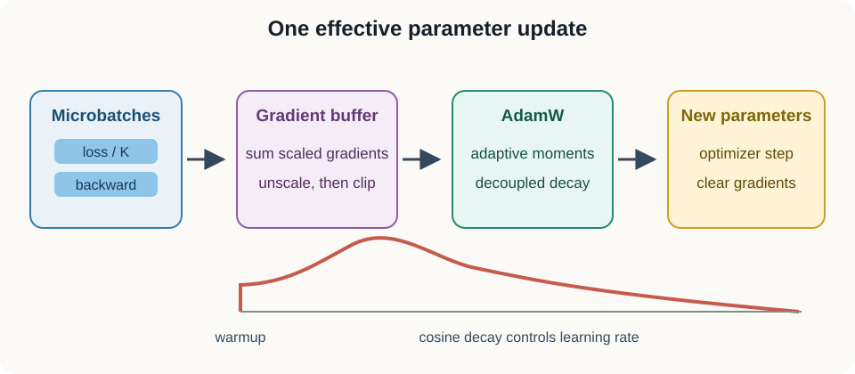
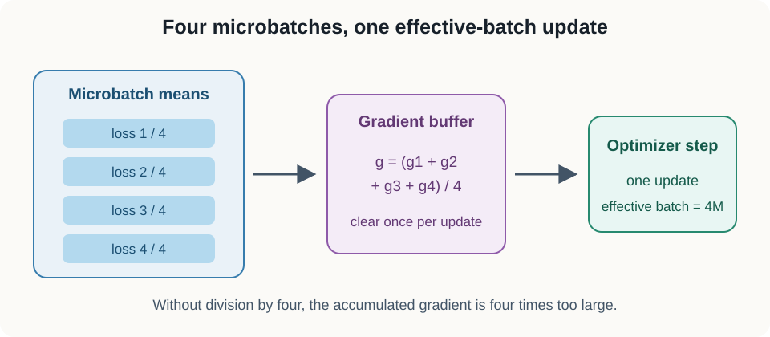
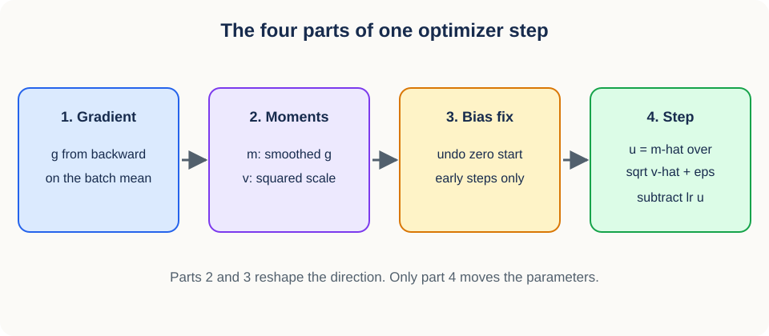
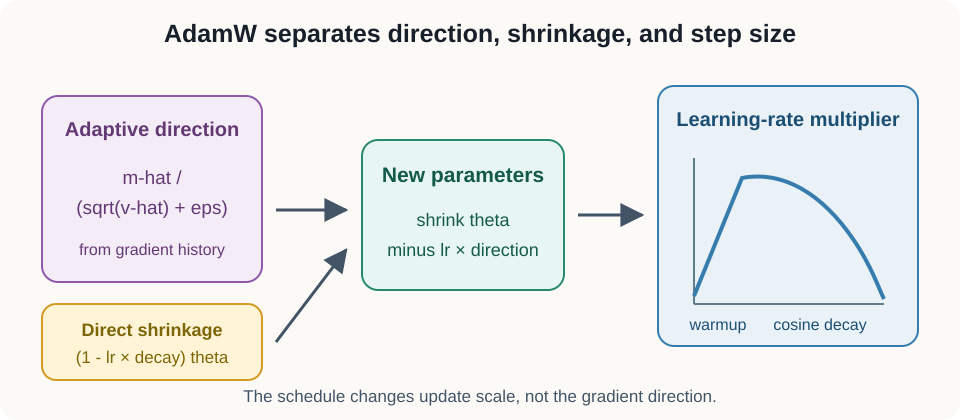
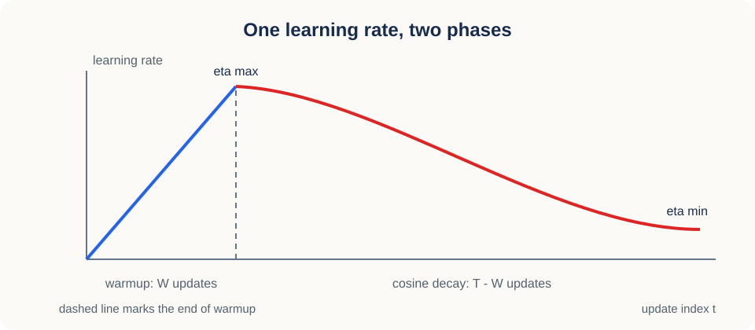
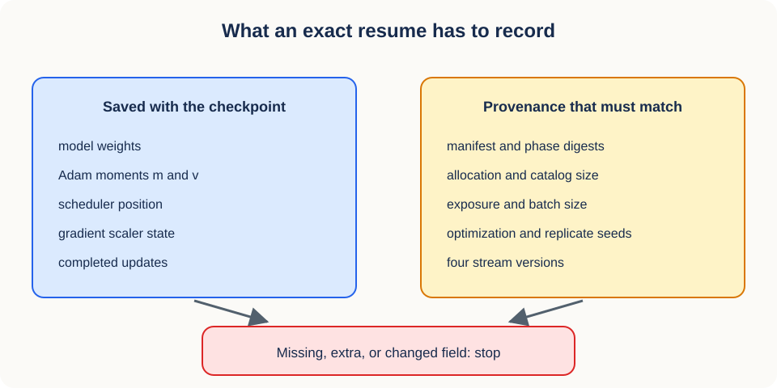

# 07. Gradient updates and parameter schedules

## Why this lesson matters

A model can fit one batch perfectly and then become unstable the moment you double the batch size, switch on mixed precision, or split each batch into smaller pieces. Nothing in the model changed. What changed is the size and the units of the step the optimizer takes.

That is the subject of this lesson. We follow one number, the loss, all the way to a new set of parameter values, and we watch what each training trick does to that path. Along the way you will see that most training bugs are not mathematical errors. They are unit errors: a gradient measured in the wrong scale, a schedule counted in the wrong events, a checkpoint that restores half of the state.

## Prerequisites

You need algebra and the idea of a derivative as a local slope. [Lesson 06](06_representation_collapse.md) supplies the losses that an optimizer minimizes, and this lesson supplies the machinery that minimizes them.

## Learning goals

By the end of this lesson, you will be able to:

1. Compute a small gradient by hand and verify it with autograd.
2. Explain why gradient accumulation requires loss scaling.
3. Derive Adam moment estimates and bias correction.
4. Distinguish L2 regularization from AdamW weight decay.
5. Use parameter groups and global norm clipping.
6. Build a linear-warmup and cosine-decay schedule.
7. Place mixed-precision scaling and clipping in the correct order.
8. Say what a checkpoint must record before a resume can be called exact.

## 1. A gradient is a local sensitivity

Start with the smallest possible model so that every quantity is a single number you can check in your head. The gradient we compute here is the same object that later sections smooth, normalize, clip, and scale.

The model has one parameter:

$$
\widehat y=wx.
$$

Here $x$ is the input, $w$ is the one parameter we can change, and $\widehat y$ is the prediction. Both $x$ and $w$ are scalars. For a target value $y$, use squared-error loss:

$$
L=\frac{1}{2}(\widehat y-y)^2.
$$

The factor $1/2$ exists only to cancel the 2 that differentiation produces. Write the prediction error as $e=\widehat y-y$. How much does the loss change when the prediction changes?

$$
\frac{\partial L}{\partial \widehat y}=e.
$$

How much does the prediction change when the parameter changes?

$$
\frac{\partial \widehat y}{\partial w}=x.
$$

The chain rule says to multiply these two local sensitivities to get the one we actually want:

$$
\frac{\partial L}{\partial w}
{}={}
\frac{\partial L}{\partial \widehat y}
\frac{\partial \widehat y}{\partial w}
{}={}
ex.
$$

Put numbers in it. With $w=2$, $x=3$, and $y=5$, the prediction is $\widehat y=6$, the error is $e=1$, and the gradient is $1\times3=3$. The sign matters more than the size: a small increase in $w$ increases the loss, so a good optimizer moves $w$ down.

~~~python
import torch

w = torch.tensor(2.0, requires_grad=True)
x = torch.tensor(3.0)
y = torch.tensor(5.0)
loss = 0.5 * (w * x - y).square()
loss.backward()
assert w.grad.item() == 3.0
~~~

Autograd got the same 3 by recording each forward operation and replaying the chain rule in reverse. It never builds the full matrix of partial derivatives. It multiplies a vector by each local Jacobian in turn, which is why the cost of a backward pass is comparable to the cost of a forward pass.

### From one scalar to a layer

Real layers have the same structure with shapes attached. For a linear layer, an input batch $X$ has shape $(B,D_{\mathrm{in}})$, where $B$ is the number of observations in the batch and $D_{\mathrm{in}}$ is the number of input features. A weight matrix $W$ has shape $(D_{\mathrm{in}},D_{\mathrm{out}})$ and a bias vector $b$ has shape $(D_{\mathrm{out}},)$, where $D_{\mathrm{out}}$ is the number of output features. The layer computes

$$
H=XW+b.
$$

The output $H$ has shape $(B,D_{\mathrm{out}})$, and broadcasting adds the same bias row to all $B$ observations.

Backpropagation returns one gradient per trainable object, and each gradient has exactly the shape of the object it belongs to. So $\nabla_W L$ has shape $(D_{\mathrm{in}},D_{\mathrm{out}})$ and $\nabla_b L$ has shape $(D_{\mathrm{out}},)$. That shape agreement is the cheapest debugging invariant in deep learning: if a gradient has the wrong shape, the bug is upstream of the optimizer.

Two consequences follow from the fact that the weight gradient multiplies input values by upstream sensitivities. A feature that is always zero contributes no data gradient to its weight row, so that row only moves under weight decay. A saturated activation drives the upstream sensitivity toward zero and has the same effect for a different reason.

### Computation graphs and saved values

Reverse-mode differentiation cannot run on the forward outputs alone. The derivative of a matrix product needs the matrices themselves, so the forward pass stores selected intermediate values until backward consumes them. This is the main reason training uses far more memory than inference.

Gradient checkpointing is the standard trade. It keeps fewer intermediate activations and recomputes the missing ones during backward, spending arithmetic to buy memory. Do not confuse it with saving a training checkpoint to disk, which is the subject of section 11.

## 2. The optimizer turns a gradient into an update

The gradient tells you which way the loss increases fastest. It does not tell you how far to move, and it is not itself the update. The optimizer is the rule that converts direction into displacement.

Plain gradient descent uses the simplest such rule:

$$
\theta_{t+1}
{}={}
\theta_t-\eta_t g_t.
$$

The vector $\theta_t$ holds every parameter at update $t$, the vector $g_t$ holds the gradient at that same update, and the positive scalar $\eta_t$ is the learning rate at that update. Subtraction is what moves against the direction of increase.

One line of arithmetic: with $\theta_t=2$, $g_t=3$, and $\eta_t=0.1$, the next value is $2-0.3=1.7$.

A useful mental model for everything that follows: the gradient is a compass heading and the learning rate is the length of the stride. Adaptive optimizers such as Adam modify both, and the schedule in section 9 modifies only the stride.

## 3. Gradients accumulate unless you clear them

Before we can reason about batch size, we need one PyTorch fact that surprises most readers. Each call to <code>backward()</code> adds into a parameter's <code>.grad</code> buffer instead of replacing it. That behavior is deliberate. It lets you sum several loss terms, or several microbatches, into one gradient.

It is also the source of a classic bug. If you forget to clear the buffer between effective batches, the next update contains a stale gradient from the previous one, and the effective learning rate silently drifts upward. The fix is the standard three-line rhythm:

~~~python
optimizer.zero_grad(set_to_none=True)
loss.backward()
optimizer.step()
~~~

The option <code>set_to_none=True</code> releases the buffers instead of writing zeros into them. It saves memory traffic, and it makes a broken gradient path visible as <code>None</code> rather than as a plausible-looking tensor of zeros.

## 4. Accumulation should reproduce a larger batch mean

Now use that accumulating buffer on purpose. The goal is to train with a large effective batch on hardware that cannot hold one, and to get the same gradient you would have gotten from the large batch.

For $N$ examples, let $\ell_i$ be the loss of example $i$. The batch mean loss is

$$
L_N=\frac{1}{N}\sum_{i=1}^{N}\ell_i.
$$

Differentiation is linear, so the gradient of the mean is the mean of the gradients:

$$
\nabla_\theta L_N
{}={}
\frac{1}{N}
\sum_{i=1}^{N}
\nabla_\theta \ell_i.
$$

Suppose memory holds only $K$ equal-sized microbatches, where $K$ is a small integer such as 4. Each microbatch loss is already a mean over its own examples. Dividing each of those means by $K$ before calling backward makes the accumulated sum equal the full-batch mean gradient exactly.

~~~python
optimizer.zero_grad(set_to_none=True)
for micro_x, micro_y in microbatches:
    loss = criterion(model(micro_x), micro_y) / len(microbatches)
    loss.backward()
optimizer.step()
~~~

Leave out the division and the accumulated gradient is $K$ times too large. Nothing raises an error. The run simply behaves as if you had multiplied the learning rate by $K$, which is exactly the kind of change that looks like a bad hyperparameter rather than a bug.

Equal division assumes equal microbatch sizes. If sizes differ, weight microbatch $k$ by $n_k/N$, where $n_k$ is the number of examples in microbatch $k$ and $N=\sum_k n_k$ is the total.

### Conceptual checkpoint

Two microbatches hold 8 and 2 examples, and their mean gradients are $g_1$ and $g_2$. The full-batch mean gradient is

$$
\frac{8}{10}g_1+\frac{2}{10}g_2,
$$

not $(g_1+g_2)/2$. The naive average gives the two examples in the small microbatch four times the influence of each example in the large one.

### When accumulation does not match one large forward pass

Correct loss scaling makes the arithmetic match. It does not make every model match, because some computations look at the whole batch at once.

Batch normalization is the clearest case: it computes means and variances within each microbatch, so a run with $K$ microbatches uses $K$ sets of statistics where a single large batch would use one. Dropout draws different masks, though both remain valid stochastic estimators. Any loss that couples observations, such as a covariance or contrastive term, also changes when it is computed on pieces.

So accumulation reproduces a large-batch mean exactly when each example's forward pass and loss are independent of the other examples in the batch. That is a testable claim. Check it on a deterministic model before you rely on it.

## 5. Adam remembers direction and scale

Stochastic gradients are noisy in two separate ways. They wobble from batch to batch, and their typical magnitude differs from coordinate to coordinate. Adam addresses both by keeping two running averages and using them to rescale the raw gradient before it becomes a step.

The first moment is an exponential moving average of the gradient itself:

$$
m_t
{}={}
\beta_1 m_{t-1}
+(1-\beta_1)g_t.
$$

The vector $m_t$ is a smoothed gradient, and the scalar $\beta_1$ sets how long the memory is. A common value is 0.9, which means each update keeps 90 percent of the old average.

The second raw moment is the same idea applied to squared gradients:

$$
v_t
{}={}
\beta_2 v_{t-1}
+(1-\beta_2)g_t^2.
$$

The square is elementwise, so $v_t$ tracks the recent typical magnitude of each coordinate separately. The scalar $\beta_2$ is usually 0.999, a much longer memory than $\beta_1$.

Both averages start at zero, which biases them toward zero for the first few updates. Bias correction divides out the exponential mass that has not arrived yet:

$$
\widehat m_t=\frac{m_t}{1-\beta_1^t},
\qquad
\widehat v_t=\frac{v_t}{1-\beta_2^t}.
$$

The index $t$ counts completed updates starting at 1, so the correction is large at the start and fades to nothing as $\beta^t$ shrinks. The corrected moments give Adam's normalized direction:

$$
u_t
{}={}
\frac{\widehat m_t}
{\sqrt{\widehat v_t}+\varepsilon}.
$$

Every operation here is coordinatewise. The small positive constant $\varepsilon$, typically $10^{-8}$, keeps the division safe when a coordinate has seen almost no gradient. Coordinates with consistently large gradients get a large denominator and therefore a smaller step.

### First-step numerical example

Watch bias correction do its job on a single number. Let $g_1=0.5$, $\beta_1=0.9$, and $\beta_2=0.99$. The raw moments after one update are

$$
m_1=0.05,
\qquad
v_1=0.0025.
$$

Both are far too small, because 95 percent of $m_1$ and 99 percent of $v_1$ is the zero we started from. Correcting by $1-\beta_1^1=0.1$ and $1-\beta_2^1=0.01$ gives $\widehat m_1=0.5$ and $\widehat v_1=0.25$, which recovers the gradient and its square. Ignoring $\varepsilon$, the normalized direction is $0.5/\sqrt{0.25}=1$. At the first step, Adam takes a unit step in the direction of the gradient sign regardless of the gradient's size.

### What the moving averages remember

The two moments carry different information, and it helps to say what each one filters out. The first moment suppresses rapid sign changes: gradients that agree across updates reinforce each other into momentum, and gradients that alternate partly cancel.

The second moment ignores sign entirely and reacts only to magnitude. A coordinate with repeated large gradients builds a large $v_t$ and therefore takes a smaller normalized step. A coordinate with small but consistent gradients can end up taking a relatively larger one, which is how Adam makes progress on parameters that plain gradient descent would barely move.

This adaptivity has limits worth stating plainly. Adam is not scale-free, because $\varepsilon$, the finite memory of the averages, clipping, and weight decay all reintroduce a dependence on absolute scale. It reduces sensitivity to raw feature scales. It does not remove the need for sensible initialization and normalization.

## 6. AdamW decouples weight decay

Regularization interacts with adaptivity, and the interaction is easy to get wrong. Classical L2 regularization adds a penalty to the objective:

$$
L_{\mathrm{reg}}
{}={}
L+\frac{\lambda}{2}\lVert\theta\rVert_2^2.
$$

The positive scalar $\lambda$ sets the penalty strength, and $\lVert\theta\rVert_2$ is the Euclidean length of the parameter vector. Differentiating adds $\lambda\theta$ to the data gradient.

Under plain gradient descent that is exactly equivalent to shrinking each parameter a little and then applying the data gradient. Under Adam it is not, because $\lambda\theta$ enters $g_t$ and then passes through the moment normalization. Each coordinate's shrinkage ends up divided by its own gradient history, so a parameter that happens to sit in a noisy coordinate is regularized less than one in a quiet coordinate.

AdamW removes the interaction by applying decay outside the adaptive path:

$$
\theta_{t+1}
{}={}
(1-\eta_t\lambda)\theta_t
-\eta_t u_t.
$$

The first term shrinks the current parameter by a fixed fraction. The second term applies the Adam direction. Because they no longer mix, $\lambda$ means the same thing for every coordinate, and you can tune it independently of the learning rate.

## 7. Parameter groups encode deliberate exceptions

Decoupled decay raises an immediate question: decay applied to what? Not every parameter should receive the same treatment. Bias vectors and normalization scale parameters are usually excluded from weight decay, because shrinking them distorts the shift and scale that normalization exists to provide. A freshly initialized head can also justify a larger learning rate than a pretrained encoder.

Parameter groups make those exceptions explicit rather than implicit:

~~~python
decay, no_decay = [], []
for name, parameter in model.named_parameters():
    if parameter.ndim == 1 or name.endswith("bias"):
        no_decay.append(parameter)
    else:
        decay.append(parameter)

optimizer = torch.optim.AdamW([
    {"params": decay, "weight_decay": 0.05},
    {"params": no_decay, "weight_decay": 0.0},
], lr=3e-4)
~~~

Two invariants are worth asserting in code, because both failures are silent. Every trainable parameter must appear in exactly one group, or some parameters will never be updated. No frozen parameter may appear by accident, or a component you believed was fixed will drift.

## 8. Global norm clipping limits rare spikes

Groups control the systematic differences between parameters. Clipping controls the occasional bad update that any group can produce.

Let $g_k$ be the gradient tensor belonging to parameter tensor $k$. Treat all of them as one long vector and measure its Euclidean length:

$$
\lVert g\rVert_2
{}={}
\sqrt{\sum_k \lVert g_k\rVert_2^2}.
$$

Choose a threshold $c>0$, for example 1.0. If the global norm exceeds $c$, multiply every gradient tensor by the same factor:

$$
g_k
\gets
g_k
\frac{c}{\lVert g\rVert_2}.
$$

Otherwise leave the gradients alone. The division only ever runs inside the branch where $\lVert g\rVert_2>c$, so a zero gradient never divides by zero. Because the multiplier is shared, the direction of the combined gradient is preserved and only its length changes. Elementwise clipping does not have that property: it bends the direction toward the corners of a cube.

~~~python
norm_before = torch.nn.utils.clip_grad_norm_(
    model.parameters(), max_norm=1.0
)
~~~

The function returns the norm measured before clipping, and that number belongs in your logs. Occasional clipping is the intended behavior. Clipping on nearly every step means the threshold is now acting as your learning rate, and it is hiding a stability problem rather than solving it.

## 9. Warmup and cosine decay control step length

Clipping handles outliers. A schedule handles the systematic fact that a good stride length early in training is not a good stride length late in training.

Early on, the Adam moments are estimated from very few gradients and the activations are still moving quickly, so a large step is a gamble. Linear warmup grows the learning rate from small to peak over the first $W$ updates:

$$
\eta_t
{}={}
\eta_{\max}\frac{t+1}{W},
\qquad
0\le t<W.
$$

The integer $t$ is the update index counting from zero, $W$ is the number of warmup updates, and $\eta_{\max}$ is the peak learning rate.

After warmup there are $T-W$ decay updates with indices $W,W+1,\ldots,T-1$, where $T$ is the planned total number of updates. Define the fraction of the decay phase already completed:

$$
p=\frac{t-W+1}{T-W},
\qquad
W\le t<T.
$$

Under this convention the final planned update has $p=1$. Cosine decay then interpolates between the peak and a floor $\eta_{\min}$:

$$
\eta_t
{}={}
\eta_{\min}
+\frac{1}{2}
(\eta_{\max}-\eta_{\min})
\left(1+\cos(\pi p)\right).
$$

At $p=0$ the cosine is 1 and the rate is $\eta_{\max}$; at $p=1$ the cosine is $-1$ and the rate is exactly $\eta_{\min}$. If training might run past $T$, clamp $p$ to the interval $[0,1]$ so the rate flattens at the floor instead of climbing back up.

Endpoints are where schedules break, so test them explicitly. An off-by-one in the warmup formula is the difference between a first update at zero learning rate, at a small fraction, and at the full base rate.

### Schedule units must match update units

A scheduler indexed by optimizer updates must advance once per optimizer update, and nothing else. With $K$ accumulated microbatches, that means once per $K$ backward calls.

The same rule covers a subtler case. If mixed-precision overflow makes the gradient scaler skip an optimizer step, the scheduler should pause too, because its index is defined as the count of completed parameter updates. Advancing it anyway compresses the schedule into fewer real updates than planned.

### Numerical schedule example

Let $\eta_{\max}=0.001$ and $W=4$. The four warmup rates from the formula above are $0.00025$, $0.00050$, $0.00075$, and $0.00100$: four equal increments that land exactly on the peak at the last warmup update.

Suppose training then decays to $\eta_{\min}=0.00005$. The final learning rate is still positive, so the model keeps adapting slowly to the end. A floor of zero instead brings the updates to a stop, which makes the final checkpoint more reproducible. Both are defensible; choose one and record it.

## 10. Mixed precision is an arithmetic policy

The schedule sets how far to step. Precision sets how accurately each quantity in the step is represented, and it is the last place where units can go wrong.

Float32 offers a wide range of magnitudes and enough precision for almost everything. Lower-precision formats halve memory traffic and can use faster matrix hardware, at a cost that depends on which format you choose.

- Float16 has a narrow exponent range, so small gradients can underflow to zero.
- Bfloat16 keeps the float32 exponent range but has fewer fraction bits, so it trades precision for range.
- Optimizer states and sensitive reductions are usually kept in float32 regardless.

Automatic mixed precision picks a type per operation instead of per model:

~~~python
with torch.autocast(device_type="cuda", dtype=torch.float16):
    loss = criterion(model(x), y)
~~~

For float16, a gradient scaler multiplies the loss before backward so that tiny gradients land inside the representable range. Those gradients must be unscaled before anything measures them, and clipping is the main thing that measures them.

### Why loss scaling does not change the intended gradient

Let the scale be a positive constant $s$, for example 65536. Backpropagating through $sL$ produces $s\nabla_\theta L$, because differentiation is linear. Dividing the stored gradients by $s$ before the optimizer step recovers $\nabla_\theta L$ exactly.

The benefit is purely numerical. Intermediate float16 values are larger during backward and therefore less likely to flush to zero. If a value overflows instead, the scaler discards that update and lowers $s$ for the next attempt, which is why a skipped update is a normal event rather than an error.

Keep the two mechanisms separate in your mind. Autocast chooses arithmetic types. Gradient scaling protects small float16 gradients from underflow. Bfloat16 usually needs no scaling at all, because its exponent range already covers the small values.

## 11. The complete update order

Every piece is now on the table, so here is the order they have to run in for accumulated float16 training:

1. Clear gradients.
2. Run each microbatch forward under autocast.
3. Divide or weight the microbatch loss correctly.
4. Scale the loss and call backward.
5. After all microbatches, unscale gradients once.
6. Clip the unscaled global gradient norm.
7. Take the optimizer step.
8. Update the scaler.
9. Advance the learning-rate scheduler only if the optimizer update succeeded.

Two swaps in this list account for a large share of real bugs. Clipping before unscaling applies a threshold of 1.0 to gradients that are 65536 times too large, so it either does nothing or destroys the update. Advancing a step-based scheduler once per epoch stretches a schedule meant for thousands of updates across a handful of them.

### Fixed exposure makes model comparisons interpretable

The order above governs one update. The next two subsections govern the run as a whole, which is what makes several runs comparable to each other.

The number of examples a model sees is part of the experiment, not a runtime detail. If the effective batch size is $B_{\mathrm{eff}}$ and training completes $U$ updates, then sampled-example exposure is

$$
C=B_{\mathrm{eff}}U.
$$

Two conditions can differ in which data they draw from while receiving identical $C$, $U$, batch size, optimizer, and schedule. Repeated examples still count toward $C$. Seeing the same clip a second time is more optimization, not more evidence. Stopping every run at the same planned update also makes the final-checkpoint rule concrete instead of a judgment call.

Faster hardware should buy wall-clock time, never scientific exposure. If cost forces a smaller exposure, pick one common tier before anyone looks at training outcomes, using an eight-job concurrent throughput probe. The frozen rule selects 8,192,000 examples only when all eight jobs sustain at least 60 examples per second per GPU. It selects 4,096,000 when all eight sustain at least 30 but at least one falls below 60. It cancels below 30, or when shared-storage performance is unstable. The selected tier then applies to every model in the study. Choosing a tier per condition would confound the condition with how much compute it received.

### Resume provenance is part of optimizer state

An exact resume needs more than weights and Adam moments, because a run is defined by its data as well as its parameters.

Before loading, require the saved metadata and the requested metadata to carry exactly the same frozen field set, and require every value to agree. That set covers the manifest digest and phase-catalog digest, the allocation label with its unique sequence count, origins per sequence, and nominal catalog size, the origin policy, planned exposure, effective batch size, completed updates, the optimization and replicate seeds, and the versions of the sequence, phase, spatial, and mask streams. Restore the scheduler position and the mixed-precision scaler alongside the model and optimizer.

Stop on any missing, extra, or changed field rather than continuing with a warning. A resume that accepts different provenance produces a trajectory that belongs to neither run: new data or new randomness driving stale optimizer history.

## 12. Verify the update pipeline in layers

All of the above is testable without a single long run, and the tests are much cheaper than diagnosing a failed one. Before training at scale, check these small invariants:

1. Compare a hand-derived scalar gradient with autograd.
2. Compare one deterministic full batch against correctly scaled microbatch accumulation.
3. Confirm every trainable parameter has a finite gradient or an intentional <code>None</code>.
4. Confirm parameter groups cover each trainable tensor exactly once.
5. Evaluate the schedule at the first update, the warmup boundary, and the final update.
6. Force a large gradient and confirm clipping caps the post-clipping norm.
7. Save and reload a checkpoint, then confirm the next update is identical.

Each check isolates one layer of the pipeline. Run them in this order and a failure points at a specific stage instead of at training in general.

## 13. Efficiency notes

- Use vectorized model operations instead of Python loops over examples.
- Keep <code>.item()</code> calls out of accelerator hot loops, because they force a synchronization.
- Build the optimizer and scheduler once, outside the training loop.
- Use <code>set_to_none=True</code> when the training loop tolerates missing gradients.
- Save model, optimizer, scheduler, scaler, and update count together for exact resumption.
- Profile before enabling compilation or fused kernels, so you can tell whether they helped.

## 14. Common failure modes

1. **Forgotten clearing:** old gradients leak into new effective batches.
2. **Unscaled accumulation:** update magnitude grows with the number of microbatches.
3. **Unequal microbatches weighted equally:** the gradient stops representing an example mean.
4. **Decay on every tensor:** biases and normalization parameters are shrunk toward zero.
5. **Clipping before unscaling:** the threshold is applied in the wrong units.
6. **Scheduler at the wrong frequency:** an update schedule silently becomes an epoch schedule.
7. **Only weights in checkpoints:** Adam moment history and schedule position are lost.
8. **Unequal exposure across conditions:** compute and data support change together.
9. **Unchecked resume metadata:** a changed manifest or seed version enters an old trajectory.

## 15. Exercises

1. Three equal microbatches produce mean gradients $g_1$, $g_2$, and $g_3$. What accumulated gradient matches the combined mean?
2. Why does global norm clipping preserve the gradient direction?
3. At Adam's first update, what is $\widehat m_1/\sqrt{\widehat v_1}$ for a nonzero scalar gradient when $\varepsilon$ is ignored?
4. Why must the optimizer step precede the scheduler step in PyTorch?

### Brief solutions

1. Accumulate $(g_1+g_2+g_3)/3$, which means dividing each microbatch mean loss by 3.
2. Every coordinate is multiplied by the same positive scalar, which rescales the vector without rotating it.
3. It is $g_1/|g_1|$, the sign of the gradient, as the worked example in section 5 shows.
4. Standard schedulers are defined in terms of completed optimizer updates. Reversing the order shifts or skips the first scheduled value.

## Recap

Backpropagation turns a scalar loss into per-parameter sensitivities by applying the chain rule in reverse. The optimizer turns those sensitivities into a displacement, and accumulation, adaptive moments, decoupled decay, clipping, scheduling, and mixed precision each adjust that displacement in a specific way. They only compose correctly when they agree on units and on what counts as one update, and a checkpoint is only resumable when it records the provenance of the data as well as the state of the optimizer.

## Next lesson

[08: Group-aware sampling and semantic phase origins](08_group_aware_sampling.md) turns from the update rule to the data units that supply each update, and to what makes two of those units genuinely different.

## Continue in the notebook

[Open the executable lesson 07 notebook](../implementations/07_gradient_updates_and_schedules.ipynb) to convert clips into exact updates, apply the throughput tier rule, and watch a resume check fail closed on a changed provenance field.
