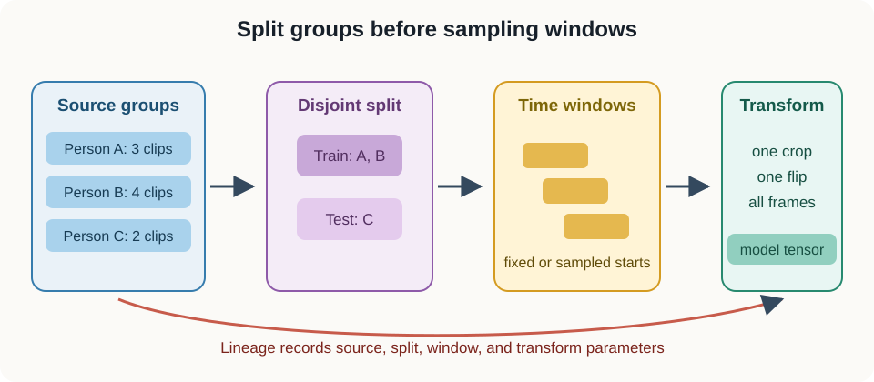
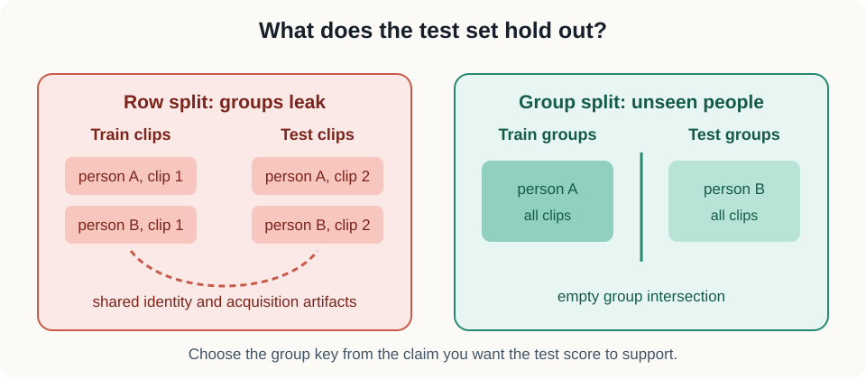

# 08. Group-aware sampling and shortcut learning

## Why this lesson matters

Imagine a video dataset with 40 participants and 100 clips per participant. A random row split produces 4,000 clip rows and may report excellent test accuracy. Yet clips from the same participant share body shape, room background, camera, and recording session. If each participant appears in both training and test sets, the model can recognize participants or acquisition conditions instead of learning the intended task.

This lesson asks a simple question before any model is trained: **Which observations are genuinely new evidence?** The answer determines data partitions, temporal sampling, transformation policy, lineage records, and the meaning of evaluation.

## Prerequisites

You should know training, validation, and test splits, basic probability, and Python indexing. [Lesson 07](07_gradient_updates_and_schedules.md) explains how sampled batches drive parameter updates.

## Learning goals

By the end of this lesson, you will be able to:

1. Identify the independent group for a generalization claim.
2. Construct and verify group-disjoint partitions.
3. Compare deterministic and stochastic temporal windows.
4. Apply temporally consistent random transformations.
5. Record lineage from source observation to model tensor.
6. Diagnose acquisition artifacts and shortcut features.

## 1. Begin with the intended generalization

The correct group key depends on what "new" means.

- To generalize to unseen people, group by participant.
- To generalize to unseen recording sessions, group by session.
- To generalize to unseen hospitals, group by hospital or site.
- To generalize to new households, participant grouping may be too narrow.

Let $G(i)$ be the group identifier of observation row $i$. A train-test split is group-disjoint when

$$
\{G(i): i\in I_{\mathrm{train}}\}
\cap
\{G(i): i\in I_{\mathrm{test}}\}
{}={}
\varnothing.
$$

The set $I_{\mathrm{train}}$ contains training-row indices. The set $I_{\mathrm{test}}$ contains test-row indices. The empty intersection means no group identifier appears in both partitions.

### Mental model

Rows are containers. Groups are evidence units. Splitting containers is safe only when containers from the same evidence unit stay together.

### Group keys are design metadata

The group identifier is usually metadata, not a model feature. A participant ID can be essential for safe splitting even when it must never enter the predictor.

Keep dependency identifiers through preprocessing. A window tensor may no longer contain a filename, but its manifest should still identify participant, session, and source sequence. Losing these identifiers makes leakage difficult to audit.

Real datasets often contain nested dependencies:

$$
\text{site}
\rightarrow
\text{participant}
\rightarrow
\text{session}
\rightarrow
\text{sequence}
\rightarrow
\text{window}.
$$

A participant-disjoint split blocks participant and lower-level overlap. It does not test unseen sites when every site appears in all partitions. Choose the highest dependency level required by the claim.

## 2. Why row-level random splits leak

Let $x_{g,r}$ be repeat $r$ from group $g$. A simple decomposition is

$$
x_{g,r}
{}={}
s_{g,r}+a_g+\varepsilon_{g,r}.
$$

The term $s_{g,r}$ is intended signal. The vector $a_g$ is a stable group-specific artifact, such as background or device response. The residual $\varepsilon_{g,r}$ is observation noise.

If training and test sets contain the same group $g$, both contain $a_g$. A flexible model can use that artifact to recognize the group. The test score then measures performance on new repeats from known groups, not performance on unseen groups.

This problem does not require duplicate files. Two videos can differ in every frame and still share recognizable participant or acquisition information.

## 3. Split groups first

The safest workflow is:

1. Define the group key from the scientific claim.
2. Deduplicate and audit group identifiers.
3. Assign whole groups to train, validation, or test.
4. Create clips, windows, and augmentations inside each partition.
5. Fit data-dependent preprocessing on training groups only.

~~~python
import numpy as np

rng = np.random.default_rng(8)
unique_groups = np.unique(group_ids)
shuffled = rng.permutation(unique_groups)

n_train = int(0.70 * len(shuffled))
n_valid = int(0.15 * len(shuffled))
train_groups = set(shuffled[:n_train])
valid_groups = set(shuffled[n_train:n_train + n_valid])
test_groups = set(shuffled[n_train + n_valid:])

assert train_groups.isdisjoint(valid_groups)
assert train_groups.isdisjoint(test_groups)
assert valid_groups.isdisjoint(test_groups)
~~~

After assigning groups, <code>np.isin</code> creates vectorized row masks. Store the group assignments so a later run cannot silently reshuffle the evaluation set.

## 4. Stratification happens at group level

Class balance can be difficult when groups have different labels or sizes. Row-level stratification can violate group disjointness.

If every group has one label, stratify group identifiers by that label. If a group contains several labels, define a group-level summary or use a constrained assignment algorithm. State the rule before examining test performance.

No split can guarantee perfect balance when the number of groups is small. Report group counts and row counts separately.

### Weighting defines the population average

Suppose group $g$ contributes $n_g$ windows with losses $\ell_{g,1},\ldots,\ell_{g,n_g}$. A global row average is

$$
R_{\mathrm{row}}
{}={}
\frac{\sum_g\sum_{r=1}^{n_g}\ell_{g,r}}
{\sum_g n_g}.
$$

This estimates loss for a randomly selected row. Groups with long recordings receive more weight.

An equal-group average is

$$
R_{\mathrm{group}}
{}={}
\frac{1}{G}
\sum_{g=1}^{G}
\left(
\frac{1}{n_g}
\sum_{r=1}^{n_g}\ell_{g,r}
\right).
$$

The integer $G$ is the number of groups. This estimates loss for a randomly selected group followed by an observation within that group.

Neither estimand is universally correct. Group-disjoint splitting prevents overlap, while group-aware weighting prevents prolific groups from silently dominating. State which population draw the metric represents.

## 5. Temporal windows create dependent rows

Consider a sequence with $L$ time steps. A window has length $W$. A valid start index $s$ satisfies

$$
0\le s\le L-W.
$$

The Python slice is <code>sequence[s:s + W]</code>. It includes index $s$ and excludes index $s+W$.

With stride $q$, deterministic starts are

$$
S
{}={}
\{0,q,2q,\ldots\}
\cap
\{0,1,\ldots,L-W\}.
$$

The symbol $S$ is the set of start indices. If $L=11$, $W=4$, and $q=3$, stride-aligned starts are $0,3,6$. The last valid start is $7$. You may append $7$ for endpoint coverage, but then the last spacing is smaller.

## 6. Deterministic and stochastic sampling serve different goals

Deterministic windows give stable coverage and reproducible metrics. Use them for validation and testing.

Stochastic training can draw

$$
s
\sim
\mathrm{Uniform}\{0,1,\ldots,L-W\}.
$$

The symbol $\sim$ means "is sampled from." Over many epochs, random starts expose more temporal offsets without storing every possible window.

Use an explicit random-number generator:

~~~python
def random_start(length, window, rng):
    if not 0 < window <= length:
        raise ValueError("require 0 < window <= length")
    return int(rng.integers(0, length - window + 1))
~~~

An explicit generator makes the source of randomness visible and testable. A fixed seed alone is not a lineage record because call order can still change sampled windows.

### Sampling distributions need a definition

Uniform sampling over valid starts gives every start equal probability. It does not give every frame equal probability because middle frames belong to more possible windows than boundary frames.

If uniform frame exposure matters, design a different sampler or weight windows. Event-centered sampling can improve exposure to rare events, but it changes the training distribution. Record the policy so evaluation and later reweighting remain possible.

Suppose validation uses length-4 windows from a sequence of length 11 at starts $0,3,6,7$. Evaluating these same four windows on every run makes model comparisons paired at the window level. Drawing four new starts each run mixes model change with sampling change.

## 7. Overlap is exposure, not independence

Two windows of length $W$ separated by stride $q<W$ share $W-q$ time steps. Their overlap fraction is

$$
\frac{W-q}{W}.
$$

For $W=16$ and $q=4$, the overlap fraction is $12/16=0.75$. The windows may help optimization, but they do not supply two independent measurements.

Create windows only after group partitioning. Otherwise adjacent windows from one source sequence can cross folds.

## 8. Transformations should respect time

Suppose a video window has shape $(T,H,W,C)$:

- $T$ is the number of frames.
- $H$ and $W$ are image height and width.
- $C$ is the number of color channels.

A random horizontal flip should normally draw one Boolean value for the whole window. Drawing a new flip per frame creates artificial flicker.

~~~python
def consistent_flip(window, rng):
    flip = bool(rng.random() < 0.5)
    if flip:
        return np.flip(window, axis=2).copy(), flip
    return window.copy(), flip
~~~

The call to <code>np.flip</code> can return a negative-stride view. The copy creates contiguous storage that <code>torch.from_numpy</code> can safely consume.

Consistency is not a universal rule. Independent sensor noise per frame can be appropriate if it reflects the real data-generating process. The transformation scope should match plausible variation.

### Transform units and label validity

A crop has coordinates and size measured in pixels. A speed perturbation has units of frames or seconds. A color transform acts on channels. Recording these parameters makes augmentation scientifically interpretable.

Some labels transform with the input. A horizontal flip can swap left and right labels. A temporal reversal can change movement direction. Visual consistency is not sufficient; labels must remain valid under the transformation.

## 9. Data lineage makes every tensor traceable

Lineage answers: "Where did this exact model input come from?"

A useful record contains:

- immutable source identifier,
- group identifier,
- partition name,
- original sequence length,
- window start and stop,
- sampling policy and random seed,
- sampled transform parameters,
- preprocessing version,
- label source and label version.

The workflow is

$$
\text{source}
\rightarrow
\text{group partition}
\rightarrow
\text{window}
\rightarrow
\text{transform}
\rightarrow
\text{tensor}.
$$

Store decisions as structured data, not only in filenames. CSV, JSON Lines, or Parquet is sufficient. A stable sample identifier can hash canonical lineage fields.

### Lineage as an executable contract

Given a lineage record and source-data version, a deterministic loader should reconstruct the same pre-transform window. For random transforms, store sampled parameters or a stable per-sample seed.

Useful assertions check that:

- every sample's group belongs to its declared partition,
- start and stop indices are within source bounds,
- window length matches the model contract,
- preprocessing version is known,
- no sample identifier appears in more than one partition.

These checks turn provenance from documentation into a tested interface.

## 10. Shortcut learning

A shortcut is a feature that predicts labels in collected data but does not represent the intended construct.

Let $Y$ be the target label and $A$ a suspected artifact. In training data, the artifact can be predictive:

$$
P_{\mathrm{train}}(Y\mid A)
\ne
P_{\mathrm{train}}(Y).
$$

At deployment, the association may weaken or reverse. The model follows the easiest reliable signal available to its objective, even when that signal is scientifically irrelevant.

Common shortcuts include:

- site or device,
- compression quality,
- room background,
- text overlays,
- duration and padding,
- missingness patterns,
- preprocessing order,
- identity-bearing filenames.

### Worked scenario

Suppose all positive-class videos were captured on device A and all negative-class videos on device B. A device classifier can achieve perfect label accuracy without reading motion. A random row split preserves the device-label association. Testing on both devices for both labels breaks it.

Shortcuts are relative to a claim. Device identity is a shortcut for a biological movement claim, but it may be the intended signal in device-quality monitoring. Name the intended construct before labeling a feature spurious.

Removing one known artifact-label correlation does not prove that the model uses the intended mechanism. Other correlated artifacts can remain.

## 11. Shortcut diagnostics

No single diagnostic proves that shortcuts are absent. Combine several:

1. Compare row-level and group-disjoint scores.
2. Train an artifact-only baseline from site, device, duration, or missingness.
3. Alter a suspected artifact while preserving intended content.
4. Report metrics within each acquisition subgroup.
5. Inspect nearest neighbors for shared background rather than shared semantics.
6. Permute labels within groups to test what group identity alone supports.

A counterfactual perturbation is useful only when it changes the suspected artifact without accidentally changing the intended signal.

### Interpreting a split gap

Suppose row-split accuracy is 95 percent and participant-disjoint accuracy is 62 percent. The gap is evidence that row-level evaluation benefited from participant-linked information. It does not prove that all 33 percentage points came from one specific artifact.

Inspect performance by group, device, and site. Averages can hide a model that succeeds only under one acquisition condition.

## 12. Efficiency notes

- Use <code>np.unique</code> to encode group identifiers once.
- Use <code>np.isin</code> for vectorized partition masks.
- Store window indices instead of duplicated window arrays when reconstruction is cheap.
- Use <code>Tensor.unfold</code> for equal-length sliding-window views.
- Use group-balanced samplers when prolific groups would dominate batches.
- Copy a window before any in-place transform if it aliases source storage.

## 13. Common failure modes

1. **Grouping too narrowly:** recording splits leak participant identity.
2. **Preprocessing before splitting:** test statistics influence training.
3. **Random evaluation windows:** metric noise obscures model changes.
4. **Framewise random crops:** augmentation jitter replaces motion.
5. **A seed without a manifest:** source and transform choices remain hidden.
6. **Row-weighted evaluation:** participants with more repeats dominate.
7. **Repeated test inspection:** the test set becomes tuning feedback.

## 14. Exercises

1. A dataset has 100 participants and 20 windows per participant. Which count controls participant-level uncertainty?
2. List starts for $L=10$, $W=4$, and $q=2$.
3. Why does fitting standardization on all partitions leak information?
4. Design one lineage record for a transformed window.

### Brief solutions

1. Under a participant-independence assumption, the nominal independent-unit count is 100. The 2,000 windows are correlated repeats.
2. The starts are $0,2,4,6$.
3. Test means and variances influence the transformation used during training.
4. Include source ID, group ID, split, start, stop, transform parameters, preprocessing version, and label version.

## Recap

Group-aware sampling aligns evaluation with the intended independent unit. Deterministic windows stabilize evaluation, while stochastic windows broaden training exposure. Temporal transformations need a scientifically plausible scope. Lineage makes every tensor auditable, and shortcut diagnostics test whether performance depends on acquisition artifacts.

## Next lesson

[09: Eigenspectra and effective rank](09_eigenspectra_and_effective_rank.md) studies the geometry of the representations produced by this pipeline.

## Continue in the notebook

[Open the executable lesson 08 notebook](../implementations/08_group_aware_sampling.ipynb) to compare row and group splits, sample windows, and build a lineage record.
