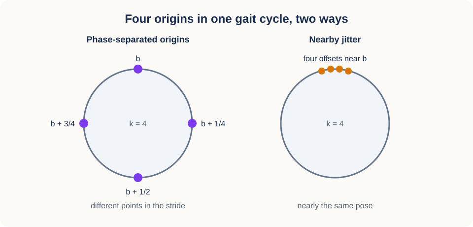
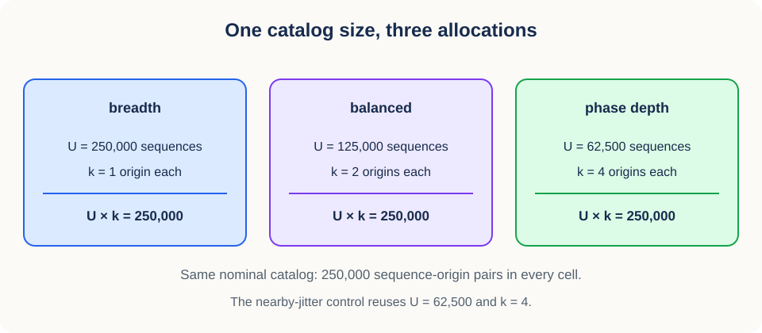
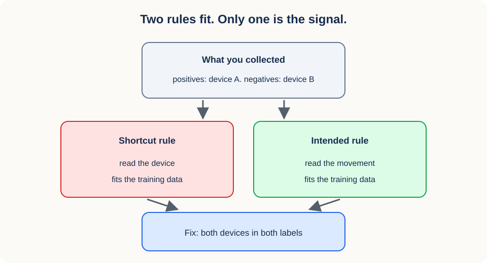

# 08. Group-aware sampling and semantic phase origins

## Why this lesson matters

Picture a video dataset with 40 participants and 100 clips each. Split the 4,000 clip rows at random, train, and the test score may look excellent. It is also close to meaningless. Clips from one participant share a body shape, a room, a camera, and a recording session, so if that participant appears in both halves of the split, the model can win by recognizing the person or the room instead of the movement.

Lesson 07 fixed how much optimization each model receives. This lesson fixes what each model receives it from. One question runs through everything below: **which observations are genuinely new evidence?** The answer decides how you split data, where you sample windows in time, which control condition you build, what you record about every tensor, and what a test score is allowed to mean.

## Prerequisites

You should know training, validation, and test splits, basic probability, and Python indexing. [Lesson 07](07_gradient_updates_and_schedules.md) explains how sampled batches drive parameter updates and why every condition in a study gets the same exposure.

## Learning goals

By the end of this lesson, you will be able to:

1. Identify the independent group for a generalization claim.
2. Construct and verify group-disjoint partitions.
3. Turn frames into 16-frame windows and measure their overlap.
4. Place nested phase-separated origins in one gait cycle.
5. Build a nearby-jitter control that changes only the thing you meant to change.
6. Explain what nominal catalog size does and does not equalize.
7. Isolate an intervention with paired, named random streams.
8. Record lineage from source observation to model tensor.
9. Diagnose acquisition artifacts and shortcut features.

## 1. Begin with the intended generalization

There is no universally correct grouping. The right group key falls out of the sentence you want to be able to say at the end of the study, because "new" means different things in different sentences.

- To generalize to unseen people, group by participant.
- To generalize to unseen recording sessions, group by session.
- To generalize to unseen hospitals, group by hospital or site.
- To generalize to new households, participant grouping may be too narrow.

Write $G(i)$ for the group identifier of row $i$, for example the participant that row came from. Let $I_{\mathrm{train}}$ be the set of training-row indices and $I_{\mathrm{test}}$ the set of test-row indices. A split is group-disjoint when the two sets of groups share nothing:

$$
\{G(i): i\in I_{\mathrm{train}}\}
\cap
\{G(i): i\in I_{\mathrm{test}}\}
{}={}
\varnothing.
$$

The empty intersection is the whole content of the definition: no group identifier may appear on both sides.

### Mental model

Rows are containers, and groups are evidence units. You are allowed to divide containers between partitions only when all the containers belonging to one evidence unit travel together.

### Group keys are design metadata

Note that the group key is usually not a model input. A participant ID can be essential for splitting safely and still be forbidden inside the predictor, and those two facts do not conflict.

That means the identifiers have to survive preprocessing even though the model never sees them. A window tensor no longer carries a filename, but its manifest row should still name the participant, session, and source sequence. Once those links are gone, leakage becomes unauditable rather than absent.

Real datasets nest dependencies several levels deep:

$$
\text{site}
\rightarrow
\text{participant}
\rightarrow
\text{session}
\rightarrow
\text{sequence}
\rightarrow
\text{window}.
$$

Splitting at one level blocks that level and everything below it. A participant-disjoint split prevents participant, session, sequence, and window overlap, but it says nothing about unseen sites if every site appears in every partition. Pick the highest level your claim requires.

## 2. Why row-level random splits leak

The previous section defined the rule. This section explains the mechanism it protects against, using the simplest model of a recording that captures the problem.

Let $x_{g,r}$ be repeat $r$ from group $g$, and decompose it into three parts:

$$
x_{g,r}
{}={}
s_{g,r}+a_g+\varepsilon_{g,r}.
$$

The term $s_{g,r}$ is the intended signal, the part you want the model to learn. The vector $a_g$ is a stable artifact of the group itself: the background, the body shape, the response of one camera. It carries the subscript $g$ and no subscript $r$ because it is the same in every repeat from that group. The residual $\varepsilon_{g,r}$ is observation noise.

Now suppose group $g$ has rows in both partitions. Then $a_g$ is in both partitions too, and a flexible model can use it to identify the group and look up what that group usually does. The test score still measures something real, but that something is performance on new repeats from known groups, which is a much weaker claim than performance on unseen groups.

None of this requires duplicate files. Two videos can differ in every single frame and still share the participant and acquisition information that makes $a_g$ predictive.

## 3. Split groups first

The mechanism above suggests an order of operations, and the order matters more than any individual step in it:

1. Define the group key from the scientific claim.
2. Deduplicate and audit the group identifiers themselves.
3. Assign whole groups to train, validation, or test.
4. Create clips, windows, and augmentations inside each partition.
5. Fit data-dependent preprocessing on training groups only.

~~~python
import numpy as np

rng = np.random.default_rng(8)
unique_groups = np.unique(group_ids)
shuffled = rng.permutation(unique_groups)

n_train = int(0.70 * len(shuffled))
n_valid = int(0.15 * len(shuffled))
train_groups = set(shuffled[:n_train])
valid_groups = set(shuffled[n_train:n_train + n_valid])
test_groups = set(shuffled[n_train + n_valid:])

assert train_groups.isdisjoint(valid_groups)
assert train_groups.isdisjoint(test_groups)
assert valid_groups.isdisjoint(test_groups)
~~~

Once groups are assigned, <code>np.isin</code> turns them into vectorized row masks in one call. Persist the assignment to disk. A split that is recomputed from a seed at each run is one library upgrade away from silently reshuffling your evaluation set.

## 4. Stratification happens at group level

Splitting by group makes class balance harder, because you can no longer move individual rows to even out the classes. Row-level stratification would fix the balance and break disjointness, so it is not available.

Work at the group level instead. If every group carries one label, stratify the group identifiers by that label. If a group contains several labels, define a group-level summary such as the majority label, or use a constrained assignment algorithm. Whichever you choose, state the rule before looking at test performance.

With few groups, no method guarantees good balance. Report group counts and row counts separately so a reader can see which one is small.

### Weighting defines the population average

Balance is one half of the story; weighting is the other. Once the split is fixed, you still have to decide what a reported average is an average over.

Suppose group $g$ contributes $n_g$ windows with losses $\ell_{g,1},\ldots,\ell_{g,n_g}$. The global row average is

$$
R_{\mathrm{row}}
{}={}
\frac{\sum_g\sum_{r=1}^{n_g}\ell_{g,r}}
{\sum_g n_g}.
$$

This estimates the loss for a randomly selected row, so a participant who was recorded for an hour counts far more than one recorded for a minute.

The equal-group average instead gives every group the same weight:

$$
R_{\mathrm{group}}
{}={}
\frac{1}{G}
\sum_{g=1}^{G}
\left(
\frac{1}{n_g}
\sum_{r=1}^{n_g}\ell_{g,r}
\right).
$$

Here $G$ is the number of groups. This estimates the loss for a randomly selected group followed by a randomly selected observation inside it.

Neither estimand is universally right. They answer different questions, and the point is to say which question you asked. Group-disjoint splitting stops overlap; group-aware weighting stops prolific groups from quietly setting the score.

## 5. From frames to windows

Splitting decides which sequences a model may use. The next four sections decide what it draws from inside a sequence, which is where this curriculum's active study lives.

Start with the arithmetic of a window. Let sequence $i$ contain $n_i$ contiguous frames, and let the training clip length be $T=16$ frames. A window is identified by its start frame, and the number of valid integer starts is

$$
W_i=n_i-T+1.
$$

The Python slice for start $a$ is `sequence[a:a + T]`, which contains 16 frames because the stop index is excluded. For $n_i=48$ there are $48-16+1=33$ valid starts, namely 0 through 32.

Two windows from one sequence are not two independent observations, and it is worth being precise about how far from independent they are. Two starts that differ by $d$ frames share $T-d$ frames when $d<T$, so their overlap fraction is $(T-d)/T$. Starts eight frames apart share

$$
\frac{T-8}{T}=\frac{8}{16}=0.5,
$$

that is, half their content. Starts 16 or more frames apart share no frames at all, though they still share the participant, the session, and the recording conditions. No spacing rule turns windows from one sequence into new participants or new sessions.

## 6. Phase origins put windows where the pose is different

Frame spacing is a proxy for what we actually care about, which is whether two windows show the body in different parts of its movement. Walking is periodic, so the natural coordinate is not the frame index but the position within a stride.

Call that position the phase, a number in $[0,1)$ where 0 and 1 are the same point of the gait cycle. For each eligible sequence, a frozen estimator computes the stride period and a confidence value from a documented silhouette signal such as width or area autocorrelation. A stable hash of the sequence identifier and the replicate block then picks a base phase $b_{i,r}$ uniformly in $[0,1)$, where $i$ indexes the sequence and $r$ indexes the replicate block.

The semantic origin sets are nested and quarter-cycle separated:

$$
O_{i,r}^{(1)}=\{b_{i,r}\},\qquad
O_{i,r}^{(2)}=\{b_{i,r},b_{i,r}+1/2\},
$$

$$
O_{i,r}^{(4)}=\{b_{i,r},b_{i,r}+1/4,b_{i,r}+1/2,b_{i,r}+3/4\}\pmod 1.
$$

Nesting is deliberate: $O^{(1)}\subset O^{(2)}\subset O^{(4)}$, so moving from one origin to four adds views without moving the first one. The modulo keeps every origin inside one cycle.

### Worked example

Take a sequence of $n_i=48$ frames with an estimated stride period of $P=32$ frames and base phase $b=0.1$. The four semantic origins are the phases $0.1$, $0.35$, $0.6$, and $0.85$. Multiplying by the period and rounding gives start frames

$$
3,\quad 11,\quad 19,\quad 27.
$$

All four are at most 32, so all four are valid starts for this sequence. Consecutive starts are eight frames apart, so consecutive windows overlap by 50 percent by the formula in section 5, while being half a stride apart in pose. That is the intended situation: the pixels are related, and the body configuration is not.

### Stable identity, not row position

The base phase must come from the sequence's identity, never from where the sequence happens to sit in a manifest. Insert one new row at the top of a manifest and every downstream base phase would change, which would make two pools incomparable for no scientific reason.

~~~python
import hashlib
import json

def stable_uint64(namespace, *parts):
    payload = json.dumps(
        [namespace, *parts], separators=(",", ":"), ensure_ascii=False
    ).encode("utf-8")
    digest = hashlib.blake2b(payload, digest_size=8).digest()
    return int.from_bytes(digest, "little")

def base_phase(sequence_id, replicate_seed):
    seed = stable_uint64("phase-v1", sequence_id, replicate_seed)
    return np.random.default_rng(seed).random()
~~~

Python's built-in `hash` is randomized per process and must not be used here. A versioned namespace string such as `"phase-v1"` is what lets you change the rule later without pretending the old catalog and the new one are the same. Deriving the phase from identity buys **nested-pool stability**: when a smaller pool of sequences is a subset of a larger one, every shared sequence keeps the same base phase and the same origins in both.

## 7. Nearby jitter is the matched control

Four origins per sequence differ from one origin in two ways at once: there are more windows, and the windows show different parts of the stride. A control condition separates those two effects by keeping the count and removing the separation.

Nearby jitter does exactly that. It places four distinct origins at small symmetric offsets around the same base phase, for example at $-0.04$, $-0.04/3$, $+0.04/3$, and $+0.04$ cycles. The count is four in both conditions, the base phase distribution is identical, and only the spread changes.

Continue the worked example with $P=32$ and $b=0.1$. The jittered phases are $0.06$, $0.0867$, $0.1133$, and $0.14$, and multiplying by 32 and rounding gives starts $2$, $3$, $4$, and $4$. Two of them collide after rounding, and the widest pair is two frames apart, so those windows share 14 of their 16 frames. This is why the jitter radius, the rounding rule, the boundary handling, and the weighting are all chosen by an outcome-blind audit and then frozen before any training run.

The audit is what turns "the origins are semantically separated" from an assumption into evidence. On a stratified sample, report phase confidence, origin coverage, realized starts, window overlap, pose-trajectory separation, the nominal sequence count, and the effective near-duplicate cluster count, and validate a subset manually while blinded to condition. If separated origins do not measurably differ from jittered ones, the phase branch stops rather than continuing with a weaker claim.

## 8. Nominal catalog size equalizes counting, not information

With origins defined, we can state the design of the study these lessons support. It compares three ways of reaching the same number of sequence-origin pairs.

Let $U$ be the number of unique sequences in a cell and $k$ the number of origins per sequence. The nominal catalog size is their product:

$$
N=U\,k.
$$

The word nominal is doing real work in that sentence. $N$ counts distinct `(sequence_id, origin)` pairs the sampler is allowed to draw. It does not count independent observations, and it makes no claim that one new sequence and one extra origin carry the same information.

The allocation table has four entries. Three of them are path points that move diversity from across sequences to within sequences at constant $N$, and the fourth is the jitter control:

| Allocation | $U$ | $k$ | Origin policy | Purpose |
| --- | ---: | ---: | --- | --- |
| breadth | 250,000 | 1 | base phase | New-sequence extreme |
| balanced | 125,000 | 2 | phase separated | Intermediate path point |
| phase depth | 62,500 | 4 | phase separated | Phase-separated extreme |
| nearby jitter | 62,500 | 4 | nearby jitter | Mechanism diagnostic |

Every row has $U\,k=250{,}000$. Where the frozen source-group rule permits, the pools are nested inside a replicate block, so the 62,500 sequences are a subset of the 125,000, which are a subset of the 250,000. Nesting means a difference between allocations cannot be blamed on one allocation drawing luckier sequences.

### Recurrence is the number to report beside the catalog

Equal catalog size does not mean equal repetition, so report how often the sampler is expected to come back to the same atom. Fixed exposure $C$ is the number of sampled clips from lesson 07, and planned recurrence is

$$
\frac{C}{N}.
$$

With $N=250{,}000$ and the two permitted exposure tiers, recurrence is $8{,}192{,}000/250{,}000=32.77$ or $4{,}096{,}000/250{,}000=16.38$ draws per nominal atom. Every cell in the study gets the same number because $N$ and $C$ are the same in every cell.

A related quantity answers a different question: after $C$ draws made uniformly with replacement from $N$ atoms, how many distinct atoms is the sampler expected to have touched? Each atom is missed on a single draw with probability $1-1/N$, so

$$
E(N)=
N\left[1-\left(1-\frac{1}{N}\right)^{C}\right].
$$

This is an occupancy expectation and nothing more. At these exposure levels $E(N)$ is very close to $N$, which is another way of saying the sampler visits essentially the whole catalog many times over. For numerical stability at large $C$, evaluate the bracket as `-expm1(C * log1p(-1.0 / N))` rather than as `1 - (1 - 1/N)**C`, because the naive form loses all its significant digits when $1/N$ is tiny.

State the interpretation limits as plainly as the numbers. Equal $U\,k$ does not equalize information, phase origins are not independent examples, and three correlated path points do not establish a general law or an exchange rate between sequences and clips.

## 9. Pair nuisance streams and fix sampled exposure

The comparison in section 8 is only about where diversity sits if nothing else differs between cells. That requires deliberate control over randomness, because random number generators couple everything that draws from them.

Give each kind of draw its own named stream:

- ordered sequence draws,
- phase origins,
- spatial transformations,
- prediction masks.

Within a matched pair such as phase depth against nearby jitter, the sequence, spatial, and mask streams are shared. Only the origin construction differs. The pair also shares initialization, optimizer settings, effective batch size, exposure, and the final-checkpoint rule, so a test should compare the recorded draws directly instead of assuming that equal base seeds imply equal nuisance values.

Separate generators are what make that sharing possible. With one global generator, a condition that makes one extra call for its origins would shift every later crop and mask, and the two runs would differ in ways nobody chose. Named streams keep the sequence draw and the nuisance parameters aligned even when the origin policy consumes different amounts of randomness.

Total sampled-clip exposure $C$ is fixed across cells, and a repeated draw still counts toward it. That is the point of the design rather than a flaw in it: the available support changes while optimizer exposure does not. Use the final planned checkpoint everywhere, and never let a downstream outcome choose a different epoch, seed, or rerun.

## 10. Transformations should respect time

Origins choose where a window starts. Transformations decide what happens to it afterward, and they need their own scope rule.

A video window has shape $(T,H,W,C)$, where $T$ is the number of frames, $H$ and $W$ are the image height and width in pixels, and $C$ is the number of color channels. A random horizontal flip should normally draw one Boolean for the whole window. Drawing a new flip per frame would create a flicker that exists in no real recording.

~~~python
def consistent_flip(window, rng):
    flip = bool(rng.random() < 0.5)
    if flip:
        return np.flip(window, axis=2).copy(), flip
    return window.copy(), flip
~~~

The call to <code>np.flip</code> returns a view with a negative stride. The copy makes contiguous storage that <code>torch.from_numpy</code> can consume safely, and it also protects the source array from any later in-place operation.

Per-window is not a universal rule, though. Independent sensor noise per frame is realistic and belongs at frame scope. Match the scope of a transformation to the scale at which the real world varies.

### Transform units and label validity

Recording a transformation means recording it in its own units. A crop has pixel coordinates and a pixel size. A speed perturbation has units of frames or seconds. A color transform acts on channels. Parameters stored with their units are what let someone reconstruct or reason about the augmentation later.

Some labels transform along with the input, and forgetting that produces silently wrong data. A horizontal flip swaps left and right leg labels. A temporal reversal changes the direction of movement. A window that looks plausible can still carry a label that is no longer true of it.

## 11. Shortcut learning

Everything so far protects the inputs. This section is about what the model does with them, because a correctly split dataset can still be won for the wrong reason.

A shortcut is a feature that predicts the label in the collected data without representing the construct you care about. Let $Y$ be the target label and $A$ a suspected artifact such as the recording device. In the training data the artifact is predictive when

$$
P_{\mathrm{train}}(Y\mid A)
\ne
P_{\mathrm{train}}(Y).
$$

The left side is the label distribution once you know the artifact, and the right side is the label distribution overall. When they differ, reading $A$ tells you something about $Y$, and gradient descent has no reason to prefer the harder signal you intended.

Common shortcuts include:

- site or device,
- compression quality,
- room background,
- text overlays,
- duration and padding,
- missingness patterns,
- preprocessing order,
- identity-bearing filenames.

### Worked scenario

Suppose every positive-class video was captured on device A and every negative-class video on device B. A model that only classifies the device reaches perfect label accuracy without ever looking at motion. A random row split preserves the association, so the test set rewards the shortcut too. Recording both labels on both devices breaks it, and only then does the score depend on movement.

Shortcuts are defined relative to a claim, not in the abstract. Device identity is a shortcut for a claim about biological movement and is the intended signal for a claim about device quality. Name the construct first, then decide what counts as spurious.

Removing one artifact-label correlation also does not prove the model now uses the intended mechanism. Other correlated artifacts can remain, which is why the next section combines several diagnostics instead of trusting one.

## 12. Shortcut diagnostics

No single test proves shortcuts are absent, so run a set of them and read the pattern:

1. Compare row-level and group-disjoint scores.
2. Train an artifact-only baseline from site, device, duration, or missingness.
3. Alter a suspected artifact while preserving intended content.
4. Report metrics within each acquisition subgroup.
5. Inspect nearest neighbors for shared background rather than shared semantics.
6. Permute labels within groups to test what group identity alone supports.

A counterfactual perturbation earns its keep only when it changes the suspected artifact and leaves the intended signal intact. If your background swap also blurs the walker, a drop in accuracy proves nothing.

### Interpreting a split gap

Suppose row-split accuracy is 95 percent and participant-disjoint accuracy is 62 percent. The 33 point gap is evidence that row-level evaluation was benefiting from participant-linked information, which is exactly what section 2 predicts. It does not identify which artifact supplied it or prove that a single artifact supplied all of it.

Follow the gap with per-group, per-device, and per-site reporting. An average can hide a model that works under one acquisition condition and fails everywhere else.

## 13. Data lineage makes every tensor traceable

Every decision in this lesson is only auditable if it was written down next to the data it affected. Lineage answers one question: where did this exact model input come from?

A useful record contains:

- immutable source identifier,
- group identifier,
- partition name,
- original sequence length,
- replicate block and allocation cell,
- window start and stop,
- base phase, origin phase, and origin policy,
- phase-catalog digest and manifest digest,
- separate sequence, phase, spatial, and mask stream versions,
- sampled transform parameters,
- planned exposure and effective batch size,
- preprocessing version,
- label source and label version.

The path it describes is short and worth memorizing:

$$
\text{source}
\rightarrow
\text{group partition}
\rightarrow
\text{origin}
\rightarrow
\text{window}
\rightarrow
\text{transform}
\rightarrow
\text{tensor}.
$$

Store these as structured data rather than encoding them in filenames. CSV, JSON Lines, or Parquet all work. A stable sample identifier can be a hash of the canonical lineage fields, which gives you a name that changes exactly when the content changes.

### Lineage as an executable contract

The test of a lineage record is mechanical: given the record and the source-data version, a deterministic loader should reconstruct the same pre-transform window. For random transforms, store either the sampled parameters or a stable per-sample seed that regenerates them.

Assert the properties you rely on, one assertion per property:

- every sample's group belongs to its declared partition,
- start and stop indices are within source bounds,
- window length matches the model contract,
- every start comes from the sequence's catalogued origin set,
- a shared sequence keeps its base phase across nested pools,
- paired cells share sequence, spatial, and mask draws,
- the treatment audit record carries the phase-catalog digest and its measurements,
- no sample identifier appears in more than one partition.

Together these turn provenance from documentation, which drifts, into an interface, which fails loudly.

## 14. Efficiency notes

- Use <code>np.unique</code> to encode group identifiers once.
- Use <code>np.isin</code> for vectorized partition masks.
- Store window indices instead of duplicated window arrays when reconstruction is cheap.
- Use <code>Tensor.unfold</code> for equal-length sliding-window views.
- Use group-balanced samplers when prolific groups would dominate batches.
- Copy a window before any in-place transform if it aliases source storage.
- Precompute each sequence's period, base phase, and origin starts once per immutable catalog.
- Evaluate occupancy with stable `log1p` and `expm1` operations at large exposure.

## 15. Common failure modes

1. **Grouping too narrowly:** splitting by recording leaks participant identity.
2. **Preprocessing before splitting:** test statistics influence training.
3. **Random evaluation windows:** metric noise obscures real model changes.
4. **Framewise random crops:** augmentation jitter replaces motion.
5. **A seed without a manifest:** source and transform choices remain hidden.
6. **Row-weighted evaluation:** participants with more repeats set the score.
7. **Repeated test inspection:** the test set becomes tuning feedback.
8. **Manifest-row hashing:** nested pools give the same sequence different base phases.
9. **One generator for every draw:** origin choices shift crop and mask randomness.
10. **Calling origins independent:** shared source causes and window overlap are ignored.
11. **Reading iso-catalog as iso-information:** equal $U\,k$ is treated as equal evidence.
12. **Unequal exposure:** the origin intervention is mixed with extra optimization.

## 16. Exercises

1. A dataset has 100 participants and 20 windows per participant. Which count controls participant-level uncertainty?
2. For $n_i=48$, $T=16$, period $P=32$, and base phase $b=0.1$, find the four semantic origin phases and their start frames.
3. Why do the phase-depth and nearby-jitter cells have the same nominal catalog size but different treatment strength?
4. Why must spatial transforms and masks use streams separate from the phase origins?
5. Design one lineage record for a phase-separated training window.

### Brief solutions

1. Under a participant-independence assumption, the nominal independent-unit count is 100. The 2,000 windows are correlated repeats of those 100 units.
2. The phases are $0.1$, $0.35$, $0.6$, and $0.85$, giving starts $3$, $11$, $19$, and $27$. All are at most $W_i-1=32$, so all four windows fit.
3. Both have $U=62{,}500$ and $k=4$, so both have $N=250{,}000$. Only the phase-separated cell places its four origins a quarter cycle apart, so only it changes which parts of the stride the model sees.
4. Separate streams keep the nuisance draws paired even when the two origin policies consume different amounts of randomness.
5. Include source and group IDs, partition, replicate block, allocation, origin policy, base and origin phase, stream versions, start, stop, transform parameters, manifest and phase-catalog digests, planned exposure, and preprocessing version.

## Recap

Group-aware sampling lines the evaluation up with the independent unit the claim is about. Inside a sequence, phase gives a coordinate that frame spacing only approximates: nested semantic origins spread four views across one gait cycle, and nearby jitter holds the count fixed while collapsing the spread, which is what makes it a control. Nominal catalog size $N=U\,k$ equalizes counting across cells and nothing else, so recurrence and the semantic audit are reported next to it. Stable identity hashing, nested pools, and paired nuisance streams keep the intervention isolated, lineage keeps every tensor traceable, and shortcut diagnostics test whether a score depends on acquisition artifacts instead of movement.

## Next lesson

[09: Eigenspectra and effective rank](09_eigenspectra_and_effective_rank.md) studies the geometry of the representations this pipeline produces.

## Continue in the notebook

[Open the executable lesson 08 notebook](../implementations/08_group_aware_sampling.ipynb) to split groups, build nested semantic origins and their matched jitter control, check the iso-catalog arithmetic, and assemble the treatment-audit record.
