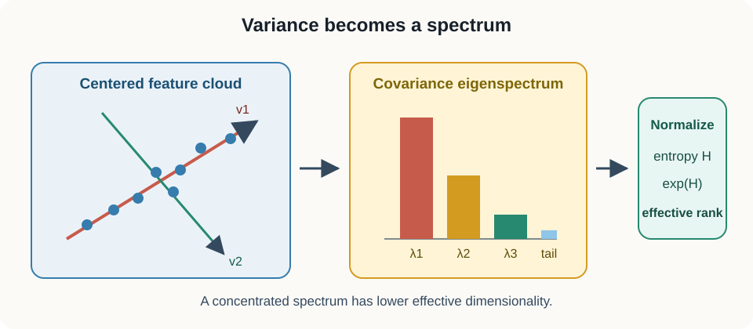
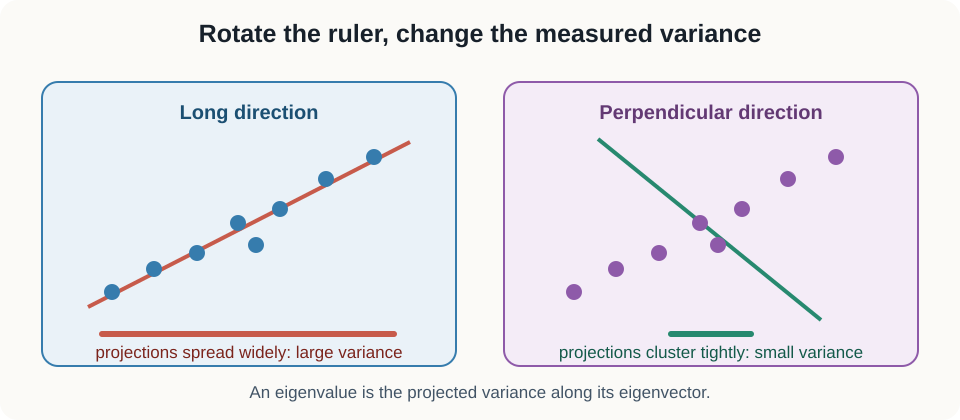
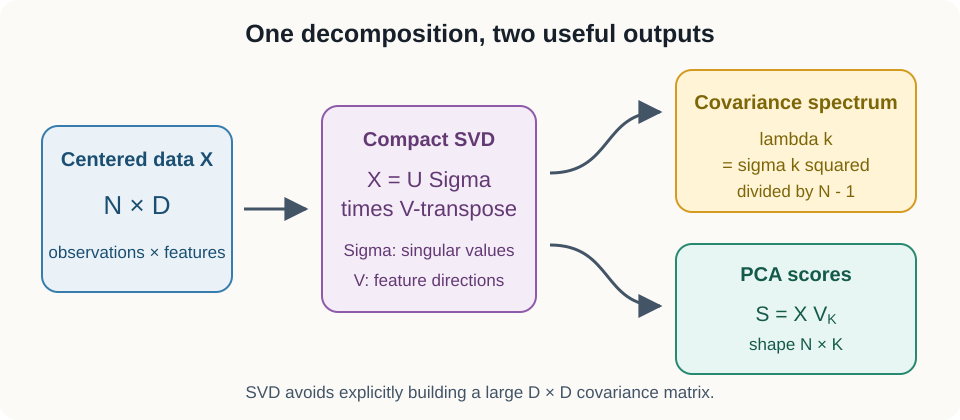

# 09. Covariance eigenspectra and effective rank

## Why this lesson matters

Suppose an encoder returns 512 features. Does it really use 512 independent directions, or does almost all variation live in a much smaller subspace? Counting coordinates cannot answer that question. A representation can have hundreds of columns while behaving like a one-dimensional signal.

Covariance eigenspectra reveal how variation is distributed across directions. Principal component analysis turns those directions into coordinates. Spectral entropy and effective rank summarize whether variance is concentrated or spread out.

## Prerequisites

You should know vectors, matrix multiplication, means, and covariance from [Lesson 06](06_representation_collapse.md). We develop every new linear algebra idea from directional variance.

## Learning goals

By the end of this lesson, you will be able to:

1. Interpret covariance as variance measured in arbitrary directions.
2. Explain eigenvectors and eigenvalues geometrically.
3. Connect covariance eigendecomposition with singular-value decomposition.
4. Project and reconstruct data with principal components.
5. Handle signs, tied eigenvalues, and nearly tied eigenspaces correctly.
6. Compute spectral entropy and effective rank.

## 1. Start with a cloud of points

Imagine measuring height and arm span for many people. Each person becomes one row in a matrix $Z$ with shape $(N,D)$:

- $N$ is the number of people.
- $D=2$ is the number of features.
- Column 1 stores height.
- Column 2 stores arm span.

The point cloud will often be elongated because height and arm span vary together. The coordinate axes are convenient for storage, but the longest direction of the cloud can be diagonal.

Center each feature:

$$
X_{ij}=Z_{ij}-\mu_j,
\qquad
\mu_j=\frac{1}{N}\sum_{i=1}^{N}Z_{ij}.
$$

The scalar $\mu_j$ is the mean of feature $j$. The centered matrix $X$ has shape $(N,D)$ and each column sums to zero.

The sample covariance is

$$
C=\frac{1}{N-1}X^\mathsf{T}X.
$$

The transpose $X^\mathsf{T}$ has shape $(D,N)$. Therefore $C$ has shape $(D,D)$. Its diagonal contains feature variances, and its off-diagonal entries contain pairwise covariances.

## 2. Variance can be measured along any direction

Choose a direction vector $v$ with shape $(D,)$. Require it to have unit length:

$$
\lVert v\rVert_2=1.
$$

Project every centered observation onto $v$:

$$
y=Xv.
$$

The vector $y$ has shape $(N,)$. Each value $y_i$ is the signed coordinate of observation $i$ along direction $v$.

Because $X$ is centered, $y$ is centered. Its sample variance is

$$
\frac{1}{N-1}y^\mathsf{T}y.
$$

Substitute $y=Xv$:

$$
\frac{1}{N-1}y^\mathsf{T}y
{}={}
\frac{1}{N-1}v^\mathsf{T}X^\mathsf{T}Xv
{}={}
v^\mathsf{T}Cv.
$$

The final scalar $v^\mathsf{T}Cv$ is variance along direction $v$. This interpretation is the foundation of PCA.

### Mental model

Place a ruler through the center of the point cloud. Project every point onto the ruler. Rotate the ruler. The variance of the projected marks changes. PCA finds the ruler orientation with the largest variance, then finds perpendicular directions for the remaining variance.

## 3. Covariance has nonnegative directional variance

For any vector $v$,

$$
v^\mathsf{T}Cv
{}={}
\frac{1}{N-1}\lVert Xv\rVert_2^2
\ge 0.
$$

A squared norm cannot be negative. Therefore covariance is **positive semidefinite**. It is also symmetric because

$$
(X^\mathsf{T}X)^\mathsf{T}=X^\mathsf{T}X.
$$

Real symmetric matrices have real eigenvalues and an orthonormal set of eigenvectors. Positive semidefiniteness tells us that covariance eigenvalues are nonnegative, apart from tiny negative values caused by floating-point roundoff.

## 4. Eigenvectors are directions that keep their orientation

An eigenvector $v_k$ of covariance satisfies

$$
Cv_k=\lambda_k v_k.
$$

The vector $v_k$ has shape $(D,)$. Multiplication by $C$ changes only its length, not its direction. The scalar $\lambda_k$ is the eigenvalue.

Because $v_k$ has unit length, its directional variance is

$$
v_k^\mathsf{T}Cv_k
{}={}
v_k^\mathsf{T}(\lambda_k v_k)
{}={}
\lambda_k.
$$

Thus, an eigenvalue is the variance along its eigenvector.

Sort the eigenvalues:

$$
\lambda_1\ge\lambda_2\ge\cdots\ge\lambda_D\ge0.
$$

This ordered list is the **eigenspectrum**. The first eigenvector points along maximum variance. The second points along maximum remaining variance while staying perpendicular to the first.

### Why the first direction maximizes variance

Choose a unit vector $v$ and maximize $v^\mathsf{T}Cv$. Introduce a scalar constraint multiplier $\alpha$:

$$
J(v,\alpha)
{}={}
v^\mathsf{T}Cv
-\alpha(v^\mathsf{T}v-1).
$$

Differentiating with respect to $v$ and setting the result to zero gives

$$
Cv=\alpha v.
$$

Every stationary direction is an eigenvector. Its directional variance is its eigenvalue, so the largest eigenvalue gives the largest variance.

The derivation is useful, but the geometric ruler interpretation should remain primary.

## 5. Eigendecomposition changes basis

Collect eigenvectors as columns of $V$:

$$
V=
\begin{bmatrix}
v_1 & v_2 & \cdots & v_D
\end{bmatrix}.
$$

The matrix $V$ has shape $(D,D)$ and satisfies $V^\mathsf{T}V=I$. Put eigenvalues on the diagonal of $\Lambda$:

$$
\Lambda=
\mathrm{diag}(\lambda_1,\lambda_2,\ldots,\lambda_D).
$$

Then covariance can be reconstructed:

$$
C=V\Lambda V^\mathsf{T}.
$$

The matrix $V^\mathsf{T}$ expresses a vector in the eigenvector coordinate system. The diagonal matrix $\Lambda$ scales each coordinate by its directional variance. The final $V$ returns to the original feature coordinates.

## 6. Singular-value decomposition starts from the data matrix

The compact singular-value decomposition of centered data with rank $r$ is

$$
X=U\Sigma V^\mathsf{T}.
$$

Let $r$ be the rank of $X$:

- $U$ has shape $(N,r)$ and orthonormal columns.
- $\Sigma$ has shape $(r,r)$ and nonnegative diagonal values $\sigma_k$.
- $V$ has shape $(D,r)$ and orthonormal columns.

Numerical libraries often expose an economy-size or reduced SVD instead. Let $q=\min(N,D)$. That API returns $U$ with shape $(N,q)$, a vector of $q$ singular values, and $V^\mathsf{T}$ with shape $(q,D)$. If $X$ is rank deficient, this reduced output retains zero or nearly zero singular values. Removing those directions gives the compact form of rank $r$ above.

Substitute SVD into covariance:

$$
C
{}={}
\frac{1}{N-1}
V\Sigma U^\mathsf{T}U\Sigma V^\mathsf{T}.
$$

Because $U^\mathsf{T}U=I$,

$$
C
{}={}
V\frac{\Sigma^2}{N-1}V^\mathsf{T}.
$$

Therefore

$$
\lambda_k=\frac{\sigma_k^2}{N-1}.
$$

The right singular vectors are covariance eigenvectors. Squared singular values, divided by $N-1$, are covariance eigenvalues.

### When SVD is preferable

If $D$ is much larger than $N$, forming a full $D\times D$ covariance can waste memory. Reduced SVD works directly with the $N\times D$ data matrix and returns at most $\min(N,D)$ singular directions.

## 7. PCA projection gives new coordinates

Keep the first $K$ eigenvectors in $V_K$, which has shape $(D,K)$. Principal component scores are

$$
S=XV_K.
$$

The score matrix $S$ has shape $(N,K)$. Row $i$ contains the first $K$ principal coordinates of observation $i$.

The score covariance is

$$
\frac{1}{N-1}S^\mathsf{T}S
{}={}
\mathrm{diag}(\lambda_1,\ldots,\lambda_K).
$$

Principal coordinates are uncorrelated in this sample, and their variances are the retained eigenvalues.

Reconstruct centered data:

$$
\widehat X=SV_K^\mathsf{T}.
$$

The reconstruction $\widehat X$ has shape $(N,D)$. It keeps only variation in the chosen $K$-dimensional subspace.

PCA gives the linear reconstruction of rank $K$ with the smallest total squared error. The discarded variance is

$$
\sum_{k=K+1}^{D}\lambda_k.
$$

## 8. A worked two-dimensional example

Consider covariance

$$
C=
\begin{bmatrix}
3 & 2 \\
2 & 3
\end{bmatrix}.
$$

The unit vector

$$
v_1=\frac{1}{\sqrt{2}}
\begin{bmatrix}
1\\
1
\end{bmatrix}
$$

has eigenvalue $\lambda_1=5$. This direction moves both features together. The perpendicular unit vector

$$
v_2=\frac{1}{\sqrt{2}}
\begin{bmatrix}
1\\
-1
\end{bmatrix}
$$

has eigenvalue $\lambda_2=1$. This direction increases one feature while decreasing the other.

Total variance is $5+1=6$. The first component explains $5/6$, or about 83 percent, of the variance.

### Conceptual checkpoint

If every point lies exactly on one line through the mean, how many positive covariance eigenvalues are there?

There is one. All perpendicular directions have zero projected variance.

## 9. Feature units change the covariance spectrum

Covariance preserves the scale of each feature. If height is changed from meters to millimeters, its numeric variance grows by a factor of one million. The leading covariance direction can then reflect the chosen unit rather than the scientific structure.

Standardizing each feature before PCA produces correlation PCA. It asks how standardized coordinates vary together rather than how raw units contribute to total variance.

Neither choice is universally correct. Raw covariance is appropriate when feature scale is meaningful and comparable. Correlation PCA is useful when arbitrary units should not dominate. For learned representations, scale can itself be part of the model, so record whether features were centered, standardized, normalized, or pooled.

### Centering versus row normalization

Centering subtracts a feature mean across observations. Row normalization divides each observation vector by its own norm. These operations answer different questions and do not commute.

Cosine-oriented analyses often row-normalize representations. PCA normally begins with feature centering. If both are used, state their order because it changes the geometry.

## 10. Explained variance is a distribution

Normalize eigenvalues:

$$
p_k=\frac{\lambda_k}{\sum_j\lambda_j}.
$$

The nonnegative values $p_k$ sum to one. They describe the fraction of total variance assigned to each principal direction. This normalization requires positive total variance. If every eigenvalue is zero, the variance fractions are undefined.

The cumulative fraction through component $K$ is

$$
\sum_{k=1}^{K}p_k.
$$

A threshold such as 95 percent can guide compression, but it is not a universal definition of sufficient representation quality. Low-variance directions can still carry class information.

## 11. Tied eigenspaces are not unique axes

Suppose $\lambda_1=\lambda_2$. Any orthonormal rotation of $v_1$ and $v_2$ spans another valid eigenbasis with the same covariance reconstruction.

The data identify a two-dimensional subspace, not unique axes inside it. Nearly equal eigenvalues create nearly the same issue: small perturbations can rotate individual eigenvectors substantially.

Eigenvector signs are also arbitrary. If $v$ is an eigenvector, then $-v$ is equally valid.

To compare two $K$-dimensional subspaces with orthonormal bases $Q_1$ and $Q_2$, inspect singular values of

$$
Q_1^\mathsf{T}Q_2.
$$

These values are cosines of principal angles. Values near one indicate similar subspaces even when columns are rotated or sign-flipped.

### Misconception

**A changed eigenvector means representation geometry changed.**

Not necessarily. The sign may have flipped, or the basis may have rotated inside a tied eigenspace. Compare eigenvalues and subspaces before interpreting individual coordinates.

## 12. Spectral entropy

Shannon entropy of the variance fractions is

$$
H
{}={}
-\sum_{k:p_k>0}p_k\log p_k.
$$

The sum includes only positive mass so $\log 0$ is never evaluated. Natural logarithms give entropy in natural units.

If one direction contains all variance, then $p_1=1$ and $H=0$. If variance is equal across $r$ directions, each $p_k=1/r$ and

$$
H=\log r.
$$

Entropy is larger when variance is spread more evenly.

## 13. Effective rank

Entropy effective rank is

$$
r_{\mathrm{eff}}=\exp(H).
$$

This definition also requires positive total variance. For an all-zero spectrum, $p_k$, $H$, and $r_{\mathrm{eff}}$ are undefined. Reporting zero as though it followed from the entropy formula would be incorrect. Software can raise an error or return an explicit missing-value sentinel for that degenerate case.

Exponentiation returns the entropy to a dimension-like scale:

- one occupied direction gives $r_{\mathrm{eff}}=1$,
- $r$ equally occupied directions give $r_{\mathrm{eff}}=r$,
- unequal spectra give a continuous value between integers.

For eigenvalues $[6,3,1]$, the variance fractions are $[0.6,0.3,0.1]$. Their entropy is about $0.898$, so effective rank is about

$$
\exp(0.898)\approx2.45.
$$

Algebraic rank is 3 because all eigenvalues are positive. Effective rank says that their concentration resembles roughly 2.45 equally occupied directions.

Do not confuse entropy effective rank with participation ratio:

$$
r_{\mathrm{PR}}
{}={}
\frac{1}{\sum_k p_k^2}.
$$

Both summarize concentration but weight small tail values differently. Always state the definition.

### Effective rank depends on sampling

Sample eigenvalues are noisy estimates of population eigenvalues. With fewer observations, the spectrum can look more uneven by chance. When $N\le D$, sample covariance has at most $N-1$ positive directions, so effective rank cannot reveal dimensions beyond that sample limit.

Compare effective rank across models only when sample count, sample identities, preprocessing, pooling, and feature dimension are aligned. A larger value is not automatically better. Noise can inflate tail eigenvalues and effective rank without adding useful information.

### Use reference spectra

Useful comparisons include:

- the same encoder before and after training,
- real labels versus shuffled labels for a downstream probe,
- learned features versus isotropic Gaussian features with the same shape,
- token-level versus pooled features,
- separate participant or context subsets.

Reference spectra turn one isolated number into an interpretable contrast.

## 14. Whitening follows from the eigendecomposition

Keep $K$ eigenvectors in $V_K$ with shape $(D,K)$ and their positive eigenvalues in the diagonal matrix $\Lambda_K$ with shape $(K,K)$. Define whitened scores:

$$
W=XV_K\Lambda_K^{-1/2}.
$$

The matrix $W$ has shape $(N,K)$. The matrix $\Lambda_K^{-1/2}$ has diagonal entries $1/\sqrt{\lambda_k}$. Up to floating-point error, the sample covariance of the retained scores is the $K\times K$ identity:

$$
\frac{1}{N-1}W^\mathsf{T}W=I.
$$

Whitening removes linear scale and correlation. Tiny eigenvalues make $1/\sqrt{\lambda_k}$ very large, amplifying noise. Practical whitening truncates small directions or adds a positive regularizer before inversion.

PCA projection and whitening are different. Projection rotates into principal coordinates. Whitening additionally rescales every retained component to unit variance.

## 15. Minimal implementation

~~~python
import numpy as np

def spectrum_and_effective_rank(features, eps=1e-12):
    if features.ndim != 2 or len(features) < 2:
        raise ValueError("expected an [N, D] matrix with N >= 2")
    x = features - features.mean(axis=0, keepdims=True)
    covariance = x.T @ x / (len(x) - 1)
    values, vectors = np.linalg.eigh(covariance)

    order = np.argsort(values)[::-1]
    values = np.clip(values[order], 0.0, None)
    vectors = vectors[:, order]

    total = values.sum()
    if total <= eps:
        return values, vectors, float("nan")

    probabilities = values / total
    positive = probabilities[probabilities > 0]
    entropy = -(positive * np.log(positive)).sum()
    return values, vectors, float(np.exp(entropy))
~~~

Use <code>np.linalg.eigh</code>, not the general <code>eig</code>, for a symmetric covariance matrix. It uses symmetry and returns real values. NumPy returns eigenvalues in ascending order, so reverse them. The code returns <code>NaN</code> as an explicit sentinel when total variance is numerically zero. For a positive total, normalize the complete clipped spectrum before dropping exact zero probabilities from the logarithm. This preserves the requirement that probabilities sum to one.

## 16. Efficiency and numerical stability

- Center in float32 or float64, not low-precision integer or float16 arithmetic.
- Use float64 when small eigenvalues matter scientifically.
- Use reduced <code>np.linalg.svd</code> with <code>full_matrices=False</code> when covariance would be unnecessarily large.
- Use <code>torch.linalg.eigh</code> or <code>torch.linalg.svd</code> in PyTorch.
- Use low-rank methods when only a few leading components are needed.
- Clamp tiny negative roundoff values only after checking their scale.
- Record pooling, standardization, and sample composition when comparing spectra.

Because centering removes one observation-space degree of freedom, sample covariance rank is at most $\min(D,N-1)$.

## 17. Common failure modes

1. **No centering:** the leading singular direction can reflect the mean.
2. **Mixed feature units:** large-scale coordinates dominate the spectrum.
3. **Reading eigenvector signs:** signs have no geometric meaning.
4. **Reading axes inside a tie:** only the tied subspace is identified.
5. **Counting numerical noise:** algebraic rank can be full because of tiny eigenvalues.
6. **Comparing different datasets:** effective rank changes with sampling and preprocessing.
7. **Small $N$, large $D$:** most covariance directions must be zero.

## 18. Exercises

1. Centered data have singular values $6$ and $3$ with $N=10$. Find covariance eigenvalues.
2. Find effective rank for eigenvalues $[2,2,2,2]$.
3. Why can two PCA runs return different first axes when the first two eigenvalues are equal?
4. Show that total variance equals the sum of covariance eigenvalues.

### Brief solutions

1. The eigenvalues are $6^2/9=4$ and $3^2/9=1$.
2. The spectrum is uniform across four directions, so $H=\log4$ and $r_{\mathrm{eff}}=4$.
3. Any rotation inside the tied two-dimensional eigenspace is valid.
4. The covariance trace is the sum of diagonal feature variances. Eigendecomposition preserves trace, so it also equals $\sum_k\lambda_k$.

## Recap

Covariance measures variance in every direction. Its eigenvectors identify orthogonal principal directions, and its eigenvalues give their variances. SVD reaches the same geometry from the data matrix. PCA projects and reconstructs with leading directions. Effective rank summarizes how evenly variance occupies those directions while respecting the ambiguity of tied eigenspaces.

## Next lesson

[10: Regularized linear estimation and calibration](10_regularized_linear_estimation.md) uses feature geometry to build stable predictors and carefully interpret probability scores.

## Continue in the notebook

[Open the executable lesson 09 notebook](../implementations/09_eigenspectra_and_effective_rank.ipynb) to compare SVD with eigendecomposition, project data, and compute effective rank.
