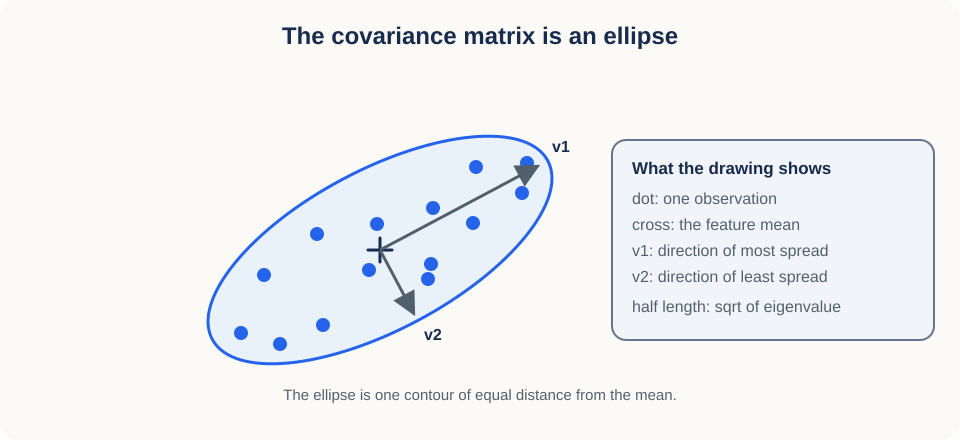
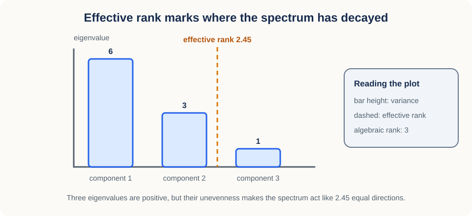
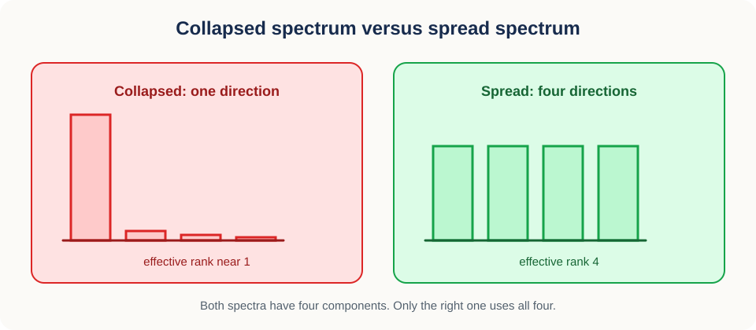

# 09. Covariance eigenspectra and effective rank

> **Curriculum role.** This lesson is an optional representation diagnostic. Effective
> rank is useful for studying feature geometry, but it is not a primary estimand or decision
> gate in the hierarchical-diversity experiment.


## Why this lesson matters

An encoder returns 512 numbers per input. That count tells you how much storage the
representation needs. It does not tell you how many genuinely different things the
representation can say. A layer can emit 512 columns and still behave like a one-dimensional
signal, because 511 of those columns are near-copies of the first.

To measure what the representation actually uses, stop counting columns and start measuring
spread. Covariance tells you how much the data vary along any direction you choose.
Eigenvectors of that covariance pick out the directions worth naming, eigenvalues say how
much variance each one holds, and effective rank compresses the whole list into a single
number that answers "how many directions is this representation really using?"

That is the arc of the lesson: from a cloud of points, to directional variance, to the
eigenspectrum, to one interpretable summary.

## Prerequisites

You should know vectors, matrix multiplication, means, and covariance from
[Lesson 06](06_representation_collapse.md). Every new piece of linear algebra here is built
up from one idea, the variance measured along a direction, so nothing is assumed beyond that.

## Learning goals

By the end of this lesson, you will be able to:

1. Interpret covariance as variance measured in arbitrary directions.
2. Explain eigenvectors and eigenvalues geometrically.
3. Connect covariance eigendecomposition with singular-value decomposition.
4. Project and reconstruct data with principal components.
5. Handle signs, tied eigenvalues, and nearly tied eigenspaces correctly.
6. Compute spectral entropy and effective rank.
7. Construct a deterministic basis when serialized PCA coordinates must be reproducible.

## 1. Start with a cloud of points

Everything below starts from one picture: a set of measurements plotted as points, with the
mean subtracted so the cloud is centred on the origin. Once the cloud is centred, the only
thing left to describe is its shape, and shape is exactly what covariance encodes.

Imagine measuring height and arm span for many people. Each person becomes one row in a
matrix $Z$ with shape $(N,D)$:

- $N$ is the number of people, so it counts rows.
- $D=2$ is the number of features, so it counts columns.
- Column 1 stores height.
- Column 2 stores arm span.

The cloud will be elongated, because tall people tend to have long arms. That elongation is
the structure we want to measure. Notice that the longest direction of the cloud runs
diagonally, not along either storage axis. The coordinate axes were chosen for convenience;
the data did not choose them.

Centre each feature by subtracting its own mean:

$$
X_{ij}=Z_{ij}-\mu_j,
\qquad
\mu_j=\frac{1}{N}\sum_{i=1}^{N}Z_{ij}.
$$

The scalar $\mu_j$ is the average of feature $j$ across all $N$ people. The centred matrix
$X$ has shape $(N,D)$, and each of its columns now sums to zero.

Centring matters because it separates location from shape. Without it, a feature with a
large mean would dominate everything that follows, and the analysis would report where the
cloud sits rather than how it is shaped.

The sample covariance of the centred data is

$$
C=\frac{1}{N-1}X^\mathsf{T}X.
$$

The transpose $X^\mathsf{T}$ has shape $(D,N)$, so the product $X^\mathsf{T}X$ and therefore
$C$ have shape $(D,D)$. Entry $C_{jj}$ on the diagonal is the variance of feature $j$. Entry
$C_{jk}$ off the diagonal is the covariance between features $j$ and $k$, which is positive
when the two features rise together.

A useful way to picture $C$ is as an ellipse. The ellipse is drawn one standard-deviation-like
step out from the mean in every direction, so it is wide where the data are spread and narrow
where they are not.



The two arrows in that figure are the answer this lesson is heading toward. The rest of the
machinery just explains how to compute them.

## 2. Variance can be measured along any direction

The ellipse suggests that some directions matter more than others. To compare directions, we
need a number attached to each one. That number is the variance of the data after they are
projected onto the direction.

Choose a direction vector $v$ with shape $(D,)$, and require it to have unit length so that
scaling $v$ cannot inflate the answer:

$$
\lVert v\rVert_2=1.
$$

The notation $\lVert v\rVert_2$ is the ordinary Euclidean length of $v$, the square root of
the sum of its squared entries.

Project every centred observation onto $v$:

$$
y=Xv.
$$

The vector $y$ has shape $(N,)$, one number per observation. Each value $y_i$ is the signed
position of observation $i$ measured along $v$, positive on one side of the mean and negative
on the other.

Because $X$ is centred, $y$ is centred too, so its sample variance is just the mean of its
squares:

$$
\frac{1}{N-1}y^\mathsf{T}y.
$$

Substituting $y=Xv$ turns that expression into something written purely in terms of
covariance:

$$
\frac{1}{N-1}y^\mathsf{T}y
{}={}
\frac{1}{N-1}v^\mathsf{T}X^\mathsf{T}Xv
{}={}
v^\mathsf{T}Cv.
$$

So the single scalar $v^\mathsf{T}Cv$ is the variance of the data along direction $v$. This
is the foundation of everything that follows: covariance is not one number, it is a machine
that returns a variance for whichever direction you feed it.


### Mental model

Place a ruler through the centre of the point cloud. Project every point onto the ruler and
read off the marks. Now rotate the ruler. The spread of the marks changes as you turn it.
PCA is the search for the ruler orientation that makes that spread as large as possible,
followed by the same search among directions perpendicular to the ones already chosen.

## 3. Covariance has nonnegative directional variance

Before searching for the best direction, it helps to know what kind of matrix we are
searching over. Covariance has two structural properties that make the search well behaved.

The first is that no direction can have negative variance. For any vector $v$,

$$
v^\mathsf{T}Cv
{}={}
\frac{1}{N-1}\lVert Xv\rVert_2^2
\ge 0.
$$

A squared length cannot be negative, so covariance is **positive semidefinite**.

The second is symmetry, which follows immediately from the definition:

$$
(X^\mathsf{T}X)^\mathsf{T}=X^\mathsf{T}X.
$$

These two facts pay off directly. Real symmetric matrices have real eigenvalues and a full
orthonormal set of eigenvectors, so the directions we are about to find are guaranteed to
exist and to be mutually perpendicular. Positive semidefiniteness further guarantees that
those eigenvalues are nonnegative, apart from tiny negative values that floating-point
roundoff can produce.

## 4. Eigenvectors are directions that keep their orientation

We now have a guarantee that special directions exist. Here is what makes them special: an
eigenvector is a direction that the covariance matrix stretches without turning.

An eigenvector $v_k$ of covariance satisfies

$$
Cv_k=\lambda_k v_k.
$$

The vector $v_k$ has shape $(D,)$, and the index $k$ runs from 1 to $D$. Multiplying by $C$
changes only the length of $v_k$, not the direction it points. The scalar $\lambda_k$ is the
amount of that stretch, and it is called the eigenvalue.

Connect this back to Section 2. Because $v_k$ has unit length, its directional variance is

$$
v_k^\mathsf{T}Cv_k
{}={}
v_k^\mathsf{T}(\lambda_k v_k)
{}={}
\lambda_k.
$$

An eigenvalue is therefore not an abstract quantity. It is the variance of the data along
its own eigenvector, measured in the squared units of the original features.

Sort the eigenvalues from largest to smallest:

$$
\lambda_1\ge\lambda_2\ge\cdots\ge\lambda_D\ge0.
$$

That ordered list is the **eigenspectrum**. The first eigenvector points along the direction
of maximum variance. The second points along the direction of maximum remaining variance
among directions perpendicular to the first, and so on down the list.

### Why the first direction maximizes variance

The claim that $v_1$ maximizes variance can be verified rather than assumed. Maximize
$v^\mathsf{T}Cv$ over unit vectors by introducing a scalar constraint multiplier $\alpha$
that enforces $v^\mathsf{T}v=1$:

$$
J(v,\alpha)
{}={}
v^\mathsf{T}Cv
-\alpha(v^\mathsf{T}v-1).
$$

Differentiating with respect to $v$ and setting the result to zero gives

$$
Cv=\alpha v.
$$

Every stationary direction of the problem is therefore an eigenvector, and each one has
directional variance equal to its own eigenvalue. Picking the largest eigenvalue picks the
largest variance. The derivation is worth seeing once, but the ruler picture from Section 2
is the one to carry forward.

## 5. Eigendecomposition changes basis

Individually, the eigenvectors are directions. Collected together, they form a new coordinate
system, and covariance becomes trivially simple when written in it.

Collect the eigenvectors as columns of a matrix $V$:

$$
V=
\begin{bmatrix}
v_1 & v_2 & \cdots & v_D
\end{bmatrix}.
$$

The matrix $V$ has shape $(D,D)$ and satisfies $V^\mathsf{T}V=I$, which is the algebraic
statement that its columns are perpendicular and of unit length. Put the eigenvalues on the
diagonal of $\Lambda$:

$$
\Lambda=
\mathrm{diag}(\lambda_1,\lambda_2,\ldots,\lambda_D).
$$

Then covariance factors exactly:

$$
C=V\Lambda V^\mathsf{T}.
$$

Read that product right to left as three steps. The matrix $V^\mathsf{T}$ rewrites a vector
in eigenvector coordinates. The diagonal $\Lambda$ scales each of those coordinates by its
own directional variance. The final $V$ converts back to the original feature coordinates.
In the middle step the matrix is diagonal, which is why the eigenbasis is the natural place
to think about covariance.

## 6. Singular-value decomposition starts from the data matrix

Section 5 factored the covariance matrix. There is a second route to the same directions
that never forms covariance at all, and it starts from the data.

The compact singular-value decomposition of the centred data is

$$
X=U\Sigma V^\mathsf{T}.
$$

Let $r$ be the rank of $X$, that is, the number of genuinely independent directions its rows
span. Then:

- $U$ has shape $(N,r)$ with orthonormal columns.
- $\Sigma$ has shape $(r,r)$ and nonnegative diagonal values $\sigma_k$ called singular values.
- $V$ has shape $(D,r)$ with orthonormal columns.

Numerical libraries usually expose an economy-size or reduced SVD instead of the compact one.
Let $q=\min(N,D)$. That API returns $U$ with shape $(N,q)$, a vector of $q$ singular values,
and $V^\mathsf{T}$ with shape $(q,D)$. If $X$ is rank deficient, this reduced output still
carries zero or nearly zero singular values. Dropping those directions recovers the compact
form of rank $r$ described above.

Now substitute the SVD into the covariance definition:

$$
C
{}={}
\frac{1}{N-1}
V\Sigma U^\mathsf{T}U\Sigma V^\mathsf{T}.
$$

Because $U$ has orthonormal columns, $U^\mathsf{T}U=I$, and the middle collapses:

$$
C
{}={}
V\frac{\Sigma^2}{N-1}V^\mathsf{T}.
$$

Comparing this with $C=V\Lambda V^\mathsf{T}$ from Section 5 identifies the two spectra term
by term:

$$
\lambda_k=\frac{\sigma_k^2}{N-1}.
$$

The right singular vectors of $X$ are exactly the covariance eigenvectors, and squared
singular values divided by $N-1$ are exactly the covariance eigenvalues. The two routes give
the same geometry.


### When SVD is preferable

The two routes differ in cost, not in answer. If $D$ is much larger than $N$, forming a full
$D\times D$ covariance wastes memory on a matrix that cannot have more than $N-1$ nonzero
eigenvalues anyway. Reduced SVD works directly with the $N\times D$ data matrix and returns
at most $\min(N,D)$ singular directions.

## 7. PCA projection gives new coordinates

Having found the directions, the practical payoff is that you can rewrite the data in them
and then throw the least useful ones away.

Keep the first $K$ eigenvectors in $V_K$, which has shape $(D,K)$. The principal component
scores are

$$
S=XV_K.
$$

The score matrix $S$ has shape $(N,K)$. Row $i$ holds the $K$ principal coordinates of
observation $i$, each one a projection of the kind defined in Section 2.

These new coordinates are pleasant to work with because they are uncorrelated:

$$
\frac{1}{N-1}S^\mathsf{T}S
{}={}
\mathrm{diag}(\lambda_1,\ldots,\lambda_K).
$$

The off-diagonal entries vanish, so in this sample the principal coordinates carry no linear
redundancy, and their variances are the retained eigenvalues.

Going back to the original feature space costs one more multiplication:

$$
\widehat X=SV_K^\mathsf{T}.
$$

The reconstruction $\widehat X$ has shape $(N,D)$, the same as the centred data, but it keeps
only the variation that lived in the chosen $K$-dimensional subspace. Among all linear
reconstructions of rank $K$, this one has the smallest total squared error, and the error it
does make is exactly the variance in the directions that were dropped:

$$
\sum_{k=K+1}^{D}\lambda_k.
$$

## 8. A worked two-dimensional example

Small numbers make the previous six sections concrete. Consider the covariance

$$
C=
\begin{bmatrix}
3 & 2 \\
2 & 3
\end{bmatrix}.
$$

Both features have variance 3, and they covary positively with value 2. Try the unit vector

$$
v_1=\frac{1}{\sqrt{2}}
\begin{bmatrix}
1\\
1
\end{bmatrix}
$$

Multiplying gives $Cv_1=5v_1$, so $\lambda_1=5$. This direction moves both features up
together, which is exactly the pattern the positive covariance encodes. The perpendicular
unit vector

$$
v_2=\frac{1}{\sqrt{2}}
\begin{bmatrix}
1\\
-1
\end{bmatrix}
$$

gives $Cv_2=v_2$, so $\lambda_2=1$. This direction raises one feature while lowering the
other, which the data rarely do.

Total variance is $5+1=6$, which is also the sum of the diagonal entries $3+3$. The first
component alone explains $5/6$, or about 83 percent, of it. In the ellipse picture, this is
a shape roughly $\sqrt{5}$ long and $1$ wide, tilted at 45 degrees.

### Conceptual checkpoint

If every point lies exactly on one line through the mean, how many positive covariance
eigenvalues are there?

There is one. Every direction perpendicular to that line has zero projected variance, so its
eigenvalue is zero.

## 9. Feature units change the covariance spectrum

The example above worked because both features shared a scale. When they do not, the
spectrum can be dominated by a unit choice rather than by anything scientific.

Covariance preserves the scale of each feature. Change height from meters to millimeters and
its numeric variance grows by a factor of one million, which is enough to make height the
leading direction no matter what the data mean. The eigenvector then points at the
measurement convention, not at the structure.

Standardizing each feature before PCA produces correlation PCA. It asks how standardized
coordinates vary together instead of how raw units contribute to total variance, so a unit
change no longer moves the answer.

Neither choice is universally correct. Raw covariance is appropriate when feature scale is
meaningful and comparable across features. Correlation PCA is useful when the units are
arbitrary and should not decide the outcome. For learned representations the scale can itself
be part of what the model does, so the safe practice is to record whether features were
centred, standardized, normalized, or pooled, and to report that alongside any spectrum.

### Centering versus row normalization

One more preprocessing distinction is easy to blur. Centring subtracts a feature mean across
observations, so it acts down a column. Row normalization divides each observation vector by
its own norm, so it acts across a row. They answer different questions and they do not
commute.

Cosine-oriented analyses often row-normalize representations, while PCA normally begins with
feature centring. If a pipeline does both, state the order, because the resulting geometry
differs.

## 10. Explained variance is a distribution

The eigenspectrum is a list of variances in the original squared units. Turning it into a
list of proportions makes different models and different feature scales comparable.

Normalize the eigenvalues by their total:

$$
p_k=\frac{\lambda_k}{\sum_j\lambda_j}.
$$

The nonnegative values $p_k$ sum to one, so they form a probability distribution over the
principal directions. The value $p_k$ is the fraction of total variance assigned to direction
$k$. This normalization needs a positive total. If every eigenvalue is zero, the fractions
are undefined rather than zero.

The cumulative fraction through component $K$ is

$$
\sum_{k=1}^{K}p_k.
$$

A threshold such as 95 percent is a reasonable rule for compression, since it bounds the
reconstruction error you accept. It is not a definition of a good representation. Directions
carrying little variance can still carry the class information a downstream probe needs.

## 11. Tied eigenspaces are not unique axes

The proportions in Section 10 are always well defined, but the axes they are attached to
sometimes are not. This happens when two eigenvalues are equal.

Suppose $\lambda_1=\lambda_2$. Then any orthonormal rotation of $v_1$ and $v_2$ within their
shared plane produces another perfectly valid eigenbasis, and reconstructs exactly the same
covariance. The data identify a two-dimensional subspace; they do not identify particular
axes inside it. Nearly equal eigenvalues behave almost the same way: a small perturbation of
the data can rotate the individual eigenvectors a long way while leaving the plane fixed.

Signs are ambiguous even without ties. If $v$ is an eigenvector, so is $-v$, and solvers
choose between them arbitrarily.

The right response is to compare subspaces rather than axes. Given two $K$-dimensional
subspaces with orthonormal bases $Q_1$ and $Q_2$, inspect the singular values of

$$
Q_1^\mathsf{T}Q_2.
$$

These values are the cosines of the principal angles between the two subspaces. Values near
one mean the subspaces nearly coincide, even if their columns are rotated or sign-flipped
relative to each other.

### Misconception

**A changed eigenvector means representation geometry changed.**

Not necessarily. The sign may have flipped, or the basis may have rotated inside a tied
eigenspace, while the geometry stayed identical. Compare eigenvalues and subspaces before
drawing any conclusion from individual coordinates.

## 12. Canonicalizing a tied PCA subspace

Subspace ambiguity is harmless when an analysis uses only the projector or the reconstruction,
because both are invariant to rotation inside the tie. It becomes an engineering problem the
moment downstream code serializes PCA coordinates, compares fitted parameters byte for byte,
or expects reruns to choose identical axes. Two mathematically correct SVD implementations
may orient a tied subspace differently, which changes the projected coordinates even though
the represented geometry is identical.

A deterministic pipeline therefore needs an extra convention. Be clear about what that
convention is and is not. It does not reveal a scientifically meaningful axis hidden inside
a tie. It selects one reproducible coordinate system from many equivalent bases.
Canonicalization is a software contract, not evidence that a tied component has a unique
interpretation.

Start with the easy case. For a single component that is not tied, only the sign is
ambiguous, so fix the sign by a rule that cannot itself be ambiguous. Find the coordinate
with the largest absolute magnitude, break magnitude ties by the smallest coordinate index,
and flip the vector when that pivot coordinate is negative:

```python
def canonical_sign(vector):
    magnitudes = np.abs(vector)
    pivot = int(np.flatnonzero(magnitudes == magnitudes.max())[0])
    return -vector if vector[pivot] < 0 else vector
```

The result is invariant to whichever sign the decomposition happened to return. The explicit
pivot rule matters, because an `argmax`-style tie would otherwise leave a second hidden
choice inside a routine meant to remove choices.

For a group of tied components, sign correction is not enough, since the solver may return
any rotation of the group. The fix is to build the basis from something rotation invariant.
Let the rows of $Q$ be an orthonormal basis for the tied subspace. Its projector is

$$
P=Q^\mathsf{T}Q.
$$

Rotating the rows of $Q$ leaves $P$ unchanged, so the projector holds the stable part of the
information. Project the ordinary coordinate axes through $P$, scan them in increasing axis
order, and keep each projected axis that adds a linearly independent direction. Orthogonalize
the retained candidates with modified Gram-Schmidt, normalize them, and apply the canonical
sign rule from above.

Modified Gram-Schmidt subtracts the projections one vector at a time:

$$
v\leftarrow v-(q_j^\mathsf{T}v)q_j.
$$

Here $q_j$ is a basis vector already accepted, and the update removes whatever part of $v$
pointed along it. Repeating the pass a second time shrinks the residual components left by
finite-precision arithmetic. Stop once the number of collected vectors equals the multiplicity
of the tied eigenvalue. Because the axis order, the dependence threshold, and the sign
convention are all fixed in advance, the resulting basis is reproducible for the same
projector.

The numerical threshold deserves a stated basis rather than a magic constant. NumPy exposes
float64 machine epsilon as `np.finfo(np.float64).eps`. A multiple such as 64 times epsilon
separates roundoff residue from a usable unit-scale candidate in a small orthogonal projector.
A production implementation should then validate what it built:

```python
identity = canonical_basis @ canonical_basis.T
assert np.allclose(identity, np.eye(len(canonical_basis)), rtol=0.0, atol=1e-10)
```

Two smaller numerical habits belong to the same contract. Symmetrize the covariance before
handing it to a symmetric eigensolver:

$$
C\leftarrow\frac{C+C^\mathsf{T}}{2}.
$$

Mathematically $X^\mathsf{T}X$ is already symmetric, but floating-point evaluation can leave
tiny asymmetries, and the explicit step states which matrix the solver is meant to interpret.
Similarly, tiny negative eigenvalues consistent with roundoff may be clipped to zero, but only
after their scale has been audited rather than assumed.

Full and thin SVD also serve different purposes here. Thin SVD is efficient when only the
data-supported leading subspace matters. A normalizer that promises a complete coordinate
basis, including a null space when $D>N$, needs `full_matrices=True` or another explicit
null-space construction. Which one you use is part of the fitted-model schema, not an
implementation detail.

Finally, canonicalization should be tested like any other contract. Permuting input rows must
not change the fitted projector. Replacing a tied solver basis by an arbitrary orthogonal
rotation must produce the same canonical basis. Applying the procedure twice must be
idempotent. Compare projectors when only geometry matters, and compare canonical axes only
when the deterministic-coordinate contract is genuinely required.

## 13. Spectral entropy

Return to the variance fractions of Section 10. We want one number saying whether that
distribution is concentrated on a few directions or spread across many, and entropy is the
standard measure of exactly that.

Shannon entropy of the variance fractions is

$$
H
{}={}
-\sum_{k:p_k>0}p_k\log p_k.
$$

The sum runs only over directions with positive mass, so $\log 0$ is never evaluated. Using
natural logarithms puts $H$ in natural units, which is what the next section assumes.

Two extremes fix the scale. If one direction holds all the variance then $p_1=1$ and $H=0$.
If the variance is spread equally across $r$ directions then each $p_k=1/r$ and

$$
H=\log r.
$$

Entropy grows as variance is shared more evenly, and it is largest when no direction is
favoured.

## 14. Effective rank

Entropy is measured in log units, which are awkward to compare with a dimension count.
Exponentiating fixes that and gives the quantity this lesson is named for.

Entropy effective rank is

$$
r_{\mathrm{eff}}=\exp(H).
$$

Like $H$ itself, this requires a positive total variance. For an all-zero spectrum the
fractions $p_k$, the entropy $H$, and $r_{\mathrm{eff}}$ are all undefined. Reporting zero as
though it followed from the entropy formula would be incorrect; software should raise an error
or return an explicit missing-value sentinel for that degenerate case.

Exponentiation returns entropy to a dimension-like scale, so the values read naturally:

- one occupied direction gives $r_{\mathrm{eff}}=1$,
- $r$ equally occupied directions give $r_{\mathrm{eff}}=r$,
- an uneven spectrum gives a continuous value between integers.

Work through the eigenvalues $[6,3,1]$. Their total is 10, so the variance fractions are
$[0.6,0.3,0.1]$. The entropy is about $0.898$, so the effective rank is about

$$
\exp(0.898)\approx2.45.
$$

The algebraic rank here is 3, because all three eigenvalues are strictly positive. The
effective rank of 2.45 says something different and more useful: this spectrum is as
concentrated as roughly two and a half equally occupied directions would be.



Effective rank is most informative at its extremes, where it separates a representation that
has collapsed onto one axis from one that uses its budget.



One caution about naming. Entropy effective rank is not the same as the participation ratio,

$$
r_{\mathrm{PR}}
{}={}
\frac{1}{\sum_k p_k^2}.
$$

Both summarize concentration, but they weight small tail values differently, so they give
different numbers for the same spectrum. Always state which definition a reported value uses.

### Effective rank depends on sampling

A reported effective rank describes a sample, not a population, and the sample can mislead in
two specific ways.

Sample eigenvalues are noisy estimates of population eigenvalues. With fewer observations the
spectrum tends to look more uneven than it really is, purely by chance. There is also a hard
structural limit: when $N\le D$, the sample covariance has at most $N-1$ positive directions,
so effective rank simply cannot report dimensions beyond that sample limit.

Because of this, compare effective rank across models only when sample count, sample
identities, preprocessing, pooling, and feature dimension all match. A larger value is not
automatically better either, since noise inflates tail eigenvalues and therefore effective
rank without adding usable information.

### Use reference spectra

The way to make one effective rank interpretable is to put it beside another one measured the
same way. Useful contrasts include:

- the same encoder before and after training,
- real labels versus shuffled labels for a downstream probe,
- learned features versus isotropic Gaussian features of the same shape,
- token-level versus pooled features,
- separate participant or context subsets.

Each of these turns an isolated number into a difference you can reason about.

## 15. Whitening follows from the eigendecomposition

PCA projection rotates the data into principal coordinates but leaves the scales alone.
Whitening takes one more step and equalizes them.

Keep $K$ eigenvectors in $V_K$ with shape $(D,K)$ and their positive eigenvalues in the
diagonal matrix $\Lambda_K$ with shape $(K,K)$. Define whitened scores:

$$
W=XV_K\Lambda_K^{-1/2}.
$$

The matrix $W$ has shape $(N,K)$, and $\Lambda_K^{-1/2}$ is diagonal with entries
$1/\sqrt{\lambda_k}$, so each principal coordinate is divided by its own standard deviation.
Up to floating-point error the sample covariance of the result is the identity:

$$
\frac{1}{N-1}W^\mathsf{T}W=I.
$$

Whitening therefore removes both linear scale and linear correlation. The price is
instability: a tiny eigenvalue makes $1/\sqrt{\lambda_k}$ enormous, which amplifies whatever
noise lived in that direction. Practical whitening truncates the smallest directions or adds
a positive regularizer before inverting.

Keep the two operations distinct. Projection rotates into principal coordinates. Whitening
rotates and then rescales every retained component to unit variance.

## 16. Minimal implementation

The following function packages Sections 1, 4, 10, 13, and 14 into one call, including the
degenerate case discussed above.

~~~python
import numpy as np

def spectrum_and_effective_rank(features, eps=1e-12):
    if features.ndim != 2 or len(features) < 2:
        raise ValueError("expected an [N, D] matrix with N >= 2")
    x = features - features.mean(axis=0, keepdims=True)
    covariance = x.T @ x / (len(x) - 1)
    values, vectors = np.linalg.eigh(covariance)

    order = np.argsort(values)[::-1]
    values = np.clip(values[order], 0.0, None)
    vectors = vectors[:, order]

    total = values.sum()
    if total <= eps:
        return values, vectors, float("nan")

    probabilities = values / total
    positive = probabilities[probabilities > 0]
    entropy = -(positive * np.log(positive)).sum()
    return values, vectors, float(np.exp(entropy))
~~~

Several choices in that code are deliberate. Use <code>np.linalg.eigh</code> rather than the
general <code>eig</code>, because covariance is symmetric and <code>eigh</code> exploits that
to return real values. NumPy returns eigenvalues in ascending order, so the code reverses
them to match the convention of Section 4. It returns <code>NaN</code> as an explicit sentinel
when total variance is numerically zero, following Section 14. For a positive total, it
normalizes the complete clipped spectrum before dropping exact zeros from the logarithm, which
preserves the requirement that the probabilities sum to one.

## 17. Efficiency and numerical stability

The same computation can be accurate or misleading depending on precision and problem shape.
The practical rules are:

- Centre in float32 or float64, never in low-precision integer or float16 arithmetic.
- Use float64 when small eigenvalues carry scientific meaning.
- Use reduced <code>np.linalg.svd</code> with <code>full_matrices=False</code> when forming
  covariance would be unnecessarily large.
- Use <code>torch.linalg.eigh</code> or <code>torch.linalg.svd</code> in PyTorch.
- Use low-rank methods when only a few leading components are needed.
- Clamp tiny negative roundoff values only after checking their scale.
- Canonicalize a tied subspace only when deterministic coordinates are required, and use its
  projector when the scientific object is the subspace itself.
- Record pooling, standardization, and sample composition whenever spectra are compared.

One shape constraint follows from centring alone. Subtracting the mean removes one degree of
freedom in observation space, so the sample covariance rank is at most $\min(D,N-1)$.

## 18. Common failure modes

Most mistakes in this area come from reading a spectrum as if it were unconditional. It never
is.

1. **No centering:** the leading singular direction can simply reflect the mean.
2. **Mixed feature units:** large-scale coordinates dominate the spectrum.
3. **Reading eigenvector signs:** signs carry no geometric meaning.
4. **Reading axes inside a tie:** only the tied subspace is identified.
5. **Counting numerical noise:** algebraic rank can be full because of tiny eigenvalues.
6. **Comparing different datasets:** effective rank shifts with sampling and preprocessing.
7. **Small $N$, large $D$:** most covariance directions are forced to be zero.
8. **Interpreting canonical axes:** deterministic orientation is a convention, not a newly
   identified scientific direction.

## 19. Exercises

1. Centred data have singular values $6$ and $3$ with $N=10$. Find the covariance eigenvalues.
2. Find the effective rank for eigenvalues $[2,2,2,2]$.
3. Why can two PCA runs return different first axes when the first two eigenvalues are equal?
4. Show that total variance equals the sum of the covariance eigenvalues.
5. Explain why applying a sign rule independently cannot canonicalize a two-dimensional tied
   eigenspace.

### Brief solutions

1. The eigenvalues are $6^2/9=4$ and $3^2/9=1$.
2. The spectrum is uniform across four directions, so $H=\log4$ and $r_{\mathrm{eff}}=4$.
3. Any rotation inside the tied two-dimensional eigenspace is a valid answer.
4. The covariance trace is the sum of the diagonal feature variances. Eigendecomposition
   preserves the trace, so it also equals $\sum_k\lambda_k$.
5. A solver may rotate both axes continuously inside the tied subspace. Sign flips correct
   only two orientations per axis and cannot undo an arbitrary rotation, so a projector-based
   basis convention is needed.

## Recap

Covariance measures variance in every direction, and its eigenvectors are the directions that
it stretches without turning. Eigenvalues are the variances along those directions, and SVD
reaches the same geometry starting from the data matrix instead of the covariance. PCA
projects and reconstructs using the leading directions, and its error is the variance it
discards. Effective rank summarizes how evenly variance occupies those directions, while tied
eigenspaces remind us that the subspace, not the axis, is what the data identify. When
software genuinely requires deterministic coordinates, projector-based canonicalization
selects one reproducible basis without granting tied axes any scientific uniqueness.

## Continue

- Previous: [08. Group-aware sampling and balanced evaluation](08_group_aware_sampling.md)

- Next: [10. Regularized linear estimation and calibration](10_regularized_linear_estimation.md).
  That lesson takes the feature geometry developed here and uses it to build stable linear
  predictors, then asks what their probability scores can honestly be said to mean.

## Continue in the notebook

[Open the executable lesson 09 notebook](../implementations/09_eigenspectra_and_effective_rank.ipynb)
to compare SVD with eigendecomposition, project data into principal coordinates, and compute
effective rank on a spectrum you generate yourself.
