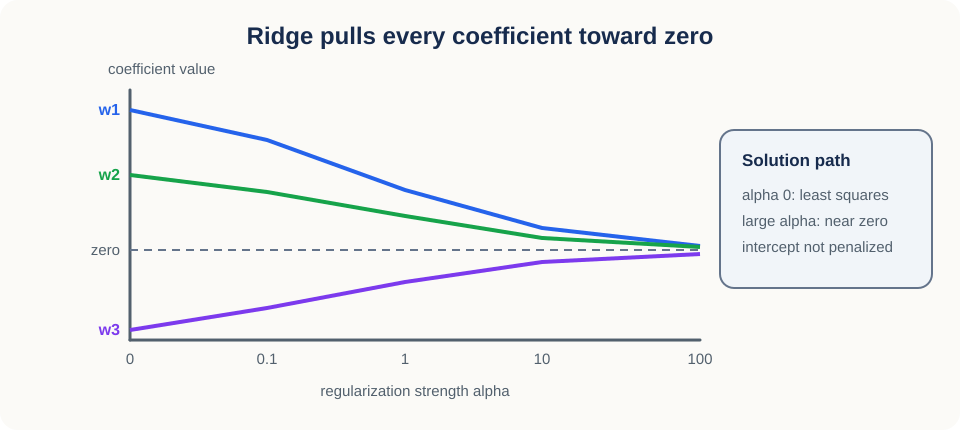
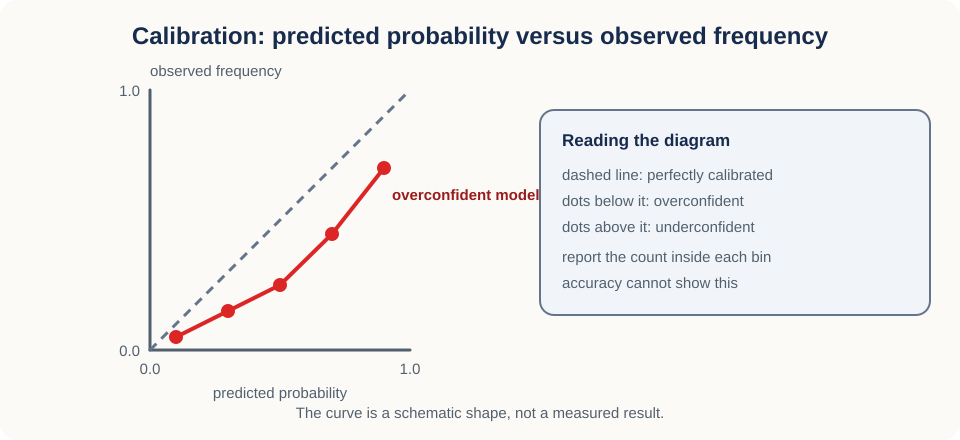
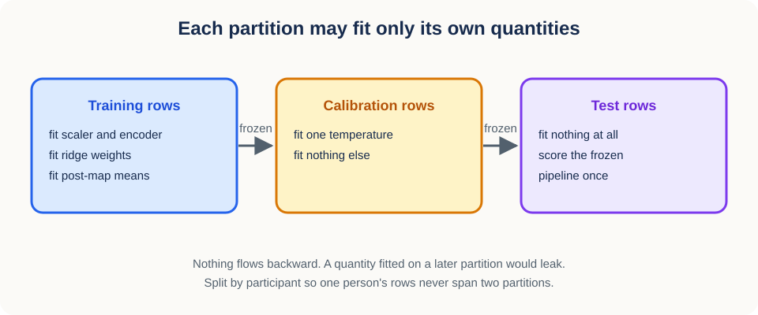

# 10. Regularized linear estimation and calibration


## Why this lesson matters

You have learned representation vectors for 2,000 observations and two questions to answer.
Can a simple linear model recover the target from those features? And can the probability
numbers it prints be used responsibly?

Both are harder than they look. A linear probe is only as trustworthy as the design matrix
behind it, and that matrix is shaped by scaling, category encoding, collinearity,
regularization, and class weighting. Probabilities are worse: temperature scaling reliably
improves held-out negative log likelihood, and that improvement on its own proves nothing
about calibration. This lesson walks the pipeline once and names what each step does and does
not establish.

## Prerequisites

You should know algebra, vectors, matrix multiplication, means, and basic probability.
[Lesson 09](09_eigenspectra_and_effective_rank.md) supplies the eigenvalues and feature
geometry that Sections 5 and 6 lean on.

## Learning goals

By the end of this lesson, you will be able to:

1. Standardize numeric features using training data only.
2. One-hot encode categorical variables and handle unseen levels.
3. Derive ridge regression with an unpenalized intercept.
4. Explain how regularization improves conditioning.
5. Build binary logistic and multiclass softmax models.
6. Use class weights without confusing them with population probabilities.
7. Fit a temperature by held-out negative log likelihood and state what that does not prove.
8. Read `np.einsum` subscripts and implement a multi-output ridge map.
9. Compute class likelihoods in log space and optimize a positive temperature continuously.
10. Build the three leakage-safe two-output factor heads used by GFC-v2.

## 1. Begin with a mixed-feature scenario

Start with the table, because everything downstream inherits its structure. Imagine
predicting a medical outcome from four inputs:

- age in years,
- blood pressure in millimeters of mercury,
- a learned 128-dimensional representation,
- collection site as a categorical variable.

These do not live on a common footing. Age and blood pressure are numeric but measured in
unrelated units. Site is a name, and names have no meaningful distances between them.
Representation coordinates may be strongly correlated with one another.

A model matrix needs one number in every cell, so each input has to be converted. That
conversion decides what a fitted coefficient means, which makes preprocessing part of the
statistical model rather than a formatting step.

## 2. Standardization makes numeric scales comparable

The first conversion puts every numeric feature on the same scale, so that a coefficient of
the same size means the same amount of evidence.

Let $X$ be a numeric training matrix with shape $(N,D)$, where $N$ counts training
observations and $D$ counts numeric features. For feature $j$, compute the training mean:

$$
\mu_j=\frac{1}{N}\sum_{i=1}^{N}X_{ij}.
$$

Compute the training standard deviation:

$$
\sigma_j
{}={}
\sqrt{
\frac{1}{N}
\sum_{i=1}^{N}
(X_{ij}-\mu_j)^2
}.
$$

Transform any observation with those two numbers:

$$
\widetilde X_{ij}
{}={}
\frac{X_{ij}-\mu_j}{\sigma_j}.
$$

The transformed value is measured in training standard deviations from the training mean.
Reuse the same $\mu_j$ and $\sigma_j$ for validation, calibration, and test rows. Refitting
them per split would silently change the units between partitions.

### Why scaling matters for regularization

Standardization stops being cosmetic once a penalty is involved. Suppose one feature is in
meters and another in millimeters. The millimeter coefficient must be about one thousand times
smaller to express the same physical effect. An L2 penalty charges by coefficient size, so
without standardization it charges the two features very differently for identical science.

### Failure at zero variance

If $\sigma_j=0$, feature $j$ never varies in training, so it supplies nothing to fit and
dividing by it is undefined. Remove the feature or use a transformer with an explicit
safe-scale policy.

~~~python
from sklearn.preprocessing import StandardScaler

scaler = StandardScaler().fit(x_train)
x_train_scaled = scaler.transform(x_train)
x_test_scaled = scaler.transform(x_test)
~~~

Note that `fit` sees only `x_train`. Fitting the scaler on all data would leak test means and
variances backward into training.

## 3. One-hot encoding respects categories

Numeric features needed rescaling. Categorical features need something stronger, because any
numeric code at all invents structure that is not in the data.

Suppose site has levels north, central, and south. Encoding them as 0, 1, and 2 asserts that
central sits exactly halfway between north and south, and that south is twice as far from
north as central is. Nothing in the data says that.

One-hot encoding avoids the problem by giving each level its own indicator column:

$$
\text{north}\mapsto[1,0,0],
\quad
\text{central}\mapsto[0,1,0],
\quad
\text{south}\mapsto[0,0,1].
$$

Each column now answers a single yes-or-no question, and no ordering is implied.

This introduces one algebraic snag. With an intercept present, the three indicator columns
sum to the all-ones column, an exact dependence known as the dummy-variable trap. The two
standard responses are to drop one reference level, or to keep all levels and rely on
regularization or a solver convention. Dropping changes interpretation: if the north column
goes, the north effect is absorbed into the intercept and the remaining site coefficients read
as differences from north.

### Unseen categories

Deployment eventually shows the model a site that was never in training. Scikit-learn's
<code>handle_unknown="ignore"</code> maps it to an all-zero indicator block. If a reference
level was also dropped, that new site becomes indistinguishable from the reference inside the
block. Acceptable as robustness, but it is not a learned new-site effect and must not be
reported as one.

Use a <code>ColumnTransformer</code> or a pipeline so scaling and encoding are fitted inside
each training fold rather than once over everything.

## 4. Linear regression begins with a weighted sum

With a numeric design matrix in hand we can fit, and the simplest predictor is a weighted sum
of features plus an offset. For one observation $x$ with shape $(D,)$,

$$
\widehat y=x^\mathsf{T}w+b.
$$

The vector $w$ has shape $(D,)$ and holds one coefficient per feature; the scalar $b$ is the
intercept. Each coefficient converts one unit of its feature into prediction units.

For all observations at once, let $X$ have shape $(N,D)$ and $y$ have shape $(N,)$. Setting
the intercept aside for a moment, ordinary least squares minimizes

$$
L(w)=\lVert y-Xw\rVert_2^2.
$$

The residual vector $y-Xw$ has shape $(N,)$, one error per observation, and squaring its
Euclidean norm sums those squared errors. Expanding the objective makes the minimization
mechanical:

$$
L(w)
{}={}
y^\mathsf{T}y
-2w^\mathsf{T}X^\mathsf{T}y
+w^\mathsf{T}X^\mathsf{T}Xw.
$$

Differentiate with respect to $w$:

$$
\nabla_w L
{}={}
-2X^\mathsf{T}y
+2X^\mathsf{T}Xw.
$$

At a minimum the gradient is zero, which gives the normal equations:

$$
X^\mathsf{T}Xw=X^\mathsf{T}y.
$$

If $X^\mathsf{T}X$ is invertible, this system has exactly one solution. The rest of this
lesson is largely about what happens when it is close to not being invertible.

## 5. Collinearity makes estimation unstable

Learned representations routinely contain near-duplicate columns, and near duplicates break
the uniqueness that the normal equations promised.

Suppose two representation features are almost copies:

$$
x_2\approx x_1.
$$

Then many coefficient pairs give nearly the same prediction, because raising $w_1$ and
lowering $w_2$ leaves $x_1w_1+x_2w_2$ almost unchanged. The objective has a nearly flat
direction, and along a flat direction tiny data changes move the fitted coefficients a long
way. Flatness has a standard measure: for a symmetric positive-definite matrix $A$, the
spectral condition number is

$$
\kappa(A)
{}={}
\frac{\lambda_{\max}(A)}
{\lambda_{\min}(A)}.
$$

The numerator is the largest eigenvalue of $A$ and the denominator is the smallest, which is
strictly positive in the positive-definite case. A large ratio says some directions are far
less constrained by the data than others. If the matrix is only positive semidefinite and
therefore singular, its condition number is infinite; ignoring the zero eigenvalues would
instead report a pseudo-condition number, which is a different quantity.

## 6. Ridge regression adds a preference for smaller weights

Since the data cannot pin down the flat direction, the fix is to state a preference along it.
Ridge prefers smaller coefficients.

Ridge minimizes

$$
L_{\mathrm{ridge}}(w)
{}={}
\lVert y-Xw\rVert_2^2
+\alpha\lVert w\rVert_2^2.
$$

The positive scalar $\alpha$ is the regularization strength, and the penalty term is the sum
of squared coefficients. Differentiating,

$$
\nabla_w L_{\mathrm{ridge}}
{}={}
-2X^\mathsf{T}y
+2X^\mathsf{T}Xw
+2\alpha w,
$$

and setting the gradient to zero gives the ridge normal equations:

$$
(X^\mathsf{T}X+\alpha I)w
{}={}
X^\mathsf{T}y.
$$

The identity matrix $I$ has shape $(D,D)$, so the penalty adds $\alpha$ to every eigenvalue
of $X^\mathsf{T}X$. That uniform shift matters most where the eigenvalue was smallest, which
is precisely the flat direction. In this no-intercept derivation the regularized condition
number is

$$
\frac{\lambda_{\max}+\alpha}{\lambda_{\min}+\alpha},
$$

which stays finite even when $\lambda_{\min}=0$.


### Numerical conditioning example

Put numbers on it. Suppose the eigenvalues of $X^\mathsf{T}X$ are 100 and 0.01, so

$$
\frac{100}{0.01}=10{,}000.
$$

With $\alpha=1$ the eigenvalues become 101 and 1.01, and the condition number drops to

$$
\frac{101}{1.01}=100.
$$

A hundredfold improvement in stability, bought with shrinkage bias: every coefficient is
pulled toward zero, so the fit is deliberately biased in exchange for far less variance.



Tracing the coefficients as $\alpha$ sweeps upward gives the solution path. It starts at the
least-squares solution, unstable directions and all, and every penalized coefficient then
moves toward zero, so the collinear pair from Section 5 stops trading against each other.
Somewhere in between is the $\alpha$ that buys the most variance reduction for the least bias.
Choose it by cross-validation on training data, never on the test set.

## 7. Treat the intercept separately

The path figure showed penalized coefficients only. The intercept is deliberately excluded,
and this section says how.

Append a column of ones to the design matrix:

$$
X_a=
\begin{bmatrix}
\mathbf{1} & X
\end{bmatrix}.
$$

The augmented matrix $X_a$ has shape $(N,D+1)$. Let

$$
\theta=
\begin{bmatrix}
b\\
w
\end{bmatrix}
$$

hold the intercept first, followed by the $D$ feature coefficients. Build a penalty matrix
whose first diagonal entry is zero:

$$
P=\mathrm{diag}(0,1,\ldots,1),
$$

and solve

$$
(X_a^\mathsf{T}X_a+\alpha P)\theta
{}={}
X_a^\mathsf{T}y.
$$

That leading zero is the whole point: it leaves $b$ unpenalized. Penalizing the intercept
would shrink the overall level of the outcome toward zero, which has nothing to do with model
complexity and everything to do with where the target happens to be centred.

~~~python
def ridge_with_intercept(x, y, alpha):
    xa = np.column_stack([np.ones(len(x)), x])
    penalty = np.eye(xa.shape[1])
    penalty[0, 0] = 0.0
    system = xa.T @ xa + alpha * penalty
    return np.linalg.solve(system, xa.T @ y)
~~~

Use <code>np.linalg.solve</code> rather than forming a matrix inverse. Direct solvers are
faster and usually more numerically stable.

### Multi-output ridge and `np.einsum`

A factor head predicts several outputs from the same features, and the ridge system extends
to that case with no new mathematics. Replace the target vector $y$ with a target matrix $Y$
of shape `(N,K)`, where $K$ is the number of outputs, and the coefficient vector $w$ with a
coefficient matrix $W$ of shape `(D,K)`. After centring inputs and targets, solve

$$
(X^\mathsf{T}X+\alpha I)W=X^\mathsf{T}Y.
$$

The left side is a single `(D,D)` system shared by all $K$ outputs. The right side has shape
`(D,K)`, and `np.linalg.solve` returns all $K$ coefficient columns in one call. The intercept
comes back from the means instead of being penalized:

$$
b=\bar y-\bar xW.
$$

NumPy's `einsum` writes these contractions with named index letters:

```python
gram = np.einsum("ni,nj->ij", centered_x, centered_x, dtype=np.float64)
rhs = np.einsum("ni,nk->ik", centered_x, centered_y, dtype=np.float64)
weights = np.linalg.solve(gram + alpha * np.eye(gram.shape[0]), rhs)
predictions = np.einsum("nd,dk->nk", standardized_x, weights, optimize=False) + intercept
```

Each letter names an axis. In `"nd,dk->nk"` both operands carry `d`, so the feature axis is
multiplied and summed away, leaving observation axis `n` and output axis `k`. In
`"ni,nj->ij"` the observation axis `n` is contracted while two feature axes survive, which is
what makes a Gram matrix. The letters are local labels, not NumPy keywords.

The arrow earns its place by stating the output order explicitly; without it NumPy orders the
surviving indices alphabetically, which can quietly differ from what you meant. Two further
rules matter: repeating a letter inside one operand selects a diagonal, and omitting a letter
from the output sums over it. Both are useful, and both mean an accidental repeated or missing
letter produces a plausible array with the wrong scientific meaning.

For a two-operand contraction, plain matrix multiplication says the same thing:

```python
gram = centered_x.T @ centered_x
rhs = centered_x.T @ centered_y
predictions = standardized_x @ weights + intercept
```

Prefer `@` for a familiar two-dimensional product, and `einsum` when named axes make a
batched or multi-output contraction easier to audit. Pass an explicit accumulation `dtype`
when precision matters. `optimize=False` pins the direct contraction order; optimized paths
can help larger multi-operand expressions, but their intermediate order should be benchmarked
rather than assumed.

Predict the shape before running the code. If `centered_x` is `(N,D)` and `centered_y` is
`(N,K)`, then `"ni,nk->ik"` must give `(D,K)`. That check catches most subscript mistakes
before any numeric assertion runs.

For GFC-v2, multi-output means two outputs inside one binary factor. It does not mean one
six-output head across all factors. Fit three separate maps,

$$
h_f(z)=zW_f+b_f,
\qquad f\in\{\text{speed},\text{clothing},\text{direction}\},
$$

where each $W_f$ has shape `(D,2)` and its two columns score the two levels of factor $f$.
Separate heads keep each score block auditable and let the evaluator normalize each block
with its own development statistics.

## 8. Logistic regression turns scores into probabilities

Ridge predicts a number on a continuous scale. For a class label we need a number between
zero and one, which takes one more transformation.

For binary classification, compute a logit:

$$
z=x^\mathsf{T}w+b.
$$

The sigmoid squashes any real number into the open interval $(0,1)$:

$$
p
{}={}
\frac{1}{1+\exp(-z)}.
$$

Read $p$ as the model's score for class 1. Large positive $z$ pushes $p$ toward one, large
negative $z$ pushes it toward zero, and $z=0$ gives exactly $0.5$.

Fitting needs a loss that rewards honest scores. For label $y\in\{0,1\}$, the negative log
likelihood is

$$
\ell
{}={}
-y\log p
-(1-y)\log(1-p).
$$

Only one term survives per observation: $-\log p$ when $y=1$, and $-\log(1-p)$ when $y=0$.
Because the logarithm diverges near zero, a confident wrong score is punished severely.
Differentiating with respect to the logit collapses to something memorable:

$$
\frac{\partial \ell}{\partial z}=p-y.
$$

The update is driven purely by the gap between the predicted probability and the observed
label.

### A binary numerical example

Let $z=1.386$. Since $\exp(-1.386)\approx0.25$,

$$
p=\frac{1}{1+0.25}=0.8.
$$

If the observed label is $y=1$, the loss is $-\log(0.8)\approx0.223$. If the label is $y=0$,
the same score costs $-\log(0.2)\approx1.609$, about seven times more. Confidence is cheap
when it is right and expensive when it is wrong.

Keep one boundary clear: moving the classification threshold away from 0.5 changes which
labels are predicted but refits nothing. Threshold choice and probability estimation are
separate decisions.

## 9. Multiclass softmax

With more than two classes, the sigmoid generalizes to a function that normalizes a whole
vector of scores at once.

For $K$ classes, compute one logit per class:

$$
z=
\begin{bmatrix}
z_1 & z_2 & \cdots & z_K
\end{bmatrix}.
$$

Softmax converts them to probabilities:

$$
p_k
{}={}
\frac{\exp(z_k)}
{\sum_{j=1}^{K}\exp(z_j)}.
$$

Every $p_k$ is positive because the exponential is, and they sum to one because the
denominator is their total. Written that way the formula overflows for large logits, since
$\exp(1000)$ is not representable, so subtract the row maximum $m=\max_j z_j$ first:

$$
p_k
{}={}
\frac{\exp(z_k-m)}
{\sum_j\exp(z_j-m)}.
$$

This is safe and exact: adding or subtracting the same constant from every logit cancels
between numerator and denominator, so the probabilities are unchanged.

~~~python
def softmax(logits):
    shifted = logits - logits.max(axis=-1, keepdims=True)
    exp_values = np.exp(shifted)
    return exp_values / exp_values.sum(axis=-1, keepdims=True)
~~~

## 10. Regularized logistic estimation

Ridge had a closed-form solution. Logistic regression does not, so iterative solvers minimize
the summed or averaged negative log likelihood plus an L2 penalty.

Watch the parameterization when moving between libraries. Scikit-learn commonly uses $C$,
where a smaller $C$ means stronger regularization, the reverse of $\alpha$. Do not carry a
numeric value across libraries without checking how each one scales its objective.

Keep the scientific reading modest too. A linear probe tests linearly accessible information.
Failure can mean the representation lacks the information, or that it holds the information in
a form no linear map can reach. Success shows accessibility, not causality and not
robustness.

## 11. Class weighting changes the objective

Imbalanced labels tempt a natural fix: count rare-class errors for more. That fix works, and
it changes what the fitted probabilities mean.

Suppose class 1 is rare. A weighted objective is

$$
L
{}={}
-\sum_{i=1}^{N}
a_{y_i}\log p_{i,y_i}.
$$

The positive scalar $a_{y_i}$ is the weight attached to the observed class of example $i$.
Inverse-frequency weights raise the contribution of rare-class errors, which often improves
balanced accuracy or recall.

The cost is that the loss now describes a reweighted population rather than the original one.
Make this precise. For binary outcomes, let $\eta(x)=P(Y=1\mid X=x)$ under the target
population. At a fixed $x$, the weighted expected log loss is

$$
-a_1\eta(x)\log p
-a_0(1-\eta(x))\log(1-p),
$$

and its unconstrained minimizer is

$$
p_w(x)
{}={}
\frac{a_1\eta(x)}
{a_1\eta(x)+a_0(1-\eta(x))}.
$$

Rewriting that as odds shows exactly what changed:

$$
\frac{p_w(x)}{1-p_w(x)}
{}={}
\frac{a_1}{a_0}
\frac{\eta(x)}{1-\eta(x)}.
$$

Unequal class weights multiply the optimal odds by the weight ratio. The output of a weighted
model is therefore the right answer for the reweighted objective, not automatically
$P(Y=1\mid X=x)$ in the original population. Regularization, misspecification, and sampling
design push it further still, so evaluate or recalibrate probabilities on data representative
of the population you intend to serve.

### Misconception

**Balanced class weights automatically produce better probabilities.**

No. They shift decision emphasis. Judge probability quality under the target population and
sampling design.

## 12. Calibration is a property of repeated predictions

Section 11 raised the question of whether a probability means what it says. Calibration is
the name for that property, and it is a property of many predictions, not of any single one.

A classifier is calibrated when predictions near probability $q$ turn out correct about
fraction $q$ of the time: among many cases assigned 0.8, roughly 80 percent should be
positive. Accuracy cannot see this, because a model that ranks cases perfectly and reports
0.99 for everything has excellent accuracy and terrible calibration.



Measuring calibration therefore requires a diagnostic that compares predicted probability
with observed frequency, such as:

- a reliability curve,
- a Brier score,
- expected calibration error with a declared binning rule,
- uncertainty intervals over these summaries.

Even with all of them, no finite sample can prove perfect calibration. The goal is evidence
with stated uncertainty, not proof.

## 13. Temperature scaling adjusts logit spread

Given a model whose ranking is good but whose confidence is off, the cheapest repair is a
single knob that rescales all the logits together.

Temperature scaling divides every class logit by one positive scalar $T$:

$$
p_k(T)
{}={}
\frac{\exp(z_k/T)}
{\sum_j\exp(z_j/T)}.
$$

If $T>1$, the logits move closer together and probabilities soften. If $0<T<1$, they spread
apart and probabilities sharpen. Because dividing by a positive scalar preserves the order of
the logits, the top-1 prediction never changes.


Fit $T$ by minimizing negative log likelihood on a held-out partition, usually called
calibration data. NLL is a proper scoring rule, meaning that in expectation it is minimized by
truthful probabilities, so it is a legitimate objective here. Be exact about what a lower
value buys you: it says the chosen $T$ beat the other candidates on that data, and nothing
about whether the probabilities are calibrated.

### A three-class temperature example

Suppose the logits are $[3,1,0]$, so class 1 wins. Dividing by $T=2$ gives $[1.5,0.5,0]$: the
order is unchanged, but the gaps have halved, so softmax gives class 1 less probability and
the alternatives more. Dividing by $T=0.5$ gives $[6,2,0]$, doubling the gaps and sharpening
the distribution. One scalar moves every logit by the same factor, so temperature controls
global confidence spread and cannot fix a class-specific or region-specific error.

### Stable log probabilities and continuous temperature fitting

Subtracting the maximum makes exponentiation safe, but a probability can still underflow to
exactly zero when logits are widely separated, and then `log(softmax(scores))` returns
negative infinity. When the goal is negative log likelihood or a product of many
probabilities, stay in log space from the start.

For one score row $z$ and target class $y$, the negative log likelihood is

$$
\ell(z,y)=\log\left(\sum_k\exp z_k\right)-z_y.
$$

SciPy's `logsumexp` evaluates the first term stably without ever materializing the tiny
probabilities. Batched target selection uses paired advanced indices:

```python
from scipy.special import logsumexp

scaled = logits / temperature
losses = logsumexp(scaled, axis=1) - scaled[np.arange(len(targets)), targets]
mean_nll = losses.mean(dtype=np.float64)
```

Log space also turns products into sums. Combining independent factor probabilities as
$p_1p_2p_3$ becomes

$$
\log p_1+\log p_2+\log p_3,
$$

where impossible events are representable as negative infinity. Rank on log masses directly
rather than exponentiating them into indistinguishable zeros.

The temperature itself must stay positive, which an unconstrained optimizer will not respect.
Introduce the unconstrained coordinate $\eta=\log T$, so that any real $\eta$ maps to a
positive $T$. Bounds $T_{\min}$ and $T_{\max}$ become finite bounds on $\eta$, and a bounded
scalar optimizer searches a smooth one-dimensional domain:

```python
from scipy.optimize import minimize_scalar

result = minimize_scalar(
    lambda eta: temperature_nll(np.exp(eta)),
    bounds=(np.log(lower), np.log(upper)),
    method="bounded",
)
temperature = float(np.exp(result.x))
```

Then check three things: `result.success`, that the fitted value is finite, and whether the
optimum sits at a configured boundary. A saturated objective can report an interior point
whose value is numerically tied with an edge, so compare the fitted objective against both
boundary values explicitly. A boundary solution usually signals that the allowed range, the
score scale, or the model behavior needs investigation.

Continuous optimization removes the dependence on an arbitrary temperature grid. It does not
remove the need for a held-out fitting role, a frozen objective, and evaluation on untouched
data, which is the subject of the next section.

## 14. Separate training, temperature fitting, and testing

Every fitted quantity so far belongs to exactly one partition. Keeping those assignments
straight is what makes the reported numbers mean anything.

Use three roles:

1. Training data fit preprocessing and model parameters.
2. Calibration data fit the temperature.
3. Test data evaluate the frozen pipeline.



Two rules follow. Do not choose $T$ on test labels, and do not assert that test NLL must
improve: a temperature that genuinely improves calibration-set NLL can score worse on one
finite test sample through sampling variation or distribution shift. Report test scoring rules
and reliability diagnostics with uncertainty. Temperature scaling adjusts confidence and
nothing else, so it cannot repair an incorrect class ordering, a missing feature, or a shifted
label relationship.

### Reliability estimates also vary

The diagnostic is itself an estimate. A reliability curve groups predictions into probability
bins and compares mean confidence with observed frequency in each bin, so bin edges, sample
size, and class prevalence all shape the picture, and a sparse bin can look badly miscalibrated
or perfectly calibrated purely by chance. Report bin counts and an uncertainty method, such as
a participant-level bootstrap when observations are clustered. Expected calibration error
summarizes one chosen binning scheme; it is not a property independent of that choice.

The Brier score for a binary outcome is

$$
\frac{1}{N}\sum_{i=1}^{N}(p_i-y_i)^2,
$$

the mean squared distance between the predicted probability and the observed label. It is
another proper scoring rule, and like NLL it blends calibration with discrimination. Neither
score replaces a reliability analysis.

### Conceptual checkpoint

What can you conclude after calibration-set NLL decreases?

That the selected temperature improved that empirical scoring rule on the data used to select
it. Not that test NLL improves, and not that calibration is established.

## 15. A complete leakage-safe workflow

Putting Sections 2 through 14 in order gives one procedure:

1. Split independent groups into training, calibration, and test partitions.
2. Fit standardization and one-hot encoding on training data.
3. Fit the regularized linear model on transformed training data.
4. Transform calibration data with frozen preprocessing.
5. Fit temperature using calibration logits and labels.
6. Freeze every component.
7. Evaluate scores and reliability on transformed test data.

When observations are grouped, for example several recordings per participant, use
group-aware cross-validation to select the regularization strength so that no group spans a
fold boundary.

### The exact GFC-v2 factor-alignment workflow

GFC-v2 applies that workflow in a precise order, and the details are protocol rather than
implementation taste. Each participant belongs to exactly one data role. Development-fit
participants estimate the ridge maps and every statistic those maps use. A separate
development-calibration partition fits the shared temperature. Evaluation participants are
untouched until the pipeline is frozen.

Before any head is fitted, one recording representation is formed from three distinct,
deterministic 16-frame windows. The frozen encoder maps each window to one pooled vector.
Convert those three vectors to float64 and average them along the window axis. The result is
one row per recording, not three, so a complete participant contributes eight recording rows.
The windows improve the measurement of a single recording; they do not create independent
observations.

For each factor $f$, form a two-column one-hot target matrix $Y_f$. On development-fit rows
only, compute the population mean and standard deviation of every representation coordinate,
standardize with `ddof=0`, and fit one two-output ridge system with $\alpha=1$. Centring the
standardized inputs and $Y_f$ before solving gives

$$
W_f=(X_c^\mathsf{T}X_c+\alpha I)^{-1}X_c^\mathsf{T}Y_{f,c},
$$

$$
b_f=\bar Y_f-\bar XW_f.
$$

The intercept is recovered from the means and is never penalized, matching Section 7. The
inverse notation describes the solution mathematically; implement it with `np.linalg.solve`.

The primary penalty is $\alpha=1$. Repeat the complete frozen pipeline at $\alpha=0.1$ and
$\alpha=10$ as prespecified sensitivities. Each sensitivity refits its own three heads and
its own development-only post-map normalizers. None of them selects a better penalty after
evaluation outcomes are known.

Raw mapped scores are $S_f=XW_f+b_f$. The primary post-map normalization is also fitted on
development-fit rows alone. For each of the two score coordinates, compute its development
mean $m_f$ and population standard deviation $q_f$, clamp each standard deviation to the
declared positive floor, then transform every later row:

$$
\widetilde S_f=\frac{S_f-m_f}{q_f},
\qquad
B_f=\frac{\widetilde S_f}{\lVert\widetilde S_f\rVert_2}.
$$

The second step is rowwise L2 normalization, which gives the speed, clothing, and direction
blocks a comparable directional scale before their three cosine distances are averaged. A row
whose standardized block has zero or near-zero norm must follow the frozen zero-norm policy,
and it must never receive statistics estimated from evaluation rows.

The independent-factor soft control uses the raw scores $S_f$, not the normalized retrieval
blocks $B_f$. Fit one positive temperature $T$ on held-out development-calibration rows by
pooling the three factor negative log likelihoods:

$$
\frac{1}{3N}\sum_{i=1}^{N}\sum_f
\left[
\log\sum_{k=1}^{2}\exp(S_{ifk}/T)-S_{if,y_{if}}/T
\right].
$$

Here $i$ indexes calibration rows, $f$ indexes the three factors, $k$ indexes the two levels,
and $y_{if}$ is the observed level of factor $f$ for row $i$. Using one $T$ keeps the
confidence scale shared across factors. Temperature fitting changes probabilities and NLL,
but as Section 13 established, a positive temperature never changes a factor's argmax. After
this fit, freeze input standardization, all three ridge heads, all three post-map
normalizers, and $T$ before evaluation begins.

## 16. Efficiency notes

- Use <code>Pipeline</code> and <code>ColumnTransformer</code> to keep preprocessing inside folds.
- Use sparse one-hot matrices for high-cardinality categories.
- Use mature iterative solvers for logistic regression.
- Use <code>np.linalg.solve</code>, QR, or SVD rather than explicit inversion.
- Vectorize stable softmax over the final axis.
- Search temperature on a log scale, or optimize $\log T$ so positivity is automatic.
- Use `logsumexp` when the analysis consumes log likelihoods or products of probabilities.
- Use `einsum` only when its named axes make the contraction clearer than `@`.
- Keep a separate calibration partition, or use nested cross-validation.

## 17. Common failure modes

The first nine failures are general. The last seven are specific to the GFC-v2 workflow in
Section 15.

1. **Scaling before splitting:** test statistics leak into training.
2. **Integer category codes:** arbitrary numbers create fake distances.
3. **Penalized intercept:** the global outcome level is shrunk.
4. **Explicit inverse:** computation and numerical error both increase.
5. **Unstable exponentials:** large logits overflow.
6. **Class weights called calibration:** weighted fitting changes probability meaning.
7. **Temperature fit on test data:** the final evaluation becomes optimistic.
8. **NLL improvement called calibration proof:** no reliability evidence was measured.
9. **Ignoring distribution shift:** a fitted temperature may not transfer.
10. **Uninspected optimizer boundaries:** a saturated temperature fit can look successful
    while the configured range holds no meaningful interior optimum.
11. **Incorrect Einstein subscripts:** the result can have a valid shape while contracting the
    wrong scientific axis.
12. **One joint factor head:** a six-output map hides the declared three-block structure.
13. **Normalizing with evaluation rows:** post-map means and scales are fitted parameters.
14. **Calibrating normalized retrieval blocks:** the soft control requires the raw ridge
    scores, while retrieval uses the separately normalized blocks.
15. **Treating windows as fitting rows:** three deterministic windows are averaged into one
    float64 recording representation before factor-head fitting.
16. **Choosing ridge strength from outcomes:** $\alpha=1$ is primary, and 0.1 and 10 are fixed
    sensitivities rather than outcome-selected alternatives.

## 18. Exercises

1. Why does feature standardization change an L2-regularized solution?
2. Derive the ridge normal equations.
3. Does temperature scaling change top-1 accuracy?
4. What ambiguity arises from combining a dropped reference category with ignored unknown
   categories?
5. What additional evidence is needed before claiming empirical calibration?
6. Decode `np.einsum("ni,nk->ik", X, Y)` and state the result shape.
7. Why optimize $\log T$ instead of sending an unconstrained $T$ to an optimizer?
8. Which quantities may development-calibration rows fit in the GFC-v2 workflow?

### Brief solutions

1. The same coefficient size represents different prediction changes for differently scaled
   features, so the penalty charges them unequally.
2. Set $-2X^\mathsf{T}y+2X^\mathsf{T}Xw+2\alpha w=0$ and rearrange.
3. No. A positive temperature preserves logit order.
4. Both the reference level and an unknown category map to the same all-zero indicator block.
5. A declared reliability diagnostic and scoring rules evaluated on untouched data, with
   uncertainty.
6. Axis `n` is summed over while feature axis `i` and output axis `k` remain, so the result
   has shape `(D,K)`.
7. Exponentiating the optimizer coordinate guarantees $T>0$, and finite log bounds encode a
   positive search interval without special invalid-value handling.
8. They fit the one shared temperature. Ridge input statistics, coefficients, intercepts, and
   post-map normalization statistics all come from development-fit rows.

## Recap

Standardization and one-hot encoding turn a mixed table into a design matrix whose
coefficients have a stated meaning. Ridge stabilizes weakly constrained directions by adding
$\alpha$ to every eigenvalue, and it excludes the intercept from that penalty. Multi-output
contractions can be written with explicit Einstein subscripts whose shapes you predict in
advance. GFC-v2 fits three separate two-output ridge heads, then one post-map normalizer per
factor block, using development data only. Logistic and softmax models convert linear scores
into probabilities, and `logsumexp` preserves likelihood information at extreme scales. Class
weights change the fitting population, so they change what a probability estimates.
Temperature scaling changes confidence while preserving class order, and fitting it by
negative log likelihood is not by itself proof of calibration.

## Continue

- Previous: [09. Covariance eigenspectra and effective rank](09_eigenspectra_and_effective_rank.md)

- Next: [11. Factorial state spaces](11_factorial_state_spaces.md). That lesson formalizes the
  structured combinations of speed, clothing, and direction that the three factor heads above
  are scoring.

## Continue in the notebook

[Open the executable lesson 10 notebook](../implementations/10_regularized_linear_estimation.ipynb)
to solve ridge regression, fit a weighted classifier, and select a temperature by held-out NLL.
