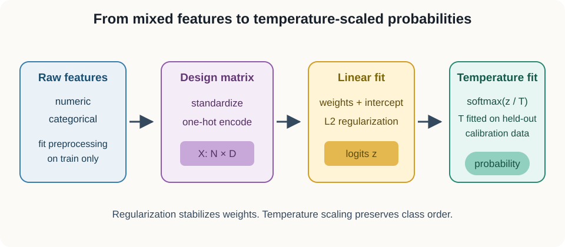
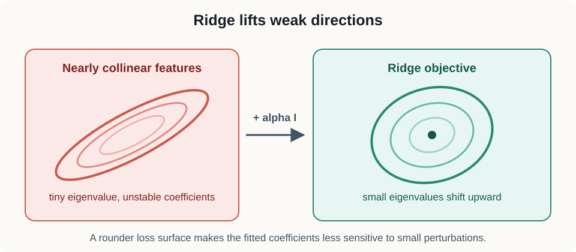
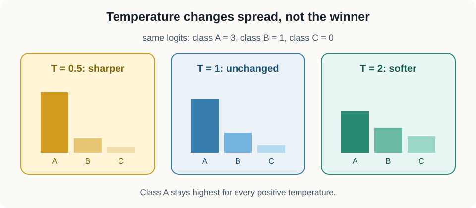

# 10. Regularized linear estimation and calibration

## Why this lesson matters

Suppose you have learned representation vectors for 2,000 observations. You want to answer two questions:

1. Can a simple linear model recover the target from those features?
2. Can the model's probability scores be used responsibly?

A linear probe looks simple, but its result depends on scaling, category encoding, collinearity, regularization, class weighting, and data separation. Temperature scaling can improve held-out negative log likelihood, but that improvement alone does not prove empirical calibration.

This lesson builds the full pipeline from a mixed-feature table to a regularized estimator and temperature-scaled probabilities.

## Prerequisites

You should know algebra, vectors, matrix multiplication, means, and basic probability. [Lesson 09](09_eigenspectra_and_effective_rank.md) explains eigenvalues and feature geometry.

## Learning goals

By the end of this lesson, you will be able to:

1. Standardize numeric features using training data only.
2. One-hot encode categorical variables and handle unseen levels.
3. Derive ridge regression with an unpenalized intercept.
4. Explain how regularization improves conditioning.
5. Build binary logistic and multiclass softmax models.
6. Use class weights without confusing them with population probabilities.
7. Fit a temperature by held-out negative log likelihood and state what that does not prove.

## 1. Begin with a mixed-feature scenario

Imagine predicting a medical outcome from:

- age in years,
- blood pressure in millimeters of mercury,
- a learned 128-dimensional representation,
- collection site as a categorical variable.

These inputs have different units and structures. Age and blood pressure are numeric. Site is a name, not a number with meaningful distance. Representation coordinates may be correlated.

A model matrix needs one numeric value in each cell. Feature construction determines what a coefficient means, so preprocessing is part of the statistical model.

## 2. Standardization makes numeric scales comparable

Let $X$ be a numeric training matrix with shape $(N,D)$. The integer $N$ is the number of training observations, and $D$ is the number of numeric features.

For feature $j$, compute the training mean:

$$
\mu_j=\frac{1}{N}\sum_{i=1}^{N}X_{ij}.
$$

Compute the training standard deviation:

$$
\sigma_j
{}={}
\sqrt{
\frac{1}{N}
\sum_{i=1}^{N}
(X_{ij}-\mu_j)^2
}.
$$

Transform any observation:

$$
\widetilde X_{ij}
{}={}
\frac{X_{ij}-\mu_j}{\sigma_j}.
$$

The transformed feature is measured in training standard deviations from the training mean. Use the same $\mu_j$ and $\sigma_j$ for validation, calibration, and test observations.

### Why scaling matters for regularization

Suppose one feature is measured in meters and another in millimeters. The millimeter coefficient will be roughly one thousand times smaller for the same physical effect. An L2 penalty sees coefficient size, so its treatment depends on units unless features are standardized.

### Failure at zero variance

If $\sigma_j=0$, feature $j$ is constant in training data. It supplies no variation for fitting. Remove it or use a transformer with an explicit safe-scale policy.

~~~python
from sklearn.preprocessing import StandardScaler

scaler = StandardScaler().fit(x_train)
x_train_scaled = scaler.transform(x_train)
x_test_scaled = scaler.transform(x_test)
~~~

Fitting the scaler on all data leaks test means and variances into training.

## 3. One-hot encoding respects categories

Suppose site has levels north, central, and south. Encoding them as 0, 1, and 2 would imply that central lies halfway between north and south. That geometry is invented.

One-hot encoding creates indicator features:

$$
\text{north}\mapsto[1,0,0],
\quad
\text{central}\mapsto[0,1,0],
\quad
\text{south}\mapsto[0,0,1].
$$

Each column answers one yes-or-no question.

With an intercept, the three columns sum to the all-ones column. This exact dependence is called the dummy-variable trap. Two common strategies are:

- drop one reference level,
- keep all levels and rely on regularization or a solver convention.

If the north column is dropped, its effect becomes part of the intercept. Other site coefficients describe differences from north.

### Unseen categories

At deployment, a new site may appear. Scikit-learn's <code>handle_unknown="ignore"</code> maps it to an all-zero indicator block. If a reference level was also dropped, the new site becomes indistinguishable from the reference inside that block. This can be acceptable for robustness, but it is not a learned new-site effect.

Use a <code>ColumnTransformer</code> or a pipeline so scaling and encoding are fitted inside each training fold.

## 4. Linear regression begins with a weighted sum

For one observation $x$ with shape $(D,)$, a linear prediction is

$$
\widehat y=x^\mathsf{T}w+b.
$$

The vector $w$ has shape $(D,)$. The scalar $b$ is the intercept. Each coefficient converts one feature unit into prediction units.

For all observations, let $X$ have shape $(N,D)$ and $y$ have shape $(N,)$. Without an intercept for the moment, ordinary least squares minimizes

$$
L(w)=\lVert y-Xw\rVert_2^2.
$$

The residual vector $y-Xw$ has shape $(N,)$. Squaring its Euclidean norm sums squared prediction errors.

Expand the objective:

$$
L(w)
{}={}
y^\mathsf{T}y
-2w^\mathsf{T}X^\mathsf{T}y
+w^\mathsf{T}X^\mathsf{T}Xw.
$$

Differentiate with respect to $w$:

$$
\nabla_w L
{}={}
-2X^\mathsf{T}y
+2X^\mathsf{T}Xw.
$$

At a minimum, set the gradient to zero:

$$
X^\mathsf{T}Xw=X^\mathsf{T}y.
$$

These are the normal equations. If $X^\mathsf{T}X$ is invertible, they have a unique solution.

## 5. Collinearity makes estimation unstable

Suppose two representation features are almost copies:

$$
x_2\approx x_1.
$$

Many coefficient pairs can then produce nearly the same prediction. Increasing the first coefficient and decreasing the second can leave $x_1w_1+x_2w_2$ almost unchanged.

This creates a nearly flat direction in the objective. Tiny changes in data can produce large changes in individual coefficients.

For a symmetric positive-definite matrix $A$, the spectral condition number is

$$
\kappa(A)
{}={}
\frac{\lambda_{\max}(A)}
{\lambda_{\min}(A)}.
$$

The numerator is the largest eigenvalue and the denominator is the smallest eigenvalue, which is strictly positive in this case. A large ratio means some directions are much less constrained than others. If a positive-semidefinite matrix is singular, its usual condition number is infinite. Ignoring its zero eigenvalues would instead compute a pseudo-condition number.

## 6. Ridge regression adds a preference for smaller weights

Ridge minimizes

$$
L_{\mathrm{ridge}}(w)
{}={}
\lVert y-Xw\rVert_2^2
+\alpha\lVert w\rVert_2^2.
$$

The positive scalar $\alpha$ is regularization strength. The penalty is the sum of squared coefficients.

Differentiate:

$$
\nabla_w L_{\mathrm{ridge}}
{}={}
-2X^\mathsf{T}y
+2X^\mathsf{T}Xw
+2\alpha w.
$$

Set the gradient to zero:

$$
(X^\mathsf{T}X+\alpha I)w
{}={}
X^\mathsf{T}y.
$$

The identity matrix $I$ has shape $(D,D)$. Ridge adds $\alpha$ to every eigenvalue of $X^\mathsf{T}X$. Small eigenvalues receive the largest relative change. In this no-intercept derivation, the regularized condition number is

$$
\frac{\lambda_{\max}+\alpha}{\lambda_{\min}+\alpha}.
$$

This remains finite when $\lambda_{\min}=0$. The next section handles an intercept without penalizing it.

### Numerical conditioning example

Suppose eigenvalues of $X^\mathsf{T}X$ are 100 and 0.01. The condition number is

$$
\frac{100}{0.01}=10{,}000.
$$

With $\alpha=1$, the eigenvalues become 101 and 1.01. The new condition number is

$$
\frac{101}{1.01}=100.
$$

Ridge greatly improves stability. The tradeoff is shrinkage bias: coefficients move toward zero.

## 7. Treat the intercept separately

Append a column of ones:

$$
X_a=
\begin{bmatrix}
\mathbf{1} & X
\end{bmatrix}.
$$

The augmented matrix $X_a$ has shape $(N,D+1)$. Let

$$
\theta=
\begin{bmatrix}
b\\
w
\end{bmatrix}
$$

contain the intercept followed by feature coefficients.

Usually, do not penalize $b$. Use a penalty matrix

$$
P=\mathrm{diag}(0,1,\ldots,1).
$$

Solve

$$
(X_a^\mathsf{T}X_a+\alpha P)\theta
{}={}
X_a^\mathsf{T}y.
$$

The leading zero leaves the intercept unpenalized. Penalizing it would shrink the overall outcome level toward zero, which is usually unrelated to model complexity.

~~~python
def ridge_with_intercept(x, y, alpha):
    xa = np.column_stack([np.ones(len(x)), x])
    penalty = np.eye(xa.shape[1])
    penalty[0, 0] = 0.0
    system = xa.T @ xa + alpha * penalty
    return np.linalg.solve(system, xa.T @ y)
~~~

Use <code>np.linalg.solve</code> instead of explicitly computing a matrix inverse. Direct solvers are more efficient and usually more stable.

## 8. Logistic regression turns scores into probabilities

For binary classification, compute a logit:

$$
z=x^\mathsf{T}w+b.
$$

The sigmoid maps any real number to $(0,1)$:

$$
p
{}={}
\frac{1}{1+\exp(-z)}.
$$

Interpret $p$ as the model's score for class 1. As $z$ becomes large and positive, $p$ approaches one. As $z$ becomes large and negative, $p$ approaches zero.

For label $y\in\{0,1\}$, negative log likelihood is

$$
\ell
{}={}
-y\log p
-(1-y)\log(1-p).
$$

If $y=1$, only $-\log p$ remains. If $y=0$, only $-\log(1-p)$ remains. Confident incorrect scores receive a large penalty.

The logit derivative simplifies to

$$
\frac{\partial \ell}{\partial z}=p-y.
$$

This says the update is driven by the difference between predicted probability and observed label.

### A binary numerical example

Let $z=1.386$. Because $\exp(-1.386)\approx0.25$, sigmoid probability is approximately

$$
p=\frac{1}{1+0.25}=0.8.
$$

If the observed label is $y=1$, negative log likelihood is $-\log(0.8)\approx0.223$. If the label is $y=0$, the loss is $-\log(0.2)\approx1.609$. The same confident score receives a much larger penalty when it is wrong.

Changing the classification threshold from 0.5 changes predicted labels, but it does not refit probabilities. Threshold selection and probability estimation are separate decisions.

## 9. Multiclass softmax

For $K$ classes, compute one logit per class:

$$
z=
\begin{bmatrix}
z_1 & z_2 & \cdots & z_K
\end{bmatrix}.
$$

Softmax gives

$$
p_k
{}={}
\frac{\exp(z_k)}
{\sum_{j=1}^{K}\exp(z_j)}.
$$

Every probability is positive and the probabilities sum to one.

Exponentials can overflow for large logits. Subtract the maximum logit $m=\max_j z_j$:

$$
p_k
{}={}
\frac{\exp(z_k-m)}
{\sum_j\exp(z_j-m)}.
$$

Adding or subtracting the same constant from every logit does not change softmax probabilities.

~~~python
def softmax(logits):
    shifted = logits - logits.max(axis=-1, keepdims=True)
    exp_values = np.exp(shifted)
    return exp_values / exp_values.sum(axis=-1, keepdims=True)
~~~

## 10. Regularized logistic estimation

Logistic regression has no ordinary closed-form solution. Iterative solvers minimize summed or averaged negative log likelihood plus an L2 penalty.

Different libraries define regularization strength differently. Scikit-learn commonly uses $C$, where smaller $C$ means stronger regularization. Do not move a numeric value between libraries without checking objective scaling.

A linear probe tests linearly accessible information. Failure can mean the representation lacks the information, or that the information is present in a nonlinear form. Success does not prove that the feature is causal or robust.

## 11. Class weighting changes the objective

Suppose class 1 is rare. A weighted objective is

$$
L
{}={}
-\sum_{i=1}^{N}
a_{y_i}\log p_{i,y_i}.
$$

The positive scalar $a_{y_i}$ is the weight for the observed class of example $i$. Inverse-frequency weights increase the contribution of rare-class errors.

Weighting can improve balanced accuracy or recall. It also changes the population emphasized by the loss. Probabilities from a weighted fit need not estimate the original population prevalence.

For binary outcomes, let $\eta(x)=P(Y=1\mid X=x)$ under the target population. At a fixed $x$, a weighted expected log loss is

$$
-a_1\eta(x)\log p
-a_0(1-\eta(x))\log(1-p).
$$

Its unconstrained minimizer is

$$
p_w(x)
{}={}
\frac{a_1\eta(x)}
{a_1\eta(x)+a_0(1-\eta(x))}.
$$

Therefore

$$
\frac{p_w(x)}{1-p_w(x)}
{}={}
\frac{a_1}{a_0}
\frac{\eta(x)}{1-\eta(x)}.
$$

Unequal class weights change the optimal odds by the weight ratio. The raw weighted-model output is naturally interpreted for the reweighted objective, not automatically as $P(Y=1\mid X=x)$ in the original population. Regularization, model misspecification, and sampling design can add further differences, so evaluate or recalibrate on data representative of the intended population.

### Misconception

**Balanced class weights automatically produce better probabilities.**

No. They change decision emphasis. Evaluate probability quality under the target population and sampling design.

## 12. Calibration is a property of repeated predictions

A classifier is calibrated when predictions near probability $q$ are correct about fraction $q$ of the time. For example, among many cases assigned probability 0.8, about 80 percent should be positive.

Accuracy does not measure this property. A model can have high accuracy and excessive confidence.

Empirical calibration needs a reliability diagnostic, such as:

- a reliability curve,
- a Brier score,
- expected calibration error with a declared binning rule,
- uncertainty intervals over these summaries.

No single finite sample can prove perfect calibration.

## 13. Temperature scaling adjusts logit spread

Temperature scaling divides every class logit by one positive scalar $T$:

$$
p_k(T)
{}={}
\frac{\exp(z_k/T)}
{\sum_j\exp(z_j/T)}.
$$

If $T>1$, logits move closer together and probabilities soften. If $0<T<1$, probabilities sharpen. Because division by a positive scalar preserves logit order, top-1 class predictions do not change.

Fit $T$ by minimizing negative log likelihood on a held-out fitting partition often called calibration data. Negative log likelihood is a proper scoring rule: in expectation, it rewards truthful probability assignments.

Lower empirical negative log likelihood on the fitting partition means that the chosen $T$ scored better there than the compared candidates. It does not prove that probabilities are calibrated.

### A three-class temperature example

Suppose logits are $[3,1,0]$. Class 1 has the largest logit. Dividing by $T=2$ gives $[1.5,0.5,0]$. The ordering is unchanged, but the gaps are smaller, so softmax assigns less probability to class 1 and more to the alternatives.

Dividing by $T=0.5$ gives $[6,2,0]$. The gaps are larger, so the distribution becomes sharper. One temperature controls global confidence spread, not class-specific or region-specific errors.

## 14. Separate training, temperature fitting, and testing

Use three roles:

1. Training data fit preprocessing and model parameters.
2. Calibration data fit the temperature.
3. Test data evaluate the frozen pipeline.

Do not choose $T$ on test labels. Do not assert that test negative log likelihood must improve. A temperature that improves calibration-set NLL can perform worse on one finite test sample because of sampling variation or distribution shift.

Report test scoring rules and reliability diagnostics with uncertainty. Temperature scaling cannot repair incorrect class ordering, missing features, or a shifted label relationship.

### Reliability estimates also vary

A reliability curve groups predictions into probability bins and compares mean confidence with observed frequency. Bin edges, sample size, and class prevalence affect the plot. Sparse bins can look badly miscalibrated or perfectly calibrated by chance.

Report bin counts and an uncertainty method, such as a participant-level bootstrap when observations are clustered. Expected calibration error is a summary of a chosen binning scheme, not a universal property independent of that choice.

The Brier score for a binary outcome is

$$
\frac{1}{N}\sum_{i=1}^{N}(p_i-y_i)^2.
$$

It is another proper scoring rule. Like NLL, it combines calibration and discrimination behavior. Neither score alone replaces a reliability analysis.

### Conceptual checkpoint

What can you conclude after calibration-set NLL decreases?

You can conclude that the selected temperature improved that empirical scoring rule on the data used to select it. You cannot yet conclude that test NLL improves or that empirical calibration is established.

## 15. A complete leakage-safe workflow

1. Split independent groups into training, calibration, and test partitions.
2. Fit standardization and one-hot encoding on training data.
3. Fit the regularized linear model on transformed training data.
4. Transform calibration data with frozen preprocessing.
5. Fit temperature using calibration logits and labels.
6. Freeze every component.
7. Evaluate scores and reliability on transformed test data.

When data are grouped, use group-aware cross-validation for regularization selection.

## 16. Efficiency notes

- Use <code>Pipeline</code> and <code>ColumnTransformer</code> to keep preprocessing inside folds.
- Use sparse one-hot matrices for high-cardinality categories.
- Use mature iterative solvers for logistic regression.
- Use <code>np.linalg.solve</code>, QR, or SVD rather than explicit inversion.
- Vectorize stable softmax over the final axis.
- Search temperature on log scale or optimize $\log T$ so positivity is automatic.
- Keep a separate calibration partition or use nested cross-validation.

## 17. Common failure modes

1. **Scaling before splitting:** test statistics leak into training.
2. **Integer category codes:** arbitrary numbers create fake distances.
3. **Penalized intercept:** the global outcome level is shrunk.
4. **Explicit inverse:** computation and numerical error increase.
5. **Unstable exponentials:** large logits overflow.
6. **Class weights called calibration:** weighted fitting changes probability meaning.
7. **Temperature fit on test data:** final evaluation becomes optimistic.
8. **NLL improvement called calibration proof:** no reliability evidence was measured.
9. **Ignoring distribution shift:** a fitted temperature may not transfer.

## 18. Exercises

1. Why does feature standardization change an L2-regularized solution?
2. Derive the ridge normal equations.
3. Does temperature scaling change top-1 accuracy?
4. What ambiguity arises from combining a dropped reference category with ignored unknown categories?
5. What additional evidence is needed before claiming empirical calibration?

### Brief solutions

1. The same coefficient size represents different prediction changes for differently scaled features.
2. Set $-2X^\mathsf{T}y+2X^\mathsf{T}Xw+2\alpha w=0$ and rearrange.
3. No. Positive temperature preserves logit order.
4. Both the reference and an unknown category map to the same all-zero indicator block.
5. Evaluate a declared reliability diagnostic and scoring rules on untouched data, with uncertainty.

## Recap

Standardization and one-hot encoding create a meaningful design matrix. Ridge stabilizes weakly constrained directions and normally excludes the intercept. Logistic and softmax models convert linear scores into probabilities. Class weights change the fitting population. Temperature scaling changes confidence while preserving class order, but fitting by negative log likelihood is not itself proof of calibration.

## Next lesson

[11: Factorial state spaces](11_factorial_state_spaces.md) studies structured combinations of factors used in representation evaluation.

## Continue in the notebook

[Open the executable lesson 10 notebook](../implementations/10_regularized_linear_estimation.ipynb) to solve ridge regression, fit a weighted classifier, and select a temperature by held-out NLL.
