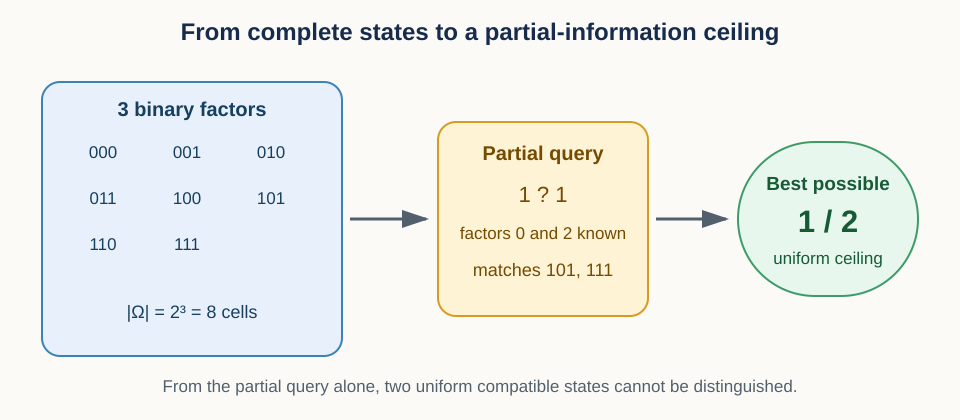
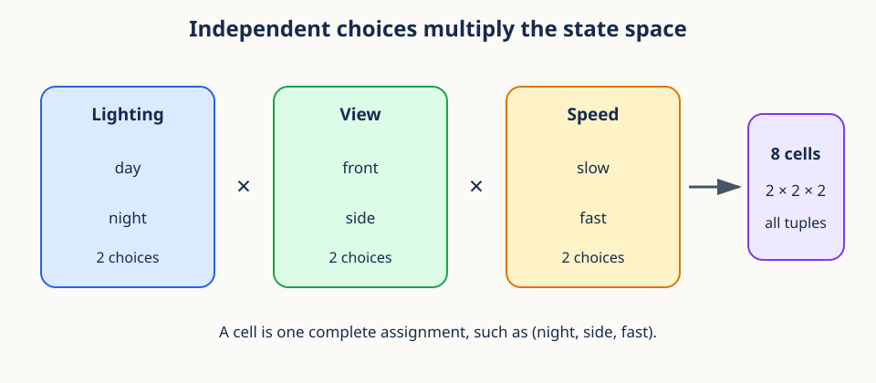
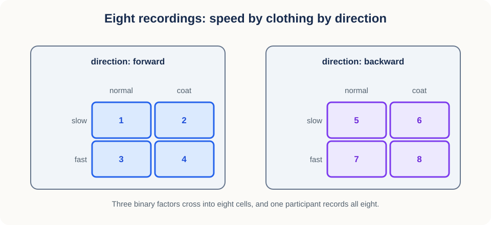
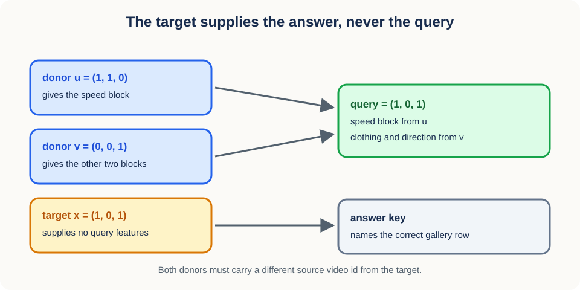
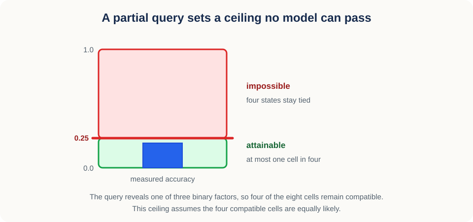
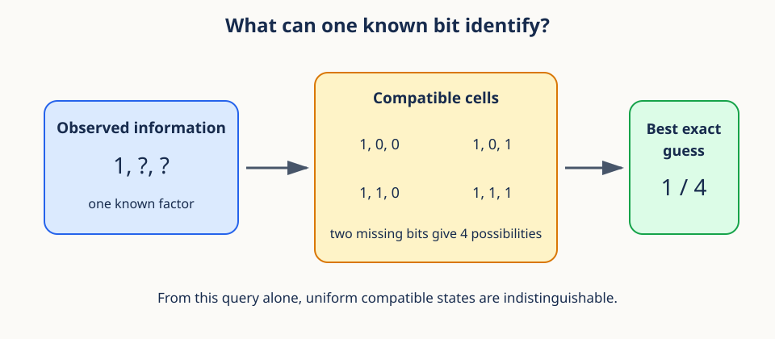

# 11. Factorial state spaces



## Prerequisites

You should be comfortable with Python lists, sets, loops, and basic probability. The ideas
build on [10. Regularized linear estimation and calibration](10_regularized_linear_estimation.md),
which fitted one head per factor. This lesson describes the space those factors live in, and
it needs no advanced linear algebra.

## Learning goals

By the end of this lesson, you will be able to:

1. distinguish factors, levels, cells, and complete assignments;
2. construct a state space as a Cartesian product;
3. encode binary cells as bit vectors and integers;
4. enumerate factor subsets and complementary assignments;
5. use exact rational arithmetic for finite probabilities; and
6. construct all 16 source-separated GFC-v2 queries for one complete participant;
7. derive exact retrieval oracles from the number of recovered factors.

## 1. Motivating scenario: what exactly did we test?

Suppose you evaluate a video representation under three conditions. Lighting can be day or
night. Camera view can be front or side. Walking speed can be slow or fast. Someone reports
"night accuracy" and stops there. That number is incomplete, because night covers four
different combinations of view and speed, and the model may handle them very differently.

The clean mental model is an address book. Every experimental condition has an address with
one entry per condition variable. The address `(night, side, fast)` names one precise
situation. The state space is the set of all valid addresses.

This language heads off the most common confusion in the whole topic. A factor is not a cell.
"Lighting" is a factor, "night" is one of its levels, and `(night, side, fast)` is a cell that
happens to use that level.

## 2. Vocabulary before formulas

Fix the four words before any notation appears, because every later formula is stated in
terms of them.

A **factor** is a variable deliberately represented in the design, such as lighting. A
**level** is one allowed value of a factor, such as day. A **cell** is one complete choice of
a level for every factor. A **state space** is the collection of all cells.

Now the notation. Let there be $F$ factors. Factor $f$ has a set of levels called $A_f$, and
$L_f$ is the number of levels in that set. The subscript $f$ is just a factor index running
from 1 through $F$.

For the motivating example, $F=3$ and every $L_f=2$. One cell has three entries, so its
natural shape is a length-3 tuple, or a one-dimensional array with shape `(3,)`.

One warning about the word **factorial**, which this study uses in two related but different
ways. A factorial outcome state space crosses speed, clothing, and direction to describe the
eight recordings available for one participant. A factorial experimental design crosses
sequence support and temporal policy to describe four training conditions. The first organizes
evaluation outcomes; the second identifies main effects and an interaction across trained
models. They share the Cartesian-product idea, but they do not share factors, observational
units, or scientific purpose.

## 3. Cartesian products multiply independent choices

The state space is built by one operation: take every combination of one level from each
factor.

The Cartesian product collects every tuple formed that way:

$$
S=A_1\times A_2\times\cdots\times A_F.
$$

Here $S$ is the complete state space. The multiplication symbol means "combine every choice,"
not numeric multiplication of the level names.

Counting the result is where the multiplication becomes numeric:

$$
|S|=\prod_{f=1}^{F}L_f.
$$

The bars $|S|$ mean the number of elements in $S$. Every choice for factor 1 can be paired
with every choice for factor 2, and so on down the list, so the counts multiply.



In the running example, the count is $2\times2\times2=8$. Add a fourth factor with three
levels and the count becomes $8\times3=24$. Factorial spaces grow quickly, which is why later
sections care about not materializing them.

```python
from itertools import product

lighting = ["day", "night"]
view = ["front", "side"]
speed = ["slow", "fast"]
cells = list(product(lighting, view, speed))

assert len(cells) == 8
print(cells[0])  # ('day', 'front', 'slow')
```

`itertools.product` beats hand-written nested loops here for two reasons: it works for any
number of factors without rewriting, and it names the Cartesian-product intention in the code.

### Conceptual checkpoint

If the factor level counts are 2, 3, and 4, there are $2\times3\times4=24$ cells. Adding one
more binary factor doubles the count to 48. It does not add two cells.

## 4. A table representation and its shapes

For computation, the address book becomes an array, and it helps to be precise about what
each axis means.

Suppose the state space has $M=|S|$ cells. Store an enumeration as a table with shape
`(M, F)`, where rows are cells and columns are factors.

For three binary factors the table shape is `(8, 3)`. Entry `states[m, f]` is the level of
factor $f$ in cell $m$. The row index $m$ is not a scientific quantity; it is only an
enumeration label, and it changes if you enumerate in a different order.

```python
import numpy as np

states = np.array(list(product([0, 1], repeat=3)), dtype=np.int8)
assert states.shape == (8, 3)
assert np.array_equal(states[5], [1, 0, 1])
```

Small integer arrays are efficient for equality checks and indexing. Keep a separate mapping
from integers back to human-readable level names, because the array alone cannot tell you
whether 1 means "fast" or "coat".

## 5. Binary cells as bit vectors

When every factor has exactly two levels, a cell is just a string of bits, and that opens up
a compact integer encoding.

Encode the two levels as 0 and 1. A cell becomes a bit vector

$$
b=(b_0,b_1,\ldots,b_{F-1}),\qquad b_j\in\{0,1\}.
$$

The symbol $b_j$ is the bit for factor position $j$, indexed from 0 to match Python. There
are $2^F$ possible bit vectors, since each of the $F$ positions has two choices.

Read the bits as a binary number to get a single integer:

$$
q=\sum_{j=0}^{F-1}b_j2^{F-1-j}.
$$

The exponent $F-1-j$ gives the leftmost bit the largest place value. For $b=(1,0,1)$,
$q=1\times4+0\times2+1\times1=5$.

```python
def bits_to_int(bits):
    value = 0
    for bit in bits:
        value = 2 * value + int(bit)
    return value

assert bits_to_int((1, 0, 1)) == 5
```

The integer makes a compact dictionary key, but it is safe only when the factor order is
fixed and documented. Reorder the columns and the integer changes, even though the named
assignment is logically identical.

### Mixed-radix encoding for nonbinary factors

Binary is a special case of a more general scheme, which matters as soon as one factor has
three or more levels.

Suppose factor $f$ is encoded by an integer $a_f$ from 0 through $L_f-1$. A complete cell maps
to

$$
q=\sum_{f=1}^{F}a_f\prod_{r=f+1}^{F}L_r.
$$

The inner product multiplies the level counts of every factor to the right of position $f$,
which is that position's place value. For the final factor the product is empty and is defined
as 1. This is ordinary place value, except that each position can have a different base.

Work an example. With factor sizes 2, 3, and 4 and the assignment $(1,2,3)$, the code is
$1\times(3\times4)+2\times4+3=23$. There are 24 cells in total, so valid codes run from 0
through 23, and this assignment is the last cell in lexicographic order.

Decoding runs right to left with repeated quotient and remainder. Divide the code by the last
factor size: the remainder is the last level, and the quotient carries the remaining prefix.
Repeat with the next factor size.

```python
def decode_mixed_radix(code, level_counts):
    values = []
    for count in reversed(level_counts):
        code, value = divmod(code, count)
        values.append(value)
    if code != 0:
        raise ValueError("code is outside the state space")
    return tuple(reversed(values))

assert decode_mixed_radix(23, [2, 3, 4]) == (1, 2, 3)
```

Mixed-radix codes make dense lookup arrays possible, since every valid cell gets a unique
consecutive integer. They also make metadata loss dangerous: a code means nothing without the
ordered level counts and the mapping from level names to integers.

## 6. Factor subsets and the power set

So far every cell has been complete. Real queries often reveal only some factors, so we need
vocabulary for "which factors are known".

If the full factor index set is $U=\{0,1,\ldots,F-1\}$, a known subset $K$ is any subset of
$U$, and its complement holds the unknown factors:

$$
K^{c}=U\setminus K.
$$

The superscript $c$ means complement relative to $U$, and the backslash means set difference.
If $U=\{0,1,2,3\}$ and $K=\{0,2\}$, then $K^c=\{1,3\}$.

The collection of all possible subsets is the power set. An $F$-element set has $2^F$ subsets,
counting both the empty set and the complete set.

```python
from itertools import combinations

def all_subsets(items):
    items = tuple(items)
    for size in range(len(items) + 1):
        yield from combinations(items, size)

subsets = list(all_subsets(range(3)))
assert len(subsets) == 8
```

### Misconception: a subset is not a partial row

The subset $K=\{0,2\}$ names which factors are known. It says nothing about their values. A
partial assignment needs both pieces: the subset and the values, such as "factor 0 is 1 and
factor 2 is 0." Code that stores only one of the two will eventually mix up queries that are
not comparable.

## 7. Complementary binary assignments

One particular operation on binary cells is used heavily by GFC-v2 in Section 9, so it is
worth defining on its own first.

For a binary vector $b$, its bitwise complement flips every factor:

$$
\bar b_j=1-b_j.
$$

The bar identifies the complementary assignment. For $b=(1,0,1)$ the complement is $(0,1,0)$,
and applying the operation twice returns the original vector.

```python
def complement(bits):
    return tuple(1 - int(bit) for bit in bits)

bits = (1, 0, 1)
assert complement(bits) == (0, 1, 0)
assert complement(complement(bits)) == bits
```

Complement is meaningful only after a binary coding is fixed. A three-level factor has no
unique opposite level unless the scientific design supplies one.

## 8. Query enumeration

With subsets and values defined, a query becomes a concrete pair, and finding the cells it
matches becomes one array operation.

Represent a query as `(known_indices, known_values)`. To find compatible cells, compare only
the known columns and ignore the rest.

```python
known_indices = np.array([0, 2])
known_values = np.array([1, 0])
compatible = np.all(states[:, known_indices] == known_values, axis=1)
matches = states[compatible]

assert matches.shape == (2, 3)
```

Read that in two steps. The comparison builds a Boolean array with shape `(M, len(K))`, one
verdict per cell per known factor. Then `np.all(..., axis=1)` collapses each row to a single
compatibility decision. Vectorizing is both faster and clearer than looping over every cell in
Python.

For a large state space, do not materialize every query-state pair. Encode queries as integer
masks and values, or generate the compatible cells lazily.

## 9. GFC-v2 complementary donors and complete queries

Now apply all of this to the study's actual construction, which uses complements from Section
7 to build queries that deliberately exclude the target.

GFC-v2 uses three binary outcome factors in the fixed order speed, clothing, and direction.
One participant records every combination of them, which is the eight-cell grid below.



Let the target cell be $x=(s,c,d)\in\{0,1\}^3$, where $s$, $c$, and $d$ are the speed,
clothing, and direction bits. The focal factor $a$ is either speed or clothing. Direction is
never focal, because an opposite-direction recording at fixed speed and clothing can share the
target's physical source walk, which would defeat the whole construction.

For one focal factor, define two complementary donors:

$$
u_a=x_a,
\qquad
u_j=1-x_j\quad(j\ne a),
$$

$$
v_a=1-x_a,
\qquad
v_j=x_j\quad(j\ne a).
$$

In words: donor $u$ agrees with the target on the focal factor and disagrees everywhere else,
while donor $v$ does exactly the reverse.

The composed query takes factor block $a$ from $u$ and the other two factor blocks from $v$.
Each block therefore matches the target, yet no feature of the target was used. The target
supplies the answer label and identifies the correct gallery row, and nothing else. That is
the key grounding rule.



```python
from itertools import product

factor_names = ("speed", "clothing", "direction")
cells = list(product([0, 1], repeat=3))

def gfc_donors(target, focal):
    focal_index = factor_names.index(focal)
    donor_u = tuple(value if j == focal_index else 1 - value
                    for j, value in enumerate(target))
    donor_v = tuple(1 - value if j == focal_index else value
                    for j, value in enumerate(target))
    return donor_u, donor_v

queries = []
for target in cells:
    for focal in ("speed", "clothing"):
        donor_u, donor_v = gfc_donors(target, focal)
        sources = tuple("u" if name == focal else "v" for name in factor_names)
        queries.append((target, focal, donor_u, donor_v, sources))

assert len(queries) == 16
assert all(source != "target" for *_, sources in queries for source in sources)
```

Matching cells is not enough on its own, because two different cells can still come from the
same physical recording. Every recording carries a `source_video_id`, and before constructing
a query both donor source IDs must differ from the target source ID. A transformed copy,
another window, or a renamed file from the target source fails this check. Source separation
is about lineage, not filenames.

Building a synthetic audit realistically requires the same trap to exist. Give opposite
directions at fixed speed and clothing the same source ID. The two allowed focal factors still
produce source-separated donors, while a direction-focal query does not, because one of its
donors shares the target's physical source. A negative test should require that
direction-focal construction to fail. Assigning a unique source ID to every cell would make the
check vacuous, since every distinct cell would then look source-separated by construction.

Two final structural rules. The gallery still contains all eight participant recordings,
including $u$ and $v$; removing the donors would make the gallery depend on the query and
would change the task. And for each of the eight targets, the two allowed focal factors give
exactly 16 queries. Store the target ID, both donor IDs, all three factor-block sources, and
all source video IDs, so the construction can be audited later without reconstructing hidden
state.

### Exact information oracles

The same combinatorics give exact expected scores for synthetic representations, which is how
the evaluator itself gets tested.

Suppose a synthetic representation recovers exactly $k$ of the three binary factors and says
nothing about the others. In a complete, balanced Cartesian gallery, $2^{3-k}$ cells remain
tied, so fractional top-1 accuracy is

$$
p_k=\frac{1}{2^{3-k}}.
$$

The exact values are

| Recovered factors $k$ | Tied gallery cells | Fractional top-1 |
|---:|---:|---:|
| 0 | 8 | $1/8$ |
| 1 | 4 | $1/4$ |
| 2 | 2 | $1/2$ |
| 3 | 1 | $1$ |

These are evaluator oracles, not expected empirical effect sizes. An implementation should
verify all four cases exactly. If an oracle fails, inspect gallery completeness, factor
weights, tie handling, or accidental target features before trusting any model result. Lesson
12 runs all four cases through the retrieval evaluator; recreating the four fractions from the
formula alone is not an evaluator test.

## 10. Constrained state spaces and structural zeros

Everything so far assumed the product space is entirely legal. Scientific designs often
violate that assumption, and the violation must be modeled explicitly.

A Cartesian product assumes every combination is possible. **Structural zeros** are cells that
cannot occur by definition. For example, a sensor factor may have levels `RGB` and `thermal`,
while a color-temperature factor is defined only for RGB. Crossing them blindly invents
thermal cells carrying meaningless color-temperature labels.

Handle this by starting from the product space $S$ and applying a feasibility rule:

$$
S_{\mathrm{valid}}=\{s\in S:\text{the feasibility rule accepts }s\}.
$$

Here $s$ denotes one complete cell, and the text after the colon is the condition deciding
whether that cell is allowed. Counts, priors, and the partial-information ceilings of Section
12 must all use $S_{\mathrm{valid}}$ rather than the unfiltered product.

Keep structural zeros separate from missing data. A valid cell with no collected sample is
empty because of sampling or data loss, and collecting more data could fill it. An invalid
cell does not belong to the target state space at all. Merging the two makes a coverage report
look better or worse than the design warrants.

For small spaces, enumerate and then filter with a clearly tested predicate. For large spaces,
generate only feasible branches, so that exponential work is not spent on cells that will be
discarded.

## 11. Exact probabilities with rational arithmetic

The counts in this lesson are all integers, and the probabilities built from them are all
exact fractions. Floating-point arithmetic gives that up for no reason.

Floating-point `1/3` is an approximation, which makes equality checks and accumulated counts
awkward to reason about.

```python
from fractions import Fraction

probability = Fraction(1, 3) + Fraction(1, 6)
assert probability == Fraction(1, 2)
```

`Fraction` stores an integer numerator and denominator and reduces them automatically. Use it
for small exact enumerations, and convert to `float` only for plotting or for APIs that
require it. For millions of operations, integer counts followed by one final division are
usually faster.

## 12. Partial-information ceilings

This is where the vocabulary pays off. A partial query leaves several cells indistinguishable,
and that count alone caps how often any decision rule can be exactly right.

Suppose the true cell is one of eight binary cells, but the query reveals only the first
factor. Four cells remain compatible. If those four are equally likely given the revealed
value, and the decision rule sees nothing else, then any exact-cell guess succeeds with
probability at most $1/4$.





In general, for a full Cartesian product of $F$ binary factors and any consistent assignment
to $k$ known factors, the number of compatible cells is

$$
C=2^{F-k}.
$$

Here $C$ counts the completions and $F-k$ counts the unknown bits. This assumes no structural
zeros and that the known values impose no further constraints. Under a uniform conditional
distribution over those completions, the exact-identification ceiling is

$$
p_{\max}=\frac{1}{C}=2^{-(F-k)}.
$$

Read this as a statement about the input, not about the model. The partial query simply does
not distinguish the compatible cells, so no amount of modeling effort can separate them.

For nonbinary unknown factors in an unconstrained Cartesian product, replace the power of two
by the product of their level counts:

$$
C=\prod_{f\in K^c}L_f.
$$

For a constrained state space, that product can be wrong, because Section 10's feasibility
rule may rule out some completions. Let $x_K$ denote the revealed values on known factor set
$K$. The compatible set is

$$
\mathcal{C}(x_K)=\{s\in S_{\mathrm{valid}}:s_K=x_K\},
$$

and its size is $C(x_K)=|\mathcal{C}(x_K)|$. The subscript $s_K$ means the entries of cell $s$
at the known factor positions. Structural constraints can make $C(x_K)$ depend on the
particular revealed values, not just on how many factors are unknown.

The uniform assumption can fail too. If the compatible cells are not equally likely, the best
guess is the most probable one. Writing $Z$ for the random variable holding the true cell, the
conditional ceiling for revealed assignment $x_K$ is

$$
p_{\max}(x_K)=\max_{s\in\mathcal{C}(x_K)}P(Z=s\mid X_K=x_K).
$$

The variable $X_K$ contains the revealed factor values, and the maximum picks the most
probable compatible cell. The ceiling is therefore not necessarily $1/C(x_K)$, and the gap can
be large when the target population has strong cell imbalance.

Make that concrete. Suppose four states are compatible with conditional probabilities 0.7, 0.1,
0.1, and 0.1. A classifier seeing only the partial query should always choose the first cell,
and it will be right 70 percent of the time. The uniform formula would have predicted 25
percent and would simply be wrong, because the prior is not uniform.

The same example shows why a ceiling must state its information set. If the classifier also
receives a feature correlated with the missing factors, those four states are no longer
indistinguishable and the ceiling no longer applies. A valid ceiling lists exactly which
variables the decision rule may use and computes conditional probabilities given those
variables.

One consequence for reporting: if an evaluation averages over several partial queries, a single
fixed $1/C$ is generally not the overall ceiling. Average the query-specific Bayes success
probabilities using the same query distribution and weights as the evaluation. This matters
whenever constraints or class imbalance make some revealed assignments easier than others.

### Worked numerical example

Take four factors with level counts 2, 3, 2, and 4, and a query that reveals the first and
third factors. The unknown factors have 3 and 4 levels, so $C=3\times4=12$ completions. Under
a uniform conditional distribution, exact identification cannot exceed $1/12$. Learn one
additional value from the 4-level factor and the candidates drop to 3, raising the ceiling to
$1/3$.

## 13. Failure modes and efficiency notes

Most errors in this area come from throwing away metadata that the encodings silently depend
on, or from quoting a ceiling without its assumptions.

1. **Changing factor order:** integer and bit encodings silently change meaning.
2. **Ignoring impossible cells:** a Cartesian product may include combinations ruled out by
   physics or protocol. Filter them and call the result a constrained state space.
3. **Assuming a uniform prior:** $1/C$ is valid only under equal conditional probability.
4. **Confusing factor subsets with values:** store both known indices and assignments.
5. **Materializing huge products:** iterate lazily with `itertools.product` or use masks.
6. **Using floats for exact counts:** keep integer counts or `Fraction` until the end.
7. **Confusing two factorial designs:** outcome cells and training cells answer different
   questions and use different observational units.
8. **Using target features in a composed query:** the target may identify the answer, but only
   donor blocks may form the query.
9. **Dropping donors from the gallery:** GFC-v2 retains all eight recordings.
10. **Checking filenames instead of source lineage:** compare frozen `source_video_id` values
    for both donors and the target.

On efficiency, the cell count grows exponentially in the number of binary factors.
Enumeration is excellent for small spaces and for validating formulas against brute force.
For large $F$, reason symbolically or sample states instead of allocating an array with $2^F$
rows.

## Exercises

### Exercise 1

Factors have 2, 2, 3, and 5 levels. How many complete cells exist?

**Brief solution:** $2\times2\times3\times5=60$ cells.

### Exercise 2

Encode the binary vector `(1, 1, 0, 1)` as an integer using the convention above.

**Brief solution:** $8+4+0+1=13$.

### Exercise 3

Six binary factors are present and two are known. What is the uniform exact-cell ceiling?

**Brief solution:** Four bits remain unknown, so there are $2^4=16$ completions and the
ceiling is $1/16$.

### Exercise 4

Why might a measured accuracy exceed the uniform ceiling without violating mathematics?

**Brief solution:** The compatible cells may have unequal conditional probabilities, or the
model may receive information that was not included in the ceiling calculation.

### Exercise 5

For target $(1,0,1)$ with clothing focal, construct $u$ and $v$. Which donor supplies each
query block?

**Brief solution:** $u=(0,0,0)$ and $v=(1,1,1)$. Clothing comes from $u$. Speed and direction
come from $v$. The target contributes no block.

## Recap

A factorial state space is an address book of complete assignments. Cartesian products
multiply the level choices, binary cells admit compact bit and mixed-radix encodings, and
subsets describe which parts of an address are known. GFC-v2 builds each query from donor
blocks only, keeps the complete eight-recording gallery, and enforces source lineage
separation between donors and target. Exact rational arithmetic keeps the finite probabilities
honest. A partial-information ceiling follows from how many cells remain indistinguishable and
from their conditional probabilities, so it is a statement about the query, not about the
model.

## Continue

- Previous: [10. Regularized linear estimation and calibration](10_regularized_linear_estimation.md)
- Notebook: [11. Factorial state spaces](../implementations/11_factorial_state_spaces.ipynb)
- Next: [12. Blockwise distances and ranking](12_blockwise_distances_and_ranking.md), which
  turns these cells into gallery rows and scores them.
- Curriculum: [Tutorial README](../README.md)
