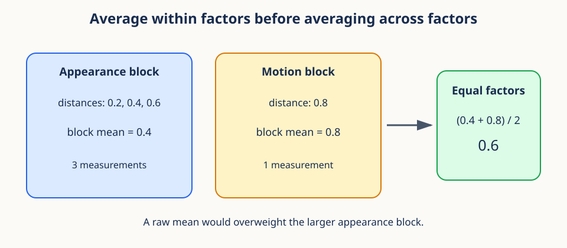
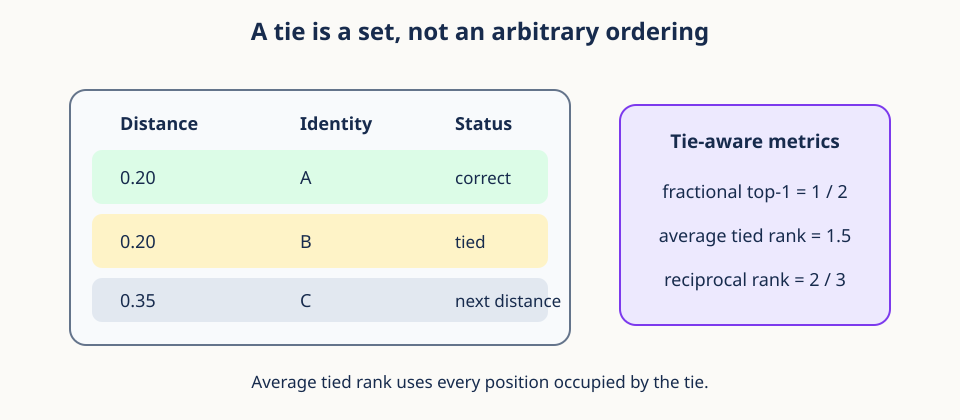

# 12. Blockwise distances and ranking


## Prerequisites

You should understand vectors, dot products, norms, averages, and factorial cells. Review
[11. Factorial state spaces](11_factorial_state_spaces.md) if factor subsets or cells are
unfamiliar.

## Learning goals

By the end of this lesson, you will be able to:

1. explain retrieval as a query-to-gallery comparison;
2. compute cosine similarity and cosine distance safely;
3. aggregate unequal blocks without silently changing factor weights;
4. rank candidates while preserving ties;
5. compute fractional top-1 credit, average tied rank, and mean reciprocal rank; and
6. vectorize large batches of comparisons.

## 1. Motivating scenario: finding a person in a gallery

Suppose a model converts one probe video into a 128-number vector. A gallery contains one
or more vectors for every enrolled identity. We want to ask a concrete question: which
gallery identity is geometrically closest to the probe?

This sounds like sorting numbers, but several design choices come first. Does vector
magnitude matter? Are there several measurements for appearance and only one for motion?
What happens when two candidates have the same distance? A ranking metric is meaningful
only after these questions have explicit answers.

The useful mental model is a report card. Each factor block gives a candidate one score.
We average within each subject area, then decide how much each subject area counts. Only
after producing one final score per candidate do we rank the gallery.

## 2. Vocabulary and shapes

A **query** or **probe** is the item being identified. The **gallery** is the set of
candidates. An **embedding** is a vector produced by a representation model. A
**distance** is a numeric dissimilarity, so smaller values are better. A **rank** records
where the correct candidate appears after sorting.

Let one query embedding be $q$ with shape `(D,)`, where $D$ is the feature width. Let the
gallery matrix $G$ have shape `(M, D)`, where $M$ is the number of candidate embeddings.
Row $g_m$ is candidate $m$.

For a batch of $P$ queries, store them in $Q$ with shape `(P, D)`. A full pairwise
distance matrix has shape `(P, M)`. Entry `(p, m)` compares query $p$ with gallery row
$m$. Naming these axes prevents a common mistake: sorting across queries instead of
across gallery candidates.

## 3. Dot products, norms, and angles

For vectors $q$ and $g$ of width $D$, the dot product is

$$
q^Tg=\sum_{j=1}^{D}q_jg_j.
$$

The symbol $j$ indexes a feature coordinate. The dot product is large when coordinates
with large magnitudes point in similar signed directions.

The Euclidean norm is

$$
\lVert q\rVert_2=\sqrt{\sum_{j=1}^{D}q_j^2}.
$$

The norm measures vector length. A raw dot product therefore mixes direction and length.
If length is an unwanted confidence or exposure effect, normalize it away.

Cosine similarity is

$$
s_{\cos}(q,g)=\frac{q^Tg}{\lVert q\rVert_2\lVert g\rVert_2}.
$$

The numerator measures alignment. The denominator divides by both lengths. For nonzero
vectors, the result lies between -1 and 1. A value near 1 means similar direction, 0 means
roughly perpendicular, and -1 means opposite direction.

Cosine distance is usually defined as

$$
d_{\cos}(q,g)=1-s_{\cos}(q,g).
$$

Now smaller is better. Identical directions have distance 0, perpendicular directions
have distance 1, and opposite directions have distance 2.

### Worked vector example

Let $q=(3,4)$ and $g=(6,8)$. Their dot product is 50. Their norms are 5 and 10, so cosine
similarity is $50/(5\times10)=1$ and cosine distance is 0. The vectors have different
lengths but exactly the same direction.

For $h=(-4,3)$, the dot product with $q$ is 0. Both norms are 5, so cosine similarity is
0 and distance is 1. The two vectors are perpendicular.

### Cosine distance versus Euclidean distance

Euclidean distance is

$$
d_2(q,g)=\lVert q-g\rVert_2.
$$

It measures the straight-line separation between vector endpoints and responds to both
direction and magnitude. Cosine distance responds only to direction after normalization.
Neither choice is universally superior. The representation training objective and the
meaning of vector norm should guide the metric.

Consider query `(1, 0)` and candidates `(10, 0)` and `(0.9, 0.1)`. Cosine distance
prefers `(10, 0)` because it has exactly the same direction. Euclidean distance strongly
prefers `(0.9, 0.1)` because its endpoint is nearby. If norm encodes confidence or signal
strength that should matter, cosine may discard useful information. If norm mostly reflects
exposure or arbitrary scale, Euclidean distance may be misleading.

For unit-normalized vectors, squared Euclidean distance and cosine distance are directly
related:

$$
\lVert \widetilde q-\widetilde g\rVert_2^2=2-2\widetilde q^T\widetilde g
=2d_{\cos}(q,g).
$$

The tildes denote unit vectors. Therefore cosine ranking and Euclidean ranking of unit
vectors are identical. This relationship is a useful implementation check.

## 4. Pairwise matrix computation

Normalize every row of $Q$ and $G$ once:

$$
\widetilde q_p=\frac{q_p}{\lVert q_p\rVert_2},\qquad
\widetilde g_m=\frac{g_m}{\lVert g_m\rVert_2}.
$$

The tildes mark unit-length rows. All pairwise similarities are then one matrix product:

$$
S=\widetilde Q\widetilde G^T.
$$

$S$ has shape `(P, M)`. The distance matrix is $D=1-S$, with the same shape.

```python
import numpy as np

def normalize_rows(x, minimum_norm=1e-12):
    norms = np.linalg.norm(x, axis=1, keepdims=True)
    if np.any(norms <= minimum_norm):
        raise ValueError("cosine geometry requires nonzero, well-scaled rows")
    return x / norms

q_unit = normalize_rows(queries)
g_unit = normalize_rows(gallery)
distances = 1.0 - q_unit @ g_unit.T
```

Matrix multiplication uses optimized linear algebra and avoids constructing a
`(P, M, D)` tensor. That saves memory when both query and gallery sets are large.

## 5. Zero vectors and numerical policy

Cosine similarity is undefined when either norm is zero. The helper above rejects zero and
near-zero rows rather than silently assigning them an angle. The `minimum_norm` threshold
is a declared data-quality policy in the embedding's numeric scale, not part of the cosine
definition.

Some systems instead map a zero vector to similarity 0 with every candidate by clamping
the denominator. That computational convention may be convenient, but it is not a
geometric angle and must not be mixed with a protocol that rejects undefined comparisons.
Count rejected embeddings as a diagnostic. A large number can indicate collapse, a
missing-data path, or aggressive masking.

Floating-point roundoff may produce similarities such as `1.0000001`. Clipping values to
`[-1, 1]` before converting to distance is reasonable after verifying that the excess is
tiny. Large violations point to a bug or nonfinite input.

### Conceptual checkpoint

If all embeddings are multiplied by 100, cosine rankings do not change. Euclidean
distance rankings usually do change because magnitude contributes directly.

## 6. Why blockwise aggregation is needed

Assume each candidate receives distances from two factors. Appearance contributes three
measurements, while motion contributes one. A raw mean across all four measurements gives
appearance 75 percent of the score simply because it has more rows.

Let factor block $f$ contain $n_f$ distances $d_{f1},\ldots,d_{fn_f}$. Its block mean is

$$
\bar d_f=\frac{1}{n_f}\sum_{j=1}^{n_f}d_{fj}.
$$

Here $n_f$ is the number of valid measurements in factor $f$. The bar means an average
inside that block.

To give $F$ factors equal influence, average their block means:

$$
d_{\mathrm{equal}}=\frac{1}{F}\sum_{f=1}^{F}\bar d_f.
$$

The first average removes block-size imbalance. The second assigns equal factor weight.



In the figure, appearance distances 0.2, 0.4, and 0.6 average to 0.4. Motion has distance
0.8. Equal-factor aggregation gives $(0.4+0.8)/2=0.6$. A raw measurement mean would give
$(0.2+0.4+0.6+0.8)/4=0.5$, so it answers a different weighting question.

Equal weighting is not automatically correct. If factors have scientifically justified
weights $w_f$ that sum to 1, use

$$
d_{\mathrm{weighted}}=\sum_{f=1}^{F}w_f\bar d_f.
$$

The weights should come from the evaluation design, not from accidental sample counts.

### Average distances, or average embeddings first?

These operations answer different questions. Averaging distances summarizes how several
comparisons performed. Averaging embeddings first constructs one prototype and then makes
one comparison. Because normalization and distance are nonlinear, the results generally
differ.

Suppose two unit gallery embeddings for one factor point in opposite directions. Their
mean is the zero vector, whose cosine direction is undefined. Their two individual cosine
distances remain perfectly well defined. Conversely, averaging several noisy embeddings
can produce a useful centroid when a prototype is the intended gallery representation.

Declare the order of operations: normalize rows, construct prototypes if desired, compute
distances, average within blocks, and average across blocks. Changing this order can change
rankings even when all array shapes still match.

## 7. Missing blocks and denominators

If a candidate lacks every measurement for one factor, the block mean is undefined.
Three policies are common: reject the comparison, impute under a documented rule, or
average only available blocks and report coverage.

For the available-block policy, let $a_f$ equal 1 when block $f$ is available and 0
otherwise. Then

$$
d=\frac{\sum_f a_f\bar d_f}{\sum_f a_f}.
$$

The denominator is the number of available factors. This formula must not be used when
the denominator is zero. More importantly, candidates with different available factors
may no longer be directly comparable. Report and audit the pattern of missing blocks.

The displayed formula is specifically the equal-available-factor policy. If predeclared
factor weights $w_f$ are unequal, renormalize the weights of available factors instead:

$$
d=\frac{\sum_f a_fw_f\bar d_f}{\sum_f a_fw_f}.
$$

This preserves relative weights among observed blocks, but it still changes the set of
factors represented in each candidate's score. Rejecting incomplete candidates is often
cleaner when common-factor comparison is part of the estimand.

## 8. From scores to gallery ranking

For one query, let final candidate distances be $d_1,\ldots,d_M$. Sorting from smallest
to largest yields the ranking. If the correct identity has the smallest distance, top-1
retrieval succeeds.

```python
order = np.argsort(candidate_distances, kind="stable")
ranked_identity = gallery_identity[order]
```

A stable sort preserves input order for exactly equal values, but input order should not
decide scientific credit. Ties require a separate rule.

## 9. Ties are sets of equally good candidates

Exact floating-point equality is often too strict. This tutorial uses one predeclared
absolute tolerance $t\geq0$, measured in the same units as distance. Define distance $a$
as tied to reference distance $b$ when

$$
|a-b|\leq t.
$$

Choose $t$ before examining which system benefits. Distances derived from exact counts may
use $t=0$; computed floating-point distances may need a small justified value. A single
absolute rule is easy to audit because cosine distance always lies on the fixed scale from
0 to 2.

Approximate equality need not be transitive: $a$ can be close to $b$ and $b$ close to $c$
without $a$ being close to $c$. Therefore do not build ties by chaining neighboring sorted
values. Define every tie set against one fixed reference, such as the exact minimum for
top-1 or the correct identity's distance for average tied rank.

### Fractional top-1 credit

Let $d_{\min}=\min_m d_m$ be the exact minimum and define
$T_1=\{m:|d_m-d_{\min}|\leq t\}$. If exactly one member is the correct identity,
fractional top-1 credit is

$$
c_{\mathrm{top1}}=\frac{1}{|T_1|}.
$$

A unique correct minimum receives 1. A two-way tie receives $1/2$. If the correct
identity is absent from the minimum tie set, credit is 0. This equals the expected success
of breaking the tie uniformly at random.



If a gallery has repeated rows for one identity, define whether ranking is over rows or
over unique identities. Identity retrieval should usually apply a predeclared reduction
to all rows of each identity first, producing one score per identity, and then form tie
sets over those identity scores.

There are two common identity-level reductions. The minimum row distance asks whether any
gallery example is a good match. A mean or centroid distance asks whether the identity is
consistently close. Minimum reduction can favor identities with many gallery rows because
they receive more chances for an accidental close match. Balance gallery counts or use a
predeclared identity-level summary.

## 10. Average tied rank and reciprocal rank

Ordinary row rank can penalize a candidate because arbitrary members of its own tie happen
to appear before it. The study instead assigns every member of a tie the average of the
positions occupied by that tie.

For correct distance $d_{\ast}$, let $a_{\ast}$ be the number of candidates strictly
closer than the lower edge of the target's tolerance band, and let $t_{\ast}$ be the
number tied to the target reference:

$$
a_{\ast}=\sum_{m=1}^{M}\mathbf{1}[d_m<d_{\ast}-t],
\qquad
t_{\ast}=\sum_{m=1}^{M}\mathbf{1}[|d_m-d_{\ast}|\leq t].
$$

Those tied candidates occupy positions $a_{\ast}+1$ through $a_{\ast}+t_{\ast}$. Their
average tied rank is

$$
r_{\ast}=a_{\ast}+\frac{t_{\ast}+1}{2}.
$$

A unique best target has rank 1. A target in a two-way first-place tie has rank 1.5, not
rank 1. Reciprocal rank is $1/r_{\ast}$. Mean reciprocal rank over $P$ queries is

$$
\mathrm{MRR}=\frac{1}{P}\sum_{p=1}^{P}\frac{1}{r_p}.
$$

Here $r_p$ is the correct average tied rank for query $p$. MRR rewards moving the correct
identity near the top and gives progressively less credit at deeper ranks.

## 11. Worked gallery example

One probe has final identity distances:

- identity A, the correct identity: 0.20;
- identity B: 0.20;
- identity C: 0.35;
- identity D: 0.50.

The minimum tie set is `{A, B}`, so fractional top-1 credit is $1/2$. The tie occupies
positions 1 and 2, so its average rank is 1.5 and reciprocal-rank credit is $2/3$.
Fractional top-1 and reciprocal rank differ because one measures first-place selection
while the other gives graded credit to the target's average gallery position.

Now change A's distance to 0.35. Identity B is strictly better and A ties C. That tie
occupies positions 2 and 3, so A has average rank 2.5 and reciprocal rank 0.4. If two
candidates had distance 0.20, the A-C tie would occupy positions 3 and 4 and have average
rank 3.5.

## 12. End-to-end synthetic GFC-v2 retrieval

We can now connect query construction to ranking. One complete participant supplies eight
gallery recordings indexed by speed, clothing, and direction. All eight stay in the
gallery for every query, including both donors. Each recording carries a factor block for
each of the three factors and an independent source lineage identifier.

The following synthetic oracle intentionally recovers clothing and direction but not
speed. Both speed levels map to the same unit vector. The other factor levels map to
orthogonal unit vectors.

```python
from itertools import product

factor_names = ("speed", "clothing", "direction")
cells = list(product([0, 1], repeat=3))
unit = {0: np.array([1.0, 0.0]), 1: np.array([0.0, 1.0])}
recordings = {}
for cell in cells:
    recordings[cell] = {
        "source_video_id": f"source-{cell[0]}-{cell[1]}",
        "blocks": {
            "speed": np.array([1.0, 0.0]),
            "clothing": unit[cell[1]],
            "direction": unit[cell[2]],
        },
    }

def donors(target, focal_index):
    donor_u = tuple(value if j == focal_index else 1 - value
                    for j, value in enumerate(target))
    donor_v = tuple(1 - value if j == focal_index else value
                    for j, value in enumerate(target))
    return donor_u, donor_v

def require_source_separation(target, donor_u, donor_v):
    target_source = recordings[target]["source_video_id"]
    if any(recordings[donor]["source_video_id"] == target_source
           for donor in (donor_u, donor_v)):
        raise ValueError("donor and target source_video_id must differ")

def cosine_distance(q, g):
    denominator = np.linalg.norm(q) * np.linalg.norm(g)
    if denominator <= 1e-12:
        raise ValueError("cosine distance requires nonzero blocks")
    return 1.0 - np.clip(np.dot(q, g) / denominator, -1.0, 1.0)

def one_query(target, focal_index, tolerance=1e-12):
    donor_u, donor_v = donors(target, focal_index)
    require_source_separation(target, donor_u, donor_v)

    query_blocks = {}
    for j, name in enumerate(factor_names):
        source_cell = donor_u if j == focal_index else donor_v
        query_blocks[name] = recordings[source_cell]["blocks"][name]

    distances = []
    for candidate in cells:  # donors are retained here
        block_distances = []
        for name in factor_names:
            q = query_blocks[name]
            g = recordings[candidate]["blocks"][name]
            block_distances.append(cosine_distance(q, g))
        distances.append(np.mean(block_distances))
    distances = np.asarray(distances)
    target_index = cells.index(target)
    top1 = fractional_top1(distances, target_index, atol=tolerance)
    rank = average_tied_rank(distances, target_index, atol=tolerance)
    return top1, rank, donor_u, donor_v

results = [one_query(target, focal_index)
           for target in cells for focal_index in (0, 1)]
top1 = np.mean([result[0] for result in results])
mrr = np.mean([1.0 / result[1] for result in results])
assert len(results) == 16
assert top1 == 0.5
assert np.isclose(mrr, 2.0 / 3.0)

direction_rejections = 0
for target in cells:
    try:
        require_source_separation(target, *donors(target, 2))
    except ValueError:
        direction_rejections += 1
assert direction_rejections == 8
```

For each candidate, the score is exactly the equal mean of speed, clothing, and direction
cosine distances. The target ties with the cell that differs only in speed, so each query
receives fractional top-1 $1/2$. The two-way top tie has average rank 1.5, so MRR is
$2/3$. This is the exact two-recovered-factor top-1 oracle from Lesson 11. The executable
notebook repeats the evaluator with zero, one, two, and three recovered factors and checks
top-1 values $1/8$, $1/4$, $1/2$, and 1.

The code also makes four protocol details visible. The target contributes no query block.
Both donor source IDs differ from the target source ID. The gallery does not remove either
donor. The same fixed absolute tolerance controls both fractional top-1 and average tied rank.
Changing any of these choices changes the evaluator, not merely its implementation.

## 13. Efficient implementation patterns

Normalize embeddings once, not once per pair. Use a matrix product for all cosine scores.
For factor blocks, store a block-to-measurement mapping and use vectorized segmented sums
such as `np.add.at`, `np.bincount`, or PyTorch `scatter_add_`.

If only the top $k$ candidates are required, `np.argpartition` can avoid a full sort. It does
not order the selected subset and can cut through a tie, so expand the result to include
every candidate tied at the boundary before reporting tie-aware metrics.

For very large galleries, process gallery chunks and maintain the best distances. Exact
global ties still require retaining every candidate within tolerance of the current
boundary.

When scores are distributed across machines, aggregate numeric minima and tie candidates
carefully. Keeping only one local winner loses cross-shard ties. Each shard should return
its minimum and every identity within tolerance of that minimum, after which a global step
forms the final tie set.

## 14. Misconceptions and failure modes

1. **"More measurements deserve more weight."** That is true only if the estimand is a
   measurement-weighted score. Equal-factor evaluation needs two-stage averaging.
2. **"Stable sort solves ties."** It only makes an arbitrary input-order rule repeatable.
3. **"Cosine is always defined."** Zero vectors have no direction.
4. **"MRR and top-1 are interchangeable."** They reward different ranking behavior.
5. **"Repeated gallery rows are independent identities."** Collapse rows when the task is
   identity retrieval.
6. **"Any tiny difference is meaningful."** Floating-point comparisons need a tolerance
   tied to numeric precision and metric scale.
7. **"Donors should be removed from the gallery."** GFC-v2 ranks all eight recordings.
8. **"Concatenating blocks is automatically equal weighting."** Unequal block widths can
   change the score. Compute one cosine distance per factor and average the three values.
9. **"A different filename proves source separation."** Validate source lineage IDs.

## Exercises

### Exercise 1

Compute cosine distance between `(1, 1)` and `(1, 0)`.

**Brief solution:** similarity is $1/\sqrt{2}$, so distance is
$1-1/\sqrt{2}\approx0.293$.

### Exercise 2

Block A has distances `[0.1, 0.2, 0.3, 0.4]`; block B has `[0.8]`. Compare the raw mean
with the equal-block mean.

**Brief solution:** raw mean is 0.36. Block means are 0.25 and 0.8, so equal-block distance
is 0.525.

### Exercise 3

The correct identity is in a four-way minimum tie. What are fractional top-1 credit and
average tied rank?

**Brief solution:** fractional credit is $1/4$ and average tied rank is 2.5.

### Exercise 4

Why can `argpartition` give an incomplete top $k$ result under ties?

**Brief solution:** it may select only some items equal to the boundary distance. A
tie-aware result must include all boundary ties.

### Exercise 5

In the synthetic GFC-v2 oracle, change the speed vectors to two orthogonal directions.
What should happen to top-1 and MRR?

**Brief solution:** all three factors are now recovered. The target becomes the unique
minimum for every query, so both mean fractional top-1 and MRR equal 1.

## Recap

Retrieval begins with a declared geometry and weighting policy. Cosine distance compares
direction after handling zero norms. Blockwise aggregation separates within-factor
averaging from across-factor weighting. Ranking must treat ties as sets, and fractional
top-1, average tied rank, and MRR express distinct forms of retrieval success. GFC-v2 applies
these rules to three donor-supplied factor blocks while keeping the complete gallery and
enforcing source separation.

## Continue

- Previous: [11. Factorial state spaces](11_factorial_state_spaces.md)
- Notebook: [12. Blockwise distances and ranking](../implementations/12_blockwise_distances_and_ranking.ipynb)
- Next: [13. Context interventions and identity geometry](13_context_interventions.md)
- Curriculum: [Tutorial README](../README.md)
