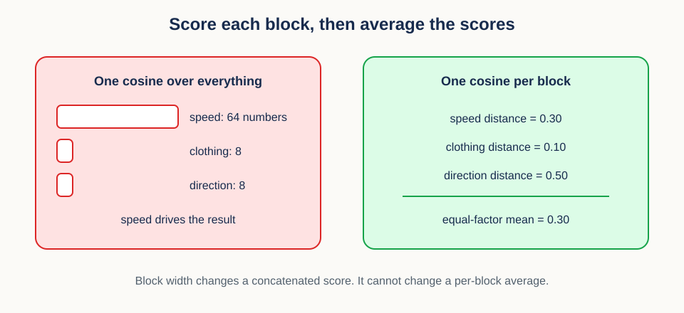
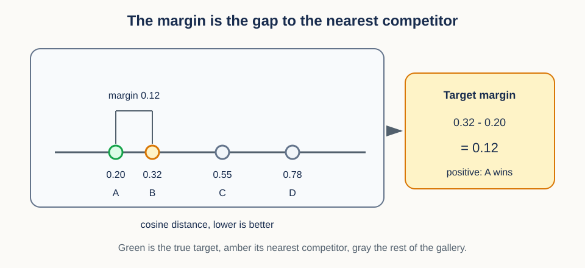
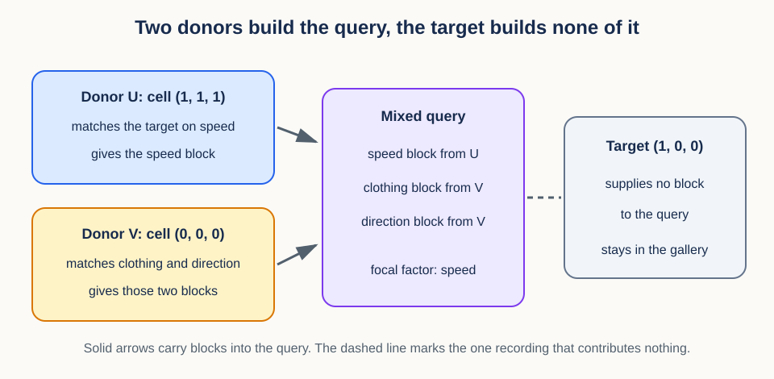

# 12. Blockwise distances and ranking


## Prerequisites

You should understand vectors, dot products, norms, averages, and factorial cells. Review
[11. Factorial state spaces](11_factorial_state_spaces.md) if factor subsets or cells are
unfamiliar.

## Learning goals

By the end of this lesson, you will be able to:

1. explain retrieval as a query-to-gallery comparison;
2. compute cosine similarity and cosine distance safely;
3. aggregate unequal blocks without silently changing factor weights;
4. rank candidates while preserving ties;
5. compute fractional top-1 credit, average tied rank, and mean reciprocal rank; and
6. vectorize large batches of comparisons.

## 1. Motivating scenario: finding a person in a gallery

Here is the whole lesson in one sentence: a retrieval score is only as meaningful as the
geometry, the weighting, and the tie rule you declared before computing it. Everything
below fills in those three choices.

Start with the concrete task. A model converts one probe video into a 128-number vector. A
gallery contains one or more vectors for every enrolled identity. We ask which gallery
identity is geometrically closest to the probe.

That sounds like sorting numbers, but three design choices come first. Does vector
magnitude matter? Are there several measurements for appearance and only one for motion?
What happens when two candidates have the same distance? A ranking metric means nothing
until those questions have explicit answers, and each one gets its own section below.

A report card is the mental model to carry through the lesson. Each factor block gives a
candidate one score. We average within each subject area, then decide how much each
subject area counts. Only after producing one final score per candidate do we rank the
gallery. The next section names the pieces of that picture.

## 2. Vocabulary and shapes

Before any formula, fix the words and the array shapes, because most retrieval bugs are
shape bugs wearing a statistical disguise.

A **query** or **probe** is the item being identified. The **gallery** is the set of
candidates. An **embedding** is a vector produced by a representation model. A
**distance** is a numeric dissimilarity, so smaller values are better. A **rank** records
where the correct candidate appears after sorting.

Let one query embedding be $q$ with shape `(D,)`, where $D$ is the feature width, that is,
the number of numbers in one embedding. Let the gallery matrix $G$ have shape `(M, D)`,
where $M$ is the number of candidate embeddings. Row $g_m$ is candidate $m$.

For a batch of $P$ queries, store them in $Q$ with shape `(P, D)`. A full pairwise
distance matrix has shape `(P, M)`. Entry `(p, m)` compares query $p$ with gallery row
$m$. Naming these axes out loud prevents the most common mistake in retrieval code:
sorting across queries instead of across gallery candidates.

## 3. Dot products, norms, and angles

With the shapes fixed, we can choose a geometry. The choice comes down to one question:
should the length of an embedding count, or only its direction? Cosine geometry answers
"only direction," and this section builds it from the dot product.

For vectors $q$ and $g$ of width $D$, the dot product is

$$
q^Tg=\sum_{j=1}^{D}q_jg_j.
$$

The symbol $j$ indexes a feature coordinate, so the sum runs over all $D$ coordinates. The
dot product is large when coordinates with large magnitudes point in similar signed
directions.

The dot product alone still mixes direction with length, so we need a measure of length.
The Euclidean norm is

$$
\lVert q\rVert_2=\sqrt{\sum_{j=1}^{D}q_j^2}.
$$

The norm measures how long the vector is. If length is an unwanted confidence or exposure
effect, divide it out. Doing exactly that gives cosine similarity:

$$
s_{\cos}(q,g)=\frac{q^Tg}{\lVert q\rVert_2\lVert g\rVert_2}.
$$

The numerator measures alignment and the denominator divides by both lengths. For nonzero
vectors, the result lies between -1 and 1. A value near 1 means similar direction, 0 means
roughly perpendicular, and -1 means opposite direction.

Retrieval wants smaller to be better, so flip the sign. Cosine distance is usually defined
as

$$
d_{\cos}(q,g)=1-s_{\cos}(q,g).
$$

Identical directions now have distance 0, perpendicular directions have distance 1, and
opposite directions have distance 2. That fixed 0 to 2 scale will matter later when we
pick a tie tolerance.

### Worked vector example

Two-dimensional vectors are enough to check the definitions by hand. Let $q=(3,4)$ and
$g=(6,8)$. Their dot product is 50. Their norms are 5 and 10, so cosine similarity is
$50/(5\times10)=1$ and cosine distance is 0. The vectors have different lengths but
exactly the same direction, and cosine ignores the length.

Now take $h=(-4,3)$. Its dot product with $q$ is $3\times(-4)+4\times3=0$. Both norms are
5, so cosine similarity is 0 and distance is 1. The two vectors are perpendicular.

### Cosine distance versus Euclidean distance

Cosine is not the only option, and the alternative behaves differently in a way worth
seeing once. Euclidean distance is

$$
d_2(q,g)=\lVert q-g\rVert_2.
$$

It measures the straight-line separation between vector endpoints, so it responds to both
direction and magnitude. Cosine distance responds only to direction. Neither choice is
universally superior. The representation training objective and the meaning of vector norm
should guide the metric.

One small example separates them. Consider query `(1, 0)` and candidates `(10, 0)` and
`(0.9, 0.1)`. Cosine distance prefers `(10, 0)` because it has exactly the same direction.
Euclidean distance strongly prefers `(0.9, 0.1)` because its endpoint is nearby. If norm
encodes confidence or signal strength that should matter, cosine may discard useful
information. If norm mostly reflects exposure or arbitrary scale, Euclidean distance may
be misleading.

The two metrics do agree in one important case. For unit-normalized vectors, squared
Euclidean distance and cosine distance are directly related:

$$
\lVert \widetilde q-\widetilde g\rVert_2^2=2-2\widetilde q^T\widetilde g
=2d_{\cos}(q,g).
$$

The tildes denote unit vectors, meaning vectors already divided by their own norm. Because
the relationship is increasing, cosine ranking and Euclidean ranking of unit vectors are
identical. That equivalence is a useful implementation check: if your two code paths
disagree on unit vectors, one of them has a bug.

## 4. Pairwise matrix computation

The definitions above compare one pair at a time. Real evaluations compare thousands of
pairs, and the trick is to normalize once and then let one matrix product do all the work.

Normalize every row of $Q$ and $G$ a single time:

$$
\widetilde q_p=\frac{q_p}{\lVert q_p\rVert_2},\qquad
\widetilde g_m=\frac{g_m}{\lVert g_m\rVert_2}.
$$

The tildes again mark unit-length rows, now indexed by query $p$ and gallery row $m$. All
pairwise similarities are then one matrix product:

$$
S=\widetilde Q\widetilde G^T.
$$

$S$ has shape `(P, M)`. The distance matrix is $D=1-S$, with the same shape.

```python
import numpy as np

def normalize_rows(x, minimum_norm=1e-12):
    norms = np.linalg.norm(x, axis=1, keepdims=True)
    if np.any(norms <= minimum_norm):
        raise ValueError("cosine geometry requires nonzero, well-scaled rows")
    return x / norms

q_unit = normalize_rows(queries)
g_unit = normalize_rows(gallery)
distances = 1.0 - q_unit @ g_unit.T
```

Matrix multiplication uses optimized linear algebra and never builds a `(P, M, D)` tensor.
That saves a large amount of memory when both query and gallery sets are large.

## 5. Zero vectors and numerical policy

The helper above raises an error instead of returning a number, and that refusal is a
scientific decision rather than defensive programming. Cosine similarity is undefined when
either norm is zero, so the helper rejects zero and near-zero rows rather than silently
assigning them an angle. The `minimum_norm` threshold is a declared data-quality policy in
the embedding's numeric scale. It is not part of the cosine definition.

Some systems instead map a zero vector to similarity 0 with every candidate by clamping
the denominator. That computational convention may be convenient, but it is not a
geometric angle, and it must not be mixed with a protocol that rejects undefined
comparisons. Count rejected embeddings as a diagnostic. A large count can indicate
collapse, a missing-data path, or aggressive masking.

Rounding needs a policy too, and a gentler one. Floating-point roundoff may produce
similarities such as `1.0000001`. Clipping values to `[-1, 1]` before converting to
distance is reasonable after verifying that the excess is tiny. Large violations point to
a bug or to nonfinite input, not to rounding.

### Conceptual checkpoint

If all embeddings are multiplied by 100, cosine rankings do not change, because every norm
grows by the same factor and cancels. Euclidean distance rankings usually do change,
because magnitude contributes directly.

## 6. Why blockwise aggregation is needed

Geometry settled, we turn to weighting. The danger here is subtle: a plain average silently
lets the factor with the most measurements decide the score.

Assume each candidate receives distances from two factors. Appearance contributes three
measurements, while motion contributes one. A raw mean across all four measurements gives
appearance 75 percent of the score simply because it has more rows. Nobody chose that
weighting; the data layout chose it.

Two-stage averaging fixes it. Let factor block $f$ contain $n_f$ distances
$d_{f1},\ldots,d_{fn_f}$, where $n_f$ is the number of valid measurements in factor $f$.
Its block mean is

$$
\bar d_f=\frac{1}{n_f}\sum_{j=1}^{n_f}d_{fj}.
$$

The bar means an average taken inside that block. To give $F$ factors equal influence,
average the block means:

$$
d_{\mathrm{equal}}=\frac{1}{F}\sum_{f=1}^{F}\bar d_f.
$$

The first average removes block-size imbalance. The second assigns equal factor weight.
The figure below runs the two stages on small numbers.


In the figure, appearance distances 0.2, 0.4, and 0.6 average to 0.4. Motion has distance
0.8. Equal-factor aggregation gives $(0.4+0.8)/2=0.6$. A raw measurement mean would give
$(0.2+0.4+0.6+0.8)/4=0.5$. Neither number is wrong arithmetic; they answer different
weighting questions, and only one of them was chosen on purpose.

Equal weighting is not automatically correct either. If factors have scientifically
justified weights $w_f$ that sum to 1, use

$$
d_{\mathrm{weighted}}=\sum_{f=1}^{F}w_f\bar d_f.
$$

The weights should come from the evaluation design, not from accidental sample counts.

### Concatenating blocks is not equal weighting

A tempting shortcut is to glue all the block coordinates into one long vector and take a
single cosine. That shortcut quietly reintroduces the problem this section just solved,
because a wide block contributes more coordinates to the dot product than a narrow one.



The figure contrasts the two routes on a 64-number speed block and two 8-number blocks.
Concatenated, speed supplies 64 of the 80 coordinates and dominates the single cosine.
Scored separately, speed contributes one number out of three. In GFC-v2 the second route
is the protocol: compute one cosine distance per factor, then average the three values.
Normalize each block before comparing it, so that a block with a larger numeric scale does
not borrow influence from a block with a smaller one.

### Average distances, or average embeddings first?

There is one more ordering choice hiding in the pipeline, and it changes answers. Averaging
distances summarizes how several comparisons performed. Averaging embeddings first builds
one prototype and then makes one comparison. Because normalization and distance are
nonlinear, the two results generally differ.

An extreme case makes the difference visible. Suppose two unit gallery embeddings for one
factor point in opposite directions. Their mean is the zero vector, whose cosine direction
is undefined. Their two individual cosine distances remain perfectly well defined.
Conversely, averaging several noisy embeddings can produce a useful centroid when a
prototype is the intended gallery representation.

So declare the order of operations and keep it: normalize rows, construct prototypes if
desired, compute distances, average within blocks, and average across blocks. Changing this
order can change rankings even when every array shape still matches, which is why shape
tests alone will not catch the error.

## 7. Missing blocks and denominators

Equal-factor averaging assumed every factor was present. Real candidates sometimes have no
measurement at all for one factor, and then the block mean does not exist.

Three policies are common: reject the comparison, impute under a documented rule, or
average only the available blocks and report coverage. For the available-block policy, let
$a_f$ equal 1 when block $f$ is available and 0 otherwise. Then

$$
d=\frac{\sum_f a_f\bar d_f}{\sum_f a_f}.
$$

The denominator is simply the number of available factors. This formula must not be used
when that denominator is zero. More importantly, candidates with different available
factors may no longer be directly comparable, so report and audit the pattern of missing
blocks rather than only the final numbers.

The displayed formula is specifically the equal-available-factor policy. If predeclared
factor weights $w_f$ are unequal, renormalize the weights of the available factors instead:

$$
d=\frac{\sum_f a_fw_f\bar d_f}{\sum_f a_fw_f}.
$$

This preserves relative weights among the observed blocks, but it still changes the set of
factors represented in each candidate's score. Rejecting incomplete candidates is often
cleaner when common-factor comparison is part of the estimand.

## 8. From scores to gallery ranking

Each candidate now has one number. Ranking is what turns those numbers into a claim about
retrieval success.

For one query, let final candidate distances be $d_1,\ldots,d_M$. Sorting from smallest to
largest yields the ranking. If the correct identity has the smallest distance, top-1
retrieval succeeds.

```python
order = np.argsort(candidate_distances, kind="stable")
ranked_identity = gallery_identity[order]
```

A stable sort preserves input order for exactly equal values. That makes the output
repeatable, which is good, but input order should never decide scientific credit. Ties
need a rule of their own, and that is the next section.

## 9. Ties are sets of equally good candidates

The central idea is short: a tie is a set of candidates, not an ordering of them. Treat it
that way and the metrics follow.

Exact floating-point equality is usually too strict to detect that set. This tutorial uses
one predeclared absolute tolerance $t\geq0$, measured in the same units as distance.
Distance $a$ is tied to reference distance $b$ when

$$
|a-b|\leq t.
$$

Choose $t$ before examining which system benefits from it. Distances derived from exact
counts may use $t=0$; computed floating-point distances may need a small justified value. A
single absolute rule is easy to audit precisely because cosine distance always lives on the
fixed scale from 0 to 2.

One property of approximate equality deserves care. It need not be transitive: $a$ can be
close to $b$ and $b$ close to $c$ without $a$ being close to $c$. So never build a tie set
by chaining neighboring sorted values. Define every tie set against one fixed reference,
such as the exact minimum for top-1 or the correct identity's distance for average tied
rank.

### Fractional top-1 credit

The first tie-aware metric splits first place. Let $d_{\min}=\min_m d_m$ be the exact
minimum and define the minimum tie set $T_1=\{m:|d_m-d_{\min}|\leq t\}$. If exactly one
member of that set is the correct identity, fractional top-1 credit is

$$
c_{\mathrm{top1}}=\frac{1}{|T_1|}.
$$

Here $|T_1|$ is the number of candidates in the tie set. A unique correct minimum receives
1. A two-way tie receives $1/2$. If the correct identity is absent from the minimum tie
set, credit is 0. This value equals the expected success of breaking the tie uniformly at
random, which is why it is a fair score rather than a fudge.


Ties also interact with gallery composition. If a gallery has repeated rows for one
identity, decide whether ranking is over rows or over unique identities. Identity retrieval
should usually apply a predeclared reduction to all rows of each identity first, producing
one score per identity, and then form tie sets over those identity scores.

Two identity-level reductions are common, and they ask different questions. The minimum row
distance asks whether any gallery example is a good match. A mean or centroid distance asks
whether the identity is consistently close. Minimum reduction can favor identities with
many gallery rows, because more rows mean more chances for an accidental close match.
Balance gallery counts or use a predeclared identity-level summary.

## 10. Average tied rank and reciprocal rank

Fractional top-1 only looks at first place. When the correct identity is further down, we
still want graded credit, and we still want ties handled as sets.

Ordinary row rank can penalize a candidate because arbitrary members of its own tie happen
to appear before it in the array. The study instead assigns every member of a tie the
average of the positions that the tie occupies.

For the correct identity's distance $d_{\ast}$, let $a_{\ast}$ be the number of candidates
strictly closer than the lower edge of the target's tolerance band, and let $t_{\ast}$ be
the number tied to the target reference:

$$
a_{\ast}=\sum_{m=1}^{M}\mathbf{1}[d_m<d_{\ast}-t],
\qquad
t_{\ast}=\sum_{m=1}^{M}\mathbf{1}[|d_m-d_{\ast}|\leq t].
$$

The symbol $\mathbf{1}[\cdot]$ is an indicator that counts 1 when its condition holds and 0
otherwise. Those tied candidates occupy positions $a_{\ast}+1$ through $a_{\ast}+t_{\ast}$,
so their average tied rank is

$$
r_{\ast}=a_{\ast}+\frac{t_{\ast}+1}{2}.
$$

A unique best target has rank 1. A target in a two-way first-place tie has rank 1.5, not
rank 1. Reciprocal rank is $1/r_{\ast}$, and the mean reciprocal rank over $P$ queries is

$$
\mathrm{MRR}=\frac{1}{P}\sum_{p=1}^{P}\frac{1}{r_p}.
$$

Here $r_p$ is the correct average tied rank for query $p$. MRR rewards moving the correct
identity near the top and gives progressively less credit at deeper ranks.

## 11. Worked gallery example

Numbers make the two metrics separate cleanly. One probe has final identity distances:

- identity A, the correct identity: 0.20;
- identity B: 0.20;
- identity C: 0.35;
- identity D: 0.50.

The minimum tie set is `{A, B}`, so fractional top-1 credit is $1/2$. The tie occupies
positions 1 and 2, so its average rank is 1.5 and reciprocal-rank credit is $2/3$. The two
numbers differ because one measures first-place selection while the other gives graded
credit to the target's average gallery position.

Now change A's distance to 0.35. Identity B is strictly better, and A ties C. That tie
occupies positions 2 and 3, so A has average rank 2.5 and reciprocal rank 0.4. If two
candidates had distance 0.20, the A-C tie would occupy positions 3 and 4 and have average
rank 3.5.

### The margin behind the score

Rank and credit are discrete, so they hide how close the decision was. The **target
margin** recovers that information. For a query $q$, let $g^+_q$ be the true target and
$g^-_q$ be the nearest non-target competitor in that query's gallery. The margin is

$$
m(q)=d(q,g^-_q)-d(q,g^+_q).
$$

Both terms are the final aggregated distances from Section 6, so the margin inherits the
same geometry, block weighting, and normalization policy.



In the figure the target sits at 0.20 and the nearest wrong candidate at 0.32, so
$m(q)=0.32-0.20=0.12$. A positive margin means top-1 succeeded. A margin of exactly zero is
the tie case of the previous section, and a negative margin means the target lost. Two
systems can both score top-1 credit 1 while one wins by 0.12 and the other by 0.002, so the
margin is the natural continuous companion to a discrete rank. The hierarchical-diversity
study uses exactly this continuous target margin as its primary GFC score, with top-1 and
MRR as directional checks on it.

## 12. End-to-end synthetic GFC-v2 retrieval

We can now assemble the whole chain, from building a query to reporting a metric, in the
form GFC-v2 actually uses.

One complete participant supplies eight gallery recordings indexed by speed, clothing, and
direction. All eight stay in the gallery for every query, including both donors. Each
recording carries one factor block per factor and an independent source lineage identifier.

The query itself is a mixture, and that is the part worth seeing before the code.



Read the figure with the target cell $(1,0,0)$ in mind and speed as the focal factor. Donor
U is cell $(1,1,1)$: it agrees with the target on speed and disagrees on everything else,
so it supplies the speed block. Donor V is cell $(0,0,0)$: it agrees on clothing and
direction, so it supplies those two blocks. Every block therefore comes from the donor that
matches the target on exactly that factor, the assembled query describes the target cell,
and the target itself contributes nothing.

The synthetic oracle below intentionally recovers clothing and direction but not speed.
Both speed levels map to the same unit vector, so speed carries no discriminating
information. The other factor levels map to orthogonal unit vectors.

```python
from itertools import product

factor_names = ("speed", "clothing", "direction")
cells = list(product([0, 1], repeat=3))
unit = {0: np.array([1.0, 0.0]), 1: np.array([0.0, 1.0])}
recordings = {}
for cell in cells:
    recordings[cell] = {
        "source_video_id": f"source-{cell[0]}-{cell[1]}",
        "blocks": {
            "speed": np.array([1.0, 0.0]),
            "clothing": unit[cell[1]],
            "direction": unit[cell[2]],
        },
    }

def donors(target, focal_index):
    donor_u = tuple(value if j == focal_index else 1 - value
                    for j, value in enumerate(target))
    donor_v = tuple(1 - value if j == focal_index else value
                    for j, value in enumerate(target))
    return donor_u, donor_v

def require_source_separation(target, donor_u, donor_v):
    target_source = recordings[target]["source_video_id"]
    if any(recordings[donor]["source_video_id"] == target_source
           for donor in (donor_u, donor_v)):
        raise ValueError("donor and target source_video_id must differ")

def cosine_distance(q, g):
    denominator = np.linalg.norm(q) * np.linalg.norm(g)
    if denominator <= 1e-12:
        raise ValueError("cosine distance requires nonzero blocks")
    return 1.0 - np.clip(np.dot(q, g) / denominator, -1.0, 1.0)

def one_query(target, focal_index, tolerance=1e-12):
    donor_u, donor_v = donors(target, focal_index)
    require_source_separation(target, donor_u, donor_v)

    query_blocks = {}
    for j, name in enumerate(factor_names):
        source_cell = donor_u if j == focal_index else donor_v
        query_blocks[name] = recordings[source_cell]["blocks"][name]

    distances = []
    for candidate in cells:  # donors are retained here
        block_distances = []
        for name in factor_names:
            q = query_blocks[name]
            g = recordings[candidate]["blocks"][name]
            block_distances.append(cosine_distance(q, g))
        distances.append(np.mean(block_distances))
    distances = np.asarray(distances)
    target_index = cells.index(target)
    top1 = fractional_top1(distances, target_index, atol=tolerance)
    rank = average_tied_rank(distances, target_index, atol=tolerance)
    return top1, rank, donor_u, donor_v

results = [one_query(target, focal_index)
           for target in cells for focal_index in (0, 1)]
top1 = np.mean([result[0] for result in results])
mrr = np.mean([1.0 / result[1] for result in results])
assert len(results) == 16
assert top1 == 0.5
assert np.isclose(mrr, 2.0 / 3.0)

direction_rejections = 0
for target in cells:
    try:
        require_source_separation(target, *donors(target, 2))
    except ValueError:
        direction_rejections += 1
assert direction_rejections == 8
```

Trace the asserted numbers back to the rules. Each candidate's score is exactly the equal
mean of the speed, clothing, and direction cosine distances. Because speed carries no
information, the target always ties with the cell that differs only in speed, so every
query receives fractional top-1 $1/2$. That two-way top tie occupies positions 1 and 2, so
its average rank is 1.5 and MRR is $2/3$. This is the same two-recovered-factor top-1
oracle derived in Lesson 11. The executable notebook repeats the evaluator with zero, one,
two, and three recovered factors and checks the top-1 values $1/8$, $1/4$, $1/2$, and 1.

The code also makes four protocol details visible, and each is a choice rather than an
implementation detail. The target contributes no query block. Both donor source IDs differ
from the target source ID. The gallery keeps both donors instead of removing them. One
fixed absolute tolerance controls both fractional top-1 and average tied rank. Change any
of these and you have changed the evaluator, not merely its code.

## 13. Efficiency notes and implementation patterns

The rules above are settled, so the remaining question is how to apply them at scale
without breaking any of them.

Normalize embeddings once, not once per pair, and use a matrix product for all cosine
scores. For factor blocks, store a block-to-measurement mapping and use vectorized
segmented sums such as `np.add.at`, `np.bincount`, or PyTorch `scatter_add_` instead of
Python loops.

Selection shortcuts need extra care around ties. If only the top $k$ candidates are
required, `np.argpartition` can avoid a full sort. It does not order the selected subset,
and it can cut straight through a tie, so expand the result to include every candidate tied
at the boundary before reporting any tie-aware metric.

The same caution applies to chunking and sharding. For very large galleries, process
gallery chunks and maintain the best distances so far. Exact global ties still require
retaining every candidate within tolerance of the current boundary. When scores are
distributed across machines, keeping only one local winner loses cross-shard ties. Each
shard should return its minimum and every identity within tolerance of that minimum, after
which a global step forms the final tie set.

## 14. Misconceptions and failure modes

Each item below is a shortcut that looks harmless and quietly changes what the metric
measures.

1. **"More measurements deserve more weight."** True only if the estimand is a
   measurement-weighted score. Equal-factor evaluation needs two-stage averaging.
2. **"Stable sort solves ties."** It only makes an arbitrary input-order rule repeatable.
3. **"Cosine is always defined."** Zero vectors have no direction.
4. **"MRR and top-1 are interchangeable."** They reward different ranking behavior.
5. **"Repeated gallery rows are independent identities."** Collapse rows when the task is
   identity retrieval.
6. **"Any tiny difference is meaningful."** Floating-point comparisons need a tolerance
   tied to numeric precision and metric scale.
7. **"Donors should be removed from the gallery."** GFC-v2 ranks all eight recordings.
8. **"Concatenating blocks is automatically equal weighting."** Unequal block widths can
   change the score. Compute one cosine distance per factor and average the three values.
9. **"A different filename proves source separation."** Validate source lineage IDs.

## Exercises

### Exercise 1

Compute cosine distance between `(1, 1)` and `(1, 0)`.

**Brief solution:** similarity is $1/\sqrt{2}$, so distance is
$1-1/\sqrt{2}\approx0.293$.

### Exercise 2

Block A has distances `[0.1, 0.2, 0.3, 0.4]`; block B has `[0.8]`. Compare the raw mean
with the equal-block mean.

**Brief solution:** raw mean is 0.36. Block means are 0.25 and 0.8, so equal-block distance
is 0.525.

### Exercise 3

The correct identity is in a four-way minimum tie. What are fractional top-1 credit and
average tied rank?

**Brief solution:** fractional credit is $1/4$ and average tied rank is 2.5.

### Exercise 4

Why can `argpartition` give an incomplete top $k$ result under ties?

**Brief solution:** it may select only some items equal to the boundary distance. A
tie-aware result must include all boundary ties.

### Exercise 5

In the synthetic GFC-v2 oracle, change the speed vectors to two orthogonal directions.
What should happen to top-1 and MRR?

**Brief solution:** all three factors are now recovered. The target becomes the unique
minimum for every query, so both mean fractional top-1 and MRR equal 1.

### Exercise 6

A target sits at distance 0.41 and the nearest competitor at 0.40. Give the top-1 credit
and the margin, and say what the margin adds.

**Brief solution:** top-1 credit is 0 and the margin is $-0.01$. The credit says only that
the target lost; the margin says it lost by an amount smaller than most rounding you would
tolerate elsewhere in the pipeline.

## Recap

Retrieval begins with a declared geometry and weighting policy. Cosine distance compares
direction after handling zero norms. Blockwise aggregation separates within-factor
averaging from across-factor weighting, and per-block scoring keeps block width from
becoming a hidden weight. Ranking must treat ties as sets, and fractional top-1, average
tied rank, and MRR express distinct forms of retrieval success, with the margin recording
how close the decision was. GFC-v2 applies all of these rules to three donor-supplied
factor blocks while keeping the complete gallery and enforcing source separation.

## Continue

- Previous: [11. Factorial state spaces](11_factorial_state_spaces.md)
- Notebook: [12. Blockwise distances and ranking](../implementations/12_blockwise_distances_and_ranking.ipynb)
- Next: [13. Context interventions and identity geometry](13_context_interventions.md)
- Curriculum: [Tutorial README](../README.md)
