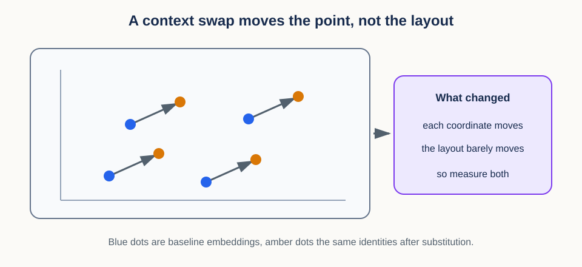
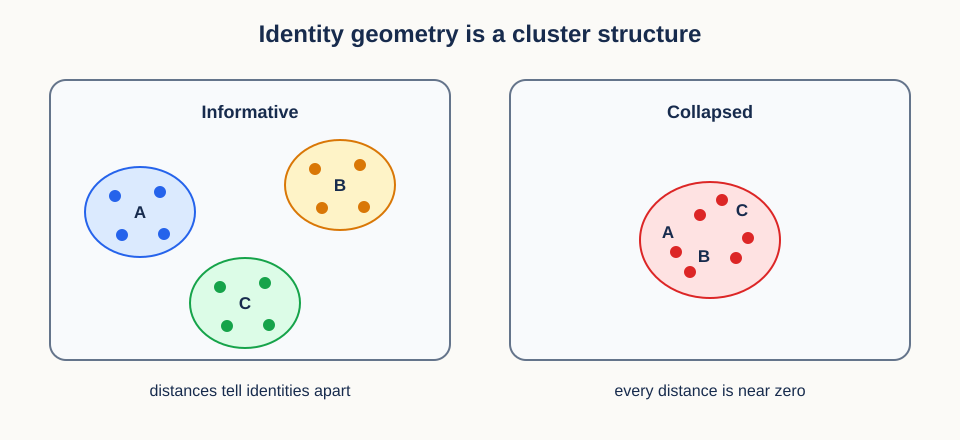
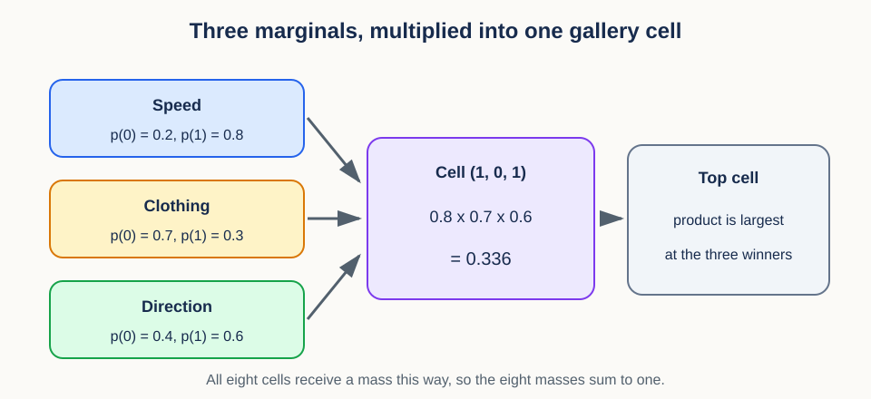

# 13. Context interventions and identity geometry


## Prerequisites

You should understand embeddings, cosine distance, averages, and train-test separation.
Review [12. Blockwise distances and ranking](12_blockwise_distances_and_ranking.md) for
retrieval geometry.

## Learning goals

By the end of this lesson, you will be able to:

1. define a controlled context substitution;
2. compute an interpretable normalized loss contrast;
3. compare representation geometry before and after an intervention;
4. build nearest-centroid and cosine-retrieval evaluations;
5. separate enrollment samples from probes;
6. distinguish hard and soft factor completion; and
7. implement the study's independent-factor completion control; and
8. audit construct validity rather than equating invariance with usefulness.

## 1. Motivating scenario: identity under a changing background

Lesson 12 measured how close two things are. This lesson asks a harder question: when the
number changes, what caused the change? A context intervention is the design that lets you
answer it.

Take a concrete case. A representation should preserve a person's identity when lighting
changes. A probe filmed in daylight is easy to identify, while the same person filmed in
darkness is harder. Did the representation lose identity information, or did the entire
dataset change in several uncontrolled ways at once?

A context intervention isolates the question. Keep identity content fixed as far as the
design allows, replace one context with another, and compare the matched outcomes. The
mental model is a controlled swap: change the background card while keeping the main
subject card in place.

The word **intervention** deserves care, because it carries a causal promise. A synthetic
substitution is not automatically a causal experiment. It supports a causal interpretation
only if the replacement changes the intended context, preserves relevant identity content,
and does not introduce new artifacts. Sections 3 and 11 turn that sentence into checks you
can actually run.

## 2. Vocabulary and data shapes

As in Lesson 12, name the objects and the shapes before writing any formula. Here the shape
that matters is the pairing itself.

An **identity factor** names the property we want to preserve. A **context factor** names a
condition that may vary, such as view, lighting, or device. A **baseline** is the original
condition. An **intervention** is the deliberately substituted condition.

Let $i$ index paired examples from 1 through $N$, where $N$ is the number of matched pairs.
Let $x_i^{(b)}$ be the baseline input and $x_i^{(v)}$ its intervened counterpart. The
superscripts $b$ and $v$ mean baseline and intervention. Both inputs should describe the
same identity.

An encoder $f$ maps each input to an embedding of width $D$, that is, a vector of $D$
numbers:

$$
z_i^{(b)}=f(x_i^{(b)}),\qquad z_i^{(v)}=f(x_i^{(v)}).
$$

Stacked baseline and intervention embeddings each have shape `(N, D)`. Row $i$ across the
two matrices is a matched pair, and that row correspondence is the entire experiment. If
the rows are shuffled independently, the comparison becomes meaningless even though both
arrays still have the same shape and every downstream function still runs.

## 3. Designing a context substitution

Row correspondence is necessary but not sufficient. The substitution that produced the
second row has to be trustworthy, and that is a design question rather than a coding one.

A valid substitution records what is held fixed, what is changed, and what may change as a
side effect. For a video, identity, action, and time alignment might be held fixed while
lighting is changed. Compression and image sharpness should not change unintentionally.

Useful controls include:

- a **negative control** substitution expected to leave the representation unchanged;
- a **positive control** known to alter context-sensitive features;
- a reconstruction or human check that identity content remains recognizable; and
- metadata confirming that the intended factor actually changed.


The figure shows the paired design at its simplest: one identity, two contexts, one
contrast. The design is powerful because each identity serves as its own reference. It does
not remove every confound. A substitution model might leave a watermark, alter texture, or
change pose, and each of those becomes an alternative explanation for the measured
contrast.

### Three checks before calling a substitution valid

Those alternative explanations are why a substitution needs manipulation checks before any
result is interpreted. First, verify **treatment strength**: did the intended context
actually change enough to matter? A lighting classifier or measured luminance can serve as
the check. Second, verify **content preservation**: can humans or an independent identity
model still recognize the same person? Third, verify **artifact specificity**: can a
detector distinguish real from substituted examples using a watermark, border, or
compression cue?

The three checks cover three different failure modes, which is why one of them is not
enough. A weak substitution produces a small contrast because nothing really changed. A
destructive substitution produces a large contrast because identity was damaged. A
substitution artifact produces a large contrast that has nothing to do with the named
context. Recording all three makes the interpretation far more constrained.

### Conceptual checkpoint

Comparing random daylight people with different nighttime people is not a context
intervention. Identity and context both change, so their effects cannot be separated by any
later analysis.

## 4. Raw and normalized loss contrasts

With a trustworthy substitution in hand, we can finally measure something. The first
measurement is the simplest: how much did the task loss move?

Let $L_i^{(b)}$ be a nonnegative baseline loss and $L_i^{(v)}$ the matched intervention
loss for pair $i$. The raw change is

$$
\Delta_i=L_i^{(v)}-L_i^{(b)}.
$$

A positive $\Delta_i$ means the intervention increased loss for that pair. The units are
the units of the loss, and that is exactly the problem: a raw change of 0.1 is large when
baseline loss is 0.05 and negligible when baseline loss is 10.

Dividing by the local scale fixes the comparison. A symmetric normalized contrast is

$$
c_i=\frac{L_i^{(v)}-L_i^{(b)}}{
\frac{1}{2}\left(|L_i^{(v)}|+|L_i^{(b)}|\right)+\epsilon}.
$$

The denominator is the mean absolute scale of the two losses. The small positive number
$\epsilon$ prevents division by zero. Swapping baseline and intervention flips the sign
without otherwise changing the magnitude, which is why the contrast is called symmetric.

For nonnegative losses and negligible $\epsilon$, the contrast lies between -2 and 2. A
value of 0 means no change, positive values mean degradation under intervention, and
negative values mean improvement.

### Worked loss example

If baseline loss is 0.30 and intervention loss is 0.45, the raw change is 0.15. Their mean
absolute scale is $(0.30+0.45)/2=0.375$, so the normalized contrast is $0.15/0.375=0.4$. If
both losses were ten times larger, the raw change would be 1.5 but the normalized contrast
would still be 0.4. That invariance is the point of the definition.

```python
import numpy as np

def symmetric_contrast(base, intervention, eps=1e-12):
    scale = (np.abs(base) + np.abs(intervention)) / 2.0
    return (intervention - base) / (scale + eps)
```

Invariance to scale is also the risk. Always report enough raw information to interpret a
normalized summary, because a stable contrast can hide the fact that both losses are
unacceptably high.

## 5. Geometry matching asks a different question

Loss says how the representation performed against a target. It says nothing about how the
examples sit relative to each other, and that relational structure is what downstream
retrieval actually uses. Geometry matching measures it directly.

The distinction has a concrete cause: two sets of embeddings may rotate together, leaving
every pairwise distance unchanged even though every individual coordinate differs. Loss
against a fixed target notices the rotation, and pairwise geometry does not.

For baseline embeddings, form a pairwise cosine-distance matrix $D^{(b)}$ with shape
`(N, N)`. Entry $(i,j)$ compares pair members $i$ and $j$ in the baseline condition:

$$
D_{ij}^{(b)}=1-\frac{(z_i^{(b)})^Tz_j^{(b)}}
{\lVert z_i^{(b)}\rVert_2\lVert z_j^{(b)}\rVert_2}.
$$

Every embedding in a compared pair must have nonzero norm. This lesson follows Lesson 12's
explicit policy: reject and report zero or predeclared near-zero rows rather than assigning
them an artificial cosine angle. Report rejection counts by condition, because an
intervention that creates zero vectors is itself an important result.

The intervention matrix $D^{(v)}$ is defined the same way. A simple summary of geometry
distortion is the mean absolute difference over unordered pairs:

$$
E_{\mathrm{geom}}=\frac{2}{N(N-1)}
\sum_{i<j}\left|D_{ij}^{(v)}-D_{ij}^{(b)}\right|.
$$

The condition $i<j$ makes each pair appear once and excludes the diagonal self-distances,
and $N(N-1)/2$ is the number of such pairs. An error of zero means all measured pairwise
cosine distances agree.



The figure shows why the two measurements can disagree so sharply. Each blue dot is a
baseline embedding and each amber dot is the same identity after substitution. Every point
moved, so a coordinate-based error is large. The points moved together, so the relative
layout, and therefore $E_{\mathrm{geom}}$, barely changed.

### Coordinate matching and geometry matching are not the same

Making that contrast explicit: a direct coordinate error would average
$\lVert z_i^{(v)}-z_i^{(b)}\rVert_2$ over pairs. It asks whether each embedding stayed at
the same coordinate. Geometry error asks whether pairwise relationships stayed the same. A
shared rotation produces large coordinate error and zero geometry error.

Which question is appropriate depends on downstream use. A frozen classifier expects
coordinates to remain aligned with its fixed weights, so a shared rotation can hurt it. A
newly fitted linear probe may adapt to the rotation and care more about preserved geometry.
Reporting both coordinate-sensitive task loss and relational geometry keeps these cases
separable.

A two-vector sanity check confirms the claim. Take baseline vectors `(1, 0)` and `(0, 1)`.
Rotate both by 90 degrees to obtain `(0, 1)` and `(-1, 0)`. Every individual vector
changed, but their cosine similarity is 0 before and after. Pairwise geometry is unchanged
even though coordinates are not.

### What geometry matching does not prove

Geometry stability has one dangerous failure case, and it is the reason this lesson never
stops at a single number. A constant nonzero embedding gives identical pairwise distances
before and after a context change, yet it contains no identity information at all. A zero
embedding does not even have a defined cosine direction. Geometry stability must always be
paired with an informativeness test, which is what the next section supplies.

For large $N$, the full matrices require $N^2$ entries. Sample a fixed, predeclared set of
pairs or process the matrix in blocks when full quadratic storage is too expensive.

## 6. Nearest-centroid identity evaluation

The informativeness test needs to answer one question: can identity still be read out of
the representation? Nearest-centroid classification is the simplest honest way to ask.

Use enrollment embeddings for identity $k$ to form a reference centroid:

$$
\mu_k=\frac{1}{n_k}\sum_{i:y_i=k}z_i.
$$

Here $y_i$ is the identity label of example $i$, $n_k$ is the number of enrollment samples
for identity $k$, and $\mu_k$ has shape `(D,)`. The centroid is just the average location
of that identity.

For Euclidean geometry, assign a probe $z$ to the centroid with smallest squared distance:

$$
\widehat y=\mathrm{argmin}_k\lVert z-\mu_k\rVert_2^2.
$$

The symbol $\widehat y$ is the predicted identity. The choice of Euclidean or cosine
geometry should match the representation and the retrieval protocol, not be picked per
figure.

Cosine centroids need one extra step in a specific order. First normalize each enrollment
embedding, then average the unit vectors within identity, then normalize each centroid
again. Skipping the first normalization lets high-norm enrollment rows pull the centroid
toward themselves.

Even done correctly, a cosine centroid can fail to exist. The mean of valid unit vectors
can be zero when directions cancel exactly, or nearly zero when they almost cancel, and
such a centroid has no stable direction. Reject that identity reference under a declared
minimum-norm rule or use a different predeclared prototype geometry. Do not silently divide
by epsilon and call the result a direction.



The figure is the picture behind the phrase "identity geometry." On the left each identity
occupies its own compact region, so a centroid summarizes it well and probes land near the
right one. On the right every identity shares one region: pairwise distances are perfectly
stable under any intervention, and centroid accuracy is at chance. Section 11 returns to
this pattern as the collapse signature.

## 7. Enrollment and probes must be separate

Centroids and retrieval both need reference data, and where that reference data comes from
decides whether the accuracy number means anything.

**Enrollment** data build identity references. **Probe** data test those references. A
probe must not help construct the centroid against which it is evaluated.


This separation matters even when no label leaks directly. Including a probe in its own
centroid pulls the reference toward that probe and makes classification easier by
construction. Nearby windows from the same source recording create a similar leak even when
their row identifiers differ.

The fix is to split at the independent source level, before producing windows or
augmentations. If the claim concerns new sessions, enrollment and probe sessions must be
disjoint. If it concerns new devices, device separation may also be necessary.

All derived versions of one source belong in the same partition. A baseline clip must not
build an enrollment centroid while a context-substituted version of that same clip serves
as a probe. They share identity content, timing, and source artifacts even though their
files and context labels differ.

Learned components carry the same obligation as data. Fit or tune any substitution model,
preprocessing transform, threshold, and prototype rule without probe outcomes. If a
substitution generator was trained on the evaluation identities or source clips, document
that exposure and narrow the claim. A held-out probe is not truly held out when an upstream
learned component has already adapted to it.

### Worked centroid example

Small numbers show the whole protocol. Identity A has unit enrollment vectors `(1, 0)` and
`(0.8, 0.6)`. Their mean is `(0.9, 0.3)`, which is then normalized. Identity B has
enrollment vectors near `(0, 1)`. A held-out probe `(0.95, 0.1)` has larger cosine
similarity with A's centroid, so it is assigned to A. The probe never entered either
centroid calculation, so the assignment is a real test.

## 8. Cosine retrieval complements centroids

A centroid compresses each identity to one vector, which is efficient but lossy. Direct
retrieval keeps every gallery example and therefore sees structure a centroid erases.

For a normalized probe matrix $P$ with shape $N_{\mathrm{probe}}\times D$ and a normalized
gallery matrix $G$ with shape $N_{\mathrm{gallery}}\times D$, the score matrix is

$$
S=PG^T.
$$

$S$ has shape $N_{\mathrm{probe}}\times N_{\mathrm{gallery}}$, and each probe row is ranked
across gallery columns exactly as in Lesson 12. Centroids reduce noise and storage, while
direct retrieval preserves multimodal identity structure. Reporting both can reveal when a
single centroid summarizes an identity badly, for example when one person appears in two
very different outfits.

## 9. Generic hard and soft expected-loss completion

The evaluations so far assumed every input was complete. Sometimes a query omits a context
factor, and we have to decide what to do about the missing value before scoring anything.

This section develops the general decision rule. It is useful well beyond this study, but
it is **not** the GFC-v2 independent-factor control. That control is defined in Section 10
and operates on products of factor probabilities over a complete gallery.

Suppose the missing context can be day or night, with conditional probabilities
$p_{\mathrm{day}}$ and $p_{\mathrm{night}}$ that sum to 1.

**Hard completion** chooses the single most probable context:

$$
c_{\mathrm{hard}}=\mathrm{argmax}_c p_c.
$$

This produces one completed query. It is simple, and it discards uncertainty.

**Soft completion** keeps every possible context instead. If the loss under completion $c$
is $L_c$, the expected loss is

$$
L_{\mathrm{soft}}=\sum_c p_cL_c.
$$

Every symbol has a direct meaning: $c$ indexes a completion, $p_c$ is its probability, and
$L_c$ is the loss that would result if that completion were true.

Those probabilities must come from information available at decision time. Estimate or
calibrate them on training or enrollment data, then freeze the rule before evaluating
probes. Using the probe's hidden factor, label, or outcome to choose $p_c$ turns soft
completion into evaluation leakage.

### Worked completion example

Day has probability 0.7 and loss 0.2. Night has probability 0.3 and loss 1.4. Hard
completion chooses day and reports 0.2. Soft completion reports
$0.7\times0.2+0.3\times1.4=0.56$. The rare but costly possibility is exactly what hard
completion threw away.

One tempting shortcut is wrong here. Do not average embeddings first and then compute a
nonlinear loss, because for a nonlinear loss $L$ the loss at the mean embedding need not
equal the mean loss:

$$
L\left(\sum_c p_cz_c\right)\neq\sum_c p_cL(z_c).
$$

When expected performance is the goal, evaluate each completion and then average the
losses.

## 10. The GFC-v2 independent-factor completion control

We now specialize completion into the study's actual control. Its job is to answer a
skeptic: could a model score well on GFC-v2 simply by predicting each factor separately,
with no recombination of donor-supplied blocks at all?

GFC-v2 asks whether donor-supplied factor blocks retrieve a target cell. The control asks
how well the same raw ridge score blocks do when the three factors are completed
independently. For each composed query, let $\ell_f(0)$ and $\ell_f(1)$ be the two raw
scores for factor $f\in\{s,c,d\}$, meaning speed, clothing, and direction. These scores
come from the same donor assignments as the GFC-v2 query, and the target still contributes
no features. Each complete participant therefore contributes the same 16 allowed target and
focal-factor queries to GFC-v2 and to this control, which is what makes the two directly
comparable.

Hard independent completion chooses each marginal winner:

$$
\widehat x_f=\mathop{\mathrm{argmax}}_{k\in\{0,1\}}\ell_f(k),
\qquad
\widehat x=(\widehat x_s,\widehat x_c,\widehat x_d).
$$

The hard control retrieves the gallery recording with tuple $\widehat x$. If a factor has a
tied maximum, divide its hard mass equally among the tied levels under the frozen score
tolerance. This keeps array order from becoming a scientific tie breaker, exactly as in
Lesson 12.

Soft independent completion keeps the uncertainty instead. It applies one positive
temperature $T$, fitted on held-out development data, to each factor block:

$$
p_f(k;T)=
\frac{\exp(\ell_f(k)/T)}
{\sum_{j=0}^{1}\exp(\ell_f(j)/T)}.
$$

It then assigns a complete gallery cell $x=(s,c,d)$ the product mass

$$
p(x;T)=p_s(s;T)p_c(c;T)p_d(d;T).
$$

That product is the independence assumption made concrete. It keeps marginal uncertainty,
and it deliberately does not model any dependence among speed, clothing, and direction.



The figure works one cell. Speed gives level 1 probability 0.8, clothing gives level 0
probability 0.7, and direction gives level 1 probability 0.6, so cell $(1,0,1)$ receives
$0.8\times0.7\times0.6=0.336$. All eight cells are scored the same way, and because each
factor's two probabilities sum to 1, the eight cell masses sum to 1 as well.

In code, compute this quantity in log space. For each factor, subtract the log-sum-exp of
its two scaled scores, then add the three selected log probabilities:

$$
\log p(x;T)=\sum_f\left[\frac{\ell_f(x_f)}{T}
-\log\sum_{k\in\{0,1\}}\exp\left(\frac{\ell_f(k)}{T}\right)\right].
$$

This is mathematically equal to multiplying the three probabilities, but it stays finite
for extreme scores that would underflow in ordinary probability space.

The two controls agree on their top choice, and that agreement is testable. In a complete
Cartesian gallery, the product is largest at the tuple of the three marginal maxima. A
positive temperature preserves each marginal ordering, so hard and soft top-1 coincide when
they use consistent tie handling. The evaluator should assert this invariant. If the
gallery is incomplete, the equivalence need not hold, because the tuple of marginal winners
may simply be absent from the gallery.

Consistent tie handling means more than choosing the first array entry. Hard completion
splits each tied factor's mass across its tied levels. The Cartesian products of those
levels form a tied set of completed cells. Soft completion at any positive temperature has
the same tied maximizing set. Both controls therefore give the target fractional top-1
equal to one divided by the size of that set whenever the target is present.

Equal top-1 does not make the two controls numerically identical. Soft completion also
supplies a target probability and a target negative log likelihood,

$$
\mathrm{NLL}(x^*)=-\sum_f\log p_f(x_f^*;T).
$$

Here $x^{\ast}$ is the true target cell. Changing $T$ changes that value and the confidence bins
used by calibration diagnostics, even though it does not change the top-ranked tuple.
Report soft NLL and reliability separately from the shared hard and soft top-1 control, or
a reader will assume temperature does not matter at all.

### What the completion gap can and cannot say

The two endpoints exist to be subtracted. Let $Y$ be participant-averaged GFC-v2 top-1 and
$C$ be participant-averaged independent-factor completion top-1 for the same model. The
completion gap is

$$
G=Y-C.
$$

Pairing the two scores holds participants, queries, and gallery composition constant, so
the difference is not contaminated by cohort differences. A resolved difference can show
that donor-based block geometry and independent marginal prediction behave differently at
this evaluation resolution.

The gap does not prove intrinsic compositionality, causal factor binding, or unsupervised
factor discovery. Both endpoints use supervised ridge alignment, so they can share errors,
and $C$ depends on the quality of the factor heads and on the frozen tie rule. The soft
control's probability and NLL also depend on its temperature fit. Top-1 is bounded, so
ceiling and floor effects can compress the gap. For all of those reasons, the study
compares the factorial interaction in $G$ across training conditions rather than reading
$G$ on its own, and even that interaction is an interpretation gate rather than a
stand-alone proof of a representation mechanism.

Write the completion gap for training condition $h\in\{L,H\}$ and replicate regime
$r\in\{F,R\}$ as $G_{h,r}$. The prespecified difference of completion-gap interactions is

$$
J=(G_{H,R}-G_{L,R})-(G_{H,F}-G_{L,F}).
$$

Use the practical margin $\delta_G=0.0625$, which is 6.25 percentage points of top-1. Call
$J$ resolved only when its 95% confidence interval excludes zero and its point estimate has
magnitude at least $\delta_G$. Call it practically equivalent when its 90% confidence
interval lies completely inside $[-\delta_G,\delta_G]$. All other results are inconclusive.
A resolved $J$ shows that the completion gap changed differently across the two training
conditions and replicate regimes at this evaluation resolution. It still does not prove a
representation mechanism, because $Y$ and $C$ share supervised maps, bounded scales, tie
rules, and possible ceiling effects. Lesson 14 develops the paired interval machinery those
sentences rely on.

## 11. Construct validity

Every measurement in this lesson can be computed correctly and still support the wrong
claim. Construct validity is the discipline that catches that.

**Construct validity** asks whether the measurement really captures the concept named in
the claim. Calling a representation "context invariant" is valid only if the intervention
changed context, identity remained present, and the metric responds to meaningful failures.

A strong evaluation therefore triangulates several outcomes:

1. intervention loss contrast measures task degradation;
2. pairwise geometry error measures relational distortion;
3. centroid accuracy checks identity decodability;
4. retrieval checks local identity matches; and
5. positive and negative controls check metric sensitivity.

Agreement among these outcomes is more convincing than any one number, and disagreement is
informative rather than annoying. Stable geometry with poor identity accuracy suggests
collapse. Good identity accuracy with a large loss contrast may reveal that the chosen loss
measures something beyond identity.

### A result matrix for interpretation

Three patterns show how the readings combine. In the first, context manipulation accuracy
rises, identity centroid accuracy stays high, pairwise geometry error stays low, and
normalized task loss remains near zero. Together these support context robustness.

In the second, manipulation accuracy rises, but identity accuracy falls to chance and
geometry error is large. Either the representation is context sensitive or the intervention
damaged identity, and the content-preservation control from Section 3 decides between those
explanations.

The third pattern is the deceptively reassuring one: geometry error is zero, task loss is
zero, and identity accuracy is at chance. That is the right panel of the cluster figure in
Section 6, and it is compatible with collapse. An invariance claim must always carry a
positive informativeness requirement alongside it.

## 12. Efficiency notes

The measurements above are quadratic in places, so a few implementation habits keep them
affordable without changing what they mean.

Normalize embedding rows once and reuse them, and let matrix multiplication compute all
cosine scores. Use `np.triu_indices(N, k=1)` to select one copy of every unordered pair
without the diagonal.

For large datasets, calculate geometry error in blocks or on a fixed random pair sample.
Store the pair indices and the random seed so that repeated systems are evaluated on
identical pairs, otherwise the comparison across systems inherits sampling noise. Compute
centroids with grouped sums rather than Python loops when the identity count is large.

## 13. Misconceptions and failure modes

Each entry below is a claim that sounds reasonable and quietly breaks one of the rules
above.

1. **"No embedding change means success."** A collapsed representation is unchanged too.
2. **"Synthetic substitution is automatically causal."** Artifacts and unintended changes
   can explain the result.
3. **"Normalized contrast replaces raw loss."** It supplies scale, not adequacy.
4. **"Probe-fitted centroids are harmless."** They leak evaluation information.
5. **"Soft completion means average embeddings."** Expected nonlinear loss must average
   losses after evaluating each completion.
6. **"One metric proves invariance."** Use controls and complementary measurements.
7. **"A tiny centroid is safe after epsilon clamping."** Direction is undefined or
   unstable, so reject it or use a predeclared non-cosine policy.
8. **"A transformed copy is a new held-out source."** Source lineage crosses file-level
   transformations and must stay within one partition.
9. **"The study's soft control averages losses over embeddings."** It multiplies calibrated
   marginal factor probabilities over complete gallery cells.
10. **"Equal hard and soft top-1 makes temperature irrelevant."** Temperature still changes
    target probability, NLL, and calibration diagnostics.
11. **"A positive completion gap proves composition."** It is a paired measurement with
    supervised alignment and a bounded outcome, not a mechanism proof.

## Exercises

### Exercise 1

Baseline loss is 0.2 and intervention loss is 0.3. Ignoring epsilon, compute the symmetric
contrast.

**Brief solution:** the change is 0.1 and mean scale is 0.25, so the contrast is 0.4.

### Exercise 2

Why does a shared orthogonal rotation leave pairwise cosine geometry unchanged?

**Brief solution:** an orthogonal matrix preserves dot products and norms, so every cosine
similarity remains the same.

### Exercise 3

What is wrong with using all samples to form centroids and then classifying those same
samples?

**Brief solution:** each sample helps build its own reference, producing optimistic leakage.

### Exercise 4

Completions have probabilities 0.8 and 0.2 with losses 0.1 and 2.1. Compare hard and soft
loss.

**Brief solution:** hard completion reports 0.1. Soft expected loss is
$0.8\times0.1+0.2\times2.1=0.5$.

### Exercise 5

Three binary factor heads assign marginal probabilities 0.8, 0.7, and 0.6 to the true
levels. What mass does soft independent completion assign to the true gallery cell? Does
changing to another positive temperature necessarily change the top-ranked tuple?

**Brief solution:** the target mass is $0.8\times0.7\times0.6=0.336$. A different positive
temperature changes the probabilities, but it preserves each factor's score ordering and
therefore preserves the top-ranked tuple in a complete Cartesian gallery.

### Exercise 6

An intervention leaves pairwise geometry error at zero and task loss at zero, while
held-out centroid accuracy sits at chance. What is the most likely explanation, and which
figure in this lesson shows it?

**Brief solution:** representational collapse. The right panel of the identity-cluster
figure in Section 6 shows every identity sharing one region, which keeps distances stable
while destroying identity information.

## Recap

A context intervention is a matched, controlled substitution, not merely a comparison of
two datasets. Loss contrasts measure task change, geometry matching measures relational
change, and held-out centroid or retrieval tests verify that identity remains informative.
Generic hard completion hides uncertainty, while generic soft completion carries it into
expected loss. The GFC-v2 control instead compares marginal argmax completion with the
product of calibrated marginal factor probabilities. Its hard and soft top-1 agree in a
complete gallery, while soft NLL and calibration remain informative. Construct validity
depends on controls, separation, and agreement across measurements.

## Continue

- Previous: [12. Blockwise distances and ranking](12_blockwise_distances_and_ranking.md)
- Notebook: [13. Context interventions and identity geometry](../implementations/13_context_interventions.ipynb)
- Next: [14. Paired contrasts, uncertainty, and decision thresholds](14_paired_inference.md)
- Curriculum: [Tutorial README](../README.md)
