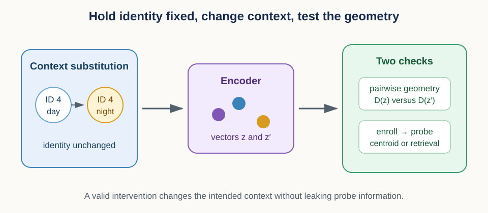
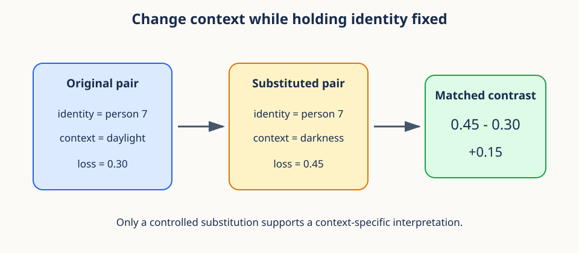
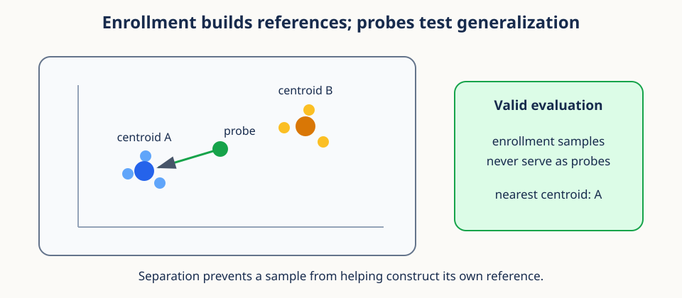

# 13. Context interventions and identity geometry



## Prerequisites

You should understand embeddings, cosine distance, averages, and train-test separation.
Review [12. Blockwise distances and ranking](12_blockwise_distances_and_ranking.md) for
retrieval geometry.

## Learning goals

By the end of this lesson, you will be able to:

1. define a controlled context substitution;
2. compute an interpretable normalized loss contrast;
3. compare representation geometry before and after an intervention;
4. build nearest-centroid and cosine-retrieval evaluations;
5. separate enrollment samples from probes;
6. distinguish hard and soft factor completion; and
7. audit construct validity rather than equating invariance with usefulness.

## 1. Motivating scenario: identity under a changing background

Suppose a representation should preserve a person's identity when lighting changes. A
probe filmed in daylight is easy to identify, while the same person filmed in darkness is
harder. Did the representation lose identity information, or did the entire dataset change
in several uncontrolled ways at once?

A context intervention tries to isolate the question. Keep identity content fixed as far
as the design allows, replace one context with another, and compare the matched outcomes.
The mental model is a controlled swap: change the background card while keeping the main
subject card in place.

The word **intervention** deserves care. A synthetic substitution is not automatically a
causal experiment. It supports a causal interpretation only if the replacement changes the
intended context, preserves relevant identity content, and does not introduce new artifacts.

## 2. Vocabulary and data shapes

An **identity factor** names the property we want to preserve. A **context factor** names
a condition that may vary, such as view, lighting, or device. A **baseline** is the
original condition. An **intervention** is the deliberately substituted condition.

Let $i$ index paired examples from 1 through $N$. Let $x_i^{(b)}$ be the baseline input
and $x_i^{(v)}$ its intervened counterpart. The superscripts $b$ and $v$ mean baseline
and intervention. Both inputs should describe the same identity.

An encoder $f$ maps each input to an embedding of width $D$:

$$
z_i^{(b)}=f(x_i^{(b)}),\qquad z_i^{(v)}=f(x_i^{(v)}).
$$

Stacked baseline and intervention embeddings each have shape `(N, D)`. Row $i$ across the
two matrices is a matched pair. If rows are shuffled independently, the intervention
comparison becomes invalid even though both arrays retain the same shape.

## 3. Designing a context substitution

A valid substitution records what is held fixed, what is changed, and what may change as
a side effect. For a video, identity, action, and time alignment might be held fixed while
lighting is changed. Compression and image sharpness should not change unintentionally.

Useful controls include:

- a **negative control** substitution expected to leave the representation unchanged;
- a **positive control** known to alter context-sensitive features;
- a reconstruction or human check that identity content remains recognizable; and
- metadata confirming that the intended factor actually changed.



The paired design is powerful because each identity serves as its own reference. It does
not remove every confound. A substitution model might leave a watermark, alter texture, or
change pose. These side effects become alternative explanations for the measured contrast.

### Three checks before calling a substitution valid

First, verify **treatment strength**: did the intended context actually change enough to
matter? A lighting classifier or measured luminance can serve as a manipulation check.
Second, verify **content preservation**: can humans or an independent identity model still
recognize the same person? Third, verify **artifact specificity**: can a detector distinguish
real from substituted examples using a watermark, border, or compression cue?

These checks cover different failure modes. A weak substitution may produce a small
contrast because nothing changed. A destructive substitution may produce a large contrast
because identity was damaged. A substitution artifact may produce a large contrast that
has nothing to do with the named context. Recording all three makes the interpretation
far more constrained.

### Conceptual checkpoint

Comparing random daylight people with different nighttime people is not a context
intervention. Identity and context both change, so their effects cannot be separated.

## 4. Raw and normalized loss contrasts

Let $L_i^{(b)}$ be a nonnegative baseline loss and $L_i^{(v)}$ the matched intervention
loss. The raw change is

$$
\Delta_i=L_i^{(v)}-L_i^{(b)}.
$$

$\Delta_i>0$ means the intervention increased loss for pair $i$. The units are the same
as the loss. A raw change of 0.1 may be large when baseline loss is 0.05 and small when
baseline loss is 10.

A symmetric normalized contrast is

$$
c_i=\frac{L_i^{(v)}-L_i^{(b)}}{
\frac{1}{2}\left(|L_i^{(v)}|+|L_i^{(b)}|\right)+\epsilon}.
$$

The denominator is the mean absolute scale of the two losses. The small positive number
$\epsilon$ prevents division by zero. Swapping baseline and intervention flips the sign
without otherwise changing the magnitude, which is why the contrast is called symmetric.

For nonnegative losses and negligible $\epsilon$, the contrast lies between -2 and 2.
A value of 0 means no change. Positive values mean degradation under intervention, and
negative values mean improvement.

### Worked loss example

If baseline loss is 0.30 and intervention loss is 0.45, the raw change is 0.15. Their
mean absolute scale is 0.375, so the normalized contrast is $0.15/0.375=0.4$. If both
losses were ten times larger, the raw change would be 1.5 but the normalized contrast
would remain 0.4.

```python
import numpy as np

def symmetric_contrast(base, intervention, eps=1e-12):
    scale = (np.abs(base) + np.abs(intervention)) / 2.0
    return (intervention - base) / (scale + eps)
```

Always report enough raw information to interpret a normalized summary. A stable contrast
can hide that both losses are unacceptably high.

## 5. Geometry matching asks a different question

Loss evaluates behavior relative to a target. Geometry matching asks whether relationships
among examples are preserved. Two embeddings may rotate together, leaving all pairwise
distances unchanged even though individual coordinates differ.

For baseline embeddings, form a pairwise cosine-distance matrix $D^{(b)}$ with shape
`(N, N)`. Entry $(i,j)$ is

$$
D_{ij}^{(b)}=1-\frac{(z_i^{(b)})^Tz_j^{(b)}}
{\lVert z_i^{(b)}\rVert_2\lVert z_j^{(b)}\rVert_2}.
$$

This expression requires every embedding in the compared pair to have nonzero norm. This
lesson follows Lesson 12's explicit policy: reject and report zero or predeclared near-zero
rows rather than assigning them an artificial cosine angle. Report rejection counts by
condition because an intervention that creates zero vectors is itself an important result.

The intervention matrix $D^{(v)}$ is defined the same way. A simple geometry distortion
summary is the mean absolute difference over unordered pairs:

$$
E_{\mathrm{geom}}=\frac{2}{N(N-1)}
\sum_{i<j}\left|D_{ij}^{(v)}-D_{ij}^{(b)}\right|.
$$

The sum uses $i<j$ so each pair appears once and diagonal self-distances are excluded.
An error of zero means all measured pairwise cosine distances agree.

### Coordinate matching and geometry matching are not the same

A direct coordinate error would average $\lVert z_i^{(v)}-z_i^{(b)}\rVert_2$. It asks
whether each embedding stays at the same coordinate. Geometry error asks whether pairwise
relationships stay the same. A shared rotation can produce large coordinate error and zero
geometry error.

Which question is appropriate depends on downstream use. A frozen classifier expects
coordinates to remain aligned with its fixed weights, so a shared rotation can hurt it.
A newly fitted linear probe may adapt to the rotation and care more about preserved
geometry. Reporting both coordinate-sensitive task loss and relational geometry helps
separate these cases.

For a small sanity check, take two baseline vectors `(1, 0)` and `(0, 1)`. Rotate both by
90 degrees to obtain `(0, 1)` and `(-1, 0)`. Every individual vector changed, but their
cosine similarity remains 0. Pairwise geometry is unchanged even though coordinates are
not.

### What geometry matching does not prove

A constant nonzero embedding gives identical pairwise distances before and after a context
change, yet it contains no identity information. A zero embedding does not even have a
defined cosine direction. Geometry stability must be paired with an informativeness test.

For large $N$, the full matrices require $N^2$ entries. Sample a fixed, predeclared set of
pairs or process blocks when full quadratic storage is too expensive.

## 6. Nearest-centroid identity evaluation

Nearest-centroid classification provides a simple informativeness test. Use enrollment
embeddings for identity $k$ to form a reference centroid:

$$
\mu_k=\frac{1}{n_k}\sum_{i:y_i=k}z_i.
$$

Here $y_i$ is the identity label, $n_k$ is the number of enrollment samples for identity
$k$, and $\mu_k$ has shape `(D,)`.

For Euclidean geometry, assign a probe $z$ to the centroid with smallest squared distance:

$$
\widehat y=\mathrm{argmin}_k\lVert z-\mu_k\rVert_2^2.
$$

The symbol $\widehat y$ is the predicted identity. The choice of Euclidean or cosine
geometry should match the representation and retrieval protocol.

For cosine centroids, first normalize each enrollment embedding, average unit vectors
within identity, and normalize each centroid again. Otherwise high-norm enrollment rows
receive unintended extra weight.

The mean of valid unit vectors can still be zero when directions cancel exactly, or nearly
zero when they almost cancel. Such a centroid has no stable cosine direction. Reject that
identity reference under a declared minimum-norm rule or use a different predeclared
prototype geometry; do not silently divide by epsilon and call the result a direction.

## 7. Enrollment and probes must be separate

**Enrollment** data build identity references. **Probe** data test those references. A
probe must not help construct the centroid against which it is evaluated.



This separation matters even without labels leaking directly. Including a probe in its own
centroid pulls the reference toward that probe and makes classification easier. Nearby
windows from the same source can create a similar leak even when row identifiers differ.

Split at the independent source level before producing windows or augmentations. If the
claim concerns new sessions, enrollment and probe sessions must be disjoint. If it concerns
new devices, device separation may also be necessary.

All derived versions of one source belong in the same partition. For example, a baseline
clip must not build an enrollment centroid while a context-substituted version of that same
clip serves as a probe. They share identity content, timing, and source artifacts even
though their files and context labels differ.

Fit or tune any learned substitution model, preprocessing transform, threshold, and
prototype rule without probe outcomes. If a substitution generator was trained on the
evaluation identities or source clips, document that exposure and narrow the claim. A
held-out probe is not truly held out when an upstream learned component has adapted to it.

### Worked centroid example

Identity A has unit enrollment vectors `(1, 0)` and `(0.8, 0.6)`. Their mean is
`(0.9, 0.3)`, which is then normalized. Identity B has enrollment vectors near `(0, 1)`.
A held-out probe `(0.95, 0.1)` has larger cosine similarity with A's centroid, so it is
assigned to A. The probe never enters either centroid calculation.

## 8. Cosine retrieval complements centroids

Nearest-centroid evaluation compresses each identity to one reference vector. Direct
retrieval keeps individual gallery examples. For normalized probe matrix $P$ with shape
$N_{\mathrm{probe}}\times D$ and normalized gallery matrix $G$ with shape
$N_{\mathrm{gallery}}\times D$, the score
matrix is

$$
S=PG^T.
$$

$S$ has shape $N_{\mathrm{probe}}\times N_{\mathrm{gallery}}$. Each probe row is ranked
across gallery columns.
Centroids reduce noise and storage, while direct retrieval preserves multimodal identity
structure. Reporting both can reveal whether one centroid poorly summarizes an identity.

## 9. Hard and soft factor completion

A partial query may omit a context factor. Suppose context can be day or night, with
conditional probabilities $p_{\mathrm{day}}$ and $p_{\mathrm{night}}$ that sum to 1.

**Hard completion** chooses the single most probable context:

$$
c_{\mathrm{hard}}=\mathrm{argmax}_c p_c.
$$

This produces one completed query. It is simple but discards uncertainty.

**Soft completion** keeps all possible contexts. If loss under completion $c$ is $L_c$,
the expected loss is

$$
L_{\mathrm{soft}}=\sum_c p_cL_c.
$$

Every symbol has a direct meaning: $c$ indexes a completion, $p_c$ is its probability,
and $L_c$ is the loss if that completion were true.

Completion probabilities must come from information available at decision time. Estimate
or calibrate them on training or enrollment data, then freeze the rule before evaluating
probes. Using the probe's hidden factor, label, or outcome to choose $p_c$ would turn soft
completion into evaluation leakage.

### Worked completion example

Day has probability 0.7 and loss 0.2. Night has probability 0.3 and loss 1.4. Hard
completion chooses day and reports 0.2. Soft completion reports
$0.7\times0.2+0.3\times1.4=0.56$. The rare but costly possibility matters.

Do not generally average embeddings first and then compute a nonlinear loss. For a
nonlinear loss $L$, the loss at the mean embedding need not equal mean loss:

$$
L\left(\sum_c p_cz_c\right)\neq\sum_c p_cL(z_c).
$$

Evaluate each completion and then average its loss when expected performance is the goal.

## 10. Construct validity

**Construct validity** asks whether the measurement really captures the concept named in
the claim. Calling a representation "context invariant" is valid only if the intervention
changes context, identity remains present, and the metric responds to meaningful failures.

A strong evaluation triangulates several outcomes:

1. intervention loss contrast measures task degradation;
2. pairwise geometry error measures relational distortion;
3. centroid accuracy checks identity decodability;
4. retrieval checks local identity matches; and
5. positive and negative controls check metric sensitivity.

Agreement among these outcomes is more convincing than any one number. Disagreement is
informative. Stable geometry with poor identity accuracy suggests collapse. Good identity
accuracy with a large loss contrast may reveal that the chosen loss measures something
beyond identity.

### A result matrix for interpretation

Imagine four outcomes after a context substitution. Context manipulation accuracy rises,
identity centroid accuracy stays high, pairwise geometry error stays low, and normalized
task loss remains near zero. Together, these support context robustness.

Now imagine manipulation accuracy rises, but identity accuracy falls to chance and geometry
error is large. The representation is context sensitive or the intervention damaged
identity. Content-preservation controls decide between those explanations.

A third pattern is deceptively reassuring: geometry error is zero, task loss is zero, and
identity accuracy is chance. This is compatible with collapse. Invariance claims must
always include a positive informativeness requirement.

## 11. Efficiency notes

Normalize embedding rows once and reuse them. Matrix multiplication computes all cosine
scores efficiently. Use `np.triu_indices(N, k=1)` to select one copy of every unordered
pair without the diagonal.

For large datasets, calculate geometry error in blocks or on a fixed random pair sample.
Store pair indices and the random seed so repeated systems are evaluated on identical
pairs. Compute centroids with grouped sums rather than Python loops when identity count is
large.

## 12. Misconceptions and failure modes

1. **"No embedding change means success."** A collapsed representation is unchanged too.
2. **"Synthetic substitution is automatically causal."** Artifacts and unintended changes
   can explain the result.
3. **"Normalized contrast replaces raw loss."** It supplies scale, not adequacy.
4. **"Probe-fitted centroids are harmless."** They leak evaluation information.
5. **"Soft completion means average embeddings."** Expected nonlinear loss must average
   losses after evaluating each completion.
6. **"One metric proves invariance."** Use controls and complementary measurements.
7. **"A tiny centroid is safe after epsilon clamping."** Direction is undefined or
   unstable, so reject it or use a predeclared non-cosine policy.
8. **"A transformed copy is a new held-out source."** Source lineage crosses file-level
   transformations and must stay within one partition.

## Exercises

### Exercise 1

Baseline loss is 0.2 and intervention loss is 0.3. Ignoring epsilon, compute the symmetric
contrast.

**Brief solution:** the change is 0.1 and mean scale is 0.25, so the contrast is 0.4.

### Exercise 2

Why does a shared orthogonal rotation leave pairwise cosine geometry unchanged?

**Brief solution:** an orthogonal matrix preserves dot products and norms, so every cosine
similarity remains the same.

### Exercise 3

What is wrong with using all samples to form centroids and then classifying those same
samples?

**Brief solution:** each sample helps build its own reference, producing optimistic leakage.

### Exercise 4

Completions have probabilities 0.8 and 0.2 with losses 0.1 and 2.1. Compare hard and soft
loss.

**Brief solution:** hard completion reports 0.1. Soft expected loss is
$0.8\times0.1+0.2\times2.1=0.5$.

## Recap

A context intervention is a matched, controlled substitution, not merely a comparison of
two datasets. Loss contrasts measure task change, geometry matching measures relational
change, and held-out centroid or retrieval tests verify that identity remains informative.
Hard completion hides uncertainty, while soft completion carries it into expected loss.
Construct validity depends on controls, separation, and agreement across measurements.

## Continue

- Previous: [12. Blockwise distances and ranking](12_blockwise_distances_and_ranking.md)
- Notebook: [13. Context interventions and identity geometry](../implementations/13_context_interventions.ipynb)
- Next: [14. Paired contrasts, uncertainty, and decision thresholds](14_paired_inference.md)
- Curriculum: [Tutorial README](../README.md)
