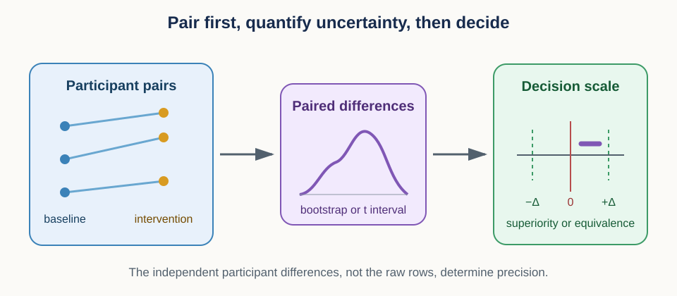
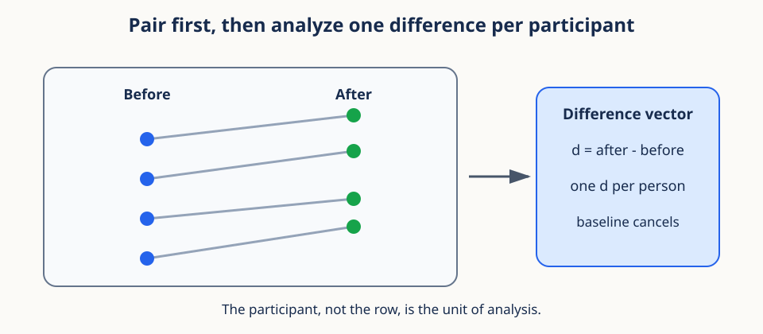
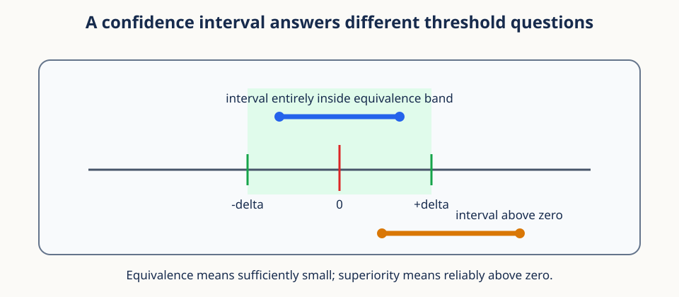

# 14. Paired contrasts, uncertainty, and decision thresholds



## Prerequisites

You should understand means, standard deviations, sampling, and participant-level grouping.
Review [13. Context interventions and identity geometry](13_context_interventions.md) for
matched contrasts and held-out evaluation.

## Learning goals

By the end of this lesson, you will be able to:

1. reduce paired repeated measurements to independent participant contrasts;
2. compute and interpret a paired Student $t$ interval;
3. preserve all four cells of a blocked $2\times2$ model experiment;
4. calculate simple effects, a difference-in-differences interaction, and a direct
   allocation contrast;
5. distinguish participant precision from trained-model replication;
6. compare raw and clipped-logit interactions for a bounded endpoint;
7. separate superiority, materiality, and equivalence decisions; and
8. apply an intersection decision gate without turning it into extra confirmatory tests.

## 1. Motivating scenario: did the intervention help the same people?

Twenty-four participants each complete a baseline condition and an intervention condition.
Every condition contains ten repeated trials. Participant A generally scores higher than
participant B in both conditions. If we compare all baseline rows with all intervention
rows as though they were unrelated, stable participant differences inflate noise and the
row count exaggerates evidence.

Pairing uses a simpler mental model: give every participant one arrow from baseline to
intervention. Analyze the arrow lengths, not the cloud of raw endpoints. Stable participant
baselines cancel when we subtract within person.

## 2. Units and shapes come before a statistical test

Let $P$ be the number of participants and $T$ the number of repeated trials per condition.
Store baseline measurements in $Y^{(0)}$ with shape `(P, T)` and intervention measurements
in $Y^{(1)}$ with the same shape. Superscripts 0 and 1 label conditions.

For participant $i$, first average trials within each condition:

$$
\bar Y_i^{(c)}=\frac{1}{T}\sum_{t=1}^{T}Y_{it}^{(c)}.
$$

The index $c$ is the condition, $t$ is the trial, and the bar denotes a trial mean.
Define one paired difference per participant:

$$
D_i=\bar Y_i^{(1)}-\bar Y_i^{(0)}.
$$

Positive $D_i$ means improvement under the chosen sign convention. The analysis vector
$D=(D_1,\ldots,D_P)$ has shape `(P,)`. This is the key reduction: hundreds of trial rows
become $P$ participant-level contrasts.



The participant is the analysis unit when participants are independently sampled and the
claim concerns participant-average change. If treatment was assigned by classroom, clinic,
or site, the independent randomization unit may be larger. No test can repair a unit chosen
incorrectly at the design stage.

### Conceptual checkpoint

With 24 participants, 2 conditions, and 10 trials per condition, there are 480 raw rows
but only 24 participant contrasts. Repeated trials can estimate each participant's mean
more precisely. They do not create 480 independent participants.

## 3. Why pairing can reduce noise

Write a simple measurement model:

$$
Y_{it}^{(c)}=\mu_c+a_i+e_{it}^{(c)}.
$$

$\mu_c$ is the condition mean, $a_i$ is participant $i$'s stable baseline, and
$e_{it}^{(c)}$ is trial-level deviation. Subtracting condition means within participant
removes $a_i$:

$$
D_i=(\mu_1-\mu_0)+(\bar e_i^{(1)}-\bar e_i^{(0)}).
$$

The paired difference focuses on condition change instead of between-person level. Pairing
helps most when the two condition measurements are positively correlated within person.
Incorrectly pairing unrelated rows can instead create bias or extra noise.

## 4. The paired $t$ interval

Once the $P$ differences are formed, the paired analysis is a one-sample analysis of $D$.
The sample mean difference is

$$
\bar D=\frac{1}{P}\sum_{i=1}^{P}D_i.
$$

The sample standard deviation of participant differences is

$$
s_D=\sqrt{\frac{1}{P-1}\sum_{i=1}^{P}(D_i-\bar D)^2}.
$$

$s_D$ measures how much participant responses vary. The standard error of the mean is

$$
\mathrm{SE}=\frac{s_D}{\sqrt{P}}.
$$

The square-root denominator reflects averaging independent participant contrasts. It must
not use the raw trial-row count.

For confidence level $1-\alpha$, a two-sided Student $t$ interval is

$$
\bar D\ \pm\ t_{1-\alpha/2,\,P-1}\mathrm{SE}.
$$

$t_{1-\alpha/2,\,P-1}$ is a quantile of the Student $t$ distribution with $P-1$ degrees
of freedom. The interval is wider than a normal interval for small samples because the
population standard deviation is estimated.

### Worked numerical interval

Take five participant differences: 0.10, 0.20, 0.15, 0.05, and 0.25. Their mean is 0.15.
The sample standard deviation is about 0.079, so the standard error is
$0.079/\sqrt{5}\approx0.035$.

For a 95 percent interval with 4 degrees of freedom, the critical value is about 2.776.
The half-width is $2.776\times0.035\approx0.098$. The interval is approximately
`[0.052, 0.248]`.

This interval describes uncertainty in the population mean paired difference under the
sampling assumptions. It does not say that 95 percent of participant differences lie in
that range, and it does not assign a 95 percent probability to this fixed interval under
the usual frequentist interpretation.

```python
import numpy as np
from scipy import stats

def paired_t_interval(differences, confidence=0.95):
    d = np.asarray(differences, dtype=float)
    mean = d.mean()
    se = d.std(ddof=1) / np.sqrt(len(d))
    critical = stats.t.ppf((1 + confidence) / 2, df=len(d) - 1)
    return mean, (mean - critical * se, mean + critical * se)
```

The distinction between exact and approximate validity matters. If participant differences
are independent and identically distributed normal draws with nonzero finite variance,
the usual standardized pivot has an exact Student $t$ distribution with $P-1$ degrees of
freedom. Under those assumptions, the displayed interval has exact model-based coverage.

If the differences are independent and identically distributed with finite variance but
are not normal, the same interval is generally an asymptotic approximation justified by
the behavior of the sample mean and variance as $P$ grows. Its small-sample robustness can
fail under strong skew, heavy tails, or influential outliers. Plot the participant
differences and report a sensitivity analysis rather than treating the word "paired" as
an automatic guarantee.

### Unequal trial counts and participant weights

Participants may contribute different numbers of valid trials. Computing each participant's
condition mean from their available trials and then averaging $D_i$ gives every participant
equal weight. Pooling all valid trial differences instead gives participants with more
trials more weight and treats dependent trials as separate analysis units.

Equal participant weighting usually matches a population mean over participants. Precision
weighting can be justified when participant means have very different known measurement
variances, but estimated weights add assumptions and can correlate with participant
difficulty. State the estimand and weighting policy before examining outcomes.

Plot the participant differences. The $t$ interval concerns their mean, not whether the
raw differences form a perfect bell curve. With a moderate number of independent units,
the sample mean can be approximately normal even when individual differences are not.
With very few units, one extreme participant can control both the mean and standard
deviation. Report robust summaries and leave-one-participant-out sensitivity alongside the
primary analysis when such influence is plausible.

## 5. Generalize pairing to four-cell trained-model blocks

The hierarchical-diversity study uses a more demanding form of pairing. It crosses
sequence support $u\in\{L,H\}$ with temporal-window policy $w\in\{F,R\}$. Here $L$ and
$H$ mean low and high sequence support. $F$ and $R$ mean one frozen-random anchor and a
resampled-anchor policy. Eight replicate blocks each contain all four cells, so the study
trains 32 models.

Participant-level GFC-v2 top-1 values can be stored with shape
`(block, sequence_support, window_policy, participant)`, or `(8, 2, 2, 308)` for the
planned complete outcome cohort. Average the participant axis within every cell. Let the
result be $Y_{r,u,w}$, where $r$ identifies the replicate block. The confirmatory analysis
then has shape `(8, 2, 2)`.

This order of operations separates measurement precision from model replication. The 308
participants and their 16 queries help estimate each model's participant-average outcome.
They do not turn eight trained-model blocks into 308 or 4,928 model replicates. The
Student $t$ interval for the primary model-level contrast uses eight values and therefore
has seven degrees of freedom.

Within block $r$, define four simple effects:

$$
T_{L,r}=Y_{r,L,R}-Y_{r,L,F},\qquad
T_{H,r}=Y_{r,H,R}-Y_{r,H,F},
$$

$$
S_{F,r}=Y_{r,H,F}-Y_{r,L,F},\qquad
S_{R,r}=Y_{r,H,R}-Y_{r,L,R}.
$$

$T$ measures the temporal-policy effect at a fixed sequence-support level. $S$ measures
the sequence-support effect at a fixed temporal policy. Every subtraction stays inside
one block, which preserves the shared initialization, optimization seed, nuisance draws,
and pool-ordering context built into that block.

The primary difference-in-differences interaction is

$$
I_r=(Y_{r,H,R}-Y_{r,L,R})-(Y_{r,H,F}-Y_{r,L,F}).
$$

The same quantity can be written as $I_r=T_{H,r}-T_{L,r}=S_{R,r}-S_{F,r}$. These
equalities are valuable implementation tests. Under this sign convention, $I_r<0$ means
that resampling helps more at low sequence support than at high sequence support. A
negative interaction by itself does not show that either simple effect is beneficial.

The direct allocation contrast is

$$
A_r=Y_{r,L,R}-Y_{r,H,F}.
$$

It compares the low-sequence resampled allocation with the high-sequence frozen
allocation. It is a performance comparison at two specified allocations. It is not an
equal-information or equal-support comparison.

### Why complete blocks must stay together

Do not pool the 32 model scores and treat them as unrelated rows. Do not resample one cell
from one block and another cell from a different block. Either operation discards the
planned covariance. Instead, calculate $I_r$, the four simple effects, and $A_r$ within
each complete block. This gives eight values for every model-level estimand.

For any replicate-level vector $Q=(Q_1,\ldots,Q_8)$, report

$$
\bar Q\ \pm\ t_{0.975,7}\frac{s_Q}{\sqrt{8}}.
$$

The form is the same one-sample Student $t$ interval introduced above, but the independent
unit is now the paired four-cell model block. Participant-only and crossed block-by-
participant bootstraps are useful sensitivity analyses. Lesson 15 develops those
resampling schemes.

## 6. Bounded top-1 can make an interaction scale dependent

Top-1 lies between zero and one. Near a ceiling, the same latent improvement has less room
to appear as an additive percentage-point gain. The planned robustness analysis therefore
repeats the interaction after a clipped-logit transform:

$$
Z_{r,u,w}=\mathrm{logit}
\left(\mathrm{clip}(Y_{r,u,w},\epsilon,1-\epsilon)\right),
\qquad
\epsilon=\frac{1}{2\cdot308\cdot16}.
$$

The clipping constant is half of one query's contribution to the full participant-query
average. It prevents infinite logits at zero and one while changing interior values as
little as the declared resolution permits. Apply the same difference-in-differences
formula to $Z$.

A synthetic example makes the issue concrete. Suppose the four cells are
$Y_{L,F}=0.04$, $Y_{L,R}=0.34$, $Y_{H,F}=0.78$, and $Y_{H,R}=0.98$. The temporal gains
are 0.30 and 0.20, so the raw interaction is $-0.10$. On the logit scale, the interaction
is about $+0.11$. The sign reversal shows that the apparent substitution pattern depends
on the chosen scale. It does not reveal which scale is universally correct.

The raw percentage-scale interaction remains the sole confirmatory test because that
estimand was chosen for direct GFC-v2 interpretation. Report the raw and clipped-logit
replicate values and intervals together. If a negative raw interaction reverses sign on
the clipped-logit scale, label it scale dependent and do not use it to support
substitution.

## 7. Superiority, materiality, and equivalence are different rules

The study freezes margins of $\delta_T=\delta_I=0.0625$ for simple effects and the
interaction. It separately freezes $\delta_A=0.0625$ for the direct allocation contrast.
Although all three values equal one of 16 GFC-v2 queries per participant, each margin
belongs to its own scientific claim.

An effect is materially positive only when both of these conditions hold:

1. its 95 percent interval excludes zero on the positive side; and
2. its point estimate is at least the relevant margin.

Materially negative is symmetric. This is not the stronger rule that the entire 95
percent interval must lie beyond the materiality margin. For example, an estimate of
0.070 with a 95 percent interval `[0.010, 0.130]` is materially positive under the frozen
rule because the interval excludes zero and the estimate reaches 0.0625.

Equivalence asks a different question. At level 0.05, TOST equivalence within
$[-\delta,+\delta]$ requires the two-sided 90 percent interval to lie entirely inside
that band. A nonsignificant difference does not establish equivalence. For a simple
effect, no material harm is weaker still: its 95 percent lower bound must be greater than
$-\delta_T$.

## 8. Decision gates organize evidence without multiplying primary tests

The interaction is the only confirmatory test. The other quantities explain the pattern
and support prespecified descriptive labels. A substitution-compatible result requires
all of the following components:

- $\bar T_L$ and $\bar S_F$ are materially positive;
- $\bar T_H$ and $\bar S_R$ show no material harm;
- $\hat I$ is materially negative; and
- the clipped-logit ceiling sensitivity has the same negative sign.

Full performance replacement additionally requires the 90 percent interval for $\bar A$
to lie within $[-\delta_A,+\delta_A]$. If the substitution-compatible gate passes but
$\bar A$ is materially negative, the label is partial performance replacement. If the
gate passes and $\bar A$ is materially positive, the temporal allocation exceeds the
sequence allocation at these two points.

This is an intersection rule. Every required component must pass. The label does not
create a new test with a separate p-value, and it does not promote each component to a
co-primary hypothesis. Report every component interval so readers can see why a gate did
or did not pass. Further secondary hypothesis families can use Holm correction, but the
raw interaction keeps its role as the sole confirmatory analysis.

## 9. The participant percentile bootstrap

The bootstrap approximates repeated sampling by resampling observed units. For paired
inference, resample participant differences, not individual condition rows.

This participant bootstrap assumes participants are the independent, exchangeable sampling
units for the target population. If clinics or sites were sampled or randomized as intact
clusters, resample those clusters and carry all of their participants together. Resampling
participants inside a cluster as though they were independent does not repair a design at
the cluster level.

One bootstrap replicate draws $P$ indices with replacement from `0` through `P-1` and
computes the mean of those selected differences. Repeat this $B$ times to obtain bootstrap
means $\bar D_1^{\ast},\ldots,\bar D_B^{\ast}$.

A 95 percent percentile interval uses the 2.5th and 97.5th percentiles:

$$
[q_{0.025},q_{0.975}].
$$

$q_p$ is the empirical $p$-quantile of bootstrap means. The method is intuitive and does
not impose a normal shape directly, but it is not assumption-free. Small samples provide
few distinct units, and the basic percentile method can have biased coverage.

```python
def participant_bootstrap(d, replicates, rng):
    d = np.asarray(d)
    indices = rng.integers(0, len(d), size=(replicates, len(d)))
    return d[indices].mean(axis=1)
```

The index array has shape `(B, P)`. This vectorized implementation is fast for moderate
$B$ and $P$. For large products, generate replicates in chunks to limit memory.

## 10. Hierarchical bootstrap for nested trials

Participant-level differences already summarize trials. Sometimes we also want uncertainty
from trial sampling. A hierarchical bootstrap mirrors the sampling structure:

1. resample participants with replacement;
2. inside each selected participant, resample paired trial indices with replacement;
3. recompute that participant's difference; and
4. average the resampled participant differences.

When baseline and intervention trial $t$ share a stimulus or time point, resample the same
trial index in both conditions. Drawing them independently destroys their covariance and
changes the estimand.

The hierarchical bootstrap answers a broader repeated-sampling question than resampling
fixed participant summaries. It is useful only when the nested resampling levels correspond
to real sampling or generalization levels. Resampling arbitrary computational rows can
recreate pseudoreplication rather than solve it.

Within-participant trial resampling also assumes trials are exchangeable draws from the
trial population named by the estimand. Serially adjacent or overlapping trials may need
block resampling, and a fixed set of deliberately chosen stimuli may be better treated as
fixed rather than resampled. The bootstrap hierarchy must mirror how new units could
actually arise.

### Which bootstrap should I use?

Use participant resampling when inference treats each participant contrast as the complete
unit. Add within-participant trial resampling when trials represent a meaningful sampled
population and trial variability belongs in the target uncertainty. State the target
explicitly because the two procedures need not produce the same interval.

## 11. Effect resolution and interval half-width

An experiment may be designed to estimate the mean within a desired half-width $h$. Under
a rough normal approximation,

$$
h\approx z_{1-\alpha/2}\frac{\sigma_D}{\sqrt{P}}.
$$

$\sigma_D$ is the anticipated population standard deviation of paired differences, and
$z_{1-\alpha/2}$ is a normal quantile. Solving for participant count gives

$$
P\approx\left(\frac{z_{1-\alpha/2}\sigma_D}{h}\right)^2.
$$

Halving the target half-width requires about four times as many independent participants.
Adding trials can reduce $\sigma_D$ when participant means are noisy, but it cannot remove
true between-participant variation.

For small planned $P$, replace the normal quantile with a $t$ quantile and solve
iteratively because the quantile itself depends on $P-1$.

## 12. Power and the noncentral $t$ distribution

Power is the probability that a predeclared test rejects its null hypothesis when a
specific alternative is true. Let the population mean paired effect be $\delta$ and the
population standard deviation of differences be $\sigma_D$. The standardized effect is

$$
d=\frac{\delta}{\sigma_D}.
$$

For $P$ independent pairs, the noncentrality parameter is

$$
\lambda=\sqrt{P}\,d=\frac{\sqrt{P}\delta}{\sigma_D}.
$$

$\lambda$ measures how far the test statistic shifts under the alternative. Power is a
tail probability of a noncentral $t$ distribution with $P-1$ degrees of freedom and
noncentrality $\lambda$.

This noncentral $t$ calculation is exact for the classical test under independent,
identically distributed normal differences with standardized effect $d$. For nonnormal
or more complex clustered designs it is a planning approximation; simulation from a
realistic data-generating model may be more defensible.

Power calculations are only as credible as their inputs. An effect selected from a noisy
pilot is often too optimistic. Examine a range of plausible effects and standard deviations.
Power does not measure the probability that the hypothesis is true after seeing data.

Power and precision answer related but distinct planning questions. A power target asks
how often a threshold decision succeeds for one assumed effect. A resolution target asks
how narrow the estimate should be regardless of which effect is observed. When scientific
interpretation depends on effect size rather than only rejection, planning for precision is
often more transparent.

## 13. Superiority asks whether the effect is positive

For a one-sided level $\alpha$ superiority claim, the null allows nonpositive effects and
the alternative is positive. A lower confidence bound is

$$
L_{\mathrm{sup}}=\bar D-t_{1-\alpha,\,P-1}\mathrm{SE}.
$$

Declare superiority when $L_{\mathrm{sup}}>0$. The sign convention must be fixed before
analysis. If lower loss is better, define differences so improvement is positive or reverse
the inequality consistently.

Failure to show superiority means the data did not establish a positive effect at the
chosen threshold. It does not prove that the effect is zero or practically negligible.

## 14. Equivalence asks whether the effect is small enough

Equivalence begins with a practical margin $\Delta>0$. Effects between $-\Delta$ and
$+\Delta$ are considered too small to matter for the stated application.

Two one-sided tests, commonly called TOST, reject both nonequivalence regions. At level
$\alpha=0.05$, an equivalent interval rule is that the two-sided 90 percent confidence
interval lies entirely inside $(-\Delta,+\Delta)$.



The margin must have domain meaning. Choosing it after seeing the interval turns the
decision into a moving target. A narrow interval around a large positive effect can show
superiority but not equivalence. A narrow interval around a small positive effect can show
both superiority and equivalence. These claims are not logical opposites.

### Worked decision example

Suppose a 90 percent interval is `[0.03, 0.17]` and the equivalence margin is 0.20. The
interval is above zero, so a corresponding one-sided superiority test may succeed. It is
also entirely inside `[-0.20, 0.20]`, so equivalence may succeed. The interpretation is a
reliably positive effect that is still practically small under the declared margin.

## 15. Holm correction for multiple hypotheses

Testing many outcomes increases the chance of at least one false rejection. Holm's method
controls the family-wise error rate for a declared family of $m$ hypotheses.

Sort raw p-values:

$$
p_{(1)}\leq p_{(2)}\leq\cdots\leq p_{(m)}.
$$

Compare $p_{(j)}$ with $\alpha/(m-j+1)$ in order. Stop at the first comparison that fails;
that hypothesis and all later ones are not rejected. The ordered adjusted p-values can be
constructed from scaled values $(m-j+1)p_{(j)}$ followed by a cumulative maximum and a
cap at 1.

The hypothesis family must be declared. Combining every exploratory metric into one giant
family can be unnecessarily conservative, while splitting one confirmatory family after
seeing results defeats error control.

### Small Holm example

For raw p-values 0.004, 0.018, 0.041, and 0.30 at $\alpha=0.05$, compare them with
0.0125, about 0.0167, 0.025, and 0.05. The first passes. The second fails, so Holm stops
and only the first hypothesis is rejected.

## 16. Efficiency and reproducibility notes

Compute participant contrasts once and keep participant identifiers beside them. Vectorize
the simple bootstrap, but use chunks when `B*P` indices would be large. A hierarchical
bootstrap often needs loops, which is acceptable when the code mirrors the design clearly.

Use an explicit `numpy.random.Generator` and record its seed. Record bootstrap replicate
count, interval type, direction of improvement, equivalence margin, and multiplicity family.
Monte Carlo endpoints vary slightly across seeds, so use enough replicates for the claimed
precision and report that simulation error exists.

## 17. Misconceptions and failure modes

1. **"Every trial is an independent pair."** Participant-level dependence remains.
2. **"A nonsignificant result proves no effect."** Absence of evidence is not equivalence.
3. **"Bootstrap means assumption-free."** The resampling hierarchy is an assumption.
4. **"More bootstrap replicates fix a small sample."** They reduce Monte Carlo noise, not
   missing population information.
5. **"Power is the chance the alternative is true."** It is a long-run rejection
   probability under a specified alternative.
6. **"Any equivalence margin is acceptable."** The margin must be justified before data.
7. **"Holm can be applied after selecting promising outcomes."** Selection changes the
   family and invalidates the planned error guarantee.

## Exercises

### Exercise 1

Participant differences have standard deviation 0.40 and $P=64$. What is the standard
error of their mean?

**Brief solution:** $0.40/\sqrt{64}=0.05$.

### Exercise 2

If target interval half-width is cut from 0.10 to 0.05 with all else fixed, how does the
approximate participant requirement change?

**Brief solution:** it grows by a factor of four.

### Exercise 3

Why must matched baseline and intervention trial indices be resampled together?

**Brief solution:** separate resampling destroys within-trial covariance that pairing is
intended to preserve.

### Exercise 4

A 90 percent interval is `[-0.08, 0.07]` and $\Delta=0.10$. What can be concluded?

**Brief solution:** it lies entirely inside `[-0.10, 0.10]`, so equivalence succeeds at
the corresponding 0.05 TOST level. It does not show positive superiority.

### Exercise 5

For one block, the cells ordered as $(L,F)$, $(L,R)$, $(H,F)$, and $(H,R)$ are 0.40,
0.58, 0.70, and 0.76. Compute $T_L$, $T_H$, $S_F$, $S_R$, $I$, and $A$.

**Brief solution:** the four simple effects are 0.18, 0.06, 0.30, and 0.18. The
interaction is $0.06-0.18=-0.12$, which also equals $0.18-0.30$. The allocation
contrast is $0.58-0.70=-0.12$.

### Exercise 6

Why does the primary interval have seven degrees of freedom even though 308 participants
each supply 16 queries to every model?

**Brief solution:** the confirmatory contrast varies across eight paired trained-model
blocks. Participants and queries are repeated measurements within each model cell. They
improve cell precision but do not create additional independently trained blocks.

### Exercise 7

An interaction estimate is $-0.070$ with a 95 percent interval `[-0.120, -0.010]` and a
materiality margin of 0.0625. Is it materially negative under the frozen rule?

**Brief solution:** yes. The interval excludes zero on the negative side and the point
estimate has magnitude at least 0.0625. The interval does not need to lie entirely below
-0.0625.

### Exercise 8

What does the fact that a 95 percent interval includes zero establish about equivalence?

**Brief solution:** by itself, nothing. Equivalence requires the 90 percent interval to fit
entirely inside a predeclared practical band. A 95 percent interval that lies entirely
inside that band would be conservative evidence of equivalence even if it includes zero.
Merely including zero only says that a two-sided difference test was inconclusive.

## Recap

Paired inference begins by creating one contrast per independent unit. In the
hierarchical-diversity experiment, that unit is a complete four-cell trained-model block,
so the primary interval uses eight difference-in-differences values. Participants sharpen
each cell estimate but do not increase the model-level sample size. Raw and clipped-logit
interactions expose scale dependence. Superiority, materiality, and equivalence answer
different questions, while the substitution labels combine prespecified components without
creating new confirmatory tests.

## Continue

- Previous: [13. Context interventions and identity geometry](13_context_interventions.md)
- Notebook: [14. Paired contrasts and uncertainty](../implementations/14_paired_inference.ipynb)
- Next: [15. Exposure, replication, and variance decomposition](15_exposure_and_replication.md)
- Curriculum: [Tutorial README](../README.md)
