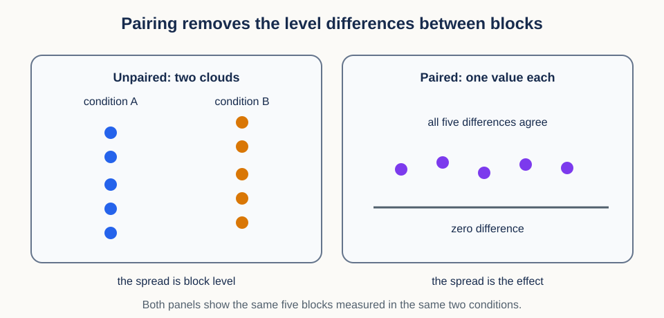
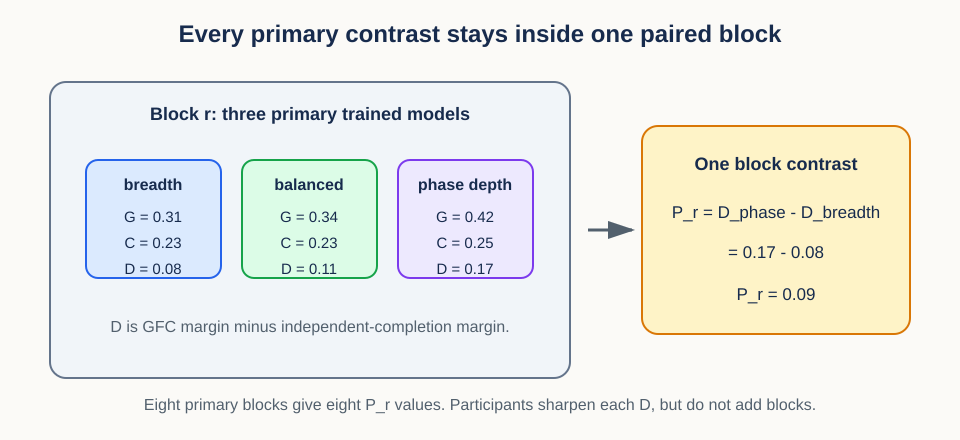
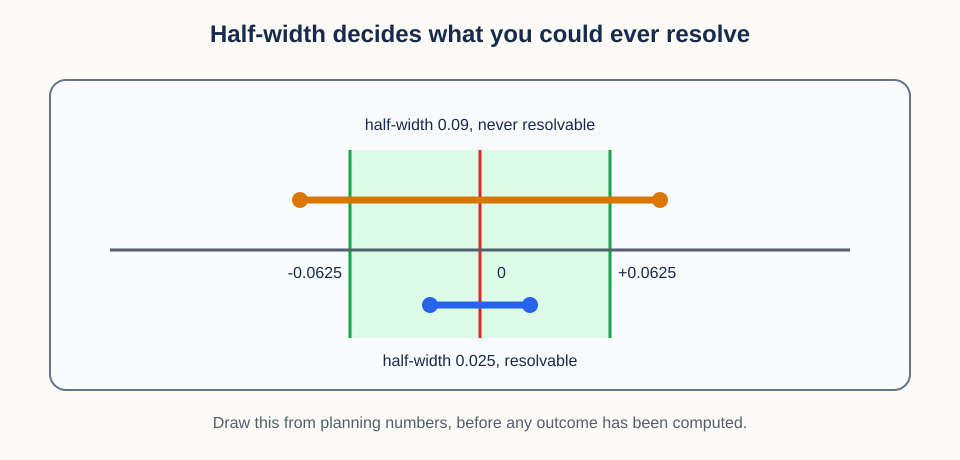

# 14. Paired contrasts, uncertainty, and decision thresholds


## Prerequisites

You should understand means, standard deviations, sampling, and participant-level grouping.
Review [13. Context interventions and identity geometry](13_context_interventions.md) for
matched contrasts and held-out evaluation.

## Learning goals

By the end of this lesson, you will be able to:

1. reduce paired repeated measurements to independent participant contrasts;
2. compute and interpret a paired Student $t$ interval;
3. preserve complete paired blocks in the 28-model allocation registry;
4. calculate the residual phase-depth versus breadth contrast inside each block;
5. distinguish participant precision from trained-model replication;
6. keep bounded directional endpoints separate from the continuous primary margin;
7. separate superiority, materiality, and equivalence decisions; and
8. apply supporting decision gates without turning them into extra confirmatory tests.

## 1. Motivating scenario: did the intervention help the same people?

One idea carries this entire lesson: form one number per independent unit first, then do
statistics on those numbers. Everything else is detail about which unit is independent and
what to do with the resulting numbers.

Here is the scenario that makes it concrete. Twenty-four participants each complete a
baseline condition and an intervention condition, and every condition contains ten repeated
trials. Participant A generally scores higher than participant B in both conditions. If we
compare all baseline rows with all intervention rows as though they were unrelated, those
stable participant differences inflate the noise, and the row count exaggerates how much
evidence we have.

Pairing replaces that with a simpler picture: give every participant one arrow from
baseline to intervention, then analyze the arrow lengths rather than the cloud of raw
endpoints. Stable participant baselines cancel when we subtract within person.

## 2. Units and shapes come before a statistical test

Because the analysis unit decides everything downstream, fix it before choosing any test.

Let $P$ be the number of participants and $T$ the number of repeated trials per condition.
Store baseline measurements in $Y^{(0)}$ with shape `(P, T)` and intervention measurements
in $Y^{(1)}$ with the same shape. The superscripts 0 and 1 label the two conditions.

For participant $i$, first average trials within each condition:

$$
\bar Y_i^{(c)}=\frac{1}{T}\sum_{t=1}^{T}Y_{it}^{(c)}.
$$

The index $c$ is the condition, $t$ is the trial, and the bar denotes a trial mean. Then
define one paired difference per participant:

$$
D_i=\bar Y_i^{(1)}-\bar Y_i^{(0)}.
$$

A positive $D_i$ means improvement under the chosen sign convention. The analysis vector
$D=(D_1,\ldots,D_P)$ has shape `(P,)`. That is the key reduction of this lesson: hundreds
of trial rows become $P$ participant-level contrasts, and the statistics operate only on
those.


The figure shows the reduction, but it does not decide who counts as a participant. The
participant is the analysis unit when participants are independently sampled and the claim
concerns participant-average change. If treatment was assigned by classroom, clinic, or
site, the independent randomization unit is larger. No test can repair a unit chosen
incorrectly at the design stage.

### Conceptual checkpoint

With 24 participants, 2 conditions, and 10 trials per condition, there are 480 raw rows but
only 24 participant contrasts. Repeated trials estimate each participant's mean more
precisely. They do not create 480 independent participants.

## 3. Why pairing can reduce noise

The reduction above is not just bookkeeping. A small model shows exactly which source of
variation it removes.

Write each measurement as

$$
Y_{it}^{(c)}=\mu_c+a_i+e_{it}^{(c)}.
$$

Here $\mu_c$ is the condition mean, $a_i$ is participant $i$'s stable personal level, and
$e_{it}^{(c)}$ is trial-level deviation. Subtracting condition means within participant
cancels $a_i$ entirely:

$$
D_i=(\mu_1-\mu_0)+(\bar e_i^{(1)}-\bar e_i^{(0)}).
$$

Only the condition change and the trial-level noise survive. Pairing therefore helps most
when the two condition measurements are strongly positively correlated within a unit,
because that correlation is exactly the shared $a_i$ term. Incorrectly pairing unrelated
rows creates bias or extra noise instead.



The figure puts both views of the same data side by side. On the left, the two conditions
form clouds that overlap heavily, because the units differ from each other far more than
the conditions differ. On the right, each unit contributes one difference, every difference
is positive, and the spread is small. Nothing was added between the two panels. Subtracting
the unit level simply removed variation that was never part of the question.

## 4. The paired $t$ interval

Once the $P$ differences exist, the two-condition problem has become a one-sample problem,
and the standard one-sample interval applies without modification.

The sample mean difference is

$$
\bar D=\frac{1}{P}\sum_{i=1}^{P}D_i.
$$

The sample standard deviation of the participant differences is

$$
s_D=\sqrt{\frac{1}{P-1}\sum_{i=1}^{P}(D_i-\bar D)^2}.
$$

$s_D$ measures how much participant responses vary around their mean. The standard error of
the mean is

$$
\mathrm{SE}=\frac{s_D}{\sqrt{P}}.
$$

The square root of $P$ appears because we averaged $P$ independent participant contrasts.
It must not use the raw trial-row count, which is the single most common way to make an
interval look better than the design earns.

For confidence level $1-\alpha$, a two-sided Student $t$ interval is

$$
\bar D\ \pm\ t_{1-\alpha/2,\,P-1}\mathrm{SE}.
$$

The quantity $t_{1-\alpha/2,\,P-1}$ is a quantile of the Student $t$ distribution with
$P-1$ degrees of freedom. It is larger than the corresponding normal quantile for small
samples, which widens the interval to pay for estimating the standard deviation from data.

### Worked numerical interval

Five numbers are enough to see every step. Take participant differences 0.10, 0.20, 0.15,
0.05, and 0.25. Their mean is 0.15. The sample standard deviation is about 0.079, so the
standard error is $0.079/\sqrt{5}\approx0.035$.

For a 95 percent interval with 4 degrees of freedom, the critical value is about 2.776. The
half-width is $2.776\times0.035\approx0.098$, so the interval is approximately
`[0.052, 0.248]`.

Read that interval carefully. It describes uncertainty in the population mean paired
difference under the sampling assumptions. It does not say that 95 percent of participant
differences lie in that range, and under the usual frequentist interpretation it does not
assign a 95 percent probability to this particular fixed interval.

```python
import numpy as np
from scipy import stats

def paired_t_interval(differences, confidence=0.95):
    d = np.asarray(differences, dtype=float)
    mean = d.mean()
    se = d.std(ddof=1) / np.sqrt(len(d))
    critical = stats.t.ppf((1 + confidence) / 2, df=len(d) - 1)
    return mean, (mean - critical * se, mean + critical * se)
```

The four lines of code are the same under any assumptions; the guarantee attached to them
is not. If participant differences are independent and identically distributed normal draws
with nonzero finite variance, the usual standardized pivot has an exact Student $t$
distribution with $P-1$ degrees of freedom, and the interval has exact model-based
coverage.

If the differences are independent and identically distributed with finite variance but are
not normal, the same interval is generally an asymptotic approximation, justified by the
behavior of the sample mean and variance as $P$ grows. Its small-sample robustness can fail
under strong skew, heavy tails, or influential outliers. Plot the participant differences
and report a sensitivity analysis rather than treating the word "paired" as an automatic
guarantee.

### Unequal trial counts and participant weights

Real datasets rarely give every unit the same number of trials, and the repair is a
weighting decision rather than a technical one. Computing each participant's condition mean
from their available trials and then averaging $D_i$ gives every participant equal weight.
Pooling all valid trial differences instead gives participants with more trials more
weight, and it treats dependent trials as separate analysis units.

Equal participant weighting usually matches a population mean over participants. Precision
weighting can be justified when participant means have very different known measurement
variances, but estimated weights add assumptions and can correlate with participant
difficulty. State the estimand and the weighting policy before examining outcomes.

Then look at the differences themselves. The $t$ interval concerns their mean, not whether
the raw differences form a perfect bell curve, and with a moderate number of independent
units the sample mean can be approximately normal even when individual differences are not.
With very few units, one extreme participant can control both the mean and the standard
deviation at once. Report robust summaries and leave-one-participant-out sensitivity
alongside the primary analysis when such influence is plausible.

## 5. Generalize pairing to the active trained-model blocks

Everything so far used a participant as the independent unit. The active hierarchical-diversity study replaces the participant with something larger and rarer: a complete paired block of trained models. The mathematics is unchanged, and the sample size is much smaller than the raw data suggests.

Each of the eight primary blocks contains one breadth model, one balanced model, and one phase-depth model. Four prespecified blocks also contain a nearby-jitter model. The primary registry therefore has 24 path models plus four diagnostic models, for 28 trained models in total.

For the primary path, participant-level scores can be stored with shape `(block, allocation, participant)`, or `(8, 3, P)`. The allocation axis is ordered as breadth, balanced, and phase depth. Average the participant axis within every cell and call the result $G_{r,a}$ for the GFC margin and $C_{r,a}$ for the independent-completion margin.

The residual score is

$$
D_{r,a}=G_{r,a}-C_{r,a}.
$$

The confirmatory allocation contrast stays inside a block:

$$
P_r=D_{r,\mathrm{phase\_depth}}-D_{r,\mathrm{breadth}}.
$$



The figure runs the arithmetic on one block. Breadth has residual margin 0.08, balanced has 0.11, and phase depth has 0.17. The primary block contrast is therefore $P_r=0.17-0.08=0.09$. Balanced is reported to show the path shape, but it is not needed to compute the primary contrast.

The nearby-jitter diagnostic is paired differently. In its four prespecified blocks, compare phase depth with nearby jitter while holding the sequence draw, base phase, masks, transforms, exposure, and seeds fixed. If $D_{r,\mathrm{jitter}}$ is the residual margin for nearby jitter, then the diagnostic contrast is

$$
J_r=D_{r,\mathrm{phase\_depth}}-D_{r,\mathrm{nearby\_jitter}}.
$$

$J_r$ asks whether separated phase content beat local start variation. It has only four values, so it is lower precision than the primary contrast and is interpreted as mechanism evidence rather than as a fourth allocation-path point.

### Why complete blocks must stay together

The block structure is fragile in a specific way, and two tempting shortcuts destroy it. Do not pool the 28 model scores and treat them as unrelated rows. Do not resample a breadth model from one block and a phase-depth model from another block. Either operation discards the planned covariance that made the design efficient in the first place.

Instead, calculate $D_{r,a}$ and then $P_r$ inside each complete block. Those eight values then go straight into the interval from Section 4. For the primary vector $P=(P_1,\ldots,P_8)$, report

$$
\bar P\ \pm\ t_{0.975,7}\frac{s_P}{\sqrt{8}}.
$$

The form is exactly the one-sample Student $t$ interval introduced above. Only the independent unit changed, from a participant to a paired trained-model block. Participant-only and crossed block-by-participant bootstraps are useful sensitivity analyses, and Lesson 15 develops those resampling schemes.

## 6. Directional endpoints are supporting checks, not the primary scale

The active study uses a continuous target margin as its primary score, so the confirmatory contrast is not a difference of hit rates. This is intentional. A margin keeps information about how far the target won or lost, which is valuable when the model-level sample has only eight primary blocks.

Top-1 and mean reciprocal rank still matter. They answer whether the margin direction agrees with familiar rank summaries. They are directional checks on the same retrieval behavior, not separate headline endpoints.

Bounded endpoints need care because values near zero or one have less room to move. A top-1 gain of five percentage points near chance and the same gain near a ceiling do not necessarily mean the same thing on the latent distance scale. If a bounded endpoint is transformed for sensitivity, the transform, clipping rule, and interpretation must be frozen before outcomes.

The decision rule is simple: the continuous residual margin carries the confirmatory test. Top-1, MRR, and any bounded-scale sensitivity help explain the result only when their direction agrees with the primary margin. They cannot overturn the primary contrast after the fact.

## 7. Superiority, materiality, and equivalence are different rules

An interval is only half of a decision. The other half is a threshold, and this study uses
three different thresholds for three different questions.

The study freezes a materiality margin for the primary residual contrast $P_r$ and a
separate diagnostic margin for the four-block jitter contrast $J_r$. Each margin belongs
to its own claim. The primary margin governs the allocation-path result. The jitter margin
governs the mechanism check that distinguishes separated phase content from local temporal
variation.

An effect is materially positive only when both of these conditions hold:

1. its 95 percent interval excludes zero on the positive side; and
2. its point estimate is at least the relevant margin.

Materially negative is the mirror image. Note what this rule does not require: the entire
95 percent interval does not have to lie beyond the materiality margin. For example, an
estimate of 0.070 with a 95 percent interval `[0.010, 0.130]` is materially positive under
the frozen rule, because the interval excludes zero and the estimate reaches 0.0625.

Equivalence asks the opposite question, so it uses a different interval. At level 0.05,
TOST equivalence within $[-\delta,+\delta]$ requires the two-sided 90 percent interval to
lie entirely inside that band. A nonsignificant difference does not establish equivalence.
For a supporting diagnostic, no material harm is weaker still: only the 95 percent lower
bound must be greater than the negative diagnostic margin.

## 8. Decision gates organize evidence without multiplying primary tests

Several quantities are computed from the same study: the primary residual contrast $P_r$, the raw GFC contrast, the balanced path point, the four-block jitter diagnostic, top-1, MRR, and the factor-transport geometry diagnostic. That list can look like many tests unless the roles are fixed first.

The primary residual phase-depth versus breadth contrast is the only confirmatory test. The other quantities explain the pattern and support prespecified descriptive labels. A phase-depth interpretation requires all of the following components:

- the mean primary residual contrast has the declared sign and clears the materiality rule;
- top-1 and MRR agree in direction with the continuous margin;
- the phase-depth versus nearby-jitter diagnostic agrees with separated phase content rather than local jitter; and
- the locked factor-transport geometry diagnostic does not contradict the retrieval result.

This is an intersection rule: every required component must pass. Because the label is a conjunction of already-computed components, it does not create a new test with a separate p-value, and it does not promote each component to a co-primary hypothesis. Report every component interval so readers can see why a gate did or did not pass. Further secondary hypothesis families can use Holm correction, described in Section 15, while the residual block contrast keeps its role as the sole confirmatory analysis.

## 9. The participant percentile bootstrap

The $t$ interval assumes a shape for the sampling distribution. A bootstrap estimates that
shape from the data instead, and it obeys the same rule about units.

The bootstrap approximates repeated sampling by resampling observed units. For paired
inference, resample participant differences, not individual condition rows.

The choice of which unit to resample is an assumption, not a technicality. This participant
bootstrap assumes participants are the independent, exchangeable sampling units for the
target population. If clinics or sites were sampled or randomized as intact clusters,
resample those clusters and carry all of their participants together. Resampling
participants inside a cluster as though they were independent does not repair a design at
the cluster level.

One bootstrap replicate draws $P$ indices with replacement from `0` through `P-1` and
computes the mean of the selected differences. Repeat this $B$ times to obtain bootstrap
means $\bar D_1^{\ast},\ldots,\bar D_B^{\ast}$. A 95 percent percentile interval then uses
the 2.5th and 97.5th percentiles of those means:

$$
[q_{0.025},q_{0.975}].
$$

Here $q_p$ is the empirical $p$-quantile of the bootstrap means. The method is intuitive
and does not impose a normal shape directly, but it is not assumption-free. Small samples
provide few distinct units, and the basic percentile method can have biased coverage.

```python
def participant_bootstrap(d, replicates, rng):
    d = np.asarray(d)
    indices = rng.integers(0, len(d), size=(replicates, len(d)))
    return d[indices].mean(axis=1)
```

The index array has shape `(B, P)`, so this vectorized implementation is fast for moderate
$B$ and $P$. For large products, generate replicates in chunks to limit memory.

## 10. Hierarchical bootstrap for nested trials

The bootstrap above treats each participant difference as a fixed summary. Sometimes trial
sampling is itself part of the uncertainty we want to report, and then the resampling has to
mirror both levels.

A hierarchical bootstrap does that in four steps:

1. resample participants with replacement;
2. inside each selected participant, resample paired trial indices with replacement;
3. recompute that participant's difference; and
4. average the resampled participant differences.

Step 2 has one requirement that is easy to get wrong. When baseline and intervention trial
$t$ share a stimulus or time point, resample the same trial index in both conditions.
Drawing them independently destroys their covariance and quietly changes the estimand.

The hierarchical bootstrap answers a broader repeated-sampling question than resampling
fixed participant summaries, and that breadth is only appropriate when the nested levels
correspond to real sampling or generalization levels. Resampling arbitrary computational
rows recreates pseudoreplication rather than solving it.

Within-participant trial resampling also assumes trials are exchangeable draws from the
trial population named by the estimand. Serially adjacent or overlapping trials may need
block resampling, and a fixed set of deliberately chosen stimuli may be better treated as
fixed rather than resampled. The bootstrap hierarchy must mirror how new units could
actually arise.

### Which bootstrap should I use?

Use participant resampling when inference treats each participant contrast as the complete
unit. Add within-participant trial resampling when trials represent a meaningful sampled
population and trial variability belongs in the target uncertainty. State the target
explicitly, because the two procedures need not produce the same interval.

## 11. Effect resolution and interval half-width

All of the machinery above runs after data collection. The same formulas run before it, and
that is where they are most useful, because they tell you what your design could ever show.

An experiment may be designed to estimate the mean within a desired half-width $h$. Under a
rough normal approximation,

$$
h\approx z_{1-\alpha/2}\frac{\sigma_D}{\sqrt{P}}.
$$

Here $\sigma_D$ is the anticipated population standard deviation of paired differences and
$z_{1-\alpha/2}$ is a normal quantile. Solving for the number of units gives

$$
P\approx\left(\frac{z_{1-\alpha/2}\sigma_D}{h}\right)^2.
$$

Because $h$ is squared in the denominator, halving the target half-width requires about four
times as many independent units. Adding trials can reduce $\sigma_D$ when participant means
are noisy, but it cannot remove true between-participant variation. For small planned $P$,
replace the normal quantile with a $t$ quantile and solve iteratively, because the quantile
itself depends on $P-1$.



Combining a half-width with a margin gives the smallest effect the design could ever call
resolved, and the figure draws that comparison. Both intervals are centered on zero because
this picture is made from planning numbers, before any outcome exists. The wide interval has
half-width 0.09, so even a point estimate exactly at the margin 0.0625 would produce an
interval containing zero, and the materiality rule of Section 7 could never fire. The narrow
interval has half-width 0.025, so an estimate at the margin would clear both conditions.
Drawing this before collecting data is cheaper than discovering afterward that no possible
result was interpretable.

## 12. Power and the noncentral $t$ distribution

Precision planning asks how narrow the estimate will be. Power planning asks a related but
different question: how often would a specific true effect be detected?

Power is the probability that a predeclared test rejects its null hypothesis when a specific
alternative is true. Let the population mean paired effect be $\delta$ and the population
standard deviation of differences be $\sigma_D$. The standardized effect is

$$
d=\frac{\delta}{\sigma_D}.
$$

For $P$ independent pairs, the noncentrality parameter is

$$
\lambda=\sqrt{P}\,d=\frac{\sqrt{P}\delta}{\sigma_D}.
$$

The parameter $\lambda$ measures how far the test statistic shifts under the alternative.
Power is a tail probability of a noncentral $t$ distribution with $P-1$ degrees of freedom
and noncentrality $\lambda$.

That calculation is exact for the classical test under independent, identically distributed
normal differences with standardized effect $d$. For nonnormal or more complex clustered
designs it is a planning approximation, and simulation from a realistic data-generating
model may be more defensible.

Power calculations are also only as credible as their inputs. An effect selected from a
noisy pilot is usually too optimistic, so examine a range of plausible effects and standard
deviations. Power does not measure the probability that the hypothesis is true after seeing
data.

The two planning targets suit different goals. A power target asks how often a threshold
decision succeeds for one assumed effect. A resolution target asks how narrow the estimate
will be regardless of which effect is observed. When scientific interpretation depends on
effect size rather than only on rejection, planning for precision is often more transparent.

## 13. Superiority asks whether the effect is positive

With planning done, return to the decisions themselves. Superiority is the simplest of them:
it asks only whether the effect is on the good side of zero.

For a one-sided level $\alpha$ superiority claim, the null allows nonpositive effects and
the alternative is positive. A lower confidence bound is

$$
L_{\mathrm{sup}}=\bar D-t_{1-\alpha,\,P-1}\mathrm{SE}.
$$

Declare superiority when $L_{\mathrm{sup}}>0$. The sign convention must be fixed before
analysis. If lower loss is better, define the differences so that improvement is positive,
or reverse the inequality consistently everywhere.

Failing to show superiority means the data did not establish a positive effect at the
chosen threshold. It does not prove that the effect is zero or practically negligible,
which is precisely the claim the next section handles.

## 14. Equivalence asks whether the effect is small enough

Equivalence is not the failure of superiority. It is a separate claim with its own margin
and its own interval rule.

Equivalence begins with a practical margin $\Delta>0$. Effects between $-\Delta$ and
$+\Delta$ are considered too small to matter for the stated application.

Two one-sided tests, commonly called TOST, reject both nonequivalence regions. At level
$\alpha=0.05$, an equivalent interval rule is that the two-sided 90 percent confidence
interval lies entirely inside $(-\Delta,+\Delta)$.


The figure shows why the two rules are not opposites. The margin must have domain meaning,
and choosing it after seeing the interval turns the decision into a moving target. A narrow
interval around a large positive effect can show superiority but not equivalence. A narrow
interval around a small positive effect can show both.

### Worked decision example

Suppose a 90 percent interval is `[0.03, 0.17]` and the equivalence margin is 0.20. The
interval is above zero, so a corresponding one-sided superiority test may succeed. It is
also entirely inside `[-0.20, 0.20]`, so equivalence may succeed. The correct reading is a
reliably positive effect that is still practically small under the declared margin.

## 15. Holm correction for multiple hypotheses

The gate in Section 8 kept the confirmatory family at size one. Secondary families are
usually larger, and larger families need error control.

Testing many outcomes increases the chance of at least one false rejection. Holm's method
controls the family-wise error rate for a declared family of $m$ hypotheses.

Sort the raw p-values from smallest to largest:

$$
p_{(1)}\leq p_{(2)}\leq\cdots\leq p_{(m)}.
$$

Compare $p_{(j)}$ with $\alpha/(m-j+1)$ in order. Stop at the first comparison that fails;
that hypothesis and all later ones are not rejected. The ordered adjusted p-values can be
constructed from the scaled values $(m-j+1)p_{(j)}$ followed by a cumulative maximum and a
cap at 1.

The family must be declared in advance for any of this to hold. Combining every exploratory
metric into one giant family can be unnecessarily conservative, while splitting one
confirmatory family after seeing results defeats error control entirely.

### Small Holm example

For raw p-values 0.004, 0.018, 0.041, and 0.30 at $\alpha=0.05$, compare them with 0.0125,
about 0.0167, 0.025, and 0.05 respectively. The first passes. The second fails, so Holm
stops there and only the first hypothesis is rejected.

## 16. Efficiency and reproducibility notes

The procedures above are cheap, so most of the practical care goes into keeping them
reproducible.

Compute participant contrasts once and keep participant identifiers beside them. Vectorize
the simple bootstrap, but use chunks when `B*P` indices would be large. A hierarchical
bootstrap often needs loops, which is acceptable when the code mirrors the design clearly.

Use an explicit `numpy.random.Generator` and record its seed. Record the bootstrap replicate
count, interval type, direction of improvement, equivalence margin, and multiplicity family.
Monte Carlo endpoints vary slightly across seeds, so use enough replicates for the claimed
precision and report that simulation error exists.

## 17. Misconceptions and failure modes

Each of these sounds like a small simplification and each one changes the guarantee attached
to the interval.

1. **"Every trial is an independent pair."** Participant-level dependence remains.
2. **"A nonsignificant result proves no effect."** Absence of evidence is not equivalence.
3. **"Bootstrap means assumption-free."** The resampling hierarchy is an assumption.
4. **"More bootstrap replicates fix a small sample."** They reduce Monte Carlo noise, not
   missing population information.
5. **"Power is the chance the alternative is true."** It is a long-run rejection
   probability under a specified alternative.
6. **"Any equivalence margin is acceptable."** The margin must be justified before data.
7. **"Holm can be applied after selecting promising outcomes."** Selection changes the
   family and invalidates the planned error guarantee.

## Exercises

### Exercise 1

Participant differences have standard deviation 0.40 and $P=64$. What is the standard
error of their mean?

**Brief solution:** $0.40/\sqrt{64}=0.05$.

### Exercise 2

If target interval half-width is cut from 0.10 to 0.05 with all else fixed, how does the
approximate participant requirement change?

**Brief solution:** it grows by a factor of four.

### Exercise 3

Why must matched baseline and intervention trial indices be resampled together?

**Brief solution:** separate resampling destroys within-trial covariance that pairing is
intended to preserve.

### Exercise 4

A 90 percent interval is `[-0.08, 0.07]` and $\Delta=0.10$. What can be concluded?

**Brief solution:** it lies entirely inside `[-0.10, 0.10]`, so equivalence succeeds at
the corresponding 0.05 TOST level. It does not show positive superiority.

### Exercise 5

For one block, the residual margins for breadth, balanced, phase depth, and nearby jitter
are 0.08, 0.11, 0.17, and 0.10. Compute the primary contrast $P_r$ and the jitter
diagnostic $J_r$.

**Brief solution:** $P_r=0.17-0.08=0.09$. The balanced value is reported for the path
shape, not used in the primary subtraction. $J_r=0.17-0.10=0.07$ for the diagnostic block.

### Exercise 6

Why does the primary interval have seven degrees of freedom even though every trained model
can be evaluated on many participants and queries?

**Brief solution:** the confirmatory contrast varies across eight paired trained-model
blocks. Participants and queries are repeated measurements within each model cell. They
improve cell precision but do not create additional independently trained blocks.

### Exercise 7

A primary residual contrast estimate is $0.070$ with a 95 percent interval `[0.010, 0.120]`
and a materiality margin of 0.0625. Is it materially positive under the frozen rule?

**Brief solution:** yes. The interval excludes zero on the positive side and the point
estimate is at least 0.0625. The interval does not need to lie entirely above 0.0625.

### Exercise 8

What does the fact that a 95 percent interval includes zero establish about equivalence?

**Brief solution:** by itself, nothing. Equivalence requires the 90 percent interval to fit
entirely inside a predeclared practical band. A 95 percent interval that lies entirely
inside that band would be conservative evidence of equivalence even if it includes zero.
Merely including zero only says that a two-sided difference test was inconclusive.

### Exercise 9

Planning suggests the primary contrast interval will have half-width 0.08 while the
materiality margin is 0.0625. What can this design conclude, and what can it not?

**Brief solution:** it can still detect a large allocation effect, but no point estimate at
the margin would produce an interval excluding zero, so an effect of exactly margin size
could never be called materially resolved. Either narrow the interval by adding blocks or
accept that only larger effects are resolvable.

## Recap

Paired inference begins by creating one contrast per independent unit, which removes the
between-unit level differences that were never part of the question. In the
hierarchical-diversity experiment, that unit is a complete paired trained-model block, so
the primary interval uses eight residual phase-depth minus breadth values. Participants
sharpen each cell estimate but do not increase the model-level sample size. Directional
rank endpoints support the continuous margin rather than replacing it. Superiority,
materiality, and equivalence answer different questions, and supporting labels combine
prespecified components without creating new confirmatory tests.

## Continue

- Previous: [13. Context interventions and identity geometry](13_context_interventions.md)
- Notebook: [14. Paired contrasts and uncertainty](../implementations/14_paired_inference.ipynb)
- Next: [15. Exposure, replication, and variance decomposition](15_exposure_and_replication.md)
- Curriculum: [Tutorial README](../README.md)
