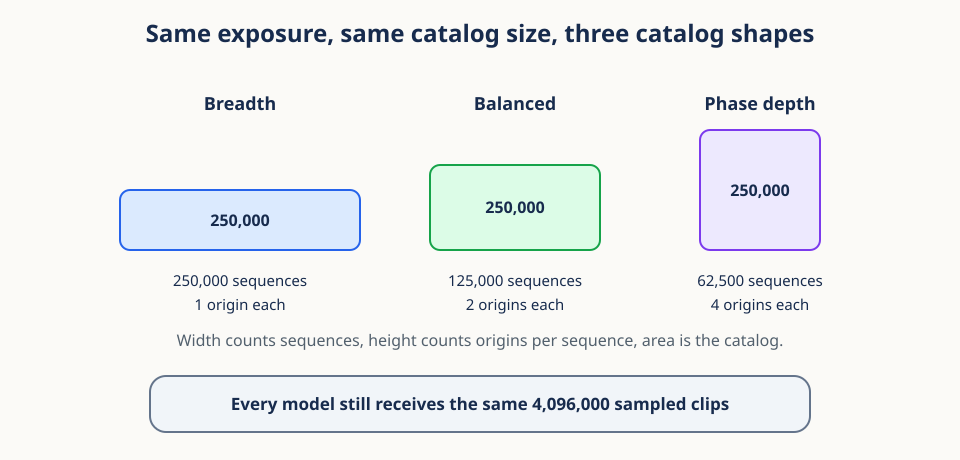
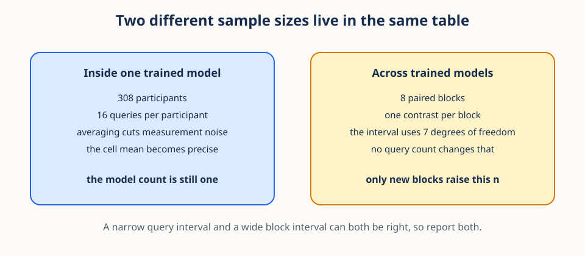

# 15. Exposure, replication, and variance decomposition


## Why this lesson matters

A training run produces several impressive-looking counts: rows in the manifest, examples
seen by the optimizer, models trained. Only some of those counts belong in the denominator
of a standard error. This lesson teaches you which ones, and why mixing them up is the
fastest way to report a confident conclusion that the data cannot support.

The rule underneath everything here is short. Repeating an observation improves how well
you measure it. Only a new independent draw improves how well you know the population it
came from. Every section below is that rule applied to a different level of the video
hierarchy.

## Prerequisites

You should understand grouped observations, means, variance, and confidence intervals.
Review [14. Paired contrasts, uncertainty, and decision thresholds](14_paired_inference.md)
for analysis units and participant-level uncertainty.

## Learning goals

By the end of this lesson, you will be able to:

1. distinguish unique source units, generated rows, and training exposures;
2. describe nested sampling pools and their implied weights;
3. separate randomization, sampling, and analysis units;
4. distinguish participant replication from model-seed replication;
5. interpret variance components in nested and crossed designs;
6. estimate a cluster design effect as an intuition tool;
7. identify leakage and complete-case selection; and
8. preserve complete allocation blocks when resampling participants and model blocks;
9. calculate the residual GFC-minus-completion contrast; and
10. plan an eight-block primary experiment prospectively and state its generalization limits.

## 1. Motivating scenario: 3,600 windows from 20 people

A video study begins with 20 participants. Each participant contributes three sessions,
each session contributes three clips, and every clip produces 20 overlapping windows. The
training table now has 3,600 rows. Training for 50 epochs presents 180,000 row exposures.

How much evidence is there about new people? The answer is not 180,000 and not 3,600. If
the 20 people were independently sampled, the study still contains only 20 independent
participant sampling units. Windows and epochs can improve how well the model learns from
those people, but they do not manufacture new participants. If the people form a convenience
sample, even the 20-person population claim needs to be narrowed accordingly.

The mental model is photocopying. More copies make a document easier to distribute and
read repeatedly. They do not create more independent authors.

## 2. Vocabulary: count the right objects

The photocopy story only helps if you can name the objects being counted, so fix four
terms now and use them consistently for the rest of the lesson.

A **source unit** is an original lineage item from which rows are derived, such as a
participant, session, or recording. Calling something a source unit does not make it
statistically independent. A **row** is one item in the model's input table. A source can
produce many rows through windowing or augmentation. An **exposure** occurs each time a row
is presented during optimization.

A **replicate** is an independently repeated unit at a level relevant to the claim. A newly
and independently sampled participant is a participant replicate. A separately trained
model run with an independently generated random seed is a model-run replicate for
algorithmic randomness. Ten crops of the same frame are repeated measurements, not ten
participant replicates.

These counts answer different questions:

- source count describes sampled breadth;
- row count describes stored training examples;
- exposure count describes computational reuse; and
- replicate counts describe uncertainty across declared random dimensions.

## 3. Nested identifiers and shapes

Those four words become usable once every row carries the identifiers that say where it
came from. The identifiers are the design written down.

Let $p$ index participants, $s$ sessions within a participant, $c$ clips within a session,
and $w$ windows within a clip. Each index runs over the units at one level, so the tuple
`(p, s, c, w)` names exactly one row and also names its whole lineage.

For a balanced design with $P$ participants, $S$ sessions per participant, $C$ clips per
session, and $W$ windows per clip, row count is

$$
N_{\mathrm{row}}=P\times S\times C\times W.
$$

Each symbol is a count at one nested level. With 20, 3, 3, and 20, the product is 3,600.
Real datasets are often unbalanced, so do not infer counts from a rectangular shape when
some participants or sessions contribute more than others. Keep explicit identifiers.


A tidy manifest has one row per model input and columns such as `participant_id`,
`session_id`, `clip_id`, `window_start`, and `source_id`. These identifiers are part of
the statistical design, not optional bookkeeping.

## 4. Unique observations versus repeated exposure

The shape formula above counts rows. Training multiplies that count again through
augmentation and epochs, and it is worth seeing how quickly the two multiplications pull
away from the source count that actually anchors a population claim.

Suppose $N_{\mathrm{source}}$ source items each create $A$ augmented rows and training uses
$E$ epochs, where $A$ is the number of augmented copies per source and $E$ is the number of
passes over the table. Then

$$
N_{\mathrm{row}}=A N_{\mathrm{source}},\qquad
N_{\mathrm{exposure}}=E N_{\mathrm{row}}.
$$

Increasing $A$ or $E$ changes optimization. It does not change $N_{\mathrm{source}}$.
This distinction is essential when a learning curve is plotted against "sample size."
State whether the horizontal axis counts sources, rows, or exposures.

Repeated exposure can still be valuable. It allows stochastic augmentation, visits rare
examples more often, and gives an optimizer time to converge. The mistake is interpreting
its benefit as new independent population coverage.

### Conceptual checkpoint

Changing from 20 to 100 epochs multiplies exposure by five. It leaves participant count,
session count, source diversity, and the participant-level standard-error denominator
unchanged.

### Fixed exposure does not mean fixed support

This distinction is exactly the control the active study is built on, so it is worth seeing
in its research setting. The design fixes sampled-clip exposure at 8,192,000 clips for
every model or, if an outcome-blind throughput rule selects the lower tier, 4,096,000 clips
for every model. Exposure must not differ across cells. That control prevents a model from
winning simply because it received more optimization examples.

What the study varies instead is *support*: which distinct units those fixed draws can
reach. The active allocations hold the nominal catalog at 250,000 sequence-origin atoms and
move those atoms between sequences and phase origins.



Read the figure as one trade at constant area. Breadth spreads 250,000 atoms across 250,000
sequences with one origin each. Phase depth stacks the same 250,000 atoms into 62,500
sequences with four origins each. Balanced sits between them. Exposure, the band beneath,
never moves.

Realized support is still not the same as independent evidence. Repeatedly drawing an
origin can help optimization, and access to more origins can make the training signal more
varied. Neither operation turns overlapping windows into independent source videos. Report
unique sequences, phase origins per sequence, expected or realized sequence-origin pairs,
and sampled-clip exposure as four separate quantities.

## 5. Nested sampling pools imply weights

Once you accept that rows are nested inside sources, a quieter consequence follows: the way
you average those rows silently decides which unit your number describes. Two reasonable
averages of the same table can estimate two different quantities.

Suppose participant $p$ contributes $n_p$ rows with values $y_{pi}$, where $i$ runs over
that participant's own rows. A global row mean is

$$
\bar y_{\mathrm{row}}=\frac{1}{\sum_p n_p}
\sum_p\sum_{i=1}^{n_p}y_{pi}.
$$

This gives participant $p$ weight proportional to $n_p$. It estimates the mean of a
randomly selected row from the collected row pool.

A participant-balanced mean first computes

$$
\bar y_p=\frac{1}{n_p}\sum_{i=1}^{n_p}y_{pi}
$$

and then averages participants:

$$
\bar y_{\mathrm{participant}}=\frac{1}{P}\sum_{p=1}^{P}\bar y_p.
$$

This gives every participant weight $1/P$ regardless of row count. It estimates the mean
for a uniformly selected sampled participant. Neither estimator is automatically correct.
The target population and estimand determine the weighting rule.

### Worked weighting example

Participant A has two scores, both 0. Participant B has eight scores, all 10. The row mean
is 8 because B supplies 80 percent of rows. The participant-balanced mean is 5 because the
two participant means, 0 and 10, receive equal weight.

The same logic can be applied at several levels: average windows within clips, clips within
sessions, sessions within participants, and then participants. Each stage declares which
level receives equal weight.

## 6. Randomization, sampling, and analysis units

Weighting decides whose average you report. A separate set of three definitions decides
which unit carries independence at all, and those three are easy to conflate because in
simple studies they happen to coincide.

The **randomization unit** is independently assigned to an experimental condition. The
**sampling unit** is independently drawn from a target population. The **analysis unit**
contributes an independent contrast or random effect to uncertainty estimation.

These units can coincide, but they need not. In a participant-randomized trial, participant
is the randomization unit. Frames are repeated outcomes. In a clinic-randomized trial, the
clinic is the randomization unit even when thousands of patients are measured.

Calling a row "independent" because it is stored separately is not enough. Independence
comes from the sampling and assignment process. The analysis must preserve the independent
unit implied by that process rather than promoting nested rows to independent units.

The three units answer different questions. Randomization supports a treatment comparison,
sampling supports a target-population claim, and the analysis unit determines how
uncertainty is computed. In a cluster-randomized study that samples clinics, randomizes
clinics, and measures patients, the clinic can be all three units while patients remain
nested outcomes. In other designs the three levels can differ.

## 7. Participants and paired model blocks are different replication axes

In a machine-learning experiment the analysis unit is not one thing, because randomness enters from two directions at once. Participants vary because people differ. Fitted models vary because initialization, data order, augmentation, and pool construction are stochastic. Replicating on one axis says almost nothing about the other, so the two must be counted separately.


The figure shows the active study structure. The study holds eight paired primary blocks. One block holds three trained models: breadth, balanced, and phase depth. Four prespecified blocks also add nearby jitter as a paired diagnostic for phase depth. Inside one trained model sit participants and queries. Uncertainty for the headline comparison is computed at the block level, not at the participant or query level.

Now write the two axes down. Let $Y_{pm}$ be a score for participant $p$ evaluated with model run $m$, so $p$ runs over sampled people and $m$ runs over separately trained runs. A simple crossed random-effects description is

$$
Y_{pm}=\mu+a_p+b_m+e_{pm}.
$$

$\mu$ is the grand mean. $a_p$ is participant deviation, $b_m$ is model-run deviation, and $e_{pm}$ is remaining interaction and measurement variation. Participants and model runs are crossed because every model is evaluated on every participant.

Calling model runs a second replication axis does not make them new data samples. They measure variability of the training procedure conditional on the dataset and protocol. Each run should correspond to a genuinely separate training run; merely evaluating the same fitted weights twice does not create a model replicate.

Assume these deviations have variances $\sigma_a^2$, $\sigma_b^2$, and $\sigma_e^2$. The variance of the grand mean is approximately

$$
\mathrm{Var}(\bar Y)=\frac{\sigma_a^2}{P}
+\frac{\sigma_b^2}{M}+\frac{\sigma_e^2}{PM}.
$$

This decomposition assumes a complete balanced crossing, centered independent random effects, and an estimand that averages over the participant and training-run populations represented by those effects. With missing cells, dependence among runs, fixed hand-picked models, or additional repeated measurements, the formula needs a model that reflects those features.

$P$ is participant count and $M$ is model count. More model runs reduce the second and third terms but do not reduce the participant term. More participants reduce the first and third terms but do not reduce the model-run term. Independent replication on both axes is needed when both are part of the generalization claim.

### Bootstrap the axes named by the claim

The variance formula above tells you which axes matter. A bootstrap has to resample those same axes, or it will estimate the uncertainty of a study you did not run.

For the active primary analysis, `scores` has shape `(block, allocation, participant)`. The allocation axis has breadth, balanced, and phase depth. One crossed sensitivity replicate draws eight complete block indices and $P$ participant indices with replacement:

```python
rng = np.random.Generator(np.random.PCG64(seed))
block_draw = rng.integers(0, B, size=B, endpoint=False)
participant_draw = rng.integers(0, P, size=P, endpoint=False)
sampled = scores[block_draw][..., participant_draw]
```

The two indexing operations are intentionally separate. `scores[block_draw]` selects complete allocation blocks. Indexing the result with `[..., participant_draw]` then selects the same participant columns for every allocation and block. Supplying two advanced index arrays in one bracket can trigger NumPy's paired advanced-indexing rules. More importantly, resampling individual models would destroy the matching that the experiment created.

Compute participant means inside each sampled cell, subtract independent completion from GFC inside the same sampled block and allocation, then calculate one primary contrast inside each sampled block before averaging blocks:

$$
\hat P^{\ast}=\frac{1}{B}\sum_{r=1}^{B}
\left(D^{\ast}_{r,\mathrm{phase\_depth}}-D^{\ast}_{r,\mathrm{breadth}}\right).
$$

Here $D^{\ast}_{r,a}$ is the sampled GFC-minus-completion residual for block $r$ and allocation $a$. The index $r$ names a block, the allocation labels name trained models inside that block, and the star marks a quantity computed on one bootstrap replicate.

The order makes the weighting visible: every sampled participant has equal weight within every sampled cell, every selected block carries all three primary allocations, and every sampled block has equal weight in the final estimate. A participant-only sensitivity omits the block draw and resamples only the last axis, while still carrying every participant's complete allocation profile.

An explicit bit generator strengthens reproducibility. `np.random.default_rng(seed)` is a convenient modern interface, but `np.random.Generator(np.random.PCG64(seed))` records the chosen generator family as part of the analysis contract. A seed alone does not fully name a pseudorandom sequence if the generator algorithm is allowed to change. Store the seed, generator family, replicate count, resampled axes, and interval rule.

Use one documented stream in a documented order or derive independent child streams with a declared spawning rule. Reusing the same seed in several separately constructed generators can accidentally synchronize resamples. Conversely, changing loop order while drawing from one stream changes every later draw. Reproducibility means freezing these choices, not pretending that one seed makes implementation details irrelevant.

Participant-only and crossed intervals answer different questions and should usually differ. The first conditions on the eight observed blocks. The second approximates variation from repeating the block construction and sampling participants. A crossed interval is not automatically more conservative. With only eight blocks, the empirical block distribution is coarse. Report the number of blocks and treat the bootstrap as a sensitivity analysis rather than as a way to manufacture training runs.

### Finite-corpus caveat

One limit survives every resampling scheme in this section, so state it beside every interval rather than in a footnote.

The eight blocks reuse one overlapping finite training corpus. Different pool orderings, phase rotations, and optimization seeds do not create eight independently sampled source corpora. Model-level inference measures joint reproducibility over those declared sources of randomness, conditional on the available corpus. The crossed bootstrap must preserve this limitation in its interpretation.

### Residual GFC-minus-completion contrast

A block-preserving bootstrap gives an honest interval for one outcome. The remaining question is whether that outcome measured something the design cares about, or something a simpler control already explains. Subtracting the control before contrasting answers it.

Let $G_{r,a,p}$ be the GFC margin for block $r$, allocation $a$, and participant $p$. Let $C_{r,a,p}$ be the independent-completion margin for the same participant, allocation, and block. Define the participant-level gap $D_{r,a,p}=G_{r,a,p}-C_{r,a,p}$, average participants within each cell, and calculate

$$
P_r=\bar D_{r,\mathrm{phase\_depth}}-\bar D_{r,\mathrm{breadth}}.
$$

$P_r$ asks whether the allocation changes donor-based recombination beyond the change already explained by independent factor prediction. Resampling must carry $G$ and $C$ together for the same participant, allocation, and block. The frozen margin is 0.0625. A 95 percent interval that excludes zero, together with $|\bar P|\ge0.0625$, defines a resolved primary contrast. A 90 percent interval entirely within `[-0.0625, 0.0625]` supports equivalence at that resolution. Any other result leaves this representation interpretation unresolved.

The nearby-jitter diagnostic uses the same residual construction in its four prespecified blocks:

$$
J_r=\bar D_{r,\mathrm{phase\_depth}}-\bar D_{r,\mathrm{nearby\_jitter}}.
$$

$J_r$ asks whether separated phase content beats local start variation. It has four block values, so it is mechanism evidence with wider uncertainty, not a second primary endpoint.

## 8. Variance components explain shared dependence

The crossed model above split variance across two axes. Nested measurements need the same
treatment in depth rather than in breadth, because rows from one session share more than
rows from one participant.

For nested measurements, a useful model is

$$
Y_{pst}=\mu+a_p+b_{ps}+e_{pst}.
$$

$Y_{pst}$ is trial $t$ from session $s$ of participant $p$. The participant effect $a_p$
is shared by every row from participant $p$. The session effect $b_{ps}$ is shared by rows
from that participant-session. The residual $e_{pst}$ varies at the trial level.


If the three effects are independent with variances $\sigma_a^2$, $\sigma_b^2$, and
$\sigma_e^2$, total row variance is their sum:

$$
\mathrm{Var}(Y)=\sigma_a^2+\sigma_b^2+\sigma_e^2.
$$

Two rows from the same participant share $a_p$, so they are correlated. Two rows from the
same session share both $a_p$ and $b_{ps}$ and are usually even more correlated.

Variance components can be estimated with mixed-effects models, restricted maximum
likelihood, Bayesian hierarchical models, or method-of-moments formulas in balanced
designs. Components estimated from small numbers of groups are uncertain. A component
clipped to zero by a simple method is not proof that the true variation is absent.

## 9. Intraclass correlation and design effect

Knowing that rows inside a cluster are correlated is qualitative. The next two formulas
turn it into a number you can quote, which is useful for building intuition about how badly
a naive row-level standard error understates uncertainty.

For a one-level cluster model with between-cluster variance $\sigma_a^2$ and residual
variance $\sigma_e^2$, the intraclass correlation is

$$
\rho=\frac{\sigma_a^2}{\sigma_a^2+\sigma_e^2}.
$$

$\rho$ is the correlation induced by sharing a cluster effect. With equal cluster size
$m$, a common approximation to variance inflation is

$$
\mathrm{DE}=1+(m-1)\rho.
$$

The letters DE mean design effect. A rough effective sample-size intuition is

$$
N_{\mathrm{eff}}\approx\frac{N_{\mathrm{row}}}{\mathrm{DE}}.
$$

If $m=20$, $\rho=0.5$, and there are 200 rows, then
$\mathrm{DE}=1+19\times0.5=10.5$ and $N_{\mathrm{eff}}\approx19$. This approximation
is a warning about dependence, not a replacement for a cluster-aware model or bootstrap.
Unequal cluster sizes and multiple nesting levels require more careful treatment.

## 10. Leakage follows shared information

Dependence within a cluster inflates uncertainty. The same dependence, if it crosses a
train and test boundary, does something worse: it inflates the score itself.

Leakage occurs when information unavailable at deployment enters training or model
selection. Group leakage is especially common in windowed data. If windows from one clip
or participant appear in both train and test sets, the model can exploit shared identity,
background, sensor, or neighboring frames.

Split groups before creating windows. Fit normalization, feature selection, imputation,
and augmentation policies using training data only. A participant-disjoint split is needed
for claims about new participants. A site-disjoint split is needed for stronger claims
about new sites.

Duplicate hashes are useful but insufficient. Two files can be different at every byte and
still share a source recording or participant artifact. Lineage identifiers must reflect
the true dependence path.

### Leakage audit questions

Ask whether any test participant, session, clip, or temporal neighbor appears in training.
Ask whether preprocessing statistics saw test rows. Ask whether hyperparameters were
repeatedly changed after inspecting final-test performance. Every "yes" narrows what the
test result can honestly claim.

## 11. Complete-case analysis changes the population

Leakage adds units that should not be there. Missingness removes units that should be, and
it quietly narrows the population your estimate describes.

A paired analysis often keeps only participants observed in both conditions. Let $R_i=1$
when participant $i$ is complete and 0 otherwise, so $R_i$ is an indicator of having data
in every condition. The complete-case mean estimates

$$
E[D_i\mid R_i=1],
$$

the mean difference among complete participants. It equals the target population mean only
under missingness assumptions.

The symbol $E$ denotes a population average. The vertical bar means "among units satisfying
the condition," so this expression explicitly limits the target to participants with
$R_i=1$.

If missingness is unrelated to outcomes and covariates, complete cases may remain
representative. If difficult participants are more likely to miss an intervention session,
the retained sample can look easier and the estimate can be biased.

Always report the flow from eligible units to complete units, reasons for missingness, and
baseline differences between included and excluded groups. Sensitivity analysis can fill
missing participant contrasts over a plausible range to show how conclusions change.

### Worked missingness example

Suppose 40 participants are eligible and 8 difficult participants lack intervention data.
The complete-case analysis has 32 participants, not 72 observations. If those 8 would have
shown smaller effects, the complete-case mean overstates population benefit. More bootstrap
replicates cannot recover their unobserved outcomes.

## 12. Prospective locking protects the claim

Weighting, unit choice, splits, and exclusions are all decisions, and every one of them can
be nudged after the fact toward a nicer number. Writing them down first is what keeps the
final interval meaningful.

**Prospective locking** records the analysis before inspecting confirmatory outcomes. A
useful locked manifest includes:

- target population and primary estimand;
- randomization, sampling, and analysis units;
- train, validation, calibration, and test group assignments;
- preprocessing and exclusion rules;
- primary metric and sign convention;
- bootstrap hierarchy, replicate count, and random seed;
- equivalence margins and multiplicity family;
- model-seed count and aggregation rule; and
- stopping and sensitivity-analysis rules.

A versioned file and cryptographic hash make later changes visible. Locking does not make a
bad design good. It separates confirmatory decisions from exploratory learning and prevents
quiet outcome-dependent changes.

### Prospective simulation for eight blocks

The study has a fixed primary model-level sample size of eight complete blocks. Before
outcome access, simulate eight primary contrast values under a range of plausible means,
between-block standard deviations, and tail behaviors. For each simulated study, apply the
exact planned Student $t$ interval and materiality rule. Summarize interval half-width,
probability of excluding zero, and probability that the estimate reaches the 0.0625 margin.

The simulation should also cover residual equivalence, the balanced path shape, and the
nearby-jitter diagnostic interpretation rule. These are different decisions, so one generic power
number is not enough. Use only design assumptions, constructed cases, or external pilot
information. Locked evaluator outcomes cannot tune the assumed effects, variance, margins,
or decision thresholds.

Eight is the number of independent model-level contrasts in every simulated primary
analysis. Simulating more participant observations can reduce within-cell measurement
noise if that component is modeled, but it cannot silently turn the design into more than
eight trained-model blocks. If plausible simulation settings show that eight blocks cannot
provide useful sensitivity at the frozen margins, the study should not launch.

## 13. Generalization is multidimensional

A locked plan states what you will estimate. The last thing to state is what that estimate
travels to, and that is not a single yes or no.

"Generalizes" is incomplete without naming what is new. A model can generalize to new
windows from known clips, new clips from known participants, new participants at known
sites, new devices, new sites, or new model-training randomness. These are different axes.

A held-out axis tests transfer to the particular held-out units. A broader population claim
also requires a defensible sampling frame, enough independent breadth, and exchangeability
assumptions or an explicit model. Merely labeling an effect random does not create missing
sites or participants. Participant replication says little about model-seed instability,
and many model seeds say little about a dataset containing one site.

State the supported claim narrowly. For example: "mean performance across new participants
from the same acquisition sites, averaged over the six sampled model seeds." That sentence
reveals both what varies and what remains fixed.

## 14. Worked end-to-end count and uncertainty example

Every idea in this lesson meets in one small numerical example. Follow the counts and watch how a table with thousands of entries still produces an interval built from eight numbers.



Eight primary blocks each contain breadth, balanced, and phase-depth models. Every model is evaluated on the same 308 complete participants, with 16 GFC queries per participant. The participant-level primary score tensor has shape `(8, 3, 308)`. It contains 7,392 model-participant cell scores, each built from 16 queries, but the primary analysis still contains eight block contrasts.

Suppose the eight primary contrasts have sample standard deviation 0.08. The model-level standard error is

$$
\frac{0.08}{\sqrt{8}}\approx0.028.
$$

The 95 percent interval uses $t_{0.975,7}$, not a normal critical value and not a degrees of freedom count based on participants or queries. Adding participants could reduce noise inside each cell mean. Only additional prospectively matched training blocks would directly increase the model-level replication count.

The nearby-jitter diagnostic has four block contrasts, not eight. If its standard deviation were also 0.08, its standard error would be $0.08/\sqrt{4}=0.04$, and its 95 percent interval would use three degrees of freedom. That wider interval is the price of treating jitter as a mechanism check rather than as a full allocation path point.

## 15. Efficiency and API notes

The accounting in this lesson costs almost nothing at runtime if you set the data
structures up for it, and costs a great deal if you have to reconstruct lineage later.

Keep identifier columns in compact integer form and use grouped reductions. NumPy
`np.unique(..., return_inverse=True)` plus `np.bincount` can compute group sums quickly.
Pandas `groupby` is convenient for manifests. Scikit-learn group splitters enforce group
separation, but you must still choose the correct group key.

For variance components, prefer established mixed-model software when inference matters.
Use simulations to verify that aggregation and resampling reproduce the intended hierarchy.
Store random seeds and exact split maps, not only a verbal description.
For a crossed array, test the index shapes before computing statistics and keep each
resampled axis visible in the code. Generate bootstrap replicates in chunks when the full
index tensor would be too large.

## 16. Misconceptions and failure modes

Each item below is one of the rules above stated as the mistake it prevents. If a draft
paper contains any of these sentences, the fix is usually a recount rather than a new
analysis.

1. **"More epochs increase sample size."** They increase exposure, not source replication.
2. **"Every window is independent."** Overlap and shared source effects create dependence.
3. **"Six seeds solve participant uncertainty."** They address a different variance axis.
4. **"Effective sample size is exact."** The design-effect formula is an approximation.
5. **"Complete cases estimate everyone."** They estimate the retained subpopulation unless
   missingness assumptions justify more.
6. **"No duplicate files means no leakage."** Shared lineage can leak without byte copies.
7. **"One held-out split proves all generalization."** It tests only its held-out axes.
8. **"Preregistration prevents every bias."** It clarifies decisions but cannot fix poor
   measurement, attrition, or unrepresentative sampling.
9. **"One seed fully specifies randomness."** Reproducibility also requires the generator
   family, draw order, and mapping from draws to sampling axes.
10. **"Two index arrays create a crossing."** NumPy advanced indexing can pair arrays;
    apply model and participant selections on separate axes when a Cartesian resample is intended.
11. **"Twenty-eight models mean 28 independent replicates."** The models are paired inside blocks, so the primary analysis has eight model-level contrasts.
12. **"Different pool seeds create independent corpora."** All blocks reuse an overlapping
    finite corpus, so the model-level claim remains conditional on that corpus.

## Exercises

### Exercise 1

One hundred sources create four augmented rows each and train for 25 epochs. Find source,
row, and exposure counts.

**Brief solution:** 100 sources, 400 rows, and 10,000 exposures.

### Exercise 2

For 10 rows per cluster and intraclass correlation 0.3, compute the design effect.

**Brief solution:** $1+(10-1)\times0.3=3.7$.

### Exercise 3

Why does adding model seeds not remove a participant-variance floor?

**Brief solution:** the term $\sigma_a^2/P$ contains no model count. Only more independent
participants reduce it.

### Exercise 4

A study splits windows randomly while every participant appears in both partitions. What
generalization does the test measure?

**Brief solution:** at best it measures new windows from known participants and sources,
not transfer to unseen participants.

### Exercise 5

What population does a complete-case paired mean directly describe?

**Brief solution:** participants who satisfy the completeness rule, written
$E[D_i\mid R_i=1]$.

### Exercise 6

A score tensor has shape `(8, 3, 308)`. What shape remains after drawing eight complete
block indices and 308 participant indices with the two-step indexing shown above?

**Brief solution:** `(8,3,308)`. Sampling is with replacement, so identifiers may repeat,
but the bootstrap preserves the allocation axis and the original sample sizes.

### Exercise 7

Why is independently resampling the 28 models not the intended crossed bootstrap?

**Brief solution:** independent model draws can combine allocations from unrelated
blocks. The desired resample selects whole blocks, carrying the matched allocation cells,
and then selects the same participant indices across every cell.

### Exercise 8

Why does fixed sampled-example exposure not make breadth and phase depth identical?

**Brief solution:** exposure counts optimization draws. Support counts which distinct
sequences and sequence-origin pairs are available to those draws. The experiment fixes the
former and intentionally changes the latter.

## Recap

Row count, source count, exposure, support, and replication are different quantities.
The hierarchical-diversity analysis keeps primary scores in an `(8, 3, participant)` tensor.
Participant-only resampling carries every participant's complete allocation profile, while crossed
resampling also carries every selected block's three primary allocation cells. The residual
GFC-minus-completion contrast uses the same pairing, and the four-block jitter diagnostic
uses its own matched blocks. Prospective simulation must keep the primary model-level sample size
at eight and must not use outcome aggregates. These rules make the evidence and its
finite-corpus limits auditable.

## Continue

- Previous: [14. Paired contrasts, uncertainty, and decision thresholds](14_paired_inference.md)
- Notebook: [15. Exposure, replication, and variance decomposition](../implementations/15_exposure_and_replication.ipynb)
- Next: [16. Reproducible scientific evaluators and numerical contracts](16_reproducible_scientific_evaluators.md)
- Curriculum: [Tutorial README](../README.md)
