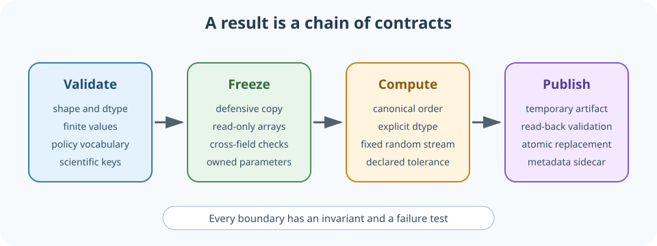
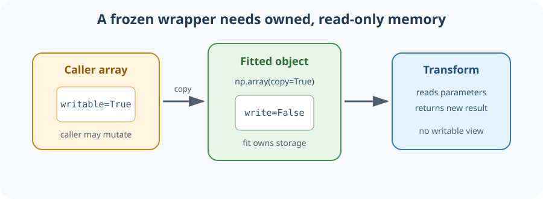
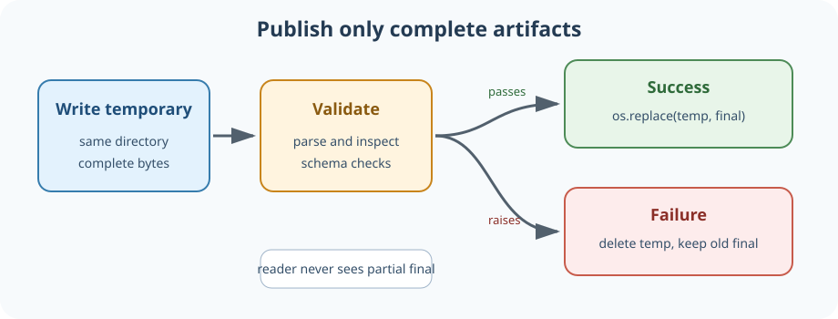

# 16. Reproducible scientific evaluators and numerical contracts



## Why this lesson matters

A scientific evaluator is more than a formula. It receives arrays and metadata, fits
parameters on an allowed population, freezes those parameters, transforms new data,
aggregates scores, and writes artifacts that other programs will trust. Each boundary can
silently change the result even when the central equation is correct.

Imagine a fitted linear adapter stored in a frozen Python dataclass. The object appears
immutable, yet its NumPy coefficient array can still be modified in place. Imagine a fit
whose result changes in low-order bits when input rows arrive in a different order. Imagine
a process that crashes halfway through writing a result file and leaves a valid filename
containing invalid JSON. These are not cosmetic software defects. They undermine the claim
that the same declared analysis produces the same auditable result.

This lesson develops a small engineering vocabulary for trustworthy numerical pipelines.
The aim is not bitwise identity across every processor and library build. The aim is to
make mutability, ordering, typing, validation, serialization, and failure behavior explicit
enough that a result can be reproduced and discrepancies can be localized.

## Prerequisites

You should understand NumPy arrays, dataclasses, fitted transformations, and participant-
level analysis. [Lesson 10](10_regularized_linear_estimation.md) supplies the linear adapter,
[Lesson 14](14_paired_inference.md) supplies inference, and
[Lesson 15](15_exposure_and_replication.md) supplies analysis-unit and random-stream design.

## Learning goals

By the end of this lesson, you will be able to:

1. distinguish mathematical, numerical, and artifact-level reproducibility;
2. build a frozen dataclass that owns read-only NumPy arrays;
3. validate derived invariants in `__post_init__`;
4. use `Literal`, `Mapping`, and `Sequence` to state policy and input contracts;
5. remove irrelevant row-order variation with an exact deterministic key;
6. explain when exact-byte comparison is appropriate and when tolerance is appropriate;
7. publish an artifact with a same-directory temporary file and `os.replace()`;
8. test failure behavior without corrupting the previous valid artifact; and
9. validate an exact eight-block by four-cell training registry;
10. bind manifests and final-step checkpoints to cryptographic digests; and
11. publish privacy-safe summaries without exposing participant identifiers.

## 1. Reproducibility has several layers

**Mathematical reproducibility** means the estimand, equations, and decision rules are
specified. Two implementations of the same ridge objective should target the same
solution. **Numerical reproducibility** means dtype, reduction order, decomposition policy,
tolerances, and random generator are controlled closely enough for the intended comparison.
**Artifact reproducibility** means saved outputs are complete, self-describing, and not
partially replaced after a failure.

These layers support different checks. A proof or derivation addresses the mathematical
layer. Assertions about shape, finiteness, and row-order invariance address the numerical
layer. Temporary files, atomic replacement, schema versions, and metadata sidecars address
the artifact layer. Passing one layer does not imply the others are correct.

Suppose a fitted adapter maps a row $x$ to $K$ outputs:

$$
f(x)=(x-\mu)S^{-1}W+b.
$$

$\mu$ is the training mean, $S$ is a diagonal scale matrix, $W$ is a coefficient matrix,
and $b$ is an intercept. Reproducing this map requires more than remembering $W$. The fit
must store the feature order, mean, scale, intercept, dtype convention, regularization
policy, and any rule used for zero-variance features.

## 2. A frozen dataclass is only shallowly frozen

`@dataclass(frozen=True)` prevents rebinding an attribute through normal assignment. It
does not recursively freeze objects referenced by that attribute. A NumPy array owns or
views mutable memory, so this object is still vulnerable:

```python
from dataclasses import dataclass
import numpy as np

@dataclass(frozen=True)
class UnsafeFit:
    coefficients: np.ndarray

source = np.array([[1.0], [2.0]])
fit = UnsafeFit(source)
source[0, 0] = 999.0
assert fit.coefficients[0, 0] == 999.0
```

The caller retained an alias to the same storage. Mutation changed the supposedly fitted
object without assigning to `fit.coefficients`. A second problem remains even if the
constructor copies the input: code holding `fit.coefficients` can mutate that stored copy.



The fitted object should own its arrays and mark them read-only. The ownership rule
prevents caller aliases from changing fitted state. The write flag prevents ordinary
in-place mutation through the stored array. Together they turn an informal convention into
an executable boundary.

## 3. Defensive copies and read-only arrays

Use `np.array(..., copy=True)` when ownership matters. `np.asarray` may return the caller's
existing array without copying, which is efficient but inappropriate for a durable fitted
parameter. After conversion and validation, disable writes:

```python
def readonly_matrix(value, label):
    array = np.array(value, dtype=np.float64, copy=True)
    if array.ndim != 2 or not array.size:
        raise ValueError(f"{label} must be a nonempty matrix")
    if not np.isfinite(array).all():
        raise FloatingPointError(f"{label} contains non-finite values")
    array.setflags(write=False)
    return array
```

The function fixes dtype, rank, non-emptiness, finiteness, ownership, and mutability. Those
are separate invariants. A rectangular array with the wrong width can still be invalid for
a particular fitted model, so model-specific shape checks belong at the next layer.

A read-only flag is a strong guard against accidental mutation, not a cryptographic
security boundary. Expert code can sometimes recover writable aliases or copy and replace
data elsewhere. The goal is to make ordinary misuse fail immediately and locally.

Views require care. A view of a read-only array normally remains read-only, but an array
constructed from external shared memory can have a more complex ownership story. Durable
fit objects should prefer owned contiguous copies unless a documented zero-copy contract is
necessary and thoroughly tested.

## 4. Validate frozen objects in `__post_init__`

A frozen dataclass cannot assign attributes normally during `__post_init__`. Python
provides `object.__setattr__` for controlled construction-time initialization. Use it only
after validation:

```python
from dataclasses import dataclass, field

@dataclass(frozen=True)
class LinearFit:
    coefficients: np.ndarray = field(repr=False, compare=False)
    intercept: np.ndarray = field(repr=False, compare=False)
    input_width: int

    def __post_init__(self):
        weights = readonly_matrix(self.coefficients, "coefficients")
        bias = np.array(self.intercept, dtype=np.float64, copy=True)
        if bias.ndim != 1 or weights.shape != (self.input_width, len(bias)):
            raise ValueError("fit dimensions are inconsistent")
        if not np.isfinite(bias).all():
            raise FloatingPointError("intercept contains non-finite values")
        bias.setflags(write=False)
        object.__setattr__(self, "coefficients", weights)
        object.__setattr__(self, "intercept", bias)
```

`repr=False` keeps large arrays out of diagnostic text. `compare=False` avoids ambiguous
elementwise array equality in generated dataclass comparisons. Neither option affects the
numeric behavior; they define a safer Python object interface.

Constructor validation should establish relationships, not only local properties. If
coefficients have shape `(D,K)`, the intercept must have shape `(K,)`, the stored input
width must equal `D`, and any label list must contain `K` entries. Rejecting a bad fit at
construction is clearer than discovering the inconsistency during the tenth transform.

## 5. Type hints state policy families

Scientific pipelines often accept strings that select policies. A bare `str` hides the
allowed vocabulary. `Literal` makes the active $2\times2$ protocol visible to readers and
type checkers:

```python
from collections.abc import Mapping, Sequence
from typing import Literal

SequenceSupport = Literal["low", "high"]
WindowPolicy = Literal["frozen_random", "resampled_anchor"]

def select_cell(*, support: SequenceSupport, policy: WindowPolicy):
    ...

def score(distances: Mapping[str, float], target_id: str):
    ...
```

`Sequence` accepts ordered list-like inputs without promising mutation. `Mapping` accepts
dictionary-like key-value inputs without requiring a concrete `dict`. These abstract types
state what the function needs. Runtime validation is still required because Python does
not enforce annotations automatically and external data can bypass static checking.

Policy names should also be validated against configuration schemas. A type hint helps a
developer, while a runtime check protects the actual analysis. The registry must reject
old rung labels and close spelling variants. Keeping one canonical set of names prevents
code, documentation, and serialized metadata from drifting apart.

### Validate the exact $2\times2\times8$ registry

The hierarchical-diversity registry is a scientific object, not just a job list. It must
contain exactly 32 unique model rows. Replicate blocks are numbered 0 through 7. Every
block must contain exactly these four cells:

```text
low,  frozen_random
low,  resampled_anchor
high, frozen_random
high, resampled_anchor
```

Validation should compare the observed set of `(replicate, sequence_support,
window_policy)` tuples with the complete expected Cartesian product. Counting 32 rows is
not enough because a duplicate can hide a missing cell. Model labels must also be unique.
Reject extra cells, incomplete blocks, duplicate cells, unknown policy names, and old
scaling-study registries.

Within one block, all four cells share the optimization and replicate seeds. The two low
cells share one low manifest, and the two high cells share one high manifest. Every row
uses the same frozen training exposure and anchor spacing. The low sequence count must be
smaller than the high count, and each recorded count must equal the number of sequences in
its verified manifest. Window, temporal, spatial, and mask stream versions must match the
frozen protocol across all rows. These are cross-row invariants, so a schema that checks
each row separately cannot establish them.

### Validate nested pools, not only manifest filenames

For each block, the low source-group set must be a strict subset of the high source-group
set. The high manifest must contain every low sequence with the same scientific identity.
The same sequence must map to the same frozen anchor in both manifests. A shared filename
or equal sequence count does not prove any of these relationships.

Store a canonical digest of each manifest after sorting by stable scientific identifiers
and serializing with a fixed encoding and field order. Validate both the digest and the
nested-pool relationship. A digest proves byte identity with the frozen artifact. The
explicit nesting check proves the scientific relationship between two different artifacts.

### Bind evaluation to the final-step checkpoint

Checkpoint provenance should include model label, block, cell, optimization seed, training
exposure, completed step, configuration digest, manifest digest, window-policy version,
temporal-stream version, spatial-stream version, mask-stream version, and checkpoint
content digest. Evaluation accepts only the checkpoint whose completed step equals the
frozen final step.

The checkpoint digest detects changed bytes. The metadata fields detect a checkpoint that
is internally valid but belongs to a different registry row or protocol version. Both
checks are necessary. A file named `final.pt` is not evidence that training reached the
declared final step.

### Resume and evaluation must fail closed

A resume operation may proceed only when every frozen field in the saved run state agrees
with the selected registry row and current protocol. Evaluation applies the same rule to
the final-step checkpoint and feature export. If a manifest digest, exposure, policy,
seed, stream version, model label, or final step differs, stop before loading outcomes or
writing a replacement artifact.

Fail closed means that missing provenance is a mismatch, not permission to guess. Do not
silently patch old metadata, infer a policy from a directory name, substitute a nearby
checkpoint, or resume into an existing run directory after a partial validation. A clear
error is safer than an apparently complete result with uncertain lineage.

### Freeze the protocol before outcomes

Before Health&Gait outcome access, create a timestamped, content-addressed protocol
snapshot. It includes manifests, registry, policies, exposure, checkpoint rule, failure
rules, GFC-v2 evaluator, completion controls, materiality margins, statistical code, and
figure templates. Throughput can choose between the two predeclared exposure tiers only by
the frozen outcome-blind rule.

The snapshot digest makes later changes visible. It does not prove the protocol is good,
but it separates planned analysis from revisions made after outcome inspection. Any
approved correction should create a new version with an explicit reason rather than
overwriting the old protocol state.

## 6. Remove irrelevant row-order variation

Mathematical sums are order independent over real numbers. Floating-point sums are not
perfectly associative. A matrix fit can therefore differ in low-order bits when identical
rows arrive in a different order. Sometimes tolerance-based equality is enough. When a fit
must be serialized deterministically, sort rows by a stable scientific key before every
order-sensitive reduction.

Text conversion with ordinary decimal formatting can collapse distinct floats or depend
on formatting choices. Python's `float.hex()` gives an exact hexadecimal representation
of a finite binary float. One deterministic numeric row key is

$$
k(x_i)=\bigl(\mathrm{hex}(x_{i1}),\ldots,\mathrm{hex}(x_{iD})\bigr).
$$

In code:

```python
order = sorted(
    range(len(rows)),
    key=lambda index: tuple(float(value).hex() for value in rows[index]),
)
ordered = rows[np.asarray(order, dtype=int)]
```

Scientific identifiers should precede numeric values when they define a natural order.
For a factorial participant table, a useful key may be participant identifier, canonical
cell index, then exact feature hex values. The numeric suffix resolves duplicate metadata
deterministically.

Sorting does not make floating-point arithmetic exact or portable across every BLAS
implementation. It removes one known irrelevant source of variation. Record library and
hardware details when exact cross-platform bytes matter, and prefer invariant comparisons
when the science concerns geometry rather than coordinate orientation.

## 7. Exact equality and tolerance answer different questions

Use exact equality for discrete protocol structure, identifiers, counts, schema versions,
and values produced by exact rational enumeration. Use tolerance for numerical values whose
derivation includes floating-point operations and whose acceptable scale is specified.

A common comparison is

$$
|a-b|\leq t_{\mathrm{abs}}+t_{\mathrm{rel}}|b|.
$$

Absolute tolerance controls behavior near zero. Relative tolerance scales with a reference
magnitude. For a bounded distance with a declared protocol tie rule, an absolute tolerance
alone may be the scientific definition. For implementation agreement across linear algebra
backends, a combination can be appropriate.

Do not use a large tolerance to conceal nondeterminism that should have been removed. Do
not require exact equality for a quantity whose solver legitimately differs in rounding.
Write down whether a check protects protocol identity, serialized determinism, or numeric
agreement before choosing the comparison.

## 8. Publish artifacts atomically

Writing directly to the final destination exposes partial content if the process fails.
Instead, create a temporary file in the destination directory, write and validate it, then
replace the destination with `os.replace`. Same-directory placement matters because atomic
rename guarantees are normally scoped to one filesystem.



```python
import json
import os
from pathlib import Path
import tempfile

def atomic_json(payload, destination):
    destination = Path(destination)
    destination.parent.mkdir(parents=True, exist_ok=True)
    descriptor, temporary_name = tempfile.mkstemp(
        prefix=f".{destination.name}.", suffix=".tmp", dir=destination.parent
    )
    os.close(descriptor)
    temporary = Path(temporary_name)
    try:
        temporary.write_text(json.dumps(payload, sort_keys=True) + "\n")
        json.loads(temporary.read_text())
        os.replace(temporary, destination)
    finally:
        temporary.unlink(missing_ok=True)
```

`try/finally` cleans up the temporary path after success or failure. `os.replace` replaces
an existing file where supported, so readers see either the previous complete artifact or
the new complete artifact, rather than an intermediate stream of bytes.

Atomic replacement is not the same as durable storage after sudden power loss. Durability
can require flushing file content and directory metadata with platform-specific care. For
ordinary analysis pipelines, atomic visibility is already a major improvement. State the
guarantee actually implemented instead of calling every temporary-file pattern fully
transactional.

Multiple related files present another challenge. Replacing a table and then its metadata
sidecar is not one atomic transaction across both paths. Include a content digest or run
identifier in each artifact, or publish a completed directory through a versioned pointer,
when readers must verify that a bundle belongs together.

### Publish only privacy-safe summaries

The private analysis may use participant identifiers to preserve pairing and detect
duplicates. Public artifacts must not contain those identifiers, participant-level rows,
recording paths, embeddings, nearest-neighbor examples, or identity-capable checkpoints.
Aggregate cell means, replicate-level contrasts, interval endpoints, protocol versions,
and non-sensitive digests are sufficient for the planned public summary.

Privacy validation should inspect keys and values recursively before the temporary file is
written. A top-level allowlist is not enough if a nested diagnostics object can carry a
participant identifier. Use an explicit public schema, reject unknown fields, and test
that participant-like keys and private path fragments cannot pass serialization.

Atomic publication and privacy checking belong in one transaction boundary. First build
the public payload in memory. Next validate its schema and privacy constraints. Then write
and parse the same-directory temporary file. Finally replace the destination. If any step
fails, keep the previous complete public summary and remove the temporary file.

## 9. Test the failure path

Happy-path tests are insufficient for artifact code. Begin with a valid destination, force
an exception after writing the temporary file but before replacement, and assert that the
old destination remains unchanged. Also assert that temporary files are removed.

Failure injection can be simple. Let the writer accept a validation callback that raises,
or patch the serialization step in a unit test. The test should resolve the exact temporary
directory and use a narrow filename prefix so it does not confuse unrelated files.

For immutable fits, test aliasing and mutation failures. Construct a fit from a source
array, mutate the source, and verify stored parameters do not change. Attempt to mutate the
stored array and expect a `ValueError`. Transform the same rows after permuting fit input
order and compare outputs under the declared exact or tolerance policy.

## 10. Build an auditable fit-transform interface

A fitted object should expose behavior and diagnostics, not writable internals. A
`transform` method validates shape and finiteness, performs the declared dtype conversion,
and returns a fresh result. A `diagnostics` method returns JSON-compatible scalars and
policy names rather than array references.

```python
def transform(self, rows):
    matrix = np.asarray(rows, dtype=np.float64)
    if matrix.ndim != 2 or matrix.shape[1] != self.input_width:
        raise ValueError("unexpected input shape")
    if not np.isfinite(matrix).all():
        raise FloatingPointError("input contains non-finite values")
    return np.einsum(
        "nd,dk->nk", matrix, self.coefficients, optimize=False
    ) + self.intercept
```

The result is new storage, so callers can modify it without corrupting the fit. If output
arrays must also be immutable, copy and mark them explicitly. Avoid returning a mutable
view into fitted parameters.

Diagnostics should include fit row count, input and output dimensions, method names,
regularization strength, dtype, and random settings when relevant. They should not include
private participant identifiers or raw training rows. Auditability and privacy are both
interface design requirements.

## 11. End-to-end invariant ladder

Validate from local to global. First check scalar policies and row fields. Then compare the
registry with the exact 32-cell Cartesian product. Next verify seed equality within block,
manifest reuse within support level, strict low-within-high nesting, and common exposure.
Then verify manifest and checkpoint digests, final-step provenance, and frozen stream
versions. Finally validate the privacy-safe summary, parse the temporary bytes, and publish
atomically.

This ladder localizes failures. If a read-back digest differs but in-memory results match,
the bug is in serialization. If row permutation changes fitted bytes but not predictions
within tolerance, the mathematical result is stable while the serialization contract is
not. If predictions change materially, the fit itself depends on an unintended ordering.

Property-oriented tests are useful even without a property-testing library. Start from one
valid synthetic registry and independently delete a cell, duplicate a cell, change one
seed, swap one manifest, break nesting, alter one digest, lower one completed step, and add
one participant identifier to the public payload. Every mutation should fail for the
specific reason being tested.

## 12. Efficiency notes

- Copy fitted parameters once at construction, not on every transform.
- Mark stored arrays read-only after all construction-time calculations finish.
- Sort only at fit boundaries where reduction order matters.
- Store compact diagnostics rather than serializing large arrays twice.
- Use same-directory temporary files so replacement does not cross filesystems.
- Validate a temporary artifact before replacement when parsing is inexpensive.
- Use explicit dtypes on sensitive reductions and serialized numeric arrays.
- Benchmark deterministic conventions, but do not remove them without changing the contract.
- Generate the 32 expected registry keys once and compare them with a set of observed keys.
- Cache verified manifest and checkpoint digests by immutable path and file metadata only
  within one validation process.
- Validate private inputs before loading participant outcomes, then build a separate
  allowlisted public payload.

Immutability often improves reasoning more than runtime. A fit that cannot change can be
shared safely among evaluation functions without defensive copying at every call. Atomic
replacement avoids recovery work after interrupted runs. Deterministic ordering may add a
sorting cost, but fitting usually dominates that cost and the reproducibility benefit can
be substantial.

## 13. Common failure modes

1. **Frozen wrapper, mutable array:** attribute assignment fails but in-place mutation succeeds.
2. **`np.asarray` mistaken for ownership:** the fit aliases caller memory.
3. **Validation after storage:** an invalid object exists before checks finish.
4. **Array equality in dataclass comparison:** generated equality receives an array of booleans.
5. **Decimal strings as exact keys:** formatting hides distinct binary values.
6. **Tolerance without a scale:** the comparison has no scientific interpretation.
7. **Temporary file on another filesystem:** replacement may not be atomic.
8. **Cleanup only on success:** failed runs accumulate misleading temporary artifacts.
9. **Several files called one transaction:** readers can observe mismatched generations.
10. **Canonicalization called interpretation:** deterministic coordinates are mistaken for uniquely identified scientific axes.
11. **Count-only registry check:** 32 rows pass even though one cell is duplicated and one
    is missing.
12. **Filename provenance:** a checkpoint named `final` is accepted without checking its
    completed step or digest.
13. **Best-effort resume:** a seed or manifest mismatch produces a warning and training
    continues.
14. **Private public summary:** participant identifiers survive inside a nested diagnostics
    object.

## 14. Exercises

### Exercise 1

Why are both `copy=True` and `setflags(write=False)` needed for a fitted array?

**Brief solution:** copying breaks aliases held by the caller. The write flag prevents
ordinary mutation through the array stored by the fit. Either one alone leaves a mutation path.

### Exercise 2

A coefficient matrix has shape `(12,3)` and an intercept has shape `(4,)`. At which boundary
should the inconsistency fail?

**Brief solution:** during fitted-object construction. Delaying the check until transform
allows an invalid durable object to circulate.

### Exercise 3

Why can sorting rows by `str(float_value)` be weaker than sorting by `float.hex()`?

**Brief solution:** decimal string formatting is a presentation convention and may omit
binary detail. `float.hex()` represents the finite binary float exactly.

### Exercise 4

What does atomic replacement guarantee to a concurrent reader, and what does it not
necessarily guarantee after a sudden power failure?

**Brief solution:** the reader observes the old complete file or the new complete file,
not a partially written destination. Durable persistence can additionally require file and
directory synchronization.

### Exercise 5

Should two bases spanning the same tied eigenspace be compared by exact coordinates?

**Brief solution:** not when the scientific object is the subspace. Compare their
projectors or principal angles. Exact axes are appropriate only after a declared canonical
coordinate convention is part of the software contract.

### Exercise 6

Design a failure test for `atomic_json`.

**Brief solution:** create a valid destination, arrange for serialization or validation to
raise before `os.replace`, then assert the original bytes remain and no matching temporary
file survives.

### Exercise 7

A registry has 32 rows and eight replicate labels. Why must validation still compare the
complete set of block and cell tuples?

**Brief solution:** the row count can hide one duplicated cell and one missing cell. Set
equality with the expected $8\times2\times2$ product detects both problems.

### Exercise 8

The low and high manifest digests are both valid, but one low source group is absent from
the high manifest. Can the block run?

**Brief solution:** no. Each digest only establishes identity for one artifact. The
scientific design separately requires the low group set to be a strict subset of the high
group set.

### Exercise 9

A checkpoint matches the model label and manifest digest but stopped one update before the
frozen final step. Should evaluation use it?

**Brief solution:** no. The final-step rule is part of the estimand and checkpoint
contract. Evaluation must fail closed.

### Exercise 10

Why should a public summary use an allowlisted schema instead of deleting a known
`participant_id` column at the end?

**Brief solution:** private identifiers or paths can appear under other names or inside
nested objects. An allowlist makes every published field intentional and rejects unknown
content before atomic publication.

## Recap

A reproducible scientific evaluator validates the exact eight-block four-cell registry,
proves low-within-high nesting, binds manifests and final-step checkpoints to digests, and
freezes every seed and stream version before outcomes. Resume and evaluation stop on any
mismatch. Public summaries pass a privacy allowlist before same-directory atomic
publication and never include participant identifiers. These checks make the declared
method harder for software behavior to change silently.

## Continue

- Previous: [15. Exposure, replication, and variance decomposition](15_exposure_and_replication.md)
- Notebook: [16. Reproducible scientific evaluators](../implementations/16_reproducible_scientific_evaluators.ipynb)
- Next: [17. Hierarchical support interventions and blocked factorial inference](17_hierarchical_support_and_factorial_inference.md)
- Curriculum: [Tutorial README](../README.md)
