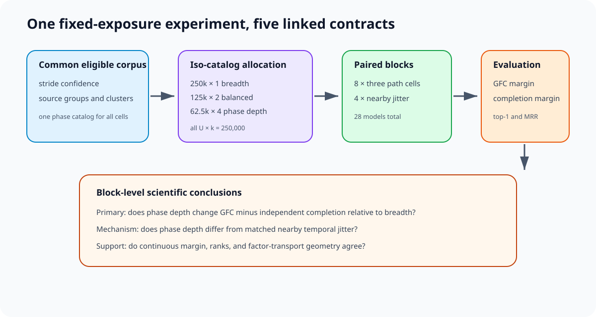
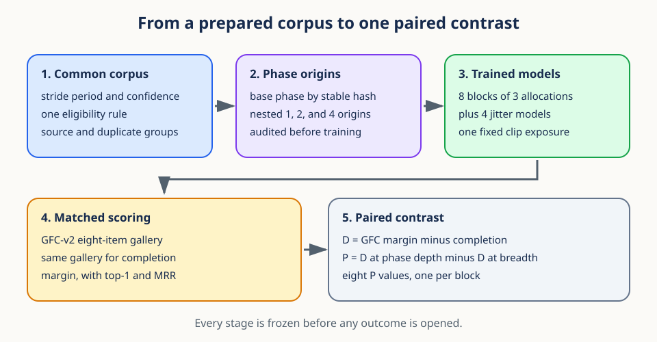
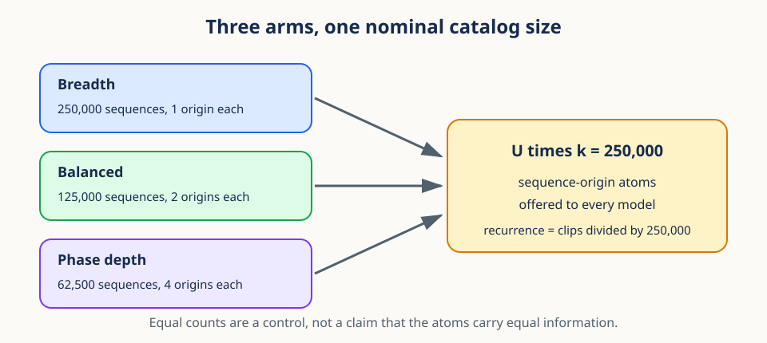
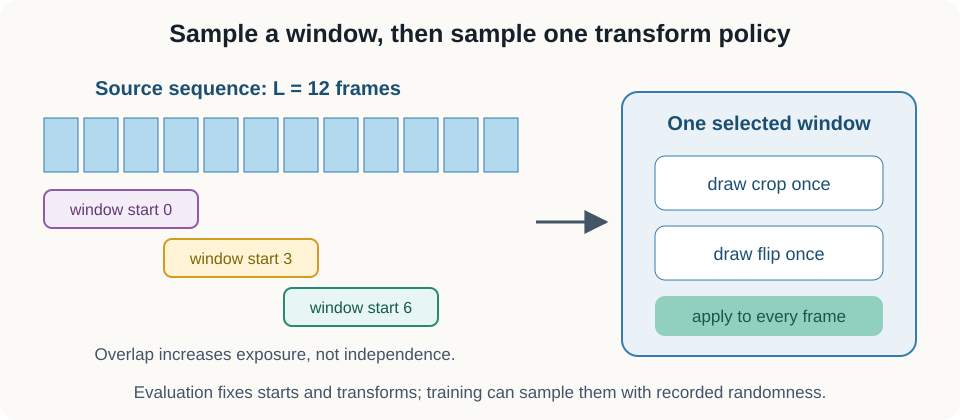
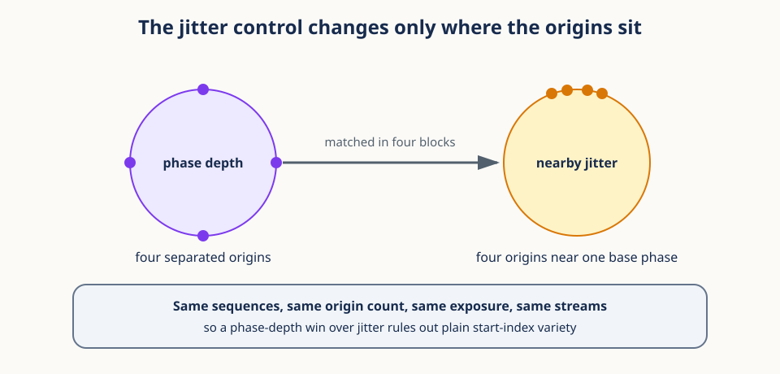
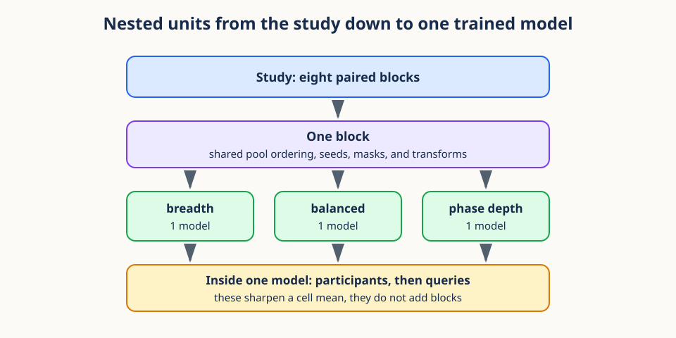
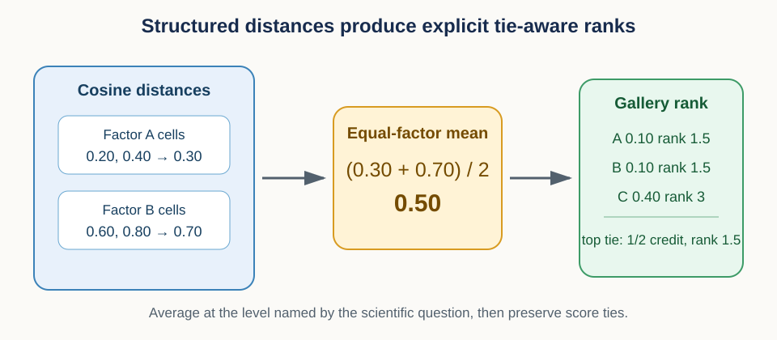

# 17. Iso-catalog phase allocation and paired inference

## Why this capstone matters

Video data are hierarchical. A model can see a walking sequence it has never seen before,
or it can see a new part of a sequence it already knows. Both add variety. They are not the
same intervention, and nothing in a training log tells you which one you bought.

This lesson asks one question and answers it with a single controlled experiment. Suppose
two models process exactly the same number of clips, and suppose the same number of
distinct sampling opportunities is laid out in front of each of them. Does it matter
whether those opportunities are spread thinly across many sequences or stacked as several
deliberately different moments inside fewer sequences?

You cannot settle that by counting files, clip starts, or optimizer steps. Those counts are
equal by construction here. The experiment holds the counting equal on purpose so that the
only remaining difference is where in the hierarchy the variety lives, and then measures
whether a downstream capability moves.

Every tool needed for this already appeared in the curriculum. This lesson does not
introduce new machinery. It assembles the machinery you have into one scientific argument
and shows you which lesson supplied each part.

## Prerequisites

Every section below leans on an earlier lesson, so read this after the rest of the
curriculum rather than before it.

Review [08. Group-aware sampling and shortcut learning](08_group_aware_sampling.md) for
groups and temporal origins, [11. Factorial state spaces](11_factorial_state_spaces.md)
through [13. Context interventions and identity geometry](13_context_interventions.md) for
factorial retrieval, and [14. Paired contrasts and uncertainty](14_paired_inference.md)
through [16. Reproducible scientific evaluators](16_reproducible_scientific_evaluators.md)
for uncertainty and provenance.

## Learning goals

By the end of this lesson, you will be able to distinguish exposure from nominal catalog
cardinality, build nested phase-origin sets, explain why nearby jitter is the control that
makes the result interpretable, calculate the GFC-minus-independent-completion contrast,
preserve paired blocks during uncertainty estimation, and state plainly what this design
can and cannot conclude.

## 1. The whole study in five stages

Before any detail, here is the shape of the thing. The method runs from a prepared video
corpus to a single list of eight numbers, and each stage is frozen before anyone looks at
an outcome.

Stage one builds a common eligible corpus. Stage two chooses phase origins inside each
eligible sequence. Stage three trains 28 models under one fixed clip exposure. Stage four
scores every model with a factorial retrieval instrument and a matched control. Stage five
reduces the whole thing to eight paired differences and one interval.

Here is where each stage comes from. Stage one is the group and duplicate discipline of
[Lesson 08](08_group_aware_sampling.md). Stage two is the temporal-origin construction of
Lesson 08 combined with the leakage vocabulary of
[Lesson 03](03_hierarchical_observations.md). Stage three is the exposure and replication
accounting of [Lesson 15](15_exposure_and_replication.md) plus the schedule and resume
contracts of [Lesson 07](07_gradient_updates_and_schedules.md). Stage four is the factorial
gallery of [Lessons 11](11_factorial_state_spaces.md) through
[13](13_context_interventions.md), scored with the blockwise distance and ranking rules of
[Lesson 12](12_blockwise_distances_and_ranking.md). Stage five is the paired contrast of
[Lesson 14](14_paired_inference.md), executed under the frozen-artifact rules of
[Lesson 16](16_reproducible_scientific_evaluators.md).

The rest of this lesson walks the five stages in order and stops at each one long enough to
say what could go wrong there.

## 2. Start with the allocation, not with an accuracy table

The intervention is a single arithmetic trade. Let `U` be the number of eligible sequences
a model may draw from, and let `k` be the number of deliberately chosen phase origins per
sequence. The product `U × k` counts the sequence-origin atoms available to that model.
This product is called the *nominal catalog size*, and the study holds it fixed while
moving `U` and `k` in opposite directions.

| Allocation | `U` | `k` | `U × k` |
| --- | ---: | ---: | ---: |
| Breadth | 250,000 | 1 | 250,000 |
| Balanced | 125,000 | 2 | 250,000 |
| Phase depth | 62,500 | 4 | 250,000 |
| Nearby jitter | 62,500 | 4 | 250,000 |

The first three rows are the allocation path: one extreme, one middle point, the other
extreme. The fourth row is not a path point. It is a control for the phase-depth end, and
Section 4 explains what it controls for.

Read the trade concretely. Breadth offers a quarter of a million different walks and looks
at each one from a single moment. Phase depth offers 62,500 walks and looks at each one
from four moments spread around the stride. Balanced sits halfway: 125,000 walks, two
moments each. Multiply any row and you get the same 250,000.

That equality earns the name *iso-catalog*, and it buys exactly one thing: it removes the
explanation "that model simply had more choices". It does not buy equal information. A new
sequence can carry a different person, a different camera, a different floor. A second
origin in a sequence you already have carries, at best, a different part of one gait cycle,
and the two clips may overlap heavily. So the honest statement is that the counts are
equal, not that the atoms are equal.

## 3. Fixed exposure, and the recurrence it implies

Equal catalogs would prove nothing if one model also trained longer, so the second control
holds optimization constant. Every model shares architecture, objective, optimizer,
schedule, mask distribution, spatial transformations, batch size, and checkpoint rule, and
every model consumes the same number of sampled clips.

Call that number `C`. Since each model has 250,000 nominal atoms available, the planned
number of times an average atom is drawn is `C / 250,000`. This ratio is the *recurrence*.
An outcome-blind systems test picks one exposure tier once, for all 28 models, before any
outcome is opened: 8,192,000 clips or 4,096,000 clips. Those give recurrences of about
32.77 and about 16.38 respectively. The tier is never chosen to favor a cell.

Work the smaller tier through by hand. At 4,096,000 clips, breadth draws each of its
250,000 single-origin atoms about 16 times, and phase depth draws each of its 250,000
atoms about 16 times too. The recurrence is identical. What differs is that phase depth's
250,000 atoms sit inside only 62,500 distinct walks, so the same 16 draws revisit a much
smaller set of underlying sequences.

That last sentence is the whole reason recurrence must be reported.
[Lesson 15](15_exposure_and_replication.md) made the general version of this point: exposure
counts optimization draws, support counts the distinct units those draws can reach, and
neither count is a count of independent evidence. Here the two are deliberately pulled
apart, so both must appear in the paper.

## 4. A phase origin is a scientific object, not a frame index

Fixed exposure and a fixed catalog only matter if `k` means something. If you pick four
frame indices at regular spacing and call them four phases, you have not built a phase
intervention, because a sequence may be short, irregular, poorly segmented, or recorded at
a cadence unrelated to its stride. The construction has to tie the word "phase" to a
measured property of the signal.

So the study measures it. For every validated sequence, a frozen silhouette signal such as
area or width autocorrelation yields an estimated stride period and a confidence score. One
outcome-blind rule on confidence, coverage, and clip validity then produces a *common*
eligible corpus: every sequence that survives is one that could support four origins.

That word "common" is doing real work. If the four-origin cell quietly received only the
long, clean, well-segmented sequences while the one-origin cell received everything, phase
depth would be confounded with data quality and the experiment would be dead. Using one
eligibility rule for all cells is the same group-discipline reflex that
[Lesson 08](08_group_aware_sampling.md) applied to leakage: decide the partition by a rule
fixed in advance, not by what is convenient per cell.

Inside an eligible sequence, origins are chosen by a stable hash so that the choice cannot
drift with worker assignment. For sequence `i` in block `r`, the hash picks a base phase
`b_ir` uniformly in the cycle, and the origin sets are nested:

$$
O^{(1)}_{i,r}=\{b_{i,r}\},\qquad
O^{(2)}_{i,r}=\{b_{i,r},b_{i,r}+1/2\},
$$

$$
O^{(4)}_{i,r}=\{b_{i,r},b_{i,r}+1/4,b_{i,r}+1/2,b_{i,r}+3/4\}\pmod 1.
$$

Every symbol here is a fraction of one gait cycle. A phase of 0 and a phase of 1 are the
same moment, which is what the modulo does. Take a concrete sequence whose hash gives
`b = 0.30`. Its one-origin set is `{0.30}`. Its two-origin set is `{0.30, 0.80}`. Its
four-origin set is `{0.30, 0.55, 0.80, 0.05}`, wrapping the last one past the end of the
cycle. Nesting is visible: each set contains the one before it, so "more origins" strictly
means "the same moments plus more", never "different moments".

Before any training starts, a stratified sample is audited by hand. The audit reports phase
confidence, realized origin coverage, window overlap between the clips an origin set
produces, pose-trajectory distance between those clips, and the reasons sequences were
excluded. It also reports known source groups and outcome-blind near-duplicate clusters.
None of this turns origins into independent examples. It answers a narrower and more
important question: does the intended intervention actually exist in the data? If the audit
fails, the phase-allocation branch does not launch.

## 5. Nearby jitter is the control that makes the answer readable

Suppose phase depth wins. A skeptic has an easy alternative story: any four different start
indices would have helped, because more start variety is just more augmentation. The
nearby-jitter arm exists to close that door.

Jitter takes the same 62,500 sequences and the same `k = 4`, but places its four origins as
small symmetric offsets around the same base phase `b_ir` instead of spreading them a
quarter cycle apart. It shares sequence draws, base phases, masks, spatial transforms,
exposure, and optimization streams with phase depth. The offsets, rounding, boundary
handling, and weights are chosen by outcome-blind audit and then frozen.

Because everything else is held, a phase-depth advantage over jitter says something sharp:
separated gait-cycle content mattered, and not merely the fact that four different indices
were used. That is a far stronger statement than comparing one fixed start against several
randomly resampled starts, where the number of origins and the spread of origins change
together and cannot be separated.

The jitter arm is deliberately small. Only four prespecified blocks train it, so the
phase-depth versus jitter diagnostic has four block contrasts and three degrees of freedom.
The primary phase-depth versus breadth contrast has eight block contrasts and seven degrees
of freedom. The jitter result is therefore reported with its own wider uncertainty, and it
is never promoted into a fourth point on the allocation path.

## 6. The paired block, not the model, is the sampling unit

Now count trained models the way [Lesson 15](15_exposure_and_replication.md) taught. Eight
paired blocks each contain a breadth model, a balanced model, and a phase-depth model, for
24 primary models. Four of those blocks, chosen before any outcome access, also contain a
nearby-jitter model. The registry therefore has `8 × 3 + 4 = 28` rows.

Within a block, the primary rows share the declared optimization and replicate seeds. The
phase-depth and jitter rows additionally share sequence draws, base phases, masks, and
spatial transformations. This pairing is what removes irrelevant variation from the
comparison, exactly as [Lesson 14](14_paired_inference.md) argued for paired designs. It
also means the 28 models are not 28 unrelated replicates. They are eight matched sets plus
four matched extras.

Shapes make this concrete. Before participant aggregation a primary score array has shape
`(8, 3, P)`, where the first axis indexes blocks, the second indexes the three allocations,
and `P` is the number of complete participants. After aggregating participants the array is
`(8, 3)`. Participants and queries make each of those 24 cell means more precise. They do
not create additional trained models. The uncertainty that matters for the headline claim
is the variation across the eight blocks.

One more limit belongs here. The pools can be nested, `62,500 ⊂ 125,000 ⊂ 250,000`,
whenever the frozen source-group rule permits it. Nested and overlapping pools do not make
the blocks independent samples of all possible video corpora, because every block reuses
one finite prepared corpus in the current instance. The honest reading is variation over
the declared pool construction, phase rotation, and optimization procedure, conditional on
that fixed corpus.

## 7. Measure a capability on a continuous common scale

An allocation effect is only interesting if it changes something a reader cares about, so
the outcome instrument has to test a real capability rather than a proxy for training loss.
The current evaluator uses a factorial gallery over speed, clothing, and direction, which
is the state space [Lesson 11](11_factorial_state_spaces.md) described. GFC-v2 builds a
query from source-disjoint donors and asks which gallery item is the intended combination.
This is a useful test precisely because a model can recognize each factor on its own and
still fail to recombine factors that came from different sources.

The score is a margin rather than a hit or miss. For query `q`, let `d` be the frozen
distance, let the true target be the gallery item that matches the intended combination,
and let the best non-target be the closest of the seven competitors. Then

$$
m(q)=d(q,\text{best non-target})-d(q,\text{true target}).
$$

A positive margin means the intended target is closer than every competitor. Unlike top-1
accuracy, the margin records whether a win was narrow or decisive, which is the ranking
discipline of [Lesson 12](12_blockwise_distances_and_ranking.md). A tiny numerical example:
if the target sits at distance 0.42 and the nearest competitor at 0.47, then `m = 0.05`, a
correct but fragile win. Top-1 would score that identically to a win with `m = 0.40`.

The competitor rule, feature normalization, gallery construction, participant aggregation,
tie policy, and distance scale are all frozen before outcomes. Top-1 and mean reciprocal
rank stay in the report as directional checks, but they are not the primary scale.

Two caveats travel with this instrument and must travel into the paper. First, GFC-v2 is
not unsupervised disentanglement: the factor map is supervised, and the result is a
source-disjoint donor-based recombination score. Second, before release the evaluator is
tested against synthetic perfect recovery, independent noisy recovery, a missing factor,
donor attraction, an acquisition shortcut, representation collapse, and confidence
rescaling. Those tests validate the behavior of the measurement. They do not validate any
desired research result.

## 8. The primary contrast is a residual difference within blocks

The recombination score alone cannot separate two explanations: the allocation may have
improved recombination, or it may have improved each factor separately and dragged
recombination along with it. The design handles this by building an independent completion
control on the same eight-item gallery and the same continuous margin, then subtracting.

Let `G_ra` be the participant-averaged GFC margin for block `r` and allocation `a`, and let
`C_ra` be the independent-completion margin for the same block and allocation. The residual
is

$$
D_{r,a}=G_{r,a}-C_{r,a}.
$$

Because both terms are margins on the same gallery, their difference is on a meaningful
scale. The confirmatory contrast then compares the two ends of the allocation path inside
each block:

$$
P_r=D_{r,\mathrm{phase\_depth}}-D_{r,\mathrm{breadth}}.
$$

This is deliberately not the common bad pattern of declaring composition whenever the GFC
test is significant and the completion test is not. Two separate significance verdicts are
not a comparison. Here both scores are placed on one scale first and then differenced
inside the block that produced them, so `P_r` answers a single question: did the allocation
move donor-based recombination by a different amount than it moved the independent control?

The eight `P_r` values are summarized with their mean, their standard deviation, all eight
individual points shown, and the prospectively chosen small-sample interval from
[Lesson 14](14_paired_inference.md). A minimum-detectable-effect audit must show, before launch, that eight blocks can resolve an effect of
scientific interest. Without that audit a null result would be uninterpretable, because a
flat estimate and an insensitive instrument look the same.

Three supporting numbers are reported beside the primary contrast. The raw
breadth-to-phase-depth GFC contrast shows what the residual removed. The balanced arm is a
middle path point that can reveal a monotone, flat, or non-monotone pattern, though three
correlated points cannot establish a data law, an optimum, or a frontier. The four-block
phase-depth versus jitter contrast is the mechanism diagnostic, shown with its wider
uncertainty rather than as a second confirmatory result.

## 9. Sensitivity analysis must keep the hierarchy intact

Bootstrapping is where a correct design is most often destroyed, so the resampling rules
follow the block structure exactly. For a participant-only bootstrap, draw participants with
replacement and apply that one draw to every block and every allocation. For a crossed
bootstrap, also draw blocks with replacement, and let each selected block carry its complete
breadth, balanced, and phase-depth triplet.

Never resample individual model rows. Doing so can combine a breadth model from one block
with a phase-depth model from another, which destroys the covariance that pairing created
and silently estimates a different experiment. This is the same warning
[Lesson 15](15_exposure_and_replication.md) gave about advanced indexing: apply the block
selection and the participant selection as separate operations so the crossing stays
Cartesian.

Do not let a large number of queries stand in for a large number of trained models. Query
and participant resampling describe evaluation uncertainty inside a cell. The primary
trained-model comparison still rests on eight blocks and seven degrees of freedom. When a
narrow query interval sits beside a wide block interval, both are correct and both belong
in the report.

## 10. Provenance is what makes the result auditable

The statistical design is only as trustworthy as the software that executes it, which is
why [Lesson 16](16_reproducible_scientific_evaluators.md) comes immediately before this
one. Before locked evaluation outcomes are opened, a timestamped content-addressed snapshot
freezes the manifests, the 28-row registry, the phase catalog, the policies, the exposure
rule, the evaluator, the completion control, the materiality margins, the statistical code,
and the figure templates.

After that snapshot, resume, evaluation, and export all fail closed. If a manifest digest,
phase-catalog digest, exposure, policy, seed, stream version, model label, or final step
disagrees with the registry row, the job stops before loading outcomes and before replacing
any artifact. Missing provenance counts as a mismatch, not as permission to guess. Any
approved correction creates a new numbered protocol version with a written reason rather
than overwriting the old state.

## 11. Interpretation and failure modes

Each possible outcome licenses a specific and narrow sentence, and the discipline of this
study is in refusing the broader sentence next to it.

A breadth advantage means equal nominal cardinality did not deliver equal useful diversity
in this prepared corpus. A phase-depth advantage that also exceeds matched jitter means
separated gait-cycle content mattered more than nearby start variation in this setting. A
flat path means no allocation difference was resolved at the declared precision, which is a
useful null and not a claim that all video hierarchies are interchangeable.

The strongest representation-level statement needs more than one number. It needs a
resolved residual GFC result, agreement in direction among margin, top-1, and mean
reciprocal rank, and agreement with a locked factor-transport geometry diagnostic. If the
geometry check disagrees, report the retrieval result as supervised donor-based
recombination and do not name a representation mechanism.

The common failure modes each convert this experiment into a different one:

1. calling `U × k` equal information rather than an equal count;
2. calling sequence identifiers people, walks, cameras, or environments;
3. altering jitter offsets after seeing outcomes;
4. selecting the headline metric after seeing results;
5. treating the balanced middle point as a fitted scaling law;
6. treating the four jitter blocks as eight primary blocks;
7. resampling individual models instead of whole blocks; and
8. claiming that one video modality validates every other modality or downstream use case.

## Efficiency notes

Phase estimation and near-duplicate clustering run once, before any training, and their
output should be stored as a versioned catalog rather than recomputed per job. Feature
export should aggregate participant summaries early so that all later inference operates on
small arrays of shape `(8, 3)` or `(8, 3, P)`. Use stable hashes rather than mutable worker
random states, so that a restarted worker reproduces the same origins. Validate all 28
registry rows and every evaluator synthetic case before spending money on training. Save
checkpoints on a planned cadence and include the phase-catalog digest in every resume and
export check. These practices save compute, and more importantly they stop two protocol
versions from being silently mixed inside one result.

## Exercises

1. For a fixed `U × k` of 250,000, calculate recurrence at both planned exposure tiers.
   Then explain in one sentence why equal recurrence does not imply equal information.
2. Construct a nearby-jitter origin set whose mean base phase matches the semantic
   four-origin set. Which other streams must remain paired for it to be a valid control?
3. Simulate eight blocks with a flat raw GFC path but a non-flat residual path. What would
   that pattern say about independent completion?
4. Change the phase-depth versus jitter comparison from four blocks to eight. Which claim
   becomes more precise, and why must this choice be made before outcomes are opened?
5. Take a query whose target distance is 0.51 and whose competitor distances are 0.53,
   0.60, and 0.72. Compute the margin, then state what top-1 would have recorded instead.
6. Name one result that would support the broader video-representation motivation, and one
   result that would still be insufficient for a new downstream domain.

## Summary

The study does not ask whether clips or sequences are better in general. It asks where a
fixed nominal catalog should live inside one hierarchical video domain, and it answers with
one controlled comparison rather than a survey.

Getting a trustworthy answer took every lesson in this curriculum: a semantic phase
construction with a common eligibility rule, a matched jitter control, fixed clip exposure
with reported recurrence, paired trained-model blocks, continuous and matched GFC-v2 and
completion scores, block-preserving resampling, frozen fail-closed provenance, and stated
limits on the claim. Together they turn what could have been a casual sampling ablation
into a controlled test of whether the hierarchy of video diversity changes the
representations that predictive learning produces.

## Continue

- Previous: [16. Reproducible scientific evaluators](16_reproducible_scientific_evaluators.md)
- Notebook: [17. Iso-catalog phase allocation](../implementations/17_hierarchical_support_and_factorial_inference.ipynb)
- Method: [Iso-catalog phase allocation](../../docs/hierarchical-diversity/method.md)
- Curriculum: [Tutorial README](../README.md)
